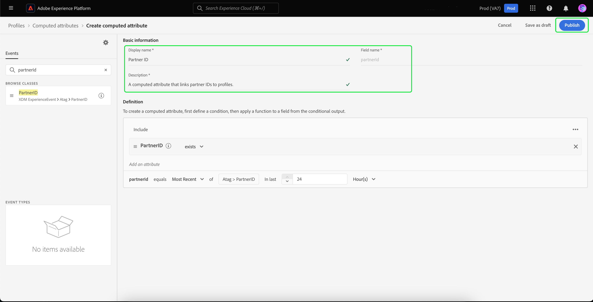

# 인증되지 않은 방문자에 대한 오프사이트 재타겟팅

>[!AVAILABILITY]
>
>이 기능은 Real-Time CDP(앱 서비스), Adobe Experience Platform Activation, Real-Time CDP, Real-Time CDP Prime, Real-Time CDP Ultimate에 라이선스를 부여한 고객이 사용할 수 있습니다. 이 패키지에 대한 자세한 내용은 [제품 설명](https://helpx.adobe.com/legal/product-descriptions.html)을 참조하고 Adobe 담당자에게 문의하십시오.

인증되지 않은 방문자의 대상을 작성하고 파트너가 제공한 영속성 ID를 사용하여 대상을 재타겟팅하는 방법에 대해 알아봅니다.

## 이 사용 사례를 고려해야 하는 이유 {#why-use-case}

서드파티 쿠키가 단계적으로 중단됨에 따라 디지털 마케터는 익명 방문자와 다시 참여하기 위한 전략을 재구상해야 합니다. 실시간 방문자 인식을 위해 ID 공급업체와 통합하도록 선택하는 브랜드는 오프사이트 유료 미디어 재타겟팅을 위해 파트너가 제공한 지속적인 식별자를 활용할 수도 있습니다.

많은 수의 트래픽에도 불구하고 많은 브랜드에서 전환 단계에서 상당한 감소가 발생합니다. 방문자는 콘텐츠 및 제품 데모를 진행하지만 등록하거나 구매하지 않고 종료됩니다.

마케팅 메시지를 개인화하기 위해 현장 참여를 기반으로 대상을 구축할 수 있을 뿐만 아니라, 파트너 ID에 대한 Adobe의 지원을 사용하여 유료 미디어 대상의 방문자와 다시 소통할 수 있습니다.

## 전제 조건 및 계획 {#prerequisites-and-planning}

인증되지 않은 방문자를 재타겟팅할 때에는 계획 프로세스 중에 다음 전제 조건을 고려하십시오.

- 적절한 ID 네임스페이스로 파트너 ID를 설정했습니까?

또한 사용 사례를 구현하기 위해 다음 Real-Time CDP 기능 및 UI 요소를 사용하게 됩니다. 이러한 모든 영역에 대해 필요한 속성 기반 액세스 제어 권한이 있는지 확인하거나 시스템 관리자에게 필요한 권한을 부여하도록 요청하십시오.

- [대상자](../../segmentation/home.md)
- [계산된 속성](../../profile/computed-attributes/overview.md)
- [대상](../../destinations/home.md)
- [Web SDK](../../edge/home.md)

## Real-Time CDP으로 파트너 데이터 가져오기 {#get-data-in}

인증되지 않은 방문자 대상을 만들려면 먼저 파트너 데이터를 Real-Time CDP으로 가져와야 합니다.

Web SDK를 사용하여 Real-Time CDP으로 데이터를 가장 잘 가져오는 방법에 대해 알아보려면 [데이터 관리 및 이벤트 데이터 수집 섹션](./onsite-personalization.md#data-management) 온사이트 개인화 사용 사례

## 파트너가 제공한 ID를 앞으로 가져오기 {#bring-partner-ids-forward}

파트너가 제공한 ID를 이벤트 데이터 세트로 가져온 후에는 이 데이터를 프로필 레코드로 가져와야 합니다. 계산된 속성을 활용하여 이 작업을 수행할 수 있습니다.

계산된 속성을 사용하면 프로필 동작 데이터를 프로필 수준에서 집계된 값으로 신속하게 변환할 수 있습니다. 따라서 프로필에 &quot;라이프타임 구매 합계&quot;와 같은 이러한 표현식을 사용하여 대상 내에서 계산된 속성을 쉽게 사용할 수 있습니다. 계산된 속성에 대한 자세한 내용은 [계산된 속성 개요](../../profile/computed-attributes/overview.md).

계산된 속성에 액세스하려면 다음을 선택합니다. **[!UICONTROL 프로필]** 뒤에 오는 **[!UICONTROL 계산된 속성]** 및 **[!UICONTROL 계산된 속성 만들기]**.

![다음 [!UICONTROL 계산된 속성 만들기] 버튼이 강조 표시된 부분은 [!UICONTROL 계산된 속성] 내의 탭 [!UICONTROL 프로필] 작업 영역.](../assets/offsite-retargeting/create-ca.png)

다음 **[!UICONTROL 계산된 속성 만들기]** 페이지가 나타납니다. 이 페이지에서는 구성 요소를 사용하여 계산된 속성을 생성할 수 있습니다.

>[!NOTE]
>
>계산된 속성 작성에 대한 자세한 내용은 [계산된 속성 UI 안내서](../../profile/computed-attributes/ui.md).

이 사용 사례에서는 파트너 ID가 있는 경우 지난 24시간 내에 파트너 ID의 가장 최근 값을 가져오는 계산된 속성을 만들 수 있습니다.

검색 창을 사용하여 &quot;Partner ID&quot; 이벤트를 찾아 계산된 속성 캔버스에 추가할 수 있습니다.

![다음 [!UICONTROL 이벤트] 탭과 검색 창이 강조 표시됩니다.](../assets/offsite-retargeting/ca-add-partner-id.png)

정의에 &quot;파트너 ID&quot; 이벤트를 추가한 후 이벤트 필터링 조건을 로 설정합니다. **[!UICONTROL 존재함]**, 이벤트 필터링 조건을 (으)로 설정합니다. **[!UICONTROL 가장 최근]** 추가된 파트너 ID의 값이며, 전환 확인 기간은 24시간입니다.

계산된 속성에 적절한 이름(예: &quot;Partner ID&quot;)과 설명을 지정한 다음 을 선택합니다. **[!UICONTROL 게시]** 를 눌러 계산된 속성 생성 프로세스를 완료합니다.

## 계산된 속성을 사용하여 대상자 만들기 {#create-audience}

계산된 속성을 만들었으므로 이제 이 계산된 속성을 사용하여 대상자를 만들 수 있습니다. 이 예에서는 이번 달에 5번 이상 웹 사이트를 방문했지만 아직 등록하지 않은 방문자로 구성된 대상을 만듭니다.

대상자를 만들려면 다음을 선택하십시오. **[!UICONTROL 대상]**, 그 다음 **[!UICONTROL 대상자 만들기]**.

![다음 [!UICONTROL 대상자 만들기] 버튼이 강조 표시됩니다.](../assets/offsite-retargeting/create-audience.png)

다음 중 하나를 선택하라는 대화 상자가 나타납니다. [!UICONTROL 대상자 구성] 및 [!UICONTROL 규칙 작성]. 선택 **[!UICONTROL 규칙 작성]** 뒤에 오는 **[!UICONTROL 만들기]**.

![다음 [!UICONTROL 규칙 작성] 버튼이 강조 표시됩니다.](../assets/offsite-retargeting/select-build-rule.png)

세그먼트 빌더 페이지가 나타납니다. 이 페이지에서는 구성 요소를 사용하여 대상을 구축할 수 있습니다.

>[!NOTE]
>
>세그먼트 빌더 사용에 대한 자세한 내용은 [세그먼트 빌더 UI 안내서](../../segmentation/ui/segment-builder.md).

이러한 방문자를 찾으려면 먼저 을 추가해야 합니다 **[!UICONTROL 페이지 보기]** 이벤트를 대상자에게 보냅니다. 다음 항목 선택 **[!UICONTROL 이벤트]** 아래의 탭 **[!UICONTROL 필드]**&#x200B;을(를) 클릭한 다음 을(를) 끌어다 놓습니다 **[!UICONTROL 페이지 보기]** 이벤트를 만들고 이벤트 섹션 캔버스에 추가합니다.

![다음 [!UICONTROL 이벤트] 의 탭 [!UICONTROL 필드] 섹션이 강조 표시되고 [!UICONTROL 페이지 보기]이벤트.](../assets/offsite-retargeting/add-page-view.png)

새로 추가된 항목 선택 **[!UICONTROL 페이지 보기]** 이벤트. 전환 확인 기간 변경 **[!UICONTROL 언제든지]** 끝 **[!UICONTROL 이번 달]**, 이벤트 규칙 을 포함하여 변경 **최소 5개**.

![추가된 세부 정보 [!UICONTROL 페이지 보기] 이벤트가 표시됩니다.](../assets/offsite-retargeting/edit-event.png)

이벤트를 추가한 후 속성을 추가해야 합니다. 인증되지 않은 방문자로 작업하므로 방금 만든 계산된 속성을 추가할 수 있습니다. 이렇게 새로 만든 계산된 속성을 사용하면 파트너 ID를 대상자에 연결할 수 있습니다.

계산된 속성을 추가하려면 **[!UICONTROL 속성]**, 선택 **[!UICONTROL XDM 개별 프로필]**, 그 다음 **[!UICONTROL _atag]**, **[!UICONTROL SystemComputedAttributes]**, 및 **[!UICONTROL PartnerID]**. 이제 **[!UICONTROL 값]** 캔버스의 속성 섹션에 대해 계산된 속성.

또한 다음을 검색하십시오. **[!UICONTROL 개인 이메일]** 및 추가 **[!UICONTROL 주소]** 아래 속성 **[!UICONTROL PartnerID]** 캔버스의 속성 섹션으로 이동합니다.

![다음 [!UICONTROL PartnerID] 계산된 속성 및 [!UICONTROL 개인 이메일 주소] 속성은 세그먼트 빌더 캔버스에서 강조 표시됩니다.](../assets/offsite-retargeting/added-attributes.png)

특성을 추가했으므로 해당 평가 기준을 설정해야 합니다. 대상 **[!UICONTROL PartnerID]**, 기준을 다음으로 설정 **[!UICONTROL 존재함]**, 및 **[!UICONTROL 주소]**, 기준을 다음으로 설정 **[!UICONTROL 존재하지 않음]**.

이제 파트너가 제공한 ID가 있지만 아직 사이트에 등록하지 않은 고강도 방문자를 찾는 대상을 성공적으로 만들었습니다. 대상자의 이름을 &quot;인증되지 않은 사용자 재타겟팅&quot;으로 지정하고 **[!UICONTROL 저장]** 대상자 만들기를 완료합니다.

## 대상자 활성화 {#activate-audience}

대상자를 성공적으로 만든 후 이제 이 대상자를 다운스트림 대상으로 활성화할 수 있습니다. 선택 **[!UICONTROL 대상]** 왼쪽 탐색 레일에서 새로 만든 대상을 찾고 줄임표 아이콘을 선택한 다음 을 선택합니다 **[!UICONTROL 대상에 활성화]**.

![다음 [!UICONTROL 대상에 활성화] 버튼이 강조 표시됩니다.](../assets/offsite-retargeting/activate-to-destination.png)

>[!NOTE]
>
>파일 기반 대상을 포함한 모든 대상 유형은 파트너 ID로 대상 활성화를 지원합니다.
>
>대상을 대상으로 활성화하는 방법에 대한 자세한 내용은 [활성화 개요](../../destinations/ui/activation-overview.md).

다음 **[!UICONTROL 대상 활성화]** 페이지가 나타납니다. 이 페이지에서 대상을 활성화할 대상을 선택할 수 있습니다. 선택한 대상을 선택한 후 다음을 선택합니다. **[!UICONTROL 다음]**.

다음 **[!UICONTROL 예약]** 페이지가 나타납니다. 이 페이지에서 대상을 활성화할 빈도를 결정하는 일정을 만들 수 있습니다. 선택 **[!UICONTROL 일정 만들기]** 대상 활성화에 대한 일정을 만듭니다.

![다음 [!UICONTROL 일정 만들기] 버튼이 강조 표시됩니다.](../assets/offsite-retargeting/select-create-schedule.png)

다음 [!UICONTROL 예약] 팝오버가 표시됩니다. 이 페이지에서 대상자 활성화 일정을 만들 수 있습니다. 예약을 구성한 후 다음을 선택합니다. **[!UICONTROL 만들기]** 계속합니다.

예약 세부 사항을 확인한 후 다음을 선택합니다. **[!UICONTROL 다음]**.

다음 **[!UICONTROL 속성 선택]** 페이지가 나타납니다. 이 페이지에서는 활성화된 대상과 함께 내보낼 속성을 선택할 수 있습니다. 이 경우 재타겟팅하려는 방문자를 식별할 수 있으므로 최소한 파트너 ID를 포함해야 합니다. 선택 **[!UICONTROL 새 매핑 추가]** 계산된 속성을 검색합니다. 필요한 속성을 추가한 후 을 선택합니다. **[!UICONTROL 다음]**.

![두 가지 모두 [!UICONTROL 새 매핑 추가] 버튼과 계산된 속성이 강조 표시됩니다.](../assets/offsite-retargeting/add-new-mapping.png)

다음 **[!UICONTROL 리뷰]** 페이지가 나타납니다. 이 페이지에서 대상자 활성화에 대한 세부 사항을 검토할 수 있습니다. 제공된 세부 정보가 만족스러우면 다음을 선택합니다. **[!UICONTROL 완료]**.

![다음 [!UICONTROL 리뷰] 대상자 활성화의 세부 정보를 보여주는 페이지가 표시됩니다.](../assets/offsite-retargeting/review-destination-activation.png)

이제 추가 재타겟팅을 위해 인증되지 않은 사용자의 대상을 다운스트림 대상으로 활성화했습니다.

## 기타 사용 사례 {#other-use-cases}

Real-Time CDP의 파트너 데이터 지원을 통해 활성화된 추가 사용 사례를 살펴볼 수 있습니다.

- [새로운 고객 참여 및 확보](./prospecting.md) 파트너 데이터를 사용합니다.
- [온사이트 경험 개인화](./offsite-retargeting.md) 파트너 지원 방문자 인식 사용.
- [자사 프로필 추가](./supplement-first-party-profiles.md) 와 함께 제공됩니다.
