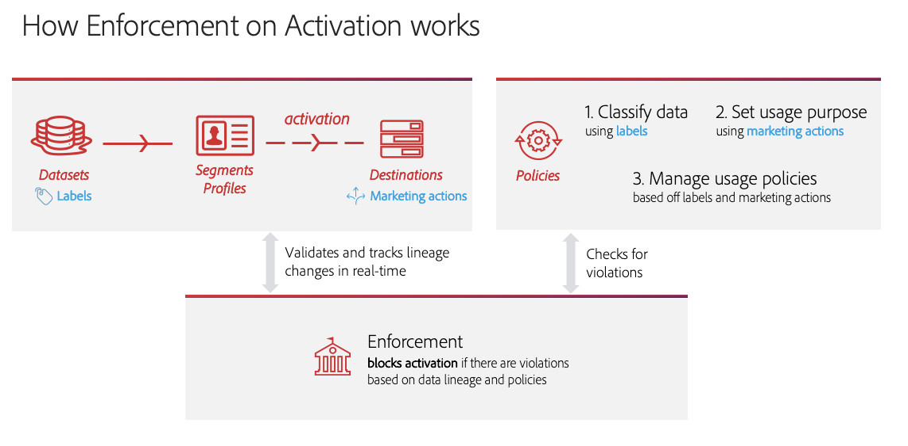

# [!DNL Data Governance] 실시간 CDP

[!DNL Real-time Customer Data Platform] (실시간 CDP)는 여러 엔터프라이즈 시스템의 데이터를 통합하여 마케터가 고객을 보다 효과적으로 식별, 이해 및 참여시킬 수 있도록 합니다. 이 데이터는 조직 또는 법률 규정에 의해 정의된 사용 제한 사항의 적용을 받을 수 있습니다. 따라서 데이터를 처리할 때 실시간 CDP가 사용 정책을 준수하도록 하는 것이 중요합니다.

Adobe Experience Platform [!DNL Data Governance] 를 사용하면 고객 데이터를 관리하고 데이터 사용에 적용되는 규정, 제한 사항 및 정책을 준수할 수 있습니다. 실시간 CDP에서 중요한 역할을 하는 Adobe Marketing Cloud를 사용하면 사용 정책을 정의하고, 해당 정책에 따라 데이터를 분류하고, 특정 마케팅 활동을 수행할 때 정책 위반을 확인할 수 있습니다.

실시간 CDP는 Adobe Experience Platform에 구축되어 있으므로 대부분의 [!DNL Data Governance] 기능이 문서에 [!DNL Experience Platform] 포함되어 있습니다. 이 문서는 실시간 CDP에서 사용할 수 있는 [데이터 거버넌스 개요를](../../data-governance/home.md) 보완하기 위한 [!DNL Experience Platform]것으로, 거버넌스 기능에 대한 개요를 설명합니다. 다음 주제를 다룹니다.

* [데이터에 사용 레이블 적용](#labels)
* [데이터 사용 정책 관리](#policies)
* [데이터 사용 규정 준수](#enforce-data-usage-compliance)

## 데이터에 사용 레이블 적용 {#labels}

[!DNL Data Governance] 데이터 세트 또는 데이터 세트 필드 수준에서 데이터에 사용 레이블을 적용할 수 있습니다. 데이터 사용 레이블을 사용하면 해당 데이터에 적용되는 사용 정책에 따라 데이터를 분류할 수 있습니다.

데이터 사용 레이블 작업에 대한 자세한 내용은 Adobe Experience Platform의 [데이터 사용 레이블 사용 안내서를](../../data-governance/labels/overview.md) 참조하십시오.

## 대상에 대한 마케팅 사용 사례 구성 {#destinations}

대상에 대한 마케팅 사용 사례(마케팅 작업이라고도 함)를 정의하여 대상에 대한 데이터 사용 제한을 설정할 수 있습니다. 대상에 대한 마케팅 사용 사례는 해당 대상으로 내보낼 데이터의 의도를 나타냅니다.

>[!NOTE]
>
>마케팅 작업 및 데이터 사용 정책에 대한 자세한 내용은 설명서의 [데이터 사용 정책 개요를](../../data-governance/policies/overview.md) 참조하십시오 [!DNL Experience Platform] .

대상에 대한 마케팅 사용 사례를 정의하면 해당 대상으로 전송된 프로필 또는 세그먼트가 데이터 사용 정책을 준수하도록 할 수 있습니다. 따라서 귀하의 조직에 따라 귀하의 대상에 적절한 마케팅 사용 사례를 추가하여 활성화 정책에 대한 제한을 시행해야 합니다.

처음 대상을 설정할 때만 마케팅 사용 사례를 선택할 수 있습니다. 작업 중인 대상 유형에 따라, 마케팅 사용 사례를 구성할 기회가 설정 워크플로우의 다른 지점에 나타납니다. 특정 대상을 구성하는 방법에 대한 단계는 [대상 설명서를](../destinations/destinations-overview.md) 참조하십시오.

## 데이터 사용 정책 관리 {#policies}

데이터 사용 레이블이 데이터 규정 준수를 효과적으로 지원하려면 데이터 사용 정책을 정의하고 활성화해야 합니다. 데이터 사용 정책은 실시간 CDP 내에서 데이터에 대해 수행하도록 허용되거나 제한된 마케팅 작업의 종류를 설명하는 규칙입니다. 자세한 내용은 [!DNL Experience Platform] 데이터 거버넌스 개요  의 &quot;데이터 사용 정책&quot; 섹션을 참조하십시오.

Adobe Experience Platform은 일반적인 고객 경험 사용 사례를 위한 몇 가지 핵심 정책을 제공합니다. 이러한 정책은 정책 작업 영역으로 이동한 후 **[!UICONTROL 찾아보기]** **[!UICONTROL 탭을 선택하여 UI에서 볼 수]** 있습니다. 자신만의 고유한 사용자 지정 정책을 만드는 방법을 포함하여 UI에서 정책 작업에 대한 자세한 단계는 [설명서의 정책 사용자 안내서를](../../data-governance/policies/user-guide.md) [!DNL Experience Platform] 참조하십시오.

## 데이터 사용 규정 준수 {#enforce-data-usage-compliance}

데이터가 레이블이 지정되고 사용 정책이 정의되면 데이터 사용 규정을 정책으로 적용할 수 있습니다. 실시간 CDP의 대상에 고객 세그먼트를 활성화할 때 위반이 발생하는 경우 [!DNL Data Governance] 자동으로 사용 정책을 적용합니다.

다음 다이어그램에서는 정책 실행이 세그먼트 활성화의 데이터 흐름에 어떻게 통합되는지를 보여 줍니다.

세그먼트가 처음 활성화되면 다음 요소를 기준으로 정책 위반을 [!DNL Policy Service] 확인합니다.

* 활성화할 세그먼트 내의 필드 및 데이터 세트에 적용되는 데이터 사용 레이블입니다.
* 대상의 마케팅 목적입니다.

>[!NOTE]
>
>데이터 세트 내의 특정 필드에만 적용된 데이터 사용 레이블이 있는 경우(전체 데이터 세트 아님) 활성화에서 이러한 필드 수준 레이블의 적용은 다음 조건에서만 발생합니다.
>* 세그먼트 정의에서 필드가 사용됩니다.
>* 필드는 대상 대상에 대한 예상 속성으로 구성됩니다.

### 정책 위반 메시지 {#enforcement}

세그먼트 활성화를 시도하는 동안 정책 위반이 발생하면(또는 이미 활성화된 세그먼트에 [편집](#policy-enforcement-for-activated-segments)) 작업이 금지되고 하나 이상의 정책이 위반되었음을 나타내는 팝업이 나타납니다. 팝업 왼쪽 열에서 정책 위반을 선택하여 해당 위반에 대한 세부 정보를 표시합니다.

포퍼의 **[!UICONTROL 세부]** 사항 탭은 위반을 트리거한 작업을 나타내며 위반이 발생한 이유를 나타내며 문제를 잠재적으로 해결하는 방법에 대한 제안을 제공합니다.

데이터 **[!UICONTROL 계보]** 를 클릭하여 데이터 레이블이 위반을 트리거한 대상, 세그먼트, 병합 정책 또는 데이터 세트를 추적합니다.

위반이 트리거되면 해당 구성 요소가 데이터 사용 정책을 준수하도록 업데이트될 때까지 **[!UICONTROL 저장]** 단추가 활성화용으로 비활성화됩니다.

### 활성화된 세그먼트에 대한 정책 실행 {#policy-enforcement-for-activated-segments}

정책 적용은 활성화된 후에도 세그먼트에 적용되므로 세그먼트 또는 대상에 대한 변경 사항을 제한하여 정책 위반을 초래합니다. 대상으로 세그먼트를 활성화하는 것과 관련된 다양한 구성 요소로 인해 다음 작업 중 어느 것이든 잠재적으로 위반이 발생할 수 있습니다.

* 데이터 사용 레이블 업데이트
* 세그먼트에 대한 데이터 집합 변경
* 세그먼트 설명 변경
* 대상 구성 변경

위의 작업 중 하나라도 위반이 발생하면 해당 작업을 저장할 수 없으며 정책 위반 메시지가 표시되므로 활성화된 세그먼트가 수정 시 데이터 사용 정책을 계속 준수하도록 합니다.

## 다음 단계

실시간 CDP의 주요 [!DNL Data Governance] 기능과 이를 [!DNL Experience Platform] 어떻게 활용할 수 있는지 살펴보려면 Adobe Experience Platform의 데이터 거버넌스 [설명서를 참조하십시오](../../data-governance/home.md). 이 설명서는 데이터 사용 레이블 및 정책 관리를 위한 단계별 워크플로우뿐만 아니라 기본 [!DNL Data Governance] 개념을 자세히 설명합니다.

다음 비디오에서는 대상에 대한 마케팅 사용 사례 및 다양한 시나리오를 위한 예제 워크플로우 등 실시간 CDP [!DNL Data Governance] 의 개요를 제공합니다.

>[!VIDEO](https://video.tv.adobe.com/v/33631?quality=12&learn=on)