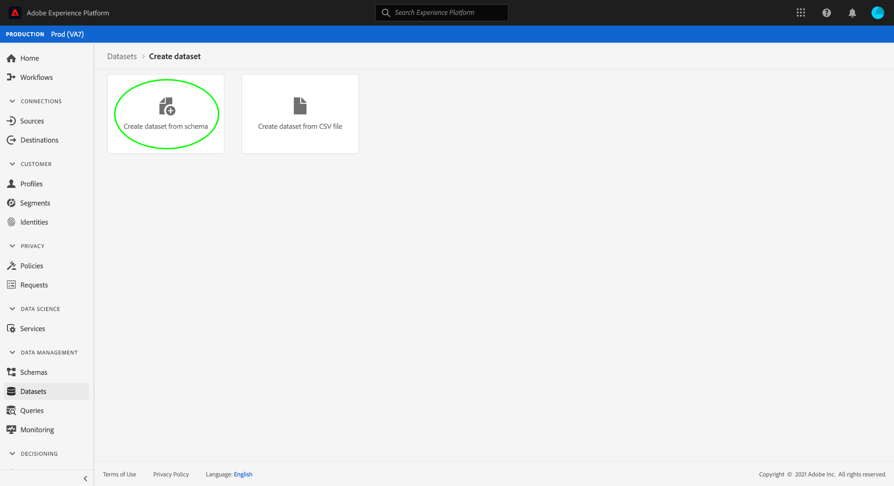

# IAB TCF 2.0 동의 데이터를 캡처하기 위한 데이터 집합 만들기

IAB [!DNL Real-time Customer Data Platform] (TCF) 2.0에 따라 고객 동의 데이터 [!DNL Transparency & Consent Framework] 를 처리하기 위해서는 TCF 2.0 동의 필드가 포함된 스키마로 해당 데이터를 보내야 합니다.

특히 TCF 2.0 동의 데이터를 캡처하려면 두 개의 데이터 세트가 필요합니다.

* 클래스를 기반으로 하는 데이터 집합 [!DNL XDM Individual Profile] 에서 사용할 수 있습니다 [!DNL Real-time Customer Profile].
* 클래스를 기반으로 한 데이터 [!DNL XDM ExperienceEvent] 집합입니다.

이 문서에서는 IAB TCF 2.0 동의 데이터를 수집하기 위해 이러한 두 데이터 세트를 설정하는 절차를 제공합니다. TCF 2.0을 구성하는 전체 워크플로우 [!DNL Real-time CDP] 에 대한 개요는 [IAB TCF 2.0 규정 준수 개요를 참조하십시오](./overview.md).

## 전제 조건

이 자습서에서는 다음 Adobe Experience Platform 구성 요소에 대해 작업해야 합니다.

* [XDM(Experience Data Model)](../../../xdm/home.md):고객 경험 데이터를 [!DNL Experience Platform] 구성하는 표준화된 프레임워크
   * [스키마 컴포지션의 기본 사항](../../../xdm/schema/composition.md):XDM 스키마의 기본 구성 요소에 대해 알아봅니다.
   * [UI에서 스키마 만들기](../../../xdm/tutorials/create-schema-ui.md):스키마 편집기 작업에 대한 기본 사항을 다루는 자습서입니다.
* [Adobe Experience Platform ID 서비스](../../../identity-service/home.md):다양한 디바이스와 시스템에서 서로 다른 데이터 소스에서 고객 ID를 연결할 수 있습니다.
* [실시간 고객 프로필](../../../profile/home.md):데이터 세트 [!DNL Identity Service] 에서 실시간으로 세부 고객 프로파일을 생성할 수 있습니다. [!DNL Real-time Customer Profile] 데이터 레이크에서 데이터를 가져와 별도의 데이터 저장소에 고객 프로파일을 유지합니다.

## 동의 스키마 구조 {#structure}

TCF 2.0 지원에 필요한 고객 동의 필드를 제공하는 두 개의 XDM 믹서가 있습니다.하나는 레코드 기반 데이터([!DNL XDM Individual Profile]) 및 다른 하나는 시간 시리즈 기반 데이터([!DNL XDM ExperienceEvent])입니다.

| 스키마 | 설명 |
| --- | --- |
| 프로필 개인 정보 혼합 | 이 혼합은 고객의 현재 동의 기호를 나타냅니다. 사용 가능한 스키마에서 사용될 경우, 이 혼합에서 제공된 값은 고객의 데이터에 동의 [!DNL Profile]실행이 적용되는 방법에 대한 진실의 소스로 사용됩니다. |
| [!DNL Experience Event] 프라이버시 혼합 | 이 믹스는 특정 시점에 고객의 동의 기호를 캡처합니다. 이러한 필드에서 캡처한 데이터는 시간의 경과에 따른 고객의 동의 환경 설정에서 변경 사항을 추적하는 데 사용할 수 있습니다. |

각 혼합의 사용 사례는 서로 다르지만, 그들이 제공하는 특정 필드는 대략적으로 동일합니다. 이러한 필드는 다음 섹션에 자세히 설명되어 있습니다.

### 동의 혼합 {#privacy-mixin}

각 개인 정보 결합은 구조 및 포함된 필드 유형에 따라 다르지만, 둘 다 속성을 제공하며, 이 속성 `xdm:consentString` 은 TCF 2.0 구현에 필요한 하위 필드가 필요합니다. 이러한 필드의 구조는 아래에서 예상 값 유형과 함께 표시됩니다.

```json
{
  "xdm:consentString": {
    "xdm:consentStandard": "IAB TCF",
    "xdm:consentStandardVersion": "2.0",
    "xdm:consentStringValue": "BObdrPUOevsguAfDqFENCNAAAAAmeAAA.PVAfDObdrA.DqFENCAmeAENCDA",
    "xdm:gdprApplies": true,
    "xdm:containsPersonalData": false
  }
}
```

| 속성 | 설명 |
| --- | --- |
| `xdm:consentString` | 고객의 업데이트된 동의 데이터 및 기타 컨텍스트 정보를 포함합니다. |
| `xdm:consentStandard` | 데이터가 적용되는 동의 프레임워크입니다. TCF 준수를 위해 값은 &quot;IAB TCF&quot;여야 합니다. |
| `xdm:consentStandardVersion` | 에 의해 표시된 동의 프레임워크의 버전 번호 `xdm:consentStandard`. TCF 2.0 준수 시 값은 &quot;2.0&quot;이어야 합니다. |
| `xdm:consentStringValue` | 고객이 선택한 동의 설정을 기반으로 생성된 동의 문자열. |
| `xdm:gdprApplies` | GDPR이 이 고객에게 적용되는지 여부를 나타내는 부울 값입니다. TCF 2.0 적용을 수행하려면 값을 &quot;true&quot;로 설정해야 합니다. 포함되지 않은 경우 기본값은 &quot;false&quot;입니다. |
| `xdm:containsPersonalData` | 동의 업데이트에 개인 데이터가 포함되어 있는지 여부를 나타내는 부울 값입니다. 포함되지 않은 경우 기본값은 &quot;false&quot;입니다. |

## 고객 동의 스키마 만들기 {#create-schemas}

플랫폼 UI에서 왼쪽 탐색 **[!UICONTROL 에서]** 스키마를 클릭하여 스키마 **[!UICONTROL 작업 영역을]** 엽니다. 여기에서 아래 섹션에 있는 단계에 따라 필요한 각 스키마를 만듭니다.

>[!NOTE]
>
>동의 데이터를 캡처하는 데 사용할 기존 XDM 스키마가 있는 경우 새 스키마를 생성하는 대신 해당 스키마를 편집할 수 있습니다. 그러나 기존 스키마를 편집할 때는 변경 사항을 깨뜨리지 않도록 스키마 진화의 [원칙을](../../../xdm/schema/composition.md#evolution) 따라야 합니다.

### 레코드 기반 동의 스키마 만들기 {#profile-schema}

스키마 작업 영역의 **[!UICONTROL 찾아보기]** 탭 ****[!DNL XDM Individual Profile] 에서클래스를 기반으로 새 스키마를 생성합니다. 스키마 편집기 내에서 스키마를 연 후에는 캔버스 왼쪽의 **[!UICONTROL 믹싱]** 섹션 아래에 있는 **[!UICONTROL 추가]** 를 클릭합니다.


[ **[!UICONTROL 혼합 추가]** ] 대화 상자가 나타납니다. 여기에서 목록에서 **[!UICONTROL 프로필 개인]** 정보를 선택합니다. 검색 막대를 사용하여 검색 결과의 범위를 좁혀 혼합을 더 쉽게 찾을 수 있습니다. 혼합을 선택하고 나면 [믹신 **[!UICONTROL 추가]를 클릭합니다]**.


스키마 편집기 캔버스가 다시 나타나면서 추가된 동의 문자열 필드의 구조를 검토할 수 있습니다.


여기에서 위의 단계를 반복하여 스키마에 다음과 같은 추가 믹스를 추가합니다.

* [!UICONTROL IdentityMap]
* [!UICONTROL 프로필에 대한 데이터 캡처 영역]
* [!UICONTROL 프로필 개인 정보]
* [!UICONTROL 프로필 개인 정보]


에서 이미 사용할 수 있도록 설정된 기존 스키마를 편집하는 경우 [!DNL Real-time Customer Profile]저장 **[!UICONTROL 을]** 클릭하여 변경 [사항을 확인한 다음 동의 스키마를 기반으로 데이터 세트](#dataset)를 만드는 섹션으로 건너뛸 수 있습니다. 새 스키마를 만드는 경우 아래 하위 섹션에 설명된 단계를 계속 따르십시오.

#### 스키마를 [!DNL Real-time Customer Profile]

수신한 동의 데이터 [!DNL Real-time CDP] 를 특정 고객 프로파일에 연결하려면 동의 스키마를 사용할 수 있어야 합니다 [!DNL Real-time Customer Profile].

>[!NOTE]
>
>이 섹션에 표시된 예제 스키마는 해당 `identityMap` 필드를 기본 ID로 사용합니다. 다른 필드를 기본 ID로 설정하려면, 전자 메일 주소와 같이 관심 기반 광고에 사용할 수 없는 직접 식별 가능 필드가 아닌 쿠키 ID와 같은 간접 식별자를 사용하고 있는지 확인하십시오. 어떤 분야가 제한되어 있는지 잘 모르는 경우에는 법률 상담원에게 문의하십시오.
>
>스키마에 대한 기본 ID 필드를 설정하는 방법은 [스키마 생성 자습서에서 확인할 수 있습니다](../../../xdm/tutorials/create-schema-ui.md#identity-field).

스키마를 활성화하려면 왼쪽 레일에 있는 스키마 이름 [!DNL Profile]을 클릭하여 오른쪽 레일에서 **[!UICONTROL 스키마 속성]** 대화 상자를 엽니다. 여기서 **[!UICONTROL 프로필]** 전환 단추를 클릭합니다.


누락된 기본 ID를 나타내는 팝업 창이 나타납니다. 기본 ID가 identityMap 필드에 포함되므로 대체 기본 ID를 사용하는 확인란을 선택합니다.

<br>

마지막으로 저장을 **[!UICONTROL 클릭하여]** 변경 사항을 확인합니다.


### 시간 시리즈 기반 동의 스키마 만들기 {#event-schema}

스키마 작업 영역의 **[!UICONTROL 찾아보기]** 탭 **** 에서 [!DNL XDM ExperienceEvent] 클래스를기반으로 새 스키마를생성합니다. 스키마 편집기 내에서 스키마를 연 후에는 캔버스 왼쪽의 **[!UICONTROL 믹싱]** 섹션 아래에 있는 **[!UICONTROL 추가]** 를 클릭합니다.


[ **[!UICONTROL 혼합 추가]** ] 대화 상자가 나타납니다. 여기에서 목록에서 **[!UICONTROL 경험 이벤트 개인 정보]** 조합을 선택합니다. 검색 막대를 사용하여 검색 결과의 범위를 좁혀 혼합을 더 쉽게 찾을 수 있습니다. 혼합을 선택하고 나면 [믹신 **[!UICONTROL 추가]를 클릭합니다]**.


추가된 동의 문자열 필드를 보여주는 스키마 편집기 캔버스가 다시 나타납니다.


여기에서 위의 단계를 반복하여 스키마에 다음과 같은 추가 믹스를 추가합니다.

* [!UICONTROL IdentityMap]
* [!UICONTROL ExperienceEvent 환경 세부 사항]
* [!UICONTROL ExperienceEvent 웹 세부 사항]
* [!UICONTROL ExperienceEvent 구현 세부 정보]

믹스가 추가되면 저장을 클릭하여 **[!UICONTROL 마칩니다]**.


## 동의 스키마를 기반으로 데이터 집합 만들기 {#datasets}

위에 설명된 각 필수 스키마에 대해 고객의 동의 데이터를 궁극적으로 수집하는 데이터 세트를 만들어야 합니다. 스키마를 기반 [!DNL XDM Individual Profile] 의 데이터 세트 [!DNL Real-time Customer Profile]는 사용하도록 설정되어야 하지만 [!DNL XDM ExperienceEvent] 스키마를 기반 데이터 세트를 [!DNL Profile]사용하도록 설정하면 안 됩니다.

시작하려면 왼쪽 탐색 **[!UICONTROL 에서 데이터]** 세트를 선택한 다음 **[!UICONTROL 오른쪽 위 모서리에서 데이터 세트]** 만들기를 클릭합니다.


다음 페이지에서 스키마에서 **[!UICONTROL 데이터 세트 만들기를 선택합니다]**.



스키마 **[!UICONTROL 선택 단계부터 시작되는 스키마에서]** 데이터 세트 **[!UICONTROL 만들기 워크플로우가]** 나타납니다. 제공된 목록에서 이전에 만든 동의 스키마 중 하나를 찾습니다. 선택적으로 검색을 사용하여 검색 결과를 좁히고 스키마를 더 쉽게 찾을 수 있습니다. 스키마 옆에 있는 라디오 단추를 클릭하여 선택한 다음 **[!UICONTROL 다음을]** 클릭하여 계속합니다.


데이터 세트 **[!UICONTROL 구성]** 단계가 나타납니다. 마침을 클릭하기 전에 데이터 세트에 대한 고유하고 쉽게 식별할 수 있는 이름 및 설명을 **[!UICONTROL 제공합니다]**.


새로 만든 데이터 세트에 대한 세부 사항 페이지가 나타납니다. 데이터 세트가 스키마를 기반으로 하는 경우 [!DNL XDM ExperienceEvent] 프로세스가 완료됩니다. 데이터 세트가 사용자 [!DNL XDM Individual Profile] 스키마를 기반으로 하는 경우 이 프로세스의 마지막 단계는 데이터 세트에 사용할 수 있도록 하는 것입니다 [!DNL Real-time Customer Profile]. 오른쪽 레일에서 **[!UICONTROL 프로필]** 전환 단추를 클릭하여 데이터 세트를 활성화합니다.


위 단계를 다시 수행하여 TCF 2.0 규정 준수에 필요한 다른 데이터 세트를 만듭니다.

## 다음 단계

이 튜토리얼을 따라 두 개의 데이터 세트를 만들어 고객 동의 데이터를 수집할 수 있습니다.

* 스키마를 [!DNL Profile]기반으로 하는 데이터 [!DNL XDM Individual Profile] 집합입니다.
* 사용할 수 없는 스키마를 [!DNL XDM ExperienceEvent] 기반으로 하는 데이터 집합입니다 [!DNL Profile].

이제 [IAB TCF 2.0 개요로](./overview.md#merge-policies) 돌아가 TCF 2.0 규정 준수를 위한 구성 프로세스를 계속할 [!DNL Real-time CDP] 수 있습니다.