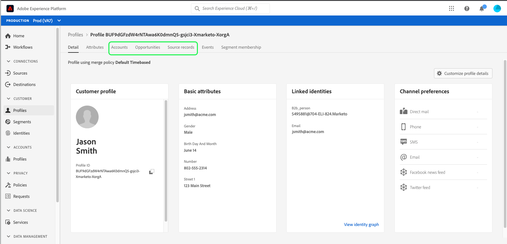

# Real-time Customer Data Platform에서 프로필 찾아보기

실시간 고객 프로파일은 온라인, 오프라인, CRM 및 서드파티 데이터를 비롯한 다양한 채널의 데이터를 취합하여 각 개별 고객을 전체적으로 파악할 수 있도록 합니다. 개별 프로필은 다양한 소스에서 시스템으로 가져온 데이터를 기반으로 집계되므로 각 프로필은 고객과 브랜드 간의 모든 상호 작용에 대해 실행 가능하고 타임스탬프가 지정된 계정이 됩니다.

Adobe Experience Platform 사용자 인터페이스 내에서 이러한 읽기 전용 프로필을 보고 환경 설정, 이전 이벤트, 상호 작용 및 개인이 속한 대상을 포함하여 각 개별 고객에 대한 중요한 정보를 볼 수 있습니다.

Adobe Real-time Customer Data Platform은 Adobe Experience Platform을 기반으로 구축되므로 Experience Platform UI의 프로필 보기 기능을 사용할 수 있습니다. Platform 사용자 인터페이스에서 고객 프로필을 보는 방법에 대한 자세한 지침은 [실시간 고객 프로필 사용 안내서](../../profile/ui/user-guide.md)를 참조하세요.

## Real-Time CDP, B2B 에디션에 대한 프로필 개선 사항

Adobe Experience Platform, Real-Time CDP, B2B 에디션 사용자가 지원하는 프로필 찾아보기 기능 외에도, 각각 [!UICONTROL 특성] 및 [!UICONTROL 이벤트] 탭에서 고객 프로필 내의 B2B 특성 및 이벤트에 액세스할 수 있습니다. B2B 데이터를 사용하여 세분화를 수행할 수도 있습니다. 이러한 대상은 B2B 대상이 아닌 대상과 함께 고객의 [!UICONTROL 대상자 멤버십] 탭에 표시됩니다.

Real-Time CDP, B2B 에디션을 사용하면 개별 고객과 연결된 엔터프라이즈 소스에서 [!UICONTROL 계정], [!UICONTROL 기회] 및 [!UICONTROL Source 레코드]를 찾아볼 수도 있습니다.

이러한 개선 사항을 살펴보려면 [실시간 고객 프로필 사용 안내서](../../profile/ui/user-guide.md)에 설명된 단계에 따라 시작하여 병합 정책 또는 ID 네임스페이스별로 프로필을 찾아보십시오.

프로필 세부 정보에는 고객 프로필에 제공된 표준 정보 외에 [!UICONTROL 계정], [!UICONTROL 기회] 및 [!UICONTROL Source 레코드] 탭에 대한 액세스가 포함되어 있으며 이 정보는 B2B 이벤트 및 특성으로도 향상되었습니다.

Platform UI에 제공된 프로필 세부 정보에 대한 자세한 내용은 프로필 대시보드 설명서의 [세부 정보 섹션](../../dashboards/guides/profiles.md#browse-profiles)을 참조하십시오.

### 계정 탭

프로필과 관련된 계정 목록을 보려면 **[!UICONTROL 계정]**&#x200B;을 선택하십시오. 이 목록에는 계정의 이름, 웹 사이트 및 업계와 같은 계정 프로필의 기본 정보와 계정 프로필에 대한 링크가 포함되어 있습니다.

계정 프로필 보기 및 탐색에 대한 자세한 내용은 [계정 프로필 개요](../accounts/account-profile-overview.md)를 읽는 것부터 시작하십시오.

### 기회 탭

**[!UICONTROL 기회]** 탭에는 계정과 관련된 개설 및 마감 기회와 관련된 세부 정보가 제공됩니다. 이러한 기회는 여러 소스의 Experience Platform으로 수집될 수 있지만, Real-Time CDP, B2B 에디션을 통해 마케터는 이러한 모든 기회를 한 곳에서 함께 볼 수 있습니다.

각 영업 기회는 영업 기회의 이름, 금액, 단계, 영업 기회의 개설 여부, 마감 여부, 성공 여부, 손실 여부 등의 정보를 포함합니다.

### Source 레코드 탭

**[!UICONTROL Source 레코드]** 탭을 사용하면 단일 고객 프로필에 기여하는 엔터프라이즈 소스에서 가져온 여러 소스 레코드를 쉽게 볼 수 있습니다. [!UICONTROL 개인 원본 키] 및 전자 메일 주소 외에도 각 원본 레코드는 원본뿐만 아니라 레코드 종류(예: &quot;연락처&quot; 또는 &quot;잠재 고객&quot; 레코드)도 제공합니다.

