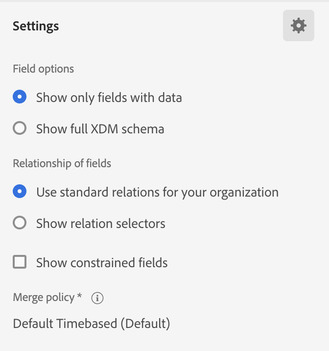
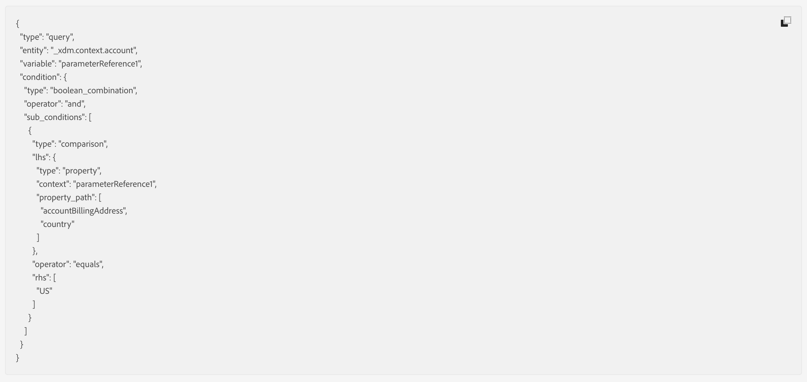
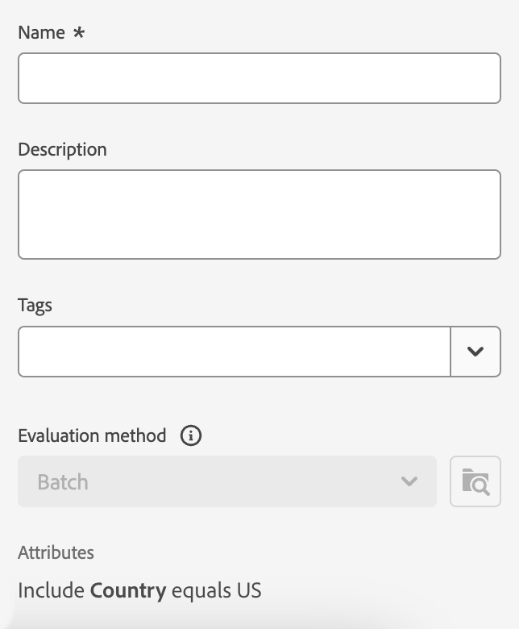

# Real-Time Customer Data Platform의 Audience Builder

Adobe Experience Platform 위에 구축된 [!DNL Adobe Real-Time Customer Data Platform]은(는) [!DNL Experience Platform]의 일부인 전체 Audience Builder 기능을 사용할 수 있습니다. 작업 공간에서는 데이터 속성을 표시하는 데 사용되는 드래그 앤 드롭 타일과 같은 규칙을 작성하고 편집할 수 있는 직관적인 컨트롤을 제공합니다.

{zoomable="yes"}

## 필드 {#fields}

>[!CONTEXTUALHELP]
>id="platform_b2b_audiencebuilder_showfullxdmschema"
>title="전체 XDM 스키마 표시"
>abstract="기본적으로 데이터가 포함된 필드만 표시됩니다. XDM 스키마의 모든 필드를 표시하려면 이 옵션을 활성화합니다."

>[!CONTEXTUALHELP]
>id="platform_b2b_audiencebuilder_showrelationselectors"
>title="관계 선택기 표시"
>abstract="기본적으로 조직의 표준 관계가 사용됩니다. 사용된 관계 선택기를 표시하려면 이 옵션을 활성화합니다."

>[!CONTEXTUALHELP]
>id="platform_b2b_audiencebuilder_showconstrainedfields"
>title="제한된 필드 표시"
>abstract="기본적으로 필드에 제한이 없는 필드만 표시됩니다. 제한이 있는 필드를 표시하려면 이 옵션을 활성화하십시오."

계정에 대해 대상 빌더를 사용할 때 계정 속성이나 기존 대상을 대상의 필드로 사용할 수 있습니다.

을 선택하여 표시되는 필드에 대한 설정을 조정할 수 있습니다.

{zoomable="yes"}

>[!NOTE]
>
>**[!UICONTROL 필드 옵션]** 섹션은 현재 베타 버전이며 일부 고객만 사용할 수 있습니다. 자세한 내용은 Adobe 고객 지원 센터에 문의하십시오.

[!UICONTROL 설정] 섹션이 표시됩니다. 이 섹션에서는 표시되는 필드와 필드의 관계를 업데이트할 수 있습니다.

**[!UICONTROL 필드 옵션]**&#x200B;의 경우 데이터가 포함된 필드 또는 전체 XDM 스키마만 표시할 수 있습니다.

**[!UICONTROL 필드의 관계]**&#x200B;에 대해 조직의 표준 관계를 사용하거나 관계 선택기를 표시할 수 있습니다.

{width="300"}

### 속성 {#attributes}

[!UICONTROL 특성] 탭을 사용하여 XDM 비즈니스 계정 클래스에 속하는 계정 특성과 영업 기회 및 사용자 기반 특성을 찾아볼 수 있습니다. 각 폴더를 확장하여 추가 특성을 표시할 수 있습니다. 여기서 각 특성은 작업 영역의 중앙에 있는 [규칙 빌더 캔버스](#rule-builder-canvas)(으)로 끌 수 있는 타일입니다.

특성을 선택할 때 [정보 아이콘](../../images/icons/info.png)을 선택하면 요약 데이터를 볼 수 있습니다. 요약 데이터에는 최상위 값, 필드에 대한 설명, 그리고 이 속성에 대한 값이 포함된 계정의 백분율 등의 정보가 포함됩니다.

{width="300"}

특성이 계정의 25% 미만으로 채워지는 경우 대신 이 표시됩니다. 속성에 관계없이 동일한 요약 데이터가 표시됩니다.

{width="300"}

>[!NOTE]
>
>요약 데이터는 속성이 Account, Person 또는 Opportunity 스키마에 속하는 경우에만 사용할 수 있습니다. 또한 필드가 **not**&#x200B;에 너무 많은 다른 값을 포함하고 해당 필드의 값이 일반적으로 반복되는 경우에만 맨 위 값이 표시됩니다.
>
>이 요약 데이터는 **일별**&#x200B;로 업데이트됩니다.

대상 빌더에 대한 자세한 안내서는 [대상 빌더 사용 안내서](../../segmentation/ui/segment-builder.md){target="_blank"}를 참조하십시오.

### 대상자 {#audiences}

**[!UICONTROL 대상]** 탭에는 Experience Platform에서 사용할 수 있는 모든 사용자 기반 및 계정 기반 대상이 나열됩니다.

대상자 옆에 있는  위로 마우스를 가져가면 해당 ID, 설명 및 폴더 계층 구조를 포함하여 대상자에 대한 정보를 볼 수 있습니다.

{zoomable="yes"}

## 규칙 빌더 캔버스 {#rule-builder-canvas}

Audience Builder에서 만든 대상은 대상 대상의 주요 특성 또는 동작을 설명하는 데 사용되는 규칙 컬렉션입니다. 이러한 규칙은 Audience Builder의 중앙에 있는 규칙 빌더 캔버스를 사용하여 만들어집니다.

세그먼트 정의에 새 규칙을 추가하려면 **[!UICONTROL 필드]** 탭에서 타일을 드래그하여 규칙 빌더 캔버스에 놓습니다.

{zoomable="yes"}

규칙 빌더 캔버스 사용에 대한 자세한 내용은 [세그먼트 빌더 설명서](../../segmentation/ui/segment-builder.md#rule-builder-canvas){target="_blank"}를 참조하세요.

### 컨테이너 {#containers}

대상 규칙은 나열된 순서로 평가됩니다. 컨테이너를 사용하여 중첩된 쿼리를 사용하여 실행 순서를 보다 세밀하게 제어할 수 있습니다.

컨테이너에 대한 자세한 내용은 [세그먼트 빌더 설명서](../../segmentation/ui/segment-builder.md#containers){target="_blank"}를 참조하세요.

## 대상자 속성 {#properties}

**[!UICONTROL 대상 속성]** 섹션에는 예상 대상 크기를 포함하여 대상에 대한 정보가 표시됩니다. 이름, 설명 및 태그를 포함하여 대상에 대한 세부 사항을 지정할 수도 있습니다.

{width="300"}

**[!UICONTROL 자격 있는 계정]**&#x200B;은(는) 대상자의 규칙과 일치하는 실제 계정 수를 나타냅니다. 이 숫자는 세그먼테이션 작업이 실행된 후 24시간마다 업데이트됩니다.

**[!UICONTROL 예상 계정]**&#x200B;은(는) 샘플 작업의 대략적인 계정 수를 나타냅니다. 새 규칙이나 조건을 추가하고 **[!UICONTROL 예상 새로 고침]**&#x200B;을 선택한 후 이 값을 업데이트할 수 있습니다.

{width="300"}

**[!UICONTROL 계정 보기]**&#x200B;를 선택하여 현재 규칙으로 대상자에 적합한 계정 샘플을 볼 수 있습니다.

{width="300"}

**[!UICONTROL 코드 보기]**&#x200B;에서는 대상 규칙에 대한 텍스트 기반 코드 설명을 제공합니다.

**[!UICONTROL 액세스 레이블 적용]**&#x200B;을 선택하여 대상에 대한 관련 액세스 레이블을 적용할 수 있습니다. 액세스 레이블에 대한 자세한 내용은 [레이블 관리 가이드](../../access-control/abac/ui/labels.md){target="_blank"}에서 확인할 수 있습니다.

나머지 대상자 속성 섹션에서는 이름, 설명 및 태그를 포함하여 계정 대상자와 관련된 세부 사항을 편집할 수 있습니다.

{width="300"}

모든 계정 대상은 배치 세분화를 사용하여 평가되므로 **계정 대상의 평가 방법을 변경할 수 없습니다**.

## 다음 단계 {#next-steps}

Audience Builder는 XDM 비즈니스 계정 데이터에서 대상을 만들 수 있는 풍부한 워크플로우를 제공합니다.

고객 프로필 데이터에 대한 세분화 서비스에 대한 자세한 내용은 [세분화 서비스 개요](../../segmentation/home.md){target="_blank"}를 참조하세요.
