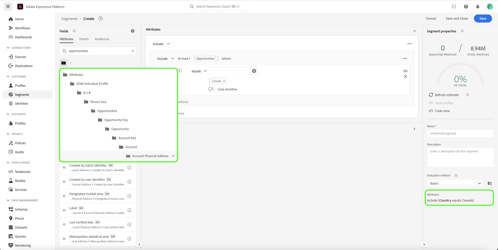
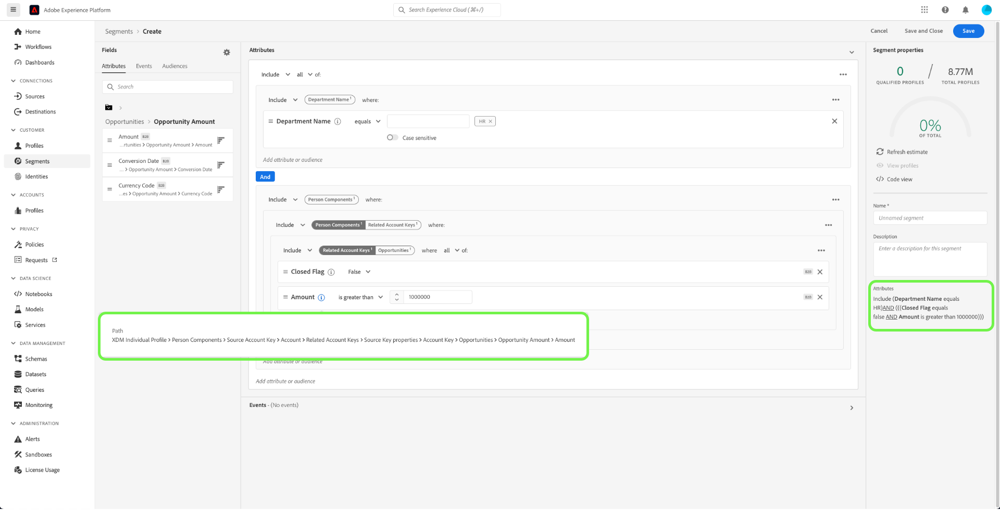

# Real-time Customer Data Platform B2B 에디션에 대한 세그멘테이션 사용 사례

이 문서에서는 Adobe Real-time Customer Data Platform B2B 에디션의 세그먼트 정의의 예제와 일반적인 B2B 사용 사례에 대해 다양한 유형의 속성을 결합하는 방법을 제공합니다. 대상이 B2B 워크플로우에 어떻게 적합한지 이해하려면 다음을 참조하십시오. [전체 튜토리얼](../b2b-tutorial.md#create-a-segment-to-evaluate-your-data).

>[!NOTE]
>
>이러한 세그먼테이션 사용 사례에 필요한 속성은 Real-time Customer Data Platform B2B 에디션 고객만 사용할 수 있습니다. Real-time Customer Data Platform B2B 에디션을 사용하지 않는 경우 [세그먼테이션 개요](./segmentation-overview.md) 대신,

## 전제 조건 {#prerequisites}

B2B 클래스에 대한 세분화 속성을 사용하려면 먼저 다음 단계를 완료해야 합니다.

1. B2B 클래스를 사용하는 스키마를 만듭니다. B2B 에디션 클래스에는 계정, 캠페인, 기회, 마케팅 목록 등이 포함됩니다. 다음에 대한 정보: [b2B 클래스에서 사용할 스키마를 설정하는 방법](../schemas/b2b.md) 스키마 설명서 를 참조하십시오.
1. XDM(Experience Data Model) B2B 스키마 간의 관계를 만듭니다. B2B 에디션 속성을 기반으로 하는 세그먼트는 확장된 B2B 세그멘테이션 기능을 완전히 사용하기 위해 클래스 간의 관계가 필요합니다. 다음에서 설명서를 참조하십시오. [두 B2B 스키마 간의 관계를 정의하는 방법](../../xdm/tutorials/relationship-b2b.md) 추가 정보.
1. B2B 스키마를 기반으로 데이터 세트를 사용하여 데이터를 수집합니다. 다음에 대한 소스 설명서 를 참조하십시오. [데이터 수집 방법에 대한 정보](../../sources/connectors/adobe-applications/marketo/marketo.md).
1. 읽기 [세그먼트 빌더 사용 안내서](../../segmentation/ui/segment-builder.md) 대상자를 만드는 방법에 대한 자세한 지침을 보려면 여기를 클릭하십시오.

이러한 요구 사항이 충족되면 일반적인 B2B 사용 사례에 대해 이러한 속성을 결합할 수 있습니다.

## 시작하기 {#getting-started}

B2B 클래스에 대한 결합 스키마가 관계를 설정하고 데이터를 수집하는 데 사용되면 해당 속성을 세그먼트 빌더의 왼쪽 레일에서 사용할 수 있게 됩니다.

B2B 클래스와 해당 특성은 `B2B` 세그멘테이션 작업 영역 내에 레이블을 지정하여 Real-time Customer Data Platform 내에서 표준으로 사용할 수 있는 레이블과 구별합니다.

B2B 사용 사례에 대한 대상을 효과적으로 만들려면 스키마에 대한 자세한 지식을 갖추고 데이터 모델이 어떻게 표시되는지 이해하는 것이 중요합니다. 또한 데이터가 한 데이터 객체에서 다른 데이터 객체로 이동하는 경로를 인식하는 것이 유용합니다.

아래 이미지는 Real-Time CDP B2B 에디션에서 사용할 수 있는 B2B 클래스 간의 관계를 보여 줍니다.

데이터 모델은 복잡할 수 있으므로, 사용 사례에 대한 관련 속성을 찾는 데 도움이 되도록 Platform UI를 사용하여 데이터 모델에 대한 보다 자세한 시각적 표현을 볼 수 있습니다. 시작하려면 Platform UI로 이동한 다음 왼쪽 탐색에서 스키마 를 선택합니다.

사용 가능한 목록에서 적절한 스키마를 선택하고 [!UICONTROL 컴포지션] 사이드 레일. 아래 예에서 &quot;사람&quot; 관계를 선택하면 현재 스키마에서 관련 &quot;사람&quot; 스키마를 참조하거나(관계의 소스 스키마인 경우) &quot;사람&quot; 스키마에서 참조한(관계의 참조 스키마인 경우) 속성이 표시됩니다.

이 관계는 를 사용하여 세그먼트 빌더 내에 반영됩니다. `Key` 아래 이미지에 표시된 폴더입니다.

다음을 참조하십시오. [Real-time Customer Data Platform B2B 에디션 설명서의 스키마](../schemas/b2b.md) 사용 가능한 B2B 클래스에 대한 자세한 정보를 제공합니다.

아래 사용 사례에서는 이러한 결과를 얻기 위해 서로 다른 스키마 간의 관계를 설정하는 데 사용되는 클래스에 대한 정보를 제공합니다. 이러한 예제를 사용하여 고유한 세그먼트를 만들 수 있습니다.

## 다양한 세분화 사용 사례의 예 {#use-cases}

B2B 에디션을 사용한 세그멘테이션에 다음 사용 사례를 사용할 수 있습니다. 각 예는 대상자가 수행하는 작업과 이 대상자를 만드는 데 사용되는 클래스에 대한 설명을 제공합니다. 제공된 이미지는에서 파일 경로를 강조 표시합니다 [!UICONTROL 속성] 스키마 구조를 반영하는 사이드 레일. 다음 [!UICONTROL 세그먼트 속성] 디스플레이 오른쪽의 섹션에는 대상자의 속성에 대한 서면 분류가 포함되어 있습니다.

### 예제 1: B2B 기회에 대한 &quot;의사 결정자&quot; 찾기 {#find-decision-maker}

모든 기회의 &quot;의사 결정자&quot;인 모든 사람을 찾습니다. 이 대상자에는 다음 사이에 링크가 필요합니다. [!UICONTROL XDM 개별 프로필] 클래스 및 [!UICONTROL XDM 비즈니스 영업 기회 사용자 관계] 클래스.

### 예 2: 특정 달러 금액 이상의 기회에 지정된 B2B 프로필 찾기 {#find-opportunities-amount}

영업 기회 금액이 지정된 금액(100만 달러)보다 많은 영업 기회에 직접 할당된 모든 직원을 찾습니다. 이 대상자에는 다음 사이에 링크가 필요합니다. [!UICONTROL XDM 개별 프로필] 클래스, [!UICONTROL XDM 비즈니스 영업 기회 사용자 관계] 클래스 및 [!UICONTROL XDM 비즈니스 영업 기회] 클래스.

### 예제 3: 위치별로 기회에 지정된 B2B 프로필 찾기 {#find-opportunities-location}

계정이 지정된 위치(캐나다)에 있는 기회에 직접 할당된 모든 직원을 찾습니다. 이 대상자에는 다음 사이에 링크가 필요합니다. [!UICONTROL XDM 개별 프로필] 클래스, [!UICONTROL XDM 비즈니스 영업 기회 사용자 관계] 클래스, [!UICONTROL XDM 비즈니스 영업 기회] 클래스 및 [!UICONTROL XDM 비즈니스 계정] 클래스.

### 예제 4: 업계 및 탐색 행동별 기회에 대한 &quot;의사 결정자&quot; 찾기 {#find-industry-browsing-behavior}

계정이 &quot;금융&quot; 업계에 있고 지난 3일 동안 가격 책정 페이지를 방문한 모든 기회의 &quot;의사 결정자&quot;인 모든 사람을 찾습니다. 이 대상자에는 다음 사이에 링크가 필요합니다. [!UICONTROL XDM 개별 프로필] 클래스, [!UICONTROL XDM 비즈니스 영업 기회 사용자 관계] 클래스, [!UICONTROL XDM 비즈니스 영업 기회] 클래스 및 [!UICONTROL XDM 비즈니스 계정] 클래스 및 [!UICONTROL XDM ExperienceEvent] 클래스.

### 예 5: 부서명 및 기회 금액별로 기회에 대한 B2B 프로파일 찾기 {#find-department-opportunity-amount}

HR(인사 관리) 부서에서 근무하며 주어진 금액(100만 달러) 이상의 가치를 지닌 영업 기회가 하나 이상 개설된 계정을 보유한 모든 직원을 찾습니다. 이 대상자에는 다음 사이에 링크가 필요합니다. [!UICONTROL XDM 개별 프로필] 클래스, [!UICONTROL XDM 비즈니스 계정] 클래스 및 [!UICONTROL XDM 비즈니스 영업 기회] 클래스.

### 예 6: 직책 및 연간 계정 매출액별로 B2B 프로필 찾기 {#find-by-job-title-and-revenue}

직함이 부사장이고 연간 매출액(1억 달러) 이상의 계정이 있으며 지난 달에 최소 3번 가격 책정 페이지를 방문한 적이 있는 사람을 모두 찾아보십시오. 이 대상자에는 다음 사이에 링크가 필요합니다. [!UICONTROL XDM 개별 프로필] 클래스, [!UICONTROL XDM 비즈니스 계정] 클래스 및 [!UICONTROL XDM ExperienceEvent] 클래스.

### 예 7: 기회 상태 및 탐색 행동별로 &quot;의사 결정자&quot; 찾기 {#find-by-opportunity-status-and-browsing-behavior}

종결된 영업 기회의 &quot;의사 결정자&quot;이며 지난 주에 가격 책정 페이지를 방문한 모든 사람을 찾습니다. 이 대상자에는 다음 사이에 링크가 필요합니다. [!UICONTROL XDM 개별 프로필] 클래스, [!UICONTROL XDM 비즈니스 영업 기회 사용자 관계] 클래스, [!UICONTROL XDM 비즈니스 영업 기회] 클래스 및 [!UICONTROL XDM ExperienceEvent] 클래스.

### 예제 8: 관련 계정을 사용하여 세그멘테이션 도달 범위 확장 {#related-accounts}

HR(인사) 부서에서 근무하며 모든 계정과 관련된 모든 인력을 찾습니다 *또는 계정의 관련 계정 중 하나* 지정된 금액(100만 달러) 또는 그 이상의 가치가 있는 기회가 최소 한 번 열려 있습니다. 이 대상자에는 다음 사이에 링크가 필요합니다. [!UICONTROL XDM 개별 프로필] 클래스, [!UICONTROL XDM 비즈니스 계정] 클래스 및 [!UICONTROL XDM 비즈니스 영업 기회] 클래스.

### 예 9: 리드 점수 및/또는 계정 점수를 사용하여 프로필 평가 {#account-scoring}

리드 점수가 80이 넘는 모든 프로필을 찾습니다.

### 예 10: 상위 조직이 특정 달러 금액 이상의 매출을 갖는 계정과 연결된 B2B 프로필 찾기 {#find-parent-org-amount}

상위 조직의 매출이 지정된 금액(100,000,000달러)보다 많은 계정과 연결된 모든 사람을 찾습니다.

### 예 11: 활성 관계가 있는 직책 및 계정 이름별로 B2B 프로필 찾기 {#find-by-job-title-and-account-name}

계정 관계가 &quot;활성&quot;인 계정 &quot;Acme&quot;에서 &quot;관리자&quot;인 모든 사람을 찾습니다.

### 예 12: actualCost가 budgetedCost를 초과하는 캠페인을 대상으로 하는 B2B 프로필 찾기 {#find-actualcost-exceed-budgetcost}

actualCost가 budgetedCost를 초과하는 캠페인의 타겟이 되는 모든 사람을 찾습니다.

### 예 13: Marketo 정적 목록 및 isDeleted=false에 속하는 B2B 프로필 찾기 {#find-marketo-static-list}

Marketo 정적 목록 &quot;Anniversary users&quot;에 속하는 모든 사람을 찾습니다. 여기서 isDeleted=false입니다.

## 다음 단계 {#next-steps}

이 개요를 읽고 나면 이제 Real-Time CDP, B2B Edition을 사용하여 사용할 수 있는 세분화 가능성에 대해 이해할 수 있습니다. 세분화 서비스에 대한 자세한 내용은 [세그먼테이션 설명서](../../segmentation/home.md).
