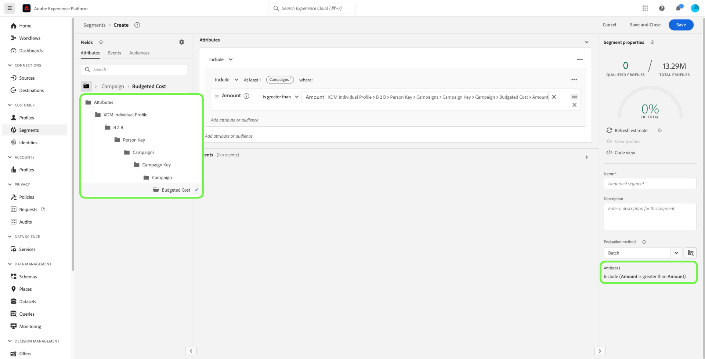
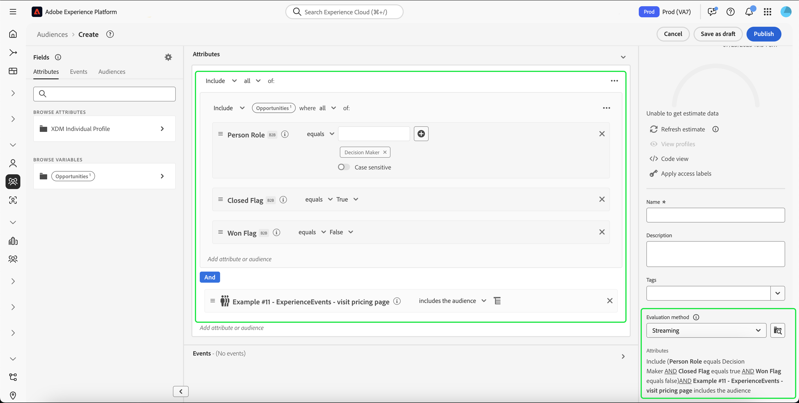

# Real-Time Customer Data Platform B2B edition에 대한 세그멘테이션 사용 사례

이 문서에서는 Adobe Real-Time Customer Data Platform B2B edition의 세그먼트 정의의 예제와 일반적인 B2B 사용 사례에 대해 다양한 유형의 속성을 결합하는 방법을 제공합니다. 대상이 B2B 워크플로우에 어떻게 적합한지 이해하려면 [전체 튜토리얼](../b2b-tutorial.md#create-a-segment-to-evaluate-your-data)을 참조하세요.

>[!NOTE]
>
>이러한 세그먼테이션 사용 사례에 필요한 속성은 Real-Time Customer Data Platform B2B edition 고객만 사용할 수 있습니다. Real-Time Customer Data Platform B2B edition을 사용하지 않는 경우 대신 [세그먼테이션 개요](./segmentation-overview.md)를 참조하세요.

>[!BEGINSHADEBOX]

## 병합 정책 변경

Real-Time CDP B2B edition 아키텍처로 업그레이드할 때 B2B 특성이 있는 다중 엔티티 대상은 이제 여러 병합 정책 대신 단일 병합 정책(기본 병합 정책)만 지원합니다. 또한 프로필이 대상자에 적합할 수 있는 변경 사항은 활성화, 여정 오케스트레이션 및 캠페인 타겟팅과 같은 다운스트림 워크플로에 영향을 줄 수 있습니다. 데이터가 예상대로 작동하는지 확인하려면 다음을 수행하는 것이 좋습니다.

- 기본이 아닌 병합 논리를 사용하는 모든 대상을 검토하고 테스트하여 이 업데이트의 잠재적 영향을 이해합니다.
- 병합 로직의 변경 사항이 자격에 영향을 미칠 수 있는지 파악하려면 주요 대상의 대상 자격 기준을 다시 평가하십시오.
- 활성화 결과를 모니터링하여 병합 정책 변경으로 인한 대상 변경 사항을 감지합니다.

>[!ENDSHADEBOX]

## 전제 조건 {#prerequisites}

B2B 클래스에 대한 세분화 속성을 사용하려면 먼저 다음 단계를 완료해야 합니다.

1. B2B 클래스를 사용하는 스키마를 만듭니다. B2B edition 클래스에는 계정, 캠페인, 영업 기회, 마케팅 목록 등이 포함됩니다. [B2B 클래스에서 사용할 스키마를 설정하는 방법](../schemas/b2b.md)에 대한 자세한 내용은 스키마 설명서를 참조하십시오.
2. XDM(Experience Data Model) B2B 스키마 간의 관계를 만듭니다. B2B edition 특성을 기반으로 하는 대상은 확장된 B2B 세그멘테이션 기능을 완전히 사용하기 위해 클래스 간의 관계가 필요합니다. 자세한 내용은 [두 B2B 스키마 간의 관계를 정의하는 방법](../../xdm/tutorials/relationship-b2b.md)에 대한 설명서를 참조하십시오.
3. B2B 스키마를 기반으로 데이터 세트를 사용하여 데이터를 수집합니다. [데이터 수집 방법에 대한 정보](../../sources/connectors/adobe-applications/marketo/marketo.md)는 소스 설명서를 참조하세요.
4. 대상을 만드는 방법에 대한 자세한 지침은 [세그먼트 빌더 사용 안내서](../../segmentation/ui/segment-builder.md)를 참조하세요.

이러한 요구 사항이 충족되면 일반적인 B2B 사용 사례에 대해 이러한 속성을 결합할 수 있습니다.

## 시작 {#getting-started}

B2B 클래스에 대한 결합 스키마가 관계를 설정하고 데이터를 수집하는 데 사용되면 해당 속성을 세그먼트 빌더의 왼쪽 레일에서 사용할 수 있게 됩니다.

B2B 클래스와 해당 특성은 Real-Time Customer Data Platform 내에서 표준으로 사용할 수 있는 클래스와 구별하기 위해 Segmentation 작업 영역 내에 `B2B` 레이블과 함께 추가됩니다.

B2B 사용 사례에 대한 대상을 효과적으로 만들려면 스키마에 대한 자세한 지식을 갖추고 데이터 모델이 어떻게 표시되는지 이해하는 것이 중요합니다. 또한 데이터가 한 데이터 객체에서 다른 데이터 객체로 이동하는 경로를 인식하는 것이 유용합니다.

아래 이미지는 Real-Time CDP B2B edition 내에서 사용할 수 있는 B2B 클래스 간의 관계를 보여 줍니다.

데이터 모델은 복잡할 수 있으므로, 사용 사례에 대한 관련 속성을 찾는 데 도움이 되도록 Platform UI를 사용하여 데이터 모델에 대한 보다 자세한 시각적 표현을 볼 수 있습니다. 시작하려면 Platform UI로 이동한 다음 왼쪽 탐색에서 스키마 를 선택합니다.

사용 가능한 목록에서 적절한 스키마를 선택하고 [!UICONTROL 컴포지션] 쪽 레일에서 적절한 관계를 선택합니다. 아래 예에서 &quot;사람&quot; 관계를 선택하면 현재 스키마에서 관련 &quot;사람&quot; 스키마를 참조하거나(관계의 소스 스키마인 경우) &quot;사람&quot; 스키마에서 참조한(관계의 참조 스키마인 경우) 속성이 표시됩니다.

스키마 작업 영역에서 사람 관계를 사용하는 

이 관계는 아래 이미지에 표시된 대로 `Key` 폴더를 사용하여 세그먼트 빌더 내에 반영됩니다.

사용 가능한 B2B 클래스에 대한 자세한 내용은 Real-Time Customer Data Platform B2B edition 설명서의 [스키마](../schemas/b2b.md)를 참조하십시오.

아래 사용 사례에서는 이러한 결과를 얻기 위해 서로 다른 스키마 간의 관계를 설정하는 데 사용되는 클래스에 대한 정보를 제공합니다. 이러한 예제를 사용하여 고유한 대상을 만들 수 있습니다.

## 다양한 세분화 사용 사례의 예 {#use-cases}

B2B edition을 사용한 세그멘테이션에 다음 사용 사례를 사용할 수 있습니다. 각 예는 대상자가 수행하는 작업과 이 대상자를 만드는 데 사용되는 클래스에 대한 설명을 제공합니다. 제공된 이미지는 스키마의 구조를 반영하는 [!UICONTROL 특성] 쪽 레일의 파일 경로를 강조 표시합니다. 디스플레이 오른쪽의 [!UICONTROL 세그먼트 속성] 섹션에는 대상자의 특성에 대한 서면 분류가 포함되어 있습니다.

### 예제 1: B2B 기회에 대한 &quot;의사 결정자&quot; 찾기 {#find-decision-maker}

모든 기회의 &quot;의사 결정자&quot;인 모든 사람을 찾습니다. 이 대상자는 [!UICONTROL XDM 개별 프로필] 클래스와 [!UICONTROL XDM 비즈니스 영업 기회 사용자 관계] 클래스 간의 링크가 필요합니다.

### 예 2: 특정 달러 금액 이상의 기회에 지정된 B2B 프로필 찾기 {#find-opportunities-amount}

영업 기회 금액이 지정된 금액(100만 달러)보다 많은 영업 기회에 직접 할당된 모든 직원을 찾습니다. 이 대상자는 [!UICONTROL XDM 개별 프로필] 클래스, [!UICONTROL XDM 비즈니스 영업 기회 사용자 관계] 클래스와 [!UICONTROL XDM 비즈니스 영업 기회] 클래스 간의 링크가 필요합니다.

### 예제 3: 위치별로 기회에 지정된 B2B 프로필 찾기 {#find-opportunities-location}

계정이 지정된 위치(캐나다)에 있는 기회에 직접 할당된 모든 직원을 찾습니다. 이 대상자는 [!UICONTROL XDM 개별 프로필] 클래스, [!UICONTROL XDM 비즈니스 영업 기회 사용자 관계] 클래스, [!UICONTROL XDM 비즈니스 영업 기회] 클래스와 [!UICONTROL XDM 비즈니스 계정] 클래스 간의 링크가 필요합니다.

### 예제 4: 업계 및 탐색 행동별 기회에 대한 &quot;의사 결정자&quot; 찾기 {#find-industry-browsing-behavior}

계정이 &quot;금융&quot; 업계에 있고 지난 3일 동안 가격 책정 페이지를 방문한 모든 기회의 &quot;의사 결정자&quot;인 모든 사람을 찾습니다.

이 대상을 만들려면 지난 3일 동안 가격 책정 페이지를 방문한 모든 사람의 기본 대상을 만들어 &quot;세그먼트의 세그먼트&quot;를 사용해야 합니다.

첫 번째 대상을 만든 후 계정이 &quot;금융&quot; 산업에 있는 모든 기회의 &quot;의사 결정자&quot;인 다른 대상의 대상과 이 대상을 결합할 수 있습니다.

### 예 5: 부서명 및 기회 금액별로 기회에 대한 B2B 프로파일 찾기 {#find-department-opportunity-amount}

HR(인사 관리) 부서에서 근무하며 주어진 금액(100만 달러) 이상의 가치를 지닌 영업 기회가 하나 이상 개설된 계정을 보유한 모든 직원을 찾습니다. 이 대상자는 [!UICONTROL XDM 개인 프로필] 클래스, [!UICONTROL XDM 비즈니스 계정] 클래스와 [!UICONTROL XDM 비즈니스 영업 기회] 클래스 간의 링크가 필요합니다.

### 예 6: 직책 및 연간 계정 매출액별로 B2B 프로필 찾기 {#find-by-job-title-and-revenue}

직함이 부사장이고 연간 매출액(1억 달러) 이상의 계정이 있으며 지난 달에 최소 3번 가격 책정 페이지를 방문한 적이 있는 사람을 모두 찾아보십시오. 이 대상자는 [!UICONTROL XDM 개인 프로필] 클래스, [!UICONTROL XDM 비즈니스 계정] 클래스와 [!UICONTROL XDM ExperienceEvent] 클래스 간의 링크가 필요합니다.

### 예 7: 기회 상태 및 탐색 행동별로 &quot;의사 결정자&quot; 찾기 {#find-by-opportunity-status-and-browsing-behavior}

종결된 영업 기회의 &quot;의사 결정자&quot;이고 지난 3일 동안 가격 책정 페이지를 방문한 모든 사람을 찾습니다.

이 대상을 만들려면 지난 3일 동안 가격 책정 페이지를 방문한 모든 사람의 기본 대상을 만들어 &quot;세그먼트의 세그먼트&quot;를 사용해야 합니다.

첫 번째 대상을 만든 후 &quot;닫힌 플래그&quot;가 true로 설정되고 &quot;손실된 플래그&quot;가 false로 설정된 기회의 &quot;의사 결정자&quot;인 다른 대상의 대상과 결합할 수 있습니다.

### 예제 8: 관련 계정을 사용하여 세그멘테이션 도달 범위 확장 {#related-accounts}

HR(인사 관리) 부서에서 근무하며 지정된 금액(100만 달러) 이상의 공개 기회가 하나 이상 있는 *계정 또는 계정의 관련 계정 중 하나와 관련된 모든 직원을 찾습니다*. 이 대상자는 [!UICONTROL XDM 개인 프로필] 클래스, [!UICONTROL XDM 비즈니스 계정] 클래스와 [!UICONTROL XDM 비즈니스 영업 기회] 클래스 간의 링크가 필요합니다.

### 예 9: 리드 점수 및/또는 계정 점수를 사용하여 프로필 평가 {#account-scoring}

리드 점수가 80이 넘는 모든 프로필을 찾습니다.

### 예 10: 상위 조직이 특정 달러 금액 이상의 매출을 갖는 계정과 연결된 B2B 프로필 찾기 {#find-parent-org-amount}

상위 조직의 매출이 지정된 금액(100,000,000달러)보다 많은 계정과 연결된 모든 사람을 찾습니다.

### 예 11: 활성 관계가 있는 직책 및 계정 이름별로 B2B 프로필 찾기 {#find-by-job-title-and-account-name}

계정 관계가 &quot;활성&quot;인 계정 &quot;Acme&quot;에서 &quot;관리자&quot;인 모든 사람을 찾습니다.

### 예 12: actualCost가 budgetedCost를 초과하는 캠페인을 대상으로 하는 B2B 프로필 찾기 {#find-actualcost-exceed-budgetcost}

actualCost가 budgetedCost를 초과하는 캠페인의 타겟이 되는 모든 사람을 찾습니다.

### 예 13: Marketo 정적 목록 및 isDeleted=false에 속하는 B2B 프로필 찾기 {#find-marketo-static-list}

Marketo 정적 목록 &quot;Anniversary users&quot;에 속하는 모든 사람을 찾습니다. 여기서 isDeleted=false입니다.

<!-- 
### Example 14: Find "decision makers" by opportunity status using streaming or edge segmentation {#find-decision-makers-personalization}

>[!NOTE]
>
>This example uses **streaming or edge** segmentation, as opposed to batch segmentation.

Find all the people who are a "Decision Maker" of any closed-lost opportunity and visited the pricing page in the last 24 hours. This example can be evaluated using streaming or edge segmentation, to support more real-time use cases.

To create this audience, you must use "segment of segments" by creating a base audience of all the people who visited the pricing page in the last 24 hours.

After creating the first audience, you can combine that with another audience of  people who are a "Decision Maker" of any opportunity where both the "Closed Flag" is set to true and the "Lost Flag" is set to false.

 -->

## 다음 단계 {#next-steps}

이 개요를 읽고 나면 이제 Real-Time CDP, B2B edition을 사용하여 사용할 수 있는 세분화 가능성에 대해 이해할 수 있습니다. 세분화 서비스에 대한 자세한 내용은 [세분화 설명서](../../segmentation/home.md)를 참조하세요.
