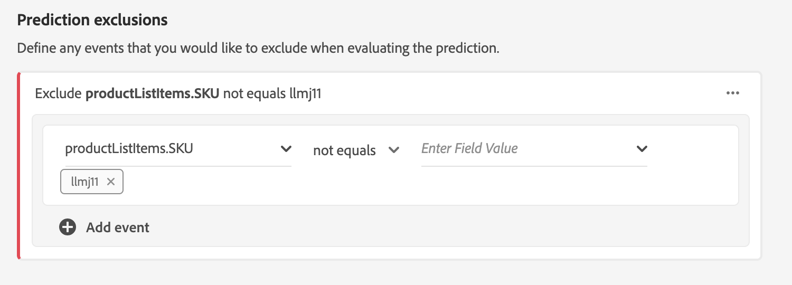

# 고객 AI(알파)를 사용하여 고객 성향 점수 예측

>[!NOTE]
>이 문서에 설명된 고객 AI 기능은 알파입니다. 설명서 및 기능은 변경될 수 있습니다.

Adobe Experience Platform의 고객 AI를 기반으로 구축된 Adobe Sensei를 사용하면 머신 러닝 측면을 걱정하지 않고도 맞춤형 성향 점수를 생성할 수 있습니다.

이 자습서에서는 Experience Platform 사용자 인터페이스를 사용하여 고객 AI를 사용하는 단계를 설명합니다. 다음 항목에 대한 단계가 제공됩니다.

* [인스턴스 구성](#configure-an-instance)
* [예측된 점수가 있는 고객 세그먼트 만들기](#create-customer-segments-with-predicted-scores)

## 시작하기

이 가이드는 고객 AI 사용과 관련된 다양한 플랫폼 서비스에 대한 작업 이해를 필요로 합니다. 이 자습서를 시작하기 전에 다음 문서를 검토하십시오.

* [실시간 고객 프로필 개요](https://www.adobe.io/apis/experienceplatform/home/profile-identity-segmentation/profile-identity-segmentation-services.html#!api-specification/markdown/narrative/technical_overview/unified_profile_architectural_overview/unified_profile_architectural_overview.md)
* [세그멘테이션 서비스 개요](https://www.adobe.io/apis/experienceplatform/home/profile-identity-segmentation/profile-identity-segmentation-services.html#!api-specification/markdown/narrative/technical_overview/segmentation/segmentation-overview.md)
* [세그먼트 빌더 사용 안내서](https://www.adobe.io/apis/experienceplatform/home/profile-identity-segmentation/profile-identity-segmentation-services.html#!api-specification/markdown/narrative/technical_overview/segmentation/segment-builder-guide.md)

## 인스턴스 구성

Adobe Experience Platform은 고객 AI를 다양한 활용 사례에 맞게 구성할 수 있는 Adobe Sensei를 사용하기 쉬운 서비스로 제공합니다. 다음 섹션에서는 고객 AI 인스턴스를 구성하는 절차를 제공합니다.

### 인스턴스 설정

플랫폼 UI의 왼쪽 **탐색** 영역에서 서비스를 클릭합니다. 서비스 **브라우저가** 나타나고 언제든지 사용 가능한 모든 서비스가 표시됩니다. 고객 AI의 컨테이너에서 열기를 **클릭합니다**.

고객 *AI* 화면에는 모든 기존 고객 AI 인스턴스가 표시됩니다. 인스턴스 **만들기를 클릭합니다**.

인스턴스 생성 워크플로우가 나타나고 설정 *단계부터* 시작됩니다.

다음은 인스턴스를 제공해야 하는 값에 대한 중요한 정보입니다.

* 인스턴스 이름은 고객 AI 점수가 표시되는 모든 위치에서 사용됩니다. 따라서 &quot;잡지 구독을 취소할 가능성&quot;과 같이 예측 점수가 나타내는 것을 이름에 명시해야 합니다.

* 성향 유형은 점수와 지표 극성을 결정합니다. 이탈이나 전환을 선택할 **수** **있습니다**.

* 데이터 소스는 점수를 예측하는 데 사용되는 입력 데이터 세트를 나타냅니다. Customer AI는 디자인별로 고객 경험 이벤트 데이터를 사용하여 성향 점수를 계산합니다. 드롭다운 선택기에서 데이터 세트를 선택하면 고객 AI와 호환되는 데이터만 나열됩니다.

* 기본적으로 자격 조건을 갖춘 인구를 지정하지 않으면 모든 프로필에 대해 성향 점수가 생성됩니다. 이벤트를 기반으로 프로파일을 포함하거나 제외하는 조건을 정의하여 적격한 인구를 지정할 수 있습니다.

필요한 값을 제공한 다음 다음을 **클릭합니다**.

### 목표 정의

목표 *정의* 단계가 나타나고 목표를 시각적으로 정의할 수 있는 대화형 환경을 제공합니다. 목표는 하나 이상의 이벤트로 구성되며, 여기서 각 이벤트의 발생은 이벤트가 보유하는 조건을 기반으로 합니다. 고객 AI 인스턴스의 목적은 주어진 기간 내에 목표 달성 가능성을 판단하는 것입니다.

필드 **이름 입력을** 클릭하고 드롭다운 목록에서 필드를 선택합니다. 두 번째 입력을 클릭하고 이벤트 조건에 대한 절을 선택한 다음 이벤트를 완료할 대상 값을 제공합니다. 이벤트 추가를 클릭하여 추가 이벤트를 구성할 **수**&#x200B;있습니다. 마지막으로, 예상 기간을 일 수로 적용하여 목표를 완료한 다음 다음을 **클릭합니다**.

### 일정 구성 *(선택 사항)*

고급 *단계가* 나타납니다. 이 선택 단계에서는 예측 실행을 자동화하고, 특정 이벤트를 필터링하기 위한 예측 제외를 정의하거나, 아무 **것도 필요하지 않은 경우 마침을** 클릭할 수 있도록 예약을 구성할 수 있습니다.

점수 지정 빈도를 구성하여 점수 지정 *일정을 설정합니다*. 자동화된 예측 실행은 주별 또는 월별 기준으로 실행되도록 예약할 수 있습니다.

일정 구성 아래에서는 점수를 생성할 때 특정 조건을 충족하는 이벤트가 평가되지 않도록 예측 제외를 정의할 수 있습니다. 이 기능을 사용하여 관련 없는 데이터 입력을 필터링할 수 있습니다.

특정 이벤트를 제외하려면 **제외** 추가를 클릭하고 목표가 정의된 방법과 동일한 방식으로 이벤트를 정의합니다. 제외를 제거하려면 이벤트 컨테이너의 오른쪽 위에 있는 줄임표(**..**)를 클릭한 다음 컨테이너 **제거를 클릭합니다**.

필요에 따라 이벤트를 제외하고 마침을 클릭하여 **인스턴스를** 만듭니다.

인스턴스가 성공적으로 생성되면 예측 실행이 즉시 트리거되며, 그 이후의 실행은 정의된 일정에 따라 실행됩니다.

>   **참고:** 입력 데이터의 크기에 따라 예측 실행을 완료하는 데 최대 24시간이 걸릴 수 있습니다.

이 섹션 다음에는 고객 AI 인스턴스를 구성했으며 예측 실행이 실행되었습니다. 성공적인 실행이 완료되면 점수에 따른 통찰력이 예측된 점수와 함께 프로필을 자동으로 활용합니다. 이 튜토리얼의 다음 섹션을 계속하기 전에 24시간을 기다려 주십시오.

## 예측된 점수가 있는 고객 세그먼트 만들기

예측 실행이 완료되면 예측된 성향 점수는 프로필에 의해 자동으로 사용됩니다. 고객 AI 점수와 프로파일 강화를 통해 고객 성향 점수를 기반으로 고객 세그먼트를 만들 수 있습니다. 이 섹션에서는 세그먼트 빌더를 사용하여 세그먼트를 만드는 단계를 제공합니다. 세그먼트 만들기에 대한 보다 강력한 자습서는 세그먼트 빌더 [사용 안내서를](https://www.adobe.io/apis/experienceplatform/home/profile-identity-segmentation/profile-identity-segmentation-services.html#!api-specification/markdown/narrative/technical_overview/segmentation/segment-builder-guide.md)참조하십시오.

플랫폼 UI에서 왼쪽 **탐색** 영역에서 세그먼트를 클릭한 다음 세그먼트 **만들기를 클릭합니다**.

세그먼트 *빌더가* 나타납니다. 왼쪽 *필드* 열과 속성 *탭에서* XDM **개별** 프로필이라는 폴더를클릭한 다음 조직의 네임스페이스가 있는 폴더를 클릭합니다. Customer AI **라는** 폴더에는 예측 실행 결과가 포함되며 점수가 속하는 인스턴스 다음에 이름이 지정됩니다. 를 클릭하고 원하는 인스턴스의 결과에 액세스합니다.

세그먼트 빌더의 가운데에 있는 점수 **속성을** 규칙 빌더 캔버스로 ** 드래그하여 놓아 규칙을 정의합니다.

오른쪽 *세그먼트 속성* 열에서 *병합 정책을* 선택하고 세그먼트 이름을 입력한 다음 저장을 **클릭하여** 세그먼트를 만듭니다.

## 다음 단계

이 튜토리얼을 따라 고객 AI의 인스턴스를 구성하고 성향 점수를 생성했으며 세그먼트 빌더를 사용하여 성향 점수로 강제 적용된 세그먼트를 만들었습니다. 이제 고객 세그먼트를 활성화 대상에 사용하여 고객을 타깃팅할 수 있습니다. 자세한 내용은 [대상 개요를](../destinations/destinations-overview.md) 참조하십시오.
