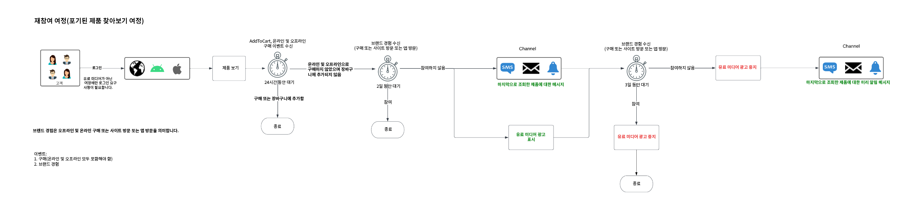
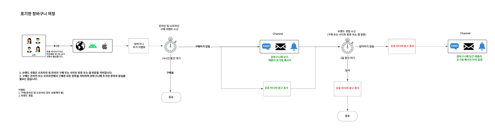
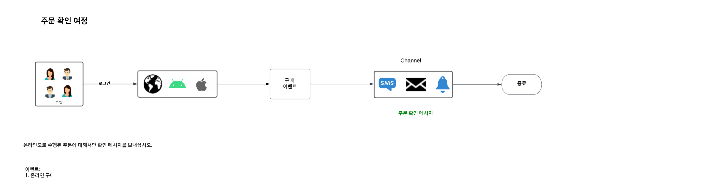

# 고객에게 지능적으로 재참여를 유도하여 재방문

지능형 재참여를 통해 고객에게 특정 작업을 수행하도록 설득하는 맞춤형 크로스 채널 드립 캠페인을 설정할 수 있습니다. 누징 캠페인은 의도 이메일, SMS를 표시한 고객을 전송하고 유료 광고를 제공하는 등 제한된 시간 동안 작동하도록 설계되었습니다. 고객이 적절한 조치를 취하면 넛지(nudge) 캠페인이 즉시 종료됩니다.

## 전제 조건 및 계획 {#prerequisites-and-planning}

사용 사례를 구현하는 단계를 완료하면 다음 Real-Time CDP 기능 및 UI 요소(사용할 순서대로 나열됨)를 사용하게 됩니다. 이러한 모든 영역에 대해 필요한 속성 기반 액세스 제어 권한이 있는지 확인하거나 시스템 관리자에게 필요한 권한 부여를 요청하십시오.

* [Adobe Real-time Customer Data Platform(Real-Time CDP)](https://experienceleague.adobe.com/docs/platform-learn/tutorials/rtcdp/understanding-the-real-time-customer-data-platform.html) - 데이터 소스 간의 데이터를 집계하여 캠페인을 실행합니다. 그런 다음 이 데이터를 사용하여 캠페인 대상자를 만들고 이메일 및 웹 프로모션 타일에 사용된 개인화된 데이터 요소(예: 이름 또는 계정 관련 정보)를 표시합니다. CDP는 이메일 및 웹(Adobe Target을 통해)에서 대상자를 활성화하는 데도 사용됩니다.
   * [스키마](/help/xdm/home.md)
   * [프로필](/help/profile/home.md)
   * [Audiences](/help/segmentation/home.md)
* [Adobe Journey Optimizer](https://experienceleague.adobe.com/docs/journey-optimizer/using/orchestrate-journeys/journey.html)
   * [이벤트 또는 대상 트리거](https://experienceleague.adobe.com/docs/journey-optimizer/using/offer-decisioning/collect-event-data/data-collection.html)
   * [대상/이벤트](https://experienceleague.adobe.com/docs/journey-optimizer/using/audiences-profiles-identities/audiences/about-audiences.html)
   * [여정 작업](https://experienceleague.adobe.com/docs/journey-optimizer/using/orchestrate-journeys/journey.html)

### 사용 사례를 달성하는 방법: 높은 수준의 개요 {#achieve-the-use-case-high-level}

만들어진 재참여 여정은 3개입니다.

>[!BEGINTABS]

>[!TAB 재참여 여정]

재참여 여정은 웹 사이트와 앱 모두에서 포기된 제품 탐색을 타겟으로 합니다. 이 여정은 장바구니에 구매하거나 추가한 제품이 없는 상태로 제품을 본 경우 트리거됩니다. 지난 24시간 내에 목록 추가가 없는 경우 3일 후에 브랜드 참여가 트리거됩니다.

1. 데이터는 Edge Network를 통해 웹 SDK/모바일 SDK/Edge Network API 수집으로 집계됩니다(기본 방법).
2. 로서의 **고객**, 다음에 대해 표시된 데이터 세트를 만듭니다. [!UICONTROL 프로필].
3. 로서의 **고객**, 프로필을 Real-Time CDP에 로드하고 거버넌스 정책을 구축하여 책임 있는 사용을 보장합니다.
4. 로서의 **고객**, 프로필 목록에서 집중 대상자를 구성하여 **사용자** 은(는) 지난 3일 동안 브랜드 약정을 체결했습니다.
5. 로서의 **고객**, Adobe Journey Optimizer에서 재참여 여정을 만듭니다.
6. 필요한 경우 **데이터 파트너** 원하는 유료 미디어 대상으로 대상자를 활성화하기 위해
7. Adobe Journey Optimizer은 동의를 확인하고 구성된 다양한 작업을 전송합니다.

>[!TAB 포기한 장바구니 여정]

이 여정은 장바구니에 넣었지만 웹 사이트 및 앱 모두에서 구매하지 않은 제품을 타깃팅합니다. 유료 미디어 캠페인 시작 및 중지에 사용됨

1. 데이터는 Edge Network를 통해 웹 SDK/모바일 SDK/Edge Network API 수집으로 집계됩니다(기본 방법).
2. 로서의 **고객**, 다음에 대해 표시된 데이터 세트를 만듭니다. [!UICONTROL 프로필].
3. 로서의 **고객**, 프로필을 Real-Time CDP에 로드하고 거버넌스 정책을 구축하여 책임 있는 사용을 보장합니다.
4. 로서의 **고객**, 프로필 목록에서 집중 대상자를 구성하여 **사용자** 이(가) 장바구니에 항목을 넣었지만 구매를 완료하지 않았습니다. 다음 **[!UICONTROL 장바구니에 추가]** 이벤트가 30분 동안 대기하는 타이머를 시작한 다음 구매를 확인합니다. 구매하지 않은 경우 **사용자** 이(가)에 추가됩니다 **[!UICONTROL 장바구니 포기]** 대상.
5. 로서의 **고객**, Adobe Journey Optimizer에서 포기한 장바구니 여정을 만듭니다.
6. 필요한 경우 **데이터 파트너** 원하는 유료 미디어 대상으로 대상자를 활성화하기 위해
7. Adobe Journey Optimizer은 동의를 확인하고 구성된 다양한 작업을 전송합니다.

>[!TAB 주문 확인 여정]

이 여정은 웹 사이트 및 앱 모두에서 제품 구매를 타깃팅합니다.

1. 데이터는 Edge Network를 통해 웹 SDK/모바일 SDK/Edge Network API 수집으로 집계됩니다(기본 방법).
2. 로서의 **고객**, 다음에 대해 표시된 데이터 세트를 만듭니다. [!UICONTROL 프로필].
3. 로서의 **고객**, 프로필을 Real-Time CDP에 로드하고 거버넌스 정책을 구축하여 책임 있는 사용을 보장합니다.
4. 로서의 **고객**, 프로필 목록에서 집중 대상자를 구성하여 **사용자** 을(를) 구매했습니다.
5. 로서의 **고객**, Adobe Journey Optimizer에서 확인 여정을 만듭니다.
6. Adobe Journey Optimizer이 기본 채널을 사용하여 주문 확인 메시지를 보냅니다.

>[!ENDTABS]

## 사용 사례 달성 방법: 단계별 지침 {#step-by-step-instructions}

추가 설명서에 대한 링크가 포함된 아래 섹션을 읽어 위의 높은 수준 개요에서 각 단계를 완료합니다.

### 사용할 UI 기능 및 요소 {#ui-functionality-and-elements}

사용 사례를 구현하는 단계를 완료하면 다음 Real-Time CDP 기능 및 UI 요소(사용할 순서대로 나열됨)를 사용하게 됩니다. 이러한 모든 영역에 대해 필요한 속성 기반 액세스 제어 권한이 있는지 확인하거나 시스템 관리자에게 필요한 권한 부여를 요청하십시오.

* [스키마](/help/xdm/home.md)
* [프로필](/help/profile/home.md)
* [데이터 세트](/help/catalog/datasets/overview.md)
* [Audiences](/help/segmentation/home.md)
* [Adobe Journey Optimizer](https://experienceleague.adobe.com/docs/journey-optimizer/using/orchestrate-journeys/journey.html)
* [대상](/help/destinations/home.md)

### 스키마 디자인 및 필드 그룹 설정

지능형 재참여 여정에 사용되는 4가지 스키마 디자인이 있습니다. 각 스키마에는 특정 필드를 설정해야 하며 일부 필드는 강력하게 제안됩니다.

>[!BEGINTABS]

>[!TAB 고객 속성(프로필 스키마)]

프로필 스키마에 필요한 필드 그룹은 다음과 같습니다.

+++개인 연락처 세부 정보(필드 그룹)

[개인 연락처 세부 정보](/help/xdm/field-groups/profile/personal-contact-details.md) 는 개인에 대한 연락처 정보를 설명하는 XDM 개인 프로필 클래스에 대한 표준 스키마 필드 그룹입니다.

| 필드 | 요구 사항 | 설명 |
| --- | --- | --- |
| mobilePhone.number | 필수 여부 | SMS에 사용되는 개인 휴대폰 번호. |
| personalEmail.address | 필수 여부 | 개인 이메일 주소입니다. |

+++

+++인구 통계 세부 정보(필드 그룹)

[인구 통계 세부 정보](/help/xdm/field-groups/profile/demographic-details.md) 는 XDM 개인 프로필 클래스에 대한 표준 스키마 필드 그룹입니다. 필드 그룹은 루트 레벨 개인 객체를 제공하는데, 이 객체의 하위 필드에는 개별 개인에 대한 정보가 설명되어 있습니다.

| 필드 | 요구 사항 |
| --- | --- |
| person.name.firstName | 제안됨 |
| person.name.lastName | 제안됨 |

+++

+++외부 소스 시스템 감사 세부 정보(필드 그룹)

[외부 소스 시스템 감사 속성](/help/xdm/data-types/external-source-system-audit-attributes.md) 는 외부 소스 시스템에 대한 감사 세부 정보를 캡처하는 표준 경험 데이터 모델(XDM) 데이터 유형입니다.

+++

+++동의 및 환경 설정 필드 그룹(필드 그룹)

[동의 및 환경 설정](/help/xdm/field-groups//profile/consents.md) 필드 그룹은 동의 및 환경 설정 정보를 캡처하기 위한 단일 개체 유형 필드인 동의를 제공합니다.

| 필드 | 요구 사항 |
| --- | --- |
| consents.marketing.email.val | 필수 여부 |
| consents.marketing.preferred | 필수 여부 |
| consents.marketing.push.val | 필수 여부 |
| consents.marketing.sms.val | 필수 여부 |
| consents.personalize.content.val | 필수 여부 |
| consents.share.val | 필수 여부 |

+++

+++프로필 테스트 세부 사항(필드 그룹)

이 필드 그룹은 우수 사례에 사용됩니다.

+++

>[!TAB 고객 디지털 트랜잭션]

온라인 활동(Adobe Analytics 커넥터 아님)을 위한 경험 이벤트 스키마에 필요한 필드 그룹은 다음과 같습니다.

+++Adobe Experience Platform 웹 SDK ExperienceEvent (필드 그룹)

| 필드 | 요구 사항 |
| --- | --- |
| device.model | 제안됨 |
| environment.browserDetails.userAgent | 제안됨 |

+++

+++웹 세부 정보(필드 그룹)

웹 세부 정보 는 상호 작용, 페이지 세부 정보 및 레퍼러 등 웹 세부 정보 이벤트 관련 정보를 설명하는 데 사용되는 XDM ExperienceEvent 클래스의 표준 스키마 필드 그룹입니다.

| 필드 | 요구 사항 | 설명 |
| --- | --- | --- |
| web.webInteraction.linkClicks.id | 제안됨 | 인터랙션에 해당하는 웹 링크 또는 URL의 ID입니다. |
| web.webInteraction.linkClicks.value | 제안됨 | 인터랙션에 해당하는 웹 링크 또는 URL의 클릭 수입니다. |
| web.webInteraction.name | 제안됨 | 웹 페이지의 이름입니다. |
| web.webInteraction.URL | 제안됨 | 웹 페이지의 URL입니다. |
| web.webPageDetails.name | 제안됨 | 웹 인터랙션이 발생한 웹 페이지의 이름입니다. |
| web.webPageDetails.URL | 제안됨 | 웹 인터랙션이 발생한 웹 페이지의 URL입니다. |
| web.webReferrer.URL | 제안됨 | 웹 인터랙션의 레퍼러(현재 웹 인터랙션이 기록되기 바로 전에 방문자가 들어온 URL)에 대해 설명합니다. |

+++

+++고객 경험 이벤트(필드 그룹)

| 필드 | 요구 사항 |
| --- | --- |
| commerce.cart.cartID | 제안됨 |
| commerce.cart.cartSource | 제안됨 |
| commerce.cartAbandons.id | 제안됨 |
| commerce.cartAbandons.value | 제안됨 |
| commerce.order.orderType | 제안됨 |
| commerce.order.payments.paymentAmount | 제안됨 |
| commerce.order.payments.paymentType | 제안됨 |
| commerce.order.payments.transactionID | 제안됨 |
| commerce.order.priceTotal | 제안됨 |
| commerce.order.purchaseID | 제안됨 |
| commerce.productListAdds.id | 제안됨 |
| commerce.productListAdds.value | 제안됨 |
| commerce.productListOpens.id | 제안됨 |
| commerce.productListOpens.value | 제안됨 |
| commerce.productListRemoval.id | 제안됨 |
| commerce.productListRemoval.value | 제안됨 |
| commerce.productListViews.id | 제안됨 |
| commerce.productListViews.value | 제안됨 |
| commerce.productViews.id | 제안됨 |
| commerce.productViews.value | 제안됨 |
| commerce.purchases.id | 제안됨 |
| commerce.purchases.value | 제안됨 |
| marketing.campaignGroup | 제안됨 |
| marketing.campaignName | 제안됨 |
| marketing.trackingCode | 제안됨 |
| productListItems.name | 제안됨 |
| productListItems.priceTotal | 제안됨 |
| productListItems.product | 제안됨 |
| productListItems.quantity | 제안됨 |

+++

+++최종 사용자 ID 세부 사항(필드 그룹)

| 필드 | 요구 사항 | 설명 |
| --- | --- | --- |
| endUserIDs._experience.emailid.authenticatedState | 필수 여부 | 최종 사용자 이메일 주소 ID 인증 상태. |
| endUserIDs._experience.emailid.id | 필수 여부 | 최종 사용자 이메일 주소 ID. |
| endUserIDs._experience.emailid.namespace.code | 필수 여부 | 최종 사용자 이메일 주소 ID 네임스페이스 코드. |
| endUserIDs._experience.mcid.authenticatedState | 필수 여부 | MCID(Adobe Marketing Cloud ID) 인증 상태입니다. 이제 MCID를 ECID(Experience Cloud ID)라고 합니다. |
| endUserIDs._experience.mcid.id | 필수 여부 | Adobe Marketing Cloud ID(MCID). 이제 MCID를 ECID(Experience Cloud ID)라고 합니다. |
| endUserIDs._experience.mcid.namespace.code | 필수 여부 | Adobe Marketing Cloud ID(MCID) 네임스페이스 코드. |

+++

+++클래스 값(필드 그룹)

| 필드 | 요구 사항 |
| --- | --- |
| eventType | 필수 여부 |
| timestamp | 필수 여부 |

+++

+++외부 소스 시스템 감사 세부 정보(필드 그룹)

외부 소스 시스템 감사 속성 은 외부 소스 시스템에 대한 감사 세부 정보를 캡처하는 표준 경험 데이터 모델(XDM) 데이터 유형입니다.

+++

>[!TAB 고객 오프라인 트랜잭션]

오프라인 활동을 위한 경험 이벤트 스키마에 필요한 필드 그룹은 다음과 같습니다.

+++상거래 세부 정보(필드 그룹)

| 필드 | 요구 사항 | 설명 |
| --- | --- | --- |
| commerce.cart.cartID | 필수 여부 | 장바구니 ID. |
| commerce.order.orderType | 필수 여부 | 제품 주문 유형을 설명하는 객체입니다. |
| commerce.order.payments.paymentAmount | 필수 여부 | 제품 주문 결제 금액을 설명하는 객체입니다. |
| commerce.order.payments.paymentType | 필수 여부 | 제품 주문 결제 유형을 설명하는 객체입니다. |
| commerce.order.payments.transactionID | 필수 여부 | 객체 제품 주문 거래 ID입니다. |
| commerce.order.purchaseID | 필수 여부 | 오브젝트 제품 주문 구매 ID. |
| productListItems.name | 필수 여부 | 고객이 선택한 제품을 나타내는 항목 이름 목록입니다. |
| productListItems.priceTotal | 필수 여부 | 고객이 선택한 제품을 나타내는 품목 목록의 총 가격. |
| productListItems.product | 필수 여부 | 제품이 선택되었습니다. |
| productListItems.quantity | 필수 여부 | 고객이 선택한 제품을 나타내는 품목 목록의 수량. |

+++

+++개인 연락처 세부 정보(필드 그룹)

| 필드 | 요구 사항 | 설명 |
| --- | --- | --- |
| mobilePhone.number | 필수 여부 | SMS에 사용되는 개인 휴대폰 번호. |
| personalEmail.address | 필수 여부 | 개인 이메일 주소입니다. |

+++

+++클래스 값(필드 그룹)

| 필드 | 요구 사항 |
| --- | --- |
| eventType | 필수 여부 |
| timestamp | 필수 여부 |

+++

+++외부 소스 시스템 감사 세부 정보(필드 그룹)

외부 소스 시스템 감사 속성 은 외부 소스 시스템에 대한 감사 세부 정보를 캡처하는 표준 경험 데이터 모델(XDM) 데이터 유형입니다.

+++

>[!TAB Adobe 웹 커넥터 스키마]

Adobe Analytics 데이터 피드를 위한 경험 이벤트 스키마에 필요한 필드 그룹은 다음과 같습니다.

+++Adobe Analytics ExperienceEvent 템플릿(필드 그룹)

| 필드 | 요구 사항 | 설명 |
| --- | --- | --- |
| web.webInteraction.linkClicks.id | 제안됨 | 인터랙션에 해당하는 웹 링크 또는 URL의 ID입니다. |
| web.webInteraction.linkClicks.value | 제안됨 | 인터랙션에 해당하는 웹 링크 또는 URL의 클릭 수입니다. |
| web.webInteraction.name | 제안됨 | 웹 페이지의 이름입니다. |
| web.webInteraction.URL | 제안됨 | 웹 페이지의 URL입니다. |
| web.webPageDetails.name | 제안됨 | 웹 인터랙션이 발생한 웹 페이지의 이름입니다. |
| web.webPageDetails.URL | 제안됨 | 웹 인터랙션이 발생한 웹 페이지의 URL입니다. |
| web.webReferrer.URL | 제안됨 | 웹 인터랙션의 레퍼러(현재 웹 인터랙션이 기록되기 바로 전에 방문자가 들어온 URL)에 대해 설명합니다. |
| commerce.cart.cartID | 제안됨 | |
| commerce.cart.cartSource | 제안됨 | |
| commerce.cartAbandons.id | 제안됨 | |
| commerce.cartAbandons.value | 제안됨 | |
| commerce.order.orderType | 제안됨 | |
| commerce.order.payments.paymentAmount | 제안됨 | |
| commerce.order.payments.paymentType | 제안됨 | |
| commerce.order.payments.transactionID | 제안됨 | |
| commerce.order.priceTotal | 제안됨 | |
| commerce.order.purchaseID | 제안됨 | |
| commerce.productListAdds.id | 제안됨 | |
| commerce.productListAdds.value | 제안됨 | |
| commerce.productListOpens.id | 제안됨 | |
| commerce.productListOpens.value | 제안됨 | |
| commerce.productListRemoval.id | 제안됨 | |
| commerce.productListRemoval.value | 제안됨 | |
| commerce.productListViews.id | 제안됨 | |
| commerce.productListViews.value | 제안됨 | |
| commerce.productViews.id | 제안됨 | |
| commerce.productViews.value | 제안됨 | |
| commerce.purchases.id | 제안됨 | |
| commerce.purchases.value | 제안됨 | |
| marketing.campaignGroup | 제안됨 | |
| marketing.campaignName | 제안됨 | |
| marketing.trackingCode | 제안됨 | |
| productListItems.name | 제안됨 | |
| productListItems.priceTotal | 제안됨 | |
| productListItems.product | 제안됨 | |
| productListItems.quantity | 제안됨 | |
| endUserIDs._experience.emailid.authenticatedState | 필수 여부 | 최종 사용자 이메일 주소 ID 인증 상태. |
| endUserIDs._experience.emailid.id | 필수 여부 | 최종 사용자 이메일 주소 ID. |
| endUserIDs._experience.emailid.namespace.code | 필수 여부 | 최종 사용자 이메일 주소 ID 네임스페이스 코드. |
| endUserIDs._experience.mcid.authenticatedState | 필수 여부 | MCID(Adobe Marketing Cloud ID) 인증 상태입니다. 이제 MCID를 ECID(Experience Cloud ID)라고 합니다. |
| endUserIDs._experience.mcid.id | 필수 여부 | Adobe Marketing Cloud ID(MCID). 이제 MCID를 ECID(Experience Cloud ID)라고 합니다. |
| endUserIDs._experience.mcid.namespace.code | 필수 여부 | Adobe Marketing Cloud ID(MCID) 네임스페이스 코드. |

+++

+++클래스 값(필드 그룹)

| 필드 | 요구 사항 |
| --- | --- |
| eventType | 필수 여부 |
| timestamp | 필수 여부 |

+++

+++외부 소스 시스템 감사 세부 정보(필드 그룹)

외부 소스 시스템 감사 속성 은 외부 소스 시스템에 대한 감사 세부 정보를 캡처하는 표준 경험 데이터 모델(XDM) 데이터 유형입니다.

+++

>[!ENDTABS]

### 스키마에서 데이터 세트 만들기

데이터 세트는 스키마(열) 및 필드(행)를 포함하는 데이터 수집을 위한 저장소 및 관리 구조입니다. 지능형 재참여 여정의 경우 각 스키마에는 하나의 데이터 세트가 있습니다.

스키마에서 데이터 세트를 만들려면 아래 단계를 완료하십시오.

1. **[!UICONTROL 데이터 관리]** > **[!UICONTROL 데이터 세트]**&#x200B;로 이동한 다음 **[!UICONTROL 데이터 세트 만들기]**&#x200B;를 선택합니다.
2. **[!UICONTROL 스키마에서 데이터 세트 만들기]**&#x200B;를 선택합니다.
3. 생성한 관련 재참여 스키마를 선택합니다.
4. 데이터 세트의 이름을 지정하고 필요한 경우 설명을 제공합니다.
5. **[!UICONTROL 마침]**&#x200B;을 선택합니다.

스키마를 생성하는 단계와 유사하게 실시간 고객 프로필에 포함할 데이터 세트를 활성화해야 합니다. 실시간 고객 프로필에서 사용할 데이터 세트를 활성화하는 방법에 대한 자세한 내용은 [스키마 튜토리얼 만들기](/help/xdm/tutorials/create-schema-ui.md#profile)를 참조하십시오.

### 개인 정보, 동의 및 데이터 거버넌스

#### 동의 정책

>[!IMPORTANT]
>
>고객에게 브랜드로부터 커뮤니케이션 수신을 거부할 수 있는 기능을 제공하는 것은 법적 요건이며 이러한 선택이 존중되도록 하는 것입니다. [Experience Platform 설명서](https://experienceleague.adobe.com/docs/experience-platform/privacy/regulations/overview.html)에서 해당 법률에 대해 자세히 알아보십시오.

재참여 여정 설정 시 다음 동의 정책을 고려하여 사용해야 합니다.

* consents.marketing.email.val = &quot;Y&quot;인 경우 이메일을 보낼 수 있습니다.
* consents.marketing.sms.val = &quot;Y&quot;인 경우 SMS를 사용할 수 있음
* consents.marketing.push.val = &quot;Y&quot;인 경우 푸시할 수 있음
* consents.share.val = &quot;Y&quot;인 경우 광고를 할 수 있습니다.
* 고객 구현에 의해 정의된 요구 사항

#### DULE 레이블 및 적용

개인 이메일 주소는 디바이스가 아닌 특정 사용자를 식별하거나 연락하는 데 사용할 수 있는 직접 식별 가능한 데이터로 사용됩니다.

* personalEmail.address = I1

#### 마케팅 정책

재참여 여정에 대한 추가 마케팅 정책은 없지만 원하는 대로 다음을 고려해야 합니다.

* 원하는 대로 고려하십시오.
* 중요 데이터 제한
* 온사이트 광고 제한
* 이메일 타겟팅 제한
* 교차 사이트 타겟팅 제한
* 직접 식별할 수 있는 데이터를 익명 데이터와 결합하는 것 제한

### 브랜드 재참여 여정을 위한 대상 만들기

각 재참여 여정의 대상은 세그먼트 자격을 얻기 위해 특정 이벤트로 설정해야 합니다.  이러한 세부 사항은 각 여정의 해당 탭에서 아래에 나와 있습니다.

>[!BEGINTABS]

>[!TAB 재참여 여정]

다음 여정은 프로필이 온라인으로 제품을 보고 24시간 동안 장바구니에 추가하지 않았으며 다음 3일 동안 브랜드 참여가 없는 재참여 이벤트에 사용됩니다.

최소 1개의 EventType = ProductViews 이벤트가 있는 대상 포함 다음 최소 1개의 Any 이벤트가 있는 대상을 포함합니다. 여기서 (EventType은 commerce.productListAdds와 동일하지 않음) 지난 24시간 동안 발생하고 3일 후에는 (EventType = application.launch 또는 web.webpagedetails.pageViews 또는 commerce.purchases)이며 지난 2일 동안 발생합니다.

>[!TAB 포기한 장바구니 여정]

다음 이벤트는 장바구니에 제품을 추가했지만 지난 24시간 동안 구매를 완료하지 않았거나 장바구니를 지우지 않은 프로필에 사용됩니다.

include EventType = commerce.productList지금부터 30분에서 1440분 사이에 추가합니다.
exclude EventType = commerce.purchases 30분 전 지금 또는 EventType = commerce.productListRemovals AND Cart ID equals Product List Adds1 Cart ID (inclusion event).

>[!ENDTABS]

대상자 빌드에 대한 자세한 내용은 [Audience Builder UI 안내서](/help/segmentation/ui/segment-builder.md).

### Adobe Journey Optimizer에서 여정 설정

>[!NOTE]
>
>Adobe Journey Optimizer은 이 페이지 상단에 있는 다이어그램에 표시된 모든 항목을 포함하지 않습니다. 모든 유료 미디어 광고는에서 만들어집니다. [!UICONTROL 대상].

각 사용 사례가 가질 수 있는 여러 여정에 대한 특정 정보가 필요합니다. 각 여정 분기에 필요한 특정 데이터는 해당 탭에서 아래에 나와 있습니다.

>[!BEGINTABS]

>[!TAB 재참여 여정]

+++이벤트

* 제품 보기
   * 스키마: 고객 디지털 트랜잭션
   * 필드:
      * 이벤트 유형
   * 조건:
      * EventType = commerce.productViews
      * 필드:
         * Commerce.productViews.id
         * Commerce.productViews.value
         * eventType
         * identityMap.authenticatedState
         * identityMap.id
         * identityMap.primary
         * productListItems.SKU
         * productListItems.currencyCode
         * productListItems.name
         * productListItems.priceTotal
         * productListItems.product
         * productListItems.productImageUrl
         * productListItems.quantity
         * timestamp
         * endUserIDs._experience.emailid.authenticatedState
         * endUserIDs._experience.emailid.id
         * endUserIDs._experience.emailid.namespace.code
         * _ID

* 장바구니에 추가
   * 스키마: 고객 디지털 트랜잭션
   * 필드:
      * 이벤트 유형
   * 조건:
      * 이벤트 유형 = commerce.productListAdds
      * 필드:
         * Commerce.productListAdds.id
         * Commerce.productListAdds.value
         * eventType
         * identityMap.authenticatedState
         * identityMap.id
         * identityMap.primary
         * productListItems.SKU
         * productListItems.currencyCode
         * productListItems.name
         * productListItems.priceTotal
         * productListItems.product
         * productListItems.productImageUrl
         * productListItems.quantity
         * timestamp
         * commerce.cart.cartID
         * endUserIDs._experience.emailid.authenticatedState
         * endUserIDs._experience.emailid.id
         * endUserIDs._experience.emailid.namespace.code
         * _ID

* 브랜드 참여
   * 스키마: 고객 디지털 트랜잭션
   * 필드:
      * 이벤트 유형
   * 조건:
      * application.launch, commerce.purchases, web.webpagedetails.pageViews의 EventType
      * 필드:
         * eventType
         * identityMap.authenticatedState
         * identityMap.id
         * identityMap.primary
         * productListItems.SKU
         * productListItems.currencyCode
         * productListItems.name
         * productListItems.priceTotal
         * productListItems.product
         * productListItems.productImageUrl
         * productListItems.quantity
         * timestamp
         * web.webpagedetails.URL
         * web.webpagedetails.isHomePage
         * web.webpagedetails.name
         * endUserIDs._experience.emailid.authenticatedState
         * endUserIDs._experience.emailid.id
         * endUserIDs._experience.emailid.namespace.code
         * _ID
         * Commerce.purchases.id
         * Commerce.purchases.value
         * shipping.address.city
         * shipping.address.countryCode
         * shipping.address.postalCode
         * shipping.address.state
         * shipping.address.street1
         * shipping.address.street2
         * shipping.shipDate
         * shipping.trackingNumber
         * shipping.trackingURL

+++

+++키 여정 논리

* 여정 시작 논리
   * 제품 보기 이벤트

* 조건
   * 제품을 마지막으로 본 이후 온라인 또는 오프라인 구매 이벤트가 하나 이상 있는지 확인합니다.
      * 스키마: 고객 디지털 트랜잭션
      * eventType = commerce.purchases
      * timestamp > 마지막으로 본 제품의 타임스탬프

   * 제품을 마지막으로 본 이후 하나 이상의 오프라인 구매 확인:
      * 스키마: 고객 오프라인 트랜잭션 v.1
      * eventType = commerce.purchases
      * timestamp > 마지막으로 본 제품의 타임스탬프

   * 조건 - Target 채널 선택
      * 이메일
         * consents.marketing.email.val = y
      * 푸시
         * consents.marketing.push.val=y
      * SMS
         * consents.marketing.sms.val = y

   * 채널 개인화
      * 제품 보기에 따라 개인화된 채널 콘텐츠.

+++

>[!TAB 포기한 장바구니 여정]

+++이벤트

* 장바구니에 추가
   * 스키마: 고객 디지털 트랜잭션
   * 필드:
      * 이벤트 유형
   * 조건:
      * 이벤트 유형 = commerce.productListAdds
      * 필드:
         * Commerce.productListAdds.id
         * Commerce.productListAdds.value
         * eventType
         * identityMap.authenticatedState
         * identityMap.id
         * identityMap.primary
         * productListItems.SKU
         * productListItems.currencyCode
         * productListItems.name
         * productListItems.priceTotal
         * productListItems.product
         * productListItems.productImageUrl
         * productListItems.quantity
         * timestamp
         * commerce.cart.cartID
         * endUserIDs._experience.emailid.authenticatedState
         * endUserIDs._experience.emailid.id
         * endUserIDs._experience.emailid.namespace.code
         * _ID

* 온라인 구매
   * 스키마: 고객 디지털 트랜잭션
   * 필드:
      * 이벤트 유형
   * 조건:
      * 이벤트 유형 = commerce.purchases
      * 필드:
         * Commerce.purchases.id
         * Commerce.purchases.value
         * eventType
         * identityMap.authenticatedState
         * identityMap.id
         * identityMap.primary
         * productListItems.SKU
         * productListItems.currencyCode
         * productListItems.name
         * productListItems.priceTotal
         * productListItems.product
         * productListItems.productImageUrl
         * productListItems.quantity
         * timestamp
         * endUserIDs._experience.emailid.authenticatedState
         * endUserIDs._experience.emailid.id
         * endUserIDs._experience.emailid.namespace.code
         * _ID

* 브랜드 참여
   * 스키마: 고객 디지털 트랜잭션
   * 필드:
      * 이벤트 유형
   * 조건:
      * application.launch, commerce.purchases, web.webpagedetails.pageViews의 EventType
      * 필드:
         * eventType
         * identityMap.authenticatedState
         * identityMap.id
         * identityMap.primary
         * productListItems.SKU
         * productListItems.currencyCode
         * productListItems.name
         * productListItems.priceTotal
         * productListItems.product
         * productListItems.productImageUrl
         * productListItems.quantity
         * timestamp
         * web.webpagedetails.URL
         * web.webpagedetails.isHomePage
         * web.webpagedetails.name
         * endUserIDs._experience.emailid.authenticatedState
         * endUserIDs._experience.emailid.id
         * endUserIDs._experience.emailid.namespace.code
         * _ID
         * Commerce.purchases.id
         * Commerce.purchases.value
         * shipping.address.city
         * shipping.address.countryCode
         * shipping.address.postalCode
         * shipping.address.state
         * shipping.address.street1
         * shipping.address.street2
         * shipping.shipDate
         * shipping.trackingNumber
         * shipping.trackingURL

+++

+++키 여정 논리

* 여정 시작 논리
   * AddToCart 이벤트

* authenticated의 AuthenticatedState

* 조건: 장바구니가 마지막으로 중단된 이후 오프라인 구매:
   * 스키마: 고객 오프라인 트랜잭션 v.1
   * eventType = commerce.purchases
   * 타임스탬프 > 장바구니의 타임스탬프가 마지막으로 중단되었습니다.

* 조건: 장바구니를 마지막으로 포기한 이후 장바구니를 지웠습니다.
   * 스키마: 고객 디지털 트랜잭션 v.1
   * eventType = commerce.cartCleared
   * cartID (장바구니의 ID)
   * 타임스탬프 > 장바구니의 타임스탬프가 마지막으로 중단되었습니다.

* Target 채널 선택(더 넓은 범위를 위해 하나 이상의 채널 선택)
   * 이메일
      * consents.marketing.email.val = y
   * 푸시
      * consents.marketing.push.val = y
   * SMS
      * consents.marketing.sms.val = y
   * 채널 개인화
      * 장바구니 세부 정보를 표시하고 테이블 형식으로 여러 제품을 표시할 수 있습니다.

+++

>[!TAB 주문 확인 여정]

+++이벤트

* 온라인 구매
   * 스키마: 고객 디지털 트랜잭션
   * 필드:
      * 이벤트 유형
   * 조건:
      * 이벤트 유형 = commerce.purchases
      * 필드:
         * Commerce.purchases.id
         * Commerce.purchases.value
         * eventType
         * identityMap.authenticatedState
         * identityMap.id
         * identityMap.primary
         * productListItems.SKU
         * productListItems.currencyCode
         * productListItems.name
         * productListItems.priceTotal
         * productListItems.product
         * productListItems.productImageUrl
         * productListItems.quantity
         * timestamp
         * endUserIDs._experience.emailid.authenticatedState
         * endUserIDs._experience.emailid.id
         * endUserIDs._experience.emailid.namespace.code
         * _ID

+++

+++키 여정 논리

* 여정 시작 논리
   * 주문 이벤트

* 조건
   * Target 채널 선택(더 넓은 범위를 위해 하나 또는 여러 채널을 선택).
      * 주문 확인은 사실상 서비스하는 것으로 간주되므로 일반적으로 동의 확인은 불필요하다.
      * 이메일
      * 푸시
      * SMS

   * 채널 콘텐츠 개인화
      * 주문 세부 정보를 표시하고 테이블 형식을 사용하여 제품 목록을 표시할 수 있습니다.

+++

>[!ENDTABS]

여정 만들기에 대한 자세한 내용은 [Adobe Journey Optimizer], 다음을 읽습니다 [여정 시작 안내서](https://experienceleague.adobe.com/docs/journey-optimizer/using/orchestrate-journeys/journey.html).

### 대상에서 유료 미디어 광고 설정

대상 프레임워크는 유료 미디어 광고에 사용됩니다. 동의를 확인하면 구성된 다양한 대상으로 전송됩니다. 예를 들어 DM, 이메일 등이 있습니다.

#### 대상에 필요한 데이터

스트리밍 세그먼트 내보내기 대상(예: Facebook, Google Customer Match, Google DV360)은 고객 데이터에서 다양한 ID를 지원합니다.

* personalEmail.address
* ECID
* mobilePhone.number

장바구니 포기 세그먼트는 스트리밍 중이므로 이 사용 사례의 대상 프레임워크에서 사용할 수 있습니다.

* 스트림/트리거됨
   * [광고](/help/destinations/catalog/advertising/overview.md)/[유료 미디어 및 소셜](/help/destinations/catalog/social/overview.md)
   * [모바일](/help/destinations/catalog/mobile-engagement/overview.md)
   * [스트리밍 대상](/help/destinations/catalog/streaming/http-destination.md)
   * [사용자 지정 Destination SDK](/help/destinations/destination-sdk/overview.md)

* 3시간마다 파일/예약
   * [이메일 마케팅](/help/destinations/catalog/email-marketing/overview.md)
