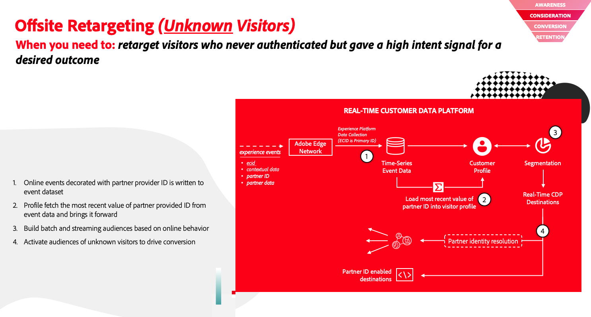

# Real-Time CDP의 샘플 사용 사례

샘플 교차 서비스 사용 사례를 확인하여 Real-Time CDP 구현을 최대한 활용하십시오. 이 페이지에서는 다양한 Adobe Experience Platform 서비스를 사용하여 가능한 몇 가지 사용 사례를 캡처합니다.

>[!IMPORTANT]
>
>이 페이지에 표시되는 사용 사례는 Real-Time CDP을 통해 수행할 수 있는 엔터프라이즈 사용 사례의 하위 집합입니다. 더 많은 샘플 사용 사례를 위한 설명서 추가 작업을 진행 중입니다. 그동안, Adobe 담당자에게 연락하여 페이지에 현재 문서화되어 있는 사용 사례 외에 더 많은 사용 사례를 살펴보십시오.

## 파트너 데이터 지원 {#partner-data-support}

향후 몇 년 이내에 타사 쿠키가 사라질 예정인 경우 파트너 데이터 지원은 타사 쿠키 사용 중단에 의해 남겨진 공백을 채울 수 있습니다.

Adobe Real-Time CDP은 파트너 식별자를 광범위하게 지원하므로 잠재 고객의 대상을 만들고 파트너의 속성으로 알려진 대상을 보강하는 등 다양한 작업을 수행할 수 있습니다.

샘플 사용 사례는 고객 확보 및 프로필 강화 사례로 그룹화할 수 있습니다. 자세한 구현 정보는 아래 설명서 링크를 참조하십시오.

### 고객 확보 {#customer-acquisition}

<table style="margin-top: 0 !important">
<tr>
  <td>
    
    

      <a href="../partner-data/prospecting.md">
    <strong>새로운 고객 확보</strong>
    </a>
    

    

    <em>서드파티 쿠키에 의존하지 않고 새로운 고객 참여 및 확보</em>
    

  </td>
  <td>
    
    

      <a href="../partner-data/onsite-personalization.md">
    <strong>온사이트 개인화</strong>
    </a>
    

    

    <em>파트너 지원 방문자 인식을 사용하여 첫 번째 방문 고객에 대한 온사이트 경험 개인화</em>
    

  </td>
  <td>
    
    

      <a href="../partner-data/offsite-retargeting.md">
    <strong>인증되지 않은 방문자에 대한 오프사이트 재타겟팅</strong>
    </a>
    

    

    <em>인증되지 않은 방문자의 대상을 작성하고 파트너가 제공한 영속성 ID를 사용하여 대상을 재타겟팅하는 방법에 대해 알아봅니다.</em>
    

  </td>
  </tr>
  </table>

### 프로필 보강 {#profile-enrichment}

<table style="margin-top: 0 !important">
<tr>
  <td>
    
    

      <a href="../partner-data/prospecting.md">
    <strong>파트너가 제공한 속성으로 자사 프로필 보완</strong>
    </a>
    

    

    <em>신뢰할 수 있는 데이터 파트너의 속성으로 자사 프로필을 보완하여 데이터 기반을 개선하고, 고객 기반에 대한 새로운 통찰력을 얻고, 대상 최적화를 향상시킵니다.</em>
    

  </td>
  </tr>
  </table>

## 개인화, 통찰력, 참여 {#personalization-insights-engagement}

<table style="margin-top: 0 !important">
<tr>
  <td>
    
    

      <a href="../partner-data/prospecting.md">
    <strong>지능형 재참여</strong>
    </a>
    

    

    <em>지능적이고 책임 있는 방식으로 전환을 포기한 고객을 다시 참여시킵니다. 소멸된 고객과 경험을 통해 전환을 늘리고 클라이언트 라이프타임 값을 높일 수 있습니다.</em>
    

  </td>
  </tr>
  </table>
