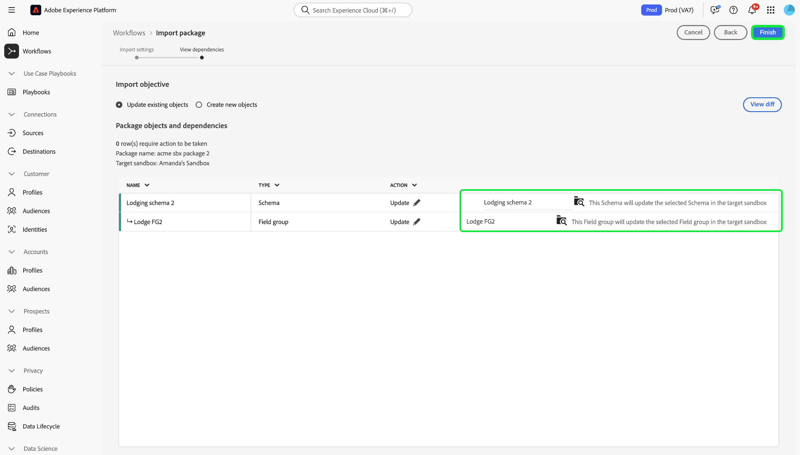

# 샌드박스 도구

>[!NOTE]
>
>샌드박스 툴은 [!DNL Real-Time Customer Data Platform]과(와) [!DNL Journey Optimizer]을(를) 모두 지원하는 기본 기능으로, 개발 주기 효율성과 구성 정확성을 향상시킵니다.  샌드박스 도구 기능을 사용하려면 다음 두 가지 역할 기반 액세스 제어 권한이 필요합니다. - `manage-sandbox` 또는 `view-sandbox` - `manage-package`

샌드박스 간 구성 정확도를 높이고 샌드박스 도구 기능을 사용하여 샌드박스 간에 샌드박스 구성을 원활하게 내보내고 가져올 수 있습니다. 샌드박스 도구를 사용하여 구현 프로세스에 대한 가치 창출 시간을 줄이고 샌드박스 간에 성공적인 구성을 이동할 수 있습니다.

샌드박스 도구 기능을 사용하여 다른 개체를 선택하고 패키지로 내보낼 수 있습니다. 패키지는 단일 개체 또는 여러 개체로 구성될 수 있습니다. <!--or an entire sandbox.-->패키지에 포함된 개체는 같은 샌드박스에 있어야 합니다.

## 샌드박스 도구에 지원되는 오브젝트 {#supported-objects}

샌드박스 도구 기능을 사용하면 [!DNL Adobe Real-Time Customer Data Platform] 및 [!DNL Adobe Journey Optimizer] 개체를 패키지로 내보낼 수 있습니다.

### 실시간 고객 데이터 플랫폼 개체 {#real-time-cdp-objects}

아래 표에는 현재 샌드박스 도구에 지원되는 [!DNL Adobe Real-Time Customer Data Platform]개 개체가 나열되어 있습니다.

| 플랫폼 | 오브젝트 | 세부 사항 |
| --- | --- | --- |
| 고객 데이터 플랫폼 | 소스 | 소스 계정 자격 증명은 보안상의 이유로 타겟 샌드박스에서 복제되지 않으며 수동으로 업데이트해야 합니다. 소스 데이터 흐름은 기본적으로 초안 상태로 복사됩니다. |
| 고객 데이터 플랫폼 | 대상자 | **[!UICONTROL 고객 대상]** 유형 **[!UICONTROL 세그먼테이션 서비스]**&#x200B;만 지원됩니다. 동의 및 거버넌스에 대한 기존 레이블은 동일한 가져오기 작업에서 복사됩니다. 병합 정책 종속성을 확인할 때 시스템에서 동일한 XDM 클래스가 있는 대상 샌드박스의 기본 병합 정책을 자동으로 선택합니다. |
| 고객 데이터 플랫폼 | ID | 타겟 샌드박스에서 을(를) 만들 때 Adobe 표준 ID 네임스페이스에 대한 자동 중복 제거가 수행됩니다. 대상 규칙의 모든 속성이 유니온 스키마에서 활성화된 경우에만 대상을 복사할 수 있습니다. 통합 프로필에 대해 필요한 스키마를 먼저 이동하고 활성화해야 합니다. |
| 고객 데이터 플랫폼 | 스키마 | 동의 및 거버넌스에 대한 기존 레이블은 동일한 가져오기 작업에서 복사됩니다. 사용자는 통합 프로필 옵션이 활성화되지 않은 상태에서 스키마를 유연하게 가져올 수 있습니다. 스키마 관계 에지 케이스는 패키지에 포함되지 않습니다. |
| 고객 데이터 플랫폼 | 데이터 세트 | 데이터 세트는 기본적으로 통합 프로필 설정이 비활성화된 상태로 복사됩니다. |
| 고객 데이터 플랫폼 | 동의 및 거버넌스 정책 | 사용자가 만든 사용자 지정 정책을 패키지에 추가하고 샌드박스 간에 이동합니다. |

다음 객체를 가져오지만 초안 또는 비활성화 상태입니다.

| 기능 | 오브젝트 | 상태 |
| --- | --- | --- |
| 가져오기 상태 | Source 데이터 흐름 | 초안 |
| 가져오기 상태 | 여정 | 초안 |
| 통합 프로필 | 데이터 세트 | 통합 프로필 비활성화됨 |
| 정책 | 데이터 거버넌스 정책 | 비활성화됨 |

### Adobe Journey Optimizer 개체 {#abobe-journey-optimizer-objects}

아래 표에는 현재 샌드박스 도구 및 제한 사항에 지원되는 [!DNL Adobe Journey Optimizer]개 개체가 나열되어 있습니다.

| 플랫폼 | 오브젝트 | 지원되는 종속 개체 | 세부 사항 |
| --- | --- | --- | --- |
| [!DNL Adobe Journey Optimizer] | Audience | | 대상자는 여정 객체의 종속 객체로 복사할 수 있습니다. 타겟 샌드박스에서 새 대상 만들기 를 선택하거나 기존 대상을 재사용할 수 있습니다. |
| [!DNL Adobe Journey Optimizer] | 스키마 | | 여정에 사용된 스키마는 종속 객체로 복사할 수 있습니다. 대상 샌드박스에서 새 스키마 만들기 를 선택하거나 기존 스키마를 재사용할 수 있습니다. |
| [!DNL Adobe Journey Optimizer] | 병합 정책 | | 여정에 사용된 병합 정책을 종속 객체로 복사할 수 있습니다. 대상 샌드박스에서 **새 병합 정책을 만들 수 없음**. 기존 병합 정책만 사용할 수 있습니다. |
| [!DNL Adobe Journey Optimizer] | 여정 | 여정에 사용된 다음 객체는 종속 객체로 복사됩니다. 가져오기 작업 과정에서 각각에 대해 **[!UICONTROL 새로 만들기]** 또는 **[!UICONTROL 기존 항목 사용]**&#x200B;을 선택할 수 있습니다. <ul><li>대상자</li><li>스키마</li><li>사용자 정의 액션</li><li>이벤트</li><li>조각</li><li>콘텐츠 템플릿</li><li>캔버스 세부 정보</li></ul> | <ul><li>**[!UICONTROL 사용자 지정 작업]**: 다른 샌드박스에 여정을 복사할 때 가져오기 프로세스 중에 **[!UICONTROL 기존 사용]**&#x200B;을 선택할 때 **반드시**&#x200B;선택하는 기존 사용자 지정 작업은 원본 사용자 지정 작업과 동일합니다. 동일하지 않은 경우 새 여정에 해결할 수 없는 오류가 발생합니다.</li><li>여정에 사용된 이벤트 및 이벤트 세부 사항이 복사됩니다. 대상 샌드박스에서 항상 새 버전이 생성됩니다.</li></ul> |
| [!DNL Adobe Journey Optimizer] | 작업 | | 여정에 사용된 이메일 및 푸시 메시지는 종속 오브젝트로 복사할 수 있습니다. 여정 필드에 사용된 채널 작업 활동으로, 메시지의 개인화에 사용되며 완성도가 확인되지 않습니다. 콘텐츠 블록은 복사되지 않습니다.  여정에 사용된 프로필 업데이트 작업을 복사할 수 있습니다. 사용자 지정 작업은 패키지에 개별적으로 추가할 수 있습니다. 여정에 사용된 작업 세부 정보도 복사됩니다. 대상 샌드박스에서 항상 새 버전이 생성됩니다. |
| [!DNL Adobe Journey Optimizer] | 사용자 지정 작업 |  | 사용자 지정 작업은 패키지에 개별적으로 추가할 수 있습니다. 사용자 지정 작업이 여정에 할당되면 더 이상 편집할 수 없습니다. 사용자 지정 작업을 업데이트하려면 다음을 수행해야 합니다. <ul><li>여정 마이그레이션 전에 사용자 지정 작업 이동</li><li>마이그레이션 후 사용자 지정 작업에 대한 구성(예: 요청 헤더, 쿼리 매개 변수 및 인증) 업데이트</li><li>첫 번째 단계에서 추가한 사용자 지정 작업으로 여정 개체 마이그레이션</li></ul> |
| [!DNL Adobe Journey Optimizer] | 콘텐츠 템플릿 | | 컨텐츠 템플릿은 여정 객체의 종속 객체로 복사할 수 있습니다. 독립형 템플릿을 사용하면 Journey Optimizer 캠페인 및 여정 전반에서 사용자 정의 콘텐츠를 쉽게 재사용할 수 있습니다. |
| [!DNL Adobe Journey Optimizer] | 조각 | 모든 중첩된 조각. | 조각을 여정 개체의 종속 개체로 복사할 수 있습니다. 조각은 Journey Optimizer 캠페인 및 여정 간 하나 이상의 이메일에서 참조할 수 있는 재사용 가능한 구성 요소입니다. |
| [!DNL Adobe Journey Optimizer] | 캠페인 | 캠페인에 사용된 다음 객체는 종속 객체로 복사됩니다. <ul><li>캠페인</li><li>대상자</li><li>스키마</li><li>콘텐츠 템플릿</li><li>조각</li><li>메시지/컨텐츠</li><li>채널 구성</li><li>통합 의사 결정 개체</li><li>실험 설정/변형</li></ul> | <ul><li>프로필, 대상자, 스키마, 인라인 메시지 및 종속 오브젝트와 관련된 모든 항목과 함께 캠페인을 복사할 수 있습니다. 데이터 사용 레이블 및 언어 설정과 같은 일부 항목은 복사되지 않습니다. 복사할 수 없는 전체 개체 목록은 [다른 샌드박스로 개체 내보내기](https://experienceleague.adobe.com/ko/docs/journey-optimizer/using/configuration/copy-objects-to-sandbox) 안내서를 참조하십시오.</li><li>시스템은 동일한 구성이 존재하는 경우 타겟 샌드박스에서 기존 채널 구성 객체를 자동으로 감지하고 재사용합니다. 일치하는 구성을 찾을 수 없으면 가져오는 동안 채널 구성을 건너뛰며 사용자가 이 여정에 대한 대상 샌드박스의 채널 설정을 수동으로 업데이트해야 합니다.</li><li>사용자는 Target 샌드박스의 기존 실험 및 대상을 선택한 캠페인의 종속 오브젝트로 재사용할 수 있습니다.</li></ul> |

서피스(예: 사전 설정)는 복사되지 않습니다. 시스템은 메시지 유형 및 표면 이름을 기반으로 대상 샌드박스에서 가장 가까운 일치 항목을 자동으로 선택합니다. 대상 샌드박스에 서피스가 없는 경우 서피스 복사가 실패하여 메시지에 설정할 수 있는 서피스가 필요하므로 메시지 복사가 실패합니다. 이 경우 복사가 작동하려면 메시지의 오른쪽 채널에 대해 적어도 하나의 서피스를 만들어야 합니다.

사용자 지정 ID 유형은 여정을 내보낼 때 종속 개체로 지원되지 않습니다.

## 패키지로 오브젝트 내보내기 {#export-objects}

>[!NOTE]
>
>모든 내보내기 작업은 감사 로그에 기록됩니다.

>[!CONTEXTUALHELP]
>id="platform_sandbox_tooling_remove_object"
>title="오브젝트 제거"
>abstract="패키지에서 오브젝트를 제거하려면 제거할 행을 선택한 다음 행 선택 시 활성화되는 삭제 옵션을 사용합니다. 게시된 패키지에서는 오브젝트를 제거할 수 없습니다."

>[!CONTEXTUALHELP]
>id="platform_sandbox_package_expiry"
>title="패키지 만료 설정"
>abstract="패키지는 초안 상태에서 일정 기간 동안 활동이 없으면 만료되도록 설정됩니다. 기본 일자는 오늘로부터 90일 후로 설정됩니다. 패키지가 게시될 때까지 이 일자는 계속 변경됩니다. 내일 초안 상태의 패키지를 방문하는 경우 일자가 1일씩 이동합니다(사용자가 수동으로 설정하지 않는 한)."

>[!CONTEXTUALHELP]
>id="platform_sandbox_tooling_package_status"
>title="패키지 상태"
>abstract="기본적으로 상태는 초안으로 설정되어 있습니다. 패키지가 게시되면 상태가 게시됨으로 변경됩니다. 패키지가 게시된 후에는 변경될 수 없습니다."

>[!NOTE]
>
>개체에 액세스할 수 있는 권한이 있는 경우에만 패키지를 가져올 수 있습니다.

이 예제에서는 스키마를 내보내고 패키지에 추가하는 프로세스를 설명합니다. 동일한 프로세스를 사용하여 데이터 세트, 여정 등과 같은 다른 객체를 내보낼 수 있습니다.

### 새 패키지에 개체 추가 {#add-object-to-new-package}

왼쪽 탐색에서 **[!UICONTROL 스키마]**&#x200B;을(를) 선택한 다음 사용 가능한 스키마를 나열하는 **[!UICONTROL 찾아보기]** 탭을 선택합니다. 선택한 스키마 옆의 생략 부호(`...`)를 선택하면 드롭다운에 컨트롤이 표시됩니다. 드롭다운에서 **[!UICONTROL 패키지에 추가]**&#x200B;를 선택합니다.

![패키지에 추가] 컨트롤을 강조 표시하는 드롭다운 메뉴를 표시하는 스키마 목록(../images/ui/sandbox-tooling/add-to-package.png)

**[!UICONTROL 패키지에 추가]** 대화 상자에서 **[!UICONTROL 새 패키지 만들기]** 옵션을 선택합니다. 패키지의 [!UICONTROL 이름]과(와) 선택적 [!UICONTROL 설명]을(를) 입력한 다음 **[!UICONTROL 추가]**&#x200B;를 선택하십시오.

![패키지에 추가] 대화 상자([!UICONTROL 새 패키지 만들기] 선택 및 강조 표시 [!UICONTROL 추가].(../images/ui/sandbox-tooling/create-new-package.png))

**[!UICONTROL 스키마]** 환경으로 돌아갔습니다. 이제 아래 나열된 다음 단계를 수행하여 만든 패키지에 개체를 추가할 수 있습니다.

### 기존 패키지에 개체 추가 및 게시 {#add-object-to-existing-package}

사용 가능한 스키마 목록을 보려면 왼쪽 탐색에서 **[!UICONTROL 스키마]**&#x200B;을(를) 선택한 다음 **[!UICONTROL 찾아보기]** 탭을 선택하십시오. 그런 다음 선택한 스키마 옆의 생략 부호(`...`)를 선택하여 드롭다운 메뉴에서 제어 옵션을 확인합니다. 드롭다운에서 **[!UICONTROL 패키지에 추가]**&#x200B;를 선택합니다.

![패키지에 추가] 컨트롤을 강조 표시하는 드롭다운 메뉴를 표시하는 스키마 목록(../images/ui/sandbox-tooling/add-to-package.png)

**[!UICONTROL 패키지에 추가]** 대화 상자가 나타납니다. **[!UICONTROL 기존 패키지]** 옵션을 선택한 다음 **[!UICONTROL 패키지 이름]** 드롭다운을 선택하고 필요한 패키지를 선택합니다. 마지막으로 **[!UICONTROL 추가]**&#x200B;를 선택하여 선택 항목을 확인합니다.

드롭다운에서 선택한 패키지를 표시하는 ![[!UICONTROL 패키지에 추가] 대화 상자를 표시합니다.](../images/ui/sandbox-tooling/add-to-existing-package.png)

패키지에 추가된 오브젝트 목록이 나열됩니다. 패키지를 게시하여 샌드박스로 가져올 수 있도록 하려면 **[!UICONTROL 게시]**&#x200B;를 선택하십시오.

![패키지의 개체 목록으로서 [!UICONTROL 게시] 옵션을 강조 표시합니다.](../images/ui/sandbox-tooling/publish-package.png)

패키지 게시를 확인하려면 **[!UICONTROL 게시]**&#x200B;를 선택하십시오.

![패키지 게시 확인 대화 상자에서 [!UICONTROL 게시] 옵션을 강조 표시합니다.](../images/ui/sandbox-tooling/publish-package-confirmation.png)

>[!NOTE]
>
>게시되면 패키지의 콘텐츠를 변경할 수 없습니다. 호환성 문제를 방지하려면 필요한 모든 에셋을 선택했는지 확인하십시오. 변경해야 하는 경우 새 패키지를 만들어야 합니다.

[!UICONTROL 샌드박스] 환경의 **[!UICONTROL 패키지]** 탭으로 돌아가서 새로 게시된 패키지를 볼 수 있습니다.

## 대상 샌드박스로 패키지 가져오기 {#import-package-to-target-sandbox}

>[!NOTE]
>
>모든 가져오기 작업은 감사 로그에 기록됩니다.

패키지를 대상 샌드박스로 가져오려면 샌드박스 **[!UICONTROL 찾아보기]** 탭으로 이동하여 샌드박스 이름 옆에 있는 더하기(+) 옵션을 선택합니다.

![샌드박스 **[!UICONTROL 찾아보기]** 탭에서 패키지 가져오기 선택을 강조 표시합니다.](../images/ui/sandbox-tooling/browse-sandboxes.png)

드롭다운 메뉴를 사용하여 타겟팅된 샌드박스로 가져올 **[!UICONTROL 패키지 이름]**&#x200B;을(를) 선택합니다. 향후 모니터링에 사용할 **[!UICONTROL 작업 이름]**&#x200B;을(를) 추가합니다. 기본적으로 통합 프로필은 패키지의 스키마를 가져올 때 비활성화됩니다. **프로필에 대해 스키마 활성화**&#x200B;를 전환하여 활성화한 다음 **[!UICONTROL 다음]**&#x200B;을 선택합니다.

![가져오기 세부 정보 페이지에 [!UICONTROL 패키지 이름] 드롭다운 선택](../images/ui/sandbox-tooling/import-package-to-sandbox.png)이 표시됩니다.

[!UICONTROL 패키지 개체 및 종속성] 페이지에서 이 패키지에 포함된 모든 자산의 목록을 제공합니다. 시스템은 선택한 상위 객체를 성공적으로 가져오는 데 필요한 종속 객체를 자동으로 검색합니다. 누락된 속성은 페이지 맨 위에 표시됩니다. 자세한 분류를 보려면 **[!UICONTROL 세부 정보 보기]**&#x200B;를 선택하십시오.

![[!UICONTROL 패키지 개체 및 종속성] 페이지에 누락된 특성이 표시됩니다.](../images/ui/sandbox-tooling/missing-attributes.png)

>[!NOTE]
>
>종속 객체는 Target 샌드박스의 기존 객체로 대체할 수 있으므로 새 버전을 만드는 대신 기존 객체를 재사용할 수 있습니다. 예를 들어 스키마를 포함하는 패키지를 가져올 때 대상 샌드박스에서 기존 사용자 정의 필드 그룹 및 ID 네임스페이스를 다시 사용할 수 있습니다. 또는 여정이 포함된 패키지를 가져올 때 target 샌드박스에서 기존 세그먼트를 재사용할 수 있습니다.
>
>샌드박스 툴은 현재 기존 객체를 업데이트하거나 덮어쓸 수 없습니다. 새 객체를 작성하도록 선택할 수도 있고, 기존 객체를 수정하지 않고 계속 사용할 수도 있습니다.

기존 개체를 사용하려면 종속 개체 옆에 있는 연필 아이콘을 선택합니다.

![패키지 개체 및 종속성] 페이지에 패키지에 포함된 에셋 목록이 표시됩니다.(../images/ui/sandbox-tooling/package-objects-and-dependencies.png)

새로 만들거나 기존 항목을 사용하는 옵션이 표시됩니다. **[!UICONTROL 기존 사용]**&#x200B;을 선택합니다.

![종속 개체 옵션을 표시하는 [!UICONTROL 패키지 개체 및 종속성] 페이지 [!UICONTROL 새로 만들기] 및 [!UICONTROL 기존 항목 사용].](../images/ui/sandbox-tooling/use-existing-object.png)

**[!UICONTROL 필드 그룹]** 대화 상자에 개체에 사용할 수 있는 필드 그룹 목록이 표시됩니다. 필요한 필드 그룹을 선택한 다음 **[!UICONTROL 저장]**&#x200B;을 선택합니다.

![필드 그룹] 대화 상자에 표시된 필드 목록으로서 [!UICONTROL 저장] 선택 항목을 강조 표시합니다. (../images/ui/sandbox-tooling/field-group-list.png)

[!UICONTROL 패키지 개체 및 종속성] 페이지로 돌아왔습니다. 여기에서 **[!UICONTROL 완료]**&#x200B;를 선택하여 패키지 가져오기를 완료합니다.

![패키지 개체 및 종속성] 페이지에 패키지에 포함된 에셋 목록이 표시되며 [!UICONTROL 완료].(../images/ui/sandbox-tooling/finish-object-dependencies.png)

## 전체 샌드박스 내보내기 및 가져오기

>[!NOTE]
>
>현재 Real-time Customer Data Platform 개체만 전체 샌드박스를 내보내거나 가져올 수 있습니다. 현재 여정과 같은 Adobe Journey Optimizer 개체는 지원되지 않습니다.

지원되는 모든 오브젝트 유형을 전체 샌드박스 패키지로 내보낸 다음 다양한 샌드박스에서 패키지를 가져와 오브젝트 구성을 복제할 수 있습니다. 예를 들어 이 기능을 사용하여 다음을 수행할 수 있습니다.

- 샌드박스를 재가져와서 샌드박스를 재설정해야 하는 경우 객체의 모든 구성을 재현합니다
- 패키지를 다른 샌드박스로 가져와 블루프린트 샌드박스로 활용하여 개발 프로세스를 가속화합니다.

### 전체 샌드박스 내보내기 {#export-entire-sandbox}

전체 샌드박스를 내보내려면 [!UICONTROL 샌드박스] **[!UICONTROL 패키지]** 탭으로 이동하여 **[!UICONTROL 패키지 만들기]**&#x200B;를 선택합니다.

![샌드박스] **[!UICONTROL 패키지]** 탭 강조 표시 [!UICONTROL 패키지 만들기].(../images/ui/sandbox-tooling/create-sandbox-package.png)

[!UICONTROL 패키지 만들기] 대화 상자에서 [!UICONTROL 패키지 유형]에 대한 **[!UICONTROL 전체 샌드박스]**&#x200B;를 선택합니다. 새 패키지에 [!UICONTROL 패키지 이름]을 제공하고 드롭다운에서 **[!UICONTROL 샌드박스]**&#x200B;를 선택합니다. 마지막으로 **[!UICONTROL 만들기]**&#x200B;를 선택하여 항목을 확인합니다.

![완료된 필드를 표시하고 [!UICONTROL 만들기]를 강조 표시하는 [!UICONTROL 패키지 만들기] 대화 상자.](../images/ui/sandbox-tooling/create-package-dialog.png)

패키지가 생성되었습니다. 패키지를 게시하려면 **[!UICONTROL 게시]**&#x200B;를 선택하십시오.

[!UICONTROL 샌드박스] 환경의 **[!UICONTROL 패키지]** 탭으로 돌아가서 새로 게시된 패키지를 볼 수 있습니다.

### 전체 샌드박스 패키지 가져오기 {#import-entire-sandbox-package}

>[!NOTE]
>
>모든 오브젝트를 타겟 샌드박스에 새 오브젝트로 가져옵니다. 전체 샌드박스 패키지를 빈 샌드박스로 가져오는 것이 좋습니다.

패키지를 대상 샌드박스로 가져오려면 [!UICONTROL 샌드박스] **[!UICONTROL 찾아보기]** 탭으로 이동하여 샌드박스 이름 옆에 있는 더하기(+) 옵션을 선택합니다.

![샌드박스 **[!UICONTROL 찾아보기]** 탭에서 패키지 가져오기 선택을 강조 표시합니다.](../images/ui/sandbox-tooling/browse-entire-package-sandboxes.png)

드롭다운 메뉴를 사용하여 **[!UICONTROL 패키지 이름]** 드롭다운을 사용하여 전체 샌드박스를 선택합니다. 향후 모니터링에 사용할 **[!UICONTROL 작업 이름]**&#x200B;과(와) 선택적 **[!UICONTROL 작업 설명]**&#x200B;을(를) 추가한 다음 **[!UICONTROL 다음]**&#x200B;을(를) 선택하십시오.

![가져오기 세부 정보 페이지에 [!UICONTROL 패키지 이름] 드롭다운 선택](../images/ui/sandbox-tooling/import-full-sandbox-package.png)이 표시됩니다.

>[!NOTE]
>
>패키지에 포함된 모든 개체에 대한 모든 권한이 있어야 합니다. 권한이 없는 경우 가져오기 작업이 실패하고 오류 메시지가 표시됩니다.

가져온 개체와 제외된 개체의 수를 볼 수 있는 [!UICONTROL 패키지 개체 및 종속성] 페이지로 이동합니다. 여기에서 **[!UICONTROL 가져오기]**&#x200B;를 선택하여 패키지 가져오기를 완료합니다.

![[!UICONTROL 패키지 개체 및 종속성] 페이지에 지원되지 않는 개체 형식의 인라인 메시지가 표시되어 [!UICONTROL 가져오기].](../images/ui/sandbox-tooling/finish-dependencies-entire-sandbox.png)

가져오기가 완료될 때까지 잠시 기다립니다. 완료 시간은 패키지에 있는 객체의 수에 따라 달라질 수 있습니다. [!UICONTROL 샌드박스] **[!UICONTROL 작업]** 탭에서 가져오기 작업을 모니터링할 수 있습니다.

## 가져오기 세부 정보 모니터링 {#view-import-details}

가져온 세부 정보를 보려면 [!UICONTROL 샌드박스] **[!UICONTROL 작업]** 탭으로 이동하여 목록에서 패키지를 선택하십시오. 또는 검색 창을 사용하여 패키지를 검색합니다.

![샌드박스 [!UICONTROL 작업] 탭에서는 패키지 가져오기 선택을 강조 표시합니다.](../images/ui/sandbox-tooling/imports-tab.png)

<!--### View imported objects {#view-imported-objects}

On the **[!UICONTROL Jobs]** tab in the [!UICONTROL Sandboxes] environment, select **[!UICONTROL View imported objects]** from the right details pane.

Select **[!UICONTROL View imported objects]** from the right details pane on the **[!UICONTROL Jobs]** tab in the [!UICONTROL Sandboxes] environment.

![The sandboxes [!UICONTROL Imports] tab highlights the [!UICONTROL View imported objects] selection in the right pane.](../images/ui/sandbox-tooling/view-imported-objects.png)

Use the arrows to expand objects to view the full list of fields that have been imported into the package.

![The sandboxes [!UICONTROL Imported objects] showing a list of objects imported into the package.](../images/ui/sandbox-tooling/expand-imported-objects.png)-->

샌드박스 환경의 **[!UICONTROL 작업]** 탭에 있는 오른쪽 세부 정보 창에서 **[!UICONTROL 가져오기 요약 보기]**&#x200B;를 선택합니다.

![샌드박스 [!UICONTROL 가져오기] 탭에서는 오른쪽 창에서 [!UICONTROL 가져오기 세부 정보 보기] 선택 항목을 강조 표시합니다.](../images/ui/sandbox-tooling/view-import-details.png)

**[!UICONTROL 가져오기 요약]** 대화 상자에 진행 중인 가져오기의 분류가 백분율로 표시됩니다.

>[!NOTE]
>
>특정 인벤토리 페이지로 이동하여 개체 목록을 볼 수 있습니다.

![가져오기 세부 정보] 대화 상자에서 가져오기의 세부 정보를 확인할 수 있습니다.(../images/ui/sandbox-tooling/import-details.png)

가져오기가 완료되면 Experience Platform UI에서 알림이 수신됩니다. 경고 아이콘에서 이러한 알림에 액세스할 수 있습니다. 작업이 실패한 경우 여기에서 문제 해결로 이동할 수 있습니다.

## 샌드박스 도구 를 통해 샌드박스 간에 반복적인 오브젝트 구성 업데이트 전송 {#move-configs}

샌드박스 도구 를 사용하여 다른 샌드박스 간에 개체 구성을 전송할 수 있습니다. 이전에는 개체(예: 스키마, 필드 그룹 및 데이터 유형)에 대한 구성 업데이트를 수동으로 다시 만들거나 다시 가져와야 다른 샌드박스로 전송할 수 있었습니다. 이 기능을 사용하면 샌드박스 도구 를 사용하여 여러 샌드박스 간에 구성 업데이트를 원활하게 전송하여 워크플로를 가속화하고 잠재적인 오류를 줄일 수 있습니다.

>[!TIP]
>
> 다른 샌드박스에서 개체 구성을 전송하기 전에 다음 전제 조건을 충족하는지 확인하십시오.
>
>- 샌드박스 도구에 액세스하기 위한 적절한 권한.
>- 소스 샌드박스에서 새로 생성되거나 업데이트된 객체(예: 스키마)입니다.

>[!BEGINSHADEBOX]

### 업데이트 작업에 지원되는 개체 유형

다음은 업데이트에 지원되는 개체 유형입니다.

- 스키마
- 필드 그룹
- 데이터 유형

| 지원되는 업데이트 | 지원되지 않는 업데이트 |
| --- | --- |
| <ul><li>리소스에 새 필드/필드 그룹 추가.</li><li>필수 필드를 선택 사항으로 설정.</li><li>새 필수 필드를 도입합니다.</li><li>새 관계 필드 소개.</li><li>새 ID 필드를 도입합니다.</li><li>리소스의 표시 이름 및 설명 변경.</li></ul> | <ul><li>이전에 정의한 필드를 제거하는 중입니다.</li><li>실시간 고객 프로필에 대해 스키마가 활성화된 경우 기존 필드를 재정의합니다.</li><li>이전에 지원되는 필드 값을 제거하거나 제한합니다.</li><li>기존 필드를 스키마 트리의 다른 위치로 이동 - 대상 샌드박스에 새 필드가 생성되지만 이전 필드는 제거되지 않습니다.</li><li>프로필에 참여할 스키마를 활성화하거나 비활성화합니다. 비교 시 이 작업은 건너뜁니다.</li><li>액세스 제어 레이블.</li></ul> |

>[!ENDSHADEBOX]

샌드박스 도구를 사용하여 다양한 샌드박스 간에 개체 구성을 전송하는 방법을 배우려면 아래 단계를 따르십시오.

### 이전에 가져온 오브젝트

사용 사례에 구성 업데이트가 필요한 소스 샌드박스의 기존 오브젝트가 포함되어 있는 경우, 이미 다른 샌드박스로 패키지화되어 가져온 다음 다음 단계를 따릅니다.

먼저 소스 샌드박스에서 객체를 업데이트합니다. 예를 들어 **[!UICONTROL 스키마]** 작업 영역으로 이동하여 스키마를 선택하고 새 필드 그룹을 추가합니다.

스키마를 업데이트했으면 **[!UICONTROL 샌드박스]**(으)로 이동하여 **[!UICONTROL 패키지]**&#x200B;를 선택한 다음 기존 패키지를 찾습니다.

패키지 인터페이스를 사용하여 변경 사항을 확인합니다. 패키지에 있는 아티팩트에 대한 변경 내용을 보려면 **[!UICONTROL 업데이트 확인]**&#x200B;을 선택하세요. 그런 다음 **[!UICONTROL 차이점 보기]**&#x200B;를 선택하여 아티팩트에 대해 수행된 모든 변경 내용에 대한 자세한 요약을 받습니다.

[!UICONTROL 차이점 보기] 인터페이스가 나타납니다. 소스 및 타겟 아티팩트에 대한 정보와 해당 아티팩트에 적용할 변경 사항에 대해서는 이 요금을 참조하십시오.

이 단계에서는 모든 변경 사항에 대한 단계별 요약을 위해 [!UICONTROL AI로 요약]을 선택할 수도 있습니다.

준비가 되면 **[!UICONTROL 패키지 업데이트]**&#x200B;를 선택한 다음 표시되는 팝업 창에서 **[!UICONTROL 확인]**&#x200B;을 선택합니다. 작업이 완료되면 페이지를 새로 고치고 **[!UICONTROL 내역 보기]**&#x200B;를 선택하여 패키지 버전을 확인할 수 있습니다.

변경 사항을 가져오려면 [!UICONTROL 패키지] 디렉터리로 돌아가서 패키지 옆의 생략 부호(`...`)를 선택한 다음 **[!UICONTROL 패키지 가져오기]**&#x200B;를 선택합니다. Experience Platform이 [!UICONTROL 기존 개체 업데이트]를 자동으로 선택합니다. 변경 내용을 확인한 다음 **[!UICONTROL 마침]**&#x200B;을 선택합니다.

>[!NOTE]
>
>모든 종속 오브젝트는 이 워크플로의 일부로 대상 샌드박스에서 자동으로 업데이트됩니다.

가져오기 프로세스의 유효성을 추가로 검사하려면 대상 샌드박스로 이동하고 해당 샌드박스 내에서 업데이트된 개체를 수동으로 확인합니다.

### Target 샌드박스에서 수동으로 생성된 오브젝트

사용 사례에 별도의 샌드박스에서 수동으로 만든 객체에 구성 변경 사항을 적용하는 것이 포함된 경우 다음 단계를 수행합니다.

먼저 업데이트된 오브젝트로 새 패키지를 만들어 게시합니다.

그런 다음 업데이트하려는 개체가 포함된 대상 샌드박스로 패키지를 가져옵니다. 가져오기 프로세스 중에 **[!UICONTROL 기존 개체 업데이트]**&#x200B;를 선택한 다음 개체 탐색기를 사용하여 업데이트를 적용할 대상 개체를 수동으로 선택합니다.

>[!NOTE]
>
>- 종속 객체에 대해 다른 샌드박스에서 대상 매핑을 선택하는 것은 선택 사항입니다. 아무 것도 선택하지 않으면 새 항목이 만들어집니다.
>- ID 네임스페이스의 경우 시스템은 기존 ID를 대상 샌드박스에서 재사용해야 하는 경우 새 ID를 만들어야 하는지 자동으로 감지합니다.

업데이트할 대상 개체를 식별했으면 **[!UICONTROL 마침]**&#x200B;을 선택합니다.

## 비디오 튜토리얼

다음 비디오에서는 샌드박스 도구에 대한 이해를 돕기 위해 새 패키지를 만들고, 패키지를 게시하고, 패키지를 가져오는 방법을 간략하게 설명합니다.

>[!VIDEO](https://video.tv.adobe.com/v/3446093/?learn=on&captions=kor)

## 다음 단계

이 문서에서는 Experience Platform UI 내에서 샌드박스 도구 기능을 사용하는 방법을 보여 줍니다. 샌드박스에 대한 자세한 내용은 [샌드박스 사용 안내서](../ui/user-guide.md)를 참조하십시오.

샌드박스 API를 사용하여 다른 작업을 수행하는 단계는 [샌드박스 개발자 안내서](../api/getting-started.md)를 참조하십시오. Experience Platform의 샌드박스에 대한 높은 수준의 개요는 [개요 설명서](../home.md)를 참조하십시오.
