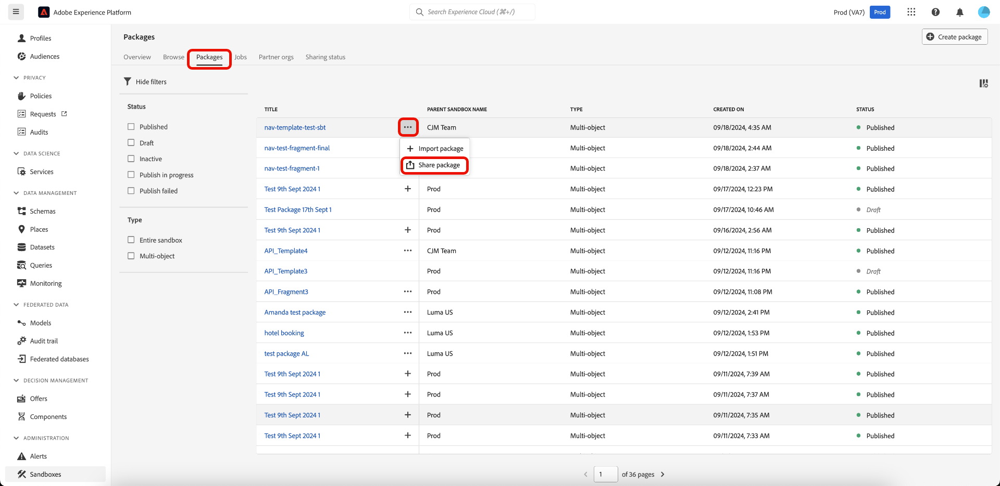

# 샌드박스 도구 를 사용하여 조직 간 패키지 공유

>[!NOTE]
>
>조직 간 패키지 공유는 현재 베타 버전이며 일부 베타 고객만 사용할 수 있습니다.

이 문서에서는 Adobe Experience Platform의 샌드박스 도구를 사용하여 여러 조직 간에 패키지를 공유하는 방법을 다룹니다.

샌드박스 도구 기능을 사용하여 샌드박스 간 구성 정확도를 높이고 여러 조직의 샌드박스 간에 샌드박스 구성을 원활하게 내보내고 가져올 수 있습니다. 공유 패키지에는 두 가지 유형이 있습니다.

**비공개 패키지**

비공개 패키지는 옵트인 허용 목록을 통해 소스 조직의 공유 요청을 승인한 조직과만 공유할 수 있습니다.

**공개 패키지**

추가 승인 없이 공개 패키지를 가져올 수 있습니다. 이러한 패키지는 파트너의 웹 사이트, 블로그 또는 플랫폼에서 공유할 수 있습니다. 패키지 페이로드를 사용하면 이러한 채널에서 대상 조직으로 패키지를 복사하여 붙여넣을 수 있습니다.

## 비공개 패키지

>[!NOTE]
>
>공유 요청을 시작 및 승인하고 조직 간에 패키지를 공유하려면 **패키지 공유** 역할 기반 액세스 제어 권한이 있어야 합니다.

샌드박스 도구 기능은 조직 파트너십을 만들고, 파트너십 요청의 상태를 추적하고, 기존 파트너십을 관리하고, 파트너 조직과 패키지를 공유할 수 있는 기능을 제공합니다.

### 조직 파트너십 요청 만들기

조직 파트너 관계 요청을 만들려면 [!UICONTROL 샌드박스] **[!UICONTROL 파트너 조직]** 탭으로 이동합니다. 그런 다음 **[!UICONTROL 파트너 조직 관리]**&#x200B;를 선택합니다.

[!UICONTROL 파트너 관리 패키지] 대화 상자에서 조직 ID를 **[!UICONTROL 조직 ID 입력]**&#x200B;에 입력하고 Enter 키를 누릅니다. 조직 ID는 아래의 **[!UICONTROL 선택한 조직 ID]** 섹션에 표시됩니다. ID를 추가한 후 **[!UICONTROL 확인]**&#x200B;을 선택합니다.

>[!TIP]
>
>쉼표로 구분된 목록을 사용하여 한 번에 여러 조직 ID를 입력하거나 각 조직 ID를 입력한 다음 Enter 키를 눌러 입력할 수 있습니다.

공유 요청이 파트너 조직으로 전송되었으며 **[!UICONTROL 보내는 요청]**&#x200B;을 표시하는 [!UICONTROL 샌드박스] **[!UICONTROL 파트너 조직]** 탭으로 돌아갑니다.

### 파트너 관계 요청 승인

조직 파트너 관계 요청을 승인하려면 [!UICONTROL 샌드박스] **[!UICONTROL 파트너 조직]** 탭으로 이동합니다. **[!UICONTROL 수신 요청]**&#x200B;을(를) 선택합니다.

요청의 현재 **[!UICONTROL 상태]**&#x200B;는 **보류 중**&#x200B;입니다. 요청을 승인하려면 선택한 요청 옆의 생략 부호(`...`)를 선택한 다음 드롭다운에서 **[!UICONTROL 승인]**&#x200B;을(를) 선택합니다.

**[!UICONTROL 파트너 조직 요청 검토]** 대화 상자에 조직 파트너 요청에 대한 세부 정보가 표시됩니다. 승인을 위해 [!UICONTROL 이유]를 입력한 다음 **[!UICONTROL 승인]**&#x200B;을 선택합니다.

[!UICONTROL 받는 요청] 페이지로 돌아왔고 요청 상태가 **[!UICONTROL 승인됨]**(으)로 업데이트되었습니다.

이제 조직과 소스 조직 간에 패키지를 공유할 수 있습니다.

### 파트너 조직에 패키지 공유

>[!NOTE]
>
>상태가 **게시됨**&#x200B;인 패키지만 공유할 수 있습니다.

승인된 파트너 조직에 패키지를 공유하려면 [!UICONTROL 샌드박스] **[!UICONTROL 패키지]** 탭으로 이동합니다. 그런 다음 패키지 옆에 있는 줄임표(`...`)를 선택한 다음 드롭다운 메뉴에서 **[!UICONTROL 패키지 공유]**&#x200B;를 선택합니다.

**[!UICONTROL 패키지 공유]** 대화 상자의 **[!UICONTROL 설정 공유]** 드롭다운에서 공유할 패키지를 선택한 다음 **[!UICONTROL 확인]**&#x200B;을 선택합니다.

>[!TIP]
>
>두 개 이상의 조직을 선택할 수 있습니다. 선택한 조직이 [!UICONTROL 설정 공유] 드롭다운 아래에 표시됩니다.

## 다음 단계

이 문서에서는 샌드박스 도구 기능을 사용하여 여러 조직 간에 패키지를 공유하는 방법을 보여 줍니다. 자세한 내용은 [샌드박스 도구 가이드](../ui/sandbox-tooling.md)를 참조하세요.

샌드박스 API를 사용하여 다른 작업을 수행하는 단계는 [샌드박스 개발자 안내서](../api/getting-started.md)를 참조하십시오. Experience Platform의 샌드박스에 대한 높은 수준의 개요는 [개요 설명서](../home.md)를 참조하세요.
