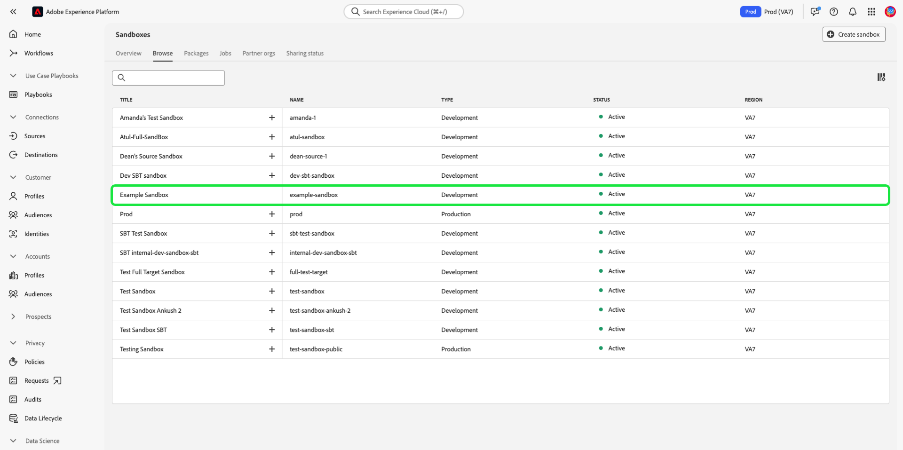
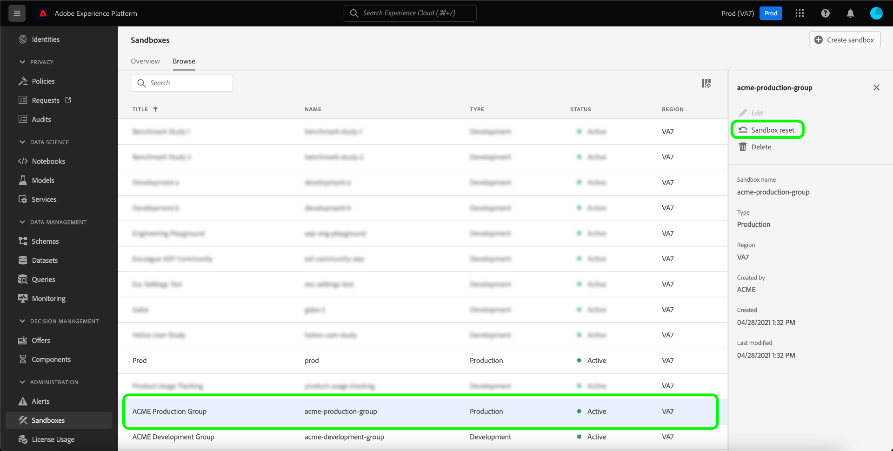
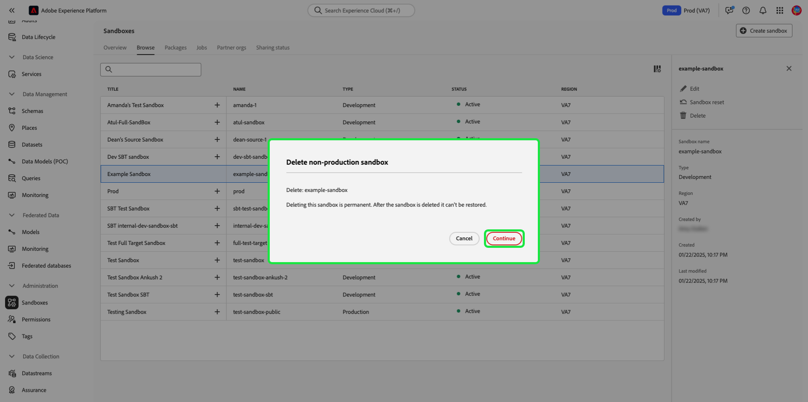

# 샌드박스 UI 안내서

이 문서에서는 Adobe Experience Platform 사용자 인터페이스의 샌드박스와 관련된 다양한 작업을 수행하는 방법에 대해 설명합니다.

## 샌드박스 보기

플랫폼 UI에서 **[!UICONTROL 샌드박스]** 왼쪽 탐색에서 를 선택하고 을 선택합니다. **[!UICONTROL 찾아보기]** 열다 [!UICONTROL 샌드박스] 대시보드 . 대시보드는 각 유형(프로덕션 또는 개발)을 포함하여 조직에 대해 사용 가능한 모든 샌드박스를 나열합니다.

## 샌드박스 간 전환

샌드박스 표시기는 Platform UI의 상단 헤더에 있으며 현재 있는 샌드박스의 제목, 해당 지역 및 해당 유형을 표시합니다.

샌드박스 간을 전환하려면 샌드박스 표시기를 선택하고 드롭다운 목록에서 원하는 샌드박스를 선택합니다.

샌드박스를 선택하면 화면이 새로 고쳐지고 선택한 샌드박스로 업데이트됩니다.

## 새 샌드박스 만들기 {#create}

>[!CONTEXTUALHELP]
>id="platform_sandboxes_sandboxname"
>title="샌드박스 이름"
>abstract="샌드박스 이름은 이 샌드박스에 대한 고유 ID를 만들기 위해 백 엔드에서 사용되는 텍스트입니다."

>[!CONTEXTUALHELP]
>id="platform_sandboxes_sandboxtitle"
>title="샌드박스 제목"
>abstract="샌드박스 제목은 Experience Platform UI 전체에서 메뉴 및 드롭다운의 샌드박스를 나타내는 표시 이름입니다."

>[!NOTE]
>
>새 샌드박스를 만들 때 먼저 제품 프로필에 해당 새 샌드박스를 추가해야 합니다 [Adobe Admin Console](https://adminconsole.adobe.com/) 먼저 새 샌드박스 사용을 시작할 수 있습니다. 다음 문서를 참조하십시오. [제품 프로필에 대한 권한 관리](../../access-control/ui/permissions.md) 제품 프로필에 샌드박스를 프로비저닝하는 방법에 대한 자세한 내용을 참조하십시오.

Experience Platform에서 샌드박스를 사용하는 방법에 대한 간단한 개요를 보려면 다음 비디오를 사용하십시오.

>[!VIDEO](https://video.tv.adobe.com/v/29838/?quality=12&learn=on)

새 샌드박스를 만들려면 **[!UICONTROL 샌드박스 만들기]** 화면 오른쪽 상단 모서리에서 을(를) 클릭합니다.

다음 **[!UICONTROL 샌드박스 만들기]** 대화 상자가 나타납니다. 개발 샌드박스를 만드는 경우 **[!UICONTROL 개발]** 드롭다운 패널에서 을 선택합니다. 새 프로덕션 샌드박스를 만들려면 **[!UICONTROL 프로덕션]**.

유형을 선택한 후 샌드박스에 이름과 제목을 입력합니다. 제목은 사람이 읽을 수 있고 쉽게 식별할 수 있을 만큼 설명적이어야 합니다. 샌드박스 이름은 API 호출에 사용할 모든 소문자 식별자이며, 따라서 고유하고 간결한 식별자여야 합니다. 샌드박스 이름은 문자로 시작하고 최대 256자를 사용할 수 있으며 영숫자 및 하이픈(-)만 사용할 수 있습니다.

완료되면 을 선택합니다 **[!UICONTROL 만들기]**.

샌드박스 만들기를 완료하면 페이지를 새로 고치면 새 샌드박스가 다음에 나타납니다 **[!UICONTROL 샌드박스]** 상태가 &quot;인 대시보드[!UICONTROL 만들기]&quot;. 새 샌드박스는 시스템에서 프로비전되는 데 약 30초가 걸리며 그 후 상태가 &quot;&quot;로 변경됩니다[!UICONTROL 활성]&quot;.

## 샌드박스 재설정

>[!WARNING]
>
>다음은 기본 프로덕션 샌드박스 또는 사용자가 만든 프로덕션 샌드박스를 재설정하지 못하도록 할 수 있는 예외 목록입니다. <ul><li>샌드박스에 호스팅된 ID 그래프도 Adobe Analytics에서 을 위해 사용하는 경우 기본 프로덕션 샌드박스를 재설정할 수 없습니다 [CDA(Cross Device Analytics)](https://experienceleague.adobe.com/docs/analytics/components/cda/overview.html) 기능.</li><li>샌드박스에 호스팅된 ID 그래프도 Adobe Audience Manager에서 을 위해 사용하는 경우 기본 프로덕션 샌드박스를 재설정할 수 없습니다 [사용자 기반 대상(PBD)](https://experienceleague.adobe.com/docs/audience-manager/user-guide/features/destinations/people-based/people-based-destinations-overview.html).</li><li>CDA 및 PBD 기능 모두에 대한 데이터가 포함된 경우 기본 프로덕션 샌드박스를 재설정할 수 없습니다.</li><li>Adobe Audience Manager 또는 Audience Core Service와 양방향 세그먼트 공유에 사용되는 사용자가 만든 프로덕션 샌드박스는 경고 메시지 후에 재설정할 수 있습니다.</li></ul>

프로덕션 또는 개발 샌드박스를 재설정하면 샌드박스의 이름 및 관련 권한을 유지하면서 해당 샌드박스와 연결된 모든 리소스(스키마, 데이터 세트 등)가 삭제됩니다. 이 &quot;clean&quot; 샌드박스는 액세스 권한이 있는 사용자에 대해 동일한 이름으로 계속 사용할 수 있습니다.

샌드박스 목록에서 재설정할 샌드박스를 선택합니다. 표시되는 오른쪽 탐색 패널에서 를 선택합니다 **[!UICONTROL 샌드박스 재설정]**.

선택을 확인하라는 대화 상자가 나타납니다. 선택 **[!UICONTROL 계속]** 계속 진행합니다.

최종 확인 창에서 대화 상자에 샌드박스 이름을 입력하고 을(를) 선택합니다 **[!UICONTROL 재설정]**.

## 샌드박스 삭제

>[!WARNING]
>
>기본 프로덕션 샌드박스는 삭제할 수 없습니다. 그러나 다음 2방향 세그먼트 공유에 사용되는 사용자가 만든 모든 프로덕션 샌드박스 [!DNL Audience Manager] 또는 [!DNL Audience Core Service] 경고 메시지 후에 삭제할 수 있습니다.

프로덕션 또는 개발 샌드박스를 삭제하면 권한을 포함하여 해당 샌드박스와 연결된 모든 리소스가 영구적으로 제거됩니다.

샌드박스 목록에서 삭제할 샌드박스를 선택합니다. 표시되는 오른쪽 탐색 패널에서 를 선택합니다 **[!UICONTROL 삭제]**.

선택을 확인하라는 대화 상자가 나타납니다. 선택 **[!UICONTROL 계속]** 계속 진행합니다.

최종 확인 창에서 대화 상자에 샌드박스 이름을 입력하고 을(를) 선택합니다  **[!UICONTROL 계속]**.

## 다음 단계

이 문서에서는 Experience Platform UI 내에서 샌드박스를 관리하는 방법에 대해 보여줍니다. Sandbox API를 사용하여 샌드박스를 관리하는 방법에 대한 자세한 내용은 [샌드박스 개발자 안내서](../api/getting-started.md).
