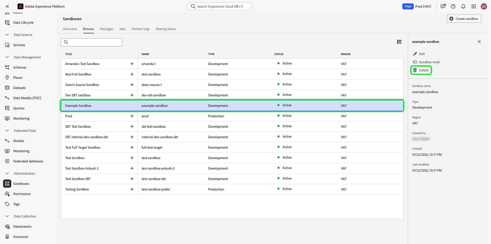

# 샌드박스 UI 안내서

이 문서에서는 Adobe Experience Platform 사용자 인터페이스에서 샌드박스와 관련된 다양한 작업을 수행하는 방법에 대한 단계를 설명합니다.

## 샌드박스 보기

Platform UI에서 를 선택합니다. **[!UICONTROL 샌드박스]** 왼쪽 탐색에서 을(를) 선택한 다음 **[!UICONTROL 찾아보기]** 을(를) 열려면 [!UICONTROL 샌드박스] 대시보드입니다. 대시보드에는 해당 유형(프로덕션 또는 개발)을 포함하여 조직에서 사용할 수 있는 모든 샌드박스가 나열됩니다.

## 샌드박스 간 전환

샌드박스 표시기는 Platform UI의 상단 헤더에 있으며 현재 있는 샌드박스의 제목, 지역 및 유형을 표시합니다.

샌드박스 간에 전환하려면 샌드박스 표시기를 선택하고 드롭다운 목록에서 원하는 샌드박스를 선택합니다.

샌드박스를 선택하면 화면이 새로 고침되고 선택한 샌드박스로 업데이트됩니다.

## 새 샌드박스 만들기 {#create}

>[!CONTEXTUALHELP]
>id="platform_sandboxes_sandboxname"
>title="샌드박스 이름"
>abstract="샌드박스 이름은 이 샌드박스의 고유 ID를 만들기 위해 백엔드에서 사용되는 텍스트입니다."

>[!CONTEXTUALHELP]
>id="platform_sandboxes_sandboxtitle"
>title="샌드박스 제목"
>abstract="샌드박스 제목은 Experience Platform UI 전반에 걸쳐 메뉴와 드롭다운의 샌드박스를 나타내는 디스플레이 이름입니다."

>[!NOTE]
>
>새 샌드박스가 생성되면 먼저 의 제품 프로필에 해당 새 샌드박스를 추가해야 합니다 [Adobe Admin Console](https://adminconsole.adobe.com/) 새 샌드박스 사용을 시작하기 전에 다음에서 설명서를 참조하십시오. [제품 프로필에 대한 권한 관리](../../access-control/ui/permissions.md) 제품 프로필에 샌드박스를 프로비저닝하는 방법에 대한 정보입니다.

Experience Platform에서 샌드박스를 사용하는 방법에 대한 빠른 개요를 알려면 다음 비디오를 사용하십시오.

>[!VIDEO](https://video.tv.adobe.com/v/29838/?quality=12&learn=on)

새 샌드박스를 생성하려면 다음을 선택합니다. **[!UICONTROL 샌드박스 만들기]** 화면의 오른쪽 상단 모서리에서

다음 **[!UICONTROL 샌드박스 만들기]** 대화 상자가 나타납니다. 개발 샌드박스를 생성하는 경우 다음을 선택합니다. **[!UICONTROL 개발]** 드롭다운 패널에서 이해할 수 있습니다. 새 프로덕션 샌드박스를 만들려면 다음을 선택합니다. **[!UICONTROL 프로덕션]**.

유형을 선택한 후 샌드박스에 이름과 제목을 입력합니다. 제목은 사람이 읽을 수 있어야 하며 쉽게 식별할 수 있을 만큼 설명적이어야 합니다. 샌드박스 이름은 API 호출에 사용할 모든 소문자 식별자이므로 고유하고 간결해야 합니다. 샌드박스 이름은 문자로 시작하고 최대 256자까지 사용할 수 있으며 영숫자와 하이픈(-)으로만 구성해야 합니다.

완료되면 다음을 선택합니다. **[!UICONTROL 만들기]**.

샌드박스를 생성했으면 페이지를 새로 고침하고 새 샌드박스가 **[!UICONTROL 샌드박스]** 상태가 &quot; &quot;인 대시보드[!UICONTROL 생성 중]&quot;. 새 샌드박스가 시스템에 의해 프로비저닝되는 데 약 30초가 걸리고 그 후 상태가 &quot; &quot;(으)로 변경됩니다.[!UICONTROL 활성]&quot;.

## 샌드박스 재설정

>[!WARNING]
>
>다음은 기본 프로덕션 샌드박스 또는 사용자가 만든 프로덕션 샌드박스를 재설정하지 못하도록 할 수 있는 예외 목록입니다.
>* 샌드박스에서 ID 그래프가 호스팅되는 경우 Adobe Analytics이 기본 프로덕션 샌드박스를 재설정할 수 없습니다. [CDA(Cross Device Analytics)](https://experienceleague.adobe.com/docs/analytics/components/cda/overview.html) 기능.
>* 샌드박스에서 ID 그래프가 호스팅되는 경우 Adobe Audience Manager이 기본 프로덕션 샌드박스를 재설정할 수 없습니다. [사용자 기반 대상(PBD)](https://experienceleague.adobe.com/docs/audience-manager/user-guide/features/destinations/people-based/people-based-destinations-overview.html).
>* 기본 프로덕션 샌드박스가 CDA와 PBD 기능 모두에 대한 데이터를 포함하는 경우 재설정할 수 없습니다.
>* Adobe Audience Manager 또는 Audience Core Service와 공유하는 양방향성 세그먼트에 사용되는 사용자가 만든 프로덕션 샌드박스는 경고 메시지 후에 재설정할 수 있습니다.
>* 샌드박스 재설정을 시작하기 전에 관련 대상 데이터가 제대로 정리되도록 컴포지션을 수동으로 삭제해야 합니다.

### 대상 구성 삭제

대상 구성은 현재 샌드박스 재설정 기능과 통합되지 않았으므로 샌드박스 재설정을 수행하기 전에 대상을 수동으로 삭제해야 합니다.

선택 **[!UICONTROL 대상]** 왼쪽 탐색에서 을(를) 선택한 다음 **[!UICONTROL 컴포지션]**.

![다음 [!UICONTROL 컴포지션] 의 탭 [!UICONTROL 대상] 작업 영역.](../images/ui/audiences.png)

그런 다음 줄임표(`...`)을 클릭하여 첫 번째 대상자 옆에 있는 다음 을 선택합니다 **[!UICONTROL 삭제]**.

![을 강조 표시하는 대상 메뉴 [!UICONTROL 삭제] 옵션을 선택합니다.](../images/ui/delete-composition.png)

성공적인 삭제 확인이 표시되고 로 돌아갑니다. **[!UICONTROL 컴포지션]** 탭.

모든 컴포지션을 사용하여 위의 단계를 반복합니다. 이렇게 하면 대상 인벤토리에서 모든 대상이 삭제됩니다. 모든 대상이 제거되면 샌드박스를 계속 재설정할 수 있습니다.

### 샌드박스 재설정

프로덕션 또는 개발 샌드박스를 재설정하면 샌드박스의 이름과 관련 권한을 유지하면서 해당 샌드박스(스키마, 데이터 세트 등)와 관련된 모든 리소스가 삭제됩니다. 이 &quot;클린&quot; 샌드박스는 액세스 권한이 있는 사용자가 동일한 이름으로 계속 사용할 수 있습니다.

샌드박스 목록에서 재설정할 샌드박스를 선택합니다. 표시되는 오른쪽 탐색 패널에서 을 선택합니다. **[!UICONTROL 샌드박스 재설정]**.

선택을 확인하는 대화 상자가 나타납니다. 선택 **[!UICONTROL 계속]** 계속합니다.

마지막 확인 창에서 대화 상자에 샌드박스 이름을 입력하고 을(를) 선택합니다 **[!UICONTROL 재설정]**.

## 샌드박스 삭제

>[!WARNING]
>
>기본 프로덕션 샌드박스는 삭제할 수 없습니다. 단, 와 공유하는 양방향 세그먼트에 사용되는 사용자가 만든 모든 프로덕션 샌드박스 [!DNL Audience Manager] 또는 [!DNL Audience Core Service] 경고 메시지 후에 삭제할 수 있습니다.

프로덕션 또는 개발 샌드박스를 삭제하면 권한을 포함하여 해당 샌드박스와 연결된 모든 리소스가 영구적으로 제거됩니다.

샌드박스 목록에서 삭제할 샌드박스를 선택합니다. 표시되는 오른쪽 탐색 패널에서 을 선택합니다. **[!UICONTROL 삭제]**.

선택을 확인하는 대화 상자가 나타납니다. 선택 **[!UICONTROL 계속]** 계속합니다.

마지막 확인 창에서 대화 상자에 샌드박스 이름을 입력하고 을(를) 선택합니다  **[!UICONTROL 계속]**.

## 다음 단계

이 문서에서는 Experience Platform UI 내에서 샌드박스를 관리하는 방법을 보여 줍니다. 샌드박스 API를 사용하여 샌드박스를 관리하는 방법에 대한 자세한 내용은 [샌드박스 개발자 안내서](../api/getting-started.md).
