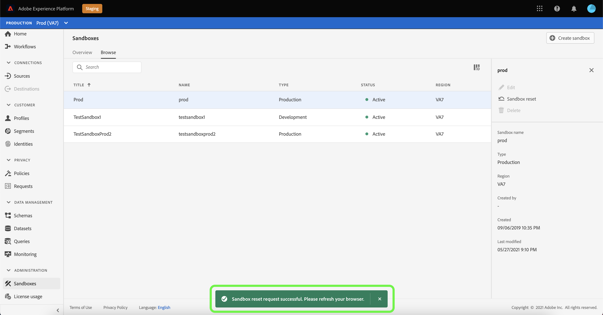

# 샌드박스 UI 안내서

이 문서에서는 Adobe Experience Platform 사용자 인터페이스의 샌드박스와 관련된 다양한 작업을 수행하는 방법에 대해 설명합니다.

## 샌드박스 보기

Platform UI의 왼쪽 탐색 영역에서 **[!UICONTROL 샌드박스]**&#x200B;를 선택하여 [!UICONTROL 샌드박스] 대시보드를 엽니다. 대시보드는 샌드박스 유형(프로덕션 또는 개발)과 상태(활성, 생성, 삭제 또는 실패)를 포함하여 조직에 사용 가능한 모든 샌드박스를 나열합니다.

## 샌드박스 간 전환

화면 왼쪽 상단에 있는 **샌드박스 전환기** 컨트롤은 현재 활성 샌드박스를 표시합니다.

샌드박스 간을 전환하려면 샌드박스 전환기를 선택하고 드롭다운 목록에서 원하는 샌드박스를 선택합니다.

샌드박스를 선택하면 이제 샌드박스 전환기에서 선택한 샌드박스와 함께 화면이 새로 고쳐집니다.

## 샌드박스 검색

샌드박스 전환기 메뉴에서 검색 기능을 사용하여 사용 가능한 샌드박스 목록을 탐색할 수 있습니다. 조직에서 사용할 수 있는 모든 샌드박스를 통해 필터링하기 위해 액세스할 샌드박스 이름을 입력합니다.

## 새 샌드박스 만들기

>[!NOTE]
>
>새 샌드박스를 만들 때 새 샌드박스 사용을 시작하려면 먼저 [Adobe Admin Console](https://adminconsole.adobe.com/)에서 해당 새 샌드박스를 제품 프로필에 추가해야 합니다. 제품 프로필에 샌드박스를 프로비저닝하는 방법에 대한 자세한 내용은 [제품 프로필에 대한 권한 관리](../../access-control/ui/permissions.md)에 대한 설명서를 참조하십시오.

Experience Platform에서 샌드박스를 사용하는 방법에 대한 간단한 개요를 보려면 다음 비디오를 사용하십시오.

>[!VIDEO](https://video.tv.adobe.com/v/29838/?quality=12&learn=on)

새 샌드박스를 만들려면 화면의 오른쪽 상단 모서리에서 **[!UICONTROL 샌드박스 만들기]** 를 선택합니다.

**[!UICONTROL 샌드박스 만들기]** 대화 상자가 나타납니다. 개발 샌드박스를 만드는 경우 드롭다운 패널에서 **[!UICONTROL 개발]**&#x200B;을 선택합니다. 새 프로덕션 샌드박스를 만들려면 **[!UICONTROL 프로덕션]**&#x200B;을 선택합니다.

유형을 선택한 후 샌드박스에 이름과 제목을 입력합니다. 제목은 사람이 읽을 수 있고 쉽게 식별할 수 있을 만큼 설명적이어야 합니다. 샌드박스 이름은 API 호출에 사용할 모든 소문자 식별자이며, 따라서 고유하고 간결한 식별자여야 합니다. 샌드박스 이름은 문자로 시작하고 최대 256자를 사용할 수 있으며 영숫자 및 하이픈(-)만 사용할 수 있습니다.

완료되면 **[!UICONTROL 만들기]**&#x200B;를 선택합니다.

샌드박스 만들기를 마쳤으면 페이지를 새로 고침하면 새 샌드박스가 **[!UICONTROL 샌드박스]** 대시보드에 &quot;[!UICONTROL 만들기]&quot; 상태로 나타납니다. 새 샌드박스는 시스템에서 프로비전되는 데 약 30초가 걸리며 상태가 &quot;[!UICONTROL Active]&quot;로 변경됩니다.

## 샌드박스 재설정

>[!IMPORTANT]
>
>내에 호스팅된 ID 그래프가 [Cross Device Analytics(CDA)](https://experienceleague.adobe.com/docs/analytics/components/cda/overview.html) 기능에도 Adobe Analytics에서 사용되고 있거나 이 내에 호스팅된 ID 그래프가 [사람 기반 대상(PBD)](https://experienceleague.adobe.com/docs/audience-manager/user-guide/features/destinations/people-based/people-based-destinations-overview.html) 기능에도 Adobe Audience Manager에서 사용되고 있는 경우에는 기본 프로덕션 샌드박스를 재설정할 수 없습니다.

프로덕션 또는 개발 샌드박스를 재설정하면 샌드박스의 이름 및 관련 권한을 유지하면서 해당 샌드박스와 연결된 모든 리소스(스키마, 데이터 세트 등)가 삭제됩니다. 이 &quot;clean&quot; 샌드박스는 액세스 권한이 있는 사용자에 대해 동일한 이름으로 계속 사용할 수 있습니다.

샌드박스 목록에서 재설정할 샌드박스를 선택합니다. 표시되는 오른쪽 탐색 패널에서 **[!UICONTROL Sandbox 재설정]**&#x200B;을 선택합니다.

선택을 확인하라는 대화 상자가 나타납니다. 계속하려면 **[!UICONTROL 계속]**&#x200B;을 선택하십시오.

최종 확인 창에서 대화 상자에 샌드박스 이름을 입력하고 **[!UICONTROL 재설정]**&#x200B;을 선택합니다

잠시 후 화면 하단에 확인 상자가 표시되어 성공적으로 재설정을 확인합니다.

### 경고

CDA 데이터가 포함된 기본 프로덕션 샌드박스는 재설정할 수 없으며 다음 경고를 반환합니다.

PBD 데이터가 포함된 기본 프로덕션 샌드박스도 재설정할 수 없으며 다음 경고를 반환합니다.

CDA와 PBD 모두에 대한 데이터가 포함된 기본 프로덕션 샌드박스도 재설정할 수 없으며 다음 경고를 반환합니다.

[!DNL Audience Manager] 또는 [!DNL Audience Core Service]과 양방향 세그먼트 공유에 사용되는 프로덕션 샌드박스를 재설정할 수 있습니다. [!UICONTROL 계속]을 선택하여 재설정을 계속 진행합니다.

## 샌드박스 삭제

>[!IMPORTANT]
>
>기본 프로덕션 샌드박스는 삭제할 수 없습니다.

프로덕션 또는 개발 샌드박스를 삭제하면 권한을 포함하여 해당 샌드박스와 연결된 모든 리소스가 영구적으로 제거됩니다.

샌드박스 목록에서 삭제할 샌드박스를 선택합니다. 표시되는 오른쪽 탐색 패널에서 **[!UICONTROL 삭제]**&#x200B;를 선택합니다.

선택을 확인하라는 대화 상자가 나타납니다. 계속하려면 **[!UICONTROL 계속]**&#x200B;을 선택하십시오.

최종 확인 창에서 대화 상자에 샌드박스 이름을 입력하고 **[!UICONTROL 계속]**&#x200B;을 선택합니다.

다음 경고 후에도 [!DNL Audience Manager] 또는 [!DNL Audience Core Service]과(와) 양방향 세그먼트 공유에 사용되는 사용자가 생성한 프로덕션 샌드박스를 삭제할 수 있습니다.

## 다음 단계

이 문서에서는 Experience Platform UI 내에서 샌드박스를 관리하는 방법에 대해 보여줍니다. Sandbox API를 사용하여 샌드박스를 관리하는 방법에 대한 자세한 내용은 [샌드박스 개발자 안내서](../api/getting-started.md)를 참조하십시오.
