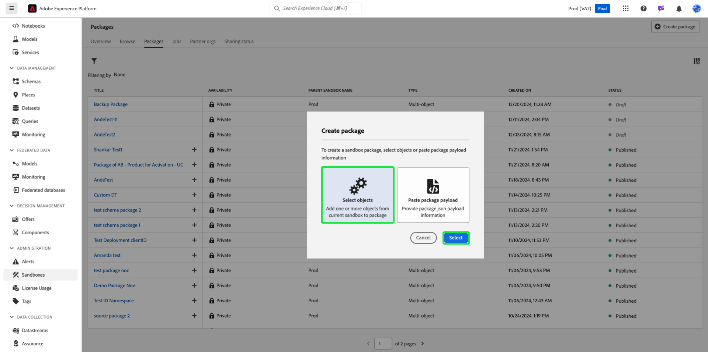

# 샌드박스 도구를 사용하여 오브젝트 구성 백업

샌드박스를 안전하게 재설정하고 버전 관리 지원을 추가하려면 샌드박스 도구 패키지를 사용하여 객체 구성(또는 메타데이터)을 백업합니다. 백업 패키지는 특히 개발 반복 시 스키마, 데이터 세트 및 대상자와 같은 중요한 구성의 손실을 방지합니다.

{zoomable="yes"}

## 이 사용 사례를 고려하는 이유 {#why-this-use-case}

샌드박스 도구를 사용하여 백업 패키지를 만들면 개체 구성이 저장되고 보호됩니다. 개발 샌드박스는 실험 및 제작에 따라 빠르게 작성할 수 있으며, 샌드박스를 재설정한 후 처음부터 빌드하면 시간이 오래 걸리고 오류가 발생할 여지가 있습니다. 샌드박스 툴의 기능을 사용하면 백업 패키지를 새로 재설정된 샌드박스로 가져와서 이상적인 구성을 즉시 반환하여 개발을 계속할 수 있습니다.

또한 백업 패키지를 사용하면 개발 프로세스 전체에서 버전 관리를 지원할 수 있습니다. 샌드박스가 변경되면 이전 패키지와 함께 추가 백업 패키지를 만들어 샌드박스를 모든 구성으로 쉽게 복원할 수 있습니다.

## 전제 조건 및 계획 {#prerequisites-and-planning}

조직 내에서 고유한 백업 패키지를 작성하려는 경우 계획 프로세스에서 다음 사전 요구 사항을 고려하십시오.

- 조직 내에서 현재 샌드박스 사용을 평가합니다. 라이선스 자격에 근접하거나 초과하는 비프로덕션 샌드박스가 있습니까?
- 백업하려는 메타데이터의 범위는 무엇입니까? 사용 사례에 따라 전체 또는 부분 샌드박스를 백업할 수도 있습니다.
- 백업할 범위 메타데이터에 따라 개체를 수동으로 [패키지에 추가](../ui/sandbox-tooling.md#add-object-to-a-new-package)하는 방법 또는 [전체 샌드박스를 내보내기](../ui/sandbox-tooling.md#export-an-entire-sandbox)하는 방법을 이해했는지 확인하십시오.
- 올바른 권한으로 조직의 샌드박스 도구에 액세스할 수 있는지 확인하십시오.

### 사용할 UI 기능, Experience Platform 구성 요소 및 Experience Cloud 제품 {#ui-functionality-and-elements}

이 사용 사례를 성공적으로 구현하려면 Adobe Experience Platform의 여러 영역을 사용해야 합니다. 이러한 모든 영역에 필요한 [특성 기반 액세스 제어 권한](../../access-control/abac/overview.md)이 있는지 확인하거나 시스템 관리자에게 필요한 권한을 부여하도록 요청하십시오.

- [샌드박스 도구](../ui/sandbox-tooling.md)
- [샌드박스 관리](../ui/user-guide.md)
- [라이선스 사용 대시보드](../../landing/license-usage-and-guardrails/license-usage-dashboard.md)
- [데이터 세트](../../catalog/datasets/overview.md)
- [스키마](../../xdm//home.md)
- [대상자](../../segmentation/home.md)
- Adobe Journey Optimizer의 [여정](https://experienceleague.adobe.com/ko/docs/journey-optimizer/using/orchestrate-journeys/journey)

## 사용 사례를 달성하는 방법: 높은 수준의 개요 {#achieve-the-use-case-high-level}

1. 백업할 메타데이터 범위를 정의합니다.
2. 샌드박스 도구 사용자 인터페이스를 사용하여 원하는 개체를 백업 패키지로 내보냅니다.
3. 샌드박스가 현재 구성과 일치하도록 새 버전의 백업 패키지를 정기적으로 만듭니다.
4. 비프로덕션 샌드박스에 대한 권한에 대해 라이선스 사용 대시보드에서 현재 사용량을 확인합니다.
5. 권한을 준수하거나 불필요한 리소스 및 데이터 저장소를 비활용하도록 비프로덕션 샌드박스를 재설정합니다.
6. 백업 패키지를 재설정한 후 샌드박스로 가져와서 개체 구성을 복원합니다.

## 사용 사례 달성 방법: 단계별 지침 {#step-by-step-instructions}

추가 설명서에 대한 링크를 포함하는 아래 섹션을 읽어 위의 높은 수준 개요에서 각 단계를 완료합니다.

### 메타데이터 범위 정의

백업 패키지를 작성하기 전에 패키지의 사용 사례를 고려해야 합니다. 필요에 따라 전체 샌드박스를 백업하거나 [사전 요구 사항](#prerequisites-and-planning)에서 설명한 대로 패키지에 추가할 특정 개체를 선택할 수 있습니다.

>[!NOTE]
>
> 샌드박스를 백업하여 재설정하는 경우 샌드박스 재설정에 대한 [제한 사항](../ui/user-guide.md#reset-a-sandbox)을 알아 두십시오.

### 선택한 메타데이터를 패키지로 내보내기

이제 샌드박스 도구 사용자 인터페이스를 사용하여 샌드박스를 백업할 준비가 되었습니다. 이 단계에서는 전체 샌드박스 백업과 특정 오브젝트 백업을 모두 다룹니다.

>[!NOTE]
>
> 모든 객체가 샌드박스 툴링에 대해 지원되는 것은 아닙니다. 허용 가능한 개체의 전체 목록은 [샌드박스 도구에 지원되는 개체](../ui/sandbox-tooling.md#objects-supported-for-sandbox-tooling) 안내서를 참조하십시오.

#### 전체 샌드박스 내보내기

샌드박스를 완전히 백업하려면 [샌드박스 도구 안내서](../ui/sandbox-tooling.md#export-an-entire-sandbox)에 따라 전체 샌드박스의 구성이 포함된 새 패키지를 만들어 게시합니다.

#### 개별 객체 내보내기

다음 방법 중 하나로 개별 오브젝트를 패키지에 백업할 수 있습니다. 이러한 안내서는 패키지에 스키마를 추가하는 데 중점을 두지만, 데이터 세트, 대상 또는 여정과 같은 다른 오브젝트에 동일한 단계가 적용됩니다.

- 샌드박스 도구의 [개체 추가 안내서](../ui/sandbox-tooling.md#add-object-to-a-new-package)를 따라 새 패키지에 개별 개체를 추가합니다.
- [샌드박스 도구 가이드](../ui/sandbox-tooling.md#add-an-object-to-an-existing-package-and-publish)에 따라 개별 개체를 기존 백업 패키지에 추가하여 변경 내용을 게시하십시오.
- 아래 안내서에 따라 개체를 추가할 빈 다중 개체 패키지를 만드십시오.

##### 다중 객체 패키지 생성

Experience Platform의 왼쪽 탐색에서 **[!UICONTROL 샌드박스]**&#x200B;를 선택한 다음 **[!UICONTROL 패키지]**&#x200B;를 선택합니다. 새 패키지를 만들려면 오른쪽 상단에서 **[!UICONTROL 패키지 만들기]**&#x200B;를 선택합니다.

**[!UICONTROL 패키지 만들기]** 대화 상자가 나타납니다. **[!UICONTROL 개체 선택]**&#x200B;을 선택한 다음 **[!UICONTROL 선택]**&#x200B;을 선택하십시오.

**[!UICONTROL 다중 개체]** 옵션을 선택하십시오. 이제 새 패키지의 이름을 제공해야 합니다. **[!UICONTROL 패키지 이름]** 텍스트 필드에 원하는 이름을 입력합니다. 완료되면 **[!UICONTROL 만들기]**&#x200B;를 선택합니다.

새 다중 개체 패키지가 만들어지고 [!UICONTROL 패키지] 대시보드에서 사용할 수 있습니다. 목록에서 패키지를 선택합니다.

패키지의 정보 및 컨텐츠가 표시됩니다. 현재 새 패키지에 오브젝트가 없습니다. 개체 추가를 시작하려면 [기존 패키지에 개체 추가](../ui/sandbox-tooling.md#add-object-to-a-new-package)에 대한 안내를 따르십시오.

### 필요에 따라 백업 패키지의 새 버전 만들기

샌드박스에 대한 첫 번째 백업 패키지를 만들었으므로 이제 샌드박스 구성이 변경될 때 백업 패키지의 새 버전을 만들 수 있습니다.

기존 백업 패키지에 새 개체를 추가할 수 있지만, 샌드박스에서 버전 관리를 지원하는 새 패키지를 만드는 것이 좋습니다. 이렇게 하면 개발을 계속할 때 이전 버전의 샌드박스를 쉽게 재설정하고 가져올 수 있습니다.

### 라이선스 권한에 대해 현재 사용량을 확인하십시오.

이제 백업 패키지가 준비되었으므로 샌드박스를 재설정하여 사용량을 재설정할 수 있습니다. 라이선스 권한을 조정하거나 필요에 따라 샌드박스를 재설정할 수 있도록 사용을 정기적으로 모니터링해야 합니다. 라이선스 사용 대시보드에 대한 자세한 내용은 [라이선스 사용 안내서](../../dashboards/guides/license-usage.md)를 참조하세요.

### 샌드박스 재설정

이때 샌드박스가 필요한 매개 변수를 충족한다고 가정하여 샌드박스를 안전하게 재설정할 수 있습니다. 샌드박스 재설정을 시작하려면 [샌드박스 재설정 안내](../ui/user-guide.md#reset-a-sandbox)를 따르십시오. 샌드박스를 재설정하지 못하도록 하는 경고 사례를 읽어 보십시오.

### 새로 만든 백업 패키지를 재설정 샌드박스로 가져오기

이제 샌드박스를 재설정했으므로 만든 백업 패키지를 사용할 수 있습니다. 대상 샌드박스로 패키지를 가져오는 단계별 프로세스를 보려면 [샌드박스 도구 안내서](../ui/sandbox-tooling.md#import-a-package-to-a-target-sandbox)를 따르십시오.

## 샌드박스 도구를 통해 얻은 기타 사용 사례: {#other-use-cases}

샌드박스 도구 를 통해 종료되는 추가 사용 사례를 살펴봅니다.

- [샌드박스 도구를 사용하여 Center of Excellence 활성화](./center-of-excellence.md)
