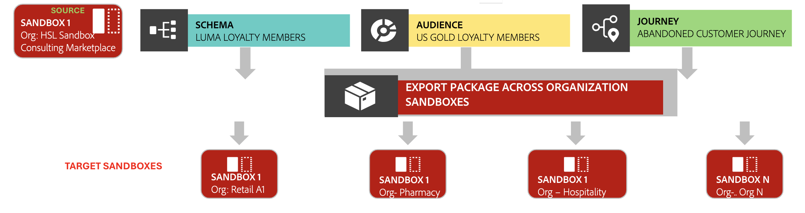

# 샌드박스 도구를 사용하여 Center of Excellence 활성화

여러 샌드박스 간에 모범 사례를 표준화하는 &quot;골든 샌드박스&quot; 패키지를 만들어 샌드박스 도구를 사용하여 모범 사례를 활성화합니다.

{zoomable="yes"}

## 이 사용 사례를 고려하는 이유 {#why-this-use-case}

많은 대기업 또는 기업은 다양한 조직, 팀, 지역 또는 개발 환경에 여러 샌드박스를 사용합니다. [샌드박스 도구](../ui/sandbox-tooling.md)의 강력한 기능을 사용하여 여러 샌드박스에서 조직의 표준 일관성, 규정 준수 및 정렬을 보장하기 위해 골든 샌드박스 패키지를 만들 수 있습니다.

이 골든 샌드박스 패키지는 주요 구성을 효율적으로 공유할 수 있는 우수성의 중심을 만듭니다. 샌드박스 도구를 사용하면 여러 샌드박스에서 패키지를 쉽게 가져올 수 있습니다. 광범위한 일관성을 보장하기 위해 추가 조직에 패키지를 공유할 수도 있습니다.

이 사용 사례에 설명된 단계에 따라 골든 샌드박스 패키지를 직접 만듭니다.

## 업계 사례 {#industry-example}

예를 들어, 북미, 유럽 및 아프리카와 같은 다양한 지역에 걸쳐 운영되는 은행을 고려해 보십시오. 각 시장 또는 지역에는 자체 Adobe Experience Platform 인스턴스가 있습니다. 이 은행은 단일 버전의 데이터 모델을 모든 시장에 배포할 수 있는 글로벌 설계자 팀이 관리하는 중앙 집중식 데이터 모델을 유지하고자 합니다.

이 은행은 골든 샌드박스 패키지를 만들고 유지 관리하기 위해 샌드박스 도구 사용을 선택합니다. 이를 통해 개발 효율성이 높아지고, 일관된 데이터 모델을 만들 수 있으며, 모든 지역에서 일관성을 유지할 수 있습니다.

## 전제 조건 및 계획 {#prerequisites-and-planning}

조직 내에서 고유한 우수 센터를 만들려는 경우 계획 프로세스에서 다음 전제 조건을 고려하십시오.

- 패키지에 포함할 모범 사례 및 구성을 식별합니다.
- 골든 샌드박스로 설정할 모든 관련성 있고 검증된 구성을 사용하여 샌드박스를 만듭니다.
- 필요한 경우 기준 표준에 대한 이해 당사자의 입력과 동의를 얻습니다.

### 사용할 UI 기능, Experience Platform 구성 요소 및 Experience Cloud 제품 {#ui-functionality-and-elements}

이 사용 사례를 성공적으로 구현하려면 Adobe Experience Platform의 여러 영역을 사용해야 합니다. 이러한 모든 영역에 필요한 [특성 기반 액세스 제어 권한](../../access-control/abac/overview.md)이 있는지 확인하거나 시스템 관리자에게 필요한 권한을 부여하도록 요청하십시오.

- [샌드박스 도구](../ui/sandbox-tooling.md)
- [샌드박스 관리](../ui/user-guide.md)
- [데이터 세트](../../catalog/datasets/overview.md)
- [스키마](../../xdm//home.md)
- [대상자](../../segmentation/home.md)
- Adobe Journey Optimizer의 [여정](https://experienceleague.adobe.com/en/docs/journey-optimizer/using/orchestrate-journeys/journey)

## 사용 사례를 달성하는 방법: 높은 수준의 개요 {#achieve-the-use-case-high-level}

1. 골든 샌드박스에서 모범 사례를 나타내는 기준선 구성을 만듭니다. 데이터 세트, 스키마, 대상 또는 여정과 같은 개체가 여기에 포함될 수 있습니다.
2. 샌드박스 도구를 사용하여 구성을 패키지로 내보냅니다.
3. 이 패키지를 모든 관련 샌드박스로 가져옵니다.
4. 여러 조직이 있는 경우 조직 간에 이 패키지를 공유하십시오.
5. 가져오기 및 내보내기를 모니터링하고 감사 로그를 통해 변경 사항을 추적합니다.
6. 모든 샌드박스가 모범 사례에 맞게 정렬되도록 표준이 발전함에 따라 골든 샌드박스를 정기적으로 업데이트합니다.

## 사용 사례 달성 방법: 단계별 지침 {#step-by-step-instructions}

위의 높은 수준의 개요에 있는 각 단계를 완료하려면 추가 설명서에 대한 링크가 포함된 아래 섹션을 읽어보십시오.

### 골든 샌드박스 만들기

탁월함의 중심을 활성화하기 위한 첫 단계는 골든 샌드박스를 제작하는 것입니다. 이 샌드박스에는 모범 사례를 나타내는 기본 구성이 포함되어야 합니다. 이 골든 샌드박스를 만들려면 Experience Platform에서 [새 샌드박스 만들기](../ui/user-guide.md#create-a-new-sandbox)에 대한 안내서를 따르십시오.

샌드박스가 만들어지면 [스키마](../../xdm/ui/resources/schemas.md#create-a-new-schema), [데이터 세트](../../catalog/datasets/user-guide.md#create-a-dataset) 또는 [대상](../../segmentation/ui/segment-builder.md)과 같은 기준 개체 구성을 만들기 시작합니다. 계속하기 전에 구성을 검토하십시오.

### 샌드박스를 패키지로 내보내기

이제 샌드박스에 기준 객체 구성이 포함되었으므로 샌드박스 도구를 사용하여 패키지로 내보낼 수 있습니다. [전체 샌드박스 내보내기](../ui/sandbox-tooling.md#export-an-entire-sandbox)에 대한 안내서를 따라 골든 샌드박스 패키지를 만드십시오.

### 관련 샌드박스로 패키지 가져오기

이제 패키지가 생성되었으므로 이 패키지를 관련 샌드박스로 가져올 수 있습니다. 가장 좋은 방법은 전체 샌드박스가 포함된 패키지를 빈 샌드박스로 가져오는 것입니다. 샌드박스 도구를 사용하면 Experience Platform 내에서 직접 샌드박스로 [전체 샌드박스 패키지를 가져오기](../../sandboxes/ui/sandbox-tooling.md#import-the-entire-sandbox-package)할 수 있습니다.

### 조직 간 패키지 공유

샌드박스 도구를 사용하면 만든 패키지를 여러 조직에서 공유할 수 있습니다. [패키지 공유 가이드](../../sandboxes/ui/sharing-packages-across-orgs.md)에 따라 골든 샌드박스 패키지를 공유하십시오.

### 감사 로그를 통해 가져오기 및 내보내기 모니터링

패키지를 가져오거나 내보낼 때 Experience Platform의 **[!UICONTROL 작업]** 대시보드를 사용하여 작업 상태를 모니터링할 수 있습니다. 작업 모니터링에 대한 자세한 내용은 [가져오기 세부 정보 모니터링](../../sandboxes/ui/sandbox-tooling.md#monitor-import-details)의 안내서를 참조하십시오.

### 골든 샌드박스를 정기적으로 업데이트

이제 골든 샌드박스 패키지가 완성되었으므로 표준화된 우수 센터를 구축하여 샌드박스로 계속 가져오거나 조직 간에 공유할 수 있습니다. 모범 사례가 변경되고 발전함에 따라 골든 샌드박스에서 기본 오브젝트 구성을 정기적으로 업데이트하는 것이 중요합니다. 샌드박스를 업데이트할 때 이와 동일한 프로세스에 따라 Golden 샌드박스 패키지의 새 반복을 만들 수 있습니다.

>[!NOTE]
>
> 위의 단계는 Experience Platform 사용자 인터페이스의 프로세스를 따릅니다. 다양한 끝점을 통해 API를 사용하여 동일한 단계를 따를 수 있습니다. API를 통해 각 요청을 수행하는 방법에 대한 자세한 내용은 `sandboxes` [끝점 안내서](https://experienceleague.adobe.com/en/docs/experience-platform/sandbox/api/sandboxes#create) 및 `packages` [끝점 안내서](https://experienceleague.adobe.com/en/docs/experience-platform/sandbox/sandbox-tooling-api/packages)를 참조하십시오.

## 파트너 데이터 지원을 통해 달성한 기타 사용 사례 {#other-use-cases}

샌드박스 도구를 통해 활성화된 추가 사용 사례를 살펴봅니다.

- [샌드박스 도구를 사용하여 개체 구성 백업](./backup-object-configuration.md)
