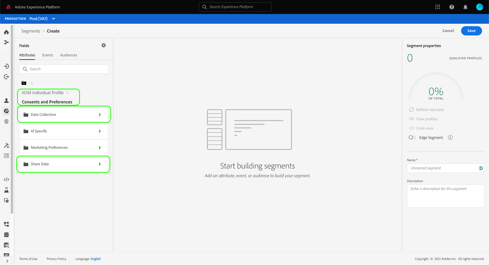

# 세그먼트의 동의 준수

다음과 같은 법적 개인 정보 보호 규정 [!DNL California Consumer Privacy Act] (CCPA)는 개인정보를 수집하거나 서드파티와 공유하지 않도록 선택할 수 있는 권한을 소비자에게 제공합니다. Adobe Experience Platform은 실시간 고객 프로필 데이터에서 이러한 고객 동의 환경 설정을 캡처할 수 있도록 하는 표준 경험 데이터 모델(XDM) 구성 요소를 제공합니다.

고객이 개인 데이터를 공유하도록 하는 데 대한 동의를 철회하거나 보류한 경우, 조직에서 마케팅 활동에 대한 대상을 생성할 때 해당 환경 설정을 준수하는 것이 중요합니다. 이 문서에서는 Experience Platform 사용자 인터페이스를 사용하여 세그먼트 정의에 고객 동의 값을 통합하는 방법을 설명합니다.

## 시작하기

고객 동의 값을 준수하려면 다양한 사항을 이해해야 합니다 [!DNL Adobe Experience Platform] 관련 서비스. 이 자습서를 시작하기 전에 다음 서비스를 잘 알고 있는지 확인하십시오.

* [[!DNL Experience Data Model (XDM)]](../xdm/home.md): 플랫폼이 고객 경험 데이터를 구성하는 표준화된 프레임워크입니다.
* [[!DNL Real-Time Customer Profile]](../profile/home.md): 여러 소스에서 집계한 데이터를 기반으로 통합 고객 프로필을 실시간으로 제공합니다.
* [[!DNL Adobe Experience Platform Segmentation Service]](./home.md): 다음에서 대상 세그먼트를 만들 수 있습니다. [!DNL Real-Time Customer Profile] 데이터.

## 동의 스키마 필드

고객 동의 및 환경 설정을 준수하기 위해 의 일부인 스키마 중 하나 [!UICONTROL XDM 개별 프로필] 유니온 스키마에는 표준 필드 그룹이 포함되어야 합니다. **[!UICONTROL 동의 및 환경 설정]**.

필드 그룹에서 제공하는 각 속성의 구조 및 사용 사례에 대한 자세한 내용은 다음을 참조하십시오. [동의 및 환경 설정 참조 안내서](../xdm/field-groups/profile/consents.md). 스키마에 필드 그룹을 추가하는 방법에 대한 단계별 지침은 [XDM UI 안내서](../xdm/ui/resources/schemas.md#add-field-groups).

필드 그룹이 추가되면에 [프로필 활성화 스키마](../xdm/ui/resources/schemas.md#profile) 및 해당 필드는 경험 애플리케이션에서 동의 데이터를 수집하는 데 사용되었으므로 세그먼트 규칙에서 수집된 동의 속성을 사용할 수 있습니다.

## 세분화에서 동의 처리

옵트아웃 프로필이 세그먼트에 포함되지 않도록 하려면 새 세그먼트를 만들 때 특수 필드를 기존 세그먼트에 추가하고 포함해야 합니다.

아래 절차에서는 두 가지 유형의 옵트아웃 플래그에 적합한 필드를 추가하는 방법을 보여줍니다.

1. [!UICONTROL 데이터 수집]
1. [!UICONTROL 데이터 공유]

>[!NOTE]
>
>이 안내서는 위의 두 가지 옵트아웃 플래그에 중점을 두지만, 추가 동의 신호를 통합하도록 세그먼트를 구성할 수도 있습니다. 다음 [동의 및 환경 설정 참조 안내서](../xdm/field-groups/profile/consents.md) 에서는 이러한 각 옵션 및 의도한 사용 사례에 대해 자세히 설명합니다.

UI에서 세그먼트를 작성할 때에서 **[!UICONTROL 속성]**, 다음으로 이동 **[!UICONTROL XDM 개별 프로필]**&#x200B;을 선택한 다음 을 선택합니다. **[!UICONTROL 동의 및 환경 설정]**. 여기에서 다음에 대한 옵션을 볼 수 있습니다. **[!UICONTROL 데이터 수집]** 및 **[!UICONTROL 데이터 공유]**.

다음을 선택하여 시작 **[!UICONTROL 데이터 수집]** 범주, 드래그 **[!UICONTROL 선택 값]** 세그먼트 빌더로 이동합니다. 속성을 세그먼트에 추가할 때 [동의 값](../xdm/field-groups/profile/consents.md#choice-values) 포함 또는 제외해야 합니다.

한 가지 접근 방식은 데이터를 수집하지 않기로 선택한 고객을 제외하는 것입니다. 이렇게 하려면 연산자를 다음으로 설정합니다. **[!UICONTROL 다음과 같지 않음]**&#x200B;을 클릭하고 다음 값을 선택합니다.

* **[!UICONTROL 아니요(옵트아웃)]**
* **[!UICONTROL 기본값 No(옵트아웃)]**
* **[!UICONTROL 알 수 없음]** (달리 알 수 없는 경우 동의가 보류된 것으로 간주되는 경우)

아래 **[!UICONTROL 속성]** 왼쪽 레일에서 로 다시 이동합니다. **[!UICONTROL 동의 및 환경 설정]** 섹션, 선택 **[!UICONTROL 데이터 공유]**. 해당 항목 드래그 **[!UICONTROL 선택 값]** 을(를) 캔버스에 넣고 의 값과 동일한 값을 [!UICONTROL 데이터 수집] 선택 값입니다. 다음을 확인합니다. **[!UICONTROL 또는]** 두 특성 간에 관계가 설정됩니다.

두 가지 모두 사용 **[!UICONTROL 데이터 수집]** 및 **[!UICONTROL 데이터 공유]** 세그먼트에 추가된 동의 값, 데이터가 사용되지 않도록 선택한 모든 고객은 결과 대상자에서 제외됩니다. 여기에서 선택하기 전에 세그먼트 정의를 계속 사용자 지정할 수 있습니다. **[!UICONTROL 저장]** 프로세스를 완료합니다.

## 다음 단계

이 자습서를 따라 Experience Platform에서 세그먼트를 작성할 때 고객 동의 및 환경 설정을 적용하는 방법을 보다 잘 이해할 수 있습니다.

Platform에서의 동의 관리에 대한 자세한 내용은 다음 설명서를 참조하십시오.

* [Adobe 표준을 사용한 동의 처리](../landing/governance-privacy-security/consent/adobe/overview.md)
* [IAB TCF 2.0 표준을 사용한 동의 처리](../landing/governance-privacy-security/consent/iab/overview.md)