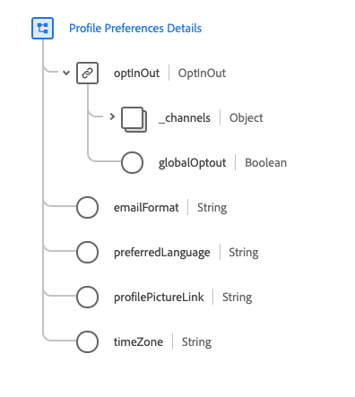

# 세그먼트에서 옵트아웃 요청 준수

Adobe Experience Platform을 사용하면 고객이 [!DNL Real-time Customer Profile] 내에서 데이터의 사용 및 저장과 관련된 옵트아웃 요청을 보낼 수 있습니다. 이러한 수신 거부 요청은 캘리포니아 거주자에게 개인 데이터에 액세스하고 삭제할 수 있는 권한과 개인 데이터의 판매 또는 공개 여부(및 사용자)를 알 수 있는 권한을 제공하는 [!DNL California Consumer Privacy Act](CPA)의 일부입니다.

고객이 옵트아웃한 후에는 조직에서 마케팅 활동에 대한 대상을 생성할 때 이러한 옵트아웃을 기념해야 합니다. 이 문서에서는 옵트아웃 요청 수집에 관한 중요한 세부 사항을 설명합니다.

## 시작하기

옵트아웃 요청을 준수하려면 관련된 다양한 [!DNL Adobe Experience Platform] 서비스를 이해해야 합니다. 옵트아웃 요청을 사용하기 전에 다음 서비스에 대한 설명서를 검토하십시오.

- [[!DNL Real-time Customer Profile]](../profile/home.md):여러 소스에서 수집한 데이터를 기반으로 통합된 고객 프로파일을 실시간으로 제공합니다.
- [[!DNL Adobe Experience Platform Segmentation Service]](./home.md):데이터에서 대상 세그먼트를 만들 수  [!DNL Real-time Customer Profile] 있습니다.
- [[!DNL Experience Data Model (XDM)]](../xdm/home.md):Platform(플랫폼)이 고객 경험 데이터를 구성하는 표준화된 프레임워크입니다.
- [[!DNL Adobe Experience Platform Privacy Service]](../privacy-service/home.md):조직에서 내부 고객 데이터와 관련된 데이터 개인 정보 보호 규정 준수를 자동화할 수  [!DNL Platform]있습니다.

## 옵트아웃 믹싱

CPA 옵트아웃 요청을 승인하려면 조합 스키마의 일부인 스키마 중 하나에 필요한 [!DNL Experience Data Model](XDM) 옵트아웃 필드를 포함해야 합니다. 스키마에 옵트아웃 필드를 추가하는 데 사용할 수 있는 2개의 혼합이 있으며, 각 믹스는 다음 섹션에서 보다 자세히 다룹니다.

- [프로필 개인 정보](#profile-privacy):다양한 옵트아웃 유형(일반 또는 영업/공유)을 캡처하는 데 사용됩니다.
- [프로필 환경 설정 세부 정보](#profile-preferences-details):특정 XDM 채널에 대한 옵트아웃 요청을 캡처하는 데 사용됩니다.

스키마에 혼합을 추가하는 방법에 대한 단계별 지침은 다음 XDM 설명서의 &quot;믹서 추가&quot; 섹션을 참조하십시오.
- [스키마 레지스트리 API 자습서입니다](../xdm/api/getting-started.md).:스키마 레지스트리 API를 사용하여 스키마 빌드.
- [스키마 편집기 자습서](../xdm/tutorials/create-schema-ui.md):플랫폼 사용자 인터페이스를 사용하여 스키마 작성

다음은 사용자 인터페이스에서 스키마에 추가된 옵트아웃 믹스를 보여주는 예제 이미지입니다.


각 혼합의 구조와 스키마에 기여하는 필드에 대한 설명은 다음 섹션에 자세히 설명되어 있습니다.

### [!DNL Profile Privacy] {#profile-privacy}

[!DNL Profile Privacy] 믹싱을 사용하면 고객으로부터 2가지 유형의 CPA 옵트아웃 요청을 캡처할 수 있습니다.

1. 일반 옵트아웃
2. 판매/공유 옵트아웃


[!DNL Profile Privacy] 믹스에는 다음 필드가 포함되어 있습니다.

- 개인 정보 옵트아웃(`privacyOptOuts`):옵트아웃 개체 목록이 포함된 배열입니다.
- 옵트아웃 유형(`optOutType`):옵트아웃 유형입니다. 이 필드는 두 개의 가능한 값을 가진 열거형입니다.
   - 일반 옵트아웃(`general_opt_out`)
   - 영업 공유 옵트아웃(`sales_sharing_opt_out`)
- 옵트아웃 값(`optOutValue`):지정된 옵트아웃 유형을 기준으로 옵트아웃 신호의 값이라고도 하는 옵트아웃 상태의 활성 상태입니다. 이 필드는 4개의 가능한 값을 가진 열거형입니다.
   - 제공되지 않음(`not_provided`):옵트아웃 요청이 제공되지 않았습니다.
   - 보류 중인 확인(`pending`):옵트아웃 요청이 확인 보류 중입니다.
   - 옵트아웃(`out`):고객이 수신 거부되었습니다.
   - 옵트인(`in`):고객이 선택한 상태입니다.
- 옵트아웃 타임스탬프(`timestamp`):수신된 옵트아웃 신호의 타임스탬프.

[!DNL Profile Privacy] 혼합의 전체 구조를 보려면 [XDM 공개 GitHub 리포지토리](https://github.com/adobe/xdm/blob/master/schemas/context/profile-privacy.schema.json)를 참조하거나 플랫폼 UI를 사용하여 믹싱을 미리 보십시오.

### [!DNL Profile Preferences Details] {#profile-preferences-details}

[!DNL Profile Preferences Details] 믹스인은 고객 프로파일에 대한 환경 설정(예: 이메일 형식, 기본 언어 및 표준 시간대)을 나타내는 여러 필드를 제공합니다. 이 믹스에 포함된 필드 중 하나인 OptInOut(`optInOut`)은 개별 채널에 대해 옵트아웃 값을 설정할 수 있도록 허용합니다.



[!DNL Profile Preferences Details] 믹스에는 옵트아웃과 관련된 다음 필드가 포함되어 있습니다.

- OptInOut(`optInOut`):각 키가 통신 채널에 대해 유효하고 알려진 URI와 각 채널에 대한 옵트아웃의 활성 상태를 나타내는 객체입니다. 각 채널에는 다음 4가지 값 중 하나를 사용할 수 있습니다.
   - 제공되지 않음(`not_provided`):이 채널에 대해 옵트아웃 요청이 제공되지 않았습니다.
   - 보류 중인 확인(`pending`):이 채널에 대한 옵트아웃 요청이 확인 보류 중입니다.
   - 옵트아웃(`out`):고객이 이 채널을 선택 해제했습니다.
   - 옵트인(`in`):고객이 이 채널에 선택하였습니다.
- 전역 옵트아웃(`globalOptout`):true로 설정되면 프로필에 대한 전역 옵트아웃 오버라이드를 설정하는 부울 값입니다. 이 필드의 기본값은 false입니다.

아래의 JSON 예에는 OptInOut 객체가 서로 다른 통신 채널에 대해 여러 개의 옵트아웃 신호를 캡처할 수 있는 방법이 강조 표시됩니다.

```json
{
  "xdm:optInOut": {
    "https://ns.adobe.com/xdm/channels/email": "pending",
    "https://ns.adobe.com/xdm/channels/phone": "out",
    "https://ns.adobe.com/xdm/channels/sms": "in",
    "https://ns.adobe.com/xdm/channels/fax": "not_provided",
    "https://ns.adobe.com/xdm/channels/direct-mail": "not_provided",
    "https://ns.adobe.com/xdm/channels/apns": "not_provided",
    "xdm:globalOptout": false
  }
}
```

프로필 환경 설정 세부 정보 믹싱의 전체 구조를 보려면 [XDM 공개 GitHub 리포지토리](https://github.com/adobe/xdm/blob/master/schemas/context/profile-preferences-details.schema.json)을 방문하거나 [!DNL Platform] UI를 사용하여 믹싱을 미리 보십시오.

## 세그멘테이션에서 옵트아웃 처리

CPA 옵트아웃 플래그가 표시된 프로필이 세그먼트에 포함되지 않도록 세그먼트를 만드는 동안 특수 필드를 기존 세그먼트에 추가하거나 포함해야 합니다.

아래 섹션에서는 두 가지 유형의 옵트아웃 플래그에 적합한 필드를 추가하는 방법을 보여 줍니다.
1. 일반 옵트아웃
2. 판매/공유 옵트아웃

### 일반 옵트아웃

[!DNL Segmentation] &quot;[!UICONTROL General Opt-Out]&quot; 플래그가 포함된 모든 프로파일을 자동으로 처리합니다. 즉, 해당 프로필은 기본적으로 대상 또는 내보내기에 포함되지 않습니다. 하지만 옵트아웃 프로필이 대상 및 마케팅 활동에 포함되지 않도록 적절한 필드를 추가하는 것이 좋습니다.

이 작업은 **[!UICONTROL Privacy Opt-Outs]** 특성을 추가하여 사용자 인터페이스를 사용하여 수행할 수 있습니다. 이 경우 세그먼트는 선택한 사람만 포함하도록 설정됩니다(즉, 프로필에 일반적인 옵트아웃 플래그가 없음을 의미합니다. 이것은 &quot;[!UICONTROL Opt-Out Type]&quot;이 &quot;[!UICONTROL General Opt-Out]&quot;이고 &quot;[!UICONTROL Opt-Out Value]&quot;이 &quot;[!UICONTROL Opt-in]&quot;임을 선언하여 수행됩니다.


### 판매/공유 옵트아웃

사용자의 프로필에 판매/공유 옵트아웃 플래그가 설정되어 있는 경우 이 프로필을 더 이상 세그먼트 생성 또는 마케팅 활동에 사용하지 않아야 합니다. 이 플래그가 적용되도록 하려면 &quot;[!UICONTROL Opt-Out Type]&quot;이 &quot;[!UICONTROL Sales Sharing Opt-Out]&quot;이고 &quot;[!UICONTROL Opt-Out Value]&quot;은 &quot;[!UICONTROL Opt-in]&quot;과(와) 같아야 합니다.


<!-- ### Overriding default exclusions

In some instances, such as building a segment of people who have opted out, it may be necessary to override the default exclusion of opted-out profiles. This override can be done via the API or in the Segment Builder user interface. -->

## 다음 단계

API와 사용자 인터페이스를 통해 세그먼트 정의 및 대상을 사용한 작업을 비롯한 세그멘테이션에 대한 자세한 내용은 [세그멘테이션 개요](./home.md)를 읽으십시오.

[!DNL Privacy Service]이(가) 법률 및 조직의 개인 정보 보호 규정을 자동으로 준수하도록 돕는 방법을 포함하여 [!DNL Platform] 내의 데이터 개인 정보에 대한 자세한 내용은 [[!DNL Privacy Service]](../privacy-service/home.md)의 설명서를 참조하십시오.
