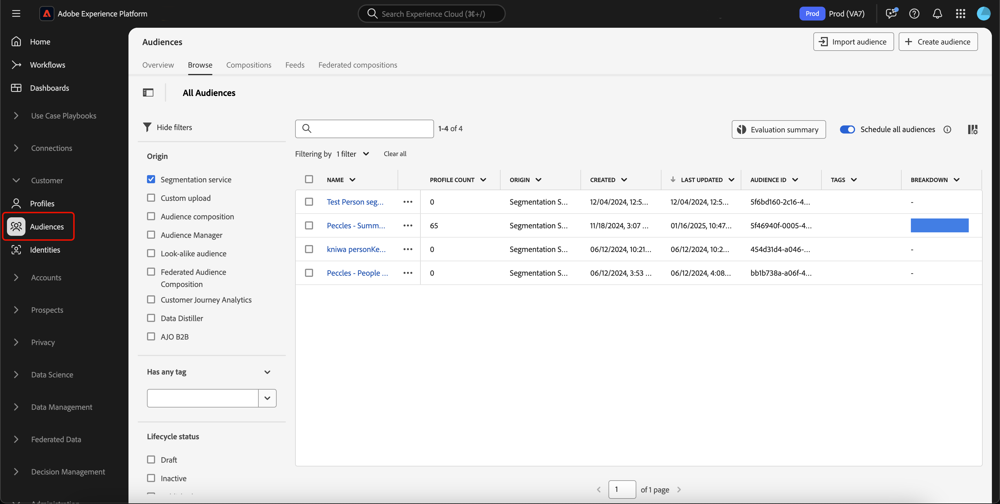

# 유연한 대상 평가 가이드

>[!AVAILABILITY]
>
>유연한 대상 그룹 평가는 **에서 실행 중인 Experience Platform 인스턴스에서**&#x200B;전용[!DNL Microsoft Azure]입니다. 지원되는 Experience Platform 인프라에 대한 자세한 내용은 [Experience Platform 멀티 클라우드 개요](../../landing/multi-cloud.md)를 참조하십시오.
>
>또한 유연한 대상자 평가는 **전용**&#x200B;이며 Real-Time CDP B2C 에디션에서 사용할 수 있습니다.

유연한 대상자 평가를 통해 필요에 따라 일괄 세그먼테이션 작업을 실행할 수 있습니다. 유연한 고객 평가를 통해 임시 캠페인 시작, 적시 커뮤니케이션 또는 기타 시간에 민감한 활동을 실행할 수 있습니다.

## 가드레일 {#guardrails}

>[!CONTEXTUALHELP]
>id="platform_segmentation_browse_flexibleaudienceevaluation"
>title="유연한 대상자 평가 제한"
>abstract="유연한 대상자 평가를 한 번 실행하여 최대 20개의 대상자를 평가할 수 있습니다.<br/><br/>또한 평가 작업은 가능한 한 빨리 실행되지만 온디맨드 평가는 다른 온디맨드 또는 배치 평가와 동시에 실행할 수 <b>없으므로</b> 시스템 지연이 발생할 수 있습니다."

유연한 대상 평가를 실행할 때는 다음 조건을 염두에 두십시오.

- 샌드박스당 하루에 유연한 대상 평가를 **두 번**&#x200B;만 사용할 수 있습니다. 이 제한은 자정(UTC)에 재설정됩니다.
- **프로덕션** 샌드박스당 연간 50회의 유연한 대상 평가 실행이 **최대**&#x200B;입니다.
   - 1년은 유연한 대상 평가를 위해 Experience Platform 계약일로부터 1년으로 정의됩니다. 예를 들어 5월 18일에 계약을 시작한 경우 유연한 대상자 평가 실행 횟수는 5월 18일마다 재설정됩니다.
- **개발** 샌드박스당 연간 유연한 대상자 평가 실행 횟수는 **최대**&#x200B;회입니다.
   - 1년은 유연한 청중 평가를 위해 Experience Platform 계약일로부터 1년으로 정의된다. 예를 들어 5월 18일에 약정을 시작하면 유연한 대상자 평가 실행 횟수가 5월 18일마다 재설정됩니다.
- 모든 대상 **must**&#x200B;에 &quot;세분화 서비스&quot; 원본이 있습니다.
- 모든 대상 **must**&#x200B;은(는) 일괄 처리 세분화를 사용하여 평가됩니다.
- 모든 대상 **은(는) 사용자 기반 대상이어야 합니다**.
- 유연한 대상 평가 실행당 최대 20명의 대상자만 선택할 수 있습니다.

>[!NOTE]
>
>연간 유연한 관객 평가 런을 추가로 구매할 수 있다. 자세한 내용은 Adobe 고객 지원 센터에 문의하십시오.

## 액세스 {#access}

유연한 대상 그룹 평가를 사용하려면 다음 권한이 있어야 합니다.

- **[!UICONTROL Evaluate Segment to an Audience]** 섹션 아래의 **[!DNL Profile Management]**.

역할 기반 액세스 제어에 대한 자세한 내용은 [액세스 제어 개요](../../access-control/home.md)를 참조하십시오.

## 유연한 사용자 평가 실행

Experience Platform API 또는 UI를 사용하여 유연한 대상 그룹 평가를 실행할 수 있습니다.

>[!BEGINTABS]

>[!TAB Experience Platform API]

Experience Platform API에서 유연한 대상 그룹 평가를 실행하려면 평가할 모든 세그먼트 정의(대상 그룹)의 ID가 포함된 세그먼트 작업을 만들어야 합니다.

>[!NOTE]
>
>세그먼트 작업 API 호출당 20개의 세그먼트 정의 ID 중 **최대**&#x200B;만 추가할 수 있습니다.

`/segment/jobs` 끝점에 대한 POST 요청을 만들고 세그먼트 정의의 ID를 요청 본문에 포함하여 새 세그먼트 작업을 만들 수 있습니다.

+++새 세그먼트 작업 생성에 대한 샘플 요청

```shell
curl -X POST https://platform.adobe.io/data/core/ups/segment/jobs \
 -H 'Authorization: Bearer {ACCESS_TOKEN}' \
 -H 'Content-Type: application/json' \
 -H 'x-gw-ims-org-id: {ORG_ID}' \
 -H 'x-api-key: {API_KEY}' \
 -H 'x-sandbox-name: {SANDBOX_NAME}' \
 -d '[
    {
        "segmentId": "7863c010-e092-41c8-ae5e-9e533186752e"
    },
    {
        "segmentId": "07d39471-05d1-4083-a310-d96978fd7c85"
    }
 ]'
```

| 속성 | 설명 |
| -------- | ----------- |
| `segmentId` | 평가할 세그먼트 정의의 ID입니다. 이러한 세그먼트 정의는 다른 병합 정책에 속할 수 있습니다. |

+++

응답이 성공하면 새로 생성된 세그먼트 작업에 대한 정보와 함께 HTTP 상태 200이 반환됩니다.

+++ 새 세그먼트 작업을 만들 때 샘플 응답.

```json
{
    "id": "b31aed3d-b3b1-4613-98c6-7d3846e8d48f",
    "imsOrgId": "{ORG_ID}",
    "sandbox": {
        "sandboxId": "28e74200-e3de-11e9-8f5d-7f27416c5f0d",
        "sandboxName": "prod",
        "type": "production",
        "default": true
    },
    "profileInstanceId": "ups",
    "source": "api",
    "status": "PROCESSING",
    "batchId": "678f53bc-e21d-4c47-a7ec-5ad0064f8e4c",
    "computeJobId": 8811,
    "computeGatewayJobId": "9ea97b25-a0f5-410e-ae87-b2d85e58f399",
    "segments": [
        {
            "segmentId": "7863c010-e092-41c8-ae5e-9e533186752e",
            "segment": {
                "id": "7863c010-e092-41c8-ae5e-9e533186752e",
                "expression": {
                    "type": "PQL",
                    "format": "pql/json",
                    "value": "workAddress.country = \"US\""
                },
                "mergePolicyId": "25c548a0-ca7f-4dcd-81d5-997642f178b9",
                "mergePolicy": {
                    "id": "25c548a0-ca7f-4dcd-81d5-997642f178b9",
                    "version": 1
                }
            }
        },
        {
            "segmentId": "07d39471-05d1-4083-a310-d96978fd7c85",
            "segment": {
                "id": "07d39471-05d1-4083-a310-d96978fd7c85",
                "expression": {
                    "type": "PQL",
                    "format": "pql/json",
                    "value": "workAddress.country = \"US\""
                },
                "mergePolicyId": "25c548a0-ca7f-4dcd-81d5-997642f178b9",
                "mergePolicy": {
                    "id": "25c548a0-ca7f-4dcd-81d5-997642f178b9",
                    "version": 1
                }
            }
        }
    ],
    "metrics": {
        "totalTime": {
            "startTimeInMs": 1573203617195,
            "endTimeInMs": 1573204395655,
            "totalTimeInMs": 778460
        },
        "profileSegmentationTime": {
            "startTimeInMs": 1573204266727,
            "endTimeInMs": 1573204395655,
            "totalTimeInMs": 128928
        },
        "segmentedProfileCounter":{
            "7863c010-e092-41c8-ae5e-9e533186752e":1033
        },
        "segmentedProfileByNamespaceCounter":{
            "7863c010-e092-41c8-ae5e-9e533186752e":{
                "tenantiduserobjid":1033,
                "campaign_profile_mscom_mkt_prod2":1033
            }
        },
        "segmentedProfileByStatusCounter":{
            "7863c010-e092-41c8-ae5e-9e533186752e":{
                "exited":144646,
                "realized":2056
            }
        },
        "totalProfiles":13146432,
        "totalProfilesByMergePolicy":{
            "25c548a0-ca7f-4dcd-81d5-997642f178b9":13146432
        }
    },
    "requestId": "4e538382-dbd8-449e-988a-4ac639ebe72b-1573203600264",
    "schema": {
        "name": "_xdm.context.profile"
    },
    "properties": {
        "scheduleId": "4e538382-dbd8-449e-988a-4ac639ebe72b",
        "runId": "e6c1308d-0d4b-4246-b2eb-43697b50a149"
    },
    "_links": {
        "cancel": {
            "href": "/segment/jobs/b31aed3d-b3b1-4613-98c6-7d3846e8d48f",
            "method": "DELETE"
        },
        "checkStatus": {
            "href": "/segment/jobs/b31aed3d-b3b1-4613-98c6-7d3846e8d48f",
            "method": "GET"
        }
    },
    "updateTime": 1573204395000,
    "creationTime": 1573203600535,
    "updateEpoch": 1573204395
}
```

+++

세그먼트 작업을 만든 후 `/segment/jobs` 끝점에 대한 GET 요청을 만들고 요청 경로에 새로 만든 세그먼트 작업의 ID를 제공하여 해당 상태를 확인할 수 있습니다.

+++세그먼트 작업 검색에 대한 샘플 요청

```shell
curl -X GET https://platform.adobe.io/data/core/ups/segment/jobs/b31aed3d-b3b1-4613-98c6-7d3846e8d48f \
 -H 'Authorization: Bearer {ACCESS_TOKEN}' \
 -H 'x-gw-ims-org-id: {ORG_ID}' \
 -H 'x-api-key: {API_KEY}' \
 -H 'x-sandbox-name: {SANDBOX_NAME}'
```

+++

성공한 응답은 지정된 세그먼트 작업에 대한 자세한 정보와 함께 HTTP 상태 200을 반환합니다.


+++ 세그먼트 작업을 검색하기 위한 샘플 응답입니다.

```json
{
    "id": "b31aed3d-b3b1-4613-98c6-7d3846e8d48f",
    "imsOrgId": "{ORG_ID}",
    "sandbox": {
        "sandboxId": "28e74200-e3de-11e9-8f5d-7f27416c5f0d",
        "sandboxName": "prod",
        "type": "production",
        "default": true
    },
    "profileInstanceId": "ups",
    "source": "api",
    "status": "SUCCEEDED",
    "batchId": "678f53bc-e21d-4c47-a7ec-5ad0064f8e4c",
    "computeJobId": 8811,
    "computeGatewayJobId": "9ea97b25-a0f5-410e-ae87-b2d85e58f399",
    "segments": [
        {
            "segmentId": "7863c010-e092-41c8-ae5e-9e533186752e",
            "segment": {
                "id": "7863c010-e092-41c8-ae5e-9e533186752e",
                "expression": {
                    "type": "PQL",
                    "format": "pql/text",
                    "value": "workAddress.country = \"US\""
                },
                "mergePolicyId": "25c548a0-ca7f-4dcd-81d5-997642f178b9",
                "mergePolicy": {
                    "id": "25c548a0-ca7f-4dcd-81d5-997642f178b9",
                    "version": 1
                }
            }
        },
        {
            "segmentId": "07d39471-05d1-4083-a310-d96978fd7c85",
            "segment": {
                "id": "07d39471-05d1-4083-a310-d96978fd7c85",
                "expression": {
                    "type": "PQL",
                    "format": "pql/json",
                    "value": "workAddress.country = \"US\""
                },
                "mergePolicyId": "25c548a0-ca7f-4dcd-81d5-997642f178b9",
                "mergePolicy": {
                    "id": "25c548a0-ca7f-4dcd-81d5-997642f178b9",
                    "version": 1
                }
            }
        }
    ],
    "metrics": {
        "totalTime": {
            "startTimeInMs": 1579304313411
        },
        "profileSegmentationTime": {}
    },
    "requestId": "4e538382-dbd8-449e-988a-4ac639ebe72b-1573203600264",
    "schema": {
        "name": "_xdm.context.profile"
    },
    "_links": {
        "cancel": {
            "href": "/segment/jobs/d3b4a50d-dfea-43eb-9fca-557ea53771fd",
            "method": "DELETE"
        },
        "checkStatus": {
            "href": "/segment/jobs/d3b4a50d-dfea-43eb-9fca-557ea53771fd",
            "method": "GET"
        }
    },
    "updateTime": 1579304339000,
    "creationTime": 1579304260897,
    "updateEpoch": 1579304339
}
```

+++

>[!TAB Experience Platform UI]

Experience Platform UI 내에서 유연한 대상 그룹 평가를 실행하려면 **[!UICONTROL Audiences]** 섹션에서 **[!UICONTROL Customers]**&#x200B;을(를) 선택합니다.



Audience Portal이 표시되고 조직의 모든 사용자 대상 목록이 표시됩니다. Audience Portal에서 평가하려는 대상 그룹을 선택하고 **[!UICONTROL Evaluate audience]**&#x200B;을(를) 선택할 수 있습니다.


온디맨드 세그먼트 작업으로 평가될 대상자 목록을 표시하는 **[!UICONTROL Evaluate audiences on demand]** 팝오버가 나타납니다. 대상자가 요청 시 평가를 받을 수 없는 경우 평가 작업에서 자동으로 제거됩니다. 나열된 대상이 평가하려는 대상인지 확인합니다.


올바른 대상이 나열되는지 확인한 후 요청을 진행할 수 있으며 유연한 대상 평가가 시작됩니다. [평가 작업 모니터링 보기](../../dataflows/ui/monitor-audiences.md#evaluation-job-details)에서 이 대상 평가의 상태를 볼 수 있습니다.

>[!NOTE]
>
>세그먼트 작업의 상태는 모니터링 대시보드 내에서 &quot;대기 중&quot; 상태로 보고될 수 있습니다. 요청 경로에서 세그먼트 작업의 ID를 제공하여 `/segment/jobs` 끝점에 대한 GET 요청을 수행하여 세그먼트 작업의 최신 상태를 볼 수 있습니다. 이 엔드포인트 사용에 대한 자세한 내용은 API 탭에서 확인할 수 있습니다.
>
>유연한 대상 평가를 실행하고 평가를 통해 대상에 대한 대상을 활성화하려는 경우 빈도를 **[!UICONTROL After segment evaluation]**(으)로 설정해야 합니다. [세그먼트 평가 후](../../destinations/ui/activate-batch-profile-destinations.md#export-full-files)에 이미 활성화되도록 설정된 대상에 대해 유연한 대상 평가를 실행하면 이전의 모든 일일 활성화 작업에 관계없이 유연한 대상 평가 작업이 완료되는 즉시 대상이 활성화됩니다.

>[!ENDTABS]

## 비디오 {#video}

다음 비디오에서는 Experience Platform에서 유연한 대상 평가에 액세스하고 사용하는 방법을 보여 줍니다.

>[!VIDEO](https://video.tv.adobe.com/v/3453647?captions=kor&)

## 자주 묻는 질문 {#faq}

다음 절에서는 유연한 청중 평가와 관련된 자주 묻는 질문들을 나열하였다.

### 유연한 대상 고객 평가를 사용하여 대상자를 얼마나 빨리 활성화할 수 있습니까?

+++ 답변

오디언스가 생성된 직후 유연한 오디언스 평가를 사용하여 오디언스를 활성화할 수 있습니다.

+++

### 유연한 청중 평가는 얼마나 걸리나요?

+++ 답변

유연한 청중 평가 작업은 완료하는 데 최대 4시간이 소요될 수 있습니다.

+++

### 유연한 대상자 평가를 통해 일정을 실행할 수 있습니까?

+++ 답변

아니요. 유연한 대상 평가에는 일정을 사용할 수 없습니다.

+++

### 유연한 대상 평가를 사용할 때 추가 내보내기 작업을 실행해야 합니까?

+++ 답변

아니요. 해당 세그먼트 작업이 완료된 후 내보내기 작업이 자동으로 실행됩니다.

+++

### 유연한 대상 평가로 평가된 대상을 사용할 수 있는 서비스는 무엇입니까?

+++ 답변

대상 및 Adobe Journey Optimizer 여정을 포함한 모든 다운스트림 서비스에서 대상자를 사용할 수 있습니다.

+++

### 유연한 시청률 평가 제한은 언제 재설정됩니까?

+++ 답변

일별 제한은 자정(UTC)에 재설정됩니다. 연간 한도는 계약 기념일에 재설정됩니다.

+++

### 유연한 대상 평가로 지원되는 대상 유형은 무엇입니까?

+++ 답변

유연한 대상자 평가를 위해서는 세분화 서비스의 기원을 가진 대상자만 지원됩니다. 컴포지션, 사용자 정의 업로드 또는 Data Distiller 등의 기타 대상자는 유연한 대상자 평가를 지원하지 않습니다.

+++

### 유연한 사용자 평가 실행 횟수에 기여하는 점수는 무엇입니까?

+++ 답변

API 또는 UI 수를 사용하여 최대 제한에 도달한 상태로 만들어진 유연한 대상 그룹 평가가 실행됩니다. 그러나 야간에 실행되는 일일 일괄 세그먼테이션 작업 실행은 이 제한에 영향을 주지 **않습니다**.

+++

### 유연한 관객 평가로 주요 관객을 평가할 때, 모든 종속 관객을 평가해야 하는가?

+++ 답변

아니요. 유연한 청중 평가는 모든 종속 청중을 자동으로 평가하게 된다. 예를 들어, 대상자 A가 대상자 B에 의존하는 경우 대상자 B만 평가하면 됩니다. 유연한 대상자 평가는 대상자 A를 자동으로 평가한 다음 대상자 B를 평가합니다.

+++
