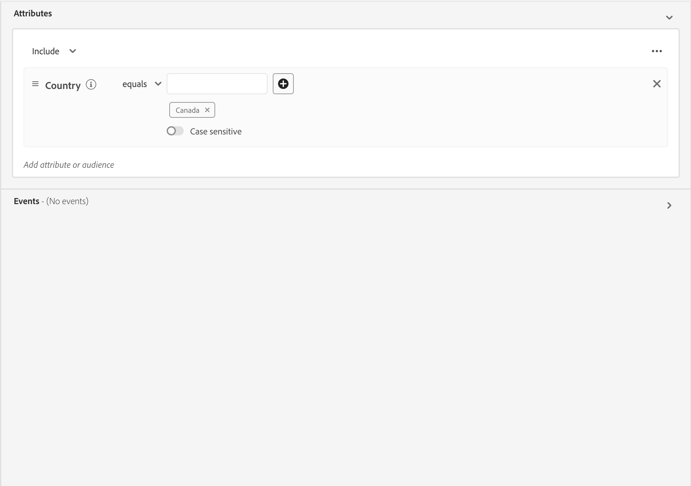
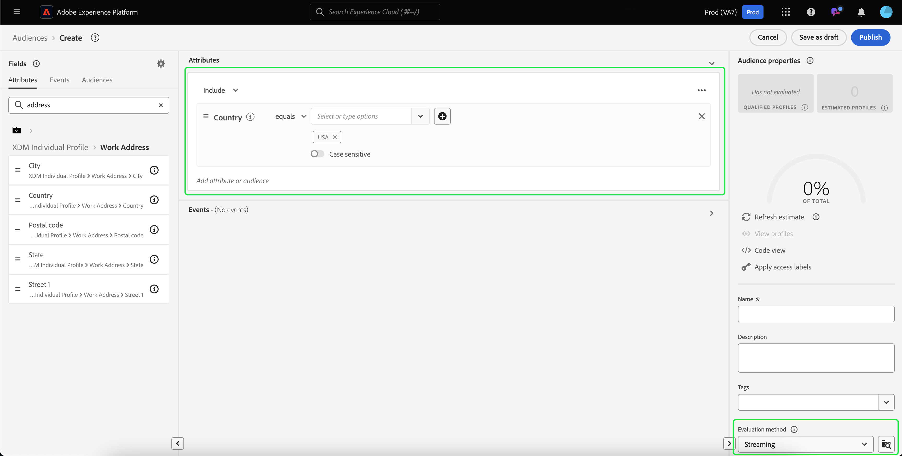

# 스트리밍 세분화 안내서

스트리밍 세그멘테이션은 데이터 풍부성에 초점을 맞추면서 거의 실시간으로 Adobe Experience Platform의 대상을 평가하는 기능입니다.

스트리밍 세분화를 사용하면 스트리밍 데이터가 Experience Platform으로 들어올 때 대상 자격이 발생하여 세분화 작업을 예약하고 실행해야 할 필요가 줄어듭니다. 이렇게 하면 Experience Platform으로 전달된 데이터를 평가할 수 있으므로 대상 멤버십을 자동으로 최신 상태로 유지할 수 있습니다.

## 적격 쿼리 유형 {#query-types}

쿼리가 다음 표에 요약된 기준을 충족하는 경우 스트리밍 세분화를 사용할 수 있습니다.

>[!NOTE]
>
>스트리밍 세분화를 사용하려면 조직에 대해 예약된 세분화를 활성화해야 합니다. 예약된 세그먼테이션 활성화에 대한 자세한 내용은 [Audience Portal 개요](../ui/audience-portal.md#scheduled-segmentation)를 참조하십시오.

| 쿼리 유형 | 세부 사항 | 쿼리 | 예 |
| ---------- | ------- | ----- | ------- |
| 24시간 미만의 기간 내 단일 이벤트 | 24시간 미만의 기간 내에 들어오는 단일 이벤트를 참조하는 모든 세그먼트 정의. | `CHAIN(xEvent, timestamp, [C0: WHAT(eventType.equals("commerce.checkouts", false)) WHEN(today)])` |  |
| 프로필만 | 프로필 속성만 참조하는 모든 세그먼트 정의. | `homeAddress.country.equals("US", false)` |  |
| 24시간 미만의 상대 시간 창 내에 프로필 속성이 있는 단일 이벤트 | 하나 이상의 프로필 속성을 가진 단일 수신 이벤트를 참조하고 24시간 미만의 상대 시간 창 내에서 발생하는 모든 세그먼트 정의입니다. | `workAddress.country.equals("US", false) and CHAIN(xEvent, timestamp, [C0: WHAT(eventType.equals("commerce.checkouts", false)) WHEN(today)])` |  |
| 세그먼트 | 하나 이상의 일괄 처리 또는 스트리밍 세그먼트를 포함하는 모든 세그먼트 정의입니다. **참고:** 세그먼트의 세그먼트가 사용되는 경우 **24시간마다**&#x200B;프로필의 자격이 상실됩니다. | `inSegment("a730ed3f-119c-415b-a4ac-27c396ae2dff") and inSegment("8fbbe169-2da6-4c9d-a332-b6a6ecf559b9")` |  |
| 프로필 속성이 있는 여러 이벤트 | 지난 24시간 내에 **여러 이벤트를 참조하고**(선택 사항) 하나 이상의 프로필 특성이 있는 세그먼트 정의입니다. | `workAddress.country.equals("US", false) and CHAIN(xEvent, timestamp, [C0: WHAT(eventType.equals("directMarketing.emailClicked", false)) WHEN(today), C1: WHAT(eventType.equals("commerce.checkouts", false)) WHEN(today)])` |  |

세그먼트 정의는 다음 시나리오에서 스트리밍 세분화에 적합하지 **않습니다**.

- 세그먼트 정의에는 Adobe Audience Manager(AAM) 세그먼트 또는 트레이트가 포함됩니다.
- 세그먼트 정의에는 여러 엔티티(다중 엔티티 쿼리)가 포함됩니다.
- 세그먼트 정의에는 단일 이벤트와 `inSegment` 이벤트의 조합이 포함됩니다.
   - 그러나 `inSegment` 이벤트에 포함된 세그먼트 정의가 프로필인 경우 스트리밍 세분화에 대해 세그먼트 정의 **will**&#x200B;을(를) 사용할 수 있습니다.
- 세그먼트 정의는 시간 제한의 일부로서 &quot;연도 무시&quot;를 사용합니다.

스트리밍 세분화 쿼리에 적용되는 다음 지침을 참고하십시오.

| 쿼리 유형 | 가이드라인 |
| ---------- | -------- |
| 단일 이벤트 쿼리 | 전환 확인 기간에는 제한이 없습니다. |
| 이벤트 기록이 있는 쿼리 | <ul><li>전환 확인 기간은 **하루**(으)로 제한됩니다.</li><li>이벤트 사이에 엄격한 시간 순서 지정 조건 **must**&#x200B;이(가) 있습니다.</li><li>적어도 한 개의 무효화된 이벤트가 있는 쿼리가 지원됩니다. 그러나 전체 이벤트 **은(는) 부정이 될 수 없습니다**.</li></ul> |

스트리밍 세분화 기준을 더 이상 충족하지 않도록 세그먼트 정의를 수정하면 세그먼트 정의가 자동으로 &quot;스트리밍&quot;에서 &quot;일괄 처리&quot;로 전환됩니다.

또한 세그먼트 자격과 마찬가지로 세그먼트 비자격은 실시간으로 발생합니다. 따라서 대상이 더 이상 세그먼트에 적합하지 않으면 즉시 부적격 상태가 됩니다. 예를 들어 세그먼트 정의가 &quot;지난 3시간 동안 빨간 신발을 구매한 모든 사용자&quot;를 묻는 경우 3시간 후에 세그먼트 정의에 대해 처음에 자격을 부여한 모든 프로필은 부적격합니다.

## 대상자 만들기 {#create-audience}

세분화 서비스 API를 사용하거나 UI의 대상 포털을 통해 스트리밍 세분화를 사용하여 평가되는 대상을 만들 수 있습니다.

세그먼트 정의가 [적격 쿼리 유형](#eligible-query-types) 중 하나와 일치하는 경우 스트리밍을 사용할 수 있습니다.

>[!BEGINTABS]

>[!TAB 세그먼테이션 서비스 API]

**API 형식**

```http
POST /segment/definitions
```

**요청**

+++ 스트리밍 세분화를 위해 활성화된 세그먼트 정의를 만들기 위한 샘플 요청

```shell
curl -X POST https://platform.adobe.io/data/core/ups/segment/definitions
 -H 'Authorization: Bearer {ACCESS_TOKEN}' \
 -H 'Content-Type: application/json' \
 -H 'x-gw-ims-org-id: {ORG_ID}' \
 -H 'x-api-key: {API_KEY}' \
 -H 'x-sandbox-name: {SANDBOX_NAME}'
 -d '{
        "name": "People in the USA",
        "description: "An audience that looks for people who live in the USA",
        "expression": {
            "type": "PQL",
            "format": "pql/text",
            "value": "homeAddress.country = \"US\""
        },
        "evaluationInfo": {
            "batch": {
                "enabled": false
            },
            "continuous": {
                "enabled": true
            },
            "synchronous": {
                "enabled": false
            }
        },
        "schema": {
            "name": "_xdm.context.profile"
        }
     }'
```

+++

**응답**

성공적인 응답은 새로 생성된 세그먼트 정의에 대한 세부 정보와 함께 HTTP 상태 200을 반환합니다.

+++세그먼트 정의를 생성할 때 샘플 응답.

```json
{
    "id": "4afe34ae-8c98-4513-8a1d-67ccaa54bc05",
    "schema": {
        "name": "_xdm.context.profile"
    },
    "profileInstanceId": "ups",
    "imsOrgId": "{ORG_ID}",
    "sandbox": {
        "sandboxId": "28e74200-e3de-11e9-8f5d-7f27416c5f0d",
        "sandboxName": "prod",
        "type": "production",
        "default": true
    },
    "name": "People in the USA",
    "description": "An audience that looks for people who live in the USA",
    "expression": {
        "type": "PQL",
        "format": "pql/text",
        "value": "homeAddress.country = \"US\""
    },
    "evaluationInfo": {
        "batch": {
            "enabled": false
        },
        "continuous": {
            "enabled": true
        },
        "synchronous": {
            "enabled": false
        }
    },
    "dataGovernancePolicy": {
        "excludeOptOut": true
    },
    "creationTime": 0,
    "updateEpoch": 1579292094,
    "updateTime": 1579292094000
}
```

+++

이 끝점 사용에 대한 자세한 내용은 [세그먼트 정의 끝점 안내서](../api/segment-definitions.md)에서 확인할 수 있습니다.

>[!TAB 대상자 포털]

대상 포털에서 **[!UICONTROL 대상 만들기]**&#x200B;를 선택합니다.


팝오버가 나타납니다. 세그먼트 빌더를 입력하려면 **[!UICONTROL 규칙 작성]**&#x200B;을 선택하십시오.


세그먼트 빌더 내에서 [적격 쿼리 유형](#eligible-query-types) 중 하나와 일치하는 세그먼트 정의를 만듭니다. 세그먼트 정의가 스트리밍 세분화에 적격하면 **[!UICONTROL 스트리밍]**&#x200B;을(를) **[!UICONTROL 평가 방법]**(으)로 선택할 수 있습니다.



세그먼트 정의 만들기에 대한 자세한 내용은 [세그먼트 빌더 안내서](../ui/segment-builder.md)를 참조하세요.

>[!ENDTABS]

## 대상자 검색 {#retrieve-audiences}

세분화 서비스 API를 사용하거나 UI의 대상 포털을 통해 스트리밍 세분화를 사용하여 평가된 모든 대상을 검색할 수 있습니다.

>[!BEGINTABS]

>[!TAB 세그먼테이션 서비스 API]

`/segment/definitions` 끝점에 대한 GET 요청을 통해 조직 내에서 스트리밍 세분화를 사용하여 평가되는 모든 세그먼트 정의 목록을 검색합니다.

**API 형식**

스트리밍 세분화를 사용하여 평가된 세그먼트 정의를 검색하려면 요청 경로에 쿼리 매개 변수 `evaluationInfo.synchronous.enabled=true`을(를) 포함해야 합니다.

```http
GET /segment/definitions?evaluationInfo.continuous.enabled=true
```

**요청**

+++ 모든 스트리밍 활성화 세그먼트 정의를 나열하기 위한 샘플 요청

```shell
curl -X GET 'https://platform.adobe.io/data/core/ups/segment/definitions?evaluationInfo.continuous.enabled=true' \
  -H 'Authorization: Bearer {ACCESS_TOKEN}' \
  -H 'Content-Type: application/json' \
  -H 'x-api-key: {API_KEY}' \
  -H 'x-gw-ims-org-id: {ORG_ID}' \
  -H 'x-sandbox-name: {SANDBOX_NAME}'
```

+++

**응답**

성공적인 응답은 스트리밍 세분화를 위해 활성화된 조직의 세그먼트 정의 배열과 함께 HTTP 상태 200을 반환합니다.

+++조직의 모든 스트리밍 세분화 지원 세그먼트 정의 목록을 포함하는 샘플 응답

```json
{
    "segments": [
        {
            "id": "15063cb-2da8-4851-a2e2-bf59ddd2f004",
            "schema": {
                "name": "_xdm.context.profile"
            },
            "ttlInDays": 30,
            "imsOrgId": "{ORG_ID}",
            "sandbox": {
                "sandboxId": "",
                "sandboxName": "",
                "type": "production",
                "default": true
            },
            "name": " People who are NOT on their homepage ",
            "expression": {
                "type": "PQL",
                "format": "pql/text",
                "value": "select var1 from xEvent where var1._experience.analytics.endUser.firstWeb.webPageDetails.isHomePage = false"
            },
            "evaluationInfo": {
                "batch": {
                    "enabled": false
                },
                "continuous": {
                    "enabled": true
                },
                "synchronous": {
                    "enabled": false
                }
            },
            "creationTime": 1572029711000,
            "updateEpoch": 1572029712000,
            "updateTime": 1572029712000
        },
        {
            "id": "f15063cb-2da8-4851-a2e2-bf59ddd2f004",
            "schema": {
                "name": "_xdm.context.profile"
            },
            "ttlInDays": 30,
            "imsOrgId": "{ORG_ID}",
            "sandbox": {
                "sandboxId": "",
                "sandboxName": "",
                "type": "production",
                "default": true
            },
            "name": "Homepage_continuous",
            "description": "People who are on their homepage - continuous",
            "expression": {
                "type": "PQL",
                "format": "pql/text",
                "value": "select var1 from xEvent where var1._experience.analytics.endUser.firstWeb.webPageDetails.isHomePage = true"
            },
            "evaluationInfo": {
                "batch": {
                    "enabled": true
                },
                "continuous": {
                    "enabled": true
                },
                "synchronous": {
                    "enabled": false
                }
            },
            "creationTime": 1572021085000,
            "updateEpoch": 1572021086000,
            "updateTime": 1572021086000
        }
    ],
    "page": {
        "totalCount": 2,
        "totalPages": 1,
        "sortField": "creationTime",
        "sort": "desc",
        "pageSize": 2,
        "limit": 100
    },
    "link": {}
}
```

반환된 세그먼트 정의에 대한 자세한 내용은 [세그먼트 정의 끝점 안내서](../api/segment-definitions.md)를 참조하십시오.

+++

>[!TAB 대상자 포털]

Audience Portal의 필터를 사용하여 조직 내에서 스트리밍 세분화에 대해 활성화된 모든 대상을 검색할 수 있습니다. 필터 목록을 표시하려면  아이콘을 선택하십시오.


사용 가능한 필터 내에서 **[!UICONTROL 빈도 업데이트]**(으)로 이동하여 &quot;[!UICONTROL 스트리밍]&quot;을(를) 선택하십시오. 이 필터를 사용하면 스트리밍 세분화를 사용하여 평가되는 조직의 모든 대상이 표시됩니다.


Experience Platform에서 대상자를 보는 방법에 대한 자세한 내용은 [대상자 포털 안내서](../ui/audience-portal.md)를 참조하십시오.

>[!ENDTABS]

## 대상자 세부 정보 {#audience-details}

Audience Portal 내에서 스트리밍 세그먼테이션을 사용하여 평가된 특정 대상에 대한 세부 정보를 선택하여 볼 수 있습니다.

Audience Portal에서 대상을 선택하면 대상 세부 사항 페이지가 표시됩니다. 대상자 세부 사항, 시간 경과에 따른 적격 프로필의 양뿐만 아니라 대상자가 활성화된 대상자에 대한 요약을 포함하여 대상자에 대한 정보가 표시됩니다.


스트리밍을 사용할 수 있는 대상의 경우 **[!UICONTROL 시간 경과에 따른 프로필]** 카드가 표시되며, 여기에 전체 적격 지표와 새 대상의 업데이트된 지표가 표시됩니다.

**[!UICONTROL 총 적격]** 지표는 이 대상에 대한 일괄 처리 및 스트리밍 평가를 기반으로 하는 총 적격 대상 수를 나타냅니다.

**[!UICONTROL 새로 업데이트된 대상]** 지표는 스트리밍 세분화를 통한 대상 크기 변경을 보여 주는 선 그래프로 표시됩니다. 드롭다운을 조정하여 지난 24시간, 지난 주 또는 지난 30일을 표시할 수 있습니다.


대상자 세부 정보에 대한 자세한 내용은 [대상자 포털 개요](../ui/audience-portal.md#audience-details)를 참조하십시오.

## 다음 단계

이 안내서에서는 Adobe Experience Platform에서 스트리밍 활성화 세그먼트 정의가 작동하는 방식과 스트리밍 활성화 세그먼트 정의를 모니터링하는 방법을 설명합니다.

Adobe Experience Platform 사용자 인터페이스 사용에 대한 자세한 내용은 [세그먼테이션 사용 안내서](./overview.md)를 참조하세요.

스트리밍 세분화에 대한 FAQ는 FAQ[&#128279;](../faq.md#streaming-segmentation)의 스트리밍 세분화 섹션을 참조하십시오.
