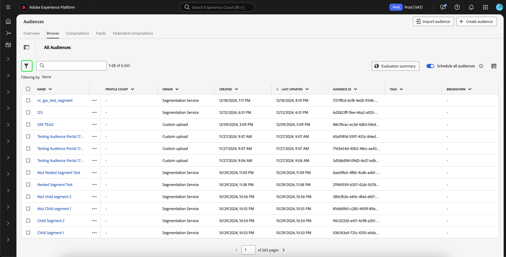
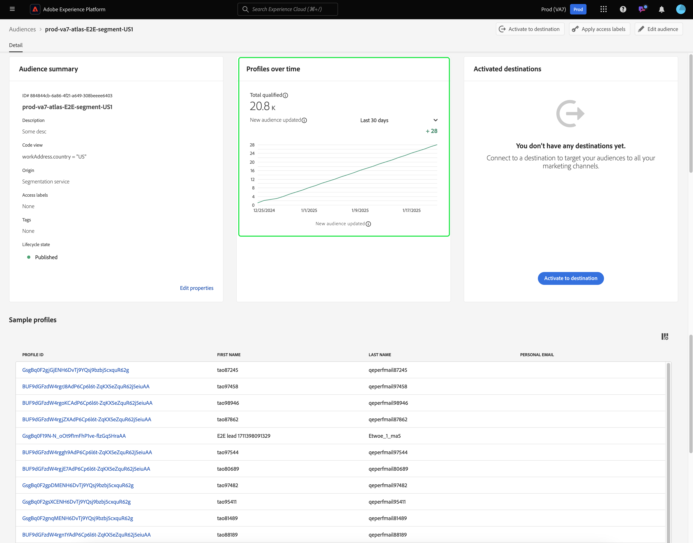

# 스트리밍 세그먼테이션 가이드

>[!BEGINSHADEBOX]

>[!NOTE]
>
>스트리밍 세그먼테이션 자격 조건은 2025년 5월 20일에 업데이트되었습니다.

+++자격 업데이트

>[!IMPORTANT]
>
>스트리밍 또는 에지 세분화를 사용하여 현재 평가되는 모든 기존 세그먼트 정의는 편집하거나 업데이트하지 않으면 그대로 작동합니다.

## 규칙 세트 {#ruleset}

다음 규칙 세트와 일치하는 **새로 만들거나 편집한** 세그먼트 정의는 스트리밍 또는 에지 세분화를 사용하여 **더 이상 평가되지 않습니다**. 대신 배치 세그먼테이션을 사용하여 평가됩니다.

- 기간이 24시간을 초과하는 단일 이벤트
   - 지난 3일 동안 웹 페이지를 본 모든 프로필로 대상자를 활성화합니다.
- 시간 창이 없는 단일 이벤트
   - 웹 페이지를 본 모든 프로필로 대상자를 활성화합니다.

## 시간대 {#time-window}

스트리밍 세그먼테이션이 있는 대상자를 평가하려면 **반드시**&#x200B;이(가) 24시간 내에 제한됩니다.

## 스트리밍 대상에 배치 데이터 포함 {#include-batch-data}

>[!NOTE]
>
>일괄 처리 데이터를 사용할 때 스트리밍 세그먼테이션을 정확하게 유지하려면 일괄 처리 데이터가 일괄 처리 대상 내에 **만**&#x200B;을(를) 유지하고 스트리밍 대상 내에서 참조되는지 확인하십시오.

이 업데이트 전에 일괄 처리 및 스트리밍 데이터 소스를 모두 결합하는 스트리밍 대상 정의를 만들 수 있습니다. 그러나 최신 업데이트에서는 일괄 세그먼테이션을 사용하여 일괄 데이터 소스와 스트리밍 데이터 소스를 모두 포함하는 대상 그룹을 생성합니다.

업데이트된 규칙 세트와 일치하는 스트리밍 또는 에지 세그먼트를 사용하여 세그먼트 정의를 평가해야 하는 경우 명시적으로 배치 및 스트리밍 규칙 세트를 만들고 세그먼트 세그먼트를 사용하여 결합해야 합니다. 이 일괄 처리 규칙 집합 **은(는) 프로필 스키마를 기반으로 합니다**.

예를 들어, 두 명의 대상 사용자가 있으며, 한 명의 대상 사용자가 주거 프로필 스키마 데이터를 사용하고 다른 하나의 대상 사용자가 주거 경험 이벤트 스키마 데이터를 사용하고 있다고 가정해 보겠습니다.

| 대상자 | 스키마 | Source 유형 | 쿼리 정의 | 대상자 ID |
| -------- | ------ | ----------- | ---------------- | ----------- |
| 캘리포니아 거주자 | 프로필 | 배치 | 집 주소는 캘리포니아주 | `e3be6d7f-1727-401f-a41e-c296b45f607a` |
| 최근 체크아웃 | 경험 이벤트 | 스트리밍 | 지난 24시간 동안 체크아웃이 하나 이상 있음 | `9e1646bb-57ff-4309-ba59-17d6c5bab6a1` |

스트리밍 대상에서 배치 구성 요소를 사용하려면 세그먼트 세그먼트를 사용하여 배치 대상을 참조해야 합니다.

따라서 두 대상을 함께 결합하는 규칙 세트의 예는 다음과 같습니다.

```
inSegment("e3be6d7f-1727-401f-a41e-c296b45f607a") and 
CHAIN(xEvent, timestamp, [C0: WHAT(eventType.equals("commerce.checkouts", false)) 
WHEN(<= 24 hours before now)])
```

결과 대상 *will*&#x200B;은(는) 일괄 처리 대상 구성 요소를 참조하여 일괄 처리 대상 멤버십을 활용하므로 스트리밍 세그먼테이션을 사용하여 평가됩니다.

하지만 두 대상을 이벤트 데이터로 결합하려면 **할 수 없습니다** 두 이벤트를 결합하면 됩니다. 두 대상을 모두 만든 다음 `inSegment`을(를) 사용하여 이 두 대상을 모두 참조하는 다른 대상을 만들어야 합니다.

예를 들어 두 명의 사용자가 있고 두 명의 사용자 모두 이벤트 스키마 데이터를 저장한다고 가정해 보겠습니다.

| 대상자 | 스키마 | 소스 유형 | 쿼리 정의 | 대상자 ID |
| -------- | ------ | ----------- | ---------------- | ----------- |
| 최근 중단 | 경험 이벤트 | 배치 | 지난 24시간 동안 취소 이벤트가 하나 이상 있음 | `e3be6d7f-1727-401f-a41e-c296b45f607a` |
| 최근 체크 아웃 | 경험 이벤트 | 스트리밍 | 지난 24시간 동안 체크아웃이 하나 이상 있음 | `9e1646bb-57ff-4309-ba59-17d6c5bab6a1` |

이 경우 다음과 같이 세 번째 대상을 만들어야 합니다.

```
inSegment("e3be6d7f-1727-401f-a41e-c296b45f607a") and inSegment("9e1646bb-57ff-4309-ba59-17d6c5bab6a1")
```

>[!IMPORTANT]
>
>규칙 세트와 일치하는 기존의 모든 세그먼트 정의는 편집할 때까지 스트리밍 또는 에지 세분화를 사용하여 평가됩니다.
>
>추가로, 현재 다른 스트리밍 또는 에지 세그먼테이션 평가 기준을 충족하는 모든 기존의 세그먼트 정의는 스트리밍 또는 에지 세그먼테이션으로 평가된 상태로 유지될 것이다.

## 병합 정책 {#merge-policy}

스트리밍 또는 에지 세그먼트 **에 적합한**&#x200B;새 세그먼트 정의 또는 편집된 세그먼트 정의&#x200B;**는 &quot;Active on Edge&quot; 병합 정책에 있어야**&#x200B;합니다.

활성 병합 정책 설정이 없으면 [병합 정책을 구성](../../profile/merge-policies/ui-guide.md#configure)하고 edge에서 활성화되도록 설정해야 합니다.


+++

>[!ENDSHADEBOX]

스트리밍 세그먼테이션은 데이터 풍부함에 초점을 맞추면서 거의 실시간으로 Adobe Experience Platform 시청자를 평가할 수 있는 기능입니다.

스트리밍 세그먼테이션을 사용하면 이제 스트리밍 데이터가 Experience Platform에 도달함에 따라 대상 자격이 부여되어 세그먼테이션 작업을 예약하고 실행할 필요가 줄어듭니다. 이렇게 하면 Experience Platform으로 전달된 데이터를 평가할 수 있으므로 대상 멤버십을 자동으로 최신 상태로 유지할 수 있습니다.

## 적합한 규칙 세트 {#rulesets}

>[!IMPORTANT]
>
>스트리밍 세분화를 사용하려면 **반드시** &quot;Edge에서 활성&quot; 상태의 병합 정책을 사용해야 합니다. 병합 정책에 대한 자세한 내용은 [병합 정책 개요](../../profile/merge-policies/overview.md)를 참조하십시오.

규칙 세트가 다음 표에 설명된 조건 중 하나를 충족하는 경우 스트리밍 세그먼트를 사용할 수 있습니다.

>[!NOTE]
>
>스트리밍 세그먼테이션이 작동하려면 조직에 대해 예약된 세그먼트를 활성화해야 합니다. 예약된 세그먼테이션을 사용하는 방법에 대한 자세한 내용은 [Audience Portal 개요](../ui/audience-portal.md#scheduled-segmentation)를 참조하십시오.

| 쿼리 유형 | 세부 사항 | 쿼리 | 예 |
| ---------- | ------- | ----- | ------- |
| 24시간 미만의 기간 내 단일 이벤트 | 24시간 미만의 시간 창 내에서 단일 수신 이벤트를 참조하는 세그먼트 정의입니다. | `CHAIN(xEvent, timestamp, [C0: WHAT(eventType.equals("commerce.checkouts", false)) WHEN(today)])` |  |
| 프로필만 | 프로파일 속성만 참조하는 세그먼트 정의. | `homeAddress.country.equals("Canada", false)` |  |
| 24시간 미만의 상대 시간 기간 내에 프로필 특성이 있는 단일 이벤트 | 하나 이상의 프로필 특성이 있는 단일 수신 이벤트를 참조하고 24시간 미만의 상대 시간 창 내에서 발생하는 세그먼트 정의입니다. | `workAddress.country.equals("Canada", false) and CHAIN(xEvent, timestamp, [C0: WHAT(eventType.equals("commerce.checkouts", false)) WHEN(today)])` |  |
| 24시간의 상대 기간 내에 여러 이벤트 발생 | 최근 24시간 내에 **여러 이벤트**&#x200B;를 참조하고 (선택적으로) 하나 이상의 프로필 특성을 포함하는 세그먼트 정의입니다. | `workAddress.country.equals("US", false) and CHAIN(xEvent, timestamp, [C0: WHAT(eventType.equals("directMarketing.emailClicked", false)) WHEN(today), C1: WHAT(eventType.equals("commerce.checkouts", false)) WHEN(today)])` |  |

세그먼트 정의는 다음 시나리오에서 스트리밍 세분화에 적합하지 **않습니다**.

- 세그먼트 정의에는 Adobe Audience Manager(AAM) 세그먼트 또는 트레이트가 포함됩니다.
- 세그먼트 정의에는 여러 엔티티(다중 엔티티 쿼리)가 포함됩니다.
- 세그먼트 정의에는 단일 이벤트와 `inSegment` 이벤트의 조합이 포함됩니다.
   - 예를 들어, 단일 규칙 세트에서 `inSegment("e3be6d7f-1727-401f-a41e-c296b45f607a") and  CHAIN(xEvent, timestamp, [C0: WHAT(eventType.equals("commerce.checkouts", false))  WHEN(<= 24 hours before now)])`을(를) 연결할 수 있습니다.
- 세그먼트 정의는 &quot;연도 무시&quot;를 시간 제한의 일부로 사용합니다.

스트리밍 세분화 쿼리에 적용되는 다음 지침을 참고하십시오.

| 쿼리 유형 | 지침 |
| ---------- | -------- |
| 단일 이벤트 규칙 세트 | 전환 확인 기간은 **하루**(으)로 제한됩니다. |
| 이벤트 기록이 있는 쿼리 | <ul><li>전환 확인 기간은 **하루**(으)로 제한됩니다.</li><li>이벤트 사이에 엄격한 시간 순서 지정 조건 **must**&#x200B;이(가) 있습니다.</li><li>적어도 한 개의 무효화된 이벤트가 있는 쿼리가 지원됩니다. 그러나 전체 이벤트 **은(는) 부정이 될 수 없습니다**.</li></ul> |

스트리밍 세분화 기준을 더 이상 충족하지 않도록 세그먼트 정의를 수정하면 세그먼트 정의가 자동으로 &quot;스트리밍&quot;에서 &quot;일괄 처리&quot;로 전환됩니다.

또한 세그먼트 인증과 마찬가지로 세그먼트 비인증도 실시간으로 발생합니다. 그 결과 관객이 더 이상 한 부문에 응할 자격이 없다면 곧바로 부적격이 된다. 예를 들어 세그먼트 정의가 &quot;지난 3시간 동안 빨간 신발을 구매한 모든 사용자&quot;를 묻는 경우 3시간 후에 세그먼트 정의에 대해 처음에 자격을 부여한 모든 프로필은 부적격합니다.

### 대상 조합 {#combine-audiences}

일괄 처리와 스트리밍 소스 모두의 데이터를 결합하려면 일괄 처리와 스트리밍 구성 요소를 별도의 대상으로 분리해야 합니다.

### 프로필 특성 및 경험 이벤트 {#profile-and-event}

예를 들어, 다음 두 고객을 고려해 보겠습니다.

| 대상자 | 스키마 | Source 유형 | 쿼리 정의 | 대상자 ID |
| -------- | ------ | ----------- | ---------------- | ----------- |
| 캘리포니아 거주자 | 프로필 | 배치 | 집 주소는 캘리포니아주 | `e3be6d7f-1727-401f-a41e-c296b45f607a` |
| 최근 체크아웃 | 경험 이벤트 | 스트리밍 | 최근 24시간 이내에 체크아웃이 하나 이상 있음 | `9e1646bb-57ff-4309-ba59-17d6c5bab6a1` |

스트리밍 오디언스에서 일괄 처리 구성 요소를 사용하려면 세그먼트 세그먼트를 사용하여 일괄 처리 오디언스를 참조해야 합니다.

따라서 두 대상을 함께 결합하는 규칙 세트 예제는 다음과 같습니다.

```
inSegment("e3be6d7f-1727-401f-a41e-c296b45f607a") and 
CHAIN(xEvent, timestamp, [C0: WHAT(eventType.equals("commerce.checkouts", false)) 
WHEN(<= 24 hours before now)])
```

일괄 처리 대상 구성 요소를 참조하여 일괄 처리 대상 그룹의 구성원을 활용하므로 스트리밍 세그먼테이션을 사용하여 결과 대상 그룹 *will*&#x200B;을(를) 평가합니다.

### 여러 경험 이벤트 {#two-events}

여러 대상을 이벤트 데이터와 결합하려면 **이벤트를 결합할 수 없습니다**. 각 이벤트에 대한 대상을 만든 다음 `inSegment`을(를) 사용하여 모든 대상을 참조하는 다른 대상을 만들어야 합니다.

예를 들어 두 대상에 경험 이벤트 스키마 데이터를 모두 포함하는 두 대상이 있다고 가정해 보겠습니다.

| 대상자 | 스키마 | Source 유형 | 쿼리 정의 | 대상자 ID |
| -------- | ------ | ----------- | ---------------- | ----------- |
| 최근 포기 | 경험 이벤트 | 배치 | 지난 48시간 동안 취소 이벤트가 하나 이상 있음 | `7deb246a-49b4-4687-95f9-6316df049948` |
| 최근 체크 아웃 | 경험 이벤트 | 스트리밍 | 지난 24시간 동안 체크아웃이 하나 이상 있음 | `9e1646bb-57ff-4309-ba59-17d6c5bab6a1` |

이 경우 다음과 같이 세 번째 대상자를 만들어야 합니다.

```
inSegment("7deb246a-49b4-4687-95f9-6316df049948) and inSegment("9e1646bb-57ff-4309-ba59-17d6c5bab6a1")
```

## 대상자 만들기 {#create-audience}

세그먼테이션 서비스 API를 사용하거나 UI의 대상자 포털을 통해 스트리밍 세그먼테이션을 사용하여 평가되는 대상자를 만들 수 있습니다.

세그먼트 정의가 [적격 규칙 집합](#eligible-rulesets) 중 하나와 일치하는 경우 스트리밍을 사용하도록 설정할 수 있습니다.

>[!BEGINTABS]

>[!TAB 세그먼테이션 서비스 API]

**API 형식**

```http
POST /segment/definitions
```

**요청**

+++ 스트리밍 세분화를 위해 활성화된 세그먼트 정의를 만들기 위한 샘플 요청

```shell
curl -X POST https://platform.adobe.io/data/core/ups/segment/definitions
 -H 'Authorization: Bearer {ACCESS_TOKEN}' \
 -H 'Content-Type: application/json' \
 -H 'x-gw-ims-org-id: {ORG_ID}' \
 -H 'x-api-key: {API_KEY}' \
 -H 'x-sandbox-name: {SANDBOX_NAME}'
 -d '{
        "name": "People in the USA",
        "description: "An audience that looks for people who live in the USA",
        "expression": {
            "type": "PQL",
            "format": "pql/text",
            "value": "homeAddress.country = \"US\""
        },
        "evaluationInfo": {
            "batch": {
                "enabled": false
            },
            "continuous": {
                "enabled": true
            },
            "synchronous": {
                "enabled": false
            }
        },
        "schema": {
            "name": "_xdm.context.profile"
        }
     }'
```

+++

**응답**

응답이 성공하면 새로 생성된 세그먼트 정의의 세부 정보와 함께 HTTP 상태 200이 반환됩니다.

+++세그먼트 정의를 생성할 때의 예제 응답입니다.

```json
{
    "id": "4afe34ae-8c98-4513-8a1d-67ccaa54bc05",
    "schema": {
        "name": "_xdm.context.profile"
    },
    "profileInstanceId": "ups",
    "imsOrgId": "{ORG_ID}",
    "sandbox": {
        "sandboxId": "28e74200-e3de-11e9-8f5d-7f27416c5f0d",
        "sandboxName": "prod",
        "type": "production",
        "default": true
    },
    "name": "People in the USA",
    "description": "An audience that looks for people who live in the USA",
    "expression": {
        "type": "PQL",
        "format": "pql/text",
        "value": "homeAddress.country = \"US\""
    },
    "evaluationInfo": {
        "batch": {
            "enabled": false
        },
        "continuous": {
            "enabled": true
        },
        "synchronous": {
            "enabled": false
        }
    },
    "dataGovernancePolicy": {
        "excludeOptOut": true
    },
    "creationTime": 0,
    "updateEpoch": 1579292094,
    "updateTime": 1579292094000
}
```

+++

이 끝점 사용에 대한 자세한 내용은 [세그먼트 정의 끝점 안내서](../api/segment-definitions.md)에서 확인할 수 있습니다.

>[!TAB 대상자 포털]

대상 그룹 포털에서 **[!UICONTROL Create audience]**&#x200B;을(를) 선택합니다.


팝오버가 나타납니다. **[!UICONTROL Build rules]**&#x200B;을(를) 선택하여 Segment Builder를 입력하십시오.


Segment Builder에서 [적합한 규칙 세트](#eligible-rulesets) 중 하나와 일치하는 세그먼트 정의를 만듭니다. 세그먼트 정의가 스트리밍 세그먼테이션에 적합한 경우 **[!UICONTROL Streaming]**&#x200B;을(를) **[!UICONTROL Evaluation method]**(으)로 선택할 수 있습니다.


세그먼트 정의 만들기에 대한 자세한 내용은 [Segment Builder 가이드](../ui/segment-builder.md)를 참조하십시오

>[!ENDTABS]

## 대상 그룹 검색 {#retrieve-audiences}

세분화 서비스 API를 사용하거나 UI의 대상 포털을 통해 스트리밍 세분화를 사용하여 평가된 모든 대상을 검색할 수 있습니다.

>[!BEGINTABS]

>[!TAB 세그먼테이션 서비스 API]

`/segment/definitions` 끝점에 대한 GET 요청을 통해 조직 내에서 스트리밍 세분화를 사용하여 평가되는 모든 세그먼트 정의 목록을 검색합니다.

**API 형식**

스트리밍 세분화를 사용하여 평가된 세그먼트 정의를 검색하려면 요청 경로에 쿼리 매개 변수 `evaluationInfo.synchronous.enabled=true`을(를) 포함해야 합니다.

```http
GET /segment/definitions?evaluationInfo.continuous.enabled=true
```

**요청**

+++ 모든 스트리밍 활성화 세그먼트 정의를 나열하기 위한 샘플 요청

```shell
curl -X GET 'https://platform.adobe.io/data/core/ups/segment/definitions?evaluationInfo.continuous.enabled=true' \
  -H 'Authorization: Bearer {ACCESS_TOKEN}' \
  -H 'Content-Type: application/json' \
  -H 'x-api-key: {API_KEY}' \
  -H 'x-gw-ims-org-id: {ORG_ID}' \
  -H 'x-sandbox-name: {SANDBOX_NAME}'
```

+++

**응답**

성공적인 응답은 스트리밍 세분화를 위해 활성화된 조직의 세그먼트 정의 배열과 함께 HTTP 상태 200을 반환합니다.

+++조직의 모든 스트리밍 세그먼테이션 지원 세그먼트 정의 목록을 포함하는 샘플 응답

```json
{
    "segments": [
        {
            "id": "15063cb-2da8-4851-a2e2-bf59ddd2f004",
            "schema": {
                "name": "_xdm.context.profile"
            },
            "ttlInDays": 30,
            "imsOrgId": "{ORG_ID}",
            "sandbox": {
                "sandboxId": "",
                "sandboxName": "",
                "type": "production",
                "default": true
            },
            "name": " People who are NOT on their homepage ",
            "expression": {
                "type": "PQL",
                "format": "pql/text",
                "value": "select var1 from xEvent where var1._experience.analytics.endUser.firstWeb.webPageDetails.isHomePage = false"
            },
            "evaluationInfo": {
                "batch": {
                    "enabled": false
                },
                "continuous": {
                    "enabled": true
                },
                "synchronous": {
                    "enabled": false
                }
            },
            "creationTime": 1572029711000,
            "updateEpoch": 1572029712000,
            "updateTime": 1572029712000
        },
        {
            "id": "f15063cb-2da8-4851-a2e2-bf59ddd2f004",
            "schema": {
                "name": "_xdm.context.profile"
            },
            "ttlInDays": 30,
            "imsOrgId": "{ORG_ID}",
            "sandbox": {
                "sandboxId": "",
                "sandboxName": "",
                "type": "production",
                "default": true
            },
            "name": "Homepage_continuous",
            "description": "People who are on their homepage - continuous",
            "expression": {
                "type": "PQL",
                "format": "pql/text",
                "value": "select var1 from xEvent where var1._experience.analytics.endUser.firstWeb.webPageDetails.isHomePage = true"
            },
            "evaluationInfo": {
                "batch": {
                    "enabled": true
                },
                "continuous": {
                    "enabled": true
                },
                "synchronous": {
                    "enabled": false
                }
            },
            "creationTime": 1572021085000,
            "updateEpoch": 1572021086000,
            "updateTime": 1572021086000
        }
    ],
    "page": {
        "totalCount": 2,
        "totalPages": 1,
        "sortField": "creationTime",
        "sort": "desc",
        "pageSize": 2,
        "limit": 100
    },
    "link": {}
}
```

반환된 세그먼트 정의에 대한 자세한 내용은 [세그먼트 정의 끝점 안내서](../api/segment-definitions.md)를 참조하십시오.

+++

>[!TAB 대상자 포털]

Audience Portal의 필터를 사용하여 조직 내에서 스트리밍 세분화에 대해 활성화된 모든 대상을 검색할 수 있습니다. 필터 목록을 표시하려면  아이콘을 선택하십시오.



사용 가능한 필터 내에서 **[!UICONTROL Update frequency]**(으)로 이동하여 &quot;[!UICONTROL Streaming]&quot;을(를) 선택합니다. 이 필터를 사용하면 스트리밍 세분화를 사용하여 평가되는 조직의 모든 대상이 표시됩니다.


Experience Platform에서 대상자를 보는 방법에 대한 자세한 내용은 [대상자 포털 가이드](../ui/audience-portal.md)를 참조하십시오.

>[!ENDTABS]

## 대상자 세부 정보 {#audience-details}

Audience Portal 내에서 스트리밍 세그먼트를 사용하여 평가된 특정 대상자에 대한 세부 정보를 조회할 수 있습니다.

Audience Portal에서 오디언스를 선택한 후 오디언스 세부 정보 페이지가 나타납니다. 대상자 세부 사항, 시간 경과에 따른 적격 프로필의 양뿐만 아니라 대상자가 활성화된 대상자에 대한 요약을 포함하여 대상자에 대한 정보가 표시됩니다.


스트리밍을 사용할 수 있는 대상의 경우 전체 적격 지표 및 새 대상의 업데이트된 지표를 보여 주는 **[!UICONTROL Profiles over time]** 카드가 표시됩니다.

**[!UICONTROL Total qualified]** 지표는 이 대상에 대한 일괄 처리 및 스트리밍 평가를 기반으로 전체 적격 대상 수를 나타냅니다.

**[!UICONTROL New audience updated]** 메트릭은 스트리밍 세그먼테이션을 통해 대상 그룹 크기의 변화를 보여 주는 선 그래프로 표시됩니다. 드롭다운을 조정하여 최근 24시간, 지난주 또는 최근 30일을 표시할 수 있습니다.



대상자 세부 정보에 대한 자세한 내용은 [대상자 포털 개요](../ui/audience-portal.md#audience-details)를 참조하십시오.

## 다음 단계

이 안내서에서는 Adobe Experience Platform에서 스트리밍 활성화 세그먼트 정의가 작동하는 방식과 스트리밍 활성화 세그먼트 정의를 모니터링하는 방법을 설명합니다.

Adobe Experience Platform 사용자 인터페이스 사용에 대한 자세한 내용은 [세그먼테이션 사용 안내서](./overview.md)를 참조하세요.

스트리밍 세분화에 대한 FAQ는 FAQ[의 &#x200B;](../faq.md#streaming-segmentation)스트리밍 세분화 섹션을 참조하십시오.
