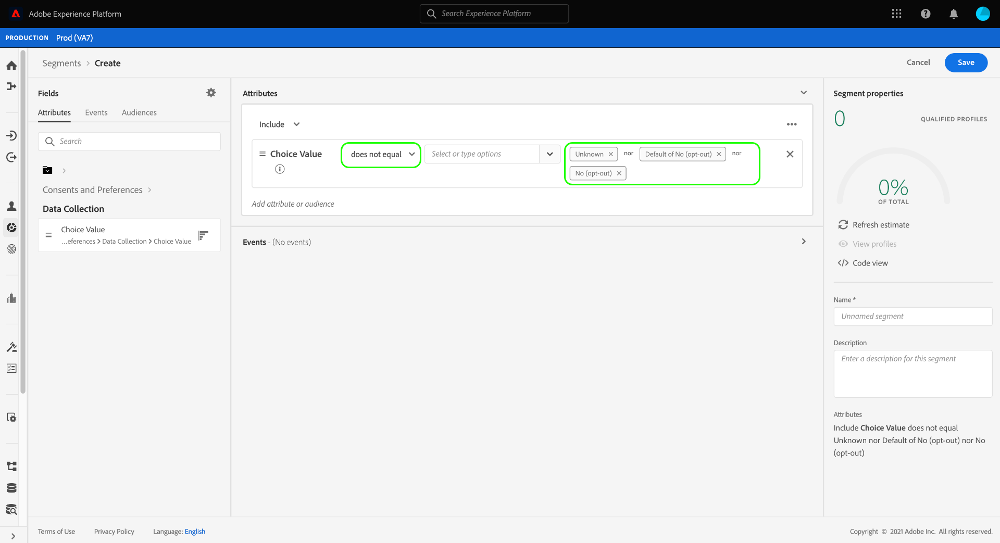

# 세그먼트 정의의 동의 준수

>[!NOTE]
>
>이 안내서에서는 **세그먼트 정의** 내에서 동의를 받는 방법에 대해 설명합니다.

[!DNL California Consumer Privacy Act]&#x200B;(CCPA)와 같은 법적 개인 정보 보호 규정은 소비자가 개인 데이터를 수집하거나 서드파티와 공유하지 않도록 선택할 수 있는 권한을 제공합니다. Adobe Experience Platform은 실시간 고객 프로필 데이터에서 이러한 고객 동의 환경 설정을 캡처할 수 있도록 하는 표준 경험 데이터 모델(XDM) 구성 요소를 제공합니다.

고객이 개인 데이터를 공유하도록 하는 데 대한 동의를 철회하거나 보류한 경우, 조직에서 마케팅 활동에 대한 대상을 생성할 때 해당 환경 설정을 준수하는 것이 중요합니다. 이 문서에서는 Experience Platform 사용자 인터페이스를 사용하여 세그먼트 정의에 고객 동의 값을 통합하는 방법을 설명합니다.

## 시작하기

고객 동의 값을 준수하려면 관련된 다양한 [!DNL Adobe Experience Platform] 서비스를 이해해야 합니다. 이 자습서를 시작하기 전에 다음 서비스를 잘 알고 있는지 확인하십시오.

* [[!DNL Experience Data Model (XDM)]](../../xdm/home.md): Experience Platform에서 고객 경험 데이터를 구성하는 표준화된 프레임워크입니다.
* [[!DNL Real-Time Customer Profile]](../../profile/home.md): 여러 소스에서 집계한 데이터를 기반으로 통합 고객 프로필을 실시간으로 제공합니다.
* [[!DNL Adobe Experience Platform Segmentation Service]](../home.md): [!DNL Real-Time Customer Profile] 데이터에서 대상을 만들 수 있습니다.

## 동의 스키마 필드

고객 동의 및 환경 설정을 준수하려면 [!UICONTROL XDM 개인 프로필] 통합 스키마의 일부인 스키마 중 하나에 표준 필드 그룹 **[!UICONTROL 동의 및 환경 설정]**&#x200B;이 포함되어 있어야 합니다.

필드 그룹에서 제공한 각 특성의 구조 및 사용 사례에 대한 자세한 내용은 [동의 및 환경 설정 참조 안내서](../../xdm/field-groups/profile/consents.md)를 참조하십시오. 스키마에 필드 그룹을 추가하는 방법에 대한 단계별 지침은 [XDM UI 안내서](../../xdm/ui/resources/schemas.md#add-field-groups)를 참조하십시오.

필드 그룹이 [프로필 사용 스키마](../../xdm/ui/resources/schemas.md#profile)에 추가되고 해당 필드가 경험 응용 프로그램에서 동의 데이터를 수집하는 데 사용되면 세그먼트 규칙에서 수집된 동의 특성을 사용할 수 있습니다.

## 세분화에서 동의 처리

옵트아웃 프로필이 세그먼트 정의에 포함되지 않도록 하려면 기존 세그먼트 정의에 특수 필드를 추가하고 새 세그먼트 정의를 생성할 때 포함해야 합니다.

아래 절차에서는 두 가지 유형의 옵트아웃 플래그에 적합한 필드를 추가하는 방법을 보여줍니다.

1. [!UICONTROL 데이터 수집]
1. [!UICONTROL 데이터 공유]

>[!NOTE]
>
>이 안내서는 위의 두 가지 옵트아웃 플래그에 중점을 두지만, 추가 동의 신호를 통합하도록 세그먼트 정의를 구성할 수도 있습니다. [동의 및 환경 설정 참조 안내서](../../xdm/field-groups/profile/consents.md)에서는 이러한 각 옵션과 해당 사용 사례에 대한 자세한 정보를 제공합니다.

UI에서 세그먼트 정의를 작성할 때 **[!UICONTROL 특성]**&#x200B;에서 **[!UICONTROL XDM 개별 프로필]**(으)로 이동한 다음 **[!UICONTROL 동의 및 환경 설정]**, **[!UICONTROL ID별]**&#x200B;을(를) 선택합니다. 여기에서 **[!UICONTROL 데이터 수집]** 및 **[!UICONTROL 데이터 공유]**&#x200B;에 대한 옵션을 볼 수 있습니다.

**[!UICONTROL 데이터 수집]** 범주를 선택한 다음 **[!UICONTROL 선택 값]**&#x200B;을(를) 세그먼트 빌더로 끌어옵니다. 특성을 세그먼트 정의에 추가할 때 포함하거나 제외해야 하는 [동의 값](../../xdm/field-groups/profile/consents.md#choice-values)을 지정할 수 있습니다.

한 가지 접근 방식은 데이터를 수집하지 않기로 선택한 고객을 제외하는 것입니다. 이렇게 하려면 연산자를 **[!UICONTROL does not equal]**(으)로 설정하고 다음 값을 선택하십시오.

* **[!UICONTROL 아니요(옵트아웃)]**
* **[!UICONTROL 기본값인 아니요(옵트아웃)]**
* **[!UICONTROL 알 수 없음]**(달리 알 수 없는 경우 동의가 보류되는 경우)

왼쪽 레일의 **[!UICONTROL 특성]**&#x200B;에서 **[!UICONTROL 동의 및 환경 설정]** 섹션으로 돌아간 다음 **[!UICONTROL 데이터 공유]**&#x200B;를 선택합니다. 해당 **[!UICONTROL 선택 값]**&#x200B;을 캔버스로 드래그하고 [!UICONTROL 데이터 수집] 선택 값과 동일한 값을 선택하십시오. 두 특성 사이에 **[!UICONTROL Or]** 관계가 설정되어 있는지 확인하십시오.

세그먼트 정의에 **[!UICONTROL 데이터 수집]** 및 **[!UICONTROL 데이터 공유]** 동의 값을 모두 추가하면 데이터를 사용하지 않기로 선택한 모든 고객은 결과 대상에서 제외됩니다. 여기에서 **[!UICONTROL 저장]**&#x200B;을 선택하여 프로세스를 완료하기 전에 세그먼트 정의를 계속 사용자 지정할 수 있습니다.

## 다음 단계

이 자습서를 따라 Experience Platform에서 세그먼트 정의를 작성할 때 고객 동의 및 환경 설정을 적용하는 방법을 보다 잘 이해할 수 있습니다.

Experience Platform에서의 동의 관리에 대한 자세한 내용은 다음 설명서를 참조하십시오.

* [Adobe 표준을 사용한 동의 처리](../../landing/governance-privacy-security/consent/adobe/overview.md)
* [IAB TCF 2.0 표준을 사용한 동의 처리](../../landing/governance-privacy-security/consent/iab/overview.md)