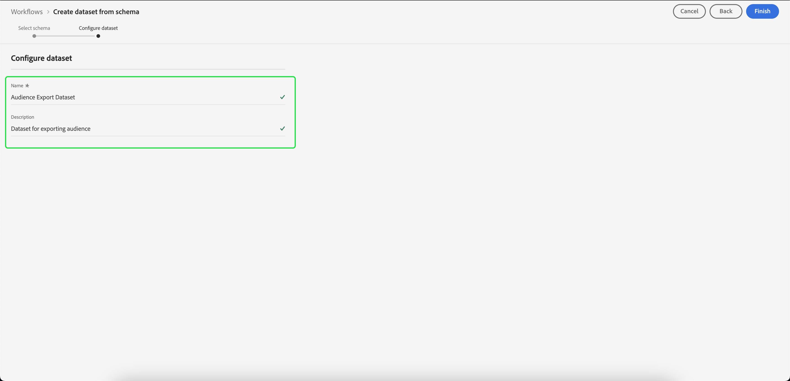

# 대상 세그먼트 내보내기를 위한 데이터 세트 만들기

[!DNL Adobe Experience Platform] 특정 속성에 따라 고객 프로필을 대상으로 세그먼트화할 수 있습니다. 세그먼트가 만들어지면 해당 대상을 액세스 및 작업할 수 있는 데이터 세트로 내보낼 수 있습니다. 내보내기에 성공하려면 데이터 세트를 올바르게 구성해야 합니다.

이 자습서에서는 을 사용하여 대상 세그먼트를 내보내는 데 사용할 수 있는 데이터 세트를 만드는 데 필요한 단계를 안내합니다 [!DNL Experience Platform] UI.

이 자습서는 다음 자습서에 설명된 단계와 직접 관련이 있습니다 [세그먼트 결과 평가 및 액세스](./evaluate-a-segment.md). 세그먼트 평가 자습서에서는 [!DNL Catalog Service] API인 반면, 이 자습서에서는 [!DNL Experience Platform] UI.

## 시작하기

세그먼트를 내보내려면 데이터 세트가 [!DNL XDM Individual Profile Union Schema]. 결합 스키마는 동일한 클래스를 공유하는 모든 스키마의 필드를 집계하는 시스템에서 생성한 읽기 전용 스키마입니다. 결합 스키마에 대한 자세한 내용은 [스키마 컴포지션의 기본 사항](../../xdm/schema/composition.md#union).

UI에서 결합 스키마를 보려면 **[!UICONTROL 프로필]** 왼쪽 탐색에서 를 선택하고 **[!UICONTROL 결합 스키마]** 아래와 같이 표시됩니다.

## 데이터 세트 작업 공간

다음 [!UICONTROL 데이터 세트] 작업 공간을 사용하면 조직의 모든 데이터 세트를 보고 관리할 수 있습니다.

선택 **[!UICONTROL 데이터 세트]** 왼쪽 탐색에서 작업 공간에 액세스한 다음 을 선택합니다 **[!UICONTROL 찾아보기]**. 이 탭에는 데이터 세트 목록과 세부 정보가 표시됩니다. 각 열의 너비에 따라 모든 열을 보려면 왼쪽이나 오른쪽으로 스크롤해야 할 수 있습니다.

>[!NOTE]
>
>검색 창 옆에 있는 필터 아이콘을 선택하여 필터링 기능을 사용하여에 대해 활성화된 데이터 세트만 봅니다 [!DNL Real-Time Customer Profile].

## 데이터 집합 만들기

데이터 세트를 만들려면 다음을 선택합니다 **[!UICONTROL 데이터 집합 만들기]**.

다음 화면에서 을 선택합니다. **[!UICONTROL 스키마에서 데이터 집합 만들기]**.

## XDM 개별 프로필 결합 스키마 선택

을(를) 선택하려면 [!DNL XDM Individual Profile Union Schema] 데이터 세트에 사용하려면 &quot;[!UICONTROL XDM 개별 프로필]&quot; 스키마 **[!UICONTROL 스키마 선택]** 화면. 스키마를 선택하면 다음 위치에서 결합 스키마인지 확인할 수 있습니다 **[!UICONTROL API 사용]** 오른쪽 레일에 있습니다. 만약 [!UICONTROL 스키마] 다음으로 끝남 `_union`그리고 이것은 결합 스키마입니다.

>[!NOTE]
>
>정의 기준으로 결합 스키마가 실시간 고객 프로필에 참여하지만 기존 스키마와 동일한 방식으로 프로필에 대해 활성화되어 있지 않으므로 &quot;활성화되지 않음&quot;으로 표시됩니다.

옆에 있는 라디오 단추를 선택합니다 **[!UICONTROL XDM 개별 프로필]**&#x200B;를 선택하고 을 선택합니다. **[!UICONTROL 다음]**.

## 데이터 세트 구성

다음 화면에서 데이터 세트에 이름을 지정해야 합니다. 선택적 설명을 추가할 수도 있습니다.

**데이터 집합 이름에 대한 참고 사항:**

* 데이터 세트 이름은 나중에 라이브러리에서 데이터 세트를 쉽게 찾을 수 있도록 짧고 설명적이어야 합니다.
* 데이터 세트 이름은 고유해야 합니다. 즉, 나중에 다시 사용할 수 없도록 충분히 구체적이어야 합니다.
* 설명 필드를 사용하여 데이터 세트에 대한 추가 정보를 제공하는 것이 가장 좋습니다. 이렇게 하면 다른 사용자가 나중에 데이터 세트를 구분할 수 있기 때문입니다.

데이터 세트에 이름과 설명이 있으면 **[!UICONTROL 완료]**.

## 데이터 집합 활동

데이터 세트가 만들어지면 해당 데이터 세트에 대한 활동 페이지가 표시됩니다. 작업 공간의 왼쪽 위 모서리에 &quot;일괄 처리가 추가되지 않음&quot;이라는 알림과 함께 데이터 세트 이름이 표시됩니다. 이 데이터 세트에 일괄 처리를 아직 추가하지 않았기 때문에 발생할 수 있습니다.

오른쪽 레일에는 데이터 세트 ID, 이름, 설명, 스키마 등과 같은 새로운 데이터 세트에 대한 정보가 포함되어 있습니다. 다음 사항을 기록해 두십시오 **[!UICONTROL 데이터 세트 ID]**, 대상 세그먼트 내보내기 워크플로우를 완료하려면 이 값이 필요합니다.

## 다음 단계

이제 다음을 기반으로 데이터 세트를 생성했으므로 [!DNL XDM Individual Profile Union Schema]로 지정하는 경우 데이터 세트 ID를 사용하여 [세그먼트 결과 평가 및 액세스](./evaluate-a-segment.md) 자습서입니다.

현재 세그먼트 결과 평가 자습서로 돌아가서 다음 중 하나를 선택하십시오 [대상 구성원의 프로필 생성](./evaluate-a-segment.md#generate-profiles) 세그먼트 워크플로우 내보내기 단계입니다.
