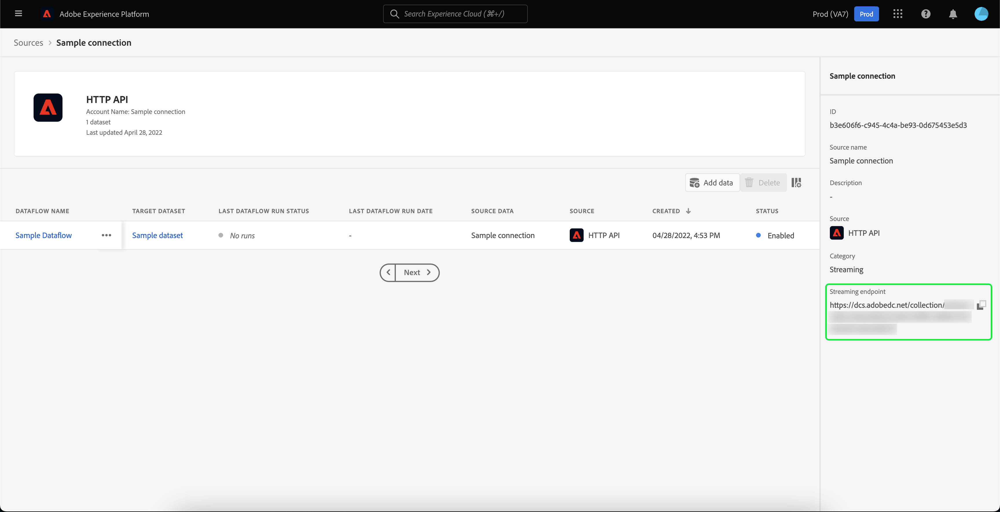

# 외부 대상 가져오기 및 사용

>[!IMPORTANT]
>
>이 설명서에는 이전 버전의 대상 설명서에 대한 정보가 포함되어 있으며, 그 결과 이(가) 만료되었습니다.

Adobe Experience Platform은 나중에 새 대상의 구성 요소로 사용할 수 있는 외부 대상을 가져오는 기능을 지원합니다. 이 문서에서는 외부 대상을 가져오고 사용할 Experience Platform을 설정하는 방법에 대한 자습서를 제공합니다.

## 시작하기

이 자습서에서는 대상을 만드는 데 관련된 다양한 [!DNL Adobe Experience Platform] 서비스에 대한 작업 이해가 필요합니다. 이 자습서를 시작하기 전에 다음 서비스에 대한 설명서를 검토하십시오.

- [세분화 서비스](../home.md): 실시간 고객 프로필 데이터에서 대상을 만들 수 있습니다.
- [실시간 고객 프로필](../../profile/home.md): 여러 소스의 집계 데이터를 기반으로 통합된 실시간 고객 프로필을 제공합니다.
- [XDM(경험 데이터 모델)](../../xdm/home.md): 플랫폼에서 고객 경험 데이터를 구성하는 표준화된 프레임워크입니다. 세그먼테이션을 최대한 활용하려면 [데이터 모델링 모범 사례](../../xdm/schema/best-practices.md)에 따라 데이터가 프로필 및 이벤트로 수집되는지 확인하십시오.
- [데이터 세트](../../catalog/datasets/overview.md): Experience Platform 시 데이터 지속성을 위한 저장소 및 관리 구성입니다.
- [스트리밍 수집](../../ingestion/streaming-ingestion/overview.md): Experience Platform이 클라이언트 및 서버측 장치에서 실시간으로 데이터를 수집하고 저장하는 방법입니다.

### 대상과 세그먼트 정의 비교

외부 대상을 가져오고 사용하기 전에 대상과 세그먼트 정의의 차이점을 이해하는 것이 중요합니다.

대상은 필터링하려는 프로필 그룹을 참조합니다. 세그먼트 정의를 사용할 때 세그먼트 자격 기준을 충족하는 하위 집합으로 프로필을 필터링하는 세그먼트 정의를 만들어 대상을 만들 수 있습니다.

세그먼트 정의에는 이름, 설명, 표현식(해당하는 경우), 생성 날짜, 마지막으로 수정한 날짜 및 ID와 같은 정보가 포함됩니다. ID는 세그먼트 자격을 충족하고 결과 대상자의 일부인 개별 프로필에 세그먼트 메타데이터를 연결합니다.

| 대상자 | 세그먼트 정의 |
| --------- | ---------------- |
| 찾으려는 프로필 그룹입니다. 세그먼트 정의를 사용할 때 세그먼트 자격을 충족하는 프로필 그룹이 됨을 의미합니다. | 찾고 있는 대상자를 세그먼트화하는 데 사용되는 규칙 그룹입니다. |

## 외부 대상을 위한 ID 네임스페이스 만들기

외부 대상을 사용하는 첫 번째 단계는 ID 네임스페이스를 만드는 것입니다. ID 네임스페이스를 사용하면 플랫폼에서 대상자의 출처 를 연결할 수 있습니다.

ID 네임스페이스를 만들려면 [ID 네임스페이스 안내서](../../identity-service/features/namespaces.md#manage-namespaces)의 지침을 따르십시오. ID 네임스페이스를 만들 때 소스 세부 정보를 ID 네임스페이스에 추가하고 해당 [!UICONTROL 유형]을(를) **[!UICONTROL 비사용자 식별자]**(으)로 표시하십시오.


## 세그먼트 메타데이터에 대한 스키마 만들기

ID 네임스페이스를 만든 후에는 만들 세그먼트에 대한 새 스키마를 만들어야 합니다.

스키마 작성을 시작하려면 먼저 왼쪽 탐색 막대에서 **[!UICONTROL 스키마]**&#x200B;를 선택한 다음 스키마 작업 영역의 오른쪽 상단 모서리에서 **[!UICONTROL 스키마 만들기]**&#x200B;를 선택하십시오. 여기에서 **[!UICONTROL 찾아보기]**&#x200B;를 선택하여 사용 가능한 스키마 유형의 전체 선택을 확인하십시오.


미리 정의된 클래스인 세그먼트 정의를 만들고 있으므로 **[!UICONTROL 기존 클래스 사용]**&#x200B;을 선택합니다. 이제 **[!UICONTROL 세그먼트 정의]** 클래스를 선택한 다음 **[!UICONTROL 클래스 할당]**&#x200B;을 선택하십시오.


이제 스키마가 생성되었으므로 세그먼트 ID가 포함될 필드를 지정해야 합니다. 이 필드는 기본 ID로 표시하고 이전에 만든 네임스페이스에 할당해야 합니다.


`_id` 필드를 기본 ID로 표시한 후 스키마 제목을 선택하고 **[!UICONTROL 프로필]** 레이블이 지정된 토글을 선택합니다. [!DNL Real-Time Customer Profile]에 대한 스키마를 활성화하려면 **[!UICONTROL 활성화]**&#x200B;를 선택하십시오.


이제 이 스키마가 프로필에 대해 활성화되며, 사용자가 만든 비개인 ID 네임스페이스에 기본 ID가 할당됩니다. 따라서 이 스키마를 사용하여 플랫폼으로 가져온 세그먼트 메타데이터는 다른 사용자 관련 프로필 데이터와 병합되지 않고 프로필로 수집됩니다.

## 스키마에 대한 데이터 세트 만들기

스키마를 구성한 후에는 세그먼트 메타데이터에 대한 데이터 세트를 만들어야 합니다.

데이터 집합을 만들려면 [데이터 집합 사용 안내서](../../catalog/datasets/user-guide.md#create)의 지침을 따르십시오. 이전에 만든 스키마를 사용하여 **[!UICONTROL 스키마에서 데이터 집합 만들기]** 옵션을 따라야 합니다.


데이터 세트를 만든 후 [데이터 세트 사용 안내서](../../catalog/datasets/user-guide.md#enable-profile)의 지침에 따라 실시간 고객 프로필에 대해 이 데이터 세트를 사용하도록 설정하십시오.


## 대상 데이터 설정 및 가져오기

데이터 세트가 활성화되면 UI를 통해 또는 Experience Platform API를 사용하여 데이터를 플랫폼으로 전송할 수 있습니다. 일괄 처리 또는 스트리밍 연결을 통해 이 데이터를 수집할 수 있습니다.

### 일괄 연결을 사용하여 데이터 수집

일괄 연결을 만들려면 일반 [로컬 파일 업로드 UI 안내서](../../sources/tutorials/ui/create/local-system/local-file-upload.md)의 지침을 따를 수 있습니다. 데이터 수집을 사용할 수 있는 사용 가능한 소스의 전체 목록을 보려면 [소스 개요](../../sources/home.md)를 읽어 보십시오.

### 스트리밍 연결을 사용하여 데이터 수집

스트리밍 연결을 만들려면 [API 자습서](../../sources/tutorials/api/create/streaming/http.md) 또는 [UI 자습서](../../sources/tutorials/ui/create/streaming/http.md)의 지침을 따를 수 있습니다.

스트리밍 연결을 만들면 데이터를 보낼 수 있는 고유한 스트리밍 끝점에 액세스할 수 있습니다. 이러한 끝점으로 데이터를 보내는 방법에 대해 알아보려면 레코드 데이터 스트리밍에 대한 [자습서](../../ingestion/tutorials/streaming-record-data.md#ingest-data)를 읽어 보십시오.



## 대상 메타데이터 구조

이제 연결을 만든 후 데이터를 Platform으로 수집할 수 있습니다.

외부 대상 페이로드의 메타데이터 샘플은 아래에 나와 있습니다.

```json
{
    "header": {
        "schemaRef": {
            "id": "https://ns.adobe.com/{TENANT_ID}/schemas/{SCHEMA_ID}",
            "contentType": "application/vnd.adobe.xed-full+json;version=1"
        },
        "imsOrgId": "{ORG_ID}",
        "datasetId": "{DATASET_ID}",
        "source": {
            "name": "Sample External Audience"
        }
    },
    "body": {
        "xdmMeta": {
            "schemaRef": {
                "id": "https://ns.adobe.com/{TENANT_ID}/schemas/{SCHEMA_ID}",
                "contentType": "application/vnd.adobe.xed-full+json;version=1"
            }
        },
        "xdmEntity": {
            "_id": "{SEGMENT_ID}",
            "description": "Sample description",
            "identityMap": {
                "{IDENTITY_NAMESPACE}": [{
                    "id": "{}"
                }]
            },
            "segmentName" : "{SEGMENT_NAME}",
            "segmentStatus": "ACTIVE",
            "version": "1.0"
        }
    }
}
```

| 속성 | 설명 |
| -------- | ----------- |
| `schemaRef` | **must** 스키마는 세그먼트 메타데이터에 대해 이전에 만든 스키마를 참조합니다. |
| `datasetId` | 데이터 세트 ID **must**&#x200B;은(는) 방금 만든 스키마에 대해 이전에 만든 데이터 세트를 참조합니다. |
| `xdmEntity._id` | ID **must**&#x200B;이(가) 외부 대상으로 사용 중인 것과 동일한 세그먼트 ID를 참조합니다. |
| `xdmEntity.identityMap` | 이 섹션 **must**&#x200B;에는 이전에 만든 네임스페이스를 만들 때 사용된 ID 레이블이 포함되어 있습니다. |
| `{IDENTITY_NAMESPACE}` | 이전에 만든 ID 네임스페이스의 레이블입니다. 따라서 예를 들어 ID 네임스페이스를 &quot;externalAudience&quot;라고 호출한 경우 이를 배열의 키로 사용합니다. |
| `segmentName` | 외부 대상을 세그먼트화할 세그먼트의 이름입니다. |

## 가져온 대상자를 사용하여 세그먼트 작성

가져온 대상자를 설정하고 나면 세분화 프로세스의 일부로 사용할 수 있습니다. 외부 대상을 찾으려면 세그먼트 빌더로 이동하여 **[!UICONTROL 필드]** 섹션에서 **[!UICONTROL 대상]** 탭을 선택하십시오.


## 다음 단계

이제 세그먼트에서 외부 대상을 사용할 수 있으므로 세그먼트 빌더를 사용하여 세그먼트를 만들 수 있습니다. 세그먼트를 만드는 방법에 대해 알아보려면 세그먼트 만들기에 대한 [자습서](./create-a-segment.md)를 읽어 보십시오.

## 부록

가져온 외부 대상 메타데이터를 사용하고 세그먼트를 만드는 데 사용할 수 있을 뿐만 아니라, 외부 세그먼트 멤버십을 Platform으로 가져올 수도 있습니다.

### 외부 세그먼트 멤버십 대상 스키마 설정

스키마 작성을 시작하려면 먼저 왼쪽 탐색 막대에서 **[!UICONTROL 스키마]**&#x200B;를 선택한 다음 스키마 작업 영역의 오른쪽 상단 모서리에서 **[!UICONTROL 스키마 만들기]**&#x200B;를 선택하십시오. 여기에서 **[!UICONTROL XDM 개별 프로필]**&#x200B;을(를) 선택하십시오.


이제 스키마가 생성되었으므로 스키마의 일부로 세그먼트 멤버십 필드 그룹을 추가해야 합니다. 이렇게 하려면 [!UICONTROL 세그먼트 멤버십 세부 정보]를 선택한 후 [!UICONTROL 필드 그룹 추가]를 선택하십시오.


또한 스키마가 **[!UICONTROL 프로필]**&#x200B;에 대해 표시되어 있는지 확인하십시오. 이렇게 하려면 필드를 기본 ID로 표시해야 합니다.


### 데이터 세트 설정

스키마를 만든 후에는 데이터 세트를 만들어야 합니다.

데이터 집합을 만들려면 [데이터 집합 사용 안내서](../../catalog/datasets/user-guide.md#create)의 지침을 따르십시오. 이전에 만든 스키마를 사용하여 **[!UICONTROL 스키마에서 데이터 집합 만들기]** 옵션을 따라야 합니다.


데이터 세트를 만든 후 [데이터 세트 사용 안내서](../../catalog/datasets/user-guide.md#enable-profile)의 지침에 따라 실시간 고객 프로필에 대해 이 데이터 세트를 사용하도록 설정하십시오.


## 외부 대상 멤버십 데이터 설정 및 가져오기

데이터 세트가 활성화되면 UI를 통해 또는 Experience Platform API를 사용하여 데이터를 플랫폼으로 전송할 수 있습니다. 일괄 처리 또는 스트리밍 연결을 통해 이 데이터를 수집할 수 있습니다.

### 일괄 연결을 사용하여 데이터 수집

일괄 연결을 만들려면 일반 [로컬 파일 업로드 UI 안내서](../../sources/tutorials/ui/create/local-system/local-file-upload.md)의 지침을 따를 수 있습니다. 데이터 수집을 사용할 수 있는 사용 가능한 소스의 전체 목록을 보려면 [소스 개요](../../sources/home.md)를 읽어 보십시오.

### 스트리밍 연결을 사용하여 데이터 수집

스트리밍 연결을 만들려면 [API 자습서](../../sources/tutorials/api/create/streaming/http.md) 또는 [UI 자습서](../../sources/tutorials/ui/create/streaming/http.md)의 지침을 따를 수 있습니다.

스트리밍 연결을 만들면 데이터를 보낼 수 있는 고유한 스트리밍 끝점에 액세스할 수 있습니다. 이러한 끝점으로 데이터를 보내는 방법에 대해 알아보려면 레코드 데이터 스트리밍에 대한 [자습서](../../ingestion/tutorials/streaming-record-data.md#ingest-data)를 읽어 보십시오.


## 세그먼트 멤버십 구조

이제 연결을 만든 후 데이터를 Platform으로 수집할 수 있습니다.

외부 대상 멤버십 페이로드의 샘플은 아래에서 볼 수 있습니다.

```json
{
    "header": {
        "schemaRef": {
            "id": "https://ns.adobe.com/{TENANT_ID}/schemas/{SCHEMA_ID}",
            "contentType": "application/vnd.adobe.xed-full+json;version=1"
        },
        "imsOrgId": "{ORG_ID}",
        "datasetId": "{DATASET_ID}",
        "source": {
            "name": "Sample External Audience Membership"
        }
    },
    "body": {
        "xdmMeta": {
            "schemaRef": {
                "id": "https://ns.adobe.com/{TENANT_ID}/schemas/{SCHEMA_ID}",
                "contentType": "application/vnd.adobe.xed-full+json;version=1"
            }
        },
        "xdmEntity": {
            "_id": "{UNIQUE_ID}",
            "description": "Sample description",
            "{TENANT_NAME}": {
                "identities": {
                    "{SCHEMA_IDENTITY}": "sample-id"
                }
            },
            "personId" : "sample-name",
            "segmentMembership": {
                "{IDENTITY_NAMESPACE}": {
                    "{EXTERNAL_IDENTITY}": {
                        "status": "realized",
                        "lastQualificationTime": "2022-03-14T:00:00:00Z"
                    }
                }
            }
        }
    }
}
```

| 속성 | 설명 |
| -------- | ----------- |
| `schemaRef` | **must** 스키마는 세그먼트 멤버십 데이터에 대해 이전에 만든 스키마를 참조합니다. |
| `datasetId` | 데이터 세트 ID **must**&#x200B;은(는) 방금 만든 구성원 자격 스키마에 대해 이전에 만든 데이터 세트를 참조합니다. |
| `xdmEntity._id` | 데이터 세트 내에서 레코드를 고유하게 식별하는 데 사용되는 적절한 ID입니다. |
| `{TENANT_NAME}.identities` | 이 섹션은 사용자 정의 ID의 필드 그룹을 이전에 가져온 사용자와 연결하는 데 사용됩니다. |
| `segmentMembership.{IDENTITY_NAMESPACE}` | 이전에 만든 사용자 지정 ID 네임스페이스의 레이블입니다. 따라서 예를 들어 ID 네임스페이스를 &quot;externalAudience&quot;라고 호출한 경우 이를 배열의 키로 사용합니다. |

>[!NOTE]
>
>기본적으로 외부 대상 멤버십은 30일 후에 삭제됩니다. 삭제를 방지하고 30일 이상 보관하려면 대상 데이터를 수집하는 동안 `validUntil` 필드를 사용하십시오. 이 필드에 대한 자세한 내용은 [세그먼트 멤버십 세부 정보 스키마 필드 그룹](../../xdm/field-groups/profile/segmentation.md)에 대한 안내서를 참조하십시오.
