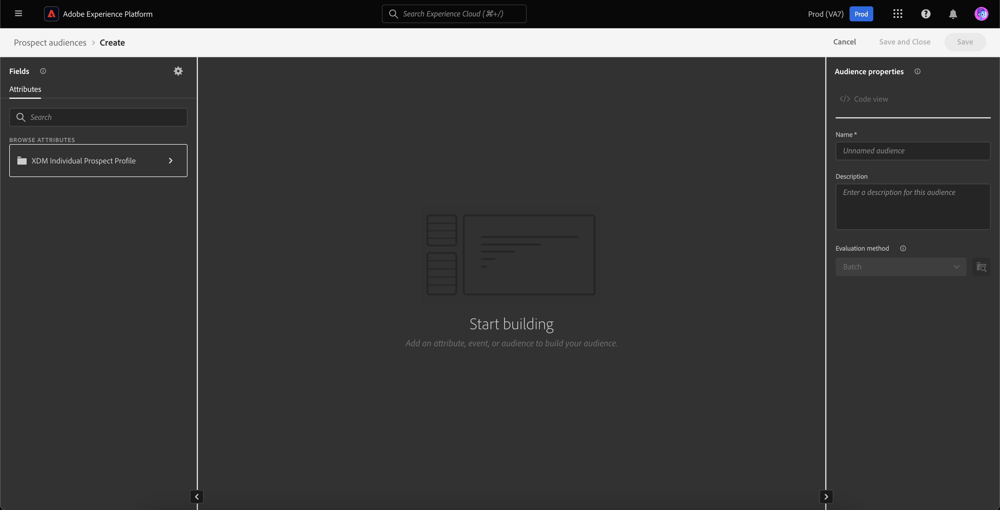

# 잠재 고객 대상자

Adobe Experience Platform을 사용하면 마케터에게 친숙한 세분화 환경을 [잠재 고객 프로필](../../profile/ui/prospect-profile.md)에 완전히 쉽고 정교하게 만들 수 있습니다. 파트너 데이터를 책임 있게 사용하면서 자체 잠재 고객을 생성하여 대상을 조립하는 데 드는 시간을 크게 줄일 수 있습니다.

## 액세스 {#access}

잠재 고객 대상에 액세스하려면 **[!UICONTROL 잠재 고객]** 섹션에서 **[!UICONTROL 대상]**&#x200B;을(를) 선택하십시오.

![[!UICONTROL 대상자] 단추가 [!UICONTROL 잠재 고객] 섹션 내에서 강조 표시됩니다.](../images/types/prospect/prospect-audiences.png)

Audience Portal 이 표시되고 조직에 대한 모든 Prospect Audiences 목록이 표시됩니다.

이 보기에는 이름, 프로필 수, 원본, 라이프사이클 상태, 만든 날짜, 마지막 업데이트 날짜 및 분류를 포함하여 대상에 대한 정보가 나열됩니다.

을 선택하여 이 표시에 필드를 추가할 수 있습니다. 이러한 추가 필드에는 업데이트 주기 및 마지막 업데이트자가 포함됩니다.

나열된 필드에 대한 자세한 정보를 포함하여 Audience Portal에 대한 자세한 내용은 [Audience Portal 개요](../ui/audience-portal.md#list)에서 확인할 수 있습니다.

## 대상자 세부 정보 {#details}

특정 잠재 고객에 대한 세부 정보를 보려면 고객 포털에서 대상을 선택하십시오.

잠재 고객 세부 정보 페이지가 표시됩니다. 잠재 고객 요약, 고객 합계 및 활성화된 대상을 포함한 정보가 표시됩니다.

대상 세부 정보 페이지에 대한 자세한 내용은 Audience Portal 개요[&#128279;](../ui/audience-portal.md#audience-details)의 대상 세부 정보 섹션을 참조하십시오.

## 대상자 만들기 {#create}

잠재 고객을 만들려면 대상 포털에서 **[!UICONTROL 대상 만들기]**&#x200B;를 선택하십시오.

![잠재 고객 대상 찾아보기 페이지에서 [!UICONTROL 대상자 만들기] 단추가 강조 표시됩니다.](../images/types/prospect/select-create-audience.png)

세그먼트 빌더 가 나타납니다. Prospect Profile Attribute 가 왼쪽 탐색 모음에 나타납니다.

세그먼트 빌더 사용에 대한 자세한 내용은 [세그먼트 빌더 UI 안내서](../ui/segment-builder.md)를 참조하십시오.

## 제안된 사용 사례 {#use-cases}

Experience Platform에서 Prospect Audiences 기능을 다른 Experience Platform 기능과 함께 사용하는 방법을 알아보려면 다음 사용 사례 설명서를 참조하십시오.

- [전망 기능을 통해 신규 고객 참여 및 확보](../../rtcdp/partner-data/prospecting.md)

## 다음 단계

이 안내서를 읽고 나면 이제 Adobe Experience Platform에서 잠재 고객을 만들고 관리하는 방법을 이해할 수 있습니다. 잠재 고객을 다른 다운스트림 서비스로 활성화하는 방법에 대해 알아보려면 [잠재 고객 활성화](../../destinations/ui/activate-prospect-audiences.md)에 대한 안내서를 참조하십시오.
