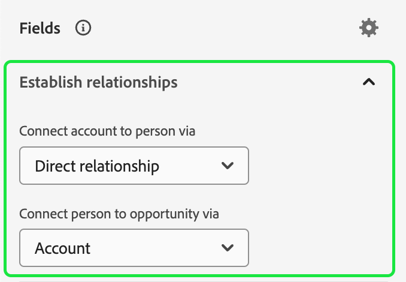

# 계정 대상자

>[!AVAILABILITY]
>
>계정 대상은 [B2B edition of Real-time Customer Data Platform](../../rtcdp/overview.md#rtcdp-b2b) 및 [B2P Edition of Real-time Customer Data Platform](../../rtcdp/overview.md#rtcdp-b2p)에서만 사용할 수 있습니다.

Adobe Experience Platform을 사용하면 계정 세분화를 통해 사용자 기반 대상에서 계정 기반 대상으로의 마케팅 세분화 경험을 전체적으로 쉽고 정교하게 만들 수 있습니다.

계정 대상은 계정 기반 대상에 대한 입력으로 사용할 수 있으며, 이를 통해 다운스트림 서비스의 해당 계정 내에서 사용자를 타겟팅할 수 있습니다. 예를 들어 계정 기반 대상을 사용하여 **COO(최고 운영 책임자) 또는 CMO(최고 마케팅 책임자)라는 직함을 가진 모든 사용자에 대한 연락처 정보가 있는 모든 계정의 레코드를 검색할 수 있습니다.**

## 용어 {#terminology}

계정 대상을 시작하기 전에 다양한 대상 유형 간의 차이점을 검토하십시오.

- **계정 대상**: 계정 대상은 **계정** 프로필 데이터를 사용하여 만든 대상입니다. 계정 프로필 데이터를 사용하여 다운스트림 계정 내에서 사용자를 타겟팅하는 대상을 만들 수 있습니다. 계정 프로필에 대한 자세한 내용은 [계정 프로필 개요](../../rtcdp/accounts/account-profile-overview.md)를 참조하십시오.
- **사용자 대상**: 사용자 대상은 **고객** 프로필 데이터를 사용하여 만든 대상입니다. 고객 프로필 데이터를 사용하여 비즈니스 고객을 타겟팅하는 대상을 만들 수 있습니다. 고객 프로필에 대한 자세한 내용은 [실시간 고객 프로필 개요](../../profile/home.md)를 참조하십시오.
- **잠재 고객 대상**: 잠재 고객은 **잠재 고객** 프로필 데이터를 사용하여 만든 대상입니다. Prospect 프로필 데이터를 사용하여 인증되지 않은 사용자로부터 대상을 만들 수 있습니다. 잠재 고객 프로필에 대한 자세한 내용은 [잠재 고객 프로필 개요](../../profile/ui/prospect-profile.md)를 참조하십시오.

## 액세스 {#access}

계정 대상에 액세스하려면 **[!UICONTROL 계정]** 섹션에서 **[!UICONTROL 대상]**&#x200B;을(를) 선택하십시오.

[!UICONTROL 찾아보기] 페이지가 표시되어 조직의 모든 계정 대상자 목록을 표시합니다.

이 보기에는 이름, 프로필 수, 원본, 라이프사이클 상태, 만든 날짜 및 마지막으로 업데이트한 날짜 등 대상에 대한 정보가 나열됩니다.

또한 검색 및 필터링 기능을 사용하여 특정 계정 대상을 신속하게 검색하고 정렬할 수 있습니다. 이 기능에 대한 자세한 내용은 [Audience Portal 개요](./audience-portal.md#manage-audiences)를 참조하십시오.

## 대상자 만들기 {#create}

>[!NOTE]
>
>계정 대상은 **일괄 처리** 세그먼테이션을 사용하여 평가되며, 24시간마다 평가됩니다.

계정 대상을 만들려면 [!UICONTROL 찾아보기] 페이지에서 **[!UICONTROL 대상 만들기]**&#x200B;를 선택하십시오.

![계정 대상자 찾아보기 페이지에서 [!UICONTROL 대상자 만들기] 단추가 강조 표시됩니다.](../images/ui/account-audiences/select-create-audience.png)

세그먼트 빌더 가 나타납니다. 계정 속성 및 대상은 왼쪽 탐색 모음에 표시됩니다. [!UICONTROL 특성] 탭에서 플랫폼에서 만든 특성과 사용자 지정 특성을 모두 추가할 수 있습니다.

계정 대상을 만들 때 이벤트는 자신의 탭이 아니라 **[!UICONTROL 사람]** 아래에 나열됩니다. 이러한 속성은 사람과 연결되어 있기 때문입니다.

![이벤트를 찾을 위치([!UICONTROL 사람] 폴더 내)가 강조 표시되어 있습니다.](../images/ui/account-audiences/attributes.png)

[!UICONTROL 대상] 탭에서 이전에 만든 사람 기반 대상을 추가하여 자신의 계정 대상을 만들 때 빌드할 수 있습니다.

세그먼트 빌더 사용에 대한 자세한 내용은 [세그먼트 빌더 UI 안내서](./segment-builder.md)를 참조하십시오.

### 관계 설정 {#relationships}

계정 대상자의 경우 기본적으로 세그먼트 빌더 UI에 계정과 사용자 간의 직접 관계가 표시됩니다. 그러나 계정 대상자에 대해서는 다른 관계 유형을 사용할 수 있습니다.

대체 관계 유형을 사용하려면 을 선택하세요.

[!UICONTROL 설정] 탭의 **[!UICONTROL 필드 관계]** 섹션에서 **[!UICONTROL 관계 선택기 표시]**&#x200B;를 선택합니다.

을 다시 선택하여 [!UICONTROL 필드] 탭으로 돌아갑니다. 이제 **[!UICONTROL 관계 설정]** 섹션을 볼 수 있습니다. 이를 통해 계정과 사용자 연결 방법 및 사용자가 영업 기회에 연결되는 방법을 설정할 수 있습니다.

계정을 개인에게 연결할 때 다음 옵션 중에서 선택할 수 있습니다.

| 옵션 | 설명 |
| ------ | ----------- |
| 직접 관계 | 계정과 사용자 간의 직접 연결. 개인 스키마의 `personComponents` 배열에서 `accountID` 값의 배열을 통해 각 사용자가 연결되는 계정을 지정합니다. 이 경로가 가장 자주 사용됩니다. |
| 계정-사용자 관계 | `accountPersonRelation` 개체로 정의된 계정과 사용자 간의 관계입니다. 이 경로를 사용하면 각 사용자가 여러 계정에 연결할 수도 있습니다. 조직이 소스 데이터에서 명시적 관계 테이블을 정의한 경우 사용됩니다. |
| 영업 기회-사용자 관계 | `opportunityPersonRelation` 개체로 정의된 영업 기회와 사용자 간의 관계입니다. 이는 기회-개인에서 기회로 이동하여 사용자와 계정을 연결합니다. 여기에서 개인이 기회에 연결된 회사를 설명할 수 있습니다. |

영업 기회를 개인에게 연결할 때 다음 옵션 중에서 선택할 수 있습니다.

| 옵션 | 설명 |
| ------ | ----------- |
| 계정 | 거래처와 영업 기회 간의 직접적인 연결입니다. 계정 대상에서 이를 사용하면 이 경로는 회사의 모든 사람을 기회에 연결합니다. |
| 영업 기회-사용자 관계 | 영업 기회 및 개인 간의 관계(영업 기회-개인 오브젝트의 기반). 이 경로는 특정 영업 기회와 관련된 것으로 확인된 사람만 해당 영업 기회에 연결합니다. |

원하는 관계를 설정한 후 필요한 사람-대상을 세그먼트 정의에 추가할 수 있습니다.

## 대상자 활성화 {#activate}

>[!NOTE]
>
>계정 대상자를 지원하는 대상의 수는 제한되어 있습니다. 이 프로세스를 계속하기 전에 활성화하려는 대상이 계정 대상자를 지원하는지 확인하십시오.

계정 대상을 만든 후 대상을 다른 다운스트림 서비스로 활성화할 수 있습니다.

활성화할 대상을 선택한 다음 **[!UICONTROL 대상에 활성화]**&#x200B;를 선택합니다.

![선택한 대상자에 대한 빠른 작업 메뉴에서 [!UICONTROL 대상에 활성화] 단추가 강조 표시됩니다.](../images/ui/account-audiences/activate.png)

[!UICONTROL 대상 활성화] 페이지가 나타납니다. 지원되는 대상 및 필드 매핑에 대한 세부 정보를 포함하여 활성화 프로세스에 대한 자세한 내용은 [계정 대상자 활성화](/help/destinations/ui/activate-account-audiences.md) 자습서를 참조하십시오.

## 다음 단계 {#next-steps}

이제 이 안내서를 읽고 Adobe Experience Platform에서 계정 대상을 만들고 사용하는 방법을 더 잘 이해할 수 있습니다. 플랫폼에서 다른 유형의 대상을 사용하는 방법에 대해 알아보려면 [세그먼테이션 서비스 UI 안내서](./overview.md)를 참조하십시오.

## 부록 {#appendix}

다음 섹션에서는 계정 대상자에 대한 추가 정보를 제공합니다.

### 계정 세분화 유효성 검사 {#validation}

>[!CONTEXTUALHELP]
>id="platform_audiences_account_constraint_eventLookbackWindow"
>title="최대 전환 확인 기간 오류"
>abstract="경험 이벤트의 최대 전환 확인 기간은 30일입니다."

>[!CONTEXTUALHELP]
>id="platform_audiences_account_constraint_combinationMaxDepth"
>title="최대 중첩 컨테이너 깊이 오류"
>abstract="중첩된 컨테이너의 최대 깊이는 **5**&#x200B;입니다. 이는 대상자를 생성할 때 다섯 개를 초과하는 중첩된 컨테이너를 **가질 수 없다**&#x200B;는 것을 의미합니다."

>[!CONTEXTUALHELP]
>id="platform_audiences_account_constraint_combinationMaxBreadth"
>title="최대 규칙 수량 오류"
>abstract="단일 컨테이너 내에서의 최대 규칙 수는 **5**&#x200B;입니다. 이는 대상자를 생성할 때 단일 컨테이너 내에서의 규칙 수가 다섯 개를 **초과할 수 없다**&#x200B;는 것을 의미합니다."

>[!CONTEXTUALHELP]
>id="platform_audiences_account_constraint_crossEntityMaxDepth"
>title="최대 크로스 엔티티 수량 오류"
>abstract="단일 대상자 내에서 사용할 수 있는 최대 크로스 엔티티 수는 **5**&#x200B;입니다. 크로스 엔티티는 대상자 내에서 서로 다른 엔티티 간에 변경하는 경우입니다. 예를 들어 계정에서 사용자, 마케팅 목록으로 이동합니다."

>[!CONTEXTUALHELP]
>id="platform_audiences_account_constraint_allowCustomEntity"
>title="사용자 정의 엔티티 오류"
>abstract="사용자 정의 엔티티는 **허용되지 않습니다**."

>[!CONTEXTUALHELP]
>id="platform_audiences_account_constraint_b2bBuiltInEntities"
>title="잘못된 B2B 엔티티 오류"
>abstract="다음 B2B 엔티티만 사용이 허용됩니다. `_xdm.context.account`, `_xdm.content.opportunity`, `_xdm.context.profile`, `_xdm.context.experienceevent`, `_xdm.context.account-person`, `_xdm.classes.opportunity-person`, `_xdm.classes.marketing-list-member`, `_xdm.classes.marketing-list`, `_xdm.context.campaign-member` 및 `_xdm.classes.campaign`."

>[!CONTEXTUALHELP]
>id="platform_audiences_account_constraint_rhsMaxOptions"
>title="최대 값 오류"
>abstract="단일 필드에 대해 확인할 수 있는 최대 값 수는 **50**&#x200B;입니다."

>[!CONTEXTUALHELP]
>id="platform_audiences_account_constraint_allowInSegmentByReference"
>title="inSegment 이벤트 오류"
>abstract="inSegment 이벤트는 **허용되지 않습니다**."

>[!CONTEXTUALHELP]
>id="platform_audiences_account_constraint_allowInSegmentByValue"
>title="inSegment 이벤트 오류"
>abstract="inSegment 이벤트는 **허용되지 않습니다**."

>[!CONTEXTUALHELP]
>id="platform_audiences_account_constraint_allowSequentialEvents"
>title="순차적 이벤트 오류"
>abstract="순차적 이벤트는 **허용되지 않습니다**."

>[!CONTEXTUALHELP]
>id="platform_audiences_account_constraint_allowMaps"
>title="맵 유형 속성 오류"
>abstract="맵 유형 속성은 **허용되지 않습니다**."

>[!CONTEXTUALHELP]
>id="platform_audiences_account_constraint_maxNestedAggregationDepth"
>title="최대 중첩 엔티티 깊이 오류"
>abstract="중첩된 배열의 최대 깊이는 **5**&#x200B;입니다."

>[!CONTEXTUALHELP]
>id="platform_audiences_account_constraint_maxObjectNestingLevel"
>title="최대 중첩 오브젝트 수량 오류"
>abstract="허용되는 최대 중첩 오브젝트 수는 **10**&#x200B;입니다."

>[!CONTEXTUALHELP]
>id="platform_audiences_account_constraint_generic"
>title="제한 위반"
>abstract="대상자가 제한 조건을 위반했습니다. 자세한 내용은 링크된 문서를 읽어 보시기 바랍니다."

계정 대상을 사용할 때 대상 **은(는) 다음 제한을 준수해야**&#x200B;합니다.

>[!NOTE]
>
>다음 목록은 계정 대상에 대한 **default** 제약 조건을 보여 줍니다. 이러한 값 **은(는) 조직 관리자가 구현한 설정에 따라**&#x200B;번 변경될 수 있습니다.

- 경험 이벤트에 대한 최대 전환 확인 기간은 **30일**&#x200B;입니다.
- 중첩된 컨테이너의 최대 깊이는 **5**&#x200B;입니다.
   - 이는 대상자를 생성할 때 다섯 개를 초과하는 중첩된 컨테이너를 **가질 수 없다**&#x200B;는 것을 의미합니다.
- 단일 컨테이너 내의 최대 규칙 수는 **5**&#x200B;입니다.
   - 즉, 대상 **은(는) 대상을 구성하는 규칙을 5개 이상 가질 수 없습니다**.
- 사용할 수 있는 최대 교차 엔터티 수는 **5**&#x200B;입니다.
   - 크로스 엔티티는 대상자 내에서 서로 다른 엔티티 간에 변경하는 경우입니다. 예를 들어 계정에서 사용자, 마케팅 목록으로 이동합니다.
- 사용자 지정 엔터티 **사용할 수 없음**.
- 단일 필드에 대해 확인할 수 있는 최대 값 수는 **50**&#x200B;입니다.
   - 예를 들어 &quot;도시 이름&quot; 필드가 있는 경우 50개의 도시 이름에 대해 해당 값을 확인할 수 있습니다.
- 계정 대상자 **은(는) `inSegment`개의 이벤트를 사용할 수**&#x200B;없습니다.
- 계정 대상자 **은(는) 순차적 이벤트를 사용할 수 없습니다**.
- 계정 대상자 **은(는) 맵을 사용할 수 없습니다**.
- 중첩된 배열의 최대 깊이는 **5**&#x200B;입니다.
- 중첩된 개체의 최대 수는 **10**&#x200B;입니다.
