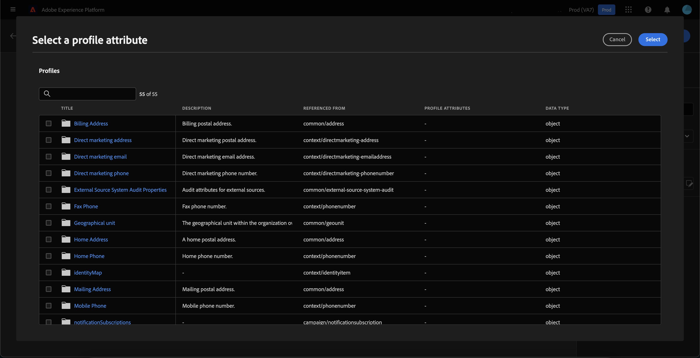

# Audience Builder UI 안내서

>[!IMPORTANT]
>
>Audience Builder는 현재 베타 버전이며 모든 사용자가 사용할 수 없습니다. 설명서 및 기능은 변경될 수 있습니다.

Audience Builder에서는 다른 작업을 나타내는 데 사용되는 블록을 사용하여 대상을 만들고 편집할 수 있는 작업 공간을 제공합니다.

대상 구성 캔버스는 다섯 가지 유형의 블록으로 구성됩니다. **[[!UICONTROL Audience]](#audience-block)**, **[[!UICONTROL 제외]](#exclude-block)**, **[[!UICONTROL 가입]](#join-block)**, **[[!UICONTROL 등급]](#rank-block)**, 및 **[[!UICONTROL 분할]](#split-block)**.

## [!UICONTROL Audience] {#audience-block}

다음 **[!UICONTROL Audience]** 블록 유형을 사용하면 새 큰 대상을 작성할 하위 대상을 추가할 수 있습니다. 기본적으로 **[!UICONTROL Audience]** 블록은 컴포지션 캔버스의 맨 위에 포함되어 있습니다.

을(를) 선택하는 경우 **[!UICONTROL Audience]** 블록, 오른쪽 레일에는 블록에 레이블을 지정하고 대상을 추가하는 컨트롤이 표시됩니다.

선택 후 **[!UICONTROL 대상 추가]**, 대상자 목록이 표시됩니다. 포함할 대상자를 선택하고 을 클릭합니다 **[!UICONTROL 추가]** 대상 블록에 추가합니다.

이제 선택한 대상이 **[!UICONTROL Audience]** 블록이 선택되어 있습니다. 여기에서 결합된 대상의 병합 유형을 변경할 수 있습니다.

| 병합 유형 | 설명 |
| ---------- | ----------- |
| [!UICONTROL 합집합] | 대상이 하나의 대상으로 결합됩니다. 이는 OR 작업과 같습니다. |
| [!UICONTROL 교차] | 대상은에서 공유되는 대상와만 결합됩니다 **모두** 추가 중입니다. 이는 AND 작업과 같습니다. |
| [!UICONTROL 겹치기 제외] | 대상은에서 공유되는 대상와만 결합됩니다 **하나지만 전부가 아닙니다** 추가 중입니다. 이는 XOR 작업과 같습니다. |

## [!UICONTROL 제외] {#exclude-block}

다음 **[!UICONTROL 제외]** 블록 유형을 사용하면 지정된 하위 대상 또는 특성을 더 큰 대상에서 제외할 수 있습니다.

를 추가하려면 **[!UICONTROL 제외]** 블록을 선택하고 **+** 아이콘, 그 다음 **[!UICONTROL 제외]**.

다음 **[!UICONTROL 제외]** 블록이 추가되었습니다. 이 블록을 선택하면 제외 세부 사항이 오른쪽 레일에 나타납니다. 여기에는 블록의 레이블 및 제외 유형이 포함됩니다. 제외할 수 있습니다 [대상별](#exclude-audience) 또는 [속성별](#exclude-attribute).

### 대상별 제외 {#exclude-audience}

대상별로 제외하는 경우, 을 선택하여 제외할 대상을 선택할 수 있습니다 **[!UICONTROL 대상 추가]**.

대상자 목록이 나타납니다. 선택 **[!UICONTROL 추가]** 제외 블록에 제외할 대상을 추가하려면.

### 속성별 제외 {#exclude-attribute}

속성별로 제외하는 경우  아이콘 내 **[!UICONTROL 제외 규칙]** 섹션을 참조하십시오.

프로필 속성 목록이 나타납니다. 제외할 속성 유형을 선택한 후 **[!UICONTROL 선택]** 제외 블록에 추가하려면 다음을 수행하십시오.

## [!UICONTROL 가입] {#join-block}

다음 **[!UICONTROL 가입]** 블록 유형을 사용하면 Adobe Experience Platform에서 아직 처리하지 않은 데이터 세트의 외부 대상에 추가할 수 있습니다.

을(를) 추가하려면 **[!UICONTROL 가입]** 블록을 선택하고 **+** 아이콘, 그 다음 **[!UICONTROL 가입]**.

블록을 선택하면 조인에 대한 세부 사항이 블록 레이블과 데이터 세트에 대상을 추가하는 옵션 등 오른쪽 레일에 표시됩니다.

선택 후 **[!UICONTROL 대상 추가]**, 대상자 목록이 표시됩니다. 포함할 대상자를 선택하고 을 클릭합니다 **[!UICONTROL 추가]** 조인 블록에 추가합니다.

이제 선택한 대상이 **[!UICONTROL 가입]** 블록이 선택되어 있습니다.

## [!UICONTROL 등급] {#rank-block}

다음 **[!UICONTROL 등급]** 블록 유형을 사용하면 새 대상이 게시되기 전에 대상의 등급을 매기고 정렬할 수 있습니다.

을(를) 추가하려면 **[!UICONTROL 등급]** 블록을 선택하고 **+** 아이콘, 그 다음 **[!UICONTROL 등급]**.

블록을 선택하면 등급 세부 정보가 오른쪽 레일에 표시됩니다. 여기에는 블록의 레이블, 등급 지정 기준 속성, 등급 순서 및 순위 지정 제한 토글이 포함됩니다.

대상의 등급을 지정할 속성을 선택하려면  아이콘.

프로필 속성 목록이 나타납니다. 이 팝오버에서 대상의 등급을 지정할 속성 유형을 선택할 수 있습니다. 선택 **[!UICONTROL 선택]** 를 추가하여 등급 블록에 추가합니다. 선택한 속성은 다음 작업을 수행할 수 있습니다 **전용** be 유형 `int`.

속성을 선택한 후 등급을 지정할 순서를 선택할 수 있습니다. 오름차순(가장 낮은 것부터 가장 높은 순으로) 또는 내림차순(가장 높은 것에서 가장 낮은 순서로)입니다.

또한 를 활성화하여 반환되는 대상 수를 제한할 수 있습니다 **[!UICONTROL 프로필 제한 추가]** 토글. 이 토글이 활성화되면 내에서 반환되는 최대 대상자 수를 설정할 수 있습니다 **[!UICONTROL 포함된 프로필]** 필드.

## [!UICONTROL 분할] {#split-block}

다음 **[!UICONTROL 분할]** 블록 유형을 사용하면 새 대상을 다양한 하위 대상으로 분할할 수 있습니다. 백분율이나 속성에 따라 이 대상자를 분할할 수 있습니다.

을(를) 추가하려면 **[!UICONTROL 분할]** 블록을 선택하고 **+** 아이콘, 그 다음 **[!UICONTROL 분할]**.

### 백분율로 분할 {#split-percentage}

백분율로 분할할 때, 제공된 경로 수와 백분율에 따라 대상이 임의로 분할됩니다.

예를 들어 각각 프로필 비율이 다른 세 개의 경로가 있을 수 있습니다.

또한 분할된 대상 중 하나를 컨트롤 그룹으로 표시할 수 있습니다.

### 속성별 분할 {#split-attribute}

속성으로 분할할 때 대상은 제공된 속성에 따라 분할됩니다. 분할할 속성을 선택하려면 **[!UICONTROL 분할]** 블록, 그 다음에  아이콘.

프로필 속성 목록이 나타납니다. 속성 유형을 선택한 다음 **[!UICONTROL 선택]** 을 추가하여 분할 블록에 추가합니다.

속성을 선택한 후에 내에 값을 추가하여 어떤 하위 대상이 될 프로필을 선택할 수 있습니다 **[!UICONTROL 값]** 필드.

또한 **[!UICONTROL 기타 프로필]** 선택하지 않은 모든 프로필로 구성된 하위 대상을 만들려면 전환합니다.

## 대상자 게시

대상자를 작성한 후 을(를) 선택하여 저장하고 게시할 수 있습니다 **[!UICONTROL 게시]**.

대상자를 만드는 동안 오류가 발생하면 문제를 해결하는 방법을 알려주는 경고가 표시됩니다.

## 다음 단계

Audience Builder에서는 다른 블록 유형에서 대상을 만들 수 있는 풍부한 워크플로우를 제공합니다. 세그멘테이션 서비스 UI의 다른 부분에 대한 자세한 내용은 [세그멘테이션 서비스 사용 안내서](./overview.md).