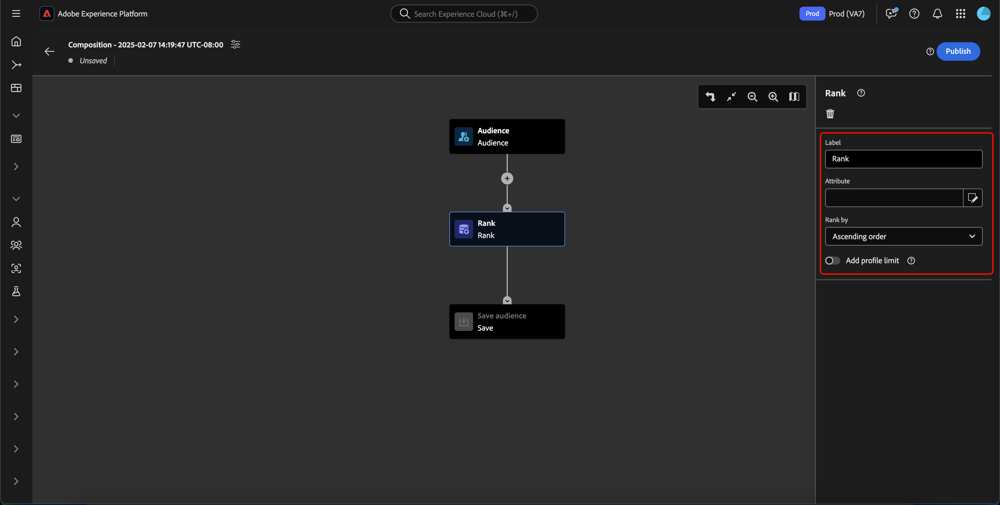
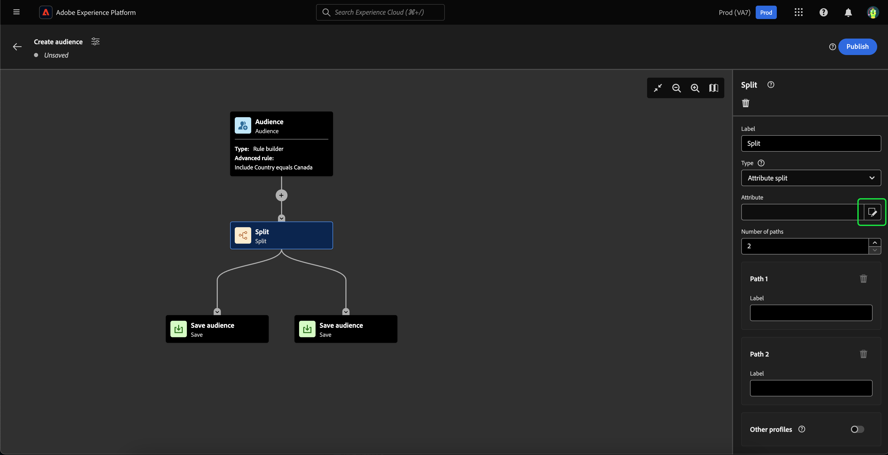

# 대상 구성 UI 안내서

>[!NOTE]
>
>이 안내서에서는 대상 구성을 사용하여 대상을 만드는 방법을 설명합니다. 세그먼트 빌더를 사용하여 세그먼트 정의를 통해 대상자를 만드는 방법에 대해 알아보려면 다음을 참조하십시오. [세그먼트 빌더 UI 안내서](./segment-builder.md).

대상 컴포지션은 다양한 작업을 나타내는 데 사용되는 블록을 사용하여 대상을 작성하고 편집할 수 있는 작업 영역을 제공합니다.

제목 및 설명을 포함하여 컴포지션의 세부 정보를 변경하려면  단추를 클릭합니다.

다음 **[!UICONTROL 컴포지션 속성]** 팝오버가 표시됩니다. 여기에 제목과 설명을 포함하여 컴포지션의 세부 정보를 삽입할 수 있습니다.

![[컴포지션] 속성 팝오버가 표시됩니다.](../images/ui/audience-composition/composition-properties.png)

>[!NOTE]
>
>다음을 수행하는 경우 **아님** 컴포지션에 제목을 지정하면 &quot;컴포지션&quot;이라는 제목 뒤에 기본적으로 작성 날짜와 시간이 옵니다. 또한 각 컴포지션 **필수** 고유한 이름이 있습니다.

컴포지션의 세부 정보를 업데이트한 후 **[!UICONTROL 저장]** 업데이트를 확인합니다. 대상자 구성 캔버스가 다시 나타납니다.

대상 구성 캔버스는 네 가지 유형의 블록으로 구성됩니다. **[[!UICONTROL 대상자]](#audience-block)**, **[[!UICONTROL 제외]](#exclude-block)**, **[[!UICONTROL 등급]](#rank-block)**, 및 **[[!UICONTROL 분할]](#split-block)**.

## [!UICONTROL 대상자] {#audience-block}

다음 **[!UICONTROL 대상자]** 블록 유형을 사용하면 더 큰 새 대상을 구성할 하위 대상을 추가할 수 있습니다. 기본적으로 **[!UICONTROL 대상자]** 블록은 컴포지션 캔버스의 맨 위에 포함됩니다.

다음을 선택하면 **[!UICONTROL 대상자]** 블록의 오른쪽 레일에는 대상 블록에 대한 사용자 지정 규칙을 작성할 뿐만 아니라 대상에 레이블을 지정하고 블록에 대상을 추가하는 컨트롤이 표시됩니다.

>[!NOTE]
>
>대상을 추가할 수 있습니다. **또는** 사용자 지정 규칙을 만듭니다. 이 두 가지 기능 **할 수 없음** 함께 사용됩니다.

### [!UICONTROL 대상자 추가] {#add-audience}

대상 블록에 대상을 추가하려면 선택 **[!UICONTROL 대상 추가]**.

>[!IMPORTANT]
>
>다음을 참고하십시오. **전용** 기본 병합 정책을 사용하여 정의된 대상이 표시됩니다.

대상자 목록이 나타납니다. 포함할 대상을 선택한 다음, **[!UICONTROL 추가]** 대상 블록에 추가합니다.

이제 다음과 같은 경우 선택한 대상이 오른쪽 레일 내에 나타납니다. **[!UICONTROL 대상자]** 블록이 선택되어 있습니다. 여기에서 결합된 대상자의 병합 유형을 변경할 수 있습니다.

| 병합 유형 | 설명 |
| ---------- | ----------- |
| [!UICONTROL 합집합] | 대상은 하나의 대상으로 결합됩니다. 이는 OR 작업과 동일합니다. |
| [!UICONTROL 교차] | 대상은에서 공유되는 대상과만 결합됩니다 **모두** 개 중 개가 추가됩니다. 이는 AND 작업과 동일합니다. |
| [!UICONTROL 중복 제외] | 대상은에서 공유되는 대상과만 결합됩니다 **1개, 그러나 전부는 아님** 개 중 개가 추가됩니다. 이것은 XOR 연산과 같은 결과가 될 것이다. |

### [!UICONTROL 규칙 작성] {#build-rule}

대상 블록에 사용자 지정 규칙을 추가하려면 다음을 선택합니다. **[!UICONTROL 규칙 작성]**.

세그먼트 빌더 가 나타납니다. 세그먼트 빌더를 사용하여 대상자가 따라야 할 사용자 지정 규칙을 만들 수 있습니다. 세그먼트 빌더 사용에 대한 자세한 내용은 [세그먼트 빌더 안내서](./segment-builder.md).

사용자 지정 규칙을 추가한 후 다음을 선택합니다. **[!UICONTROL 저장]** 대상자에 규칙을 추가합니다.

## [!UICONTROL 제외] {#exclude-block}

다음 **[!UICONTROL 제외]** 블록 유형을 사용하면 지정된 하위 대상이나 속성을 더 큰 새 대상에서 제외할 수 있습니다.

을(를) 추가하려면 **[!UICONTROL 제외]** 블록을 선택하고 **+** 아이콘, 뒤에 오는 **[!UICONTROL 제외]**.

다음 **[!UICONTROL 제외]** 블록이 추가되었습니다. 이 블록을 선택하면 제외에 대한 세부 정보가 오른쪽 레일에 표시됩니다. 여기에는 블록의 레이블 및 제외 유형이 포함됩니다. 다음을 제외할 수 있습니다. [대상별](#exclude-audience) 또는 [속성별](#exclude-attribute).

### 대상별로 제외 {#exclude-audience}

대상별로 제외하는 경우 을 선택하여 제외할 대상을 선택할 수 있습니다 **[!UICONTROL 대상 추가]**.

![다음 [!UICONTROL 대상자 추가] 버튼을 선택하여 제외할 대상을 선택할 수 있습니다.](../images/ui/audience-composition/add-excluded-audience.png)

대상자 목록이 나타납니다. 선택 **[!UICONTROL 추가]** 제외할 대상을 제외 블록에 추가합니다.

### 속성별 제외 {#exclude-attribute}

속성별로 제외하는 경우, 다음을 선택하여 제외할 속성을 선택할 수 있습니다.  아이콘 내 **[!UICONTROL 제외 규칙]** 섹션.

프로필 속성 목록이 나타납니다. 제외할 속성 유형을 선택한 후 다음을 수행합니다 **[!UICONTROL 선택]** 제외 블록에 추가합니다.

>[!IMPORTANT]
>
>속성별로 제외할 때는 **1** 제외할 값입니다. 쉼표나 세미콜론과 같은 모든 종류의 구분 기호를 사용하면 해당 정확한 값만 제외됩니다. 예를 들어 값을 로 설정하는 경우 `red, blue` 을 실행하면 해당 용어가 제외됩니다. `red, blue` 속성에서 가져왔지만 **아님** 다음 용어 중 하나를 제외합니다. `red` 또는 `blue`.

## [!UICONTROL 강화] {#enrich-block}

>[!IMPORTANT]
>
>이 시점에서 데이터 보강 속성은 다음을 수행할 수 있습니다. **전용** 다운스트림 Adobe Journey Optimizer 시나리오에서 사용됩니다.

다음 **[!UICONTROL 강화]** 블록 유형을 사용하면 데이터 세트의 추가 속성으로 대상자를 보강할 수 있습니다. 개인화 사용 사례에서 이러한 속성을 사용할 수 있습니다.

을(를) 추가하려면 **[!UICONTROL 강화]** 블록을 선택하고 **+** 아이콘, 뒤에 오는 **[!UICONTROL 강화]**.

![다음 [!UICONTROL 강화] 옵션이 선택되어 있습니다.](../images/ui/audience-composition/add-enrich-block.png)

다음 **[!UICONTROL 강화]** 블록이 추가되었습니다. 이 블록을 선택하면 데이터 보강에 대한 세부 정보가 오른쪽 레일에 표시됩니다. 여기에는 블록의 레이블 및 데이터 보강 세트가 포함됩니다.

대상자를 강화할 데이터 세트를 선택하려면 다음을 선택하십시오.  아이콘.

![필터 버튼이 강조 표시됩니다. 이 옵션을 선택하면 [!UICONTROL 데이터 세트 선택] 팝오버.](../images/ui/audience-composition/enrich-select-dataset.png)

다음 **[!UICONTROL 데이터 세트 선택]** 팝오버가 표시됩니다. 데이터 강화를 위해 추가할 데이터 세트를 선택한 다음 **[!UICONTROL 선택]** 데이터 세트를 추가하여 보강합니다.

>[!IMPORTANT]
>
>선택한 데이터 세트 **필수** 다음 기준을 충족합니다.
>
>- 데이터 세트 **필수** 기록 유형이어야 합니다.
>   - 데이터 세트 **할 수 없음** 이벤트 유형이거나, 시스템 생성되거나, 프로필로 표시될 수 있습니다.
>- 데이터 세트 **필수** 1GB 이하여야 합니다.

다음 **[!UICONTROL 데이터 보강 기준]** 섹션이 이제 오른쪽 레일에 나타납니다. 이 섹션에서 다음을 선택할 수 있습니다 **[!UICONTROL 소스 조인 키]** 및 **[!UICONTROL 데이터 세트 보강 조인 키]**&#x200B;데이터 보강 데이터 세트를 만들려는 대상과 연결할 수 있습니다.

![다음 [!UICONTROL 데이터 보강 기준] 영역이 강조 표시됩니다.](../images/ui/audience-composition/enrichment-criteria.png)

을(를) 선택하려면 **[!UICONTROL 소스 조인 키]**&#x200B;를 선택하고  아이콘.

![에 대한 필터 아이콘 [!UICONTROL 소스 조인 키] 강조 표시됩니다.](../images/ui/audience-composition/enrich-select-source-join-key.png)

다음 **[!UICONTROL 프로필 속성 선택]** 팝오버가 표시됩니다. 소스 조인 키로 사용할 프로필 속성을 선택한 후 다음을 수행합니다 **[!UICONTROL 선택]** 소스 조인 키로 해당 속성을 선택합니다.

을(를) 선택하려면 **[!UICONTROL 데이터 세트 보강 조인 키]**&#x200B;를 선택하고  아이콘.

![에 대한 필터 아이콘 [!UICONTROL 데이터 세트 보강 조인 키] 강조 표시됩니다.](../images/ui/audience-composition/enrich-select-enrichment-dataset-join-key.png)

다음 **[!UICONTROL 데이터 보강 속성]** 팝오버가 표시됩니다. 데이터 보강 데이터 세트 조인 키로 사용할 속성을 선택한 다음 **[!UICONTROL 선택]** 데이터 보강 데이터 세트 조인 키로 해당 속성을 선택합니다.

이제 조인 키를 모두 추가했으므로 **[!UICONTROL 데이터 보강 속성]** 섹션이 나타납니다. 이제 대상자를 향상시킬 특성을 추가할 수 있습니다. 이러한 속성을 추가하려면 **[!UICONTROL 속성 추가]**.

![다음 [!UICONTROL 속성 추가] 버튼이 강조 표시됩니다.](../images/ui/audience-composition/enrich-select-add-attribute.png)

다음 **[!UICONTROL 데이터 보강 속성]** 팝오버가 표시됩니다. 데이터 세트에서 속성을 선택하여 대상자를 강화한 다음 **[!UICONTROL 선택]** 대상자에 속성을 추가합니다.

<!-- ## [!UICONTROL Join] {#join-block}

The **[!UICONTROL Join]** block type allows you to add in external audiences from datasets that have not yet been processed by Adobe Experience Platform.

To add a **[!UICONTROL Join]** block, select the **+** icon, followed by **[!UICONTROL Join]**.

When you select the block, details about the join are shown in the right rail, including the block's label and the option to add audiences to the enrichment dataset.

After selecting **[!UICONTROL Add Audience]**, a list of audiences appears. Select the audiences you want to include, followed by **[!UICONTROL Add]** to add them to your join block.

Your selected audiences now appear within the right rail when the **[!UICONTROL Join]** block is selected. 

 -->

## [!UICONTROL 등급] {#rank-block}

다음 **[!UICONTROL 등급]** 블록 유형을 사용하면 지정된 속성에 따라 프로필의 등급을 매기고 정렬하고 이러한 등급 프로필을 컴포지션에 포함할 수 있습니다.

을(를) 추가하려면 **[!UICONTROL 등급]** 블록을 선택하고 **+** 아이콘, 뒤에 오는 **[!UICONTROL 등급]**.

![[등급] 옵션이 선택되어 있습니다.](../images/ui/audience-composition/add-rank-block.png)

블록을 선택하면 블록의 레이블, 순위를 지정할 속성, 순위 순서 및 순위를 지정할 프로필 수를 제한하기 위한 토글을 포함하여 순위에 대한 세부 정보가 오른쪽 레일에 표시됩니다.

대상의 등급을 지정할 속성을 선택하려면 다음을 선택합니다.  아이콘.

프로필 속성 목록이 나타납니다. 이 팝오버에서는 대상 순위를 지정할 속성 유형을 선택할 수 있습니다. 선택 **[!UICONTROL 선택]** 등급 블록에 추가합니다. 선택한 속성은 다음 작업을 수행할 수 있습니다. **전용** 숫자여야 합니다.

속성을 선택한 후 등급 지정 순서를 선택할 수 있습니다. 오름차순(가장 낮은 순에서 가장 높은 순까지) 또는 내림차순(가장 높은 순에서 가장 낮은 순까지)입니다.

또한 를 활성화하여 반환되는 대상 수를 제한할 수 있습니다. **[!UICONTROL 프로필 제한 추가]** 토글. 이 토글이 활성화되면 내에서 반환되는 최대 대상 수를 설정할 수 있습니다. **[!UICONTROL 포함된 프로필]** 필드.

## [!UICONTROL 분할] {#split-block}

다음 **[!UICONTROL 분할]** 블록 유형을 사용하면 새 대상을 다양한 하위 대상으로 분할할 수 있습니다. 백분율이나 속성에 따라 이 대상을 분할할 수 있습니다.

을(를) 추가하려면 **[!UICONTROL 분할]** 블록을 선택하고 **+** 아이콘, 뒤에 오는 **[!UICONTROL 분할]**.

대상을 분할할 때 백분율로 분할하거나 속성별로 분할할 수 있습니다.

### 백분율로 분할 {#split-percentage}

백분율로 분할할 경우 대상은 제공된 경로 수와 백분율에 따라 무작위로 분할됩니다.

예를 들어 각각 프로필의 비율이 다른 세 개의 경로가 있을 수 있습니다.

### 속성으로 분할 {#split-attribute}

속성별로 분할하면 제공된 속성을 기준으로 대상자가 분할됩니다. 분할할 속성을 선택하려면 **[!UICONTROL 분할]** 블록, 뒤에 오는  아이콘.

프로필 속성 목록이 나타납니다. 속성 유형을 선택한 다음 를 선택합니다. **[!UICONTROL 선택]** 분할 블록에 추가합니다.

속성을 선택한 후 내에 값을 추가하여 어떤 프로필이 어떤 하위 대상에 속할지 선택할 수 있습니다. **[!UICONTROL 값]** 필드.

또한 **[!UICONTROL 기타 프로필]** 전환하여 선택되지 않은 모든 프로필로 구성되는 하위 대상을 만듭니다.

## 대상자 게시

대상을 작성한 후 을(를) 선택하여 대상자를 저장하고 게시할 수 있습니다. **[!UICONTROL 게시]**.

![[게시] 버튼이 강조 표시되어 대상을 저장하고 게시하는 방법을 보여 줍니다.](../images/ui/audience-composition/publish.png)

대상자를 만드는 동안 오류가 발생하면 문제를 해결하는 방법을 알려주는 경고가 표시됩니다.

![[게시] 버튼이 강조 표시되어 대상을 저장하고 게시하는 방법을 보여 줍니다.](../images/ui/audience-composition/audience-alert.png)

## 다음 단계

대상 컴포지션은 다양한 블록 유형에서 대상을 만들 수 있는 풍부한 워크플로를 제공합니다. 세분화 서비스 UI의 다른 부분에 대해 자세히 알아보려면 다음을 참조하십시오. [세그먼테이션 서비스 사용 안내서](./overview.md).
