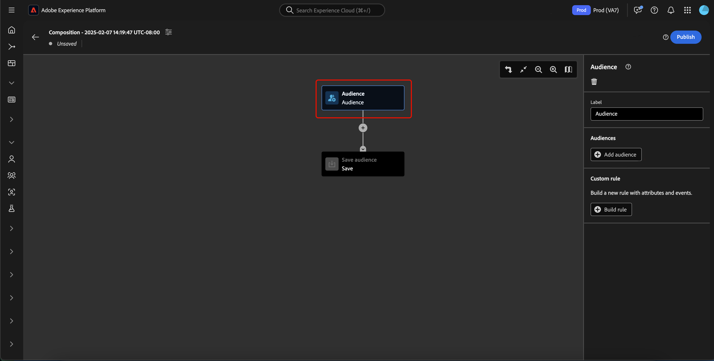
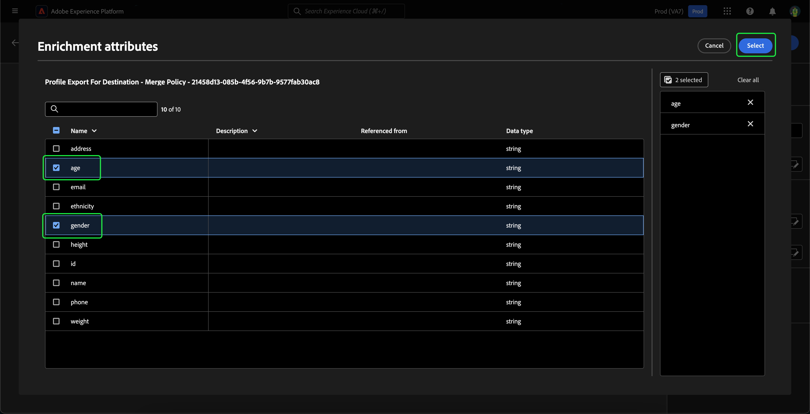

# 대상 구성 UI 안내서

>[!NOTE]
>
>이 안내서에서는 대상 구성을 사용하여 대상을 만드는 방법을 설명합니다. 세그먼트 빌더를 사용하여 세그먼트 정의를 통해 대상자를 만드는 방법에 대해 알아보려면 [세그먼트 빌더 UI 안내서](./segment-builder.md)를 참조하십시오.

대상 컴포지션은 다양한 작업을 나타내는 데 사용되는 블록을 사용하여 대상을 작성하고 편집할 수 있는 작업 영역을 제공합니다.

제목과 설명을 포함하여 컴포지션의 세부 정보를 변경하려면  버튼을 선택합니다.

**[!UICONTROL 컴포지션 속성]** 팝오버가 나타납니다. 여기에 제목과 설명을 포함하여 컴포지션의 세부 정보를 삽입할 수 있습니다.

>[!NOTE]
>
>**not**&#x200B;을(를) 통해 컴포지션에 제목을 지정하면 기본적으로 &quot;컴포지션&quot; 제목 다음에 만든 날짜와 시간이 표시됩니다. 또한 각 컴포지션 **must**&#x200B;에는 고유한 이름이 있습니다.

컴포지션의 세부 정보를 업데이트한 후 **[!UICONTROL 저장]**&#x200B;을 선택하여 업데이트를 확인합니다. 대상자 구성 캔버스가 다시 나타납니다.

대상 구성 캔버스는 **[[!UICONTROL 대상]](#audience-block)**, **[[!UICONTROL 제외]](#exclude-block)**, **[[!UICONTROL 순위]](#rank-block)** 및 **[[!UICONTROL 분할]](#split-block)** 블록의 네 가지 다른 유형으로 구성됩니다.

## [!UICONTROL 대상자] {#audience-block}

**[!UICONTROL 대상]** 블록 형식을 사용하면 더 큰 새 대상을 구성할 하위 대상을 추가할 수 있습니다. 기본적으로 **[!UICONTROL 대상]** 블록은 컴포지션 캔버스의 맨 위에 포함됩니다.

**[!UICONTROL 대상]** 블록을 선택하면 오른쪽 레일에 대상 레이블을 지정하고, 블록에 대상을 추가하고, 대상 블록에 대한 사용자 지정 규칙을 작성하는 컨트롤이 표시됩니다.

>[!NOTE]
>
>대상을 **추가하거나**&#x200B;하여 사용자 지정 규칙을 만들 수 있습니다. 이 두 기능은 **함께 사용할 수 없습니다**.

### [!UICONTROL 대상 추가] {#add-audience}

대상 블록에 대상을 추가하려면 **[!UICONTROL 대상 추가]**&#x200B;를 선택합니다.

>[!IMPORTANT]
>
>기본 병합 정책을 사용하여 정의된 **대상만**&#x200B;개 표시됩니다.
>
>또한 세그먼트 빌더를 사용하여 만든 **게시된** 대상만 사용할 수 있습니다. 대상 구성을 사용하여 만든 대상 및 외부에서 생성된 대상은 **사용할 수 없습니다**.

대상자 목록이 나타납니다. 포함할 대상을 선택한 다음 **[!UICONTROL 추가]**&#x200B;를 선택하여 대상 블록에 추가합니다.

**[!UICONTROL 대상자]** 블록을 선택하면 선택한 대상자가 이제 오른쪽 레일 내에 표시됩니다. 여기에서 결합된 대상자의 병합 유형을 변경할 수 있습니다.

| 병합 유형 | 설명 |
| ---------- | ----------- |
| [!UICONTROL 결합] | 대상은 하나의 대상으로 결합됩니다. 이는 OR 작업과 동일합니다. |
| [!UICONTROL 교차] | 대상은 결합되어 **모두**&#x200B;에서 공유된 대상만 추가됩니다. 이는 AND 작업과 동일합니다. |
| [!UICONTROL 중복 제외] | 대상자가 결합되어 **one에서 공유되는 대상자만**&#x200B;이(가) 모두 추가되지 않습니다. 이것은 XOR 연산과 같은 결과가 될 것이다. |

### [!UICONTROL 규칙 작성] {#build-rule}

대상 블록에 사용자 지정 규칙을 추가하려면 **[!UICONTROL 규칙 빌드]**&#x200B;를 선택하십시오.

세그먼트 빌더 가 나타납니다. 세그먼트 빌더를 사용하여 대상자가 따라야 할 사용자 지정 규칙을 만들 수 있습니다. 세그먼트 빌더 사용에 대한 자세한 내용은 [세그먼트 빌더 안내서](./segment-builder.md)를 참조하세요.

사용자 지정 규칙을 추가한 후 **[!UICONTROL 저장]**&#x200B;을 선택하여 대상자에 규칙을 추가합니다.

## [!UICONTROL 제외] {#exclude-block}

**[!UICONTROL Exclude]** 블록 형식을 사용하면 지정된 하위 대상 또는 특성을 더 큰 새 대상에서 제외할 수 있습니다.

**[!UICONTROL Exclude]** 블록을 추가하려면 **+** 아이콘을 선택한 다음 **[!UICONTROL Exclude]** 아이콘을 선택하십시오.

**[!UICONTROL Exclude]** 블록이 추가되었습니다. 이 블록을 선택하면 제외에 대한 세부 정보가 오른쪽 레일에 표시됩니다. 여기에는 블록의 레이블 및 제외 유형이 포함됩니다. 대상별로 [또는 특성별로 [을(를) 제외할 수 있습니다](#exclude-attribute).](#exclude-audience)

### 대상별로 제외 {#exclude-audience}

대상별로 제외하는 경우 **[!UICONTROL 대상자 추가]**&#x200B;를 선택하여 제외할 대상을 선택할 수 있습니다.

![제외할 대상을 선택할 수 있는 [!UICONTROL 대상 추가] 단추가 선택되어 있습니다.](../images/ui/audience-composition/add-excluded-audience.png)

>[!IMPORTANT]
>
>세그먼트 빌더를 사용하여 만든 **게시된** 대상만 사용할 수 있습니다. 대상 구성을 사용하여 만든 대상 및 외부에서 생성된 대상은 **사용할 수 없습니다**.

대상자 목록이 나타납니다. 제외할 대상을 제외 블록에 추가하려면 **[!UICONTROL 추가]**&#x200B;를 선택하십시오.

### 속성별 제외 {#exclude-attribute}

특성별로 제외하는 경우 **[!UICONTROL 제외 규칙]** 섹션 내에서  아이콘을 선택하여 제외할 특성을 선택할 수 있습니다.

프로필 속성 목록이 나타납니다. 제외할 특성 유형을 선택한 다음 **[!UICONTROL Select]**&#x200B;을(를) 선택하여 제외 블록에 추가합니다.

>[!IMPORTANT]
>
>특성별로 제외할 때는 제외할 **one** 값만 지정할 수 있습니다. 쉼표나 세미콜론과 같은 모든 종류의 구분 기호를 사용하면 해당 정확한 값만 제외됩니다. 예를 들어 값을 `red, blue`(으)로 설정하면 특성에서 용어 `red, blue`이(가) 제외되지만 **not**&#x200B;은(는) 용어 `red` 또는 `blue`이(가) 제외됩니다.

## [!UICONTROL 강화] {#enrich-block}

>[!IMPORTANT]
>
>이 시점에서 데이터 보강 특성은 다운스트림 Adobe Journey Optimizer 시나리오에서 **만**&#x200B;할 수 있습니다.

**[!UICONTROL 강화]** 블록 형식을 사용하면 데이터 집합의 추가 특성으로 대상을 강화할 수 있습니다. 개인화 사용 사례에서 이러한 속성을 사용할 수 있습니다.

**[!UICONTROL 강화]** 블록을 추가하려면 **+** 아이콘을 선택한 다음 **[!UICONTROL 강화]**&#x200B;를 선택하십시오.

![[!UICONTROL 강화] 옵션을 선택했습니다.](../images/ui/audience-composition/add-enrich-block.png)

**[!UICONTROL 강화]** 블록이 추가되었습니다. 이 블록을 선택하면 데이터 보강에 대한 세부 정보가 오른쪽 레일에 표시됩니다. 여기에는 블록의 레이블 및 데이터 보강 세트가 포함됩니다.

대상자를 보강할 데이터 집합을 선택하려면  아이콘을 선택하십시오.

![필터 단추가 강조 표시되어 있습니다. 이 옵션을 선택하면 [!UICONTROL 데이터 세트 선택] 팝오버가 표시됩니다.](../images/ui/audience-composition/enrich-select-dataset.png)

**[!UICONTROL 데이터 집합 선택]** 팝오버가 나타납니다. 데이터 강화를 위해 추가할 데이터 세트를 선택한 다음 데이터 강화를 위해 데이터 세트를 추가하려면 **[!UICONTROL 선택]**&#x200B;합니다.

>[!IMPORTANT]
>
>선택한 데이터 집합 **must**&#x200B;은(는) 다음 기준을 충족합니다.
>
>- 데이터 집합 **must**&#x200B;은(는) 레코드 형식입니다.
>   - 데이터 집합 **은(는) 이벤트 유형이거나 시스템 생성이거나 프로필로 표시할 수 없습니다**.
>- 데이터 집합 **must**&#x200B;은(는) 1GB 이하여야 합니다.

이제 **[!UICONTROL 데이터 보강 기준]** 섹션이 오른쪽 레일에 나타납니다. 이 섹션에서는 **[!UICONTROL Source 조인 키]** 및 **[!UICONTROL 데이터 보강 데이터 세트 조인 키]**&#x200B;를 선택하여 데이터 보강 데이터 세트를 만들려는 대상자와 연결할 수 있습니다.

![데이터 보강 기준] 영역이 강조 표시되어 있습니다.](../images/ui/audience-composition/enrichment-criteria.png)[!UICONTROL 

**[!UICONTROL Source 가입 키]**&#x200B;를 선택하려면  아이콘을 선택하십시오.

![[!UICONTROL Source 조인 키]에 대한 필터 아이콘이 강조 표시되어 있습니다.](../images/ui/audience-composition/enrich-select-source-join-key.png)

**[!UICONTROL 프로필 특성 선택]** 팝오버가 나타납니다. 소스 조인 키로 사용할 프로필 특성을 선택한 다음 **[!UICONTROL Select]**&#x200B;을(를) 선택하여 해당 특성을 소스 조인 키로 선택합니다.

**[!UICONTROL 데이터 보강 데이터 집합 조인 키]**&#x200B;를 선택하려면  아이콘을 선택하십시오.

![데이터 보강 데이터 집합 조인 키]에 대한 필터 아이콘이 강조 표시되어 있습니다.](../images/ui/audience-composition/enrich-select-enrichment-dataset-join-key.png)[!UICONTROL 

**[!UICONTROL 데이터 보강 특성]** 팝오버가 나타납니다. 데이터 보강 데이터 세트 조인 키로 사용할 특성을 선택한 다음 **[!UICONTROL Select]**&#x200B;을(를) 선택하여 데이터 보강 데이터 세트 조인 키로 해당 특성을 선택합니다.

조인 키를 모두 추가했으므로 **[!UICONTROL 데이터 보강 특성]** 섹션이 나타납니다. 이제 대상자를 향상시킬 특성을 추가할 수 있습니다. 이러한 특성을 추가하려면 **[!UICONTROL 특성 추가]**&#x200B;를 선택하십시오.

![특성 추가] 단추가 강조 표시되어 있습니다.](../images/ui/audience-composition/enrich-select-add-attribute.png)[!UICONTROL 

**[!UICONTROL 데이터 보강 특성]** 팝오버가 나타납니다. 데이터 집합에서 특성을 선택하여 대상자를 강화한 다음 **[!UICONTROL 선택]**&#x200B;하여 대상자에 특성을 추가할 수 있습니다.

<!-- ## [!UICONTROL Join] {#join-block}

The **[!UICONTROL Join]** block type allows you to add in external audiences from datasets that have not yet been processed by Adobe Experience Platform.

To add a **[!UICONTROL Join]** block, select the **+** icon, followed by **[!UICONTROL Join]**.

When you select the block, details about the join are shown in the right rail, including the block's label and the option to add audiences to the enrichment dataset.

After selecting **[!UICONTROL Add Audience]**, a list of audiences appears. Select the audiences you want to include, followed by **[!UICONTROL Add]** to add them to your join block.

Your selected audiences now appear within the right rail when the **[!UICONTROL Join]** block is selected. 

 -->

## [!UICONTROL 순위] {#rank-block}

**[!UICONTROL Rank]** 블록 형식을 사용하면 지정된 특성을 기준으로 프로필의 등급을 매기고 정렬하고 이러한 등급 프로필을 컴포지션에 포함할 수 있습니다.

**[!UICONTROL Rank]** 블록을 추가하려면 **+** 아이콘을 선택한 다음 **[!UICONTROL Rank]**&#x200B;을(를) 선택하십시오.

블록을 선택하면 블록의 레이블, 순위를 지정할 속성, 순위 순서 및 순위를 지정할 프로필 수를 제한하기 위한 토글을 포함하여 순위에 대한 세부 정보가 오른쪽 레일에 표시됩니다.

대상의 등급을 지정할 특성을 선택하려면  아이콘을 선택하십시오.

프로필 속성 목록이 나타납니다. 이 팝오버에서는 대상 순위를 지정할 속성 유형을 선택할 수 있습니다. **[!UICONTROL 선택]**&#x200B;을(를) 선택하여 등급 블록에 추가하십시오. 선택한 특성은 **만**&#x200B;일 수 있습니다.

속성을 선택한 후 등급 지정 순서를 선택할 수 있습니다. 오름차순(가장 낮은 순에서 가장 높은 순까지) 또는 내림차순(가장 높은 순에서 가장 낮은 순까지)입니다.

또한 **[!UICONTROL 프로필 제한 추가]** 전환을 활성화하여 반환되는 프로필 수를 제한할 수 있습니다. 이 토글이 활성화되면 **[!UICONTROL 포함된 프로필]** 필드 내에서 반환되는 최대 프로필 수를 설정할 수 있습니다.

## [!UICONTROL 분할] {#split-block}

**[!UICONTROL 분할]** 블록 형식을 사용하면 새 대상을 다양한 하위 대상으로 분할할 수 있습니다. 백분율이나 속성에 따라 이 대상을 분할할 수 있습니다. 대상을 하위 대상으로 분할할 때 이 분할은 **지속되지 않습니다**. 즉, 프로필이 각 평가에서 다른 하위 대상자에 속할 수 있습니다.

**[!UICONTROL 분할]** 블록을 추가하려면 **+** 아이콘을 선택한 다음 **[!UICONTROL 분할]**&#x200B;을 선택하십시오.

대상을 분할할 때 백분율로 분할하거나 속성별로 분할할 수 있습니다.

### 백분율로 분할 {#split-percentage}

백분율로 분할할 경우 대상은 제공된 경로 수와 백분율에 따라 무작위로 분할됩니다.

예를 들어 각각 프로필의 비율이 다른 세 개의 경로가 있을 수 있습니다.

### 속성으로 분할 {#split-attribute}

속성별로 분할하면 제공된 속성을 기준으로 대상자가 분할됩니다. 분할할 특성을 선택하려면 **[!UICONTROL 분할]** 블록을 선택한 다음  아이콘을 선택합니다.

프로필 속성 목록이 나타납니다. 특성 유형을 선택한 다음 **[!UICONTROL Select]**&#x200B;을(를) 선택하여 분할 블록에 추가합니다.

특성을 선택한 후 **[!UICONTROL 값]** 필드 내에 값을 추가하여 어떤 프로필이 어떤 하위 대상에 속할지 선택할 수 있습니다.

또한 **[!UICONTROL 기타 프로필]** 전환을 활성화하여 선택되지 않은 모든 프로필로 구성된 하위 대상을 만들 수 있습니다.

## 대상자 게시

>[!IMPORTANT]
>
>대상 구성을 게시할 때 Real-Time CDP 대상 또는 Adobe Journey Optimizer 채널과 같은 다운스트림 서비스에서 사용하기 위해 대상 구성을 평가하고 활성화하는 데 최대 48시간이 걸릴 수 있습니다.

컴포지션을 만든 후 **[!UICONTROL Publish]**&#x200B;을(를) 선택하여 저장하고 게시할 수 있습니다.

대상자를 만드는 동안 오류가 발생하면 문제를 해결하는 방법을 알려주는 경고가 표시됩니다.

## 다음 단계

대상 컴포지션은 다양한 블록 유형에서 컴포지션을 만들 수 있는 풍부한 워크플로를 제공합니다. 세분화 서비스 UI의 다른 부분에 대한 자세한 내용은 [세분화 서비스 사용 안내서](./overview.md)를 참조하세요.
