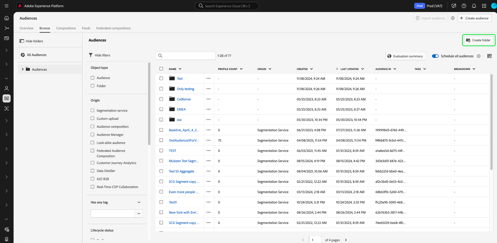
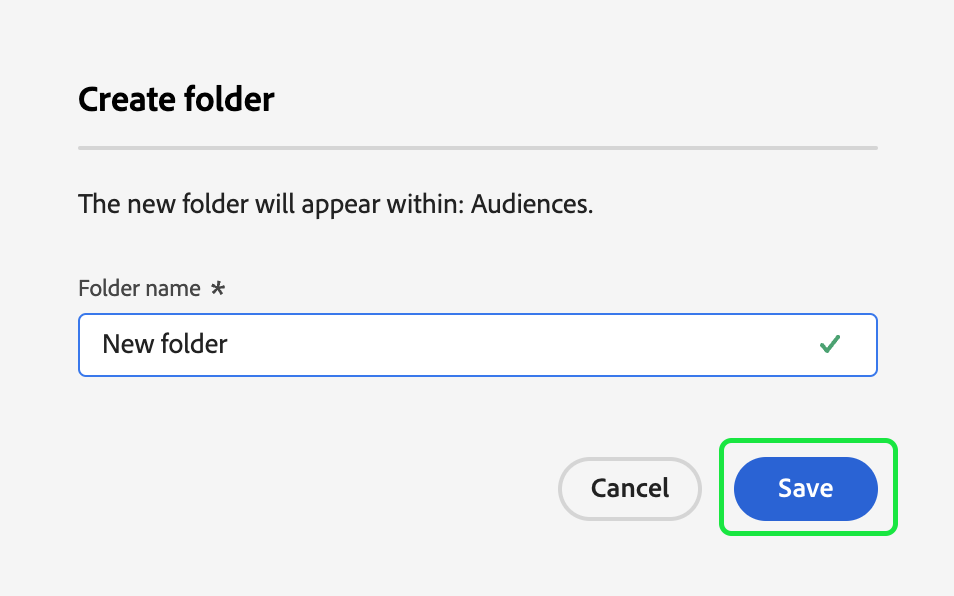
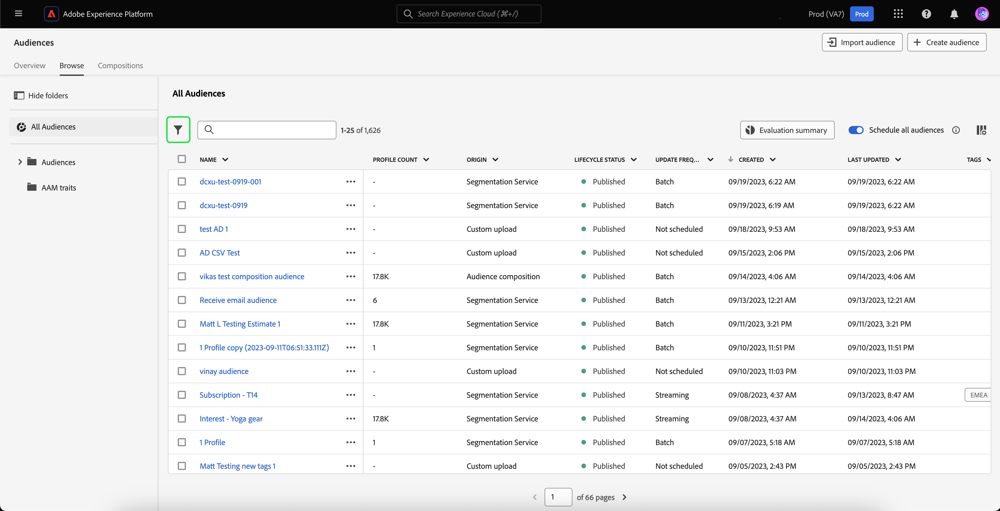
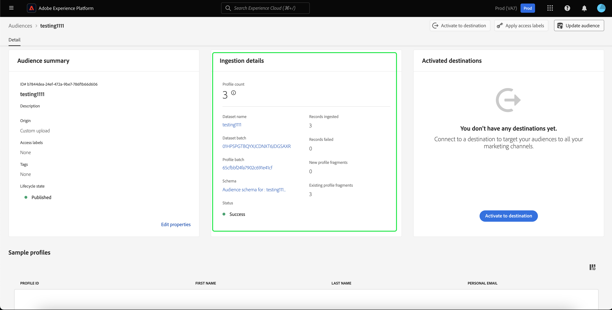

# Audience Portal 개요

Audience Portal 은 대상을 보고, 관리하고, 만들 수 있는 Adobe Experience Platform 내의 중앙 허브입니다.

Audience Portal에서 다음 작업을 수행할 수 있습니다.

>[!BEGINSHADEBOX]

- [대상자 목록 보기](#list)
   - [대상자에 대한 빠른 작업 사용](#quick-actions)
   - [대상자 목록에 표시되는 속성 사용자 지정](#customize)
   - [필터, 폴더 및 태그를 사용하여 대상자 구성](#manage-audiences)
- [대상자에 대한 세부 정보 보기](#audience-details)
   - [대상자에 대한 요약 보기](#audience-summary)
- [예약된 세분화에 대해 대상자 활성화](#scheduled-segmentation)
- [대상자 만들기](#create-audience)
   - [세그먼트 빌더를 사용하여 대상자 만들기](#segment-builder)
   - [대상 구성을 사용하여 대상 만들기](#audience-composition)
   - [기존 Data Warehouse의 데이터를 사용하여 대상을 만들려면 Federated Audience Composition을 사용하십시오](#fac)
   - [Data Distiller을 사용하여 대상자 만들기](#data-distiller)
- [외부에서 생성된 대상자 가져오기](#import-audience)

>[!ENDSHADEBOX]

대상자 포털을 열려면 세분화 섹션 내에서 **[!UICONTROL 찾아보기]** 탭을 선택합니다.

## 대상자 목록 {#list}

>[!CONTEXTUALHELP]
>id="platform_segments_browse_churncolumnname"
>title="이탈"
>abstract="이탈은 세그먼트 작업이 마지막으로 실행된 시간과 비교하여 대상자에서 변경되는 프로필의 백분율을 나타냅니다."

>[!CONTEXTUALHELP]
>id="platform_segments_browse_evaluationmethodcolumnname"
>title="평가 방법"
>abstract="대상자 평가 방법에는 배치, 스트리밍과 에지가 포함됩니다."

기본적으로 Audience Portal 에는 프로필 수, 원본, 만든 날짜, 마지막으로 수정한 날짜, 태그 및 분류를 포함하여 조직 및 샌드박스에 있는 모든 대상의 목록이 표시됩니다.

### 빠른 작업 {#quick-actions}

각 대상 옆에 줄임표 아이콘이 있습니다. 이 옵션을 선택하면 대상자에 대해 사용 가능한 빠른 작업 목록이 표시됩니다. 이 작업 목록은 대상자의 출처에 따라 다릅니다.

![빠른 작업 목록이 [!UICONTROL 대상 구성]의 원본을 가진 대상에 대해 표시됩니다.](../images/ui/audience-portal/browse-audience-composition-details.png)

| 작업 | 원본 | 설명 |
| ------ | ------- | ----------- |
| [!UICONTROL 편집] | Segmentation Service | 세그먼트 빌더를 열어 대상자를 편집합니다. 대상이 API를 통해 만들어진 경우 세그먼트 빌더를 사용하여 편집할 수 **없음**&#x200B;이 됩니다. 세그먼트 빌더 사용에 대한 자세한 내용은 [세그먼트 빌더 UI 안내서](./segment-builder.md)를 참조하십시오. |
| [!UICONTROL 컴포지션 열기] | 대상자 컴포지션 | 대상을 볼 수 있는 대상 구성을 엽니다. 대상 구성에 대한 자세한 내용은 [대상 구성 UI 안내서](./audience-composition.md)를 참조하십시오. |
| [!UICONTROL 대상에 활성화] | Segmentation Service | 대상을 대상으로 활성화합니다. 대상을 대상으로 활성화하는 방법에 대한 자세한 내용은 [활성화 개요](../../destinations/ui/activation-overview.md)를 참조하십시오. |
| [!UICONTROL 파트너와 공유] | 대상자 구성, 사용자 지정 업로드, 세분화 서비스 | 다른 Experience Platform 사용자와 대상을 공유합니다. 이 기능에 대한 자세한 내용은 [세그먼트 일치 개요](./segment-match/overview.md)를 참조하십시오. |
| [!UICONTROL 태그 관리] | 대상자 구성, 사용자 지정 업로드, 세분화 서비스 | 대상에 속하는 사용자 정의 태그를 관리합니다. 이 기능에 대한 자세한 내용은 [필터링 및 태깅](#manage-audiences)의 섹션을 참조하십시오. |
| [!UICONTROL 폴더로 이동] | 대상자 구성, 사용자 지정 업로드, 세분화 서비스 | 대상자가 속한 폴더를 관리합니다. 이 기능에 대한 자세한 내용은 [필터링 및 태깅](#manage-audiences)의 섹션을 참조하십시오. |
| [!UICONTROL 복사] | Segmentation Service | 선택한 대상자를 복제합니다. 이 함수에 대한 자세한 내용은 [세그먼테이션 FAQ](../faq.md#copy)에서 확인할 수 있습니다. |
| [!UICONTROL 액세스 레이블 적용] | 대상자 구성, 사용자 지정 업로드, 세분화 서비스 | 대상에 속하는 액세스 레이블을 관리합니다. 액세스 레이블에 대한 자세한 내용은 [레이블 관리](../../access-control/abac/ui/labels.md)에 대한 설명서를 참조하십시오. |
| [!UICONTROL 게시] | 사용자 정의 업로드, 세분화 서비스 | 선택한 대상자를 게시합니다. 라이프사이클 상태 관리에 대한 자세한 내용은 세분화 FAQ[의 ](../faq.md#lifecycle-states)라이프사이클 상태 섹션을 참조하십시오. |
| [!UICONTROL 비활성화] | 사용자 정의 업로드, 세분화 서비스 | 선택한 대상자를 비활성화합니다. 대상을 비활성화하려면 **은(는)** any **대상(Experience Platform이 아닌 대상 포함)에서 활성화하거나** any **다른 대상에 속할 수**&#x200B;없습니다. 라이프사이클 상태 관리에 대한 자세한 내용은 세분화 FAQ[의 ](../faq.md#lifecycle-states)라이프사이클 상태 섹션을 참조하십시오. |
| [!UICONTROL 삭제] | 대상자 구성, 사용자 지정 업로드, 세분화 서비스 | 선택한 대상자를 삭제합니다. 다운스트림 대상에 사용되거나 다른 대상에 종속된 대상은 **삭제할 수 없습니다**. 대상자 삭제에 대한 자세한 내용은 [세그먼테이션 FAQ](../faq.md#lifecycle-states)를 참조하십시오. |
| [!UICONTROL 패키지에 추가] | 대상자 구성, 사용자 지정 업로드, 세분화 서비스 | 샌드박스 간에 대상자를 이동합니다. 이 기능에 대한 자세한 내용은 [샌드박스 도구 가이드](../../sandboxes/ui/sandbox-tooling.md)를 참조하십시오. |

>[!IMPORTANT]
>
>대상을 삭제하기 전에 대상이 계정 기반 대상의 구성 요소로 사용되거나 Adobe Journey Optimizer에서 사용되고 있지 않은지 **확인**&#x200B;하십시오.

페이지 맨 위에는 일정에 모든 대상을 추가하고, 대상을 가져오고, 새 대상을 만들고, 대상 평가의 요약을 볼 수 있는 옵션이 있습니다.

**[!UICONTROL 모든 대상 예약]**&#x200B;을 전환하면 예약된 세그먼테이션이 활성화됩니다. 예약된 세그먼테이션에 대한 자세한 내용은 이 사용 안내서 [의 ](#scheduled-segmentation)예약된 세그먼테이션 섹션에 있습니다.

**[!UICONTROL 대상 가져오기]**&#x200B;를 선택하면 외부에서 생성된 대상을 가져올 수 있습니다. 대상자 가져오기에 대한 자세한 내용은 [사용 안내서에서 대상자 가져오기](#import-audience)에 대한 섹션을 참조하십시오.

**[!UICONTROL 대상 만들기]**&#x200B;를 선택하면 대상을 만들 수 있습니다. 대상자 만들기에 대한 자세한 내용은 [사용 안내서에서 대상자 만들기](#create-audience)의 섹션을 참조하십시오.

**[!UICONTROL 평가 요약]**&#x200B;을 선택하여 대상 평가 요약을 보여주는 원형 차트를 표시할 수 있습니다.

파이 차트가 나타나며 대상 평가별 대상 분류가 표시됩니다. 차트에는 중간에 있는 총 대상 수가 표시되고, 하단에 일일 배치 평가 시간(UTC)이 표시됩니다. 대상의 여러 부분을 마우스로 가리키면 각 업데이트 빈도 유형에 속하는 대상의 수가 표시됩니다.

### 사용자 지정 {#customize}

을 선택하여 Audience Portal에 필드를 추가할 수 있습니다. 이러한 추가 필드에는 라이프사이클 상태, 업데이트 주기, 마지막 업데이트자, 설명, 작성자 및 액세스 레이블이 포함됩니다.

| 필드 | 설명 |
| ----- | ----------- |
| [!UICONTROL 이름] | 대상자의 이름입니다. |
| [!UICONTROL 프로필 개수] | 대상자에 적합한 총 프로필 수입니다. |
| [!UICONTROL Origin] | 대상의 기원입니다. 이는 대상자가 어디에서 오는지 설명합니다. 가능한 값에는 [세그먼테이션 서비스](#segment-builder), [사용자 지정 업로드](#import-audience), [대상 구성](#audience-composition), [Audience Manager](https://experienceleague.adobe.com/ko/docs/audience-manager/user-guide/aam-home), [유사 대상](../types/lookalike-audiences.md), [페더레이션 대상 구성](#fac), [Customer Journey Analytics](https://experienceleague.adobe.com/ko/docs/analytics-platform/using/cja-overview/cja-overview), [데이터 Distiller](#data-distiller), [AJO B2B](https://experienceleague.adobe.com/ko/docs/journey-optimizer-b2b/user/guide-overview) 및 [Real-Time CDP Collaboration](https://experienceleague.adobe.com/ko/docs/real-time-cdp-collaboration/using/destinations/experience-platform#audience-portal)이 포함됩니다. |
| [!UICONTROL 라이프사이클 상태] | 대상의 상태입니다. 이 필드에 사용할 수 있는 값은 `Draft`, `Inactive` 및 `Published`입니다. 다른 상태의 의미와 대상을 다른 라이프사이클 상태로 이동하는 방법 등 라이프사이클 상태에 대한 자세한 내용은 세분화 FAQ[의 ](../faq.md#lifecycle-status)라이프사이클 상태 섹션을 참조하십시오. |
| [!UICONTROL 업데이트 주기] | 대상자의 데이터가 업데이트되는 빈도를 나타내는 값입니다. 이 필드에 사용할 수 있는 값에는 [!UICONTROL 일괄 처리], [!UICONTROL 스트리밍], [!UICONTROL Edge] 및 [!UICONTROL 예약되지 않음]이 포함됩니다. |
| [!UICONTROL 마지막으로 업데이트한 사람] | 대상자를 마지막으로 업데이트한 사람의 이름입니다. |
| [!UICONTROL 생성일] | 대상이 생성된 날짜와 시간(UTC). |
| [!UICONTROL 마지막으로 업데이트됨] | 대상이 마지막으로 업데이트된 날짜와 시간(UTC). |
| [!UICONTROL 태그] | 대상에 속하는 사용자 정의 태그입니다. 이러한 태그에 대한 자세한 내용은 태그의 [섹션](#tags)에서 확인할 수 있습니다. |
| [!UICONTROL 설명] | 대상자에 대한 설명입니다. |
| [!UICONTROL 만든 사람] | 대상을 만든 사람의 이름입니다. |
| [!UICONTROL 액세스 레이블] | 대상의 액세스 레이블입니다. 액세스 레이블을 사용하면 해당 데이터에 적용되는 사용 정책에 따라 데이터 세트와 필드를 분류할 수 있습니다. 이러한 레이블은 언제든지 적용할 수 있으므로 데이터를 제어하는 방법을 유연하게 선택할 수 있습니다. 액세스 레이블에 대한 자세한 내용은 [레이블 관리](../../access-control/abac/ui/labels.md)에 대한 설명서를 참조하십시오. |
| [!UICONTROL 분류] | 대상자에 대한 프로필 상태 분류입니다. 이 프로필 상태 분류에 대한 자세한 설명은 아래에서 확인할 수 있습니다. |

분류를 선택하면 [!UICONTROL 실현됨], [!UICONTROL 기존] 및 [!UICONTROL 종료] 중 각 계산된 프로필 상태에 속하는 프로필의 비율을 요약한 막대 그래프가 표시됩니다. 또한 [!UICONTROL 찾아보기] 탭에 표시되는 분류는 세그먼트 정의 상태를 가장 정확하게 분류한 것입니다. 이 숫자가 [!UICONTROL 개요] 탭에 명시된 것과 다를 경우 [!UICONTROL 개요] 탭 번호는 하루에 한 번만 업데이트되므로 [!UICONTROL 찾아보기] 탭의 숫자를 올바른 정보 소스로 사용해야 합니다.

| 상태 | 설명 |
| ------ | ----------- |
| [!UICONTROL 실현됨] | 마지막 일괄 처리 세그먼트 작업이 실행된 이후 지난 24시간 동안 대상에 대해 **적격**&#x200B;된 프로필 수입니다. |
| [!UICONTROL 기존] | 마지막 일괄 처리 세그먼트 작업이 실행된 이후 지난 24시간 동안 대상자에 **남아**&#x200B;된 프로필의 수입니다. 이 필드는 **calculated**&#x200B;이며 [`segmentMembership` 개체에 표시되지 않습니다](../../xdm/field-groups/profile/segmentation.md). |
| [!UICONTROL 종료] | 마지막 일괄 처리 세그먼트 작업이 실행된 이후 지난 24시간 동안 대상자를 **종료**&#x200B;한 프로필 수입니다. |

표시할 필드를 선택한 후 표시된 열의 너비를 다시 조정할 수도 있습니다. 열 사이의 영역을 드래그하거나 크기를 조정할 열의 을 선택한 다음 **[!UICONTROL 열 크기 조정]**&#x200B;을 선택하여 이 작업을 수행할 수 있습니다.

### 필터링, 폴더 및 태깅 {#manage-audiences}

작업 효율성을 개선하기 위해 기존 대상자를 검색하고, 대상자에 사용자 정의 태그를 추가하고, 대상자를 폴더에 넣고, 표시된 대상자를 필터링할 수 있습니다.

#### 검색 {#search}

[!DNL Unified Search]을(를) 사용하여 최대 9개의 다른 언어로 기존 대상자를 검색할 수 있습니다.

[!DNL Unified Search]을(를) 사용하려면 강조 표시된 검색 창에서 검색할 용어를 추가하십시오.

지원되는 기능을 포함하여 [!DNL Unified Search]에 대한 자세한 내용은 [통합 검색 설명서](https://experienceleague.adobe.com/docs/core-services/interface/services/search-experience-cloud.html?lang=ko)를 참조하십시오.

#### 태그 {#tags}

사용자 정의 태그를 추가하여 대상을 더 잘 설명하고, 찾고, 관리할 수 있습니다.

태그를 추가하려면 태그를 지정할 대상에서 **[!UICONTROL 태그 관리]**&#x200B;를 선택하십시오.

![지정된 대상에 대해 [!UICONTROL 태그 관리] 단추를 선택했습니다.](../images/ui/audience-portal/browse-manage-tags.png)

**[!UICONTROL 태그 관리]** 팝오버가 나타납니다. 이 팝오버에서는 분류된 태그 또는 분류되지 않은 태그를 선택할 수 있습니다.

| 태그 유형 | 설명 |
| -------- | ----------- |
| 분류됨 | 조직의 관리자가 만들고 관리하는 태그입니다. |
| 미분류 | [!UICONTROL 태그 관리] 팝오버 내에 만들어진 태그입니다. 누구나 이러한 유형의 태그를 만들거나 관리할 수 있습니다. |

![태그 관리[!UICONTROL &#x200B; 팝오버가 표시됩니다. &#x200B;] 범주화되거나 분류되지 않은 항목을 선택하는 옵션이 강조 표시됩니다.](../images/ui/audience-portal/create-tag.png)

대상자에 첨부할 태그를 모두 추가한 후 **[!UICONTROL 저장]**&#x200B;을 선택합니다.

![[!UICONTROL 태그 관리] 팝오버에서 추가된 태그가 강조 표시됩니다.](../images/ui/audience-portal/created-tags.png)

태그 만들기 및 관리에 대한 자세한 내용은 [태그 관리 가이드](../../administrative-tags/ui/managing-tags.md)를 참조하십시오.

#### 폴더 {#folders}

더 나은 대상자 관리를 위해 폴더 내에 대상자를 배치할 수 있습니다.

대상을 저장할 폴더를 만들려면 **[!UICONTROL 폴더 만들기]**&#x200B;를 선택하세요.

>[!NOTE]
>
>다른 폴더에 있는 경우에만 폴더를 만들 수 있습니다. 왼쪽 탐색 모음에서 **모든 대상**&#x200B;을 선택한 경우 **[!UICONTROL 폴더를 만들 수 없음]**&#x200B;을 의미합니다.

새로 만든 폴더의 이름을 지정할 수 있는 팝오버가 표시됩니다. 폴더 이름을 지정한 후 **[!UICONTROL 저장]**&#x200B;을 선택하여 폴더 만들기를 완료합니다. **must** 이름은 상위 폴더에 대해 고유해야 합니다.

대상을 폴더로 이동하려면 이동할 대상의 **[!UICONTROL 폴더로 이동]**&#x200B;을 선택합니다.

![특정 대상에 대해 [!UICONTROL 폴더로 이동] 단추가 선택되어 있습니다.](../images/ui/audience-portal/browse-move-to-folder.png)

**대상자를 폴더로 이동** 팝오버가 나타납니다. 대상자를 이동할 폴더를 선택한 다음 **[!UICONTROL 저장]**&#x200B;을 선택합니다.

대상이 폴더에 있으면 특정 폴더에 속한 대상만 표시하도록 선택할 수 있습니다.

#### 필터 {#filter}

다양한 설정에 따라 대상자를 필터링할 수도 있습니다.

사용 가능한 대상을 필터링하려면 을 선택하세요.

사용 가능한 필터 목록이 표시됩니다.

| 필터 | 설명 |
| ------ | ----------- |
| [!UICONTROL Origin] | 대상자의 출처를 기준으로 필터링할 수 있습니다. 가능한 값에는 [세그먼테이션 서비스](#segment-builder), [사용자 지정 업로드](#import-audience), [대상 구성](#audience-composition), [Audience Manager](https://experienceleague.adobe.com/ko/docs/audience-manager/user-guide/aam-home), [유사 대상](../types/lookalike-audiences.md), [페더레이션 대상 구성](#fac), [Customer Journey Analytics](https://experienceleague.adobe.com/ko/docs/analytics-platform/using/cja-overview/cja-overview), [데이터 Distiller](#data-distiller), [AJO B2B](https://experienceleague.adobe.com/ko/docs/journey-optimizer-b2b/user/guide-overview) 및 [Real-Time CDP Collaboration](https://experienceleague.adobe.com/ko/docs/real-time-cdp-collaboration/using/destinations/experience-platform#audience-portal)이 포함됩니다. |
| [!UICONTROL 임의 태그 있음] | 태그로 필터링할 수 있습니다. **[!UICONTROL 임의 태그 있음]**&#x200B;과 **[!UICONTROL 모든 태그 있음]** 중에서 선택할 수 있습니다. **[!UICONTROL 임의 태그 있음]**&#x200B;을 선택하면 필터링된 대상자에는 추가한 태그 중 **임의**&#x200B;이 포함됩니다. **[!UICONTROL 모든 태그 있음]**&#x200B;을 선택한 경우 필터링된 대상자에는 추가한 태그 중 **모두**&#x200B;을(를) 포함해야 합니다. |
| [!UICONTROL 라이프사이클 상태] | 대상자의 라이프사이클 상태에 따라 필터링할 수 있습니다. 사용 가능한 옵션에는 [!UICONTROL 삭제됨], [!UICONTROL 초안], [!UICONTROL 비활성] 및 [!UICONTROL 게시됨]이 있습니다. |
| [!UICONTROL 업데이트 주기] | 대상자의 업데이트 빈도(평가 방법)를 기준으로 필터링할 수 있습니다. 사용 가능한 옵션에는 [!UICONTROL 일괄 처리], [!UICONTROL 스트리밍] 및 [!UICONTROL Edge]이 있습니다. |
| [!UICONTROL 만든 사람] | 대상자를 만든 사람을 기준으로 필터링할 수 있습니다. |
| [!UICONTROL 만든 날짜] | 대상자의 생성 날짜를 기준으로 필터링할 수 있습니다. 대상자가 만들어졌을 때 필터링할 날짜 범위를 선택할 수 있습니다. |
| [!UICONTROL 수정한 날짜] | 대상자의 마지막 수정 날짜를 기준으로 필터링할 수 있습니다. 대상자를 마지막으로 수정한 시기를 필터링할 날짜 범위를 선택할 수 있습니다. |

### 일괄 액션 {#bulk-actions}

또한 최대 25개의 서로 다른 대상을 선택하고 이러한 대상에 대해 다양한 작업을 수행할 수 있습니다. 이러한 작업에는 [폴더로 이동](#folders), [태그 편집 또는 적용](#tags), [대상 평가](#flexible-audience-evaluation), [액세스 레이블 적용](../../access-control/abac/ui/labels.md) 및 [삭제](#browse)가 포함됩니다.

일괄 작업을 대상에 적용할 때 다음 조건이 적용됩니다.

- 다른 페이지에서 대상을 **선택할 수**&#x200B;있습니다.
- 대상 활성화에서 사용 중인 대상을 **삭제할 수 없습니다**.
- 필터를 선택하면 선택한 대상이 **원래대로**&#x200B;됩니다.

#### 유연한 대상 평가 {#flexible-audience-evaluation}

유연한 대상 평가를 통해 필요에 따라 세분화 작업을 실행할 수 있습니다. 유연한 대상 평가에 대한 자세한 내용은 [유연한 대상 평가 안내서](../methods/flexible-audience-evaluation.md)를 참조하세요.

## 대상자 세부 정보 {#audience-details}

특정 대상자에 대한 자세한 내용을 보려면 **[!UICONTROL 찾아보기]** 탭에서 대상자의 이름을 선택하십시오.

대상자 세부 사항 페이지가 나타납니다. 맨 위에는 대상자의 요약, 적격 대상자 크기에 대한 정보 및 세그먼트가 활성화되는 대상이 있습니다.

### 대상자 요약 {#audience-summary}

**[!UICONTROL 대상 요약]** 섹션은 ID, 이름, 설명, 원본 및 특성 세부 정보 등의 정보를 제공합니다.

또한 대상을 대상에 활성화하거나, 액세스 레이블을 적용하거나, 대상을 편집/업데이트할 수 있는 옵션이 제공됩니다.

**[!UICONTROL 대상에 활성화]**&#x200B;를 선택하면 대상을 대상에 활성화할 수 있습니다. 대상을 대상으로 활성화하는 방법에 대한 자세한 내용은 [활성화 개요](../../destinations/ui/activation-overview.md)를 참조하십시오.

**[!UICONTROL 액세스 레이블 적용]**&#x200B;을 선택하면 대상에 속하는 액세스 레이블을 관리할 수 있습니다. 액세스 레이블에 대한 자세한 내용은 [레이블 관리](../../access-control/abac/ui/labels.md)에 대한 설명서를 참조하십시오.

>[!BEGINTABS]

>[!TAB 대상자 컴포지션]

![대상자 세부 정보 페이지가 표시되고 [!UICONTROL 컴포지션 열기] 단추가 강조 표시됩니다.](../images/ui/audience-portal/audience-details-open-composition.png)

**[!UICONTROL 컴포지션 열기]**&#x200B;를 선택하면 대상 컴포지션에서 대상을 볼 수 있습니다. 대상 구성에 대한 자세한 내용은 [대상 구성 UI 안내서](./audience-composition.md)를 참조하십시오.

>[!TAB 사용자 지정 업로드]

![대상자 세부 정보 페이지가 표시되고 [!UICONTROL 대상자 업데이트] 버튼이 강조 표시됩니다.](../images/ui/audience-portal/audience-details-update-audience.png)

**[!UICONTROL 대상자 업데이트]**&#x200B;를 선택하면 외부에서 생성된 대상자를 다시 업로드할 수 있습니다. 외부에서 생성된 대상자를 가져오는 방법에 대한 자세한 내용은 [대상자 가져오기](#import-audience) 섹션을 참조하십시오.

>[!TAB 세분화 서비스]

![대상자 세부 정보 페이지가 표시되고 [!UICONTROL 대상자 편집] 단추가 강조 표시됩니다.](../images/ui/audience-portal/audience-details-edit-audience.png)

**[!UICONTROL 대상 편집]**&#x200B;을 선택하면 세그먼트 빌더에서 대상을 편집할 수 있습니다. [!DNL Segment Builder] 작업 영역 사용에 대한 자세한 내용은 [[!DNL Segment Builder] 사용 안내서](./segment-builder.md)를 참조하십시오.

>[!ENDTABS]

**[!UICONTROL 속성 편집]**&#x200B;을 선택하면 이름, 설명 및 태그와 같은 대상자의 기본 세부 정보를 편집할 수 있습니다.

### 대상자 합계 {#audience-total}

Experience Platform 생성 대상 및 컴포지션의 경우 **[!UICONTROL 대상 총]** 섹션에 해당 대상에 적합한 총 프로필 수가 표시됩니다.

>[!NOTE]
>
>내보내기 작업이 완료된 후 대상 총 개수를 업데이트하는 데 최대 30분이 걸릴 수 있습니다.

예상 값은 해당 날짜의 샘플 데이터의 샘플 크기를 사용하여 생성됩니다. 프로필 스토어에 엔티티가 100만 개 미만인 경우 전체 데이터 세트가 사용됩니다. 엔티티가 1~2천만 개인 경우 100만 엔티티가 사용되며, 엔티티가 2,000만 개를 초과하는 경우 전체 엔티티의 5%가 사용됩니다. 예상 값 생성에 대한 자세한 내용은 대상 만들기 자습서의 [예상 값 생성 섹션](../tutorials/create-a-segment.md#estimate-and-preview-an-audience)에서 확인할 수 있습니다.

### 수집 세부 정보 {#ingestion-details}

원본이 **[!UICONTROL 사용자 지정 업로드]**&#x200B;인 대상의 경우 **[!UICONTROL 수집 세부 정보]** 섹션에는 프로필 총계와 외부에서 생성된 대상자가 수집된 데이터 세트에 대한 세부 정보가 모두 표시됩니다.

>[!NOTE]
>
>대상자의 프로필 카운트가 완전히 업데이트되려면 내보내기 작업 후 최대 30분이 걸릴 수 있습니다.

| 속성 | 설명 |
| -------- | ----------- |
| 프로필 개수 | 대상자에 적합한 총 프로필 수입니다. |
| 데이터 세트 이름 | 대상자가 수집된 데이터 세트의 이름입니다. 데이터 세트에 대한 자세한 내용을 보려면 데이터 세트 이름을 선택할 수 있습니다. 데이터 세트에 대한 자세한 내용은 [데이터 세트 UI 안내서](../../catalog/datasets/user-guide.md)를 참조하세요. |
| 데이터 세트 일괄 처리 | 대상자가 수집된 데이터 세트의 ID입니다. 배치에 대한 자세한 내용을 보려면 배치의 ID를 선택할 수 있습니다. 배치에 대해 자세히 알아보려면 [데이터 수집 모니터링 가이드](../../ingestion/quality/monitor-data-ingestion.md#viewing-batches)를 읽어 보십시오. |
| 프로필 일괄 처리 | Experience Platform에서 프로필을 만든 일괄 처리의 ID입니다. 배치에 대한 자세한 내용을 보려면 배치의 ID를 선택할 수 있습니다. 배치에 대해 자세히 알아보려면 [데이터 수집 모니터링 가이드](../../ingestion/quality/monitor-data-ingestion.md#viewing-batches)를 읽어 보십시오. |
| 스키마 | 대상자가 속한 스키마의 이름입니다. 스키마 이름을 선택하여 스키마 구조에 대한 정보를 보고 데이터 사용 레이블을 적용할 수 있습니다. 자세한 내용은 [스키마 가이드의 데이터 사용 레이블 관리](../../xdm/tutorials/labels.md)를 참조하십시오. |
| 레코드 수집됨 | 데이터 세트에 수집된 레코드 수입니다. |
| 레코드 실패 | 데이터 세트에 수집할 수 없는 레코드 수입니다. |
| 새 프로필 조각 | 생성된 새 프로필 수입니다. |
| 기존 프로필 조각 | 업데이트된 기존 프로필의 수입니다. |

>[!NOTE]
>
>데이터 사용 레이블을 스키마에 적용하는 것이 좋습니다. 대상자에 데이터 사용 레이블을 직접 적용할 수 **없습니다**.

### 활성화된 대상 {#activated-destinations}

**[!UICONTROL 활성화된 대상]** 섹션에는 이 대상자가 활성화된 대상이 표시됩니다.

>[!NOTE]
>
> 대상은 [!DNL Adobe Real-Time Customer Data Platform]에서 사용할 수 있는 기능이며 외부 플랫폼으로 데이터를 내보낼 수 있습니다. 대상에 대한 자세한 내용은 [대상 개요](../../destinations/home.md)를 참조하십시오. 대상에 대한 세그먼트를 활성화하는 방법에 대해 알아보려면 [활성화 개요](../../destinations/ui/activation-overview.md)를 참조하세요.

### 프로필 샘플 {#profile-samples}

그 아래에는 세그먼트에 적합한 프로필 샘플링을 비롯하여 [!DNL Profile] ID, 이름, 성 및 개인 전자 메일을 포함한 자세한 정보가 있습니다.

데이터 샘플링이 트리거되는 방법은 수집 방법에 따라 다릅니다.

일괄 처리 수집의 경우 프로필 저장소는 마지막 샘플링 작업이 실행된 이후 새 일괄 처리가 성공적으로 수집되었는지 확인하기 위해 15분마다 자동으로 스캔됩니다. 이 경우 이후 프로필 스토어를 스캔하여 레코드 수가 5% 이상 변경되었는지 확인합니다. 이러한 조건이 충족되면 새 샘플링 작업이 트리거됩니다.

스트리밍 수집의 경우 프로필 저장소는 매 시간마다 자동으로 스캔되어 레코드 수가 5% 이상 변경되었는지 확인합니다. 이 조건이 충족되면 새 샘플링 작업이 트리거됩니다.

검사의 샘플 크기는 프로필 스토어에 있는 전체 엔티티 수에 따라 다릅니다. 이러한 샘플 크기는 다음 표에 나와 있습니다.

| 프로필 저장소의 엔티티 | 샘플 크기 |
| ------------------------- | ----------- |
| 100만 미만 | 전체 데이터 세트 |
| 1000~2000만 | 100만 |
| 2,000만 이상 | 총 5% |

[!DNL Profile] ID를 선택하면 각 [!DNL Profile]에 대한 자세한 정보를 볼 수 있습니다. 프로필의 세부 정보에 대한 자세한 내용은 [[!DNL Real-Time Customer Profile] 사용 안내서](../../profile/ui/user-guide.md#profile-detail)를 참조하세요.

## 예약된 세분화 {#scheduled-segmentation}

>[!CONTEXTUALHELP]
>id="platform_segments_browse_addallsegmentstoschedule"
>title="예약에 모든 대상자 추가"
>abstract="활성화하여 매일 예약된 업데이트에서 배치 세분화를 사용하여 평가된 모든 대상자를 포함합니다. 비활성화하여 예약된 업데이트에서 모든 대상자를 제거합니다."

대상자가 만들어지면 온디맨드 또는 예약된(연속) 평가를 통해 대상자를 평가할 수 있습니다. 평가는 해당 대상을 만들기 위해 세그먼트 작업을 통해 [!DNL Real-Time Customer Profile] 데이터를 이동하는 것을 의미합니다. 대상자가 만들어지면 [!DNL Experience Platform] API를 사용하여 내보낼 수 있도록 대상자가 저장되고 저장됩니다.

온디맨드 평가에는 API를 사용하여 평가를 수행하고 필요에 따라 대상을 빌드하는 작업이 포함되며, 예약된 평가(&#39;예약된 세그먼테이션&#39;이라고도 함)를 사용하면 특정 시간( 최대, 매일 한 번)에 대상을 평가하는 반복 일정을 만들 수 있습니다.

### 예약된 세분화 활성화 {#enable-scheduled-segmentation}

UI 또는 API를 사용하여 예약된 평가에 대해 대상을 활성화할 수 있습니다. UI에서 **[!UICONTROL 대상자]** 내의 **[!UICONTROL 찾아보기]** 탭으로 돌아가서 **[!UICONTROL 모든 대상자 예약]**&#x200B;을 켭니다. 이렇게 하면 조직에서 설정한 일정에 따라 모든 대상이 평가됩니다.

>[!NOTE]
>
>[!DNL XDM Individual Profile]에 대해 최대 5개의 병합 정책으로 샌드박스에 대해 예약된 평가를 사용할 수 있습니다. 조직에서 단일 샌드박스 환경 내에 [!DNL XDM Individual Profile]에 대해 5개 이상의 병합 정책을 사용하는 경우 예약된 평가를 사용할 수 없습니다.

현재 API를 통해서만 일정을 만들 수 있습니다. API를 사용하여 일정을 만들고, 편집하고, 작업하는 자세한 단계는 세분화 결과를 평가하고 액세스하는 튜토리얼, 특히 API를 사용하여 [예약된 평가에 대한 섹션](../tutorials/evaluate-a-segment.md#scheduled-evaluation)을(를) 따르십시오.

## 대상자 만들기 {#create-audience}

**[!UICONTROL 대상 만들기]**&#x200B;를 선택하여 대상을 만들 수 있습니다.

대상자를 작성할지 규칙을 작성할지 선택할 수 있는 팝오버가 표시됩니다.

### 대상자 컴포지션 {#audience-composition}

**[!UICONTROL 대상자 작성]**&#x200B;을 선택하면 대상자 작성으로 이동합니다. 이 작업 영역에서는 다른 작업을 나타내는 데 사용되는 드래그 앤 드롭 타일과 같이 대상을 작성하고 편집할 수 있는 직관적인 컨트롤을 제공합니다. 대상자 만들기에 대한 자세한 내용은 [대상자 구성 가이드](./audience-composition.md)를 참조하십시오.

### 세그먼트 빌더 {#segment-builder}

**[!UICONTROL 규칙 작성]**&#x200B;을 선택하면 세그먼트 빌더로 이동합니다. 이 작업 공간에서는 데이터 속성을 표시하는 데 사용되는 드래그 앤 드롭 타일과 같은 세그먼트 정의를 작성하고 편집하기 위한 직관적인 컨트롤을 제공합니다. 세그먼트 정의 만들기에 대한 자세한 내용은 [세그먼트 빌더 안내서](./segment-builder.md)를 참조하세요.

### 페더레이션된 대상자 컴포지션 {#fac}

Adobe Federated Audience Composition을 사용하여 기본 데이터를 복사하지 않고 Enterprise 데이터 세트에서 새 대상을 작성하고 이러한 대상을 Adobe Experience Platform Audience Portal에 저장할 수 있습니다.

Enterprise Data Warehouse에서 페더레이션된 구성된 대상 데이터를 활용하여 Adobe Experience Platform의 기존 대상을 강화할 수도 있습니다. [Federated Audience Composition](https://experienceleague.adobe.com/ko/docs/federated-audience-composition/using/home)에 대한 안내서를 읽어 보십시오.

### Data Distiller {#data-distiller}

Data Distiller의 SQL 확장 기능을 사용하여 데이터 레이크에서 대상을 작성할 수 있습니다. 이 데이터에는 고객 속성 또는 제품 정보와 같은 기존 차원 엔티티가 포함됩니다.

Data Distiller에 대한 자세한 내용은 [SQL 안내서를 사용하여 대상 만들기](../../query-service/data-distiller-audiences/overview.md)에서 확인할 수 있습니다.

## 대상자 가져오기 {#import-audience}

>[!CONTEXTUALHELP]
>id="platform_segmentation_importaudience_dataexpiration"
>title="데이터 만료"
>abstract="대상자 멤버십이 만료되는 기간(일)입니다. 이 값은 1일부터 180일까지 설정할 수 있습니다."

>[!IMPORTANT]
>
>외부에서 생성된 대상자를 가져오려면 **사용자에게 다음 권한이 있어야**&#x200B;합니다. [!UICONTROL 세그먼트 보기], [!UICONTROL 세그먼트 관리] 및 [!UICONTROL 대상자 가져오기]. 이러한 권한에 대한 자세한 내용은 [액세스 제어 개요](../../access-control/home.md#permissions)를 참조하십시오.

**[!UICONTROL 대상자 가져오기]**&#x200B;를 선택하여 외부에서 생성된 대상자를 가져올 수 있습니다.

**[!UICONTROL 대상 CSV 가져오기]** 워크플로가 나타납니다. 외부에서 생성된 대상자로 가져올 CSV 파일을 선택할 수 있습니다.

![대상 CSV 가져오기[!UICONTROL &#x200B; 워크플로우에서 &#x200B;]파일 드래그 앤 드롭[!UICONTROL &#x200B; 상자가 강조 표시되어 외부에서 생성된 대상을 업로드할 수 있는 위치를 표시합니다.]](../images/ui/audience-portal/import-audience-csv.png)

>[!NOTE]
>
>외부 생성 대상 **은(는) CSV 형식이어야 하며**&#x200B;최대 **이(가) 25열이며 1GB 미만입니다.**
>
>또한 **첫 행이나 CSV의 관련 열에 공백이나 대시를 사용할 수**&#x200B;없습니다.
>
>예를 들어 첫 번째 행의 값은 &quot;FirstName&quot; 또는 &quot;First_Name&quot;일 수 있지만 &quot;First Name&quot; 또는 &quot;First-Name&quot;일 수 없습니다.

가져올 CSV 파일을 선택하면 이 외부에서 생성된 대상자에 대한 샘플 데이터 목록이 표시됩니다. 샘플 데이터가 올바른지 확인한 후 **[!UICONTROL 다음]**&#x200B;을 선택합니다.

**[!UICONTROL 대상자 세부 정보]** 페이지가 나타납니다. 이름, 설명, 기본 ID 및 ID 네임스페이스 값을 포함하여 대상에 대한 정보를 추가할 수 있습니다.

외부에서 생성된 대상자를 가져올 때 열 중 하나를 기본 ID 필드로 선택하고 네임스페이스 값을 지정해야 합니다. 나머지 필드는 모두 **페이로드 특성**(으)로 간주됩니다. 이러한 특성은 개인화를 위해 이 대상자와 연결되어야 하므로 **비지속적**&#x200B;으로 간주되며 프로필에 **연결되지 않음**&#x200B;입니다.

![대상자 세부 정보[!UICONTROL &#x200B; 페이지가 표시됩니다.]](../images/ui/audience-portal/import-audience-audience-details.png)

외부 ID 제공, 병합 정책 정의, 열 데이터 유형 편집 또는 사용자 지정 데이터 만료 적용 등 선택적으로 외부에서 생성된 대상자에 추가 세부 정보를 추가할 수도 있습니다.

+++ 사용자 지정 외부 대상 ID

>[!NOTE]
>
>사용자 지정 외부 대상 ID를 사용하는 경우 다음 지침을 준수해야 합니다.
>
> - **must**&#x200B;은(는) 문자(a-z 또는 A-Z), 밑줄(_) 또는 달러 기호($)로 시작합니다.
> - 모든 후속 문자는 영숫자(a-z, A-Z, 0-9), 밑줄(_) 또는 달러 기호($)일 수 있습니다.

+++

>[!NOTE]
>
>사용자 지정 데이터 만료는 프로필이 대상 멤버십에서 **유지**&#x200B;되는 일 수를 설정합니다. 데이터 만료가 끝나면 프로필이 대상자 멤버십을 종료합니다. 이 값은 1일에서 180일까지 설정할 수 있습니다.

대상자 세부 정보를 입력한 후 **[!UICONTROL 다음]**&#x200B;을(를) 선택하십시오.

![다음[!UICONTROL &#x200B; 단추가 &#x200B;]대상자 세부 정보[!UICONTROL &#x200B; 페이지에서 강조 표시됩니다.]](../images/ui/audience-portal/import-audience-filled-details.png)

**[!UICONTROL 검토]** 페이지가 표시됩니다. 새로 가져온 외부 생성 대상자의 세부 사항을 검토할 수 있습니다.

![새로 가져온 외부 생성 대상자의 세부 정보를 표시하는 [!UICONTROL 검토] 페이지가 표시됩니다.](../images/ui/audience-portal/import-audience-review-details.png)

세부 정보가 올바른지 확인한 후 **[!UICONTROL 완료]**&#x200B;를 선택하여 외부에서 생성된 대상자를 Adobe Experience Platform으로 가져옵니다.

>[!IMPORTANT]
>
>기본적으로 외부에서 생성된 대상에는 30일의 데이터 만료가 있습니다. 대상이 어떤 식으로든 업데이트되거나 수정되면 데이터 만료가 재설정됩니다.
>
>또한 외부에서 생성된 대상자에 중요한 정보 및/또는 의료 관련 정보가 포함되어 있는 경우 **반드시**&#x200B;필요한 데이터 사용 레이블을 적용한 후에 대상에 활성화해야 합니다. 외부에서 생성된 대상의 변수는 실시간 고객 프로필 내부가 아닌 데이터 레이크에 저장되므로 CSV 파일 내에 동의 데이터를 **포함하지 않음**&#x200B;해야 합니다.
>
>데이터 사용 레이블 적용에 대한 자세한 내용은 [레이블 관리](../../access-control/abac/ui/labels.md)에 대한 설명서를 참조하십시오. Experience Platform의 데이터 사용 레이블에 대한 일반적인 내용은 [데이터 사용 레이블 개요](../../data-governance/labels/overview.md)를 참조하십시오. 외부에서 생성된 대상자에서 동의가 작동하는 방식에 대한 자세한 내용은 [대상자 FAQ](../faq.md#consent)를 참조하십시오.

## 다음 단계

이 개요를 읽은 후에는 Audience Portal을 사용하여 대상을 효과적으로 관리, 생성 및 Adobe Experience Platform에 가져올 수 있어야 합니다.

세분화 서비스 UI 사용에 대한 자세한 내용은 [세분화 서비스 UI 개요](./overview.md)를 참조하십시오.

Audience Portal에 대한 FAQ를 확인하려면 [FAQ](../faq.md)를 참조하십시오.
