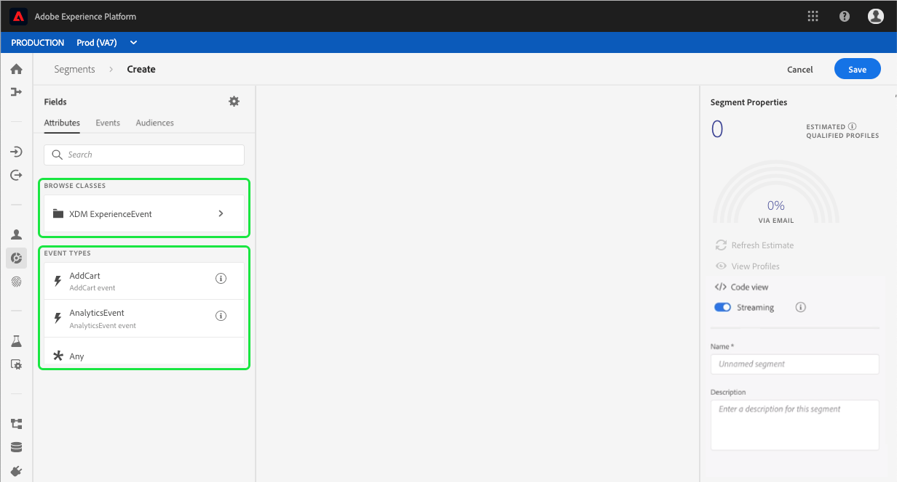

# 세그먼트 빌더 사용 안내서

Adobe Experience Platform 세그멘테이션 서비스는 실시간 고객 프로필 데이터에서 세그먼트 정의를 만들기 위한 RESTful API 및 사용자 인터페이스를 제공합니다.

## 시작하기

세그먼트 정의를 사용하려면 세그멘테이션과 관련된 다양한 경험 플랫폼 서비스를 이해해야 합니다. 이 사용 안내서를 읽기 전에 다음 서비스에 대한 설명서를 참조하십시오.

- [세그멘테이션 서비스](../home.md):세그멘테이션 서비스를 사용하면 고객, 잠재 고객, 사용자 또는 조직과 관련된 경험 플랫폼에 저장된 데이터를 유사한 트레이트를 공유하고 마케팅 전략과 유사한 방식으로 대응할 수 있는 작은 그룹으로 나눌 수 있습니다.
- [실시간 고객 프로필](../../profile/home.md):다양한 소스의 데이터를 집계하여 통합된 실시간 고객 프로파일을 제공합니다.
- [ID 서비스](../../identity-service/home.md):인제스트되는 다양한 데이터 소스의 ID를 플랫폼에 통합하여 실시간 고객 프로파일을 구축할 수 있습니다.
- [XDM(Experience Data Model)](../../xdm/home.md):플랫폼이 고객 경험 데이터를 구성하는 표준화된 프레임워크입니다.

또한 이 문서를 통해 사용되는 두 가지 주요 용어를 알고 그 차이점을 이해하는 것이 중요합니다.
- **세그먼트 정의**:타겟 대상의 주요 특성 또는 행동을 설명하는 데 사용되는 규칙 세트입니다.
- **대상**:세그먼트 정의의 기준을 충족하는 결과 프로필 집합.

## 세그먼트 정의 액세스

Adobe Experience Platform에서 세그먼트 정의를 사용하여 작업을 시작하려면 왼쪽 **탐색** 영역에서 세그먼트를 클릭합니다. 조직에 대한 모든 세그먼트 정의를 보려면 찾아보기 *탭을* 클릭합니다. 이 보기에는 평가 방법, 만든 날짜 및 마지막으로 수정한 날짜를 포함한 세그먼트 정의에 대한 정보가 표시됩니다.

평가 방법은 스트리밍 또는 일괄 처리일 수 있습니다. 스트리밍 세그먼트는 데이터가 시스템에 들어올 때 지속적으로 평가됩니다. 배치 세그먼트는 설정된 일정에 따라 평가됩니다.

배치 세그먼트에는 추가 정보가 표시되어, 배치의 다음 평가 날짜와 마지막 평가 날짜를 모두 보여줍니다.

오른쪽 **위 모서리에서 세그먼트** 만들기를 클릭하면 세그먼트 빌더 작업 영역이 열리고 세그먼트 정의 만들기를 시작할 수 있습니다.

## 세그먼트 빌더 작업 영역

세그먼트 빌더는 프로필 데이터 요소와 상호 작용할 수 있는 풍부한 작업 영역을 제공합니다. 작업 영역에서는 데이터 속성을 나타내는 데 사용되는 드래그 앤 드롭 타일과 같이 규칙을 작성 및 편집하는 데 필요한 직관적인 컨트롤을 제공합니다.

## 세그먼트 정의 구성 블록

세그먼트 정의의 기본 구성 요소는 **속성** 및 **이벤트입니다**. 또한 기존 대상에 포함된 특성과 이벤트를 **새 정의에** 대한 구성 요소로 사용할 수도 있습니다.

이러한 구성 요소는 세그먼트 빌더 작업 *영역의 왼쪽에* 있는 필드 섹션에서 볼 수 있습니다. *필드에는* 각 기본 구성 요소에 대한 탭이 포함되어 있습니다.속성 **,**&#x200B;이벤트 **및**&#x200B;대상을 **참조하십시오**.

### 속성

속성 **탭에서는** XDM 개별 프로필 클래스에 속하는 프로필 속성을 검색할 수 있습니다. 각 폴더를 확장하여 추가 속성을 표시할 수 있습니다. 여기서 각 속성은 작업 영역의 가운데에 있는 규칙 빌더 캔버스로 드래그할 수 있는 타일입니다. 규칙 [빌더 캔버스는](#rule-builder-canvas) 이 안내서의 후반부에 자세히 설명되어 있습니다.

### 이벤트

이벤트 **탭을** 사용하면 XDM ExperienceEvent 데이터 요소를 사용하여 발생한 이벤트 또는 작업을 기반으로 대상을 만들 수 있습니다. 또한 이벤트 탭에서 이벤트 **유형을** 찾을 수 있습니다. 이 이벤트는 세그먼트를 보다 빠르게 만들 수 있도록 일반적으로 사용되는 이벤트 컬렉션입니다.

ExperienceEvent 요소를 검색할 수 있을 뿐만 아니라 이벤트 유형도 검색할 수 있습니다. 이벤트 유형은 ExperienceEvents와 동일한 코딩 로직을 사용하며, XDM ExperienceEvent 클래스를 통해 올바른 이벤트를 검색하지 않아도 됩니다. 예를 들어 검색 막대를 사용하여 &quot;장바구니&quot;를 검색하면 세그먼트 정의를 작성할 때 매우 일반적으로 사용되는 두 가지 장바구니 동작인 &quot;AddCart&quot; 및 &quot;RemoveCart&quot;가 반환됩니다.

Lucene의 검색 구문을 사용하는 검색 표시줄에 구성 요소의 이름을 입력하여 모든 유형의 구성 요소를 검색할 수 있습니다. 전체 단어를 입력하면 검색 결과가 채워집니다. 예를 들어 XDM 필드를 기반으로 규칙을 만들려면 검색 필드에 &quot;제품 보기&quot;를 입력하기 `ExperienceEvent.commerce.productViews`시작합니다. 단어 &quot;product&quot;를 입력하면 검색 결과가 나타납니다. 각 결과에는 해당 결과가 속한 객체 계층이 포함됩니다.

>[!NOTE] 조직에서 정의한 사용자 정의 스키마 필드를 표시하는데 최대 24시간이 걸릴 수 있으며 빌드 규칙에 사용할 수 있습니다.

그런 다음 ExperienceEvents 및 이벤트 유형을 세그먼트 정의에 쉽게 드래그하여 놓을 수 있습니다.

기본적으로 데이터 저장소에서 채워진 스키마 필드만 표시됩니다. 여기에는 이벤트 유형이 포함됩니다. 이벤트 유형 목록이 표시되지 않거나 이벤트 유형으로 &quot;모두&quot;만 선택할 수 있는 경우 필드 옆에 있는 톱니바퀴 아이콘을 *클릭한*&#x200B;다음 사용 가능한 **필드 아래에 전체 XDM 스키마** **&#x200B;표시를선택합니다. 톱니바퀴 아이콘을 다시 클릭하여 *필드* 탭으로 돌아오면 이제 데이터 포함 여부와 상관없이 여러 이벤트 유형 및 스키마 필드를 볼 수 있습니다.

### 대상자

대상 **탭에는** Adobe Audience Manager와 같은 외부 소스에서 가져온 모든 대상뿐만 아니라 Experience Platform 내에서 생성된 대상이 나열됩니다.

대상 탭에서 사용 가능한 모든 소스를 폴더 그룹으로 볼 수 있습니다. 이러한 폴더를 클릭하면 사용 가능한 하위 폴더 및 대상을 볼 수 있습니다. 또한 폴더 아이콘(오른쪽 이미지에 표시)을 클릭하여 폴더 구조를 보고(확인 표시는 현재 있는 폴더를 의미함) 트리에서 폴더 이름을 클릭하여 폴더를 쉽게 다시 탐색할 수 있습니다.

대상자 ⓘ 옆에 마우스를 올려 놓으면 대상자 ID, 설명 및 폴더 계층 구조를 포함하여 대상에 대한 정보를 볼 수 있습니다.

Lucene의 검색 구문을 활용하는 검색 막대를 사용하여 대상을 검색할 수도 있습니다. 대상 *탭에서* 최상위 폴더를 선택하면 검색 막대가 표시되므로 해당 폴더 내에서 검색할 수 있습니다. 전체 단어를 입력하면 검색 결과가 채워지기 시작합니다. 예를 들어 이름이 지정된 대상을 찾으려면 검색 `Online Shoppers`표시줄에 &quot;온라인&quot;을 입력합니다. 단어 &quot;Online&quot;을 모두 입력하면 단어 &quot;Online&quot;이 포함된 검색 결과가 나타납니다.

## 규칙 빌더 캔버스

세그먼트 정의는 대상 대상의 주요 특성 또는 행동을 설명하는 데 사용되는 규칙 모음입니다. 이러한 규칙은 세그먼트 빌더 가운데에 있는 *규칙 빌더 캔버스를*&#x200B;사용하여 만듭니다.

세그먼트 정의에 새 규칙을 추가하려면 필드 탭에서 타일을 *드래그하여* 규칙 빌더 캔버스에 놓습니다. 그런 다음 추가되는 데이터의 유형에 따라 컨텍스트별 옵션이 표시됩니다. 사용 가능한 데이터 유형은 다음과 같습니다.문자열, 날짜, ExperienceEvents, 이벤트 유형 및 대상.

### 대상자 추가

대상 탭에서 대상을 규칙 빌더 *캔버스로 드래그하여* 놓아 새 세그먼트 정의에서 대상 구성원을 참조할 수 있습니다. 이렇게 하면 대상 멤버십을 새 세그먼트 규칙에 속성으로 포함하거나 제외할 수 있습니다.

세그먼트 빌더를 사용하여 만든 플랫폼 대상의 경우 대상을 해당 대상의 세그먼트 정의에 사용된 규칙 세트로 변환할 수 있는 옵션이 제공됩니다. 이 변환은 규칙 로직의 복사본을 만듭니다. 이렇게 하면 원래 세그먼트 정의에 영향을 주지 않고 수정할 수 있습니다.

>[!NOTE] 외부 소스에서 대상을 추가하는 경우 대상 멤버십만 참조됩니다. 대상을 규칙으로 변환할 수 없으므로 원래 대상을 만드는 데 사용된 규칙을 새 세그먼트 정의에서 수정할 수 없습니다.

## 컨테이너

세그먼트 규칙은 나열된 순서대로 평가됩니다. 컨테이너를 사용하면 중첩된 쿼리를 통해 실행 순서를 제어할 수 있습니다.

규칙 빌더 캔버스에 타일을 하나 이상 추가하면 컨테이너를 추가할 수 있습니다. 새 컨테이너를 만들려면 타일의 오른쪽 위 모서리에 있는 줄임표(...)를 클릭한 다음 컨테이너 **추가를**&#x200B;클릭합니다.

새 컨테이너는 첫 번째 컨테이너의 자식으로 표시되지만 컨테이너를 드래그하여 이동하여 계층을 조정할 수 있습니다. 컨테이너의 기본 동작은 제공된 특성, 이벤트 또는 대상을 &quot;포함&quot;하는 것입니다. 타일 맨 위 왼쪽 모서리에서 포함을 클릭하고 &quot;제외&quot; **를** 선택하여 컨테이너 기준과 일치하는 규칙을 &quot;제외&quot; 프로필로 설정할 수 있습니다.

자식 컨테이너에서 &quot;컨테이너 감싸기 해제&quot;를 클릭하여 하위 컨테이너를 추출하여 상위 컨테이너에 인라인을 추가할 수도 있습니다. 이 옵션에 액세스하려면 하위 컨테이너의 오른쪽 위 모서리에 있는 줄임표(...)를 클릭합니다.

컨테이너 **감싸기** 해제를 클릭하면 하위 컨테이너가 제거되고 기준이 인라인으로 표시됩니다.

>[!NOTE] 컨테이너 래핑을 취소할 때는 논리가 원하는 세그먼트 정의를 계속 충족하는지 주의하십시오.

## 정책 병합

Adobe Experience Platform을 사용하면 여러 소스에서 데이터를 취합하여 개별 고객의 전체 상황을 파악할 수 있습니다. 이 데이터를 취합할 때 병합 정책은 플랫폼이 데이터의 우선 순위를 매기는 방법과 프로필을 만들기 위해 결합할 데이터를 결정하는 데 사용하는 규칙입니다.

이 대상의 마케팅 목적과 일치하는 병합 정책을 선택하거나 플랫폼에서 제공하는 기본 병합 정책을 사용할 수 있습니다. 고유한 기본 병합 정책을 만드는 것을 비롯하여 조직에 고유한 여러 병합 정책을 만들 수 있습니다. 조직의 병합 정책을 만드는 방법에 대한 단계별 지침은 UI를 사용하여 병합 정책을 [사용하는 방법에 대한 자습서를 참조하십시오](../../profile/ui/merge-policies.md).

세그먼트 정의에 대한 병합 정책을 선택하려면 필드 *탭에서 톱니바퀴* 아이콘을 클릭한 다음 정책 *병합 드롭다운 메뉴를* 사용하여 사용할 병합 정책을 선택합니다.

## 세그먼트 속성

세그먼트 정의를 작성할 때 *작업* 공간의 오른쪽에 있는 세그먼트 속성 섹션에 결과 세그먼트의 크기가 예상되므로 세그먼트 정의를 필요에 따라 조정할 수 있습니다.

세그먼트 *속성* 섹션에서는 세그먼트 정의 이름 및 설명을 포함하여 세그먼트 정의에 대한 중요한 정보를 지정할 *수* *있습니다*. 세그먼트 정의 이름은 조직에서 정의한 세그먼트 중에서 세그먼트를 식별하는 데 사용되므로 설명적이고 간결하며 고유해야 합니다.

세그먼트 정의를 계속 작성하면 프로필 보기를 선택하여 페이지에 지정된 대상의 미리 보기를 볼 수 **있습니다**.

>[!NOTE] 대상 추정은 해당 일의 샘플 데이터의 샘플 크기를 사용하여 생성됩니다. 프로필 저장소에 100만 개 미만의 개체가 있는 경우 전체 데이터 세트가 사용됩니다.100만~2000만 개의 개체 중 100만 개가 사용됩니다.2천만 개 이상의 개체에 대해 전체 개체의 5%가 사용됩니다. 세그먼트 예상 생성에 대한 자세한 내용은 세그먼트 작성 자습서의 [예측 생성 섹션에서](../tutorials/create-a-segment.md#estimate-and-preview-an-audience) 확인할 수 있습니다.

## 예약된 세그멘테이션 사용

세그먼트 정의가 만들어지면 주문형 또는 예약된(연속) 평가를 통해 평가할 수 있습니다. 평가는 해당 고객을 생성하기 위해 세그먼트 정의를 통해 실시간 고객 프로필 데이터를 이동하는 것을 의미합니다. 생성된 대상은 Experience Platform API를 사용하여 내보낼 수 있도록 저장되고 저장됩니다.

On-Demand 평가는 API를 사용하여 평가를 수행하고 필요에 따라 대상을 빌드해야 하지만, 예약된 평가(&#39;예약된 세그멘테이션&#39;이라고도 함)를 사용하면 일정 시간(일일 최대 1회)에 세그먼트 정의를 평가하는 반복 일정을 만들 수 있습니다.

예약된 평가에 대한 세그먼트 정의 활성화는 UI 또는 API를 사용하여 수행할 수 있습니다. UI에서 세그먼트 내 *검색* 탭으로 **돌아가서** 모든 세그먼트 **평가를**&#x200B;전환합니다. 이렇게 하면 조직에서 설정한 일정에 따라 모든 세그먼트가 평가됩니다.

>[!NOTE] XDM 개별 프로필에 대해 최대 5개의 병합 정책을 포함하는 샌드박스에 대해 예약된 평가를 활성화할 수 있습니다. 조직에서 단일 샌드박스 환경 내에서 XDM 개별 프로필에 대한 병합 정책이 5개 이상 있는 경우 예약된 평가를 사용할 수 없습니다.

예약은 현재 API를 통해서만 만들 수 있습니다. API를 사용하여 예약을 생성, 편집 및 작업하는 방법에 대한 자세한 내용은 튜토리얼을 따라 세그먼트 결과를 평가하고 액세스하는 방법, 특히 API를 사용한 [예약된 평가에 대한 섹션을 참조하십시오](../tutorials/evaluate-a-segment.md#scheduled-evaluation).

## 스트리밍 세분화

>[!NOTE] 스트리밍 세그멘테이션은 베타 기능이며 요청 시 사용할 수 있습니다.

또한 세그먼트 정의를 만들기 전 또는 후에 스트리밍 세그먼테이션에 사용할 수 있습니다. 스트리밍 세그멘테이션은 이벤트가 특정 세그먼트 그룹에 들어오면 즉시 고객을 평가합니다. 이 기능을 사용하면 이제 데이터가 플랫폼으로 전달되면 대부분의 세그먼트 규칙을 평가할 수 있습니다. 즉, 세그먼트 멤버십은 예약된 세그멘테이션 작업을 실행하지 않고 최신 상태로 유지됩니다. 스트리밍 세그멘테이션에 대한 자세한 내용은 [스트리밍 세그멘테이션 설명서를](../api/streaming-segmentation.md)참조하십시오.

스트리밍을 위한 세그먼트 정의 활성화는 UI 또는 API를 사용하여 수행할 수 있습니다. UI에서 스트리밍을 위한 새 세그먼트 정의나 기존 세그먼트 정의를 활성화하려면 스트리밍 *옵션을* 켜기로 전환해야 **합니다**.

스트리밍 세그멘테이션이 활성화되면 베이스라인을 설정해야 합니다(세그먼트가 항상 최신 상태로 유지되는 이후 초기 실행). 시스템은 자동으로 기본 설정을 처리하지만, 이는 예약된 세그먼테이션이 활성화된 경우에만 가능합니다. 예약된 세그멘테이션 활성화에 대한 자세한 내용은 [이 사용 안내서의](#enable-scheduled-segmentation)이전 섹션을 참조하십시오.

## 일정 정책 위반

>[!NOTE] DULE 정책 위반은 대상에 지정된 세그먼트를 만드는 경우에만 적용됩니다.

세그먼트 작성을 완료하면 세그먼트 내에 정책 위반이 없도록 데이터 거버넌스에 의해 세그먼트가 분석됩니다. DULE 및 정책 위반에 대한 자세한 내용은 [데이터 사용 레이블 개요를](../../data-governance/labels/overview.md)참조하십시오.

## 다음 단계

세그먼트 빌더는 마케팅 가능한 고객을 실시간 고객 프로필 데이터에서 분리할 수 있는 풍부한 워크플로우를 제공합니다. 이 가이드를 읽고 나면 이제 다음을 수행할 수 있습니다.

- 속성, 이벤트 및 기존 대상을 구성 블록으로 조합하여 세그먼트 정의를 만듭니다.
- 규칙 빌더 캔버스 및 컨테이너를 사용하여 세그먼트 규칙이 실행되는 순서를 제어할 수 있습니다.
- 필요에 따라 세그먼트 정의를 조정할 수 있도록 잠재 고객에 대한 예측을 봅니다.
- 예약된 세그멘테이션에 대해 모든 세그먼트 정의를 활성화합니다.
- 스트리밍 세그먼테이션에 대해 지정된 세그먼트 정의를 활성화합니다.

실시간 고객 프로필 API를 사용하여 세그멘테이션 서비스를 사용하는 방법에 대한 단계별 지침은 API를 사용하여 고객 세그먼트 [만들기](../tutorials/create-a-segment.md) 자습서를 참조하십시오.