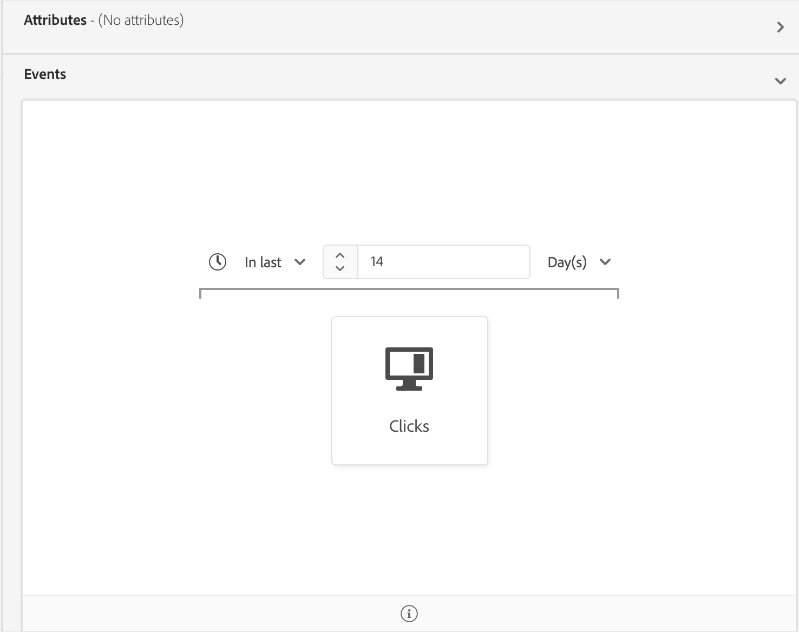

# [!UICONTROL 세그먼트 빌더] 사용 안내서

[!DNL Adobe Experience Platform Segmentation Service] 데이터에서 세그먼트 정의를 만들기 위한 RESTful API 및 사용자 인터페이스를 [!DNL Real-time Customer Profile] 제공합니다.

## 시작하기

세그먼트 정의를 사용하려면 세그먼테이션과 관련된 다양한 [!DNL Experience Platform] 서비스를 이해해야 합니다. 이 사용자 안내서를 읽기 전에 다음 서비스에 대한 설명서를 검토하십시오.

- [!DNL Segmentation Service](../home.md): 세그멘테이션 서비스를 사용하면 개인(예: 고객, 잠재 고객, 사용자 또는 조직)과 관련된 저장된 데이터를 유사한 트레이트를 공유하고 마케팅 전략에 유사하게 반응하는 작은 그룹으로 나눌 수 있습니다. [!DNL Experience Platform]
- [!DNL Real-time Customer Profile](../../profile/home.md): 여러 소스에서 집계된 데이터를 기반으로 통합된 실시간 소비자 프로필을 제공합니다.
- [!DNL Identity Service](../../identity-service/home.md): 수집되는 여러 데이터 소스의 ID를 Platform으로 결합함으로써 [!DNL Real-time Customer Profile] 활성화합니다.
- [!DNL Experience Data Model (XDM)](../../xdm/home.md): 고객 경험 데이터를 [!DNL Platform] 구성하는 표준화된 프레임워크

또한 이 문서를 통해 사용되는 두 개의 주요 용어를 알고 이 용어 간의 차이점을 이해하는 것이 중요합니다.
- **세그먼트 정의**: 대상 대상의 주요 특성 또는 행동을 설명하는 데 사용되는 규칙 세트입니다.
- **대상**: 세그먼트 정의 기준을 충족하는 결과 프로필 집합입니다.

## 세그먼트 정의 액세스

에서 세그먼트 정의 작업을 시작하려면 왼쪽 탐색 [!DNL Adobe Experience Platform]에서 **[!UICONTROL 세그먼트]** 를 클릭합니다. 조직에 대한 모든 세그먼트 정의를 보려면 *[!UICONTROL 찾아보기]* 탭을 클릭합니다. 이 보기에는 평가 방법, 만든 날짜 및 마지막으로 수정한 날짜를 포함한 세그먼트 정의에 대한 정보가 표시됩니다.

평가 방법은 스트리밍 또는 일괄 처리일 수 있습니다. 데이터가 시스템에 입력되면 스트리밍 세그먼트는 지속적으로 평가됩니다. 배치 세그먼트는 설정된 일정에 따라 평가됩니다.

배치 세그먼트에는 마지막 평가 날짜와 배치에 대한 다음 평가 날짜를 모두 보여주는 추가 정보가 표시됩니다.

오른쪽 **[!UICONTROL 위 모서리에서 세그먼트]** 만들기를 클릭하면 세그먼트 빌더 작업 공간이 열리고 세그먼트 정의를 만들 수 있습니다.

## [!UICONTROL 세그먼트 빌더] 작업 영역

[!UICONTROL 세그먼트 빌더는] 데이터 요소와 상호 작용할 수 있는 풍부한 작업 공간을 [!DNL Profile] 제공합니다. 작업 영역에서는 데이터 속성을 나타내는 데 사용되는 드래그 앤 드롭 타일과 같이 규칙을 작성하고 편집하기 위한 직관적인 컨트롤을 제공합니다.

## 세그먼트 정의 구성 블록

세그먼트 정의의 기본 구성 요소는 **[!UICONTROL 속성]** 및 **[!UICONTROL 이벤트입니다]**. 또한 기존 대상에 포함된 속성과 이벤트를 **[!UICONTROL 새 정의에]** 대한 구성 요소로 사용할 수도 있습니다.

세그먼트 빌더 작업 영역의 왼쪽에 있는 *필드* 섹션에서 이러한 [!UICONTROL 구성] 블록을 볼 수 있습니다. *[!UICONTROL 필드는]* 각 기본 구성 요소에 대한 탭을 포함합니다. **[!UICONTROL 속성]**, **[!UICONTROL 이벤트]**&#x200B;및 **[!UICONTROL 대상을 참조하십시오]**.

### 속성

[ **[!UICONTROL 속성]** ] 탭에서는 [!DNL Profile] [!DNL XDM Individual Profile] 클래스에 속한 속성을 검색할 수 있습니다. 각 폴더를 확장하여 추가 속성을 표시할 수 있습니다. 여기서 각 속성은 작업 영역의 가운데에 있는 규칙 빌더 캔버스로 드래그할 수 있는 타일입니다. 규칙 [빌더 캔버스에](#rule-builder-canvas) 대한 자세한 내용은 이 안내서 후반부에서 설명합니다.

### 이벤트

[ **[!UICONTROL 이벤트]** ] 탭에서는 XDM ExperienceEvent 데이터 요소를 사용하여 발생한 이벤트 또는 작업을 기반으로 대상을 만들 수 있습니다. 또한 이벤트 탭에서 이벤트 유형을 **[!UICONTROL 찾을]** 수 있습니다. 이 탭은 세그먼트를 보다 신속하게 만들 수 있도록 일반적으로 사용되는 이벤트의 컬렉션입니다.

요소를 검색할 수 있을 뿐만 아니라 이벤트 유형을 검색할 수도 [!DNL ExperienceEvent] 있습니다. 이벤트 유형에서는 올바른 이벤트를 찾는 [!DNL ExperienceEvents][!DNL XDM ExperienceEvent] 클래스를 검색하지 않고도 동일한 코딩 로직을 사용합니다. 예를 들어, 검색 막대를 사용하여 &quot;장바구니&quot;를 검색하면 세그먼트 정의를 작성할 때[!UICONTROL 매우 일반적으로 사용되는 두]가지 장바구니 작업인 &quot;AddCart[!UICONTROL &quot; 및 &quot;]RemoveCart&quot;가 반환됩니다.

Lucene의 검색 구문을 사용하는 검색 막대에 구성 요소의 이름을 입력하여 [모든 유형의 구성 요소를 검색할 수 있습니다](https://docs.microsoft.com/en-us/azure/search/query-lucene-syntax). 전체 단어가 입력되면 검색 결과가 채워지기 시작합니다. 예를 들어 XDM 필드를 기반으로 규칙을 만들려면 검색 필드 `ExperienceEvent.commerce.productViews`에 &quot;제품 보기&quot;를 입력하십시오. 단어 &quot;product&quot;를 입력하면 검색 결과가 표시됩니다. 각 결과에는 해당 개체가 속하는 개체 계층 구조가 포함됩니다.

>[!NOTE] 조직에서 정의한 사용자 정의 스키마 필드는 표시되는 데 최대 24시간이 걸릴 수 있으며 빌드 규칙에 사용할 수 있습니다.

그런 다음 세그먼트 정의 [!DNL ExperienceEvents] 에 [!UICONTROL 이벤트 유형을] 손쉽게 드래그 앤 드롭할 수 있습니다.

기본적으로 데이터 저장소에서 채워진 스키마 필드만 표시됩니다. 여기에는 [!UICONTROL 이벤트 유형이 포함됩니다]. 이벤트 유형 [!UICONTROL 목록이 보이지 않거나] 이벤트 유형[!UICONTROL 목록이 보이지 않거나, &quot;]임의의 [!UICONTROL &quot;을]이벤트 유형 *[!UICONTROL 으로]*&#x200B;선택할 수 있는 경우에만 **[!UICONTROL 다음 필드]** 에서 &quot;다음 필드 *[!UICONTROL 에 표시&quot;를 선택한 다음, &quot;사용 가능한 이벤트&quot;에서 &quot;전체DM 스키마 표시&quot;를]*&#x200B;선택한 다음 &quot;사용 가능한 이벤트&quot;에서XDM 스키마를 클릭합니다. 톱니바퀴 아이콘을 다시 클릭하여 *[!UICONTROL 필드]* 탭으로 돌아갈 수 있습니다. 이제 데이터가 포함되어 있는지 여부에 관계없이 여러 [!UICONTROL 이벤트 유형] 및 스키마 필드를 볼 수 있습니다.

### 대상자

대상 **** 탭에는 Adobe Audience Manager과 같은 외부 소스에서 가져온 모든 대상뿐만 아니라 내부에서 만든 대상도 [!DNL Experience Platform]나열됩니다.

대상 [!UICONTROL 탭에서] 사용 가능한 모든 소스를 폴더 그룹으로 볼 수 있습니다. 이 폴더를 클릭하면 사용 가능한 하위 폴더와 대상을 볼 수 있습니다. 또한 폴더 구조(현재 있는 폴더를 나타내는 확인 표시)를 보기 위해 폴더 아이콘(오른쪽 이미지에 표시됨)을 클릭하고 트리에서 폴더 이름을 클릭하여 폴더를 손쉽게 다시 탐색할 수 있습니다.

대상자 ⓘ 옆에 마우스를 두면 해당 ID, 설명 및 폴더 계층 구조 등 대상에 대한 정보를 보고 대상을 찾을 수 있습니다.

Lucene의 [!UICONTROL 검색 구문을 활용하는] 검색 막대를 사용하여 [대상을 검색할 수도 있습니다](https://docs.microsoft.com/en-us/azure/search/query-lucene-syntax). 대상 ** 탭에서 최상위 폴더를 선택하면 검색 막대가 나타나므로 해당 폴더 내에서 검색할 수 있습니다. 전체 단어를 입력하면 검색 결과가 채워지기 시작합니다. 예를 들어 이름이 [!UICONTROL 지정된] 대상을 찾으려면 검색 `Online Shoppers`막대에 &quot;온라인&quot;을 입력합니다. 단어 &quot;Online&quot;을 모두 입력하면 단어 &quot;Online&quot;이 포함된 검색 결과가 나타납니다.

## 규칙 빌더 캔버스 {#rule-builder-canvas}

세그먼트 정의는 대상 대상의 주요 특성이나 행동을 설명하는 데 사용되는 규칙 모음입니다. 이러한 규칙은 *[!UICONTROL 세그먼트 빌더]*&#x200B;가운데에 있는 규칙 빌더 캔버스를 사용하여 [!UICONTROL 만듭니다].

세그먼트 정의에 새 규칙을 추가하려면 필드 탭에서 *[!UICONTROL 타일을]* 드래그하여 규칙 빌더 캔버스에 놓습니다. 그런 다음 추가되는 데이터의 유형에 따라 컨텍스트별 옵션이 제공됩니다. 사용 가능한 데이터 유형은 다음과 같습니다. 문자열, 날짜, [!DNL ExperienceEvents]이벤트 유형 [!UICONTROL 및]대상자 [!UICONTROL 등을]참조하십시오.

### 대상자 추가

대상을 *[!UICONTROL 대상]* 탭에서 규칙 빌더 캔버스로 드래그하여 놓아 새 세그먼트 정의에서 대상 멤버십을 참조할 수 있습니다. 이렇게 하면 대상 멤버십을 새 세그먼트 규칙에 속성으로 포함 또는 제외할 수 있습니다.

세그먼트 빌더를 사용하여 [!DNL Platform] 만든 [!UICONTROL 대상의 경우]대상을 해당 대상의 세그먼트 정의에 사용된 규칙 세트로 전환할 수 있는 옵션이 제공됩니다. 이 변환은 규칙 로직의 복사본을 만들며, 그런 다음 원래 세그먼트 정의에 영향을 주지 않고 수정할 수 있습니다. 세그먼트 정의를 규칙 논리로 변환하기 전에 최근에 변경한 내용을 저장했는지 확인하십시오.

>[!NOTE] 외부 소스에서 대상을 추가하는 경우 대상 멤버십만 참조됩니다. 대상을 규칙으로 변환할 수 없으므로 원래 대상을 만드는 데 사용되는 규칙은 새 세그먼트 정의에서 수정할 수 없습니다.

대상을 규칙으로 변환할 때 충돌이 발생하는 경우 [!UICONTROL 세그먼트 빌더] 는 기존 옵션을 최대한 보존하려고 시도합니다.

### 코드 보기

또는 세그먼트 빌더에서 만든 규칙의 코드 기반 버전을 [!UICONTROL 볼 수 있습니다]. 규칙 빌더 캔버스 내에서 규칙을 만들면 **[!UICONTROL 코드 보기를 선택하여]** 세그먼트를 PQL으로 볼 수 있습니다.

코드 보기는 API 호출에 사용할 세그먼트 값을 복사할 수 있는 단추를 제공합니다. 최신 버전의 세그먼트를 가져오려면 세그먼트에 최신 변경 사항을 저장했는지 확인하십시오.

## 컨테이너

세그먼트 규칙은 나열된 순서대로 평가됩니다. 컨테이너는 중첩된 쿼리를 사용하여 실행 순서를 제어할 수 있습니다.

규칙 빌더 캔버스에 타일을 하나 이상 추가하면 컨테이너를 추가할 수 있습니다. 새 컨테이너를 만들려면 타일의 오른쪽 위 모서리에 있는 줄임표(...)를 클릭한 다음 컨테이너 **[!UICONTROL 추가를 클릭합니다]**.

새 컨테이너는 첫 번째 컨테이너의 자식으로 표시되지만 컨테이너를 드래그하여 이동하여 계층을 조정할 수 있습니다. 컨테이너의 기본 동작은 제공된 특성, 이벤트 또는 대상을 &quot;[!UICONTROL 포함]&quot;하는 것입니다. 타일 맨 위 왼쪽 모서리에서 [포함]을 클릭하고 &quot;[!UICONTROL 제외]&quot;를 선택하여 **** 컨테이너 기준과 일치하는 &quot;[!UICONTROL 제외]&quot; 프로필로 규칙을 설정할 수있습니다.

하위 컨테이너에서 &quot;컨테이너 감싸기 해제&quot;를 클릭하여 하위 컨테이너를 추출하여 상위 컨테이너에 인라인을 추가할 수도 있습니다. 이 옵션에 액세스하려면 하위 컨테이너의 오른쪽 위 모서리에 있는 줄임표(...)를 클릭합니다.

컨테이너 **[!UICONTROL 감싸기]** 해제(Unwrap)를 클릭하면 하위 컨테이너가 제거되고 기준이 인라인으로 표시됩니다.

>[!NOTE] 컨테이너 래핑 해제 시 로직이 원하는 세그먼트 정의를 계속 충족하는지 주의하십시오.

## 정책 병합

[!DNL Experience Platform] 여러 소스에서 데이터를 취합하여 각 개별 고객의 전체 상황을 파악할 수 있습니다. 이 데이터를 함께 가져올 때 병합 정책은 데이터의 우선 순위를 지정하는 방법과 프로필을 만들기 위해 결합할 데이터를 결정하는 데 [!DNL Platform] 사용하는 규칙입니다.

이 대상에 대한 마케팅 목적과 일치하는 병합 정책을 선택하거나 에서 제공하는 기본 병합 정책을 사용할 수 있습니다 [!DNL Platform]. 고유한 기본 병합 정책을 만드는 것을 비롯하여 조직에 고유한 여러 병합 정책을 만들 수 있습니다. 조직의 병합 정책을 만드는 방법에 대한 단계별 지침은 UI를 사용하여 병합 정책을 [사용하는 방법에 대한 자습서를 참조하십시오](../../profile/ui/merge-policies.md).

세그먼트 정의에 대한 병합 정책을 선택하려면 *[!UICONTROL 필드]* 탭에서 톱니바퀴 아이콘 *[!UICONTROL 을]클릭한 다음 정책&#x200B;*병합드롭다운 메뉴를 사용하여 사용할 병합 정책을 선택합니다.

## 세그먼트 속성

세그먼트 정의를 작성할 때 작업 공간의 오른쪽에 있는 *[!UICONTROL 세그먼트 속성]* 섹션에 결과 세그먼트의 예상 크기가 표시되므로, 대상을 스스로 작성하기 전에 필요에 따라 세그먼트 정의를 조정할 수 있습니다.

세그먼트 *[!UICONTROL 속성]* 섹션에서도 세그먼트 *[!UICONTROL 이름]* 및 설명 등 세그먼트 정의에 대한 중요한 정보를 지정할 수 *[!UICONTROL 있습니다]*. 세그먼트 정의 이름은 조직에서 정의한 세그먼트 중에서 세그먼트를 식별하는 데 사용되므로 설명적이고 간결하며 고유해야 합니다.

세그먼트 정의를 계속 작성하면 프로필 보기를 선택하여 페이지의 대상 미리 보기를 볼 **[!UICONTROL 수 있습니다]**.

>[!NOTE] 대상 추정은 해당 일의 샘플 데이터의 샘플 크기를 사용하여 생성됩니다. 프로필 스토어에 1백만 개 미만의 개체가 있는 경우 전체 데이터 세트가 사용됩니다. 100만개에서 2000만개가 사용됩니다. 2천만 개 이상의 개체에 대해 전체 개체의 5%가 사용됩니다. 세그먼트 예측 생성에 대한 자세한 내용은 세그먼트 작성 자습서의 [예측 생성 섹션](../tutorials/create-a-segment.md#estimate-and-preview-an-audience) 에서 확인할 수 있습니다.

## 예약된 세그먼테이션 사용 {#enable-scheduled-segmentation}

세그먼트 정의가 만들어지면 주문형 또는 예약된(연속) 평가를 통해 평가할 수 있습니다. 평가는 해당 대상을 만들기 위해 세그먼트 정의를 통해 [!DNL Real-time Customer Profile] 데이터를 이동하는 것을 의미합니다. 만들어진 대상은 저장 및 저장되므로 [!DNL Experience Platform] API를 사용하여 내보낼 수 있습니다.

on-demand 평가에는 API를 사용하여 평가를 수행하고 필요에 따라 대상을 빌드하는 작업이 포함되지만, 예약된 평가(&#39;예약된 세그먼트&#39;라고도 함)를 사용하면 특정 시간(하루 최대 1회)에 세그먼트 정의를 평가하는 반복 일정을 만들 수 있습니다.

예약된 평가에 대한 세그먼트 정의 활성화는 UI 또는 API를 사용하여 수행할 수 있습니다. UI에서 세그먼트 내 *[!UICONTROL 의]* **[!UICONTROL 찾아보기]** 탭으로 ****&#x200B;돌아가서 모든 세그먼트평가를전환합니다. 이렇게 하면 조직에서 설정한 일정에 따라 모든 세그먼트가 평가됩니다.

>[!NOTE] 최대 5개의 병합 정책을 포함하는 샌드박스에 대해 예약된 평가를 활성화할 수 있습니다 [!DNL XDM Individual Profile]. 조직에서 단일 샌드박스 환경 [!DNL XDM Individual Profile] 에 대해 5개 이상의 병합 정책을 보유하고 있는 경우 예약된 평가를 사용할 수 없습니다.

일정은 현재 API를 사용해서만 만들 수 있습니다. API를 사용하여 예약을 생성, 편집 및 작업하는 방법에 대한 자세한 내용은 튜토리얼을 따라 세그먼트 결과를 평가하고 액세스할 수 있으며, 특히 API를 사용한 [예약된 평가에 대한 섹션을 참조하십시오](../tutorials/evaluate-a-segment.md#scheduled-evaluation).

## 스트리밍 세분화 {#streaming-segmentation}

>[!NOTE] 스트리밍 세그멘테이션이 작동하려면 고객은 조직의 예약된 세그멘테이션을 활성화해야 합니다. 예약된 세그먼테이션 활성화에 대한 자세한 내용은 이 사용자 안내서 [의 이전 섹션을 참조하십시오](#enable-scheduled-segmentation).

쿼리는 다음 기준을 충족하는 경우 스트리밍 세그멘테이션으로 자동으로 평가됩니다.

| 쿼리 유형 | 세부 사항 | 예 |
| ---------- | ------- | ------- |
| 들어오는 히트 | 시간 제한 없이 들어오는 단일 이벤트를 참조하는 모든 세그먼트 정의 |  |
| 상대 시간 창 내의 들어오는 히트 | 지난 7일 **이내에 들어오는 단일 이벤트를 참조하는 모든 세그먼트 정의**. |  |
| 프로필을 참조하는 들어오는 히트 | 시간 제한 없이 단일 들어오는 이벤트를 참조하는 세그먼트 정의 및 하나 이상의 프로필 속성. |  |
| 상대 시간 창 내의 프로파일을 참조하는 들어오는 히트 | 지난 7일 **이내에 들어오는 단일 이벤트와 하나 이상의 프로필 속성을 참조하는 모든 세그먼트 정의**. |  |
| 프로파일을 참조하는 여러 이벤트 | 지난 24시간 **** 이내에 여러 이벤트를 참조하고 (선택 사항) 하나 이상의 프로필 속성을 포함하는 세그먼트 정의입니다. |  |

다음 섹션에는 스트리밍 세그멘테이션에 사용할 수 **없는** 세그먼트 정의 예가 나와 있습니다.

| 쿼리 유형 | 세부 사항 |
| ---------- | ------- | 
| 상대 시간 창 내의 들어오는 히트 | 세그먼트 정의가 **지난 7일 기간 내에** 없는 **들어오는 이벤트를 참조한 경우**. 예를 들어 **지난 2주**&#x200B;이내에 |  |
| 상대 창 내의 프로파일을 참조하는 들어오는 히트 | 다음 옵션은 스트리밍 세그멘테이션을 지원하지 **않습니다** .<ul><li>**지난 7일 기간** ****&#x200B;내에 들어오는 이벤트</li><li>세그먼트 또는 트레이트를 포함하는 [!DNL Adobe Audience Manager (AAM)] 세그먼트 정의</li></ul> |  |
| 프로파일을 참조하는 여러 이벤트 | 다음 옵션은 스트리밍 세그멘테이션을 지원하지 **않습니다** .<ul><li>지난 24시간 이내에 **발생하지** 않는 ****&#x200B;이벤트.</li><li>Adobe Audience Manager(AAM) 세그먼트 또는 트레이트를 포함하는 세그먼트 정의입니다.</li></ul> |  |
| 다중 엔티티 쿼리 | 다중 엔티티 쿼리는 전체적으로 스트리밍 세그먼테이션에서 **지원되지 않습니다** . |  |

또한 스트리밍 세그먼테이션을 수행할 때 다음과 같은 지침이 적용됩니다.

| 쿼리 유형 | 지침 |
| ---------- | -------- |
| 단일 이벤트 쿼리 | 뒤쪽 창은 **7일로 제한됩니다**. |
| 이벤트 내역이 있는 쿼리 | <ul><li>뒤쪽 창은 **하루로 제한됩니다**.</li><li>이벤트 간에 엄격한 시간 순서 지정 조건이 **있어야** 합니다.</li><li>이벤트 간의 간단한 시간 순서(전과 후)만 허용됩니다.</li><li>개별 이벤트는 무효화할 **수** 없습니다. 하지만 전체 쿼리는 무효화할 **수** 있습니다.</li></ul> |

### 스트리밍 세분화 모니터링

스트리밍 가능 세그먼트를 만든 후 해당 세그먼트의 세부 사항을 모니터링할 수 있습니다.

특히 *[!UICONTROL 전체 적격 대상자 크기에]* 대한 세부 사항이 표시됩니다. 작업이 지난 24시간 이내에 실행된 경우 추가된 대상자에 대한 라인 차트 외에 **[!UICONTROL 작업의 총 대상]** 크기가 표시됩니다. 그렇지 않으면 시각화 **[!UICONTROL 트렌드]** 라인 외에 예상 대상 크기가 표시됩니다.

정보 버블을 클릭하여 마지막 세그먼트 평가에 대한 추가 정보를 찾을 수 있습니다.

## 일정 정책 위반

>[!NOTE] DULE 정책 위반은 대상에 지정된 세그먼트를 만드는 경우에만 적용됩니다.

세그먼트 작성을 완료하면 세그먼트 내에 정책 위반이 없도록 세그먼트 [!DNL Data Governance] 를 분석하게 됩니다. DULE 및 정책 위반에 대한 자세한 내용은 [데이터 사용 레이블 개요를 참조하십시오](../../data-governance/labels/overview.md).

## 다음 단계

세그먼트 빌더는 마케팅 가능한 대상을 [!DNL Real-time Customer Profile] 데이터에서 분리할 수 있는 풍부한 워크플로우를 제공합니다. 이 가이드를 읽고 나면 다음을 수행할 수 있습니다.

- 속성, 이벤트 및 기존 대상을 구성 요소로 조합하여 세그먼트 정의를 만듭니다.
- 규칙 빌더 캔버스 및 컨테이너를 사용하여 세그먼트 규칙이 실행되는 순서를 제어할 수 있습니다.
- 필요에 따라 세그먼트 정의를 조정할 수 있는 잠재 고객에 대한 견적을 볼 수 있습니다.
- 예약된 세그먼테이션에 대해 모든 세그먼트 정의를 활성화합니다.
- 스트리밍 세그먼테이션에 지정된 세그먼트 정의를 활성화합니다.

API 사용 작업에 대한 단계별 지침 [!DNL Segmentation Service] 은 API를 사용하여 대상 세그먼트 [!DNL Segmentation Service] 만들기  자습서를 참조하십시오.