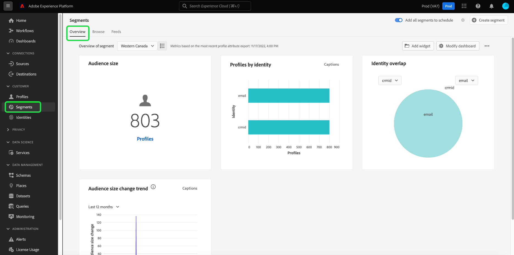
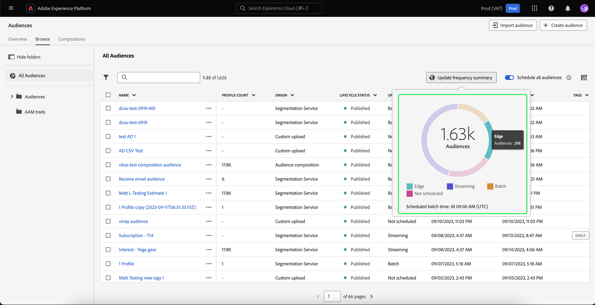
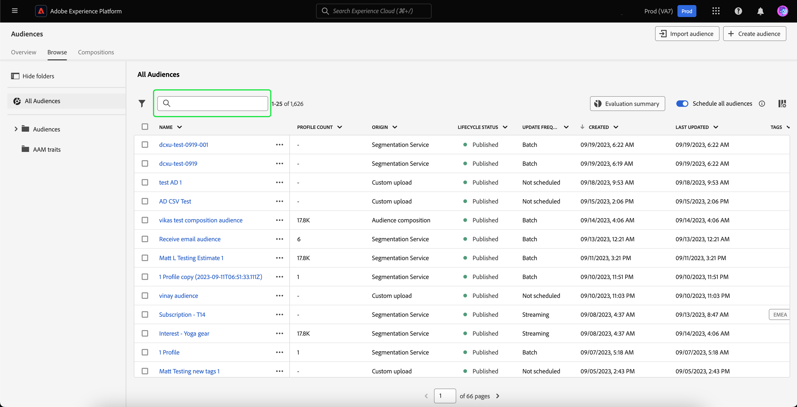
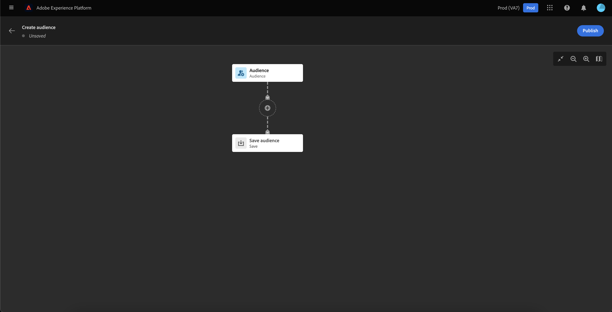
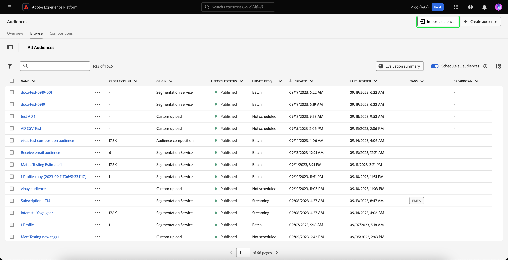

# 세그먼테이션 서비스 UI 안내서

[!DNL Adobe Experience Platform Segmentation Service] 은 대상자 및 세그먼트 정의를 만들고 관리하기 위한 사용자 인터페이스를 제공합니다.

## 시작하기

대상 및 세그먼트 정의를 사용하여 작업하려면 다양한 사항을 이해해야 합니다 [!DNL Experience Platform] 세그먼테이션과 관련된 서비스입니다. 이 사용 안내서를 읽기 전에 다음 서비스에 대한 설명서를 검토하십시오.

- [[!DNL Segmentation Service]](../home.md): [!DNL Segmentation Service] 에 저장된 데이터를 세그먼트화할 수 있습니다. [!DNL Experience Platform] 고객, 잠재 고객, 사용자 또는 조직 등 개인과 관련된 정보를 더 작은 그룹으로 분류할 수 있습니다.
- [[!DNL Real-Time Customer Profile]](../../profile/home.md): 여러 소스의 집계 데이터를 기반으로 통합 실시간 소비자 프로필을 제공합니다.
- [[!DNL Adobe Experience Platform Identity Service]](../../identity-service/home.md): 수집되는 서로 다른 데이터 소스의 ID를 브리징하여 고객 프로필을 만들 수 있습니다 [!DNL Platform].
- [[!DNL Experience Data Model (XDM)]](../../xdm/home.md): 표준화된 프레임워크 [!DNL Platform] 고객 경험 데이터를 구성합니다. 세그먼테이션을 최대한 활용하려면 데이터에 따라 프로필 및 이벤트가 수집되는지 확인하십시오. [데이터 모델링 우수 사례](../../xdm/schema/best-practices.md).

또한 이 문서를 통해 사용되는 두 가지 주요 용어를 이해하고 두 용어 간의 차이점을 이해해야 합니다.

- **대상자**: 유사한 행동 및/또는 특성을 공유하는 사람들의 세트입니다. 이 인물 컬렉션은 세그먼트 정의 또는 대상자 구성(플랫폼 생성 대상자)을 사용하여 Adobe Experience Platform에서 생성하거나, 사용자 지정 업로드(외부 생성 대상자)와 같은 외부 소스에서 생성할 수 있습니다.
- **세그먼트 정의**: Adobe Experience Platform이 대상 대상의 주요 특성 또는 동작을 설명하는 데 사용하는 규칙입니다.
- **세그먼트**: 프로필을 대상자로 분리하는 작업입니다.

## 개요

Experience Platform UI에서 **[!UICONTROL 대상]** 을(를) 왼쪽 탐색에서 **[!UICONTROL 개요]** 을 표시하는 탭 [!UICONTROL 대상] 대시보드입니다.

>[!NOTE]
>
>Platform을 처음 사용하는 조직에 아직 활성 프로필 데이터 세트 또는 병합 정책을 만들지 않은 경우 [!UICONTROL 대상] 대시보드가 표시되지 않습니다. 대신, [!UICONTROL 개요] 탭에는 대상자를 시작하는 데 도움이 되는 링크 및 설명서가 표시됩니다.

### [!UICONTROL 대상] 대시보드 {#segments-dashboard}

다음 **[!UICONTROL 대상]** 대시보드는 조직의 대상 데이터와 관련된 주요 지표에 대해 간략하게 설명합니다.

자세한 내용은 [audiences 대시보드 안내서](../../dashboards/guides/audiences.md).

## 찾아보기 {#browse}

>[!CONTEXTUALHELP]
>id="platform_segments_browse_churncolumnname"
>title="이탈"
>abstract="이탈은 세그먼트 작업이 마지막으로 실행된 시간과 비교하여 대상자에서 변경되는 프로필의 백분율을 나타냅니다."

>[!CONTEXTUALHELP]
>id="platform_segments_browse_evaluationmethodcolumnname"
>title="평가 메서드"
>abstract="대상자 평가 메서드에는 배치, 스트리밍과 에지가 포함됩니다."

>[!CONTEXTUALHELP]
>id="platform_segments_browse_addallsegmentstoschedule"
>title="예약에 모든 대상자 추가"
>abstract="활성화하여 매일 예약된 업데이트에서 배치 세분화를 사용하여 평가된 모든 대상자를 포함합니다. 비활성화하여 예약된 업데이트에서 모든 대상자를 제거합니다."

다음 항목 선택 **[!UICONTROL 찾아보기]** 조직의 모든 대상자 목록을 보려면 탭을 사용하십시오. 이 보기에는 프로필 수, 원본, 만든 날짜, 마지막으로 수정한 날짜, 태그 및 분류를 포함한 대상에 대한 정보가 나열됩니다.

각 대상 옆에 줄임표 아이콘이 있습니다. 이 옵션을 선택하면 대상자에 대해 사용 가능한 빠른 작업 목록이 표시됩니다. 이 작업 목록은 대상자의 출처에 따라 다릅니다.

![의 원본을 가진 대상에 대해 빠른 작업 목록이 표시됩니다. [!UICONTROL 대상자 구성].](../images/ui/overview/browse-audience-composition-details.png)

| 작업 | 원본 | 설명 |
| ------ | ------- | ----------- |
| [!UICONTROL 편집] | Segmentation Service | 세그먼트 빌더를 열어 대상자를 편집합니다. 대상이 API를 통해 만들어진 경우 다음을 수행하십시오 **아님** 세그먼트 빌더를 사용하여 편집할 수 있습니다. 세그먼트 빌더 사용에 대한 자세한 내용은 [세그먼트 빌더 UI 안내서](./segment-builder.md). |
| [!UICONTROL 컴포지션 열기] | 대상자 구성 | 대상을 볼 수 있는 대상 구성을 엽니다. 대상자 구성에 대한 자세한 내용은 [대상자 구성 UI 안내서](./audience-composition.md). |
| [!UICONTROL 대상에 활성화] | Segmentation Service | 대상을 대상으로 활성화합니다. 대상을 대상으로 활성화하는 방법에 대한 자세한 내용은 [활성화 개요](../../destinations/ui/activation-overview.md). |
| [!UICONTROL 파트너와 공유] | 대상자 구성, 사용자 지정 업로드, 세분화 서비스 | 다른 Platform 사용자와 대상을 공유합니다. 이 기능에 대한 자세한 내용은 [세그먼트 일치 개요](./segment-match/overview.md). |
| [!UICONTROL 태그 관리] | 대상자 구성, 사용자 지정 업로드, 세분화 서비스 | 대상에 속하는 사용자 정의 태그를 관리합니다. 이 기능에 대한 자세한 내용은 의 섹션을 참조하십시오. [필터링 및 태그 지정](#manage-audiences). |
| [!UICONTROL 폴더로 이동] | 대상자 구성, 사용자 지정 업로드, 세분화 서비스 | 대상자가 속한 폴더를 관리합니다. 이 기능에 대한 자세한 내용은 의 섹션을 참조하십시오. [필터링 및 태그 지정](#manage-audiences). |
| [!UICONTROL 복사] | 대상자 구성, 사용자 지정 업로드, 세분화 서비스 | 선택한 대상자를 복제합니다. |
| [!UICONTROL 액세스 레이블 적용] | 대상자 구성, 사용자 지정 업로드, 세분화 서비스 | 대상에 속하는 액세스 레이블을 관리합니다. 액세스 레이블에 대한 자세한 내용은 의 설명서를 참조하십시오. [레이블 관리](../../access-control/abac/ui/labels.md). |
| [!UICONTROL 보관] | 사용자 정의 업로드 | 선택한 대상자를 보관합니다. |
| [!UICONTROL 삭제] | 대상자 구성, 사용자 지정 업로드, 세분화 서비스 | 선택한 대상자를 삭제합니다. |
| [!UICONTROL 패키지에 추가] | 대상자 구성, 사용자 지정 업로드, 세분화 서비스 | 샌드박스 간에 대상자를 이동합니다. 이 기능에 대한 자세한 내용은 [샌드박스 도구 안내서](../../sandboxes/ui/sandbox-tooling.md). |

>[!NOTE]
>
> 다음을 수행합니다. **아님** 대상 활성화에 사용되는 대상을 삭제할 수 있습니다.

페이지 맨 위에는 일정에 모든 대상을 추가하고, 대상을 가져오고, 새 대상을 만들고, 업데이트 주기 분류를 보는 옵션이 있습니다.

전환 **[!UICONTROL 모든 대상 예약]** 예약된 세그먼테이션을 활성화합니다. 예약된 세분화에 대한 자세한 내용은 [이 사용 안내서의 예약된 세분화 섹션](#scheduled-segmentation).

선택 **[!UICONTROL 대상자 가져오기]** 에서 외부에서 생성된 대상자를 가져올 수 있습니다. 대상자 가져오기에 대한 자세한 내용은 의 섹션을 참조하십시오. [사용 안내서에서 대상자 가져오기](#import-audience).

선택 **[!UICONTROL 대상자 만들기]** 대상자를 만들 수 있습니다. 대상자 만들기에 대한 자세한 내용은 의 섹션을 참조하십시오. [사용 안내서에서 대상자 만들기](#create-audience).

다음을 선택할 수 있습니다. **[!UICONTROL 업데이트 빈도 요약]** 업데이트 빈도를 보여 주는 파이 차트를 표시합니다.

업데이트 빈도별 대상자 분류를 표시하는 파이 차트가 나타납니다. 이 차트는 중간에 있는 총 대상자 수를 표시합니다. 대상의 여러 부분을 마우스로 가리키면 각 업데이트 빈도 유형에 속하는 대상의 수가 표시됩니다.

### 사용자 정의 {#customize}

에 필드를 추가할 수 있습니다. [!UICONTROL 찾아보기] 선택하여 페이지 . 이러한 추가 필드에는 라이프사이클 상태, 업데이트 주기, 마지막 업데이트자, 설명, 작성자 및 액세스 레이블이 포함됩니다.

| 필드 | 설명 |
| ----- | ----------- |
| [!UICONTROL 이름] | 대상자의 이름입니다. |
| [!UICONTROL 프로필 개수] | 대상자에 적합한 총 프로필 수입니다. |
| [!UICONTROL Origin] | 대상의 기원입니다. 이는 대상자가 어디에서 오는지 설명합니다. 가능한 값에는 세그먼테이션 서비스, 사용자 지정 업로드, 대상 구성 및 Audience Manager이 포함됩니다. |
| [!UICONTROL 라이프사이클 상태] | 대상의 상태입니다. 이 필드에 사용할 수 있는 값은 다음과 같습니다. `Draft`, `Published`, 및 `Archived`. |
| [!UICONTROL 업데이트 주기] | 대상자의 데이터가 업데이트되는 빈도를 나타내는 값입니다. 이 필드에 사용할 수 있는 값은 다음과 같습니다. [!UICONTROL 일괄 처리], [!UICONTROL 스트리밍], [!UICONTROL Edge], 및 [!UICONTROL 예약되지 않음]. |
| [!UICONTROL 마지막으로 업데이트한 사람] | 대상자를 마지막으로 업데이트한 사람의 이름입니다. |
| [!UICONTROL 생성일] | 대상이 생성된 날짜와 시간(UTC). |
| [!UICONTROL 마지막으로 업데이트됨] | 대상이 마지막으로 업데이트된 날짜와 시간(UTC). |
| [!UICONTROL 태그] | 대상에 속하는 사용자 정의 태그입니다. 이러한 태그에 대한 자세한 내용은 [태그에 대한 섹션](#tags). |
| [!UICONTROL 설명] | 대상자에 대한 설명입니다. |
| [!UICONTROL 작성자] | 대상을 만든 사람의 이름입니다. |
| [!UICONTROL 액세스 레이블] | 대상의 액세스 레이블입니다. 액세스 레이블을 사용하면 해당 데이터에 적용되는 사용 정책에 따라 데이터 세트와 필드를 분류할 수 있습니다. 이러한 레이블은 언제든지 적용할 수 있으므로 데이터를 제어하는 방법을 유연하게 선택할 수 있습니다. 액세스 레이블에 대한 자세한 내용은 의 설명서를 참조하십시오. [레이블 관리](../../access-control/abac/ui/labels.md). |
| [!UICONTROL 분류] | 대상자에 대한 프로필 상태 분류입니다. 이 프로필 상태 분류에 대한 자세한 설명은 아래에서 확인할 수 있습니다. |

분류 를 선택하면 다음과 같은 계산된 프로필 상태 각각에 속하는 프로필의 비율을 요약한 막대 그래프가 표시됩니다. [!UICONTROL 실현됨], [!UICONTROL 기존 항목], 및 [!UICONTROL 종료 중]. 또한 다음에 분류가 표시됩니다. [!UICONTROL 찾아보기] 탭은 세그먼트 정의 상태에 대한 가장 정확한 분류입니다. 이 숫자가 다음에 명시된 항목과 다를 경우 [!UICONTROL 개요] 탭에서 [!UICONTROL 찾아보기] 다음 이유 때문에 탭을 올바른 정보 소스로 사용하는 것 [!UICONTROL 개요] 탭 번호는 하루에 한 번만 업데이트됩니다.

| 상태 | 설명 |
| ------ | ----------- |
| [!UICONTROL 실현됨] | 다음 프로필의 수 **적격** 마지막 배치 세그먼트 작업이 실행된 이후 지난 24시간 동안의 세그먼트. |
| [!UICONTROL 기존 항목] | 다음 대상이 되는 프로필 수 **남음** 마지막 배치 세그먼트 작업이 실행된 이후 지난 24시간 동안의 세그먼트. |
| [!UICONTROL 종료 중] | 다음 대상이 되는 프로필 수 **종료됨** 마지막 배치 세그먼트 작업이 실행된 이후 지난 24시간 동안의 세그먼트입니다. |

표시할 필드를 선택한 후 표시된 열의 너비를 다시 조정할 수도 있습니다. 열 사이의 영역을 드래그하거나  열 크기를 다시 조정할 경우 **[!UICONTROL 열 크기 조정]**.

### 필터링, 폴더 및 태깅 {#manage-audiences}

작업 효율성을 개선하기 위해 기존 대상자를 검색하고, 대상자에 사용자 정의 태그를 추가하고, 대상자를 폴더에 넣고, 표시된 대상자를 필터링할 수 있습니다.

**검색** {#search}

을 사용하여 최대 9개의 다른 언어로 기존 대상자를 검색할 수 있습니다. [!DNL Unified Search].

사용 [!DNL Unified Search]강조 표시된 검색 창에서 검색할 용어를 추가합니다.

에 대한 자세한 내용 [!DNL Unified Search], 지원되는 기능을 포함하여 을(를) 참조하십시오. [통합 검색 설명서](https://experienceleague.adobe.com/docs/core-services/interface/services/search-experience-cloud.html).

**태그** {#tags}

사용자 정의 태그를 추가하여 대상을 더 잘 설명하고, 찾고, 관리할 수 있습니다.

태그를 추가하려면 다음을 선택합니다. **[!UICONTROL 태그 관리]** 태그를 지정할 대상에 대해 지정합니다.

![다음 [!UICONTROL 태그 관리] 지정된 대상에 대해 단추가 선택되어 있습니다.](../images/ui/overview/browse-manage-tags.png)

다음 **[!UICONTROL 태그 관리]** 팝오버가 표시됩니다. 이 팝오버에서는 분류된 태그 또는 분류되지 않은 태그를 선택할 수 있습니다.

| 태그 유형 | 설명 |
| -------- | ----------- |
| 분류됨 | 조직의 관리자가 만들고 관리하는 태그입니다. |
| 미분류 | 내에서 생성되는 태그 [!UICONTROL 태그 관리] 팝오버. 누구나 이러한 유형의 태그를 만들거나 관리할 수 있습니다. |

![다음 [!UICONTROL 태그 관리] 팝오버가 표시됩니다. 범주화되거나 분류되지 않은 항목을 선택하는 옵션이 강조 표시됩니다.](../images/ui/overview/create-tag.png)

대상자에 첨부할 태그를 모두 추가한 후 을 선택합니다 **[!UICONTROL 저장]**.

![다음에서 [!UICONTROL 태그 관리] 팝오버로 표시된 경우 추가된 태그가 강조 표시됩니다.](../images/ui/overview/created-tags.png)

태그 만들기 및 관리에 대한 자세한 내용은 [태그 관리 안내서](../../administrative-tags/ui/managing-tags.md).

**폴더** {#folders}

더 나은 대상자 관리를 위해 폴더 내에 대상자를 배치할 수 있습니다.

대상을 폴더로 이동하려면 다음을 선택합니다. **[!UICONTROL 폴더로 이동]** 이동할 대상에 대해 지정합니다.

![다음 [!UICONTROL 폴더로 이동] 특정 대상에 대해 단추가 선택되어 있습니다.](../images/ui/overview/browse-move-to-folder.png)

다음 **대상자를 폴더로 이동** 팝오버가 표시됩니다. 대상자를 이동할 폴더를 선택한 다음 을 선택합니다 **[!UICONTROL 저장]**.

대상이 폴더에 있으면 특정 폴더에 속한 대상만 표시하도록 선택할 수 있습니다.

**필터** {#filter}

다양한 설정에 따라 대상자를 필터링할 수도 있습니다.

사용 가능한 대상을 필터링하려면 .

사용 가능한 필터 목록이 표시됩니다.

| 필터 | 설명 |
| ------ | ----------- |
| [!UICONTROL Origin] | 대상자의 출처를 기준으로 필터링할 수 있습니다. 사용 가능한 옵션에는 세그멘테이션 서비스, 사용자 지정 업로드, 대상 구성 및 Audience Manager이 포함됩니다. |
| [!UICONTROL 임의의 태그 있음] | 태그로 필터링할 수 있습니다. 다음 중 하나를 선택할 수 있습니다. **[!UICONTROL 임의의 태그 있음]** 및 **[!UICONTROL 모든 태그 있음]**. 날짜 **[!UICONTROL 임의의 태그 있음]** 이(가) 선택되면 필터링된 대상자에 다음이 포함됩니다. **임의** 을(를) 추가했습니다. 날짜 **[!UICONTROL 모든 태그 있음]** 이(가) 선택되면 필터링된 대상자에 다음이 포함되어야 합니다. **모두** 을(를) 추가했습니다. |
| [!UICONTROL 라이프사이클 상태] | 대상자의 라이프사이클 상태에 따라 필터링할 수 있습니다. 사용 가능한 옵션은 다음과 같습니다 [!UICONTROL 활성], [!UICONTROL 보관됨], [!UICONTROL 삭제됨], [!UICONTROL 초안], [!UICONTROL 비활성], 및 [!UICONTROL 게시됨]. |
| [!UICONTROL 업데이트 주기] | 대상자의 업데이트 빈도에 따라 필터링할 수 있습니다. 사용 가능한 옵션은 다음과 같습니다 [!UICONTROL 예약됨], [!UICONTROL 연속], 및 [!UICONTROL 온디맨드]. |
| [!UICONTROL 작성자] | 대상자를 만든 사람을 기준으로 필터링할 수 있습니다. |
| [!UICONTROL 제작일] | 대상자의 생성 날짜를 기준으로 필터링할 수 있습니다. 대상자가 만들어졌을 때 필터링할 날짜 범위를 선택할 수 있습니다. |
| [!UICONTROL 수정한 날짜] | 대상자의 마지막 수정 날짜를 기준으로 필터링할 수 있습니다. 대상자를 마지막으로 수정한 시기를 필터링할 날짜 범위를 선택할 수 있습니다. |

### 대상자 세부 정보 {#audience-details}

특정 대상자에 대한 자세한 내용을 보려면 내에서 대상자의 이름을 선택하십시오. **[!UICONTROL 찾아보기]** 탭.

대상자 세부 사항 페이지가 나타납니다. 맨 위에는 대상자의 요약, 적격 대상자 크기에 대한 정보 및 세그먼트가 활성화되는 대상이 있습니다.

**대상자 요약** {#segment-summary}

다음 **[!UICONTROL 대상자 요약]** 섹션은 ID, 이름, 설명, 원본 및 속성에 대한 세부 정보 등의 정보를 제공합니다.

또한 대상을 대상에 활성화하거나, 액세스 레이블을 적용하거나, 대상을 편집/업데이트할 수 있는 옵션이 제공됩니다.

선택 **[!UICONTROL 대상에 활성화]** 대상에 대한 대상을 활성화할 수 있습니다. 대상을 대상으로 활성화하는 방법에 대한 자세한 내용은 [활성화 개요](../../destinations/ui/activation-overview.md).

![[대상에 활성화] 버튼이 강조 표시됩니다.](../images/ui/overview/audience-details-activate.png)

선택 **[!UICONTROL 액세스 레이블 적용]** 대상자에 속하는 액세스 레이블을 관리할 수 있습니다. 액세스 레이블에 대한 자세한 내용은 의 설명서를 참조하십시오. [레이블 관리](../../access-control/abac/ui/labels.md).

>[!BEGINTABS]

>[!TAB 대상자 구성]

![대상자 세부 사항 페이지가 표시되고 [!UICONTROL 컴포지션 열기] 버튼이 강조 표시되었습니다.](../images/ui/overview/audience-details-open-composition.png)

선택 **[!UICONTROL 컴포지션 열기]** 대상 구성에서 대상을 볼 수 있습니다. 대상자 구성에 대한 자세한 내용은 [대상 구성 UI 안내서](./audience-composition.md).

>[!TAB 사용자 정의 업로드]

![대상자 세부 사항 페이지가 표시되고 [!UICONTROL 대상자 업데이트] 버튼이 강조 표시되었습니다.](../images/ui/overview/audience-details-update-audience.png)

선택 **[!UICONTROL 대상자 업데이트]** 외부에서 생성된 대상자를 다시 업로드할 수 있습니다. 외부에서 생성된 대상자를 가져오는 방법에 대한 자세한 내용은 의 섹션을 참조하십시오. [대상자 가져오기](#import-audience).

>[!TAB 세분화 서비스]

![대상자 세부 사항 페이지가 표시되고 [!UICONTROL 대상자 편집] 버튼이 강조 표시되었습니다.](../images/ui/overview/audience-details-edit-audience.png)

선택 **[!UICONTROL 대상자 편집]** 세그먼트 빌더에서 대상자를 편집할 수 있습니다. 사용에 대한 자세한 내용은 [!DNL Segment Builder] 작업 영역에서 다음 내용을 읽으십시오. [[!DNL Segment Builder] 사용 안내서](./segment-builder.md).

>[!ENDTABS]

선택 **[!UICONTROL 속성 편집]** 에서는 이름, 설명 및 태그와 같은 대상자의 기본 세부 사항을 편집할 수 있습니다.

**대상자 합계** {#audience-total}

다음 **[!UICONTROL 대상자 합계]** 섹션에는 대상에 적합한 총 프로필 수가 표시됩니다.

예상 값은 해당 날짜의 샘플 데이터의 샘플 크기를 사용하여 생성됩니다. 프로필 스토어에 엔티티가 100만 개 미만인 경우 전체 데이터 세트가 사용됩니다. 엔티티가 1~2천만 개인 경우 100만 엔티티가 사용되며, 엔티티가 2,000만 개를 초과하는 경우 전체 엔티티의 5%가 사용됩니다. 예상 생성에 대한 자세한 내용은 [예상 생성 섹션](../tutorials/create-a-segment.md#estimate-and-preview-an-audience) 대상 만들기 튜토리얼.

**활성화된 대상** {#activated-destinations}

다음 **[!UICONTROL 활성화된 대상]** 섹션에는 이 대상자가 활성화된 대상이 표시됩니다.

>[!NOTE]
>
> 대상은 과 함께 사용할 수 있는 기능입니다. [!DNL Adobe Real-Time Customer Data Platform]및 을 사용하여 데이터를 외부 플랫폼으로 내보낼 수 있습니다. 대상에 대한 자세한 내용은 [대상 개요](../../destinations/home.md). 대상에 대한 세그먼트를 활성화하는 방법에 대해 알아보려면 다음을 참조하십시오. [활성화 개요](../../destinations/ui/activation-overview.md).

**프로필 샘플** {#profile-samples}

아래는 세그먼트에 적합한 프로필 샘플로, 다음을 포함한 세부 정보가 설명되어 있습니다. [!DNL Profile] ID, 이름, 성 및 개인 이메일.

데이터 샘플링이 트리거되는 방법은 수집 방법에 따라 다릅니다.

일괄 처리 수집의 경우 프로필 저장소는 마지막 샘플링 작업이 실행된 이후 새 일괄 처리가 성공적으로 수집되었는지 확인하기 위해 15분마다 자동으로 스캔됩니다. 이 경우, 이후 프로필 스토어를 스캔하여 레코드 수가 5% 이상 변경되었는지 확인합니다. 이러한 조건이 충족되면 새 샘플링 작업이 트리거됩니다.

스트리밍 수집의 경우 프로필 스토어는 1시간마다 자동으로 스캔되어 레코드 수가 5% 이상 변경되었는지 확인합니다. 이 조건이 충족되면 새 샘플링 작업이 트리거됩니다.

스캔의 샘플 크기는 프로필 스토어에 있는 전체 엔티티 수에 따라 다릅니다. 이러한 샘플 크기는 다음 표에 나와 있습니다.

| 프로필 저장소의 엔티티 | 샘플 크기 |
| ------------------------- | ----------- |
| 100만 미만 | 전체 데이터 세트 |
| 1000~2000만 | 100만 |
| 2,000만 이상 | 총 5% |

각각에 대한 자세한 정보 [!DNL Profile] 을(를) 선택하여 볼 수 있습니다 [!DNL Profile] ID 프로필의 세부 정보에 대한 자세한 내용은 다음을 참조하십시오. [[!DNL Real-Time Customer Profile] 사용 안내서](../../profile/ui/user-guide.md#profile-detail).

### 대상자 만들기 {#create-audience}

다음을 선택할 수 있습니다. **[!UICONTROL 대상자 만들기]** 대상자를 만듭니다.

대상자를 작성할지 규칙을 작성할지 선택할 수 있는 팝오버가 표시됩니다.

**대상자 구성** {#audience-composition}

선택 **[!UICONTROL 대상자 구성]** 대상자 작성으로 이동합니다. 이 작업 영역에서는 다른 작업을 나타내는 데 사용되는 드래그 앤 드롭 타일과 같이 대상을 작성하고 편집할 수 있는 직관적인 컨트롤을 제공합니다. 대상자 만들기에 대한 자세한 내용은 [대상 구성 안내서](./audience-composition.md).

**세그먼트 빌더** {#segment-builder}

선택 **[!UICONTROL 규칙 작성]** 세그먼트 빌더로 이동합니다. 이 작업 공간에서는 데이터 속성을 표시하는 데 사용되는 드래그 앤 드롭 타일과 같은 세그먼트 정의를 작성하고 편집하기 위한 직관적인 컨트롤을 제공합니다. 세그먼트 정의 만들기에 대한 자세한 내용은 [세그먼트 빌더 안내서](./segment-builder.md)

### 대상자 가져오기 {#import-audience}

다음을 선택할 수 있습니다. **[!UICONTROL 대상자 가져오기]** 외부에서 생성된 대상자를 가져옵니다.

다음 **[!UICONTROL 대상 CSV 가져오기]** 워크플로가 나타납니다. 외부에서 생성된 대상자로 가져올 CSV 파일을 선택할 수 있습니다.

![다음에서 [!UICONTROL 대상 CSV 가져오기] 워크플로, [!UICONTROL 파일 드래그 앤 드롭] 상자가 강조 표시되어 외부에서 생성된 대상자를 업로드할 수 있는 위치를 보여 줍니다.](../images/ui/overview/import-audience-csv.png)

>[!NOTE]
>
>외부 생성 대상자 **필수** csv 형식이어야 합니다. **최대** 1GB 미만인 열 11개

가져올 CSV 파일을 선택하면 이 외부에서 생성된 대상자에 대한 샘플 데이터 목록이 표시됩니다. 샘플 데이터가 올바른지 확인한 후 다음을 선택합니다. **[!UICONTROL 다음]**.

다음 **[!UICONTROL 대상자 세부 정보]** 페이지가 나타납니다. 이름, 설명, 기본 ID 및 ID 네임스페이스 값을 포함하여 대상에 대한 정보를 추가할 수 있습니다.

외부에서 생성된 대상자를 가져올 때 열 중 하나를 기본 ID 필드로 선택하고 네임스페이스 값을 지정해야 합니다. 나머지 필드는 모두 고려됩니다. **페이로드 속성**. 이러한 속성은 다음과 같습니다 **비내구성**: 개인화를 위해 이 대상과 만 연결되므로 **아님** 를 프로필에 연결했습니다.

![다음 [!UICONTROL 대상자 세부 정보] 페이지가 표시됩니다.](../images/ui/overview/import-audience-audience-details.png)

대상자 세부 정보를 입력한 후 다음을 선택합니다. **[!UICONTROL 다음]**.

![다음 [!UICONTROL 다음] 버튼이 [!UICONTROL 대상자 세부 정보] 페이지를 가리키도록 업데이트하는 중입니다.](../images/ui/overview/import-audience-filled-details.png)

다음 **[!UICONTROL 리뷰]** 페이지가 표시됩니다. 새로 가져온 외부 생성 대상자의 세부 사항을 검토할 수 있습니다.

![다음 [!UICONTROL 리뷰] 새로 가져온 외부 생성 대상자의 세부 정보를 보여 주는 페이지가 표시됩니다.](../images/ui/overview/import-audience-review-details.png)

세부 정보가 올바른지 확인한 후 다음을 선택합니다. **[!UICONTROL 완료]** 을 눌러 외부에서 생성된 대상자를 Adobe Experience Platform으로 가져옵니다.

>[!IMPORTANT]
>
>기본적으로 외부에서 생성된 대상에는 30일의 데이터 만료가 있습니다. 대상이 어떤 식으로든 업데이트되거나 수정되면 데이터 만료가 재설정됩니다.
>
>또한 외부에서 생성된 대상자에 중요한 정보 및/또는 의료 관련 정보가 포함되어 있는 경우 **필수** 필요한 데이터 사용 레이블을 대상에 활성화하기 전에 적용합니다. 데이터 사용 레이블 적용에 대한 자세한 내용은 [레이블 관리](../../access-control/abac/ui/labels.md).

## 예약된 세분화 {#scheduled-segmentation}

대상자가 만들어지면 온디맨드 또는 예약된(연속) 평가를 통해 대상자를 평가할 수 있습니다. 평가는 이동을 의미합니다. [!DNL Real-Time Customer Profile] 해당 대상을 생성하기 위해 세그먼트 작업을 통한 데이터. 대상이 만들어지면 을 사용하여 내보낼 수 있도록 대상이 저장되고 저장됩니다. [!DNL Experience Platform] API.

온디맨드 평가에는 API를 사용하여 평가를 수행하고 필요에 따라 대상을 빌드하는 작업이 포함되며, 예약된 평가(&#39;예약된 세그먼테이션&#39;이라고도 함)를 사용하면 특정 시간( 최대, 매일 한 번)에 대상을 평가하는 반복 일정을 만들 수 있습니다.

### 예약된 세분화 활성화 {#enable-scheduled-segmentation}

UI 또는 API를 사용하여 예약된 평가에 대해 대상을 활성화할 수 있습니다. UI에서 로 돌아갑니다. **[!UICONTROL 찾아보기]** 다음 범위 내 탭 **[!UICONTROL 대상]** 및 켜기/끄기 **[!UICONTROL 모든 대상 예약]**. 이렇게 하면 조직에서 설정한 일정에 따라 모든 대상이 평가됩니다.

>[!NOTE]
>
>최대 5개의 병합 정책이 있는 샌드박스에 대해 예약된 평가를 활성화할 수 있습니다. [!DNL XDM Individual Profile]. 조직에 5개 이상의 병합 정책이 있는 경우 [!DNL XDM Individual Profile] 단일 샌드박스 환경 내에서는 예약된 평가를 사용할 수 없습니다.

현재 API를 통해서만 일정을 만들 수 있습니다. API를 사용하여 일정을 만들고, 편집하고, 작업하는 자세한 단계는 세분화 결과를 평가하고 액세스하는 튜토리얼, 특히 의 섹션을 참조하십시오. [api를 사용하여 예약된 평가](../tutorials/evaluate-a-segment.md#scheduled-evaluation).

## 컴포지션 {#compositions}

다음 항목 선택 **[!UICONTROL 컴포지션]** 조직의 대상 구성을 통해 생성된 모든 대상 목록을 보려면 탭을 사용하십시오.

기본적으로 이 보기에는 이름, 상태, 만든 날짜, 만든 사람, 마지막 업데이트 날짜 및 마지막 업데이트 날짜 등 대상에 대한 정보가 나열됩니다.

다음을 선택할 수 있습니다.  표시되는 필드를 변경하는 아이콘입니다.

표 내에 표시할 수 있는 모든 필드를 나열하는 팝오버가 나타납니다.

![[컴포지션] 섹션에 표시할 수 있는 속성입니다.](../images/ui/overview/compositions-customize-table.png)

| 필드 | 설명 |
| ----- | ----------- | 
| [!UICONTROL 이름] | 대상자의 이름입니다. |
| [!UICONTROL 상태] | 대상의 상태입니다. 이 필드에 사용할 수 있는 값은 다음과 같습니다. `Draft`, `Published`, 및 `Archived`. |
| [!UICONTROL 생성일] | 대상자가 생성된 시간과 날짜. |
| [!UICONTROL 작성자] | 대상을 만든 사람의 이름입니다. |
| [!UICONTROL 업데이트됨] | 대상자가 마지막으로 업데이트된 시간 및 날짜입니다. |
| [!UICONTROL 업데이트한 사람] | 대상자를 마지막으로 업데이트한 사람의 이름입니다. |

대상자 구성 방법을 보려면 내에서 대상자의 이름을 선택합니다 [!UICONTROL 대상] 탭.

대상을 구성하는 빌딩 블록이 포함된 [대상 구성] 페이지가 나타납니다. 대상 구성 사용 방법에 대한 자세한 내용은 [대상 구성 UI 안내서](./audience-composition.md).

## 스트리밍 세분화 {#streaming-segmentation}

스트리밍 세분화는에서 세분화를 수행하는 기능입니다 [!DNL Platform] 데이터 풍부성에 초점을 맞추면서 거의 실시간으로. 스트리밍 세분화를 사용하면 데이터가 로 전송될 때 세분화 자격이 발생합니다 [!DNL Platform]을 사용하면 세분화 작업을 예약하고 실행할 필요가 줄어듭니다.

스트리밍 세분화에 대한 자세한 내용은 [스트리밍 세분화 사용 안내서](./streaming-segmentation.md).

>[!NOTE]
>
>스트리밍 세분화를 사용하려면 조직에 대해 예약된 세분화를 활성화해야 합니다. 예약된 세그먼테이션 활성화에 대한 자세한 내용은 다음을 참조하십시오. [이 사용 안내서의 스트리밍 세분화 섹션](#scheduled-segmentation).

## 에지 세분화 {#edge-segmentation}

에지 세분화는 에지에서 즉시 플랫폼의 대상자를 평가할 수 있는 기능으로, 동일한 페이지와 다음 페이지 개인화 사용 사례를 활성화합니다.

에지 세분화에 대한 자세한 내용은 [edge 세그멘테이션 UI 안내서](./edge-segmentation.md)

## 정책 위반

>[!NOTE]
>
>정책 위반은 대상에 할당된 대상을 만드는 경우에만 적용됩니다.

대상자 만들기가 완료되면, 대상자 내에 정책 위반이 없도록 Adobe Experience Platform 데이터 거버넌스에서 대상자를 분석합니다. 다음을 참조하십시오. [데이터 거버넌스 개요](../../data-governance/home.md) 추가 정보.

## 다음 단계 및 추가 리소스 {#next-steps}

다음 [!DNL Segmentation Service] UI는에서 마케팅 가능한 대상을 만들 수 있는 풍부한 워크플로를 제공합니다. [!DNL Real-Time Customer Profile] 데이터.

에 대해 자세히 알아보기 [!DNL Segmentation Service], 설명서를 계속 읽으십시오. 사용 방법을 알아보려면 [!DNL Segmentation Service] API, 다음을 읽으십시오. [[!DNL Segmentation Service] 개발자 안내서](../api/overview.md).
