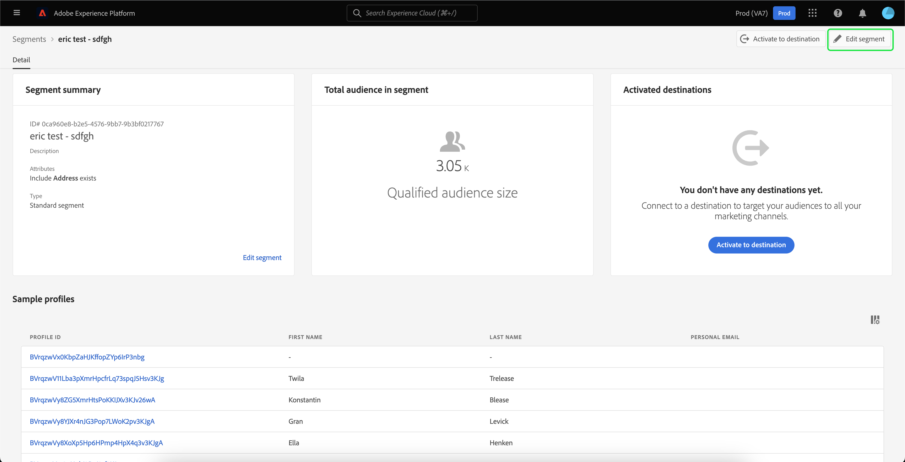
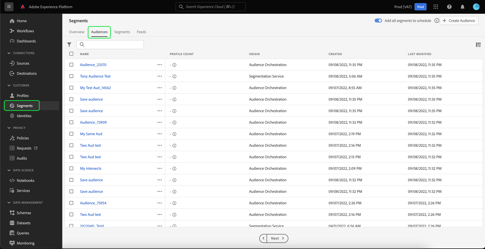
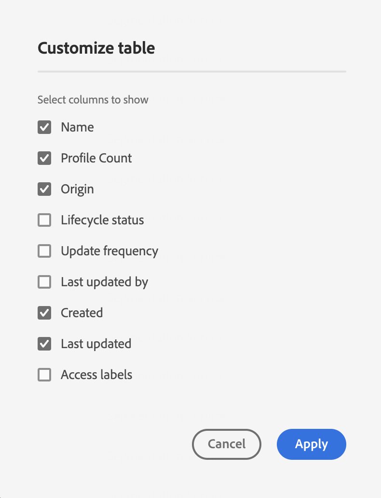
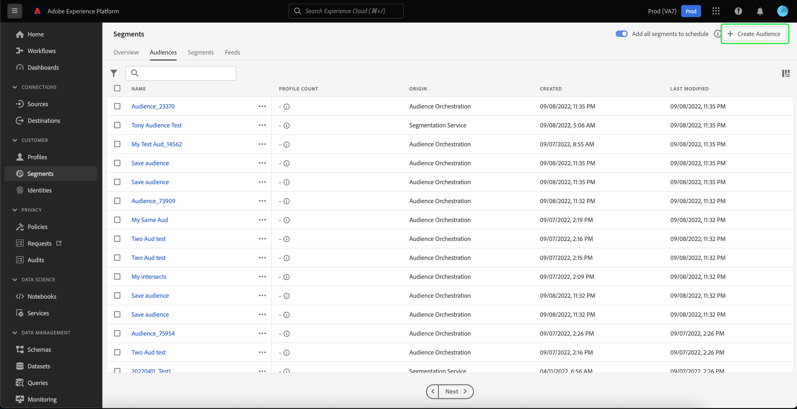

# 세그멘테이션 서비스 UI 안내서

[!DNL Adobe Experience Platform Segmentation Service] 세그먼트 정의를 만들고 관리하기 위한 사용자 인터페이스를 제공합니다.

## 시작하기

세그먼트 정의를 사용하려면 [!DNL Experience Platform] 세그먼테이션과 관련된 서비스. 이 사용 안내서를 읽기 전에 다음 서비스에 대한 설명서를 검토하십시오.

- [[!DNL Segmentation Service]](../home.md): [!DNL Segmentation Service] 에 저장된 데이터를 나눌 수 있습니다. [!DNL Experience Platform] 개인(예: 고객, 잠재 고객, 사용자 또는 조직)과 관련이 있습니다.
- [[!DNL Real-Time Customer Profile]](../../profile/home.md): 여러 소스에서 집계된 데이터를 기반으로 통합된 실시간 소비자 프로필을 제공합니다.
- [[!DNL Adobe Experience Platform Identity Service]](../../identity-service/home.md): 수집할 여러 데이터 소스의 ID를 결합하여 고객 프로필을 만들 수 있습니다. [!DNL Platform].
- [[!DNL Experience Data Model (XDM)]](../../xdm/home.md): 표준화된 프레임워크 [!DNL Platform] 고객 경험 데이터를 구성합니다. 세그멘테이션을 가장 잘 사용하려면 데이터가 [데이터 모델링 우수 사례](../../xdm/schema/best-practices.md).

또한 이 문서를 통해 사용되는 두 가지 주요 용어를 알고 이 용어 간의 차이점을 이해하는 것이 중요합니다.
- **세그먼트 정의**: 대상 대상의 주요 특성이나 동작을 설명하는 데 사용되는 규칙 세트입니다.
- **Audience**: 세그먼트 정의 기준을 충족하는 결과 프로필 집합입니다. Adobe Experience Platform(플랫폼 생성 대상)를 통해 또는 외부 소스(외부에서 생성된 대상)에서 만들 수 있습니다.

## 개요

Experience Platform UI에서 **[!UICONTROL 세그먼트]** 왼쪽 탐색에서 를 클릭하여 **[!UICONTROL 개요]** 탭이 표시되어 있습니다 [!UICONTROL 세그먼트] 대시보드 .

>[!NOTE]
>
>조직이 Platform을 처음 사용하고 아직 활성 프로필 데이터 세트 또는 병합 정책이 만들어지지 않은 경우, [!UICONTROL 세그먼트] 대시보드가 표시되지 않습니다. 대신, [!UICONTROL 개요] 탭에는 세그먼트를 시작하는 데 도움이 되는 링크 및 설명서가 표시됩니다.

### [!UICONTROL 세그먼트] 대시보드 {#segments-dashboard}

다음 **[!UICONTROL 세그먼트]** 대시보드는 조직의 세그먼트 데이터와 관련된 주요 지표에 대해 설명합니다.

자세한 내용은 [세그먼트 대시보드 안내서](../../dashboards/guides/segments.md).

## 찾아보기 {#browse}

>[!CONTEXTUALHELP]
>id="platform_segments_browse_churncolumnname"
>title="이탈"
>abstract="이탈은 세그먼트 작업이 마지막으로 실행된 시간과 비교하여 세그먼트 정의에서 변경되는 프로필의 백분율을 나타냅니다."

>[!CONTEXTUALHELP]
>id="platform_segments_browse_evaluationmethodcolumnname"
>title="평가 메서드"
>abstract="세그먼트 평가 메서드에는 배치, 스트리밍과 에지가 포함됩니다."

>[!CONTEXTUALHELP]
>id="platform_segments_browse_addallsegmentstoschedule"
>title="예약에 모든 세그먼트 추가"
>abstract="활성화하여 매일 예약된 업데이트에 모든 배치 평가 세그먼트를 포함합니다. 비활성화하여 예약된 업데이트에서 모든 세그먼트를 제거합니다."

을(를) 선택합니다 **[!UICONTROL 찾아보기]** 탭의 을 클릭하여 조직의 모든 세그먼트 정의 목록을 확인합니다.

이 보기는 프로필 수, 만든 날짜 및 마지막 수정 날짜를 포함하여 세그먼트 정의에 대한 정보를 나열합니다.

을(를) 선택하여 이 표시에 필드를 추가할 수 있습니다 . 이러한 추가 필드에는 분류, 이탈, 평가 방법 및 작업 ID가 포함됩니다.

분류를 선택하면 표시에 다음 각 상태에 속한 프로필의 비율을 나타내는 막대 그래프가 표시됩니다. [!UICONTROL 실현], [!UICONTROL 기존], 및 [!UICONTROL 종료 중]. 또한, [!UICONTROL 찾아보기] 탭은 세그먼트 상태의 가장 정확한 분류입니다. 이 숫자가 에 명시된 것과 다른 경우 [!UICONTROL 개요] 탭에서 [!UICONTROL 찾아보기] 탭을 올바른 정보 소스로 사용하여 [!UICONTROL 개요] 탭 번호는 하루에 한 번만 업데이트됩니다.

| 상태 | 설명 |
| ------ | ----------- |
| 실현 | 세그먼트 내의 새 프로필. |
| 기존 | 세그먼트 내에 남아 있는 기존 프로필. |
| 종료 중 | 세그먼트를 떠나는 기존 프로필. |

이탈은 세그먼트 작업이 마지막으로 실행된 시간과 비교하여 세그먼트 정의 내에서 변경되는 프로필의 비율을 나타내는 반면 프로필 수는 세그먼트에 적합한 총 프로필 수를 나타냅니다.

상기 평가 방법은 스트리밍, 일괄 처리 또는 에지 중 하나일 수 있다. 스트리밍 세그먼트는 데이터가 시스템에 들어올 때 지속해서 평가됩니다. 배치 세그먼트는 설정된 스케줄에 따라 평가됩니다. 에지 세그먼트는 실시간으로 평가되며, 동일한 페이지 및 다음 페이지 개인화 사용 사례를 허용합니다.

페이지 맨 위에는 예약에 모든 세그먼트를 추가하고 새 세그먼트를 만드는 옵션이 있습니다.

전환 **[!UICONTROL 예약에 모든 세그먼트 추가]** 이(가) 예약된 세그먼테이션을 활성화합니다. 예약된 세그먼테이션에 대한 자세한 내용은 [이 사용 안내서의 예약된 세그먼테이션 섹션](#scheduled-segmentation).

선택 **[!UICONTROL 세그먼트 만들기]** 세그먼트 빌더로 이동합니다. 세그먼트 만들기에 대한 자세한 내용은 [사용 안내서에서 세그먼트 만들기](#create-segment).

오른쪽 사이드바는 총 세그먼트 수, 마지막 평가 날짜, 다음 평가 날짜 및 평가 방법별 세그먼트 분류를 나열하는 조직 내의 모든 세그먼트에 대한 정보를 포함합니다.

세그먼트 정의의 행을 선택하면 세그먼트를 편집 또는 삭제하고, 세그먼트를 대상으로 활성화, 세그먼트의 적절한 대상, 세그먼트의 총 대상 크기, 세그먼트의 이름, 설명, 평가 방법, 만든 날짜 및 마지막 수정 날짜 외에 세그먼트 정의의 요약이 제공됩니다.

>[!NOTE]
>
> 다음을 수행합니다 **not** 대상 활성화에서 사용되는 세그먼트를 삭제할 수 있습니다.

## 세그먼트 정의 세부 사항 {#segment-details}

특정 세그먼트 정의에 대한 자세한 내용을 보려면 **[!UICONTROL 찾아보기]** 탭.

세그먼트 세부 사항 페이지가 나타납니다. 맨 위에는 세그먼트 정의 요약, 적합한 대상 크기에 대한 정보 및 세그먼트가 활성화된 대상이 있습니다.

### 세그먼트 요약 {#segment-summary}

다음 **[!UICONTROL 세그먼트 요약]** 섹션에서는 ID, 이름, 설명 및 속성에 대한 세부 사항과 같은 정보를 제공합니다.

또한 세그먼트를 대상으로 활성화하거나 세그먼트를 편집할 수 있는 옵션이 제공됩니다. 선택 **[!UICONTROL 대상에 활성화]** 을 사용하면 세그먼트를 대상에 활성화할 수 있습니다. 대상으로 세그먼트 활성화에 대한 자세한 내용은 [활성화 개요](../../destinations/ui/activation-overview.md).

선택 **[!UICONTROL 세그먼트 편집]** 그러면 [!DNL Segment Builder]. 를 사용하는 방법에 대한 자세한 정보 [!DNL Segment Builder] 작업 영역, [[!DNL Segment Builder] 사용 안내서](./segment-builder.md).

### 세그먼트의 총 대상

다음 **[!UICONTROL 세그먼트의 총 대상]** 섹션에는 세그먼트에 적합한 총 프로필 수가 표시됩니다.

추정은 해당 날의 샘플 데이터의 샘플 크기를 사용하여 생성됩니다. 프로필 저장소에 100만 개 미만의 엔티티가 있는 경우 전체 데이터 세트가 사용됩니다. 100만~2000만 개 업체가 이용한다. 그리고 2천만 개 이상의 개체들에 대해서, 전체 개체 중 5%가 사용됩니다. 세그먼트 예상 생성에 대한 자세한 내용은 [생성 예상](../tutorials/create-a-segment.md#estimate-and-preview-an-audience) 세그먼트 만들기 자습서입니다.

### 활성화된 대상

다음 **[!UICONTROL 활성화된 대상]** 섹션에는 이 세그먼트가 활성화된 대상이 표시됩니다.

>[!NOTE]
>
> 대상은 [!DNL Adobe Real-Time Customer Data Platform], 및에서 데이터를 외부 플랫폼으로 내보낼 수 있습니다. 대상에 대한 자세한 내용은 [대상 개요](../../destinations/home.md). 대상에 세그먼트를 활성화하는 방법을 알아보려면 [활성화 개요](../../destinations/ui/activation-overview.md).

### 프로필 샘플

다음은 세그먼트에 대한 자격이 되는 프로필의 샘플링이며 [!DNL Profile] ID, 이름, 성 및 개인 이메일.

데이터 샘플링을 트리거하는 방법은 수집 방법에 따라 다릅니다.

일괄 처리를 위해 프로필 저장소는 15분마다 자동으로 검사하여 마지막 샘플링 작업이 실행된 이후에 새 일괄 처리가 성공적으로 수집되었는지 확인합니다. 이 경우 프로필 스토어는 나중에 스캔되어 레코드 수가 5% 이상 변경되었는지 확인합니다. 이러한 조건이 충족되면 새 샘플링 작업이 트리거됩니다.

스트리밍 수집의 경우 프로필 저장소는 매시간마다 자동으로 검사되어 레코드 수가 5% 이상 변경되었는지 확인합니다. 이 조건이 충족되면 새 샘플링 작업이 트리거됩니다.

검색 샘플 크기는 프로필 저장소의 전체 개체 수에 따라 다릅니다. 이러한 샘플 크기는 다음 표에 나와 있습니다.

| 프로필 저장소의 엔터티 | 샘플 크기 |
| ------------------------- | ----------- |
| 100만 미만 | 전체 데이터 세트 |
| 1~2,000만 | 100만 |
| 2천만 명 이상 | 합계의 5% |

각각에 대한 자세한 정보 [!DNL Profile] 을(를) 선택하여 볼 수 있습니다. [!DNL Profile] ID. 프로필의 세부 사항에 대해 자세히 알아보려면 [[!DNL Real-Time Customer Profile] 사용 안내서](../../profile/ui/user-guide.md#profile-detail).

## 세그먼트 작성 {#create-segment}

선택 **[!UICONTROL 세그먼트 만들기]** 오른쪽 상단 모서리에서 [!DNL Segment Builder] 작업 공간. 세그먼트 정의 만들기를 시작할 수 있습니다.

### [!DNL Segment Builder] 작업 공간

[!DNL Segment Builder] 는 상호 작용할 수 있는 풍부한 작업 공간을 제공합니다. [!DNL Profile] 데이터 요소. 작업 공간에서는 데이터 속성을 표시하는 데 사용되는 드래그 앤 드롭 타일과 같이 규칙을 만들고 편집하기 위한 직관적인 컨트롤을 제공합니다.

를 사용하는 방법에 대한 자세한 정보 [!DNL Segment Builder] 작업 영역, [[!DNL Segment Builder] 사용 안내서](./segment-builder.md).

## 예약된 세그먼테이션 {#scheduled-segmentation}

세그먼트 정의가 만들어지면 온디맨드 또는 예약된(연속) 평가를 통해 평가할 수 있습니다. 평가는 움직이는 것을 의미합니다 [!DNL Real-Time Customer Profile] 해당 대상을 생성하기 위해 세그먼트 정의를 통한 데이터. 대상자를 만들면 대상자를 저장 및 저장하여 을 사용하여 내보낼 수 있습니다 [!DNL Experience Platform] API.

주문형 평가에는 API를 사용하여 평가를 수행하고 필요에 따라 대상을 빌드하는 작업이 포함되지만, 예약된 평가(&#39;예약된 세그먼테이션&#39;이라고도 함)를 사용하면 특정 시간(최대, 일별)에 세그먼트 정의를 평가하는 반복 일정을 만들 수 있습니다.

### 예약된 세그먼테이션 활성화 {#enable-scheduled-segmentation}

예약된 평가를 위한 세그먼트 정의 활성화는 UI 또는 API를 사용하여 수행할 수 있습니다. UI에서 로 돌아갑니다. **[!UICONTROL 찾아보기]** 내 탭 **[!UICONTROL 세그먼트]** 켜기/끄기 **[!UICONTROL 예약에 모든 세그먼트 추가]**. 이렇게 하면 조직에서 설정한 일정을 기반으로 모든 세그먼트를 평가하게 됩니다.

>[!NOTE]
>
>샌드박스에 대해 예약된 평가를 사용하도록 설정할 수 있으며 최대 5개의 병합 정책이 있습니다 [!DNL XDM Individual Profile]. 조직에 5개 이상의 병합 정책이 있는 경우 [!DNL XDM Individual Profile] 단일 샌드박스 환경 내에서 예약된 평가를 사용할 수 없습니다.

예약은 현재 API를 사용해서만 만들 수 있습니다. API를 사용하여 일정을 만들고, 편집하고, 작업하는 방법에 대한 자세한 단계는 세그먼트 결과를 평가하고 액세스하는 자습서, 특히 [API를 사용하여 예약된 평가](../tutorials/evaluate-a-segment.md#scheduled-evaluation).

## Audiences {#audiences}

>[!IMPORTANT]
>
>대상 기능은 현재 제한된 베타에 있으며 일부 사용자는 사용할 수 없습니다. 설명서 및 기능은 변경될 수 있습니다.

을(를) 선택합니다 **[!UICONTROL 대상]** 탭을 클릭하여 조직의 모든 대상 목록을 확인합니다.

기본적으로 이 보기에는 이름, 프로필 수, 원본, 만든 날짜 및 마지막 수정 날짜를 포함한 대상에 대한 정보가 표시됩니다.

을(를) 선택할 수 있습니다  아이콘을 클릭하여 표시되는 필드를 변경할 수 있습니다.

테이블 내에 표시할 수 있는 모든 필드를 나열하는 팝오버가 나타납니다.

| 필드 | 설명 |
| ----- | ----------- | 
| [!UICONTROL 이름] | 대상자의 이름입니다. |
| [!UICONTROL 프로필 개수] | 대상자에 적합한 총 프로필 수입니다. |
| [!UICONTROL Origin] | 대상자의 기원. 이 대상이 플랫폼에서 생성된 경우 세그먼테이션 서비스의 출처가 있게 됩니다. |
| [!UICONTROL 라이프사이클 상태] | 대상자의 상태입니다. 이 필드에 사용할 수 있는 값은 다음과 같습니다 `Draft`, `Published`, 및 `Archived`. |
| [!UICONTROL 업데이트 빈도] | 대상자의 데이터가 업데이트되는 빈도를 설명하는 값입니다. 이 필드에 사용할 수 있는 값은 다음과 같습니다 `On Demand`, `Scheduled`, 및 `Continuous`. |
| [!UICONTROL 마지막으로 업데이트한 사람] | 대상자를 마지막으로 업데이트한 사람의 이름입니다. |
| [!UICONTROL 생성됨] | 대상자를 만든 시간과 날짜입니다. |
| [!UICONTROL 마지막으로 업데이트됨] | 대상자를 마지막으로 만든 시간과 날짜입니다. |
| [!UICONTROL 레이블 액세스] | 대상의 액세스 레이블입니다. 액세스 레이블을 사용하면 해당 데이터에 적용되는 사용 정책에 따라 데이터 세트와 필드를 분류할 수 있습니다. 이러한 레이블은 언제든지 적용할 수 있으므로 데이터를 관리하는 방법을 유연하게 선택할 수 있습니다. 액세스 레이블에 대한 자세한 내용은 [레이블 관리](../../access-control/abac/ui/labels.md). |

선택할 수 있습니다 **[!UICONTROL 대상 만들기]** 대상자를 만들려면 다음을 수행하십시오.

대상자를 작성하거나 규칙을 작성할 때 선택할 수 있는 팝업 창이 나타납니다.

선택 **[!UICONTROL 대상자 작성]** 대상 빌더로 이동합니다. 대상자 만들기에 대한 자세한 내용은 [Audience Builder 안내서](./audience-builder.md).

선택 **[!UICONTROL 빌드 규칙]** 세그먼트 빌더로 이동합니다. 세그먼트 만들기에 대한 자세한 내용은 [세그먼트 빌더 안내서](./segment-builder.md)

## 대상 세부 사항 {#audience-details}

특정 대상에 대한 자세한 내용을 보려면 [!UICONTROL 대상] 탭.

대상 세부 사항 페이지가 나타납니다. 이 페이지는 대상이 Adobe Experience Platform으로 생성되었는지 또는 Audience Orchestration과 같은 외부 소스에서 생성되었는지 여부에 따라 세부 사항이 다릅니다.

### 플랫폼 생성 대상

플랫폼에서 생성한 대상에 대한 자세한 내용은 [세그먼트 요약 섹션](#segment-summary).

### 외부에서 생성된 대상

대상 세부 사항 페이지 맨 위에는 대상 요약 및 대상이 저장된 데이터 세트에 대한 세부 사항이 있습니다.

다음 **[!UICONTROL 대상 요약]** 섹션에서는 ID, 이름, 설명 및 속성에 대한 세부 사항과 같은 정보를 제공합니다.

다음 **[!UICONTROL 데이터 세트 세부 정보]** 이 섹션에서는 이름, 설명, 테이블 이름, 소스 및 스키마와 같은 정보를 제공합니다. 선택할 수 있습니다 **[!UICONTROL 데이터 집합 보기]** 데이터 세트에 대한 자세한 내용을 보려면 를 참조하십시오.

| 필드 | 설명 |
| ----- | ----------- |
| [!UICONTROL 이름] | 데이터 세트의 이름입니다. |
| [!UICONTROL 설명] | 데이터 집합에 대한 설명입니다. |
| [!UICONTROL 테이블 이름] | 데이터 집합의 테이블 이름. |
| [!UICONTROL 소스] | 데이터 세트의 소스. 외부에서 생성된 대상의 경우 이 값은 다음과 같습니다 **스키마**. |
| [!UICONTROL 스키마] | 데이터 세트에 해당하는 XDM 스키마 유형입니다. |

데이터 세트에 대한 자세한 내용은 [데이터 세트 개요](../../catalog/datasets/overview.md).

## 스트리밍 세그멘테이션 {#streaming-segmentation}

스트리밍 세그먼테이션은 [!DNL Platform] 거의 실시간으로, 데이터 풍부함에 초점을 둡니다. 스트리밍 세그먼테이션을 사용하면 데이터가 .. [!DNL Platform], 세그먼테이션 작업을 예약하고 실행할 필요성을 완화합니다.

스트리밍 세그멘테이션에 대한 자세한 내용은 [스트리밍 세그멘테이션 사용 안내서](./streaming-segmentation.md).

>[!NOTE]
>
>스트리밍 세그먼테이션이 작동하려면 조직에 대해 예약된 세그먼테이션을 활성화해야 합니다. 예약된 세그멘테이션 활성화에 대한 자세한 내용은 [이 사용 안내서의 스트리밍 세그멘테이션 섹션](#scheduled-segmentation).

## 에지 세그멘테이션 {#edge-segmentation}

Edge Segmentation은 Platform의 세그먼트를 즉시 평가하여 동일한 페이지와 다음 페이지 개인화 사용 사례를 가능하게 하는 기능입니다.

에지 세그멘테이션에 대한 자세한 내용은 [edge segmentation UI 안내서](./edge-segmentation.md)

## 정책 위반

>[!NOTE]
>
>대상에 지정된 세그먼트를 만드는 경우에만 정책 위반이 적용됩니다.

세그먼트 만들기가 완료되면 세그먼트 내에 정책 위반이 없도록 Adobe Experience Platform 데이터 거버넌스에서 세그먼트를 분석합니다. 자세한 내용은 [데이터 거버넌스 개요](../../data-governance/home.md) 추가 정보.

## 다음 단계 및 추가 리소스 {#next-steps}

다음 [!DNL Segmentation Service] UI는 마케팅 가능한 대상을 [!DNL Real-Time Customer Profile] 데이터.

에 대해 자세히 알아보려면 [!DNL Segmentation Service]을 클릭하여 문서를 계속 읽으십시오. 를 사용하는 방법을 배우려면 [!DNL Segmentation Service] API입니다. [[!DNL Segmentation Service] 개발자 안내서](../api/overview.md).
