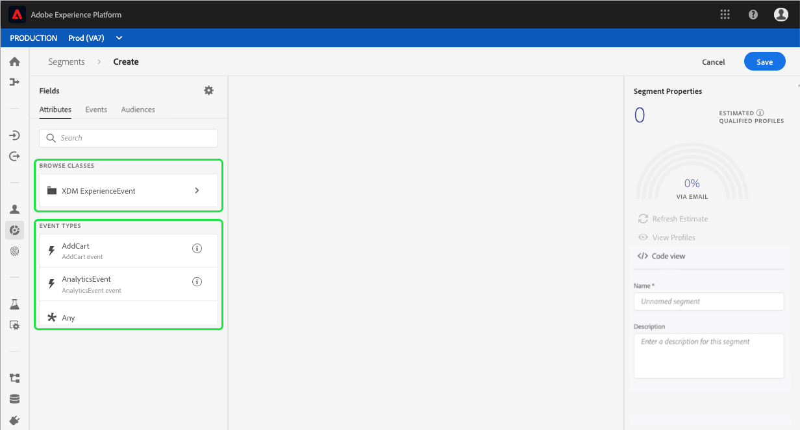

# [!DNL Segment Builder] UI 안내서

[!DNL Segment Builder] 는  [!DNL Profile] 데이터 요소와 상호 작용할 수 있는 풍부한 작업 공간을 제공합니다. 작업 공간에서는 데이터 속성을 표시하는 데 사용되는 드래그 앤 드롭 타일과 같이 규칙을 만들고 편집하기 위한 직관적인 컨트롤을 제공합니다.

## 세그먼트 정의 빌딩 블록

세그먼트 정의의 기본 구성 요소는 속성 및 이벤트입니다. 또한 기존 대상에 포함된 속성 및 이벤트를 새 정의에 구성 요소로 사용할 수도 있습니다.

이러한 구성 요소는 [!DNL Segment Builder] 작업 공간 왼쪽에 있는 **[!UICONTROL 필드]** 섹션에서 볼 수 있습니다. **** 필드에는 각 기본 빌딩 블록에 대한 탭이 포함되어 있습니다.&quot;[!UICONTROL 속성]&quot;, &quot;[!UICONTROL 이벤트]&quot; 및 &quot;[!UICONTROL 대상]&quot;.

### 속성

**[!UICONTROL 속성]** 탭에서는 [!DNL XDM Individual Profile] 클래스에 속하는 [!DNL Profile] 속성을 검색할 수 있습니다. 각 폴더를 확장하여 추가 속성을 표시할 수 있습니다. 이 경우 각 속성은 작업 공간의 중심에 있는 규칙 빌더 캔버스로 드래그할 수 있습니다. [규칙 빌더 캔버스](#rule-builder-canvas)에 대해서는 이 안내서의 뒷부분에서 자세히 설명합니다.

### 이벤트

**[!UICONTROL 이벤트]** 탭에서는 [!DNL XDM ExperienceEvent] 데이터 요소를 사용하여 발생한 이벤트 또는 작업을 기반으로 대상을 만들 수 있습니다. 또한 **[!UICONTROL 이벤트]** 탭에서 이벤트 유형을 찾을 수 있습니다. 이 탭은 세그먼트를 보다 신속하게 만들 수 있도록 일반적으로 사용되는 이벤트의 컬렉션입니다.

[!DNL ExperienceEvent] 요소를 찾을 수 있을 뿐만 아니라 이벤트 유형을 검색할 수도 있습니다. 이벤트 유형은 [!DNL ExperienceEvents] 과 동일한 코딩 로직을 사용하므로 올바른 이벤트를 찾는 [!DNL XDM ExperienceEvent] 클래스를 검색할 필요가 없습니다. 예를 들어 검색 막대를 사용하여 &quot;cart&quot;를 검색하면 세그먼트 정의를 작성할 때 매우 일반적으로 사용되는 두 가지 장바구니 작업인 이벤트 유형 &quot;[!UICONTROL AddCart]&quot; 및 &quot;[!UICONTROL RemoveCart]&quot;가 반환됩니다.

[Lucene의 검색 구문](https://docs.microsoft.com/en-us/azure/search/query-lucene-syntax)을 사용하는 검색 막대에 구성 요소의 이름을 입력하여 모든 유형의 구성 요소를 검색할 수 있습니다. 전체 단어를 입력하면 검색 결과가 입력되기 시작합니다. 예를 들어 XDM 필드 `ExperienceEvent.commerce.productViews`를 기반으로 규칙을 만들려면 검색 필드에 &quot;product views&quot;를 입력을 시작합니다. &quot;product&quot;라는 단어를 입력하면 검색 결과가 나타납니다. 각 결과에는 해당 객체가 속한 객체 계층이 포함됩니다.

>[!NOTE]
>
>조직에서 정의한 사용자 정의 스키마 필드를 나타나려면 최대 24시간이 걸릴 수 있으며 빌드 규칙에 사용할 수 있습니다.

그런 다음 [!DNL ExperienceEvents] 및 &quot;[!UICONTROL 이벤트 유형]&quot;을 세그먼트 정의에 쉽게 끌어다 놓을 수 있습니다.

기본적으로 데이터 저장소에서 채워진 스키마 필드만 표시됩니다. 여기에는 &quot;[!UICONTROL 이벤트 유형]&quot;이 포함됩니다. &quot;[!UICONTROL 이벤트 유형]&quot; 목록이 표시되지 않거나, &quot;[!UICONTROL Any]&quot;을 &quot;[!UICONTROL 이벤트 유형]&quot;으로 선택할 수만 있는 경우, **[!UICONTROL 필드]** 옆에 있는 **톱니바퀴 아이콘**&#x200B;을 선택한 다음, **[!UICONTROL 전체 XDM 스키마 표시]**&#x200B;를 ]**아래에서 선택합니다.**[!UICONTROL  **톱니바퀴 아이콘**&#x200B;을 다시 선택하여 **[!UICONTROL 필드]** 탭으로 돌아가십시오. 이제 데이터가 포함되어 있는지 여부에 관계없이 여러 &quot;[!UICONTROL 이벤트 유형]&quot;과 스키마 필드를 볼 수 있습니다.

### 대상자

**[!UICONTROL 대상]** 탭에는 Adobe Audience Manager과 같이 외부 소스에서 가져온 모든 대상과 [!DNL Experience Platform] 내에서 만든 대상이 나열됩니다.

**[!UICONTROL 대상]** 탭에서 사용 가능한 모든 소스를 폴더 그룹으로 볼 수 있습니다. 폴더를 선택하면 사용 가능한 하위 폴더와 대상을 볼 수 있습니다. 또한 폴더 구조(현재 있는 폴더를 나타내는 확인 표시)를 보기 위해 폴더 아이콘(오른쪽 이미지에 표시)을 선택하고 트리에서 폴더 이름을 선택하여 폴더를 쉽게 다시 탐색할 수 있습니다.

대상 ⓘ 옆에 있는 를 마우스로 가리키면 대상 ID, 설명 및 폴더 계층 구조를 포함하여 대상에 대한 정보를 보고 대상을 찾을 수 있습니다.

[Lucene의 검색 구문](https://docs.microsoft.com/en-us/azure/search/query-lucene-syntax)을 사용하는 검색 막대를 사용하여 대상을 검색할 수도 있습니다. **[!UICONTROL 대상]** 탭에서 최상위 폴더를 선택하면 검색 막대가 나타나고 해당 폴더 내에서 검색할 수 있습니다. 전체 단어를 입력한 경우에만 검색 결과가 채워집니다. 예를 들어 `Online Shoppers` 라는 대상자를 찾으려면 검색 창에 &quot;Online&quot;을 입력을 시작합니다. &quot;Online&quot;이라는 단어가 완전히 입력되면 &quot;Online&quot;이라는 단어가 포함된 검색 결과가 나타납니다.

## 규칙 빌더 캔버스 {#rule-builder-canvas}

세그먼트 정의는 타겟 대상의 주요 특성이나 행동을 설명하는 데 사용되는 규칙 모음입니다. 이러한 규칙은 [!DNL Segment Builder] 중심에 있는 규칙 빌더 캔버스를 사용하여 만들어집니다.

세그먼트 정의에 새 규칙을 추가하려면 **[!UICONTROL 필드]** 탭에서 타일을 끌어서 규칙 빌더 캔버스에 놓습니다. 추가된 데이터의 유형에 따라 컨텍스트별 선택 사항이 표시됩니다. 사용 가능한 데이터 유형은 다음과 같습니다.문자열, 날짜, [!DNL ExperienceEvents], &quot;[!UICONTROL 이벤트 유형]&quot; 및 대상.

>[!IMPORTANT]
>
>Adobe Experience Platform에 대한 최신 변경 사항으로 이벤트 간 `OR` 및 `AND` 논리 연산자의 사용이 업데이트되었습니다. 이러한 업데이트는 기존 세그먼트에 영향을 주지 않습니다. 그러나 기존 세그먼트와 새 세그먼트 생성에 대한 모든 후속 업데이트는 이러한 변경 사항의 영향을 받습니다. 자세한 내용은 [시간 상수 업데이트](./segment-refactoring.md)를 참조하십시오.

### 대상자 추가

**[!UICONTROL 대상]** 탭의 대상을 규칙 빌더 캔버스로 끌어다 놓아 새 세그먼트 정의에서 대상 멤버십을 참조할 수 있습니다. 이렇게 하면 대상 멤버십을 새 세그먼트 규칙에 속성으로 포함하거나 제외할 수 있습니다.

[!DNL Segment Builder] 을 사용하여 만든 [!DNL Platform] 대상의 경우, 대상을 해당 대상의 세그먼트 정의에 사용된 규칙 세트로 변환하는 옵션이 제공됩니다. 이러한 변환에서는 규칙 로직의 복사본을 만들며, 원래 세그먼트 정의에 영향을 주지 않고 수정할 수 있습니다. 세그먼트 논리를 규칙 로직으로 변환하기 전에 최근 변경 사항을 세그먼트 정의에 저장했는지 확인하십시오.

>[!NOTE]
>
>외부 소스에서 대상을 추가할 때 대상 멤버십만 참조됩니다. 대상자를 규칙으로 변환할 수 없으므로 원래 대상을 만드는 데 사용되는 규칙은 새 세그먼트 정의에서 수정할 수 없습니다.

대상자를 규칙으로 변환할 때 충돌이 발생하는 경우 [!DNL Segment Builder]은(는) 기존 옵션을 최대한 유지하려고 합니다.

### 코드 보기

또는 [!DNL Segment Builder]에서 만든 규칙의 코드 기반 버전을 볼 수 있습니다. 규칙 빌더 캔버스 내에서 규칙을 만들면 **[!UICONTROL 코드 보기]**&#x200B;를 선택하여 세그먼트를 PQL로 볼 수 있습니다.

코드 보기는 API 호출에 사용할 세그먼트 값을 복사할 수 있는 단추를 제공합니다. 최신 버전의 세그먼트를 가져오려면 세그먼트에 최신 변경 사항을 저장했는지 확인하십시오.

### 집계 함수

[!DNL Segment Builder]의 집계는 데이터 유형이 숫자(double 또는 정수)인 XDM 속성 그룹에 대한 계산입니다. 세그먼트 빌더 내에서 지원되는 네 가지 집계 함수는 SUM, AVERAGE, MIN 및 MAX입니다.

집계 함수를 만들려면 왼쪽 레일에서 이벤트를 선택하고 [!UICONTROL Events] 컨테이너에 삽입합니다.

이벤트 컨테이너 내에 이벤트를 배치한 후 줄임표 아이콘(...)을 선택하고 뒤에 **[!UICONTROL 집계]**&#x200B;를 추가합니다.

이제 집계가 추가됩니다. 이제 합계 함수를 선택하고 합계를 생성할 속성, 같음 함수 및 값을 선택할 수 있습니다. 아래 예제에서 이 세그먼트는 각 개별 구매가 $100보다 작은 경우에도 $100보다 큰 구매 값의 합계가 있는 모든 프로필에 적합합니다.

### 개수 함수 {#count-functions}

세그먼트 빌더의 카운트 함수는 지정된 이벤트를 찾고 수집된 횟수를 계산하는 데 사용됩니다. 세그먼트 빌더에서 지원되는 수 함수는 &quot;최소&quot;, &quot;최대&quot;, &quot;정확히&quot;, &quot;사이&quot; 및 &quot;모두&quot;입니다.

카운트 함수를 만들려면 왼쪽 레일에서 이벤트를 선택하고 [!UICONTROL Events] 컨테이너에 삽입합니다.

이벤트 컨테이너 내에 이벤트를 배치한 후 [!UICONTROL 최소 1] 단추를 선택합니다.

이제 카운트 함수가 추가되었습니다. 이제 카운트 함수와 함수의 값을 선택할 수 있습니다. 아래 예는 하나 이상의 클릭이 있는 이벤트를 포함하는 것입니다.

## 컨테이너

세그먼트 규칙은 나열된 순서로 평가됩니다. 컨테이너를 사용하면 중첩된 쿼리를 사용하여 실행 순서를 제어할 수 있습니다.

규칙 빌더 캔버스에 적어도 한 개의 타일을 추가한 후에는 컨테이너 추가를 시작할 수 있습니다. 새 컨테이너를 만들려면 타일의 오른쪽 상단 모서리에서 줄임표(..)를 선택한 다음 **[!UICONTROL 컨테이너 추가]**&#x200B;를 선택합니다.

새 컨테이너가 첫 번째 컨테이너의 자식으로 표시되지만 컨테이너를 드래그하여 이동하여 계층을 조정할 수 있습니다. 컨테이너의 기본 동작은 제공된 특성, 이벤트 또는 대상을 &quot;[!UICONTROL Include]&quot;로 지정합니다. 타일의 왼쪽 위 모서리에서 **[!UICONTROL 포함]**&#x200B;을 선택하고 &quot;[!UICONTROL 제외]&quot;를 선택하면 규칙을 컨테이너 기준과 일치하는 &quot;[!UICONTROL 제외]&quot; 프로필로 설정할 수 있습니다.

하위 컨테이너에서 &quot;컨테이너 줄바꿈 해제&quot;를 선택하여 하위 컨테이너를 추출하고 상위 컨테이너에 인라인으로 추가할 수도 있습니다. 하위 컨테이너의 오른쪽 위 모서리에서 줄임표(...)를 선택하여 이 옵션에 액세스합니다.

**[!UICONTROL 컨테이너 래핑 취소]**&#x200B;를 선택하면 하위 컨테이너가 제거되고 기준이 인라인으로 표시됩니다.

>[!NOTE]
>
>컨테이너를 래핑하지 않을 때는 논리가 원하는 세그먼트 정의를 계속 충족하는지 확인하십시오.

## 병합 정책

[!DNL Experience Platform] 을(를) 사용하면 여러 소스에서 데이터를 결합하여 각 개별 고객에 대한 전체 보기를 볼 수 있습니다. 이 데이터를 함께 가져올 때 병합 정책은 [!DNL Platform]에서 데이터의 우선 순위가 지정되는 방식과 프로필을 만들기 위해 결합할 데이터를 결정하는 규칙입니다.

이 대상의 마케팅 목적과 일치하는 병합 정책을 선택하거나 [!DNL Platform]에서 제공하는 기본 병합 정책을 사용할 수 있습니다. 고유한 기본 병합 정책을 만드는 등 조직에 고유한 여러 병합 정책을 만들 수 있습니다. 조직의 병합 정책 만들기에 대한 단계별 지침은 [병합 정책 개요](../../profile/merge-policies/overview.md)를 읽어서 시작하십시오.

세그먼트 정의에 대한 병합 정책을 선택하려면 **[!UICONTROL 필드]** 탭에서 톱니바퀴 아이콘을 선택한 다음, **[!UICONTROL 병합 정책]** 드롭다운 메뉴를 사용하여 사용할 병합 정책을 선택합니다.

## 세그먼트 속성

세그먼트 정의를 작성할 때 작업 공간 오른쪽에 있는 **[!UICONTROL 세그먼트 속성]** 섹션에 결과 세그먼트의 예상 크기가 표시되므로 대상 자체를 작성하기 전에 필요에 따라 세그먼트 정의를 조정할 수 있습니다.

**[!UICONTROL 세그먼트 속성]** 섹션도 세그먼트 정의에 대한 중요한 정보(이름 및 설명 포함)를 지정할 수 있습니다. 세그먼트 정의 이름은 조직에서 정의한 세그먼트 중에서 식별하는 데 사용되므로 설명적이고 간결하며 고유해야 합니다.

세그먼트 정의를 계속 작성할 때 **[!UICONTROL 프로필 보기]**&#x200B;를 선택하여 페이지의 미리 보기를 볼 수 있습니다.

>[!NOTE]
>
>대상 추정은 해당 날의 샘플 데이터의 샘플 크기를 사용하여 생성됩니다. 프로필 저장소에 100만 개 미만의 엔티티가 있는 경우 전체 데이터 세트가 사용됩니다.100만~2000만 개 업체가 이용한다.그리고 2천만 개 이상의 개체들에 대해서, 전체 개체 중 5%가 사용됩니다. 세그먼트 예상 생성에 대한 자세한 내용은 세그먼트 생성 자습서의 [예측 생성 섹션](../tutorials/create-a-segment.md#estimate-and-preview-an-audience)에 있습니다.

## 다음 단계 {#next-steps}

세그먼트 빌더는 마케팅 가능한 대상을 [!DNL Real-time Customer Profile] 데이터에서 분리할 수 있는 풍부한 워크플로우를 제공합니다. 이 안내서를 읽은 후에는 다음을 수행할 수 있습니다.

- 특성, 이벤트 및 기존 대상을 빌딩 블록으로 조합하여 세그먼트 정의를 만듭니다.
- 규칙 빌더 캔버스 및 컨테이너를 사용하여 세그먼트 규칙이 실행되는 순서를 제어합니다.
- 필요에 따라 세그먼트 정의를 조정할 수 있도록 예상 대상에 대한 예측을 봅니다.
- 예약된 세그먼테이션에 대해 모든 세그먼트 정의를 활성화합니다.
- 스트리밍 세그멘테이션에 지정된 세그먼트 정의를 사용합니다.

[!DNL Segmentation Service]에 대해 자세히 알아보려면 설명서를 계속 읽고 관련 비디오를 시청하여 학습 내용을 보완하십시오. [!DNL Segmentation Service] UI의 다른 부분에 대한 자세한 내용은 [[!DNL Segmentation Service] 사용 안내서](./overview.md)를 참조하십시오
