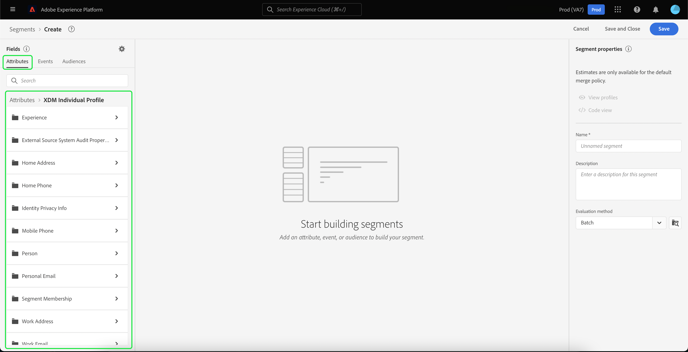
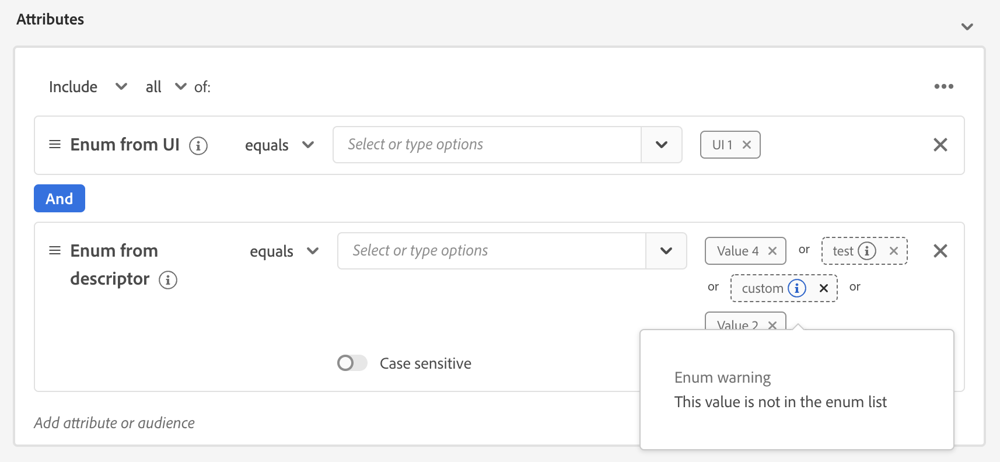
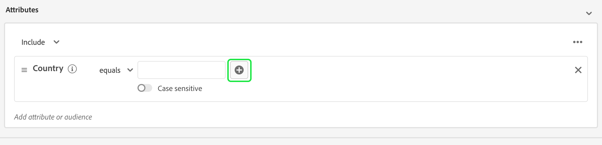
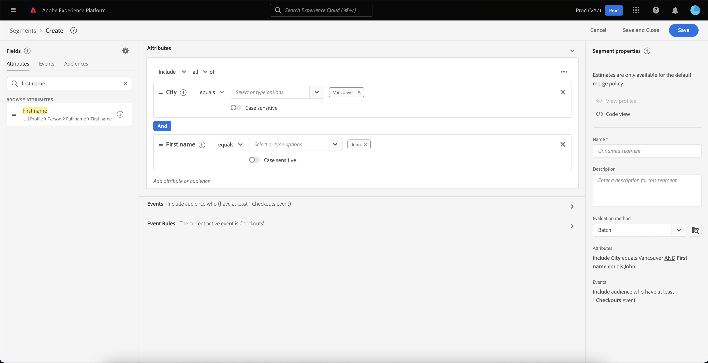
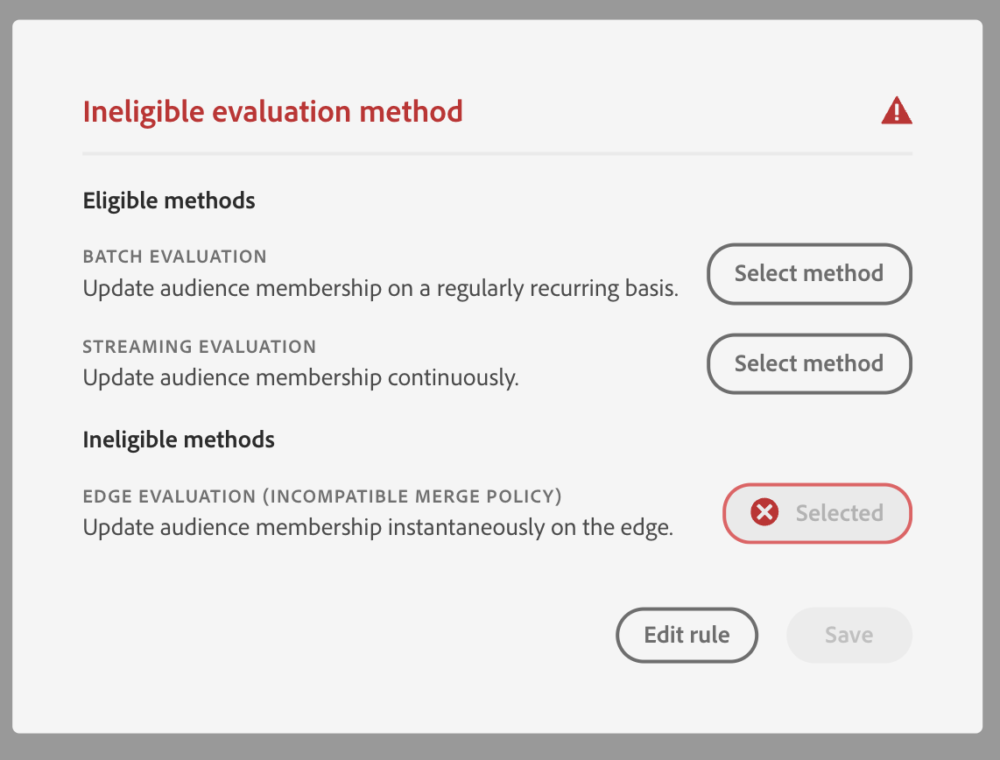

# [!DNL Segment Builder] UI 안내서

>[!NOTE]
>
>이 안내서에서는 다음을 통해 대상자를 만드는 방법을 설명합니다. **세그먼트 정의** 세그먼트 빌더 사용. 대상자 구성을 사용하여 대상자를 만드는 방법을 알아보려면 다음을 읽어 보십시오. [대상 구성 UI 안내서](./audience-composition.md).

[!DNL Segment Builder] 에서는 상호 작용할 수 있는 다양한 작업 영역을 제공합니다. [!DNL Profile] 데이터 요소. 작업 공간에서는 데이터 속성을 표시하는 데 사용되는 드래그 앤 드롭 타일과 같은 규칙을 작성하고 편집할 수 있는 직관적인 컨트롤을 제공합니다.

## 세그먼트 정의 빌딩 블록 {#building-blocks}

>[!CONTEXTUALHELP]
>id="platform_segments_createsegment_segmentbuilder_fields"
>title="필드"
>abstract="세그먼트 대상을 구성하는 세 가지 필드 유형은 속성, 이벤트와 대상자입니다. 속성을 통해 XDM 개별 프로필 클래스에 속한 프로필 속성을 사용하고, 이벤트를 통해 XDM ExperienceEvent 데이터 요소로 인해 발생하는 작업 또는 이벤트를 기반으로 대상자를 만들고, 대상자를 통해 외부 소스에서 가져온 대상자를 사용할 수 있습니다."

세그먼트 정의의 기본 구성 요소는 속성 및 이벤트입니다. 또한 기존 대상자에 포함된 속성 및 이벤트를 새 정의의 구성 요소로 사용할 수 있습니다.

다음 빌딩 블록을 확인할 수 있습니다. **[!UICONTROL 필드]** 의 왼쪽에 있는 섹션 [!DNL Segment Builder] 작업 영역. **[!UICONTROL 필드]** 각 기본 빌딩 블록에 대한 탭을 포함합니다.&quot;[!UICONTROL 속성]&quot;, &quot;[!UICONTROL 이벤트]&quot;, 및 &quot;[!UICONTROL 대상]&quot;.

### 속성

다음 **[!UICONTROL 속성]** 탭을 사용하여 찾아보기 [!DNL Profile] 에 속한 속성 [!DNL XDM Individual Profile] 클래스. 각 폴더를 확장하여 추가 속성을 표시할 수 있습니다. 여기서 각 속성은 작업 영역 중앙의 규칙 빌더 캔버스로 드래그할 수 있는 타일입니다. 다음 [규칙 빌더 캔버스](#rule-builder-canvas) 에 대해서는 이 안내서의 뒷부분에서 자세히 설명합니다.

### 이벤트

다음 **[!UICONTROL 이벤트]** 탭에서는 을 사용하여 발생한 이벤트 또는 작업을 기반으로 대상자를 만들 수 있습니다. [!DNL XDM ExperienceEvent] 데이터 요소. 이벤트 유형은에서 찾을 수도 있습니다. **[!UICONTROL 이벤트]** 탭은 세그먼트 정의를 보다 빠르게 만들 수 있도록 일반적으로 사용되는 이벤트 모음입니다.

을(를) 탐색할 수 있을 뿐만 아니라 [!DNL ExperienceEvent] 요소를 사용하여 이벤트 유형을 검색할 수도 있습니다. 이벤트 유형은 와 동일한 코딩 논리를 사용합니다. [!DNL ExperienceEvents]를 검색하는 대신 [!DNL XDM ExperienceEvent] 올바른 이벤트를 찾는 클래스입니다. 예를 들어 검색 막대를 사용하여 &quot;장바구니&quot;를 검색하면 이벤트 유형 &quot;[!UICONTROL AddCart]&quot; 및 &quot;[!UICONTROL RemoveCart]세그먼트 정의를 작성할 때 매우 일반적으로 사용되는 두 가지 장바구니 작업입니다.

검색 창에서 구성 요소의 이름을 입력하여 모든 유형의 구성 요소를 검색할 수 있습니다. [Lucene 검색 구문](https://docs.microsoft.com/en-us/azure/search/query-lucene-syntax). 전체 단어를 입력하면 검색 결과가 채워지기 시작합니다. 예를 들어 XDM 필드를 기반으로 규칙을 만들려면 `ExperienceEvent.commerce.productViews`을(를) 클릭하고 검색 필드에 &quot;제품 보기&quot;를 입력합니다. &quot;product&quot;라는 단어를 입력한 후에는 검색 결과가 나타나기 시작합니다. 각 결과에는 해당 결과가 속한 객체 계층 구조가 포함됩니다.

>[!NOTE]
>
>조직에서 정의한 사용자 정의 스키마 필드가 표시되고 규칙 작성에 사용할 수 있게 되는 데 최대 24시간이 걸릴 수 있습니다.

그런 다음 쉽게 끌어서 놓을 수 있습니다 [!DNL ExperienceEvents] 및 &quot;[!UICONTROL 이벤트 유형]세그먼트 정의에 &quot;을 추가합니다.

기본적으로 데이터 저장소에서 채워진 스키마 필드만 표시됩니다. 여기에는 &quot;[!UICONTROL 이벤트 유형]&quot;. 인 경우[!UICONTROL 이벤트 유형]&quot;목록이 표시되지 않거나 &quot;만 선택할 수 있습니다.&quot;[!UICONTROL 임의]&quot; as a &quot;[!UICONTROL 이벤트 유형]&quot;, 다음을 선택합니다. **톱니바퀴 아이콘** 다음에 **[!UICONTROL 필드]**&#x200B;을 선택한 다음 을 선택합니다. **[!UICONTROL 전체 XDM 스키마 표시]** 아래에 **[!UICONTROL 사용 가능한 필드]**. 다음 항목 선택 **톱니바퀴 아이콘** 을(를) 다시 방문하여 **[!UICONTROL 필드]** 탭으로 이동하여 이제 여러 을(를) 볼 수 있습니다.[!UICONTROL 이벤트 유형]데이터가 포함되어 있는지 여부에 관계없이 및 스키마 필드.

#### Adobe Analytics 보고서 세트 데이터 세트

단일 또는 여러 Adobe Analytics 보고서 세트의 데이터를 세그멘테이션 내의 이벤트로 사용할 수 있습니다.

단일 Analytics 보고서 세트의 데이터를 사용하는 경우 Platform이 설명자와 친숙한 이름을 eVar에 자동으로 추가하므로 내에서 해당 필드를 더 쉽게 찾을 수 있습니다 [!DNL Segment Builder].

여러 Analytics 보고서 세트, Platform의 데이터를 사용할 때 **할 수 없음** 설명자 또는 친숙한 이름을 eVar에 자동으로 추가합니다. 따라서 Analytics 보고서 세트의 데이터를 사용하기 전에 XDM 필드에 매핑해야 합니다. Analytics 변수를 XDM에 매핑하는 방법에 대한 자세한 내용은 [Adobe Analytics 소스 연결 안내서](../../sources/tutorials/ui/create/adobe-applications/analytics.md#mapping).

예를 들어 다음 변수를 가진 두 개의 보고서 세트가 있는 상황을 생각해 보십시오.

| 필드 | 보고서 세트 스키마 A | 보고서 세트 스키마 B |
| ----- | --------------------- | --------------------- |
| eVar1 | 참조 도메인 | 로그인 Y/N |
| eVar2 | 페이지 이름 | 멤버 충성도 ID |
| eVar3 | URL | 페이지 이름 |
| eVar4 | 검색어 | 제품 이름 |
| event1 | 클릭 수 | 페이지 보기 횟수 |
| event2 | 페이지 보기 횟수 | 장바구니 추가 |
| event3 | 장바구니 추가 | 체크아웃 |
| event4 | 구매 | 구매 |

이 경우 두 보고서 세트를 다음 스키마에 매핑할 수 있습니다.

>[!NOTE]
>
>일반 eVar 값이 여전히 채워지는 동안 **아님** 값은 보고서에 원래 있었던 것과 다른 것을 의미할 수 있으므로 세그먼트 정의에 사용하십시오(가능한 경우).

보고서 세트가 매핑되면 프로필 관련 워크플로우 및 세그멘테이션 내에서 이러한 새로 매핑된 필드를 사용할 수 있습니다.

| 시나리오 | 유니온 스키마 경험 | 세그먼테이션 일반 변수 | 세그먼테이션 매핑된 변수 |
| -------- | ----------------------- | ----------------------------- | ---------------------------- |
| 단일 보고서 세트 | 친숙한 이름 설명자는 일반 변수에 포함됩니다.   **예:** 페이지 이름(eVar2) | <ul><li>일반 변수에 포함된 알기 쉬운 이름 설명자</li><li>쿼리는 특정 데이터 세트만 사용하므로 해당 데이터 세트의 데이터를 사용합니다</li></ul> | 쿼리는 Adobe Analytics 데이터 및 잠재적으로 다른 소스를 사용할 수 있습니다. |
| 여러 보고서 세트 | 친숙한 이름 설명자는 일반 변수에 포함되지 않습니다.   **예:** eVar | <ul><li>여러 설명자가 있는 필드는 일반으로 표시됩니다. 즉, UI에 친숙한 이름이 표시되지 않습니다.</li><li>쿼리는 eVar이 포함된 모든 데이터 세트의 데이터를 사용할 수 있으며, 이로 인해 혼합 또는 잘못된 결과가 발생할 수 있습니다.</li></ul> | 쿼리는 여러 데이터 세트에서 올바르게 결합된 결과를 사용합니다. |

### 대상자

>[!NOTE]
>
>Platform 내에서 생성된 대상의 경우 이 포함된 대상만 **동일** 병합 정책이 표시됩니다.

다음 **[!UICONTROL 대상]** 탭에는 Adobe Audience Manager과 같은 외부 소스에서 가져온 모든 대상과 내에서 만든 대상이 나열됩니다. [!DNL Experience Platform].

다음에서 **[!UICONTROL 대상]** 탭에서는 사용 가능한 모든 소스를 폴더 그룹으로 볼 수 있습니다. 폴더를 선택하면 사용 가능한 하위 폴더와 대상이 표시됩니다. 또한 폴더 구조(현재 있는 폴더를 확인 표시)를 보고 트리에서 폴더 이름을 선택하여 폴더를 쉽게 탐색할 수 있도록 폴더 아이콘(맨 오른쪽 그림에 표시됨)을 선택할 수 있습니다.

대상자 옆에 있는 ⓘ을 마우스로 가리키면 해당 ID, 설명 및 폴더 계층 구조를 포함하여 대상자에 대한 정보를 확인하여 대상자를 찾을 수 있습니다.

을 활용하는 검색 창을 사용하여 대상자를 검색할 수도 있습니다. [Lucene 검색 구문](https://docs.microsoft.com/en-us/azure/search/query-lucene-syntax). 다음에서 **[!UICONTROL 대상]** 탭에서 최상위 폴더를 선택하면 해당 폴더 내에서 검색할 수 있는 검색 창이 나타납니다. 전체 단어를 입력하면 검색 결과만 채워집니다. 예를 들어, 다음 이름의 대상을 찾으려면 `Online Shoppers`검색 창에서 &quot;온라인&quot;을 입력합니다. &quot;Online&quot;이라는 단어를 모두 입력하면 &quot;Online&quot;이라는 단어가 포함된 검색 결과가 나타납니다.

## 규칙 빌더 캔버스 {#rule-builder-canvas}

세그먼트 정의는 타겟 대상의 주요 특성 또는 동작을 설명하는 데 사용되는 규칙 컬렉션입니다. 이러한 규칙은 의 중앙에 있는 규칙 빌더 캔버스를 사용하여 만들어집니다. [!DNL Segment Builder].

세그먼트 정의에 새 규칙을 추가하려면 **[!UICONTROL 필드]** 를 탭하여 규칙 빌더 캔버스에 놓습니다. 그런 다음 추가되는 데이터 유형에 따라 컨텍스트별 옵션이 표시됩니다. 사용 가능한 데이터 유형에는 문자열, 날짜, [!DNL ExperienceEvents], &quot;[!UICONTROL 이벤트 유형]및 대상자를 포함할 필요가 없습니다.

>[!IMPORTANT]
>
>Adobe Experience Platform에 대한 최신 변경 사항으로 의 사용이 업데이트되었습니다. `OR` 및 `AND` 이벤트 간 논리 연산자. 이러한 업데이트는 기존 세그먼트 정의에 영향을 주지 않습니다. 그러나 기존 세그먼트 정의 및 새로 생성된 세그먼트 정의에 대한 모든 후속 업데이트는 이러한 변경 사항의 영향을 받습니다. 다음을 읽으십시오. [시간 상수 업데이트](./segment-refactoring.md) 추가 정보.

속성에 대한 값을 선택하면 속성이 될 수 있는 열거형 값 목록이 표시됩니다.

이 열거형 목록에서 값을 선택하면 값이 단색 테두리로 요약됩니다. 단, 를 사용하는 필드의 경우 `meta:enum` (소프트) 열거형, 다음 값을 선택할 수도 있습니다. **아님** 열거형 목록에서 고유한 값을 만들면 이 값이 열거형 목록에 없다는 경고와 함께 점선 테두리로 윤곽선이 표시됩니다.

여러 값을 만드는 경우 일괄 업로드를 사용하여 한 번에 모든 값을 추가할 수 있습니다. 다음 항목 선택  표시 방법 **[!UICONTROL 값 일괄 추가]** 팝오버.

다음에서 **[!UICONTROL 값 일괄 추가]** 팝오버로 CSV 또는 TSV 파일을 업로드할 수 있습니다.

![[일괄 처리로 값 추가] 팝오버가 표시됩니다. CSV 또는 TSV 파일을 업로드하도록 선택할 수 있는 대화 상자가 강조 표시됩니다.](../images/ui/segment-builder/bulk-values-popover.png)

또는 수동으로 쉼표로 구분된 값을 추가할 수 있습니다.

![[일괄 처리로 값 추가] 팝오버가 표시됩니다. 값을 삽입하는 데 사용할 수 있는 대화 상자와 추가된 값이 모두 강조 표시됩니다.](../images/ui/segment-builder/bulk-values-comma-separated.png)

허용되는 값은 최대 250개입니다. 이 금액을 초과하면 추가하기 전에 일부 값을 제거해야 합니다.

### 대상자 추가

에서 대상을 끌어다 놓을 수 있습니다. **[!UICONTROL 대상자]** 새 세그먼트 정의에서 대상 멤버십을 참조하도록 규칙 빌더 캔버스에 탭을 놓습니다. 이렇게 하면 새 세그먼트 정의 규칙에 속성으로 대상 멤버십을 포함하거나 제외할 수 있습니다.

대상 [!DNL Platform] 을 사용하여 생성된 대상자 [!DNL Segment Builder], 대상자를 해당 대상자에 대한 세그먼트 정의에 사용된 규칙 세트로 변환하는 옵션이 제공됩니다. 이 변환은 규칙 논리의 사본을 만들어 원본 세그먼트 정의에 영향을 주지 않고 수정할 수 있습니다. 세그먼트 정의를 규칙 논리로 변환하기 전에 최근 변경 사항을 저장했는지 확인하십시오.

>[!NOTE]
>
>외부 소스에서 대상을 추가할 때 대상 멤버십만 참조됩니다. 대상자를 규칙으로 변환할 수 없으므로 원래 대상자를 만드는 데 사용된 규칙은 새 세그먼트 정의에서 수정할 수 없습니다.

대상을 규칙으로 변환할 때 충돌이 발생하는 경우 [!DNL Segment Builder] 은 최대한 기존 옵션을 유지하려고 합니다.

### 코드 보기

또는에서 만든 규칙의 코드 기반 버전을 볼 수 있습니다 [!DNL Segment Builder]. 규칙 빌더 캔버스 내에서 규칙을 만든 후에는 다음을 선택할 수 있습니다. **[!UICONTROL 코드 보기]** 세그먼트 정의를 PQL로 봅니다.

코드 보기는 API 호출에 사용할 세그먼트 정의의 값을 복사할 수 있도록 하는 단추를 제공합니다. 최신 버전의 세그먼트 정의를 가져오려면 세그먼트 정의에 대한 최신 변경 사항을 저장했는지 확인합니다.

### 집계 함수

의 집계 [!DNL Segment Builder] 는 데이터 유형이 숫자(실수 또는 정수)인 XDM 속성 그룹에 대한 계산입니다. 세그먼트 빌더 내에서 지원되는 네 가지 집계 함수는 SUM, AVERAGE, MIN 및 MAX입니다.

집계 함수를 만들려면 왼쪽 레일에서 이벤트를 선택하고 [!UICONTROL 이벤트] 컨테이너.

이벤트 컨테이너 내에 이벤트를 배치한 후 줄임표 아이콘(...)을 선택한 다음 을 클릭합니다 **[!UICONTROL 집계]**.

이제 합계가 추가됩니다. 이제 집계 함수를 선택하고 집계할 속성, 같음 함수와 값을 선택할 수 있습니다. 아래 예에서, 이 세그먼트 정의는 개별 구매가 $100 미만이더라도 구매한 값의 합계가 $100보다 큰 모든 프로필에 자격을 부여합니다.

### 함수 계산 {#count-functions}

세그먼트 빌더의 카운트 함수는 지정된 이벤트를 검색하고 해당 이벤트가 수행된 횟수를 카운트하는 데 사용됩니다. 세그먼트 빌더에서 지원되는 카운트 함수는 &quot;최소&quot;, &quot;최대&quot;, &quot;정확히&quot;, &quot;사이&quot; 및 &quot;모두&quot;입니다.

카운트 기능을 만들려면 왼쪽 레일에서 이벤트를 선택하고 [!UICONTROL 이벤트] 컨테이너.

이벤트 컨테이너 내에 이벤트를 배치한 후 [!UICONTROL 최소 1개] 단추를 클릭합니다.

이제 count 함수가 추가되었습니다. 이제 count 함수와 함수 값을 선택할 수 있습니다. 아래 예제는 최소 한 번의 클릭이 있는 이벤트를 포함하는 것입니다.

## 컨테이너

세그먼트 규칙은 나열된 순서대로 평가됩니다. 컨테이너를 사용하면 중첩 쿼리를 사용하여 실행 순서를 제어할 수 있습니다.

규칙 빌더 캔버스에 타일을 하나 이상 추가하면 컨테이너를 추가할 수 있습니다. 새 컨테이너를 만들려면 타일의 오른쪽 상단 모서리에서 생략 부호(...)를 선택한 다음 을 선택합니다 **[!UICONTROL 컨테이너 추가]**.

새 컨테이너가 첫 번째 컨테이너의 하위 컨테이너로 표시되지만 컨테이너를 드래그 앤 이동하여 계층을 조정할 수 있습니다. 컨테이너의 기본 비헤이비어는 입니다.[!UICONTROL 포함]&quot;제공된 속성, 이벤트 또는 대상자입니다. 규칙을 &quot;[!UICONTROL 제외]다음을 선택하여 컨테이너 기준과 일치하는 프로필 **[!UICONTROL 포함]** 타일의 왼쪽 상단 모서리에서 을(를) 선택하고[!UICONTROL 제외]&quot;.

하위 컨테이너에서 &quot;컨테이너 래핑 해제&quot;를 선택하여 하위 컨테이너를 추출하여 상위 컨테이너에 인라인으로 추가할 수도 있습니다. 이 옵션에 액세스하려면 하위 컨테이너의 오른쪽 위 모서리에서 생략 부호(...)를 선택합니다.

다음을 선택하면 **[!UICONTROL 컨테이너 풀기]** 하위 컨테이너가 제거되고 기준이 인라인으로 표시됩니다.

>[!NOTE]
>
>컨테이너의 배치를 해제할 때 논리가 원하는 세그먼트 정의를 계속 충족하도록 주의하십시오.

## 병합 정책

>[!CONTEXTUALHELP]
>id="platform_segmentation_createSegment_segmentBuilder_mergePolicies"
>title="병합 정책"
>abstract="병합 정책은 서로 다른 데이터 세트의 병합을 활성화하여 프로필을 형성합니다. 플랫폼에서 기본 병합 정책이 제공되었거나, 또는 [프로필]에서 새로운 기본 병합 정책을 생성할 수 있습니다. 이 대상자에 대해 마케팅 목적에 부합하는 병합 정책을 선택하십시오."

[!DNL Experience Platform] 를 사용하면 여러 소스에서 데이터를 한데 모아 각 개별 고객에 대한 전체 보기를 볼 수 있도록 결합할 수 있습니다. 이 데이터를 결합할 때 병합 정책은 [!DNL Platform] 는 을 사용하여 데이터의 우선 순위 지정 방법 및 어떤 데이터가 결합되어 프로필을 만들지 결정합니다.

이 대상자의 마케팅 목적에 부합하는 병합 정책을 선택하거나 제공된 기본 병합 정책을 사용할 수 있습니다. [!DNL Platform]. 고유한 기본 병합 정책 만들기를 포함하여 조직에 고유한 여러 병합 정책을 만들 수 있습니다. 조직의 병합 정책 작성에 대한 단계별 지침은 [병합 정책 개요](../../profile/merge-policies/overview.md).

세그먼트 정의에 대한 병합 정책을 선택하려면 **[!UICONTROL 필드]** 탭을 클릭한 다음 **[!UICONTROL 병합 정책]** 드롭다운 메뉴를 사용하여 사용할 병합 정책을 선택합니다.

## 세그먼트 정의 속성 {#segment-properties}

>[!CONTEXTUALHELP]
>id="platform_segments_createsegment_segmentbuilder_segmentproperties"
>title="세그먼트 정의 속성"
>abstract="세그먼트 대상 속성 섹션에는 총 프로필 개수와 비교하여 적격 프로필 개수를 표시하는 최종 세그먼트 대상 예상 크기가 표시됩니다. 필요에 따라 대상자 자체를 빌드하기 전에 세그먼트 정의를 조정할 수 있습니다."

>[!CONTEXTUALHELP]
>id="platform_segments_createsegment_segmentbuilder_refreshestimate"
>title="예상치 새로 고침"
>abstract="세그먼트 대상의 예상치를 새로 고쳐 제안된 세그먼트 대상에 적합한 프로필 개수를 미리 볼 수 있습니다. 당일 샘플 데이터의 샘플 크기를 사용하여 대상자 예상치를 생성합니다."
>additional-url="https://experienceleague.adobe.com/docs/experience-platform/segmentation/tutorials/create-a-segment.html#estimate-and-preview-an-audience" text="대상자 예측 및 미리보기"

세그먼트 정의를 작성할 때 **[!UICONTROL 세그먼트 속성]** 작업 영역 오른쪽의 섹션에는 결과 세그먼트 정의의 크기에 대한 예상치가 표시되어 대상 자체를 빌드하기 전에 필요에 따라 세그먼트 정의를 조정할 수 있습니다.

다음 **[!UICONTROL 세그먼트 속성]** 또한 섹션에서는 세그먼트 이름, 설명 및 평가 유형을 포함하여 세그먼트 정의에 대한 중요한 정보를 지정할 수 있습니다. 세그먼트 정의 이름은 조직에서 정의한 세그먼트 정의 중에서 세그먼트 정의를 식별하는 데 사용되므로 설명적이고 간결하며 고유해야 합니다.

세그먼트 정의를 계속 빌드할 때 을 선택하여 대상자에 대한 페이지 매김된 미리보기를 볼 수 있습니다. **[!UICONTROL 프로필 보기]**.

>[!NOTE]
>
>당일 샘플 데이터의 샘플 크기를 사용하여 대상자 예상치를 생성합니다. 프로필 스토어에 엔티티가 100만 개 미만인 경우 전체 데이터 세트가 사용됩니다. 엔티티가 1~2천만 개인 경우 100만 엔티티가 사용되며, 엔티티가 2,000만 개를 초과하는 경우 전체 엔티티의 5%가 사용됩니다. 세그먼트 정의에 대한 예상 값 생성에 대한 자세한 내용은 [예상 생성 섹션](../tutorials/create-a-segment.md#estimate-and-preview-an-audience) 세그먼트 정의 만들기 튜토리얼.

평가 방법을 선택할 수도 있습니다. 사용하려는 평가 방법을 알고 있는 경우 드롭다운 목록을 사용하여 원하는 평가 방법을 선택할 수 있습니다. 이 세그먼트 정의가 적합한 평가 유형을 알려면 찾아보기 아이콘을 선택할 수 있습니다  사용 가능한 세그먼트 정의 평가 방법 목록을 봅니다.

다음 [!UICONTROL 평가 방법 적격성] 팝오버가 표시됩니다. 이 팝오버에는 사용 가능한 평가 방법인 일괄 처리, 스트리밍 및 에지가 표시됩니다. 팝오버는 적격 및 부적격 평가 방법을 보여 줍니다. 세그먼트 정의에 사용한 매개 변수에 따라 특정 평가 방법에 적합하지 않을 수 있습니다. 각 평가 방법에 대한 요구 사항에 대한 자세한 내용은 다음을 참조하십시오. [스트리밍 세분화](./streaming-segmentation.md#query-types) 또는 [가장자리 세분화](./edge-segmentation.md#query-types) 개요.

잘못된 평가 방법을 선택하면 세그먼트 정의 규칙을 변경하거나 평가 방법을 변경하라는 메시지가 표시됩니다.

다양한 세그먼트 정의 평가 방법에 대한 자세한 내용은 [세그먼테이션 개요](../home.md#evaluate-segments).

## 다음 단계 {#next-steps}

세그먼트 빌더는 마케팅 가능한 대상자를 격리할 수 있는 풍부한 워크플로를 제공합니다. [!DNL Real-Time Customer Profile] 데이터. 이 안내서를 읽고 나면 다음과 같은 작업을 수행할 수 있습니다.

- 속성, 이벤트 및 기존 대상의 조합을 빌딩 블록으로 사용하여 세그먼트 정의를 만듭니다.
- 규칙 빌더 캔버스 및 컨테이너를 사용하여 세그먼트 규칙이 실행되는 순서를 제어합니다.
- 예상 대상의 예상치를 보고 필요에 따라 세그먼트 정의를 조정할 수 있습니다.
- 예약된 세분화에 대해 모든 세그먼트 정의를 활성화합니다.
- 스트리밍 세분화에 대해 지정된 세그먼트 정의를 활성화합니다.

에 대해 자세히 알아보기 [!DNL Segmentation Service], 설명서를 계속 읽고 관련 동영상을 시청하여 학습을 보완해 주시기 바랍니다. 의 다른 부분에 대해 자세히 알아보려면 [!DNL Segmentation Service] UI, 다음 내용을 읽으십시오. [[!DNL Segmentation Service] 사용 안내서](./overview.md)
