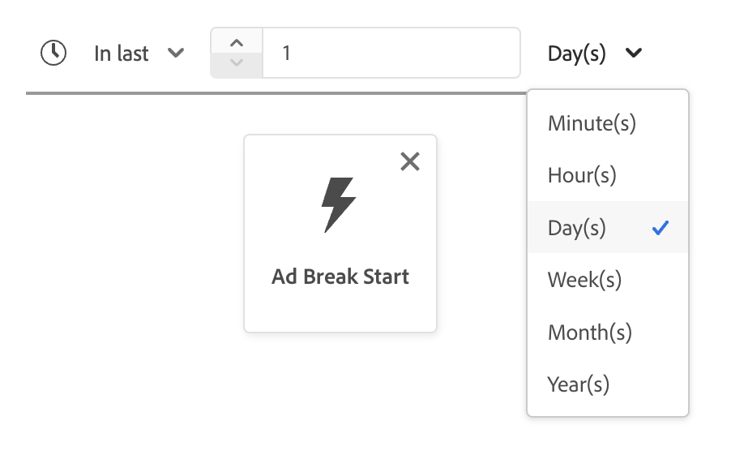

# [!DNL Segment Builder] UI 안내서

>[!NOTE]
>
>이 안내서에서는 세그먼트 빌더를 사용하여 **세그먼트 정의**&#x200B;를 통해 대상자를 만드는 방법을 설명합니다. 대상 구성을 사용하여 대상을 만드는 방법을 알아보려면 [대상 구성 UI 안내서](./audience-composition.md)를 읽어 보십시오.

[!DNL Segment Builder]에서는 [!DNL Profile]개의 데이터 요소와 상호 작용할 수 있는 다양한 작업 영역을 제공합니다. 작업 공간에서는 데이터 속성을 표시하는 데 사용되는 드래그 앤 드롭 타일과 같은 규칙을 작성하고 편집할 수 있는 직관적인 컨트롤을 제공합니다.

## 세그먼트 정의 빌딩 블록 {#building-blocks}

>[!CONTEXTUALHELP]
>id="platform_segments_createsegment_segmentbuilder_fields"
>title="필드"
>abstract="세그먼트 정의를 구성하는 세 가지 필드 유형은 속성, 이벤트와 대상자입니다. 속성을 통해 XDM 개별 프로필 클래스에 속한 프로필 속성을 사용하고, 이벤트를 통해 XDM ExperienceEvent 데이터 요소로 인해 발생하는 액션 또는 이벤트를 기반으로 대상자를 만들고, 대상자를 통해 외부 소스에서 가져온 대상자를 사용할 수 있습니다."

>[!CONTEXTUALHELP]
>id="platform_segmentation_segmentbuilder_showfullxdmschema"
>title="전체 XDM 스키마 표시"
>abstract="기본적으로 데이터가 포함된 필드만 표시됩니다. 이 옵션을 활성화하면 XDM 스키마의 모든 필드가 표시됩니다."

>[!CONTEXTUALHELP]
>id="platform_segmentation_segmentbuilder_showdeprecatedfields"
>title="사용되지 않는 필드 표시"
>abstract="기본적으로 사용되지 않는 XDM 필드는 표시되지 않습니다. 사용되지 않는 XDM 필드를 표시하려면 이 옵션을 활성화합니다."

세그먼트 정의의 기본 구성 요소는 속성 및 이벤트입니다. 또한 기존 대상자에 포함된 속성 및 이벤트를 새 정의의 구성 요소로 사용할 수 있습니다.

>[!CONTEXTUALHELP]
>id="platform_segments_createsegment_segmentbuilder_summarydata"
>title="요약 데이터"
>abstract="요약 데이터는 프로필 속성에 대해서만 나타나고 이벤트나 대상자 속성에는 나타나지 <b></b>않습니다.  다음과 같은 상황에서는 프로필 속성에 대한 요약 데이터가 나타나지 않을 수 있습니다. <ol><li>일부 속성 값의 문자 길이가 100자를 초과합니다.</li><li>속성에 대한 고유 값이 3000개를 초과합니다.</li></ol>"

>[!NOTE]
>
>속성의 정보 버블을 선택하면 필드의 요약 데이터라고도 하는 값 분포를 볼 수 있습니다. 특성 탭에서 사용할 수 있는 **전용**&#x200B;이며 이벤트 또는 대상 탭에서 사용할 수 없습니다.
>
>요약 데이터는 속성이 다음 기준을 충족하면 나타납니다. 속성의 모든 값은 100자 이하이며 속성에 대한 고유 값은 3000자 이하여야 합니다.
>
>그러나 관계를 통해 프로필에 연결된 다중 엔터티 데이터인 경우 특성에는 요약 데이터가 **없습니다**. 예를 들어 사용자 지정 스키마 `Vehicle`이(가) 있는 경우 **스키마 내의**&#x200B;속성`Vehicle`에 요약 데이터가 **없음**&#x200B;됩니다.

**[!UICONTROL Fields]** 작업 영역의 왼쪽에 있는 [!DNL Segment Builder] 섹션에서 이러한 기본 구성 요소를 볼 수 있습니다. **[!UICONTROL Fields]**&#x200B;에는 기본 빌딩 블록 &quot;[!UICONTROL Attributes]&quot;, &quot;[!UICONTROL Events]&quot; 및 &quot;[!UICONTROL Audiences]&quot;에 대한 탭이 있습니다.

### 속성

**[!UICONTROL Attributes]** 탭에서 [!DNL Profile] 클래스에 속하는 [!DNL XDM Individual Profile] 특성을 찾아볼 수 있습니다. 각 폴더를 확장하여 추가 속성을 표시할 수 있습니다. 여기서 각 속성은 작업 영역 중앙의 규칙 빌더 캔버스로 드래그할 수 있는 타일입니다. [규칙 빌더 캔버스](#rule-builder-canvas)에 대해서는 이 안내서의 뒷부분에서 자세히 설명합니다.

추가하는 속성은 다음 데이터 유형 중 하나일 수 있습니다.

| 데이터 유형 | 일반적인 사용 사례 |
| --------- | ---------------- |
| 문자열 | 이름, 이메일 주소, 제품 범주 |
| 숫자 | 연령, 수익, 제품 수량, 충성도 점수 |
| 부울 | 환경 설정, 상태 표시기, 사용자 플래그 |
| 열거형 | 성별 또는 상태 등 사전 정의된 목록 |
| 날짜/시간 | 구매 날짜, 방문 시간, 생일 |

각 데이터 유형에 다음 연산자를 사용할 수 있습니다.

+++ 문자열 연산자

| 연산자 | 설명 | 예 |
| -------- | ----------- | ------- |
| 다음과 같음 | 지정된 값과 정확히 일치하는 항목 찾기 | 이메일 **equals** &quot;sample@example.com&quot; |
| 같지 않음 | 지정된 값 제외 | 상태 **같지 않음** &quot;취소됨&quot; |
| 다음을 포함 | 텍스트에 지정된 값이 포함되어 있습니다 | 제품 이름 **포함** &quot;iPhone&quot; |
| 다음을 포함하지 않음 | 텍스트에 지정된 값이 포함되어 있지 않습니다 | 설명 **이(가) 다음을 포함하지 않음** &quot;중단됨&quot; |
| 다음으로 시작 | 텍스트는 지정된 값으로 시작됩니다 | 고객 ID **다음으로 시작** &quot;PREM&quot; |
| 다음으로 끝남 | 텍스트가 지정된 값으로 끝납니다 | **다음으로 끝남** &quot;@company.com&quot; |
| 존재 | 값이 있음 | 가운데 이름 **존재함** |
| 존재하지 않음 | 값이 존재하지 않습니다. | 충성도 상태 **이(가) 존재하지 않습니다** |

+++

+++ 숫자 연산자

| 연산자 | 설명 | 예 |
| -------- | ----------- | ------- |
| 다음과 같음 | 지정된 값과 정확히 일치하는 항목 찾기 | **같음** 25세 |
| 같지 않음 | 지정된 값 제외 | 주문 수 **이(가) 다음과 같지 않음** 0 |
| 다음보다 큼 | 지정한 값보다 **큰** 수입니다. 이 값은 지정된 숫자의 **exclusive**&#x200B;입니다. | 연간 매출 **보다 큼** 50000 |
| 크거나 같음 | 지정한 값보다 **큰** 수입니다. 이 값은 지정된 숫자의 **inclusive**&#x200B;입니다. | 나이 **크거나 같음** 21 |
| 다음보다 작음 | 지정한 값보다 **작은** 수입니다. 이 값은 지정된 숫자의 **exclusive**&#x200B;입니다. | 구매 이후 일 수 **미만** 30 |
| 작거나 같음 | 지정한 값보다 **작은** 수입니다. 이 값은 지정된 숫자의 **inclusive**&#x200B;입니다. | 장바구니 값 **작거나 같음** 100 |
| 간격: | 지정한 값의 수는 **between**&#x200B;입니다. 이 값은 지정된 숫자의 **inclusive**&#x200B;입니다. | **사이** 25세에서 45세 사이 |
| 존재 | 값이 있음 | 크레딧 스코어 **존재함** |
| 존재하지 않음 | 값이 존재하지 않습니다. | 크레딧 스코어 **없음** |

+++

+++ 부울 연산자

| 연산자 | 설명 | 예 |
| -------- | ----------- | ------- |
| 다음과 같음 | 부울 값을 지정된 값(True 또는 False)으로 설정합니다. | 이메일 옵트인 **이(가) True** |
| 같지 않음 | 부울 값이 지정된 값(True 또는 False)으로 설정된 **not**&#x200B;입니다. | 설치된 모바일 앱 **True와 같지 않음** |

+++

+++ 열거형 연산자

| 연산자 | 설명 | 예 |
| -------- | ----------- | ------- |
| 다음과 같음 | 값이 지정된 열거형 값과 같음 | 성별 **같음** 여성 |
| 같지 않음 | 값이 지정된 열거형 값과 같지 않습니다. | 주문 상태 **같지 않음** 취소됨 |
| 존재 | 열거형 값이 설정되었습니다. | 기본 언어 **존재함** |
| 존재하지 않음 | 열거형 값이 설정되지 않았습니다. | 기본 언어 **이(가) 없습니다** |

+++

+++ 날짜/시간 연산자

| 연산자 | 설명 | 예 |
| -------- | ----------- | ------- |
| 오늘 | 값이 오늘 발생했습니다. **연도 무시** 확인란을 선택하여 비교에서 연도를 무시하도록 할 수 있습니다. | 오늘 생년월일 **은(는)** |
| 어제 | 값이 어제 발생했습니다. | 어제 장바구니 구매 **is** |
| 이번 달 | 이 값은 이번 달에 발생했습니다. | 이번 달 생월 **은(는)** |
| 올해 | 이 값은 올해 발생했습니다. | 올해 등록 날짜 **은(는)** |
| 사용자 정의 날짜 | 해당 값이 해당 날짜에 발생했습니다. | 구매 날짜 **은(는)** 사용자 지정 날짜에 있음 |
| 마지막 | 선택한 마지막 기간 내에 값이 발생했습니다. 지난 달의 생일 **is** |
| 출처(대상) | 값이 선택한 두 캘린더 일자 내에서 발생했습니다. 이 기간은 두 날짜의 **포함**&#x200B;입니다. | 계정 생성일 **is**(4월 20일부터 7월 13일까지) |
| 다음 기간 동안 | 값이 선택한 월 또는 연도 내에 발생했습니다. | 3월 동안 **is** 판매 |
| 다음 범위 내(+/-) | 값은 선택한 날짜로부터 일, 주, 월 또는 년 이내에 발생했습니다. 이 기간은 두 날짜의 **포함**&#x200B;입니다. | 장바구니 포기는 **3일 이내** |
| 다음 이전 | 값이 선택한 날짜 이전에 발생했습니다. | 2025년 1월 3일 회원가입일은 **이전**&#x200B;입니다. |
| 후 | 값이 선택한 날짜 이후에 발생했습니다. | 구매 날짜는 2024년 3월 14일 **이후**&#x200B;입니다. |
| 롤링 범위 | 값이 두 상대적 날짜 사이에 발생했습니다. | 마지막 구매 날짜는 7일 전부터 3일 전까지의 순환 범위에 있습니다. |
| 다음에서 | 값이 선택한 다음 기간 내에 발생했습니다. | 2일 후 장바구니 포기 |

시간 및 날짜 함수에 대한 자세한 내용은 [시간 제한 섹션](#time-constraints)을 참조하세요.

+++

#### 계산된 속성 {#computed-attributes}

계산된 속성은 집계나 공식을 사용하여 다른 속성에서 계산된 필드입니다. 여러 이벤트에서 합계, 개수 또는 평균과 같은 집계된 데이터가 필요하거나 복잡한 계산이 필요한 자주 사용하는 대상을 작성하는 경우 계산된 속성을 사용할 수 있습니다.

연산 속성 작성 방법, 연산 속성 내에서 사용할 수 있는 함수, 연산 속성 관리 방법 등 연산 속성에 대한 자세한 내용은 [연산 속성 개요](/help/profile/computed-attributes/overview.md)를 참조하십시오.

### 이벤트

**[!UICONTROL Events]** 탭에서는 [!DNL XDM ExperienceEvent] 데이터 요소를 사용하여 발생한 이벤트 또는 작업을 기반으로 대상자를 만들 수 있습니다. **[!UICONTROL Events]** 탭에서도 이벤트 유형을 찾을 수 있습니다. 이벤트 유형은 세그먼트 정의를 더 빨리 만들 수 있도록 일반적으로 사용되는 이벤트 모음입니다.

[!DNL ExperienceEvent] 요소를 검색할 수 있을 뿐만 아니라 이벤트 유형을 검색할 수도 있습니다. 이벤트 유형은 올바른 이벤트를 찾기 위해 [!DNL ExperienceEvents] 클래스를 검색하지 않고도 [!DNL XDM ExperienceEvent]과(와) 동일한 코딩 논리를 사용합니다. 예를 들어 검색 창을 사용하여 &quot;장바구니&quot;를 검색하면 이벤트 유형 &quot;[!UICONTROL AddCart]&quot; 및 &quot;[!UICONTROL RemoveCart]&quot;이(가) 반환됩니다. 이 이벤트 유형은 세그먼트 정의를 작성할 때 매우 일반적으로 사용되는 두 가지 장바구니 작업입니다.

[Lucene의 검색 구문](https://docs.microsoft.com/en-us/azure/search/query-lucene-syntax)을 사용하는 검색 창에 구성 요소의 이름을 입력하여 모든 유형의 구성 요소를 검색할 수 있습니다. 전체 단어를 입력하면 검색 결과가 채워지기 시작합니다. 예를 들어 XDM 필드 `ExperienceEvent.commerce.productViews`을(를) 기반으로 규칙을 만들려면 검색 필드에 &quot;제품 보기&quot;를 입력하십시오. &quot;product&quot;라는 단어를 입력한 후에는 검색 결과가 나타나기 시작합니다. 각 결과에는 해당 결과가 속한 객체 계층 구조가 포함됩니다.

>[!NOTE]
>
>조직에서 정의한 사용자 정의 스키마 필드가 표시되고 규칙 작성에 사용할 수 있게 되는 데 최대 24시간이 걸릴 수 있습니다.

그런 다음 [!DNL ExperienceEvents] 및 &quot;[!UICONTROL Event Types]&quot;을(를) 세그먼트 정의로 쉽게 끌어다 놓을 수 있습니다.

기본적으로 데이터 저장소에서 채워진 스키마 필드만 표시됩니다. 여기에는 &quot;[!UICONTROL Event Types]&quot;이(가) 포함됩니다. &quot;[!UICONTROL Event Types]&quot; 목록이 표시되지 않거나 &quot;[!UICONTROL Any]&quot;을(를) &quot;[!UICONTROL Event Type]&quot;(으)로만 선택할 수 있는 경우 **옆의**&#x200B;톱니바퀴 아이콘&#x200B;**[!UICONTROL Fields]**&#x200B;을(를) 선택한 다음 **[!UICONTROL Show full XDM schema]**&#x200B;에서 **[!UICONTROL Available Fields]**&#x200B;을(를) 선택하십시오. **톱니바퀴 아이콘**&#x200B;을 다시 선택하여 **[!UICONTROL Fields]** 탭으로 돌아가십시오. 이제 데이터가 포함되어 있는지 여부에 관계없이 여러 &quot;[!UICONTROL Event Types]&quot; 및 스키마 필드를 볼 수 있습니다.

#### Adobe Analytics 보고서 세트 데이터 세트

단일 또는 여러 Adobe Analytics 보고서 세트의 데이터를 세그멘테이션 내의 이벤트로 사용할 수 있습니다.

단일 Analytics 보고서 세트의 데이터를 사용하는 경우 Experience Platform이 설명자와 친숙한 이름을 eVar에 자동으로 추가하므로 [!DNL Segment Builder] 내에서 해당 필드를 더 쉽게 찾을 수 있습니다.

여러 Analytics 보고서 세트의 데이터를 사용할 때 Experience Platform **cannot**&#x200B;은(는) 설명자나 친숙한 이름을 eVar에 자동으로 추가합니다. 따라서 Analytics 보고서 세트의 데이터를 사용하기 전에 XDM 필드에 매핑해야 합니다. Analytics 변수를 XDM에 매핑하는 방법에 대한 자세한 내용은 [Adobe Analytics 소스 연결 안내서](../../sources/tutorials/ui/create/adobe-applications/analytics.md#mapping)를 참조하십시오.

예를 들어 다음 변수를 가진 두 개의 보고서 세트가 있는 상황을 생각해 보십시오.

| 필드 | 보고서 세트 스키마 A | 보고서 세트 스키마 B |
| ----- | --------------------- | --------------------- |
| eVar | 참조 도메인 | 로그인 Y/N |
| eVar | 페이지 이름 | 멤버 충성도 ID |
| eVar | URL | 페이지 이름 |
| eVar | 검색어 | 제품 이름 |
| event1 | 클릭수 | 페이지 보기 횟수 |
| event2 | 페이지 보기 횟수 | 장바구니 추가 |
| event3 | 장바구니 추가 | 체크아웃 |
| event4 | 구매 | 구매 |

이 경우 두 보고서 세트를 다음 스키마에 매핑할 수 있습니다.

>[!NOTE]
>
>일반 eVar 값이 여전히 채워지지만 값은 보고서에 원래 있었던 것과 다른 것을 의미할 수 있으므로 세그먼트 정의에 해당 값을 **사용하지 않음**&#x200B;해야 합니다(가능한 경우).

보고서 세트가 매핑되면 프로필 관련 워크플로우 및 세그멘테이션 내에서 이러한 새로 매핑된 필드를 사용할 수 있습니다.

| 시나리오 | 유니온 스키마 경험 | 세그먼테이션 일반 변수 | 세그먼테이션 매핑된 변수 |
| -------- | ----------------------- | ----------------------------- | ---------------------------- |
| 단일 보고서 세트 | 친숙한 이름 설명자는 일반 변수에 포함됩니다.   **예:** 페이지 이름(eVar2) | <ul><li>일반 변수에 포함된 알기 쉬운 이름 설명자</li><li>쿼리는 특정 데이터 세트만 사용하므로 해당 데이터 세트의 데이터를 사용합니다</li></ul> | 쿼리는 Adobe Analytics 데이터 및 잠재적으로 다른 소스를 사용할 수 있습니다. |
| 여러 보고서 세트 | 친숙한 이름 설명자는 일반 변수에 포함되지 않습니다.   **예:** eVar2 | <ul><li>여러 설명자가 있는 필드는 일반으로 표시됩니다. 즉, UI에 친숙한 이름이 표시되지 않습니다.</li><li>쿼리는 eVar이 포함된 모든 데이터 세트의 데이터를 사용할 수 있으며, 이로 인해 혼합된 결과나 잘못된 결과가 나타날 수 있습니다.</li></ul> | 쿼리는 여러 데이터 세트에서 올바르게 결합된 결과를 사용합니다. |

### 대상자

>[!CONTEXTUALHELP]
>id="platform_segmentation_segmentBuilder_b2b_decomposition"
>title="복잡한 평가"
>abstract="다음 표현식은 단일 대상자로 표현하기에는 너무 복잡합니다. 동일한 세그먼트 정의에서 B2B 규칙과 사람 기반 이벤트를 모두 사용하려면 아래 단계를 따르십시오.<ol><li>사람 기반 이벤트만 참조하는 세그먼트 정의를 만든 다음 이를 별도의 세그먼트 정의로 저장합니다.</li><li>새로운 세그먼트 정의에서 B2B 규칙을 참조하면서 이전에 생성한 세그먼트 정의를 가져옵니다.</li></ol>"

>[!CONTEXTUALHELP]
>id="platform_segmentation_segmentbuilder_externalaudiences"
>title="외부 대상자"
>abstract="대상자 탭을 통해 가져온 대상자는 이제 대상자 포털을 통해 자동으로 표시됩니다. 여기에는 Audience Manager, Customer Journey Analytics, Segment Match 및 기타 사용자 정의 통합에서 수집된 대상자가 포함됩니다.  2025년 9월 말까지 대상자는 통합 검색을 통해서만 검색되며 이전 워크플로는 더 이상 지원되지 않습니다. 서비스를 전환하는 동안 세그먼트 일치는 소수의 지정된 고객만 계속 사용할 수 있습니다. 서비스가 완전히 중단되기 전에는 요청 시 신규 세그먼트 일치 고객에 대한 액세스가 계속 활성화될 수 있습니다.  지속적인 데이터 협업 사용 사례의 경우, Adobe는 장기 지원 솔루션인 Collaboration으로 전환할 것을 권장합니다."
>additional-url="https://experienceleague.adobe.com/ko/docs/experience-platform/segmentation/ui/audience-portal#list" text="대상자 포털"

>[!NOTE]
>
>Experience Platform 내에서 만든 대상의 경우 **같은** 병합 정책이 있는 대상만 표시됩니다.

**[!UICONTROL Audiences]** 탭에는 [!DNL Experience Platform] 내에서 만든 대상뿐만 아니라 Adobe Audience Manager 또는 Customer Journey Analytics과 같은 외부 소스에서 가져온 모든 대상자가 나열됩니다.

**[!UICONTROL Audiences]** 탭에서 사용 가능한 모든 소스를 폴더 그룹으로 볼 수 있습니다. 폴더를 선택하면 사용 가능한 하위 폴더와 대상이 표시됩니다. 또한 폴더 구조(현재 있는 폴더를 확인 표시)를 보고 트리에서 폴더 이름을 선택하여 폴더를 쉽게 탐색할 수 있도록 폴더 아이콘(맨 오른쪽 그림에 표시됨)을 선택할 수 있습니다.

대상자 옆에 있는 ⓘ을 마우스로 가리키면 해당 ID, 설명 및 폴더 계층 구조를 포함하여 대상자에 대한 정보를 확인하여 대상자를 찾을 수 있습니다.

## 규칙 빌더 캔버스 {#rule-builder-canvas}

>[!IMPORTANT]
>
>2024년 6월 릴리스부터 &quot;This month&quot; 및 &quot;This year&quot; 시간 제한은 각각 &quot;월간 누계&quot;와 &quot;연간 누계&quot;를 나타냅니다. 예를 들어 7월 18일에 &quot;이번 달에 생일이 발생한 모든 고객&quot;을 찾는 대상을 만든 경우 7월 1일부터 7월 31일까지의 생일이 발생한 모든 고객이 대상자로 표시됩니다. 8월 1일, 이 대상은 8월 1일부터 8월 31일까지 생일이 있는 모든 고객을 대상으로 합니다.
>
>기존에는 &#39;이달의 경우&#39;, &#39;올해의 경우&#39;가 각각 30일, 365일을 나타내었는데 이 기간은 31일, 윤년이 걸린 달은 설명하지 못했다.
>
>대상자의 논리를 업데이트하려면 이전에 만든 대상자를 다시 저장하십시오.

세그먼트 정의는 타겟 대상의 주요 특성 또는 동작을 설명하는 데 사용되는 규칙 컬렉션입니다. 이러한 규칙은 [!DNL Segment Builder]의 중앙에 있는 규칙 빌더 캔버스를 사용하여 만들어집니다.

세그먼트 정의에 새 규칙을 추가하려면 **[!UICONTROL Fields]** 탭에서 타일을 드래그하여 규칙 빌더 캔버스에 놓습니다. 그런 다음 추가되는 데이터 유형에 따라 컨텍스트별 옵션이 표시됩니다. 사용 가능한 데이터 형식에는 문자열, 날짜, [!DNL ExperienceEvents], &quot;[!UICONTROL Event Types]&quot; 및 대상이 포함됩니다.

>[!IMPORTANT]
>
>Adobe Experience Platform에 대한 최신 변경 내용으로 이벤트 간 `OR` 및 `AND` 논리 연산자의 사용이 업데이트되었습니다. 이러한 업데이트는 기존 세그먼트 정의에 영향을 주지 않습니다. 그러나 기존 세그먼트 정의 및 새로 생성된 세그먼트 정의에 대한 모든 후속 업데이트는 이러한 변경 사항의 영향을 받습니다. 자세한 내용은 [시간 상수 업데이트](./segment-refactoring.md)를 참조하십시오.

속성에 대한 값을 선택하면 속성이 될 수 있는 열거형 값 목록이 표시됩니다.

이 열거형 목록에서 값을 선택하면 값이 단색 테두리로 요약됩니다. 그러나 `meta:enum`(소프트) 열거형을 사용하는 필드의 경우 열거형 목록에서 **not** 값을 선택할 수도 있습니다. 고유한 값을 만들면 이 값이 열거형 목록에 없다는 경고와 함께 점선 테두리로 윤곽선이 표시됩니다.

여러 값을 만드는 경우 일괄 업로드를 사용하여 한 번에 모든 값을 추가할 수 있습니다. 을 선택하여 **[!UICONTROL Add values in bulk]** 팝오버를 표시합니다.

**[!UICONTROL Add values in bulk]** 팝오버에서 CSV 또는 TSV 파일을 업로드할 수 있습니다.

또는 수동으로 쉼표로 구분된 값을 추가할 수 있습니다.

허용되는 값은 최대 250개입니다. 이 금액을 초과하면 추가하기 전에 일부 값을 제거해야 합니다.

### 대상 유효성 검사 {#audience-validation}

세그먼트 빌더는 대상 정의를 자동으로 분석 및 확인하여 대상 정의 모범 사례를 준수하도록 합니다. 이러한 모범 사례는 중요 유효성 검사와 성능 최적화의 두 가지 범주로 설정할 수 있습니다.

대상 정의가 중요한 유효성 검사 모범 사례를 위반하는 경우 샌드박스를 안정적으로 유지하기 위해 변경 사항을 **저장할 수 없습니다**. 대상 정의가 성능 최적화 모범 사례를 중단하면 변경 사항을 저장할 수 있지만 성능 문제를 방지하기 위해 대상 정의를 업데이트하는 것이 *적극 권장*&#x200B;됩니다.

| 유효성 검사 | 유형 | 임계값 |
| ---------------- | ---- | --------- |
| 논리적 복잡성 | 중요 유효성 검사 | 대상 정의가 너무 복잡합니다. |
| 순차적 이벤트 | 중요 유효성 검사 | 대상 정의 내에 6개 이상의 순차적 이벤트가 있습니다. |
| 집계된 수 | 성능 최적화 | 대상 정의 내에 3개 이상의 집계 함수가 있습니다. |
| 중첩된 데이터 | 성능 최적화 | 대상 정의 내에는 2개 이상의 중첩된 데이터(배열 또는 맵 데이터 유형) 깊이가 있습니다. |
| 대상자 크기 | 성능 최적화 | 대상 자격 크기는 샌드박스의 총 프로필 수의 30%보다 큽니다. |

대상 유효성 검사 작동 방식에 대한 자세한 내용은 [대상 유효성 검사 가이드](/help/segmentation/validation.md)를 참조하십시오.

### 대상자 추가

>[!CONTEXTUALHELP]
>id="platform_segmentation_segmentbuilder_addaudiences"
>title="업데이트 검색"
>abstract="기존 검색 시스템이 통합 검색을 사용하도록 업데이트되었습니다. 통합 검색을 사용하면 세그먼트 멤버십에 대한 대상자를 보다 쉽고 강력하게 검색할 수 있습니다."

**[!UICONTROL Audience]** 탭에서 대상을 규칙 빌더 캔버스로 끌어다 놓아 새 세그먼트 정의에서 대상 멤버십을 참조할 수 있습니다. 이렇게 하면 새 세그먼트 정의 규칙에 속성으로 대상 멤버십을 포함하거나 제외할 수 있습니다.

[!DNL Experience Platform]을(를) 사용하여 만든 [!DNL Segment Builder]개의 대상에 대해 해당 대상에 대한 세그먼트 정의에 사용된 규칙 세트로 대상을 변환할 수 있는 옵션이 제공됩니다. 이 변환은 규칙 논리의 사본을 만들어 원본 세그먼트 정의에 영향을 주지 않고 수정할 수 있습니다. 세그먼트 정의를 규칙 논리로 변환하기 전에 최근 변경 사항을 저장했는지 확인하십시오.

>[!NOTE]
>
>외부 소스에서 대상을 추가할 때 대상 멤버십만 참조됩니다. 대상자를 규칙으로 변환할 수 없으므로 원래 대상자를 만드는 데 사용된 규칙은 새 세그먼트 정의에서 수정할 수 없습니다.

대상자를 규칙으로 변환할 때 충돌이 발생하면 [!DNL Segment Builder]은(는) 최대한 기존 옵션을 유지하려고 시도합니다.

### 코드 보기

또는 [!DNL Segment Builder]에서 만든 규칙의 코드 기반 버전을 볼 수 있습니다. 규칙 빌더 캔버스 내에서 규칙을 만든 후에는 **[!UICONTROL Code view]**&#x200B;을(를) 선택하여 세그먼트 정의를 PQL으로 볼 수 있습니다.

코드 보기는 API 호출에 사용할 세그먼트 정의의 값을 복사할 수 있도록 하는 단추를 제공합니다. 최신 버전의 세그먼트 정의를 가져오려면 세그먼트 정의에 대한 최신 변경 사항을 저장했는지 확인합니다.

할 수 있습니다.

### 집계 함수

[!DNL Segment Builder]의 집계는 데이터 형식이 숫자(실수 또는 정수)인 XDM 특성 그룹에 대한 계산입니다. 세그먼트 빌더 내에서 지원되는 네 가지 집계 함수는 SUM, AVERAGE, MIN 및 MAX입니다.

집계 함수를 만들려면 왼쪽 레일에서 이벤트를 선택하여 [!UICONTROL Events] 컨테이너에 삽입합니다.

이벤트 컨테이너 내에 이벤트를 배치한 후 줄임표 아이콘(...)을 선택한 다음 **[!UICONTROL Aggregate]**&#x200B;을(를) 선택합니다.

이제 합계가 추가됩니다. 이제 집계 함수를 선택하고 집계할 속성, 같음 함수와 값을 선택할 수 있습니다. 아래 예에서, 이 세그먼트 정의는 개별 구매가 $100 미만이더라도 구매한 값의 합계가 $100보다 큰 모든 프로필에 자격을 부여합니다.

### 함수 계산 {#count-functions}

세그먼트 빌더의 카운트 함수는 지정된 이벤트를 검색하고 해당 이벤트가 수행된 횟수를 카운트하는 데 사용됩니다. 세그먼트 빌더에서 지원되는 카운트 함수는 &quot;최소&quot;, &quot;최대&quot;, &quot;정확히&quot;, &quot;사이&quot; 및 &quot;모두&quot;입니다.

카운트 함수를 만들려면 왼쪽 레일에서 이벤트를 선택하여 [!UICONTROL Events] 컨테이너에 삽입합니다.

이벤트 컨테이너 내에 이벤트를 배치한 후 [!UICONTROL At least 1] 단추를 선택합니다.

이제 count 함수가 추가되었습니다. 이제 count 함수와 함수 값을 선택할 수 있습니다. 아래 예제는 최소 한 번의 클릭이 있는 이벤트를 포함하는 것입니다.

### 시간 제한 {#time-constraints}

시간 제한을 사용하면 시간 기반 속성, 이벤트 및 이벤트 간 시퀀스에 시간 제한을 적용할 수 있습니다.

>[!IMPORTANT]
>
>2024년 6월 이전에 &quot;이번 달&quot; 또는 &quot;올해&quot; 시간 제한을 사용하여 세그먼트 정의를 만든 경우 세그먼트 정의를 다시 저장해야 합니다. 2024년 6월 이전의 경우, &quot;이번 달&quot;은 30일, &quot;올해&quot;는 365일을 기준으로 하였다.

>[!NOTE]
>
>[연도 시간 제약 조건 무시](./ignore-year.md)와 [규칙 수준 시간 제약 조건 무시](./segment-refactoring.md)는 모두 이전에 리팩터링되었으며 연결된 개요에서 사용할 수 있는 추가 정보가 있습니다.

사용 가능한 시간 제한 목록은 다음과 같습니다.

+++ 사용 가능한 시간 제한

>[!NOTE]
>
>모든 시간 제한은 UTC를 기반으로 합니다.
>
>또한 [!UICONTROL Ignore year] 확인란을 활성화하면 세그먼트 정의 평가의 일부로 연도가 **아님**&#x200B;됩니다.

| 시간 제한 | 설명 | 연도 무시를 활성화할 수 있습니다 | 예 |
| --------------- | ----------- | ------------------- | ------- |
| 오늘 | **must**&#x200B;와(과) 비교되는 특성 또는 이벤트가 오늘 발생합니다. | 예 | {width="100" zoomable="yes"} |
| 어제 | **must**&#x200B;와(과) 비교되는 특성 또는 이벤트가 어제 발생했습니다. | 예 | {width="100" zoomable="yes"} |
| 이번 달 | 비교 중인 특성 또는 이벤트는 **반드시**&#x200B;이 달력에 발생합니다. | 예 | {width="100" zoomable="yes"} |
| 올해 | 비교 중인 특성 또는 이벤트는 **must**&#x200B;이(가) 이번 연도에 발생합니다. | 아니요 | {width="100" zoomable="yes"} |
| 사용자 정의 날짜 | 비교 중인 특성 또는 이벤트는 해당 날짜에 **필수**&#x200B;됩니다. | 예 | {width="100" zoomable="yes"} |
| 마지막 | **must**&#x200B;와(과) 비교되는 특성 또는 이벤트는 선택한 마지막 기간 내에 발생합니다. 이 기간은 평가 시간까지 **포함**&#x200B;됩니다. | 아니요 | {width="100" zoomable="yes"} |
| 출처(대상) | **must**&#x200B;와(과) 비교되는 특성 또는 이벤트는 선택한 두 날짜 내에 발생합니다. 이 기간은 두 날짜의 **포함**&#x200B;입니다. | 예, 사용자 정의 날짜인 경우 | {width="100" zoomable="yes"} |
| 다음 기간 동안 | **must**&#x200B;와(과) 비교되는 특성 또는 이벤트는 선택한 월 또는 연도 내에 발생합니다. 월을 선택한 경우 속성 또는 이벤트가 발생한 월과 연도를 모두 선택해야 합니다.  연도를 선택한 경우 속성 또는 이벤트가 발생한 연도를 선택하면 됩니다. 월을 선택하면 [!UICONTROL Ignore year] 확인란도 활성화할 수 있습니다. | 예 | {width="100" zoomable="yes"} |
| 다음 범위 내(+/-) | **must**&#x200B;와(과) 비교되는 특성 또는 이벤트는 선택한 날짜로부터 일, 주, 월 또는 년 이내에 발생합니다. 이 기간은 두 날짜의 **포함**&#x200B;입니다. 선택한 날짜는 오늘, 어제 또는 선택한 다른 사용자 지정 날짜일 수 있습니다. | 예 | {width="100" zoomable="yes"} |
| 다음 이전 | 비교 중인 특성 또는 이벤트는 선택한 날짜 이전에 **반드시**&#x200B;해야 합니다. 선택한 날짜는 선택한 사용자 지정 날짜이거나 일, 주, 월 또는 년 전 중에서 선택할 수 있습니다. | 예 | {width="100" zoomable="yes"} |
| 후 | **must**&#x200B;와(과) 비교되는 특성 또는 이벤트는 선택한 날짜 이후에 발생합니다. 선택한 날짜는 선택한 사용자 지정 날짜이거나 일, 주, 월 또는 년 전 중에서 선택할 수 있습니다. | 예 | {width="100" zoomable="yes"} |
| 롤링 범위 | 비교되는 특성 또는 이벤트는 두 상대적 날짜 사이에 발생해야 합니다. 날짜는 초, 분, 시간, 일, 주, 월 또는 년 단위로 표시될 수 있습니다. | 아니요 | {width="100" zoomable="yes"} |
| 다음에서 | 비교되는 속성 또는 이벤트는 선택한 다음 기간 내에 발생해야 합니다. 선택한 기간에는 분, 시간, 일, 주, 월 및 년이 포함됩니다. | 아니요 | {width="100" zoomable="yes"} |
| 존재 | 속성이 존재합니다. | 아니요 | {width="100" zoomable="yes"} |
| 존재하지 않음 | 속성이 존재하지 않습니다. | 아니요 | {width="100" zoomable="yes"} |

+++

이벤트에 시간 제한을 적용하는 경우 캔버스 수준, 카드 수준 또는 이벤트 간에 적용할 수 있습니다.

#### 캔버스 수준 제한

캔버스 수준 시간 제한을 적용하려면 이벤트의 타임라인 위에 나타나는 시계 아이콘을 선택합니다.

캔버스 수준에서 시간 제한을 적용하면 대상의 **모두**&#x200B;개 이벤트에 시간 제한이 적용됩니다.

#### 카드 수준 제한

카드 수준 제한을 적용하려면 시간 제한을 적용할 카드를 선택한 다음 줄임표 아이콘 및 **[!UICONTROL Apply time rule]**&#x200B;을(를) 선택합니다. **[!UICONTROL Event Rules]** 컨테이너 내에서 시간 제한을 선택할 수 있습니다.

카드 수준에서 시간 제한을 적용하면 대상의 **지정된** 이벤트에 시간 제한이 적용됩니다.

#### 이벤트 간 제한

이벤트 간에 시간 제한을 적용하려면 시간 제한을 적용할 두 이벤트 간의 시계 아이콘을 선택합니다.

이벤트 사이에 시간 제한을 적용할 때 시간 제한이 이벤트 **사이**&#x200B;에 적용됩니다.

이 작업에 사용할 수 있는 시간 제약 조건 목록은 시간 제약 조건의 기본 목록과 다르며, 다음과 같습니다.

+++ 사용 가능한 시간 제한

| 시간 제한 | 설명 |
| --------------- | ----------- |
| 후 | 후자 이벤트 **은(는) 이전 이벤트 다음에 적어도**&#x200B;을(를) 수행해야 합니다. |
| 다음 범위 내 | 두 이벤트 **must**&#x200B;은(는) 시간 제약 조건 내에 나열된 기간 동안 발생합니다. |

>[!NOTE]
>
>&quot;After&quot; 시간 제한을 사용할 때 후자의 이벤트는 시간 제한 내에 나열된 시간보다 많이 발생할 수 있습니다. >
>예를 들어, 페이지 보기 이벤트와 체크아웃 이벤트가 있고, 이 두 이벤트 사이에 &quot;1시간 후&quot; 시간 제한을 두는 경우, 페이지 보기 이벤트 2시간 후에 체크아웃 이벤트가 있는 세그먼트 정의가 유효합니다.
>
>추가로, 이 두 시간 제약들은 서로 협력하여 사용될 수 있다.
>
>예를 들어, 페이지 보기 이벤트와 체크아웃 이벤트가 있고 &quot;1시간 후&quot;와 &quot;24시간 내&quot; 시간 제한을 모두 두는 경우, 페이지 보기 이벤트 12시간 후에 체크아웃 이벤트가 있는 세그먼트 정의는 유효하지만, 페이지 보기 이벤트 36시간 후에 체크아웃 이벤트가 있는 세그먼트 정의는 유효하지 않습니다.

+++

## 컨테이너 {#containers}

대상은 나열된 순서대로 평가됩니다. 컨테이너를 사용하면 중첩 쿼리를 사용하여 실행 순서를 제어할 수 있습니다.

규칙 빌더 캔버스에 타일을 하나 이상 추가하면 컨테이너를 추가할 수 있습니다. 새 컨테이너를 만들려면 타일의 오른쪽 상단 모서리에서 생략 부호(...)를 선택한 다음 **[!UICONTROL Add container]**&#x200B;을(를) 선택합니다.

새 컨테이너가 첫 번째 컨테이너의 하위 컨테이너로 표시되지만 컨테이너를 드래그 앤 이동하여 계층을 조정할 수 있습니다. 컨테이너의 기본 동작은 제공된 특성, 이벤트 또는 대상자를 &quot;[!UICONTROL Include]&quot;하는 것입니다. 타일의 왼쪽 상단 모서리에서 [!UICONTROL Exclude]을(를) 선택하고 &quot;**[!UICONTROL Include]**&quot;을(를) 선택하여 컨테이너 기준과 일치하는 &quot;[!UICONTROL Exclude]&quot; 프로필로 규칙을 설정할 수 있습니다.

하위 컨테이너에서 &quot;컨테이너 래핑 해제&quot;를 선택하여 하위 컨테이너를 추출하여 상위 컨테이너에 인라인으로 추가할 수도 있습니다. 이 옵션에 액세스하려면 하위 컨테이너의 오른쪽 위 모서리에서 생략 부호(...)를 선택합니다.

**[!UICONTROL Unwrap container]**&#x200B;을(를) 선택하면 자식 컨테이너가 제거되고 기준이 인라인으로 표시됩니다.

>[!NOTE]
>
>컨테이너의 배치를 해제할 때 논리가 원하는 세그먼트 정의를 계속 충족하도록 주의하십시오.

### 예시 {#container-examples}

세그먼트 빌더 내의 컨테이너를 부울 논리로 규칙 그룹화, 컨테이너의 기준과 일치하는 프로필 포함 또는 제외 여부 제어, 시간 제약 조건을 사용하는 이벤트 시퀀스 정의 등 세 가지 방법으로 사용할 수 있습니다.

+++ 혼합 부울 논리

다음 예제에서는 단일 식 내에 **모두** AND와 OR 논리를 혼합합니다. 컨테이너를 사용하지 않으면 단일 수준에서 AND와 OR 논리를 모두 혼합할 수 없습니다.

+++

+++ 이벤트 시퀀스

다음 예제에서는 컨테이너를 사용하여 이벤트 시퀀스를 만듭니다.

+++

### 모범 사례 {#container-best-practices}

대상자에 컨테이너를 추가할 때 다음 지침을 염두에 두십시오.

- 컨테이너를 점진적으로 빌드하여 추가하는 각 단계에서 논리를 테스트합니다.
   - 이는 결과를 크게 변경할 수 있으므로 &quot;제외&quot; 논리를 사용하는 경우 특히 중요합니다
- 컨테이너의 이름을 명확히 지정하면 무엇을 해야 하는지 이해할 수 있습니다.
- 중첩된 컨테이너 수준이 너무 많으면 성능이 저하됩니다.
- 이벤트 순서는 시퀀스 컨테이너에 큰 영향을 주므로 컨테이너 순서가 정확한지 확인합니다

## 병합 정책

>[!CONTEXTUALHELP]
>id="platform_segmentation_createSegment_segmentBuilder_mergePolicies"
>title="병합 정책"
>abstract="병합 정책은 서로 다른 데이터 세트의 병합을 활성화하여 프로필을 형성합니다. Experience Platform에서 제공한 기본 병합 정책을 사용하거나 [프로필]에서 새로운 기본 병합 정책을 만들 수 있습니다. 이 대상자에 대해 마케팅 목적에 부합하는 병합 정책을 선택하십시오."

[!DNL Experience Platform]을(를) 사용하면 여러 소스에서 데이터를 모아 각 개별 고객에 대한 전체 보기를 볼 수 있도록 결합할 수 있습니다. 이 데이터를 함께 가져올 때 병합 정책은 [!DNL Experience Platform]이(가) 데이터 우선 순위 지정 방법과 어떤 데이터를 결합하여 프로필을 만들 것인지 결정하는 데 사용하는 규칙입니다.

이 대상자의 마케팅 목적에 맞는 병합 정책을 선택하거나 [!DNL Experience Platform]에서 제공한 기본 병합 정책을 사용할 수 있습니다. 고유한 기본 병합 정책 만들기를 포함하여 조직에 고유한 여러 병합 정책을 만들 수 있습니다. 조직의 병합 정책을 만드는 방법에 대한 단계별 지침은 [병합 정책 개요](../../profile/merge-policies/overview.md)를 읽는 것부터 시작하십시오.

세그먼트 정의에 대한 병합 정책을 선택하려면 **[!UICONTROL Fields]** 탭에서 톱니바퀴 아이콘을 선택한 다음, **[!UICONTROL Merge Policy]** 드롭다운 메뉴를 사용하여 사용할 병합 정책을 선택합니다.

## 대상자 속성 {#audience-properties}

>[!CONTEXTUALHELP]
>id="platform_segments_createsegment_segmentbuilder_segmentproperties"
>title="대상자 속성"
>abstract="대상자 속성 섹션에는 총 프로필 개수와 비교하여 적격 프로필 개수를 표시하는 최종 대상자 예상 크기가 표시됩니다. 필요에 따라 대상자 자체를 빌드하기 전에 대상자를 조정할 수 있습니다."

>[!CONTEXTUALHELP]
>id="platform_segments_createsegment_segmentbuilder_refreshestimate"
>title="예상치 새로 고침"
>abstract="세그먼트 대상의 예상치를 새로 고쳐 제안된 세그먼트 대상에 적합한 프로필 개수를 미리 볼 수 있습니다. 당일 샘플 데이터의 샘플 크기를 사용하여 대상자 예상치를 생성합니다."
>additional-url="https://experienceleague.adobe.com/docs/experience-platform/segmentation/tutorials/create-a-segment.html#estimate-and-preview-an-audience" text="대상자 예측 및 미리보기"

>[!CONTEXTUALHELP]
>id="platform_segments_createsegment_segmentbuilder_qualifiedprofiles"
>title="적격 프로필"
>abstract="적격 프로필은 대상자 규칙과 일치하는 프로필의 실제 수를 나타냅니다. 이 숫자는 세그먼트 평가 작업이 실행된 후 24시간마다 업데이트됩니다."

>[!CONTEXTUALHELP]
>id="platform_segments_createsegment_segmentbuilder_estimatedprofiles"
>title="예상 프로필"
>abstract="예상 프로필은 대상자 규칙에 적합한 샘플 작업을 기반으로 한 프로필의 대략적인 수를 나타냅니다."

세그먼트 정의를 작성할 때 작업 영역의 오른쪽에 있는 **[!UICONTROL Audience properties]** 섹션에 결과 세그먼트 정의의 크기 예상치가 표시되므로 대상 자체를 작성하기 전에 필요에 따라 세그먼트 정의를 조정할 수 있습니다.

**[!UICONTROL Qualified Profiles]**&#x200B;은(는) 세그먼트 정의의 규칙과 일치하는 프로필의 **실제** 수를 나타냅니다. 이 숫자는 세그먼트 평가 작업이 실행된 후 24시간마다 업데이트됩니다.

정규화된 프로필의 타임스탬프는 가장 최근의 **일괄 처리** 세그먼트 평가 작업을 나타내며 스트리밍 또는 에지 세분화를 사용하여 평가된 세그먼트 정의에 대해 **표시되지 않음**&#x200B;입니다. 세그먼트 정의를 편집하면 다음 세그먼트 평가 작업이 실행될 때까지 자격을 갖춘 프로필 수가 동일하게 유지됩니다.

**[!UICONTROL Estimated Profiles]**&#x200B;은(는) **샘플 작업**&#x200B;을(를) 기반으로 프로필의 **근사 범위**&#x200B;을(를) 나타냅니다. 즉, 샘플 데이터는 더 큰 프로필 집합에 투영되므로 실제 적격 프로필 수와 다를 수 있는 추정 수치가 도출됩니다. 추정된 프로필 샘플은 95% 신뢰 구간이 있다.

대상자의 규칙을 변경할 때 **[!UICONTROL Refresh estimate]** 버튼을 선택하여 업데이트된 예상 프로필 수를 볼 수 있습니다. 그러나 이 숫자는 여전히 이전 샘플 작업을 기반으로 합니다. 고객 데이터가 3% 이상 변경되었거나 마지막 샘플 작업이 3일 이상 지난 경우 샘플 작업이 업데이트됩니다.

정보 버블을 선택하면 마지막 샘플 작업이 실행된 날짜와 시간이 표시됩니다.

**[!UICONTROL Audience properties]** 섹션에는 대상 이름, 설명 및 평가 유형을 포함하여 대상에 대한 중요한 정보를 지정할 수도 있습니다. 이름은 조직에서 정의한 세그먼트 정의 중에서 세그먼트 정의를 식별하는 데 사용되므로 설명적이고 간결하며 고유해야 합니다.

대상을 계속 만들면 **[!UICONTROL View Profiles]**&#x200B;을(를) 선택하여 페이지 매김된 대상 미리 보기를 볼 수 있습니다.

>[!NOTE]
>
>대상자 예상치는 해당 날짜의 샘플 데이터의 샘플 크기를 사용하여 생성됩니다. 프로필 스토어에 엔티티가 100만 개 미만인 경우 전체 데이터 세트가 사용됩니다. 엔티티가 1~2천만 개인 경우 100만 엔티티가 사용되며, 엔티티가 2,000만 개를 초과하는 경우 전체 엔티티의 5%가 사용됩니다.
>
>또한 이 예상 값은 마지막 프로필 샘플 작업이 실행된 시점을 기준으로 합니다. 즉, &quot;오늘&quot; 또는 &quot;이번 주&quot;와 같은 상대적 날짜 함수를 사용하는 경우 예상 값에 마지막 프로필 샘플 작업 실행 시간을 기준으로 계산됩니다. 예를 들어 오늘이 1월 24일이고 마지막 프로필 샘플 작업이 1월 22일에 실행된 경우 &quot;어제&quot; 상대 날짜 함수는 1월 23일이 아닌 1월 21일을 기반으로 합니다.
>
>세그먼트 정의에 대한 예상 값 생성에 대한 자세한 내용은 세그먼트 정의 생성 자습서의 [예상 값 생성 섹션](../tutorials/create-a-segment.md#estimate-and-preview-an-audience)에서 확인할 수 있습니다.

평가 방법을 선택할 수도 있습니다. 사용하려는 평가 방법을 알고 있는 경우 드롭다운 목록을 사용하여 원하는 평가 방법을 선택할 수 있습니다. 이 세그먼트 정의가 사용할 수 있는 평가 유형을 알아보려면 찾아보기 아이콘 을(를) 선택하여 사용 가능한 세그먼트 정의 평가 방법 목록을 확인할 수 있습니다.

[!UICONTROL Evaluation method eligibility] 팝오버가 나타납니다. 이 팝오버에는 사용 가능한 평가 방법인 일괄 처리, 스트리밍 및 에지가 표시됩니다. 팝오버는 적격 및 부적격 평가 방법을 보여 줍니다. 세그먼트 정의에 사용한 매개 변수에 따라 특정 평가 방법에 적합하지 않을 수 있습니다. 각 평가 방법의 요구 사항에 대한 자세한 내용은 [스트리밍 세분화](../methods/streaming-segmentation.md#query-types) 또는 [에지 세분화](../methods/edge-segmentation.md#query-types) 개요를 참조하십시오.

세그먼트 정의를 작성한 후 세그먼트 정의의 평가 방법을 변경할 수도 있습니다. 평가 방법을 Edge 또는 스트리밍에서 일괄 처리로 변경하면 **다시 Edge 또는 스트리밍으로 변경할 수 없습니다**. 평가 방법에 대한 변경 내용은 팝오버에서 **을(를) 선택하면** only **[!UICONTROL Save]**&#x200B;이(가) 적용됩니다. 대화 상자를 취소하면 원래 평가 메서드가 **유지**&#x200B;됩니다.

잘못된 평가 방법을 선택하면 세그먼트 정의 규칙을 변경하거나 평가 방법을 변경하라는 메시지가 표시됩니다.

다른 세그먼트 정의 평가 방법에 대한 자세한 내용은 [세그먼테이션 개요](../home.md#evaluate-segments)에서 확인할 수 있습니다.

## 다음 단계 {#next-steps}

세그먼트 빌더는 [!DNL Real-Time Customer Profile] 데이터에서 마케팅 가능한 대상을 격리할 수 있는 풍부한 워크플로를 제공합니다. 이 안내서를 읽고 나면 다음과 같은 작업을 수행할 수 있습니다.

- 속성, 이벤트 및 기존 대상의 조합을 빌딩 블록으로 사용하여 세그먼트 정의를 만듭니다.
- 규칙 빌더 캔버스 및 컨테이너를 사용하여 대상 규칙이 실행되는 순서를 제어합니다.
- 예상 대상의 예상치를 보고 필요에 따라 세그먼트 정의를 조정할 수 있습니다.
- 예약된 세분화에 대해 모든 세그먼트 정의를 활성화합니다.
- 스트리밍 세분화에 대해 지정된 세그먼트 정의를 활성화합니다.

[!DNL Segmentation Service]에 대해 자세히 알아보려면 설명서를 계속 읽고 관련 비디오를 시청하여 학습 내용을 보완하십시오. [!DNL Segmentation Service] UI의 다른 부분에 대한 자세한 내용은 [[!DNL Segmentation Service] 사용 안내서](./overview.md)를 참조하십시오.
