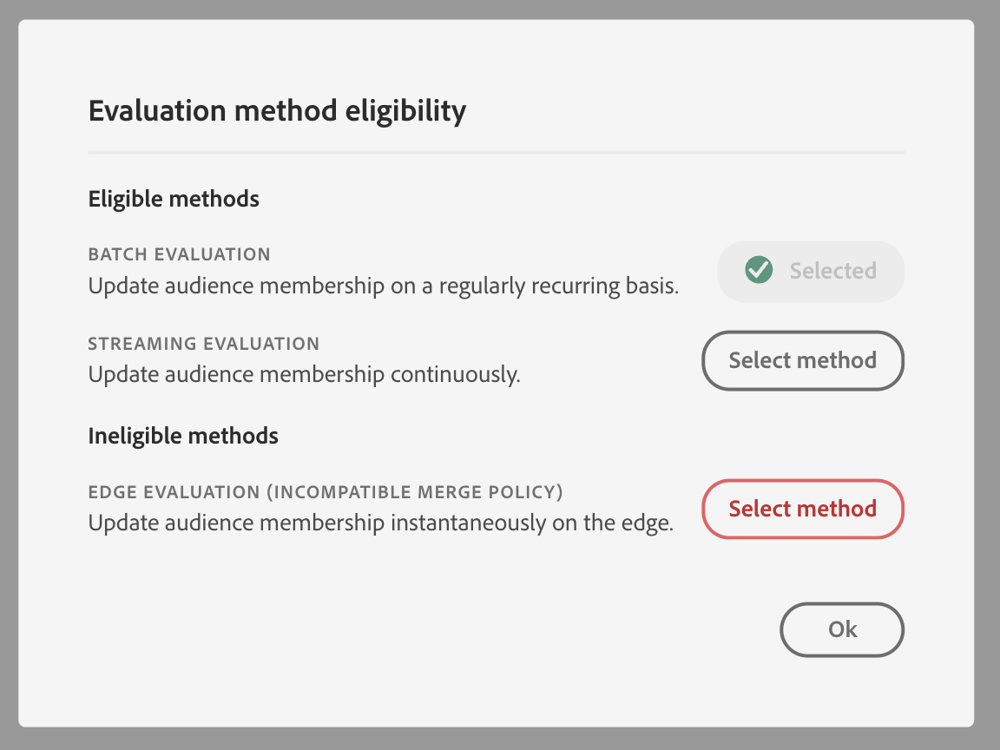

# [!DNL Segment Builder] UI 안내서

[!DNL Segment Builder] 는 상호 작용할 수 있는 풍부한 작업 공간을 제공합니다. [!DNL Profile] 데이터 요소. 작업 공간에서는 데이터 속성을 표시하는 데 사용되는 드래그 앤 드롭 타일과 같이 규칙을 만들고 편집하기 위한 직관적인 컨트롤을 제공합니다.

## 세그먼트 정의 빌딩 블록 {#building-blocks}

>[!CONTEXTUALHELP]
>id="platform_segments_createsegment_segmentbuilder_fields"
>title="필드"
>abstract="세그먼트를 구성하는 세 가지 필드 유형은 속성, 이벤트와 대상자입니다. 속성을 통해 XDM 개별 프로필 클래스에 속한 프로필 속성을 사용하고, 이벤트를 통해 XDM ExperienceEvent 데이터 요소로 인해 발생하는 작업 또는 이벤트를 기반으로 대상자를 만들고, 대상자를 통해 외부 소스에서 가져온 대상자를 사용할 수 있습니다."

세그먼트 정의의 기본 구성 요소는 속성 및 이벤트입니다. 또한 기존 대상에 포함된 속성 및 이벤트를 새 정의에 구성 요소로 사용할 수 있습니다.

이 빌딩 블록들은 **[!UICONTROL 필드]** 의 왼쪽에 있는 섹션 [!DNL Segment Builder] 작업 공간. **[!UICONTROL 필드]** 는 각 기본 빌딩 블록에 대한 탭을 포함합니다. &quot;[!UICONTROL 속성]&quot;, &quot;[!UICONTROL 이벤트]&quot; 및 &quot;[!UICONTROL 대상]&quot;.

### 속성

다음 **[!UICONTROL 속성]** 탭에서는 검색할 수 있습니다 [!DNL Profile] 에 속하는 속성 [!DNL XDM Individual Profile] 클래스 이름을 지정합니다. 각 폴더를 확장하여 추가 속성을 표시할 수 있습니다. 이 경우 각 속성은 작업 공간의 중심에 있는 규칙 빌더 캔버스로 드래그할 수 있습니다. 다음 [규칙 빌더 캔버스](#rule-builder-canvas) 은 이 안내서의 후반부에 자세히 설명되어 있습니다.

### 이벤트

다음 **[!UICONTROL 이벤트]** 탭에서는 을 사용하여 발생한 이벤트 또는 작업을 기반으로 대상을 만들 수 있습니다 [!DNL XDM ExperienceEvent] 데이터 요소. 또한 **[!UICONTROL 이벤트]** 탭 - 세그먼트를 보다 신속하게 만들 수 있도록 일반적으로 사용되는 이벤트 모음입니다.

찾을 수 있을 뿐만 아니라 [!DNL ExperienceEvent] 요소에서 이벤트 유형을 검색할 수도 있습니다. 이벤트 유형은 와 동일한 코딩 로직을 사용합니다 [!DNL ExperienceEvents]를 검색하는 대신 [!DNL XDM ExperienceEvent] 올바른 이벤트를 찾는 클래스입니다. 예를 들어 검색 막대를 사용하여 &quot;장바구니&quot;를 검색하면 이벤트 유형 &quot;[!UICONTROL 장바구니 추가]&quot; 및 &quot;[!UICONTROL 장바구니 제거]&quot;: 세그먼트 정의를 작성할 때 매우 일반적으로 사용되는 두 가지 장바구니 작업입니다.

검색 창에 구성 요소의 이름을 입력하여 모든 유형의 구성 요소를 검색할 수 있습니다. [루센의 검색 구문](https://docs.microsoft.com/en-us/azure/search/query-lucene-syntax). 전체 단어를 입력하면 검색 결과가 입력되기 시작합니다. 예를 들어 XDM 필드를 기반으로 규칙을 만들려면 `ExperienceEvent.commerce.productViews`을 눌러 검색 필드에 &quot;product views&quot;를 입력합니다. &quot;product&quot;라는 단어를 입력하면 검색 결과가 나타납니다. 각 결과에는 해당 객체가 속한 객체 계층이 포함됩니다.

>[!NOTE]
>
>조직에서 정의한 사용자 정의 스키마 필드를 나타나려면 최대 24시간이 걸릴 수 있으며 빌드 규칙에 사용할 수 있습니다.

그런 다음 끌어서 놓을 수 있습니다 [!DNL ExperienceEvents] 및 &quot;[!UICONTROL 이벤트 유형]세그먼트 정의에 사용합니다.

기본적으로 데이터 저장소에서 채워진 스키마 필드만 표시됩니다. 여기에는 &quot;[!UICONTROL 이벤트 유형]&quot;. 다음과 같은 경우[!UICONTROL 이벤트 유형]&quot; 목록이 표시되지 않거나 &quot;[!UICONTROL 임의]&quot;[!UICONTROL 이벤트 유형]&quot;, 을(를) 선택합니다 **톱니바퀴 아이콘** 다음 **[!UICONTROL 필드]**&#x200B;를 선택하고 을 선택합니다. **[!UICONTROL 전체 XDM 스키마 표시]** 아래에 **[!UICONTROL 사용 가능한 필드]**. 을(를) 선택합니다 **톱니바퀴 아이콘** 다시 **[!UICONTROL 필드]** 탭하면 이제 여러 &quot;를 볼 수 있습니다.[!UICONTROL 이벤트 유형]&quot; 및 스키마 필드에 데이터가 포함되어 있는지 여부에 관계없이 표시됩니다.

#### Adobe Analytics 보고서 세트 데이터 세트

단일 또는 여러 Adobe Analytics 보고서 세트의 데이터를 세그멘테이션 내의 이벤트로 사용할 수 있습니다.

단일 Analytics 보고서 세트의 데이터를 사용하는 경우 Platform에서 설명자와 친숙한 이름을 eVar에 자동으로 추가하여 내에서 해당 필드를 쉽게 찾을 수 있습니다 [!DNL Segment Builder].

여러 Analytics 보고서 세트의 데이터를 사용하는 경우 Platform **사용할 수 없음** eVar에 설명자 또는 친숙한 이름을 자동으로 추가합니다. 따라서 Analytics 보고서 세트의 데이터를 사용하기 전에 XDM 필드에 매핑해야 합니다. Analytics 변수를 XDM에 매핑하는 방법에 대한 자세한 내용은 [Adobe Analytics 소스 연결 안내서](../../sources/tutorials/ui/create/adobe-applications/analytics.md#mapping).

예를 들어 다음 변수가 있는 보고서 세트가 두 개 있는 상황을 가정해 보십시오.

| 필드 | 보고서 세트 스키마 A | 보고서 세트 스키마 B |
| ----- | --------------------- | --------------------- |
| eVar1 | 참조 도메인 | 로그인됨 Y/N |
| eVar2 | 페이지 이름 | 멤버 충성도 ID |
| eVar3 | URL | 페이지 이름 |
| eVar4 | 검색어 | 제품 이름 |
| event1 | 클릭 수 | 페이지 보기 횟수 |
| event2 | 페이지 보기 횟수 | 장바구니 추가 |
| event3 | 장바구니 추가 | 체크아웃 |
| event4 | 구매 | 구매 |

이 경우 두 보고서 세트를 다음 스키마와 매핑할 수 있습니다.

>[!NOTE]
>
>일반 eVar 값이 계속 채워지는 동안에는 다음을 수행해야 합니다 **not** 값은 원래 보고서에 있었던 것과 다른 것을 의미할 수 있으므로 세그먼트 정의(가능한 경우)에서 사용하십시오.

보고서 세트가 매핑되면 프로필 관련 워크플로우 및 세그멘테이션 내에서 이러한 새로 매핑된 필드를 사용할 수 있습니다.

| 시나리오 | 결합 스키마 경험 | 세그먼테이션 일반 변수 | 세그먼테이션 매핑된 변수 |
| -------- | ----------------------- | ----------------------------- | ---------------------------- |
| 단일 보고서 세트 | 일반 변수에 이름 설명자가 포함되어 있습니다.   **예:** 페이지 이름(eVar2) | <ul><li>일반 변수에 포함된 친숙한 이름 설명자</li><li>쿼리는 유일한 데이터이므로 특정 데이터 집합의 데이터를 사용합니다</li></ul> | 쿼리는 Adobe Analytics 데이터 및 잠재적으로 다른 소스를 사용할 수 있습니다. |
| 여러 보고서 세트 | 일반 변수에 친숙한 이름 설명자가 포함되지 않습니다.   **예:** eVar2 | <ul><li>설명자가 여러 개인 필드는 모두 원본으로 표시됩니다. 즉, UI에 친숙한 이름이 표시되지 않습니다.</li><li>쿼리는 eVar을 포함하는 데이터 세트의 데이터를 사용할 수 있으며, 이 경우 혼합 또는 잘못된 결과가 발생할 수 있습니다.</li></ul> | 쿼리는 여러 데이터 세트의 올바른 결합된 결과를 사용합니다. |

### Audiences

다음 **[!UICONTROL 대상]** 탭에는 Adobe Audience Manager과 같이 외부 소스에서 가져온 모든 대상과 내에서 만들어진 대상이 나열됩니다 [!DNL Experience Platform].

설정 **[!UICONTROL 대상]** 탭에서는 사용 가능한 모든 소스를 폴더 그룹으로 볼 수 있습니다. 폴더를 선택하면 사용 가능한 하위 폴더와 대상을 볼 수 있습니다. 또한 폴더 구조(현재 있는 폴더를 나타내는 확인 표시)를 보기 위해 폴더 아이콘(오른쪽 이미지에 표시)을 선택하고 트리에서 폴더 이름을 선택하여 폴더를 쉽게 다시 탐색할 수 있습니다.

대상 ⓘ 옆에 있는 를 마우스로 가리키면 대상 ID, 설명 및 폴더 계층 구조를 포함하여 대상에 대한 정보를 보고 대상을 찾을 수 있습니다.

을 활용하는 검색 막대를 사용하여 대상을 검색할 수도 있습니다 [루센의 검색 구문](https://docs.microsoft.com/en-us/azure/search/query-lucene-syntax). 설정 **[!UICONTROL 대상]** 탭에서 최상위 폴더를 선택하면 검색 막대가 표시되어 해당 폴더 내에서 검색할 수 있습니다. 전체 단어를 입력한 경우에만 검색 결과가 채워집니다. 예를 들어, 라는 이름의 대상자를 찾기 위해 `Online Shoppers`을 눌러 검색 창에 &quot;온라인&quot;을 입력합니다. &quot;Online&quot;이라는 단어가 완전히 입력되면 &quot;Online&quot;이라는 단어가 포함된 검색 결과가 나타납니다.

## 규칙 빌더 캔버스 {#rule-builder-canvas}

세그먼트 정의는 타겟 대상의 주요 특성이나 행동을 설명하는 데 사용되는 규칙 모음입니다. 이러한 규칙은 규칙 빌더 캔버스를 사용하여 만든 후 [!DNL Segment Builder].

세그먼트 정의에 새 규칙을 추가하려면 **[!UICONTROL 필드]** 탭하여 규칙 빌더 캔버스에 놓습니다. 추가된 데이터의 유형에 따라 컨텍스트별 선택 사항이 표시됩니다. 사용 가능한 데이터 유형은 다음과 같습니다. 문자열, 날짜, [!DNL ExperienceEvents], &quot;[!UICONTROL 이벤트 유형]&quot; 및 audiences의 본문 숨기기와 본문 표시 호출을 보여줍니다.

>[!IMPORTANT]
>
>Adobe Experience Platform에 대한 최신 변경 사항으로 `OR` 및 `AND` 이벤트 간 논리 연산자입니다. 이러한 업데이트는 기존 세그먼트에 영향을 주지 않습니다. 그러나 기존 세그먼트와 새 세그먼트 생성에 대한 모든 후속 업데이트는 이러한 변경 사항의 영향을 받습니다. 자세한 내용은 [시간 상수 업데이트](./segment-refactoring.md) 추가 정보.

속성에 대한 값을 선택할 때 속성이 될 수 있는 열거형 값 목록이 표시됩니다.

이 열거형 목록에서 값을 선택하면 값에 솔리드 테두리가 표시됩니다. 그러나 `meta:enum` (소프트) 열거형을 사용하여 **not** 열거형 목록 고유한 값을 만드는 경우 이 값이 열거형 목록에 없다는 경고와 함께 점선 테두리가 표시됩니다.

여러 값을 만드는 경우 일괄 업로드를 사용하여 모든 값을 한 번에 추가할 수 있습니다. 을(를) 선택합니다  다음을 표시합니다. **[!UICONTROL 값을 벌크로 추가합니다]** 팝오버

설정 **[!UICONTROL 값을 벌크로 추가합니다]** 팝오버에서 CSV 또는 TSV 파일을 업로드할 수 있습니다.

또는 쉼표로 구분된 값을 수동으로 추가할 수 있습니다.

허용되는 값은 최대 250개입니다. 이 금액을 초과하는 경우 추가 전에 일부 값을 제거해야 합니다.

### 대상자 추가

대상자를 **[!UICONTROL Audience]** 탭하여 새 세그먼트 정의에서 대상 멤버십을 참조할 수 있습니다. 이렇게 하면 대상 멤버십을 새 세그먼트 규칙에 속성으로 포함하거나 제외할 수 있습니다.

대상 [!DNL Platform] 를 사용하여 만든 대상 [!DNL Segment Builder]을 지정하는 경우, 대상을 해당 대상에 대한 세그먼트 정의에 사용된 규칙 세트로 변환하는 옵션이 제공됩니다. 이러한 변환에서는 규칙 로직의 복사본을 만들며, 원래 세그먼트 정의에 영향을 주지 않고 수정할 수 있습니다. 세그먼트 논리를 규칙 로직으로 변환하기 전에 최근 변경 사항을 세그먼트 정의에 저장했는지 확인하십시오.

>[!NOTE]
>
>외부 소스에서 대상을 추가할 때 대상 멤버십만 참조됩니다. 대상자를 규칙으로 변환할 수 없으므로 원래 대상을 만드는 데 사용되는 규칙은 새 세그먼트 정의에서 수정할 수 없습니다.

대상자를 규칙으로 변환할 때 충돌이 발생하는 경우, [!DNL Segment Builder] 은 기존 옵션을 최대한 보존하려고 합니다.

### 코드 보기

또는,에서 만든 규칙의 코드 기반 버전을 볼 수 있습니다 [!DNL Segment Builder]. 규칙 빌더 캔버스 내에 규칙을 만들면 다음을 선택할 수 있습니다 **[!UICONTROL 코드 보기]** 세그먼트를 PQL로 볼 수 있습니다.

코드 보기는 API 호출에 사용할 세그먼트 값을 복사할 수 있는 단추를 제공합니다. 최신 버전의 세그먼트를 가져오려면 세그먼트에 최신 변경 사항을 저장했는지 확인하십시오.

### 집계 함수

의 집계 [!DNL Segment Builder] 는 데이터 유형이 숫자(double 또는 정수)인 XDM 속성 그룹에 대한 계산입니다. 세그먼트 빌더 내에서 지원되는 4가지 집계 함수는 SUM, AVERAGE, MIN 및 MAX입니다.

집계 함수를 만들려면 왼쪽 레일에서 이벤트를 선택한 다음 [!UICONTROL 이벤트] 컨테이너.

이벤트 컨테이너 내에 이벤트를 배치한 후 줄임표 아이콘(...)을 선택하고 다음을 수행합니다 **[!UICONTROL 합계]**.

이제 집계가 추가됩니다. 이제 합계 함수를 선택하고 합계를 생성할 속성, 같음 함수 및 값을 선택할 수 있습니다. 아래 예제에서 이 세그먼트는 각 개별 구매가 $100보다 작은 경우에도 $100보다 큰 구매 값의 합계가 있는 모든 프로필에 적합합니다.

### Count 함수 {#count-functions}

세그먼트 빌더의 카운트 함수는 지정된 이벤트를 찾고 수집된 횟수를 계산하는 데 사용됩니다. 세그먼트 빌더에서 지원되는 수 함수는 &quot;최소&quot;, &quot;최대&quot;, &quot;정확히&quot;, &quot;사이&quot; 및 &quot;모두&quot;입니다.

카운트 함수를 만들려면 왼쪽 레일에서 이벤트를 선택하고 [!UICONTROL 이벤트] 컨테이너.

이벤트를 이벤트 컨테이너 내에 배치한 후 [!UICONTROL 1개 이상] 버튼을 클릭합니다.

이제 카운트 함수가 추가되었습니다. 이제 카운트 함수와 함수의 값을 선택할 수 있습니다. 아래 예는 하나 이상의 클릭이 있는 이벤트를 포함하는 것입니다.

## 컨테이너

세그먼트 규칙은 나열된 순서로 평가됩니다. 컨테이너를 사용하면 중첩된 쿼리를 사용하여 실행 순서를 제어할 수 있습니다.

규칙 빌더 캔버스에 적어도 한 개의 타일을 추가한 후에는 컨테이너 추가를 시작할 수 있습니다. 새 컨테이너를 만들려면 타일의 오른쪽 상단 모서리에서 줄임표(...)를 선택한 다음 을 선택합니다 **[!UICONTROL 컨테이너 추가]**.

새 컨테이너가 첫 번째 컨테이너의 자식으로 표시되지만 컨테이너를 드래그하여 이동하여 계층을 조정할 수 있습니다. 컨테이너의 기본 동작은 &quot;[!UICONTROL 포함]제공된 속성, 이벤트 또는 대상입니다. 규칙을 &quot;(으)로 설정할 수 있습니다.[!UICONTROL 제외]&quot; 컨테이너 기준과 일치하는 프로필을 선택하고 **[!UICONTROL 포함]** 타일의 왼쪽 위 모서리에서 &quot; 을(를) 선택하고[!UICONTROL 제외]&quot;.

하위 컨테이너에서 &quot;컨테이너 줄바꿈 해제&quot;를 선택하여 하위 컨테이너를 추출하고 상위 컨테이너에 인라인으로 추가할 수도 있습니다. 하위 컨테이너의 오른쪽 위 모서리에서 줄임표(...)를 선택하여 이 옵션에 액세스합니다.

선택하면 **[!UICONTROL 컨테이너 래핑 취소]** 하위 컨테이너가 제거되고 기준이 인라인으로 표시됩니다.

>[!NOTE]
>
>컨테이너를 래핑하지 않을 때는 논리가 원하는 세그먼트 정의를 계속 충족하는지 확인하십시오.

## 병합 정책

[!DNL Experience Platform] 을(를) 사용하면 여러 소스에서 데이터를 결합하여 각 개별 고객에 대한 전체 보기를 볼 수 있습니다. 이 데이터를 함께 가져올 때 병합 정책이 [!DNL Platform] 은(는) 데이터의 우선 순위가 지정되는 방식과 프로필을 만들기 위해 결합할 데이터를 결정하는 데 사용됩니다.

이 대상의 마케팅 목적과 일치하는 병합 정책을 선택하거나 [!DNL Platform]. 고유한 기본 병합 정책을 만드는 등 조직에 고유한 여러 병합 정책을 만들 수 있습니다. 조직을 위한 병합 정책 만들기에 대한 단계별 지침은 [정책 병합 개요](../../profile/merge-policies/overview.md).

세그먼트 정의에 대한 병합 정책을 선택하려면 **[!UICONTROL 필드]** 탭을 클릭한 다음 **[!UICONTROL 병합 정책]** 드롭다운 메뉴에서 사용할 병합 정책을 선택합니다.

## 세그먼트 속성 {#segment-properties}

>[!CONTEXTUALHELP]
>id="platform_segments_createsegment_segmentbuilder_segmentproperties"
>title="세그먼트 속성"
>abstract="세그먼트 속성 섹션에는 총 프로필 개수와 비교하여 적격 프로필 개수를 표시하는 최종 세그먼트 예상 크기가 표시됩니다. 필요에 따라 대상자 자체를 빌드하기 전에 세그먼트 정의를 조정할 수 있습니다."

>[!CONTEXTUALHELP]
>id="platform_segments_createsegment_segmentbuilder_refreshestimate"
>title="예상치 새로 고침"
>abstract="세그먼트의 예상치를 새로 고쳐 제안된 세그먼트에 적합한 프로필 개수를 미리 볼 수 있습니다. 당일 샘플 데이터의 샘플 크기를 사용하여 대상자 예상치를 생성합니다."
>additional-url="https://experienceleague.adobe.com/docs/experience-platform/segmentation/tutorials/create-a-segment.html?lang=ko#estimate-and-preview-an-audience" text="대상자 예측 및 미리보기"

세그먼트 정의를 작성할 때 **[!UICONTROL 세그먼트 속성]** 작업 공간 오른쪽의 섹션에 결과 세그먼트의 예상 크기가 표시되므로 대상 자체를 작성하기 전에 필요에 따라 세그먼트 정의를 조정할 수 있습니다.

다음 **[!UICONTROL 세그먼트 속성]** 섹션에서 이름, 설명 및 평가 유형을 포함하여 세그먼트 정의에 대한 중요한 정보를 지정할 수도 있습니다. 세그먼트 정의 이름은 조직에서 정의한 세그먼트 중에서 식별하는 데 사용되므로 설명적이고 간결하며 고유해야 합니다.

세그먼트 정의를 계속 작성할 때, 선택 항목을 선택하여 대상의 페이지 매김된 미리 보기를 볼 수 있습니다 **[!UICONTROL 프로필 보기]**.

>[!NOTE]
>
>당일 샘플 데이터의 샘플 크기를 사용하여 대상자 예상치를 생성합니다. 프로필 저장소에 100만 개 미만의 엔티티가 있는 경우 전체 데이터 세트가 사용됩니다. 100만~2000만 개 업체가 이용한다. 그리고 2천만 개 이상의 개체들에 대해서, 전체 개체 중 5%가 사용됩니다. 세그먼트 예상 생성에 대한 자세한 내용은 [생성 예상](../tutorials/create-a-segment.md#estimate-and-preview-an-audience) 세그먼트 만들기 자습서입니다.

평가 방법을 선택할 수도 있습니다. 사용할 평가 방법을 알고 있는 경우 드롭다운 목록을 사용하여 원하는 평가 방법을 선택할 수 있습니다. 이 세그먼트가 어떤 평가 유형에 적합한지를 알려면 찾아보기 아이콘을 선택할 수 있습니다  사용 가능한 세그먼트 평가 방법 목록을 보려면 다음을 수행하십시오.

다음 [!UICONTROL 평가 방법 자격] 팝오버가 나타납니다. 이 팝오버에는 일괄 처리, 스트리밍 및 에지인 사용 가능한 평가 방법이 표시됩니다. 팝오버는 어떤 평가 방법이 적격 및 부적격인지를 보여줍니다. 세그먼트 정의에 사용한 매개 변수에 따라 특정 평가 방법에 적합하지 않을 수 있습니다. 각 평가 방법에 대한 요구 사항에 대한 자세한 내용은 [스트리밍 세분화](./streaming-segmentation.md#query-types) 또는 [에지 세분화](./edge-segmentation.md#query-types) 개요.

잘못된 평가 방법을 선택하면 세그먼트 정의 규칙을 변경하거나 평가 방법을 변경하라는 메시지가 표시됩니다.

다양한 세그먼트 정의 평가 방법에 대한 자세한 내용은 [세분화 개요](../home.md#evaluate-segments).

## 다음 단계 {#next-steps}

세그먼트 빌더는 마케팅 가능한 대상을 [!DNL Real-Time Customer Profile] 데이터. 이 안내서를 읽은 후에는 다음을 수행할 수 있습니다.

- 특성, 이벤트 및 기존 대상을 빌딩 블록으로 조합하여 세그먼트 정의를 만듭니다.
- 규칙 빌더 캔버스 및 컨테이너를 사용하여 세그먼트 규칙이 실행되는 순서를 제어합니다.
- 필요에 따라 세그먼트 정의를 조정할 수 있도록 예상 대상에 대한 예측을 봅니다.
- 예약된 세그먼테이션에 대해 모든 세그먼트 정의를 활성화합니다.
- 스트리밍 세그멘테이션에 지정된 세그먼트 정의를 사용합니다.

에 대해 자세히 알아보려면 [!DNL Segmentation Service]을(를) 클릭하여 설명서를 계속 읽고 관련 비디오를 시청하여 학습 내용을 보완하십시오. 의 다른 부분에 대해 자세히 알아보려면 [!DNL Segmentation Service] UI를 참조하십시오. [[!DNL Segmentation Service] 사용 안내서](./overview.md)
