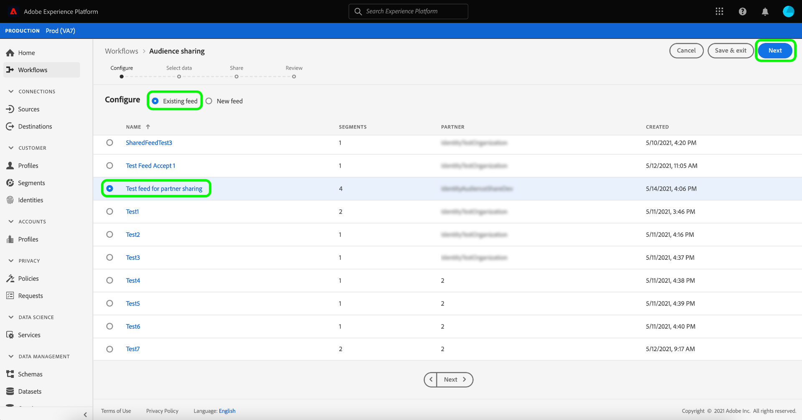

# (알파) [!DNL Segment Match] 개요

>[!IMPORTANT]
>
>[!DNL Segment Match] 현재 알파 상태입니다. 설명서 및 기능은 변경될 수 있습니다.

Adobe Experience Platform 세그먼트 일치 는 두 명 이상의 플랫폼 사용자가 안전하고 제어되며 개인 정보에 친숙한 방식으로 세그먼트 데이터를 교환할 수 있도록 해주는 세그먼트 공유 서비스입니다. [!DNL Segment Match] 은 해시된 이메일, 해시된 전화번호 및 IDFA 및 GAID와 같은 장치 식별자 등의 플랫폼 개인 정보 표준 및 개인 식별자를 사용합니다.

[!DNL Segment Match]을 사용하면 다음 작업을 수행할 수 있습니다.

* ID 겹치기 프로세스를 관리합니다.
* 공유 전 예상 보기
* 데이터를 파트너와 공유할 수 있는지 제어하려면 데이터 사용 레이블을 적용합니다.
* 피드를 게시한 후 공유 대상 라이프사이클 관리를 유지 관리하고 추가, 삭제 및 공유 해제 기능을 통해 데이터를 동적으로 교환합니다.

[!DNL Segment Match] 에서는 id 겹치기 프로세스를 사용하여 세그먼트 공유가 보안 및 개인 정보 보호 중심적으로 수행되도록 합니다. **겹치는 identity**&#x200B;는 세그먼트와 선택한 파트너의 세그먼트 모두에서 일치하는 ID입니다. 발신자와 수신자 간에 세그먼트를 공유하기 전에, ID 겹치기 프로세스는 네임스페이스의 중복 여부 및 발신자와 수신자 간의 동의 확인을 검사합니다. 세그먼트를 공유하려면 두 겹치기 검사가 모두 전달되어야 합니다.

다음 섹션에서는 설정 및 종단 간 워크플로우에 대한 세부 사항을 포함하여 [!DNL Segment Match]에 대한 자세한 정보를 제공합니다.

## 설정

다음 섹션에서는 [!DNL Segment Match] 을 설정하고 구성하는 방법에 대해 설명합니다.

### ID 데이터 및 네임스페이스 설정 {#namespaces}

[!DNL Segment Match] 을 시작하는 첫 번째 단계는 지원되는 ID 네임스페이스에 대해 데이터를 수집하는 것입니다.

ID 네임스페이스는 [Adobe Experience Platform Identity 서비스](../../identity-service/home.md)의 구성 요소입니다. 각 고객 ID에는 ID의 컨텍스트를 나타내는 연결된 네임스페이스가 포함되어 있습니다. 예를 들어 네임스페이스는 &quot;name@email.com&quot; 값을 이메일 주소로 구분하거나 &quot;443522&quot; 값을 숫자 CRM ID로 구분할 수 있습니다.

정규화된 ID에는 ID 값과 네임스페이스가 포함됩니다. 프로필 조각에서 레코드 데이터를 일치시킬 때(예: [!DNL Real-time Customer Profile] 이 프로필 데이터를 병합하는 경우) ID 값과 네임스페이스가 모두 일치해야 합니다.

[!DNL Segment Match] 컨텍스트에서는 데이터를 공유할 때 네임스페이스가 겹치기 프로세스에서 사용됩니다.

지원되는 네임스페이스 목록은 다음과 같습니다.

| 네임스페이스 | 설명 |
| --------- | ----------- |
| 이메일(SHA256, 소문자로) | 미리 해시된 이메일 주소를 위한 네임스페이스. 이 네임스페이스에 제공된 값은 SHA256으로 해싱하기 전에 소문자로 변환됩니다. 전자 메일 주소가 표준화되기 전에 선행 및 후행 공백을 트림해야 합니다. 이 설정은 소급하여 변경할 수 없습니다. 자세한 내용은 [SHA256 해시 지원](https://experienceleague.adobe.com/docs/id-service/using/reference/hashing-support.html?lang=en#hashing-support)에 대한 다음 문서를 참조하십시오. |
| 전화(SHA256_E.164) | SHA256과 E.164 형식을 모두 사용하여 해시해야 하는 원시 전화 번호를 나타내는 네임스페이스입니다. |
| ECID | ECID(Experience Cloud ID) 값을 나타내는 네임스페이스입니다. 이 네임스페이스를 다음 별칭으로 참조할 수도 있습니다.&quot;Adobe Marketing Cloud ID&quot;, &quot;Adobe Experience Cloud ID&quot;, &quot;Adobe Experience Platform ID&quot;. 자세한 내용은 [ECID 개요](../../identity-service/ecid.md)를 참조하십시오. |
| Apple IDFA(광고주의 ID) | 광고주용 Apple ID를 나타내는 네임스페이스입니다. 자세한 내용은 [관심 기반 광고](https://support.apple.com/en-us/HT202074)에 있는 다음 문서를 참조하십시오. |
| Google 광고 ID | Google 광고 ID를 나타내는 네임스페이스입니다. 자세한 내용은 [Google 광고 ID](https://support.google.com/googleplay/android-developer/answer/6048248?hl=en)에서 다음 문서를 참조하십시오. |

### 동의 구성 설정

동의 구성을 제공하고 동의 확인을 위해 기본값을 `opt-in` 또는 `opt-out` 로 설정해야 합니다.

옵트인 및 옵트아웃 동의 확인은 기본적으로 사용자 데이터를 공유하는 동의로 작동할 수 있는지 여부를 결정합니다. 동의 구성 기본값이 `opt-in`로 설정되어 있으면 사용자가 명시적으로 옵트아웃하지 않는 한 사용자 데이터를 공유할 수 있습니다. 기본값이 `opt-out`로 설정되어 있으면 사용자가 명시적으로 옵트인하지 않는 한 사용자 데이터를 공유할 수 없습니다.

[!DNL Segment Match]에 대한 기본 동의 구성이 `opt-out`(으)로 설정되어 있습니다. 데이터에 옵트인 모델을 적용하려면 Adobe 계정 관리자에게 이메일 요청을 보내십시오.

데이터 공유 동의 값을 설정하는 데 사용되는 `share` 속성에 대한 자세한 내용은 [개인 정보 및 동의 필드 그룹](../../xdm/field-groups/profile/consents.md)에 있는 다음 설명서를 참조하십시오. 개인 정보, 개인화 및 마케팅 환경 설정과 관련된 데이터의 수집 및 사용에 대한 소비자 동의를 캡처하는 데 사용되는 특정 필드 그룹에 대한 자세한 내용은 다음 [개인 정보, 개인화 및 마케팅 환경 설정에 대한 동의 GitHub 예제](https://github.com/adobe/xdm/blob/master/docs/reference/datatypes/consent-preferences.schema.md)를 참조하십시오.

### 데이터 사용 레이블 구성

설정해야 하는 마지막 전제 조건은 데이터 공유를 방지하기 위해 새 데이터 사용 레이블을 구성하는 것입니다. 데이터 사용 레이블을 통해 [!DNL Segment Match]을(를) 통해 공유할 수 있는 데이터를 관리할 수 있습니다.

데이터 사용 레이블을 사용하면 해당 데이터에 적용되는 사용 정책에 따라 데이터 세트와 필드를 분류할 수 있습니다. 레이블을 언제든지 적용할 수 있으므로 데이터를 관리하는 방법을 유연하게 선택할 수 있습니다. 우수 사례는 Experience Platform에 수집되는 즉시 또는 플랫폼에서 데이터를 사용할 수 있게 되는 즉시 레이블 지정 데이터를 권장합니다.

[!DNL Segment Match] 는 데이터 세트 또는 속성에 수동 [!DNL Segment Match] 으로 추가하여  [!DNL Segment Match] 파트너 공유 프로세스에서 제외되도록 하는 특정 계약 레이블인 C11 레이블을 사용합니다. C11 레이블은 [!DNL Segment Match] 프로세스에서 사용하지 않아야 하는 데이터를 나타냅니다. [!DNL Segment Match]에서 제외할 데이터 세트 및/또는 필드를 결정하고 그에 따라 C11 레이블을 추가한 후에는 [!DNL Segment Match] 워크플로우에 의해 레이블이 자동으로 적용됩니다. [!DNL Segment Match] 데이터 공유 핵심  [!UICONTROL 제한 정책을 ] 자동으로 활성화합니다. 데이터 사용 레이블을 데이터 세트에 적용하는 방법에 대한 특정 지침은 UI](../../data-governance/labels/user-guide.md)에서 데이터 사용 레이블 관리에서 자습서를 참조하십시오.[

데이터 사용 레이블 및 해당 정의 목록을 보려면 [데이터 사용 레이블 용어집](../../data-governance/labels/reference.md)을 참조하십시오. 데이터 사용 정책에 대한 자세한 내용은 [데이터 사용 정책 개요](../../data-governance/policies/overview.md)를 참조하십시오.

## [!DNL Segment Match] 종단 간 워크플로우

ID 데이터 및 네임스페이스, 동의 구성 및 데이터 사용 레이블을 설정하면 [!DNL Segment Match] 및 해당 기능으로 작업을 시작할 수 있습니다.

### 파트너 관리

Platform UI의 왼쪽 탐색에서 **[!UICONTROL 세그먼트]**&#x200B;를 선택한 다음 맨 위 헤더에서 **[!UICONTROL 피드]**&#x200B;를 선택합니다.

[!UICONTROL 피드] 페이지에는 공유한 피드뿐만 아니라 파트너로부터 받은 피드 목록이 포함되어 있습니다. 기존 파트너 목록을 보거나 새 파트너와 연결하려면 **[!UICONTROL 파트너 관리]**&#x200B;를 선택합니다.

두 파트너 간의 연결은 사용자가 샌드박스 수준에서 플랫폼 조직을 함께 연결하는 셀프 서비스 방법 역할을 하는 &quot;양방향 핸드셰이크&quot;입니다. 연결은 계약이 체결되었으며 플랫폼이 사용자와 파트너 간의 서비스 공유를 용이하게 할 수 있음을 플랫폼에 알리는 데 필요합니다.

>[!NOTE]
>
>당신과 당신 파트너 사이의 &quot;양방향 핸드셰이크&quot;는 엄격히 연결입니다. 이 프로세스 동안 데이터가 교환되지 않습니다.

[!UICONTROL 파트너 관리] 화면의 기본 인터페이스에서 기존 파트너와의 연결 목록을 볼 수 있습니다. 오른쪽 레일에는 [!UICONTROL 공유 설정] 패널이 있습니다. 이 패널에는 새로운 [!UICONTROL 연결 ID]를 생성하는 옵션과 파트너의 [!UICONTROL 연결 ID]를 입력할 수 있는 입력 상자가 있습니다.

새 [!UICONTROL 연결 ID]를 만들려면 [!UICONTROL 공유 설정]에서 **[!UICONTROL 재생성]**&#x200B;을 선택한 다음 새로 생성된 ID 옆의 복사 아이콘을 선택합니다.

[!UICONTROL 연결 ID]를 사용하여 파트너를 연결하려면 [!UICONTROL 연결 파트너] 아래의 입력 상자에 해당 고유 ID 값을 입력한 다음 **[!UICONTROL 요청]**&#x200B;을 선택합니다.

### 피드 만들기

**피드**&#x200B;는 데이터(세그먼트), 데이터를 노출하거나 사용할 수 있는 방법에 대한 규칙 및 파트너의 데이터와 데이터 일치 방법을 결정하는 구성입니다. 피드는 독립적으로 관리하고 [!DNL Segment Match]을 통해 다른 플랫폼 사용자와 교환할 수 있습니다.

새 피드를 만들려면 [!UICONTROL 피드] 대시보드에서 **[!UICONTROL 피드 만들기]**&#x200B;를 선택합니다.

피드의 기본 설정에는 마케팅 사용 사례 및 ID 설정에 대한 이름, 설명 및 구성이 포함됩니다. 피드의 이름과 설명을 입력한 다음 데이터를 제외할 마케팅 사용 사례를 적용합니다. 다음을 포함하는 목록에서 사용 사례를 두 개 이상 선택할 수 있습니다.

* [!UICONTROL Analytics]
* [!UICONTROL PII와 결합]
* [!UICONTROL 사이트 간 타깃팅]
* [!UICONTROL Data Science]
* [!UICONTROL 이메일 타겟팅]
* [!UICONTROL 타사로 내보내기]
* [!UICONTROL 온사이트 광고]
* [!UICONTROL 온사이트 개인화]
* [!UICONTROL 세그먼트 일치]
* [!UICONTROL 단일 ID 개인화]

마지막으로 피드에 적합한 ID 네임스페이스를 선택합니다. [!DNL Segment Match]에서 지원하는 특정 네임스페이스에 대한 자세한 내용은 [ID 데이터 및 네임스페이스 표](#namespaces)를 참조하십시오. 완료되면 **[!UICONTROL 다음]**&#x200B;을 선택합니다.

피드의 설정을 지정하고 나면 자사 세그먼트 목록에서 공유할 세그먼트를 선택합니다. 목록에서 하나 이상의 세그먼트를 선택할 수 있으며 오른쪽 레일을 사용하여 선택한 세그먼트 목록을 관리할 수 있습니다. 완료되면 **[!UICONTROL 다음]**&#x200B;을 선택합니다.

[!UICONTROL 공유] 페이지가 나타나고, 피드를 공유할 파트너를 선택할 수 있는 인터페이스를 제공합니다. 이 단계 동안 공유 전 중복 예상 보고서를 보고 사용자와 파트너 간의 네임스페이스별 중복 ID 수, 데이터 공유에 동의한 겹친 ID 수를 확인할 수도 있습니다.

**[!UICONTROL 세그먼트별 분석]**&#x200B;을 선택하여 예상 보고서를 확인합니다.

겹치기 예상 보고서를 사용하면 피드를 공유하기 전에 파트너와 세그먼트당 겹치기 및 동의 확인을 관리할 수 있습니다.

| 지표 | 설명 |
| ------- | ----------- |
| 동의가 있는 예상 ID | 조직에 대해 구성된 동의 요구 사항을 충족하는 총 겹친 ID 수입니다. |
| 예상되는 겹친 ID | 선택한 세그먼트에 적합하고 선택한 파트너와 일치하는 ID 수입니다. 이러한 ID는 네임스페이스로 표시되며 개별 프로필 ID를 나타내지는 않습니다. 겹치기 추정은 프로필 스케치를 기반으로 합니다. |

완료되면 **[!UICONTROL 닫기]**&#x200B;를 선택합니다.

파트너를 선택하고 Overlap Estimate 보고서를 본 후 **[!UICONTROL 다음]**&#x200B;을 선택하여 계속 진행하십시오.

[!UICONTROL 검토] 단계가 나타나므로 새 피드를 공유하고 게시하기 전에 검토할 수 있습니다. 이 단계에는 적용한 ID 설정에 대한 세부 정보와 선택한 마케팅 사용 사례, 세그먼트 및 파트너에 대한 정보가 포함되어 있습니다.

계속하려면 **[!UICONTROL 완료]**&#x200B;를 선택하십시오.

### 피드 업데이트

세그먼트를 추가하거나 제거하려면 [!UICONTROL 피드] 페이지에서 **[!UICONTROL 피드 만들기]**&#x200B;를 선택한 다음 **[!UICONTROL 기존 피드]**&#x200B;를 선택합니다. 표시되는 기존 피드 목록에서 업데이트할 피드를 선택한 다음 **[!UICONTROL 다음]**&#x200B;을 선택합니다.

세그먼트 목록이 나타납니다. 여기에서 피드에 새 세그먼트를 추가할 수 있으며, 오른쪽 레일을 사용하여 더 이상 필요하지 않은 세그먼트를 제거할 수 있습니다. 피드의 세그먼트 관리를 마치면 **[!UICONTROL 다음]**&#x200B;을 선택한 다음 위에 설명된 단계에 따라 업데이트된 피드를 완료합니다.

>[!NOTE]
>
>공유 피드에서 세그먼트를 추가하거나 제거할 때, 수신 파트너는 받은 피드 목록에서 [!DNL Profile] 토글을 다시 활성화하여 변경 사항을 확인해야 합니다.

### 들어오는 피드 수락

들어오는 피드를 보려면 [!UICONTROL 피드] 페이지의 헤더에서 **[!UICONTROL 수신]**&#x200B;을 선택한 다음 목록에서 보려는 피드를 선택합니다. 피드를 수락하려면 **[!UICONTROL 프로필 사용]**&#x200B;을 선택하고 상태가 [!UICONTROL 보류 중]에서 [!UICONTROL 활성화됨]으로 업데이트되도록 잠시 허용합니다.

공유 피드를 수락하면 공유 데이터를 사용하여 새 세그먼트를 만들 수 있습니다.

## 다음 단계

이 문서를 읽으면 [!DNL Segment Match], 기능 및 종단 간 워크플로우에 대한 이해를 얻을 수 있습니다. 다른 Platform 서비스에 대한 자세한 내용은 다음 문서를 참조하십시오.

* [[!DNL Segmentation Service]](../home.md)
* [[!DNL Identity Service]](../../identity-service/home.md)
* [[!DNL Real-time Customer Profile] 개요](../../profile/home.md)
