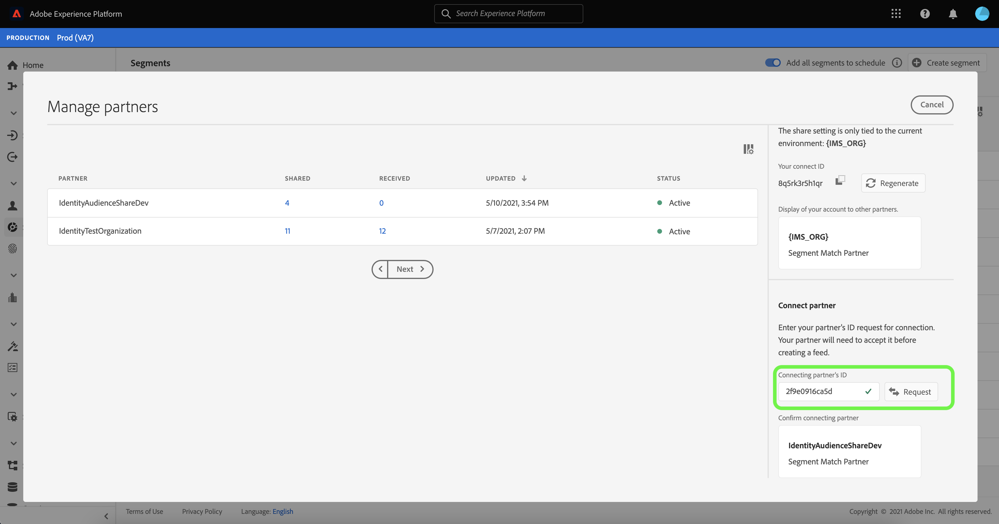

# [!DNL Segment Match] 개요

Adobe Experience Platform 세그먼트 일치는 두 명 이상의 Platform 사용자가 안전하고 관리되며 개인 정보 보호 친화적인 방식으로 세그먼트 데이터를 교환할 수 있는 세그먼트 공유 서비스입니다. [!DNL Segment Match] 는 Platform 개인 정보 보호 표준과 해시된 이메일, 해시된 전화번호 및 IDFA 및 GAID와 같은 장치 식별자와 같은 개인 식별자를 사용합니다.

포함 [!DNL Segment Match] 다음을 수행할 수 있습니다.

* ID 중복 프로세스를 관리합니다.
* 사전 공유 예상 보기.
* 데이터 사용 레이블을 적용하여 데이터를 파트너와 공유할 수 있는지 여부를 제어합니다.
* 피드를 게시한 후 공유 대상 라이프사이클 관리를 유지 관리하고 추가, 삭제 및 공유 취소 기능을 통해 데이터의 동적 교환을 계속합니다.

[!DNL Segment Match] 은 id 중복 프로세스를 사용하여 세그먼트 공유가 안전하고 개인 정보 보호에 중점을 둔 방식으로 수행되도록 합니다. An **겹치는 ID** 는 세그먼트와 선택한 파트너의 세그먼트 모두에서 일치하는 ID를 갖습니다. 발신자와 수신자 간에 세그먼트를 공유하기 전에 ID 중복 프로세스에서 네임스페이스가 겹치는지 확인하고 발신자와 수신자 간의 동의 검사를 수행합니다. 세그먼트를 공유하려면 두 겹치기 검사를 모두 통과해야 합니다.

다음 섹션은 다음에 대한 자세한 정보를 제공합니다. [!DNL Segment Match], 설정 및 통합 워크플로우에 대한 세부 정보가 포함됩니다.

## 설정

다음 섹션에서는 설정 및 구성 방법에 대해 설명합니다 [!DNL Segment Match]:

### ID 데이터 및 네임스페이스 설정 {#namespaces}

시작하는 첫 번째 단계 [!DNL Segment Match] 는 지원되는 id 네임스페이스에 대해 데이터를 수집하는지 확인하기 위한 것입니다.

ID 네임스페이스는 의 구성 요소입니다. [Adobe Experience Platform ID 서비스](../../../identity-service/home.md). 각 고객 ID에는 ID의 컨텍스트를 나타내는 연결된 네임스페이스가 포함되어 있습니다. 예를 들어 네임스페이스는 &quot;name&quot;의 값을 구별할 수 있습니다@email.com&quot; 을 이메일 주소로 사용하거나 &quot;443522&quot;를 숫자 CRM ID로 사용합니다.

정규화된 ID에는 ID 값과 네임스페이스가 포함됩니다. 프로필 조각 간에 레코드 데이터를 일치시킬 때(예: [!DNL Real-Time Customer Profile] 프로필 데이터 병합). id 값과 네임스페이스가 모두 일치해야 합니다.

의 맥락에서 [!DNL Segment Match]: 네임스페이스는 데이터를 공유할 때 중복 프로세스에서 사용됩니다.

지원되는 네임스페이스 목록은 다음과 같습니다.

| 네임스페이스 | 설명 |
| --------- | ----------- |
| 이메일(SHA256, 소문자) | 사전 해시된 이메일 주소를 위한 네임스페이스입니다. 이 네임스페이스에 제공된 값은 SHA256으로 해싱하기 전에 소문자로 변환됩니다. 전자 메일 주소가 정규화되기 전에 선행 및 후행 공백을 잘라내야 합니다. 이 설정은 소급하여 변경할 수 없습니다. Platform은 다음을 통해 데이터 수집 시 해싱을 지원하는 두 가지 방법을 제공합니다 [`setCustomerIDs`](https://experienceleague.adobe.com/docs/id-service/using/reference/hashing-support.html?lang=en#hashing-support) 및 [데이터 준비](../../../data-prep/functions.md#hashing). |
| 전화(SHA256_E.164) | SHA256과 E.164 형식을 모두 사용하여 해시해야 하는 원시 전화 번호를 나타내는 네임스페이스입니다. |
| ECID | ECID(Experience Cloud ID) 값을 나타내는 네임스페이스입니다. 이 네임스페이스는 &quot;Adobe Marketing Cloud ID&quot;, &quot;Adobe Experience Cloud ID&quot;, &quot;Adobe Experience Platform ID&quot; 별칭으로도 참조할 수 있습니다. 다음을 참조하십시오. [ECID 개요](../../../identity-service/ecid.md) 추가 정보. |
| Apple IDFA (광고주용 ID) | 광고주용 Apple ID를 나타내는 네임스페이스입니다. 에 대한 다음 문서를 참조하십시오. [관심 기반 광고](https://support.apple.com/en-us/HT202074) 추가 정보. |
| Google 광고 ID | Google 광고 ID를 나타내는 네임스페이스입니다. 에 대한 다음 문서를 참조하십시오. [Google 광고 ID](https://support.google.com/googleplay/android-developer/answer/6048248?hl=en) 추가 정보. |

### 동의 구성 설정

동의 구성을 제공하고 기본값을 다음 중 하나로 설정해야 합니다. `opt-in` 또는 `opt-out` 동의를 확인합니다.

옵트인 및 옵트아웃 동의 확인은 기본적으로 사용자 데이터를 공유하는 데 동의하고 작업할 수 있는지 여부를 결정합니다. 동의 구성 기본값이 로 설정된 경우 `opt-out`을 선택한 다음 사용자가 명시적으로 옵트아웃하지 않는 한 사용자 데이터를 공유할 수 있습니다. 기본값이 로 설정된 경우 `opt-in`을 지정하면 사용자가 명시적으로 옵트인하지 않는 한 사용자 데이터를 공유할 수 없습니다.

에 대한 기본 동의 구성 [!DNL Segment Match] 이(가) (으)로 설정됨 `opt-out`. 데이터에 옵트인 모델을 적용하려면 Adobe 계정 팀에 이메일 요청을 전송하십시오.

에 대한 자세한 내용은 `share` 데이터 공유 동의 값을 설정하는 데 사용되는 속성은에 대한 다음 설명서를 참조하십시오. [개인 정보 및 동의 필드 그룹](../../../xdm/field-groups/profile/consents.md). 개인 정보, 개인화 및 마케팅 환경 설정 관련 데이터 수집 및 사용에 대한 소비자 동의를 캡처하는 데 사용되는 특정 필드 그룹에 대한 자세한 내용은 다음을 참조하십시오 [개인정보, 개인화 및 마케팅 환경 설정에 대한 동의 GitHub 예제](https://github.com/adobe/xdm/blob/master/docs/reference/datatypes/consent/consent-preferences.schema.md).

### 데이터 사용 레이블 구성

마지막으로 설정해야 하는 전제 조건은 데이터 공유를 방지하기 위해 새 데이터 사용 레이블을 구성하는 것입니다. 데이터 사용 레이블을 통해 공유할 수 있는 데이터를 관리할 수 있습니다. [!DNL Segment Match].

데이터 사용 레이블을 사용하면 해당 데이터에 적용되는 사용 정책에 따라 데이터 세트와 필드를 분류할 수 있습니다. 레이블은 언제든지 적용할 수 있으므로 데이터를 제어하는 방법을 유연하게 선택할 수 있습니다. 우수 사례는 데이터가 Experience Platform에 수집되는 즉시 또는 데이터를 플랫폼에서 사용할 수 있게 되는 즉시 데이터에 레이블을 지정하는 것을 장려합니다.

[!DNL Segment Match] 과 관련된 계약 레이블인 C11 레이블을 사용합니다. [!DNL Segment Match] 모든 데이터 세트 또는 속성에 수동으로 추가하여 [!DNL Segment Match] 파트너 공유 프로세스. C11 레이블은에서 사용하지 않아야 하는 데이터를 나타냅니다. [!DNL Segment Match] 프로세스. 제외할 데이터 세트 및/또는 필드를 결정한 후 [!DNL Segment Match] C11 레이블이 추가되고 해당 레이블은 [!DNL Segment Match] 워크플로입니다. [!DNL Segment Match] 에서 자동으로 [!UICONTROL 데이터 공유 제한] 핵심 정책. 데이터 세트에 데이터 사용 레이블을 적용하는 방법에 대한 특정 지침은 [ui에서 데이터 사용 레이블 관리](../../../data-governance/labels/user-guide.md).

데이터 사용 레이블 및 해당 정의 목록은 다음을 참조하십시오 [데이터 사용 레이블 용어집](../../../data-governance/labels/reference.md). 데이터 사용 정책에 대한 자세한 내용은 [데이터 사용 정책 개요](../../../data-governance/policies/overview.md).

### 이해 [!DNL Segment Match] 권한

다음과 관련된 두 가지 권한이 있습니다. [!DNL Segment Match]:

| 사용 권한 | 설명 |
| --- | --- |
| 대상자 공유 연결 관리 | 이 권한을 사용하면 두 조직을 연결하여 활성화하는 파트너 핸드셰이크 프로세스를 완료할 수 있습니다. [!DNL Segment Match] 흐름. |
| 대상 공유 관리 | 이 권한을 사용하면 피드(에 사용되는 데이터 패키지)를 만들고 편집하고 게시할 수 있습니다. [!DNL Segment Match])와 활성 파트너(관리자 가 로 연결한 파트너) **[!UICONTROL 대상 공유 연결]** 액세스). |

다음을 참조하십시오. [액세스 제어 개요](../../../access-control/home.md) 액세스 제어 및 사용 권한에 대한 자세한 내용을 보려면 여기를 클릭하십시오.

## [!DNL Segment Match] 전체 워크플로

ID 데이터 및 네임스페이스, 동의 구성 및 데이터 사용 레이블을 설정하면 다음 작업을 시작할 수 있습니다. [!DNL Segment Match] 및 해당 기능.

### 파트너 관리

Platform UI에서 를 선택합니다. **[!UICONTROL 세그먼트]** 왼쪽 탐색에서 을(를) 선택한 다음 **[!UICONTROL 피드]** 맨 위 머리글에서

다음 [!UICONTROL 피드] 페이지에는 파트너로부터 받은 피드 목록과 공유한 피드가 포함되어 있습니다. 기존 파트너 목록을 보거나 새 파트너와 연결하려면 다음을 선택합니다. **[!UICONTROL 파트너 관리]**.

두 파트너 간의 연결은 사용자가 자신의 플랫폼 조직을 샌드박스 수준에서 연결해주는 셀프서비스 방식으로 작용하는 &#39;양방향 핸드셰이크&#39;다. 연결은 계약이 설정되었고 플랫폼이 귀하와 파트너 간의 서비스 공유를 용이하게 할 수 있음을 플랫폼에 알리는 데 필요합니다.

>[!NOTE]
>
>당신과 파트너 사이의 &quot;양방향 악수&quot;는 엄밀히 말해 연결이다. 이 프로세스 중에는 데이터가 교환되지 않습니다.

의 기본 인터페이스에서 기존 파트너와의 연결 목록을 볼 수 있습니다. [!UICONTROL 파트너 관리] 화면. 오른쪽 레일에는 [!UICONTROL 설정 공유] 패널 - 새로 생성하는 옵션을 제공합니다. [!UICONTROL 연결 ID] 파트너에 입력할 수 있는 입력란도 제공됩니다. [!UICONTROL 연결 ID].

새로 만들려면 [!UICONTROL 연결 ID], 선택 **[!UICONTROL 재생성]** 아래에 [!UICONTROL 설정 공유] 그런 다음 새로 생성된 ID 옆에 있는 복사 아이콘을 선택합니다.

을 사용하여 파트너를 연결하려면 [!UICONTROL 연결 ID], 다음의 입력 상자에 고유 ID 값을 입력합니다. [!UICONTROL 파트너 연결] 다음을 선택합니다. **[!UICONTROL 요청]**.

### 피드 만들기 {#create-feed}

>[!CONTEXTUALHELP]
>id="platform_segment_match_marketing"
>title="제한된 마케팅 사용 사례"
>abstract="제한된 마케팅 사용 사례는 공유된 세그먼트가 데이터 거버넌스 제한에 따라 적절하게 사용되도록 지침을 파트너에게 제공할 수 있습니다."
>text="Learn more in documentation"

A **피드** 는 데이터(세그먼트) 그룹, 데이터를 노출하거나 사용할 수 있는 방법에 대한 규칙, 데이터가 파트너의 데이터와 일치하는 방식을 결정하는 구성입니다. 피드는 를 통해 독립적으로 관리하고 다른 플랫폼 사용자와 교환할 수 있습니다. [!DNL Segment Match].

새 피드를 만들려면 **[!UICONTROL 피드 만들기]** 다음에서 [!UICONTROL 피드] 대시보드입니다.

피드의 기본 설정에는 이름, 설명, 마케팅 사용 사례 및 ID 설정에 관한 구성이 포함됩니다. 피드의 이름과 설명을 입력한 다음 데이터를 제외할 마케팅 사용 사례를 적용합니다. 다음을 포함하는 목록에서 사용 사례를 두 개 이상 선택할 수 있습니다.

* [!UICONTROL Analytics]
* [!UICONTROL PII와 결합]
* [!UICONTROL 크로스 사이트 타겟팅]
* [!UICONTROL Data Science]
* [!UICONTROL 이메일 타겟팅]
* [!UICONTROL 서드파티로 내보내기]
* [!UICONTROL 온사이트 광고]
* [!UICONTROL 온사이트 개인화]
* [!UICONTROL 세그먼트 일치]
* [!UICONTROL 단일 ID 개인화]

마지막으로 피드에 적합한 ID 네임스페이스를 선택합니다. 에서 지원하는 특정 네임스페이스에 대한 정보 [!DNL Segment Match], 다음을 참조하십시오. [id 데이터 및 네임스페이스 표](#namespaces). 완료되면 다음을 선택합니다. **[!UICONTROL 다음]**.

피드의 설정이 설정되면 자사 세그먼트 목록에서 공유할 세그먼트를 선택합니다. 목록에서 두 개 이상의 세그먼트를 선택할 수 있으며 오른쪽 레일을 사용하여 선택한 세그먼트 목록을 관리할 수 있습니다. 완료되면 다음을 선택합니다. **[!UICONTROL 다음]**.

다음 [!UICONTROL 공유] 피드를 공유할 파트너를 선택할 수 있는 인터페이스를 제공하는 페이지가 나타납니다. 이 단계에서는 공유 전 중복 예상 보고서를 확인하고 사용자와 파트너 간의 네임스페이스별 중복 ID 수, 데이터 공유에 동의한 중복 ID 수를 볼 수도 있습니다.

선택 **[!UICONTROL 세그먼트별 분석]** 예상 보고서를 확인합니다.

중복 예상 보고서를 사용하면 피드를 공유하기 전에 파트너별 및 세그먼트별로 중복 및 동의 검사를 관리할 수 있습니다.

| 지표 | 설명 |
| ------- | ----------- |
| 동의가 있는 예상 ID | 조직에 대해 구성된 동의 요구 사항을 충족하는 총 중복 ID 수입니다. |
| 예상 중복 ID | 선택한 세그먼트에 대한 자격이 있고 선택한 파트너와 일치하는 ID의 수입니다. 이러한 ID는 네임스페이스별로 표시되며 개별 프로필 ID를 나타내지는 않습니다. 겹치기 예상 값은 프로필 스케치를 기반으로 합니다. |

완료되면 다음을 선택합니다. **[!UICONTROL 닫기]**.

파트너를 선택하고 중복 예상 보고서를 본 후 을(를) 선택합니다. **[!UICONTROL 다음]** 계속합니다.

다음 [!UICONTROL 리뷰] 새 피드를 공유 및 게시하기 전에 검토할 수 있는 단계가 나타납니다. 이 단계에는 적용한 ID 설정에 대한 세부 정보와 선택한 마케팅 사용 사례, 세그먼트 및 파트너에 대한 정보가 포함됩니다.

선택 **[!UICONTROL 완료]** 계속합니다.

### 피드 업데이트

세그먼트를 추가하거나 제거하려면 다음을 선택합니다. **[!UICONTROL 피드 만들기]** 다음에서 [!UICONTROL 피드] 페이지를 선택한 다음 선택 **[!UICONTROL 기존 피드]**. 표시되는 기존 피드 목록에서 업데이트할 피드를 선택한 다음 을 선택합니다 **[!UICONTROL 다음]**.

세그먼트 목록이 나타납니다. 여기에서 피드에 새 세그먼트를 추가할 수 있으며 오른쪽 레일을 사용하여 더 이상 필요하지 않은 세그먼트를 제거할 수 있습니다. 피드의 세그먼트 관리를 완료했으면 을 선택합니다. **[!UICONTROL 다음]** 그런 다음 위에 설명된 단계에 따라 업데이트된 피드를 완료합니다.

>[!NOTE]
>
>공유 피드에서 세그먼트를 추가하거나 제거할 때 수신 파트너는 를 다시 활성화하여 변경 사항을 확인해야 합니다. [!DNL Profile] 수신한 피드 목록에서 전환합니다.

### 수신 피드 수락

들어오는 피드를 보려면 **[!UICONTROL 받음]** 의 헤더에서 [!UICONTROL 피드] 페이지를 만든 다음 목록에서 보려는 피드를 선택합니다. 피드를 수락하려면 **[!UICONTROL 프로필 활성화]** 에서 상태를 업데이트할 수 있도록 잠시 기다려 주십시오. [!UICONTROL 보류 중] 끝 [!UICONTROL 활성화됨].

공유 피드를 수락하면 공유 데이터를 사용하여 새 세그먼트를 작성할 수 있습니다.

## 다음 단계

이 문서를 읽고 다음과 같은 사항을 이해했습니다. [!DNL Segment Match], 기능 및 전체 워크플로 다른 Platform 서비스에 대한 자세한 내용은 다음 문서를 참조하십시오.

* [[!DNL Segmentation Service]](../../home.md)
* [[!DNL Identity Service]](../../../identity-service/home.md)
* [[!DNL Real-Time Customer Profile] 개요](../../../profile/home.md)
