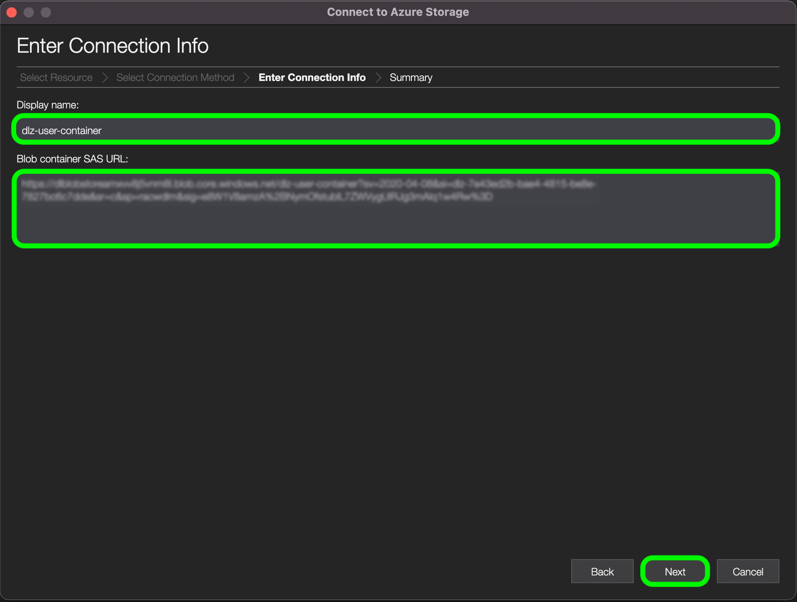

# [!DNL Data Landing Zone]

>[!IMPORTANT]
>
>이 페이지는 Experience Platform의 [!DNL Data Landing Zone] *source* 커넥터에 한정됩니다. [!DNL Data Landing Zone] *대상* 커넥터에 연결하는 방법에 대한 자세한 내용은 [[!DNL Data Landing Zone] 대상 설명서 페이지](/help/destinations/catalog/cloud-storage/data-landing-zone.md)를 참조하세요.

[!DNL Data Landing Zone]은(는) Adobe Experience Platform에서 프로비저닝한 [!DNL Azure Blob] 저장소 인터페이스로서, 파일을 플랫폼으로 가져올 수 있는 안전한 클라우드 기반 파일 저장소 기능에 액세스할 수 있도록 허용합니다. 샌드박스당 하나의 [!DNL Data Landing Zone] 컨테이너에 액세스할 수 있으며 모든 컨테이너의 총 데이터 볼륨은 Platform 제품 및 서비스 라이선스와 함께 제공되는 총 데이터로 제한됩니다. Experience Platform의 모든 고객은 샌드박스당 하나의 [!DNL Data Landing Zone] 컨테이너로 프로비저닝됩니다. [!DNL Azure Storage Explorer] 또는 명령줄 인터페이스를 통해 컨테이너에 파일을 읽고 쓸 수 있습니다.

[!DNL Data Landing Zone]은(는) SAS 기반 인증을 지원하며, 전송 중이거나 사용하지 않는 표준 [!DNL Azure Blob] 저장소 보안 메커니즘을 통해 데이터를 보호합니다. SAS 기반 인증을 사용하면 공용 인터넷 연결을 통해 [!DNL Data Landing Zone] 컨테이너에 안전하게 액세스할 수 있습니다. [!DNL Data Landing Zone] 컨테이너에 액세스하는 데 필요한 네트워크 변경 내용이 없습니다. 따라서 네트워크에 대한 허용 목록 또는 교차 지역 설정을 구성할 필요가 없습니다. Experience Platform은 [!DNL Data Landing Zone] 컨테이너에 업로드된 모든 파일 및 폴더에 엄격한 7일 만료 시간을 적용합니다. 모든 파일과 폴더는 7일 후에 삭제됩니다.

>[!NOTE]
>
>[!DNL Azure Data Factory]에서 [!DNL Data Landing Zone]에 액세스하려면 Experience Platform에서 제공한 [SAS 자격 증명](../../tutorials/ui/create/cloud-storage/data-landing-zone.md#retrieve-your-data-landing-zone-credentials)을(를) 사용하여 [!DNL Data Landing Zone]에 연결된 서비스를 만들어야 합니다. 연결된 서비스를 만든 후에는 기본 루트 경로 대신 컨테이너 경로를 선택하여 [!DNL Data Landing Zone]을(를) 탐색할 수 있습니다.

## 파일 및 디렉터리에 대한 이름 지정 제약 조건

다음은 클라우드 저장소 파일 또는 디렉터리의 이름을 지정할 때 고려해야 하는 제약 조건 목록입니다.

- 디렉터리 및 파일 구성 요소 이름은 255자를 초과할 수 없습니다.
- 디렉터리 및 파일 이름은 슬래시(`/`)로 끝날 수 없습니다. 제공되면 자동으로 제거됩니다.
- 다음 예약된 URL 문자는 올바르게 이스케이프해야 합니다. `! ' ( ) ; @ & = + $ , % # [ ]`
- `" \ / : | < > * ?` 문자는 사용할 수 없습니다.
- 잘못된 URL 경로 문자는 허용되지 않습니다. `\uE000` 같은 코드 포인트는 NTFS 파일 이름에서 사용할 수 있지만 올바른 유니코드 문자가 아닙니다. 또한 컨트롤 문자(예: `0x00` ~ `0x1F`, `\u0081` 등)와 같은 일부 ASCII 또는 유니코드 문자도 사용할 수 없습니다. HTTP/1.1의 유니코드 문자열을 제어하는 규칙에 대해서는 [RFC 2616, 섹션 2.2: 기본 규칙](https://www.ietf.org/rfc/rfc2616.txt) 및 [RFC 3987](https://www.ietf.org/rfc/rfc3987.txt)을 참조하십시오.
- LPT1, LPT2, LPT3, LPT4, LPT5, LPT6, LPT7, LPT8, LPT9, COM1, COM2, COM3, COM4, COM5, COM6, COM7, COM8, COM9, PRN, AUX, NUL, CON, CLOCK$, 점 문자(.) 및 점 문자(..) 두 개를 사용할 수 없습니다.

## 데이터 랜딩 영역의 콘텐츠 관리{#manage-the-contents-of-your-data-landing-zone}

[[!DNL Azure Storage Explorer]](https://azure.microsoft.com/en-us/features/storage-explorer/)을(를) 사용하여 [!DNL Data Landing Zone] 컨테이너의 콘텐츠를 관리할 수 있습니다.

[!DNL Azure Storage Explorer] UI의 왼쪽 탐색에서 연결 아이콘을 선택합니다. 연결할 수 있는 옵션을 제공하는 **리소스 선택** 창이 나타납니다. [!DNL Data Landing Zone]에 연결하려면 **[!DNL Blob container]**&#x200B;을(를) 선택하십시오.


다음으로 연결 방법으로 **SAS(공유 액세스 서명 URL)**&#x200B;을(를) 선택한 후 **다음**&#x200B;을(를) 선택합니다.


연결 방법을 선택한 후 [!DNL Data Landing Zone] 컨테이너에 해당하는 **표시 이름** 및 **[!DNL Blob]컨테이너 SAS URL**&#x200B;을(를) 제공해야 합니다.

>[!TIP]
>
>Platform UI의 소스 카탈로그에서 [!DNL Data Landing Zone] 자격 증명을 검색할 수 있습니다.

[!DNL Data Landing Zone] SAS URL을 입력한 다음 **다음**&#x200B;을(를) 선택하십시오.



[!DNL Blob] 끝점 및 사용 권한에 대한 정보를 포함하여 설정에 대한 개요를 제공하는 **요약** 창이 나타납니다. 준비가 되면 **연결**&#x200B;을 선택합니다.


연결에 성공하면 [!DNL Azure Storage Explorer] UI가 [!DNL Data Landing Zone] 컨테이너로 업데이트됩니다.


[!DNL Data Landing Zone] 컨테이너가 [!DNL Azure Storage Explorer]에 연결되어 있으므로 이제 [!DNL Data Landing Zone] 컨테이너에 파일을 업로드할 수 있습니다. 업로드하려면 **업로드**&#x200B;를 선택한 다음 **파일 업로드**&#x200B;를 선택하십시오.


업로드할 파일을 선택했으면 업로드할 [!DNL Blob] 유형과 원하는 대상 디렉터리를 확인해야 합니다. 완료되면 **업로드**&#x200B;를 선택합니다.

| [!DNL Blob]개 유형 | 설명 |
| --- | --- |
| [!DNL Blob] 차단 | 블록 [!DNL Blobs]은(는) 대량의 데이터를 효율적인 방식으로 업로드하도록 최적화되었습니다. [!DNL Blobs] 블록은 [!DNL Data Landing Zone]의 기본 옵션입니다. |
| [!DNL Blob] 추가 | [!DNL Blobs] 추가는 파일 끝에 데이터를 추가하도록 최적화되었습니다. |


## 명령줄 인터페이스를 사용하여 [!DNL Data Landing Zone]에 파일 업로드

장치의 명령줄 인터페이스를 사용하여 [!DNL Data Landing Zone]에 대한 업로드 파일에 액세스할 수도 있습니다.

### Bash를 사용하여 파일 업로드

다음 예제에서는 Bash 및 cURL을 사용하여 [!DNL Azure Blob Storage] REST API를 사용하여 [!DNL Data Landing Zone]에 파일을 업로드합니다.

```shell
# Set Azure Blob-related settings
DATE_NOW=$(date -Ru | sed 's/\+0000/GMT/')
AZ_VERSION="2018-03-28"
AZ_BLOB_URL="<URL TO BLOB ACCOUNT>"
AZ_BLOB_CONTAINER="<BLOB CONTAINER NAME>"
AZ_BLOB_TARGET="${AZ_BLOB_URL}/${AZ_BLOB_CONTAINER}"
AZ_SAS_TOKEN="<SAS TOKEN, STARTING WITH ? AND ENDING WITH %3D>"

# Path to the file we wish to upload
FILE_PATH="</PATH/TO/FILE>"
FILE_NAME=$(basename "$FILE_PATH")

# Execute HTTP PUT to upload file (remove '-v' flag to suppress verbose output)
curl -v -X PUT \
   -H "Content-Type: application/octet-stream" \
   -H "x-ms-date: ${DATE_NOW}" \
   -H "x-ms-version: ${AZ_VERSION}" \
   -H "x-ms-blob-type: BlockBlob" \
   --data-binary "@${FILE_PATH}" "${AZ_BLOB_TARGET}/${FILE_NAME}${AZ_SAS_TOKEN}"
```

### Python을 사용하여 파일 업로드

다음 예제에서는 [!DNL Microsoft's] Python v12 SDK을 사용하여 파일을 [!DNL Data Landing Zone]에 업로드합니다.

>[!TIP]
>
>아래 예제에서는 전체 SAS URI를 사용하여 [!DNL Azure Blob] 컨테이너에 연결하지만 다른 방법 및 작업을 사용하여 인증할 수 있습니다. 자세한 내용은 Python v12 SDK](https://docs.microsoft.com/en-us/azure/storage/blobs/storage-quickstart-blobs-python)의 이 [[!DNL Microsoft] 문서를 참조하십시오.

```py
import os
from azure.storage.blob import ContainerClient

try:
    # Set Azure Blob-related settings
    sasUri = "<SAS URI>"
    srcFilePath = "<FULL PATH TO FILE>" 
    srcFileName = os.path.basename(srcFilePath)

    # Connect to container using SAS URI
    containerClient = ContainerClient.from_container_url(sasUri)

    # Upload file to Data Landing Zone with overwrite enabled
    with open(srcFilePath, "rb") as fileToUpload:
        containerClient.upload_blob(srcFileName, fileToUpload, overwrite=True)

except Exception as ex:
    print("Exception: " + ex.strerror)
```

### [!DNL AzCopy]을(를) 사용하여 파일 업로드

다음 예제에서는 [!DNL Microsoft's] [!DNL AzCopy] 유틸리티를 사용하여 파일을 [!DNL Data Landing Zone]에 업로드합니다.

>[!TIP]
>
>아래 예제에서는 `copy` 명령을 사용하는 동안 다른 명령 및 옵션을 사용하여 [!DNL AzCopy]을(를) 사용하여 파일을 [!DNL Data Landing Zone]에 업로드할 수 있습니다. 자세한 내용은 이 [[!DNL Microsoft AzCopy] 문서](https://docs.microsoft.com/en-us/azure/storage/common/storage-ref-azcopy?toc=/azure/storage/blobs/toc.json)를 참조하세요.

```bat
set sasUri=<FULL SAS URI, PROPERLY ESCAPED>
set srcFilePath=<PATH TO LOCAL FILE(S); WORKS WITH WILDCARD PATTERNS>

azcopy copy "%srcFilePath%" "%sasUri%" --overwrite=true --recursive=true
```

## Amazon Web Services에서 Experience Platform을 위한 [!DNL Data Landing Zone] 소스 설정 {#aws}

>[!AVAILABILITY]
>
>이 섹션은 Amazon Web Services(AWS)에서 실행되는 Experience Platform 구현에 적용됩니다. 현재 AWS에서 실행 중인 Experience Platform은 제한된 수의 고객이 사용할 수 있습니다. 지원되는 Experience Platform 인프라에 대한 자세한 내용은 [Experience Platform 멀티 클라우드 개요](https://experienceleague.adobe.com/en/docs/experience-platform/landing/multi-cloud)를 참조하세요.

Amazon Web Services(AWS)에서 Experience Platform을 위해 [!DNL Data Landing Zone] 계정을 설정하는 방법에 대해 알아보려면 아래 단계를 따르십시오.

### AWS CLI 설정 및 작업 수행

- [최신 버전의 AWS CLI를 설치 또는 업데이트](https://docs.aws.amazon.com/cli/latest/userguide/getting-started-install.html)하는 방법에 대한 안내서를 참조하십시오.

### 임시 자격 증명으로 AWS CLI 구성

AWS `configure` 명령을 사용하여 액세스 키 및 세션 토큰으로 CLI를 설정합니다.

```shell
aws configure
```

메시지가 표시되면 다음 값을 입력합니다.

- AWS 액세스 키 ID: `{YOUR_ACCESS_KEY_ID}`
- AWS 암호 액세스 키: `{YOUR_SECRET_ACCESS_KEY}`
- 기본 영역 이름: `{YOUR_REGION}`(예: `us-west-2`)
- 기본 출력 형식: `json`

그런 다음 세션 토큰을 설정합니다.

```shell
aws configure set aws_session_token your-session-token
```

### [!DNL Amazon S3]의 파일 작업

>[!BEGINTABS]

>[!TAB Amazon S3에 파일 업로드]

템플릿:

```shell
aws s3 cp local-file-path s3://bucketName/dlzFolder/remote-file-Name
```

예:

```shell
aws s3 cp example.txt s3://bucketName/dlzFolder/example.txt
```


>[!TAB Amazon S3에서 파일 다운로드]

템플릿:

```shell
aws s3 cp s3://bucketName/dlzFolder/remote-file local-file-path
```

예:

```shell
aws s3 cp s3://bucketName/dlzFolder/example.txt example.txt
```

>[!ENDTABS]

### [!DNL Data Landing Zone] 자격 증명을 사용하여 AWS 콘솔에 로그인합니다.

#### 자격 증명 추출

먼저 다음을 얻어야 합니다.

- `awsAccessKeyId`
- `awsSecretAccessKey`
- `awsSessionToken`

#### 로그인 토큰 생성

그런 다음 추출된 자격 증명을 사용하여 세션을 생성하고 AWS Federation 끝점을 사용하여 로그인 토큰을 생성합니다.

```py
import json
import requests
 
# Example DLZ response with credentials
response_json = '''{
    "credentials": {
        "awsAccessKeyId": "your-access-key",
        "awsSecretAccessKey": "your-secret-key",
        "awsSessionToken": "your-session-token"
    }
}'''
 
# Parse credentials
response_data = json.loads(response_json)
aws_access_key_id = response_data['credentials']['awsAccessKeyId']
aws_secret_access_key = response_data['credentials']['awsSecretAccessKey']
aws_session_token = response_data['credentials']['awsSessionToken']
 
# Create session dictionary
session = {
    'sessionId': aws_access_key_id,
    'sessionKey': aws_secret_access_key,
    'sessionToken': aws_session_token
}
 
# Generate the sign-in token
signin_token_url = "https://signin.aws.amazon.com/federation"
signin_token_payload = {
    "Action": "getSigninToken",
    "Session": json.dumps(session)
}
signin_token_response = requests.post(signin_token_url, data=signin_token_payload)
signin_token = signin_token_response.json()['SigninToken']
```

#### AWS 콘솔 로그인 URL 구성

로그인 토큰이 있으면 AWS 콘솔에 로그인하고 원하는 [!DNL Amazon S3] 버킷을 직접 가리키는 URL을 만들 수 있습니다.

```py
from urllib.parse import quote
 
# Define the S3 bucket and folder path you want to access
bucket_name = "your-bucket-name"
bucket_path = "your-bucket-folder"
 
# Construct the destination URL
destination_url = f"https://s3.console.aws.amazon.com/s3/buckets/{bucket_name}?prefix={bucket_path}/&tab=objects"
 
# Create the final sign-in URL
signin_url = f"https://signin.aws.amazon.com/federation?Action=login&Issuer=YourAppName&Destination={quote(destination_url)}&SigninToken={signin_token}"
 
print(f"Sign-in URL: {signin_url}")
```

#### AWS 콘솔 액세스

마지막으로 생성된 URL로 이동하여 [!DNL Amazon S3] 버킷 내의 특정 폴더에 대한 액세스를 제공하는 [!DNL Data Landing Zone] 자격 증명으로 AWS 콘솔에 직접 로그인합니다. 로그인 URL을 사용하면 해당 폴더로 바로 이동되므로 허가된 데이터만 보고 관리할 수 있습니다.

## [!DNL Data Landing Zone]을(를) Experience Platform에 연결

아래 설명서는 API 또는 사용자 인터페이스를 사용하여 [!DNL Data Landing Zone] 컨테이너에서 Adobe Experience Platform으로 데이터를 가져오는 방법에 대한 정보를 제공합니다.

### API 사용

- [흐름 서비스 API를 사용하여  [!DNL Data Landing Zone] 소스 연결 만들기](../../tutorials/api/create/cloud-storage/data-landing-zone.md)
- [흐름 서비스 API를 사용하여 클라우드 스토리지 소스에 대한 데이터 흐름 만들기](../../tutorials/api/collect/cloud-storage.md)

### UI 사용

- [UI를 사용하여  [!DNL Data Landing Zone] 을(를) 플랫폼에 연결](../../tutorials/ui/create/cloud-storage/data-landing-zone.md)
- [UI에서 클라우드 스토리지 연결을 위한 데이터 흐름 만들기](../../tutorials/ui/dataflow/batch/cloud-storage.md)

>[!IMPORTANT]
>
>[!DNL Data Landing Zone]을(를) 사용하여 Experience Platform에 연결할 때 개인 링크는 현재 지원되지 않습니다. 액세스가 지원되는 메서드는 [여기](#manage-the-contents-of-your-data-landing-zone)에 나열된 메서드뿐입니다.

