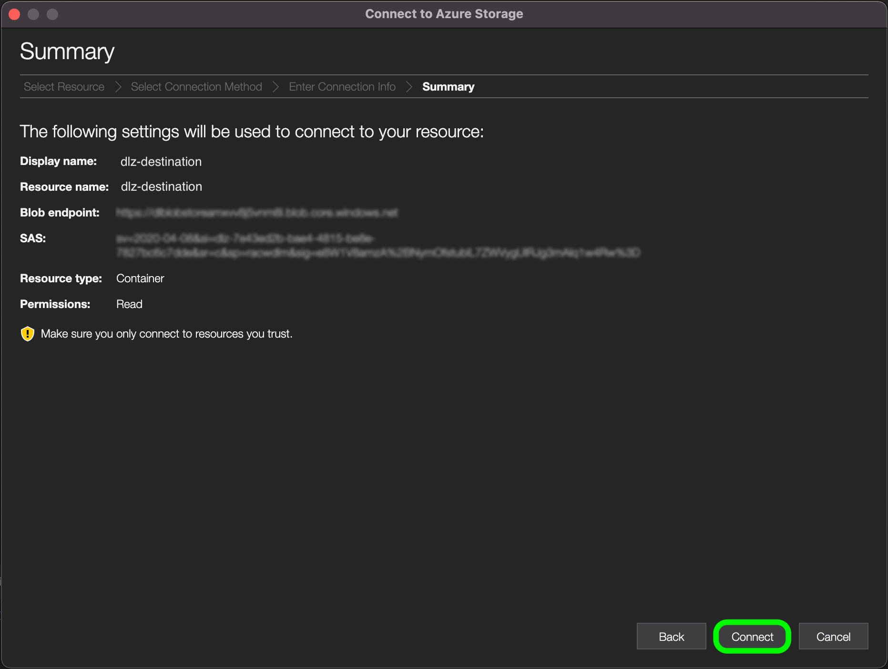

# [!DNL Data Landing Zone]

[!DNL Data Landing Zone] is [!DNL Azure Blob] Adobe Experience Platform에서 프로비저닝한 스토리지 인터페이스로, Platform으로 파일을 가져올 수 있는 안전한 클라우드 기반 파일 스토리지 설비에 액세스할 수 있도록 합니다. 액세스 권한이 있습니다. [!DNL Data Landing Zone] 샌드박스당 컨테이너 및 모든 컨테이너의 총 데이터 볼륨은 Platform Products 및 Services 라이선스와 함께 제공된 총 데이터로 제한됩니다. Platform 및 Launch의 모든 애플리케이션 서비스(예: [!DNL Customer Journey Analytics], [!DNL Journey Orchestration], [!DNL Intelligent Services], 및 [!DNL Adobe Real-Time Customer Data Platform] 하나의 [!DNL Data Landing Zone] 샌드박스당 컨테이너. 을 통해 컨테이너에 파일을 읽고 쓸 수 있습니다 [!DNL Azure Storage Explorer] 또는 명령줄 인터페이스를 사용할 수 있습니다.

[!DNL Data Landing Zone] 는 SAS 기반 인증을 지원하고 데이터는 표준으로 보호됩니다 [!DNL Azure Blob] 저장 보안 메커니즘이 휴지 및 전송 중입니다. SAS 기반 인증을 통해 [!DNL Data Landing Zone] 공용 인터넷 연결을 통한 컨테이너 사용자의 [!DNL Data Landing Zone] 컨테이너. 즉, 네트워크에 대한 허용 목록 또는 지역 간 설정을 구성할 필요가 없습니다. Platform에서는 [!DNL Data Landing Zone] 컨테이너. 7일 후 모든 파일이 삭제됩니다.

## 파일 및 디렉터리에 대한 이름 지정 제한

다음은 클라우드 저장소 파일 또는 디렉토리의 이름을 지정할 때 고려해야 하는 제한 목록입니다.

- 디렉터리 및 파일 구성 요소 이름은 255자를 초과할 수 없습니다.
- 디렉터리 및 파일 이름은 슬래시(`/`). 제공된 경우 자동으로 제거됩니다.
- 다음 예약된 URL 문자를 제대로 이스케이프해야 합니다. `! ' ( ) ; @ & = + $ , % # [ ]`
- 다음 문자는 사용할 수 없습니다. `" \ / : | < > * ?`.
- 잘못된 URL 경로 문자를 사용할 수 없습니다. 다음과 같은 코드 포인트 `\uE000`NTFS 파일 이름에서 사용할 수 있지만 올바른 유니코드 문자는 아닙니다. 또한 컨트롤 문자(예: `0x00` to `0x1F`, `\u0081`, 등)도 허용되지 않습니다. HTTP/1.1의 유니코드 문자열을 관리하는 규칙은 다음을 참조하십시오 [RFC 2616, 섹션 2.2: 기본 규칙](https://www.ietf.org/rfc/rfc2616.txt) 및 [RFC 3987](https://www.ietf.org/rfc/rfc3987.txt).
- 다음 파일 이름은 허용되지 않습니다. LPT1, LPT2, LPT3, LPT4, LPT5, LPT6, LPT7, LPT8, LPT9, COM1, COM2, COM3, COM4, COM5, COM6, COM7, COM8, COM9, PRN, AUX, UL, CON, CLOCK$, dot 문자(..) 및 두 개의 점 문자(.)가 있습니다.

## 의 컨텐츠를 관리합니다 [!DNL Data Landing Zone]

다음을 사용할 수 있습니다 [[!DNL Azure Storage Explorer]](https://azure.microsoft.com/en-us/features/storage-explorer/) 의 컨텐츠를 관리하려면 [!DNL Data Landing Zone] 컨테이너.

에서 [!DNL Azure Storage Explorer] UI의 왼쪽 탐색에서 연결 아이콘을 선택합니다. 다음 **리소스 선택** 연결할 옵션을 제공하는 창이 나타납니다. 선택 **[!DNL Blob container]** 에 연결 [!DNL Data Landing Zone].


다음 을 선택합니다. **공유 액세스 서명 URL(SAS)** 을 연결 메서드로 사용하고 **다음**.


연결 방법을 선택한 후 다음을 제공해야 합니다 **표시 이름** 그리고 **[!DNL Blob]컨테이너 SAS URL** 해당 [!DNL Data Landing Zone] 컨테이너.

>[!TIP]
>
>을(를) 검색할 수 있습니다 [!DNL Data Landing Zone] 플랫폼 UI에 있는 소스 카탈로그의 자격 증명입니다.

다음 사항을 제공하십시오. [!DNL Data Landing Zone] SAS URL을 선택한 후 **다음**


다음 **요약** 창이 나타나고 설정에 대한 정보를 포함하여 설정에 대한 개요를 제공합니다 [!DNL Blob] 엔드포인트 및 권한. 준비되면 을 선택합니다. **Connect**.



연결에 성공하면 [!DNL Azure Storage Explorer] 사용 중인 UI [!DNL Data Landing Zone] 컨테이너.


사용 [!DNL Data Landing Zone] 연결된 컨테이너 [!DNL Azure Storage Explorer]이제 파일에 대한 업로드를 시작할 수 있습니다. [!DNL Data Landing Zone] 컨테이너. 업로드하려면 을(를) 선택합니다 **업로드** 그런 다음 **파일 업로드**.


업로드할 파일을 선택한 후에는 해당 파일을 식별해야 합니다 [!DNL Blob] 업로드할 대상 디렉토리와 원하는 대상 디렉토리를 입력합니다. 완료되면 을 선택합니다 **업로드**.

| [!DNL Blob] 유형 | 설명 |
| --- | --- |
| 블록 [!DNL Blob] | 블록 [!DNL Blobs] 는 대량의 데이터를 효율적으로 업로드하도록 최적화되었습니다. 블록 [!DNL Blobs] 에 대한 기본 옵션입니다. [!DNL Data Landing Zone]. |
| 추가 [!DNL Blob] | 추가 [!DNL Blobs] 는 파일 끝에 데이터를 추가하도록 최적화되었습니다. |


## 파일에 업로드 [!DNL Data Landing Zone] 명령줄 인터페이스 사용

장치의 명령줄 인터페이스를 사용하고 업로드 파일에 액세스하여 [!DNL Data Landing Zone].

### Bash를 사용하여 파일 업로드

다음 예제에서는 Bash 및 cURL을 사용하여 파일을 [!DNL Data Landing Zone] 사용 [!DNL Azure Blob Storage] REST API:

```shell
# Set Azure Blob-related settings
DATE_NOW=$(date -Ru | sed 's/\+0000/GMT/')
AZ_VERSION="2018-03-28"
AZ_BLOB_URL="<URL TO BLOB ACCOUNT>"
AZ_BLOB_CONTAINER="<BLOB CONTAINER NAME>"
AZ_BLOB_TARGET="${AZ_BLOB_URL}/${AZ_BLOB_CONTAINER}"
AZ_SAS_TOKEN="<SAS TOKEN, STARTING WITH ? AND ENDING WITH %3D>"

# Path to the file we wish to upload
FILE_PATH="</PATH/TO/FILE>"
FILE_NAME=$(basename "$FILE_PATH")

# Execute HTTP PUT to upload file (remove '-v' flag to suppress verbose output)
curl -v -X PUT \
   -H "Content-Type: application/octet-stream" \
   -H "x-ms-date: ${DATE_NOW}" \
   -H "x-ms-version: ${AZ_VERSION}" \
   -H "x-ms-blob-type: BlockBlob" \
   --data-binary "@${FILE_PATH}" "${AZ_BLOB_TARGET}/${FILE_NAME}${AZ_SAS_TOKEN}"
```

### Python을 사용하여 파일 업로드

다음 예제에서는 를 사용합니다 [!DNL Microsoft's] Python v12 SDK를 사용하여 파일을 [!DNL Data Landing Zone]:

>[!TIP]
>
>아래 예제에서는 전체 SAS URI를 사용하여 [!DNL Azure Blob] 컨테이너에서 다른 방법 및 작업을 사용하여 인증할 수 있습니다. 다음 보기 [[!DNL Microsoft] Python v12 SDK에 대한 문서](https://docs.microsoft.com/en-us/azure/storage/blobs/storage-quickstart-blobs-python) 추가 정보.

```py
import os
from azure.storage.blob import ContainerClient

try:
    # Set Azure Blob-related settings
    sasUri = "<SAS URI>"
    srcFilePath = "<FULL PATH TO FILE>" 
    srcFileName = os.path.basename(srcFilePath)

    # Connect to container using SAS URI
    containerClient = ContainerClient.from_container_url(sasUri)

    # Upload file to Data Landing Zone with overwrite enabled
    with open(srcFilePath, "rb") as fileToUpload:
        containerClient.upload_blob(srcFileName, fileToUpload, overwrite=True)

except Exception as ex:
    print("Exception: " + ex.strerror)
```

### 을 사용하여 파일 업로드 [!DNL AzCopy]

다음 예제에서는 를 사용합니다 [!DNL Microsoft's] [!DNL AzCopy] 파일을 업로드하는 유틸리티 [!DNL Data Landing Zone]:

>[!TIP]
>
>아래 예제는 `copy` 명령을 사용하면 다른 명령과 옵션을 사용하여 파일을 [!DNL Data Landing Zone], 사용 [!DNL AzCopy]. 다음 보기 [[!DNL Microsoft AzCopy] 문서](https://docs.microsoft.com/en-us/azure/storage/common/storage-ref-azcopy?toc=/azure/storage/blobs/toc.json) 추가 정보.

```bat
set sasUri=<FULL SAS URI, PROPERLY ESCAPED>
set srcFilePath=<PATH TO LOCAL FILE(S); WORKS WITH WILDCARD PATTERNS>

azcopy copy "%srcFilePath%" "%sasUri%" --overwrite=true --recursive=true
```

## Connect [!DNL Data Landing Zone] to [!DNL Platform]

아래 설명서에서는 [!DNL Data Landing Zone] API 또는 사용자 인터페이스를 사용하여 Adobe Experience Platform에 컨테이너를 전송하는 것이 좋습니다.

### API 사용

- [만들기 [!DNL Data Landing Zone] 흐름 서비스 API를 사용한 소스 연결](../../tutorials/api/create/cloud-storage/data-landing-zone.md)
- [Flow Service API를 사용하여 클라우드 스토리지 소스에 대한 데이터 흐름 만들기](../../tutorials/api/collect/cloud-storage.md)

### UI 사용

- [Connect [!DNL Data Landing Zone] UI를 사용하여 플랫폼 구현](../../tutorials/ui/create/cloud-storage/data-landing-zone.md)
- [UI에서 클라우드 스토리지 연결을 위한 데이터 흐름 만들기](../../tutorials/ui/dataflow/batch/cloud-storage.md)
