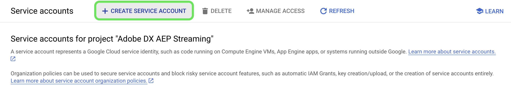

# [!DNL Google PubSub] 소스

>[!IMPORTANT]
>
>다음 [!DNL Google PubSub] 소스는 Real-time Customer Data Platform Ultimate를 구매한 사용자에게 소스 카탈로그에서 사용할 수 있습니다.

Adobe Experience Platform은 다음과 같은 클라우드 공급자를 위한 기본 연결을 제공합니다 [!DNL AWS], [!DNL Google Cloud Platform], 및 [!DNL Azure]를 사용하면 다운스트림 서비스 및 대상에서 사용할 수 있도록 이러한 시스템의 데이터를 플랫폼으로 가져올 수 있습니다.

클라우드 스토리지 소스는 다운로드, 포맷 또는 업로드 없이도 데이터를 플랫폼으로 가져올 수 있습니다. 수집된 데이터는 XDM JSON, XDM Parquet 또는 구분된 형식으로 지정할 수 있습니다. 프로세스의 모든 단계는 소스 워크플로우에 통합됩니다. 플랫폼에서 다음 위치에서 데이터를 가져올 수 있습니다. [!DNL Google PubSub] 실시간으로.

## 전제 조건 {#prerequisites}

이 섹션에서는 연결하기 전에 완료해야 하는 사전 요구 사항 설정에 대해 간략히 설명합니다. [!DNL Google PubSub] Experience Platform 계정.

### 서비스 계정 만들기 {#create-service-account}

A **서비스 계정** 은 개인이 아닌 애플리케이션에서 자주 사용하거나 워크로드를 계산하는 계정 유형입니다. 서비스 계정은 계정에 고유한 이메일 주소로 식별됩니다.

* 한편으로는 서비스 계정이 다음과 같습니다 **사용자** - 서비스 계정에 액세스 권한을 부여할 수 있습니다. [!DNL Google Cloud] 리소스. 예를 들어 서비스 계정에 [연산] 관리자 역할을 부여할 수 있습니다 `(roles/compute.admin)` 특정 프로젝트에 대해 설명합니다. 이렇게 하면 서비스 계정이 해당 특정 프로젝트의 Compute Engine 리소스를 관리할 수 있습니다.
* 다른 한편으로 서비스 계정은 리소스이기도 합니다. 다른 주도자에게 서비스 계정에 액세스할 수 있는 권한을 부여할 수 있습니다. 예를 들어 사용자에게 서비스 계정 사용자 역할을 부여할 수 있습니다 `(roles/iam.serviceAccountUser)` 사용자가 해당 서비스 계정을 리소스에 첨부할 수 있도록 서비스 계정에서. 또는 사용자에게 서비스 계정 관리자 역할을 부여할 수 있습니다 `(roles/iam.serviceAccountAdmin)` 사용자가 서비스 계정 보기, 편집, 비활성화 및 삭제와 같은 작업을 완료할 수 있도록 허용

사용 사례에 적합한 인증 유형을 결정하는 방법에 대한 자세한 내용은 [[!DNL Google] 인증 방법에 대한 안내서](https://cloud.google.com/docs/authentication).

아래 설명된 단계에 따라 서비스 계정을 만드십시오.

먼저 다음 위치로 이동합니다. [!DNL IAM] 페이지의 [!DNL Google Developer Console] 다음을 선택합니다. **[!DNL Create Service Account]**.

다음으로 서비스 계정의 표시 이름과 ID를 입력한 다음 을 선택합니다 **[!DNL Create and Continue]**.

### 서비스 계정 키 생성 {#generate-service-account-keys}

서비스 계정에 대한 키를 생성하려면 서비스 계정 페이지에서 키 헤더를 선택합니다. 여기에서 을(를) 선택합니다 **[!DNL Add key]** 다음을 선택합니다. **[!DNL Create new key]** 드롭다운 메뉴를 통해 액세스합니다. 이 패널을 사용하여 기존 키를 업로드할 수도 있습니다.

성공하면 컴퓨터에 개인 키가 저장되었으며 파일이 다운로드된다는 메시지가 표시됩니다. 그런 다음 파일을 만들 때 이 파일의 콘텐츠를 자격 증명으로 사용할 수 있습니다. [!DNL Google PubSub] Experience Platform 계정.

### 주제 및 구독 수준에서 권한 부여 {#grant-permissions}

주제 및 가입 수준에서 권한을 부여하려면 주제 콘솔 페이지로 이동한 다음 을 선택합니다 **[!DNL Show info panel]**. 다음, 아래에서 [!DNL Permissions] 탭, 선택 [!DNL Add Principal] 그런 다음 서비스 계정 사용자를 권한과 함께 추가합니다.

## 최적의 구성을 위한 구성 [!DNL Google PubSub usage] {#optimal-configurations}

이 섹션에서는 의 사용을 최적화하기 위해 권장되는 구성을 간략하게 설명합니다. [!DNL Google PubSub] 소스 - Experience Platform

### 구독 속성 {#subscription-properties}

사용 [!DNL Google Developer Console] 끝 **승인 기한 늘리기**. 이렇게 하면 [!DNL Google Publisher] 메시지를 다시 보내기 전에 구성할 시간에 따라 대기해야 합니다. 이러한 지연은 가입자 수준에서 불필요한 부하를 줄이는 데 도움이 된다.

사용 **[!DNL exactly one delivery]**. 이 구성은 [!DNL Google Publisher] 확인 기한이 만료되기 전에 구독으로 전송된 메시지가 다시 전송되지 않도록 합니다. 이 설정을 사용하여 승인 메시지가 구독으로 다시 전송되지 않도록 할 수 있습니다.

다음을 활성화할 수 있습니다. **[!DNL Retry after exponential backoff delay]** 서버를 추가로 압도할 위험을 줄이십시오. 다음에서 이 구성을 활성화할 수 있습니다. [!DNL Google Developer Console] 다른 연결을 시도하기 전에 시스템에 복구 시간을 더 많이 제공하여 일시적인 오류(일반적으로 자체적으로 해결되는 일시적인 오류)를 보다 효과적으로 완화할 수 있습니다.

다음을 수행해야 합니다. **구독 메시지 보존 기간을 24시간 이상으로 설정합니다.** 최대 로드 중에 승인되지 않은 데이터가 유실되지 않도록 합니다. 또한, **배달 못한 편지 항목 활성화** 드물게 발생하는 경계 사례에서도 데이터 손실이 발생하지 않도록 합니다.

>[!IMPORTANT]
>
>소스 데이터 흐름은 당 하나만 만들 수 있습니다. [!DNL Google PubSub] 구독. 샌드박스에서 구독을 재사용하면 데이터가 손실됩니다.

## 연결 [!DNL Google PubSub] 대상 Experience Platform

아래 설명서는 연결 방법에 대한 정보를 제공합니다 [!DNL Google PubSub] API 또는 사용자 인터페이스를 사용하여 Platform으로

### API 사용

* [흐름 서비스 API를 사용하여 Google PubSub 소스 연결 만들기](../../tutorials/api/create/cloud-storage/google-pubsub.md)
* [흐름 서비스 API를 사용하여 스트리밍 데이터 수집](../../tutorials/api/collect/streaming.md)

### UI 사용

* [UI에서 Google PubSub 소스 연결 만들기](../../tutorials/ui/create/cloud-storage/google-pubsub.md)
* [UI에서 클라우드 스토리지 연결을 위한 데이터 흐름 구성](../../tutorials/ui/dataflow/streaming/cloud-storage-streaming.md)
