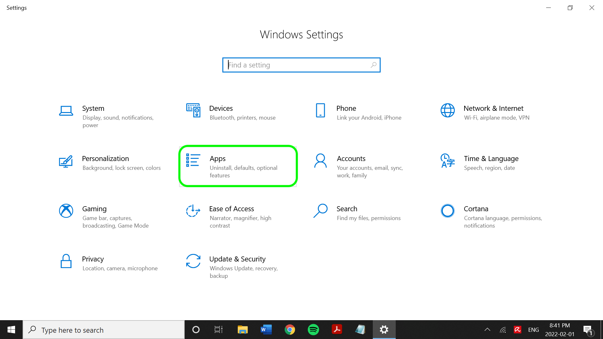

# SFTP 커넥터

>[!IMPORTANT]
>
>Adobe Experience Platform이 연결하는 [!DNL SFTP] 서버는 청킹을 지원할 수 있어야 합니다. 즉, 단일 파일에 여러 번 연결됩니다. [!DNL SFTP] 서버에서 청킹을 지원하지 않으면 파일 수집을 방해하는 오류가 발생할 수 있습니다.

Adobe Experience Platform은 AWS, [!DNL Google Cloud Platform] 및 [!DNL Azure]과(와) 같은 클라우드 공급업체에 기본 연결을 제공하므로 이러한 시스템에서 데이터를 가져올 수 있습니다.

클라우드 저장소 소스는 다운로드, 포맷 또는 업로드 없이도 자신의 데이터를 [!DNL Platform](으)로 가져올 수 있습니다. 수집된 데이터는 XDM JSON, XDM Parquet 또는 구분된 형식으로 지정할 수 있습니다. 프로세스의 모든 단계는 소스 워크플로우에 통합됩니다. [!DNL Platform]을(를) 사용하면 일괄 처리를 통해 FTP 또는 SFTP 서버에서 데이터를 가져올 수 있습니다.

## IP 주소 허용 목록

소스 커넥터로 작업하려면 먼저 IP 주소 목록을 허용 목록에 추가해야 합니다. 지역별 IP 주소를 허용 목록에 추가하지 않으면 소스 사용 시 오류가 발생하거나 성능이 저하될 수 있습니다. 자세한 내용은 [IP 주소 허용 목록](../../ip-address-allow-list.md) 페이지를 참조하세요.

## 파일 및 디렉터리에 대한 이름 지정 제약 조건

다음은 클라우드 저장소 파일 또는 디렉터리의 이름을 지정할 때 고려해야 하는 제한 사항 목록입니다.

- 디렉터리 및 파일 구성 요소 이름은 255자를 초과할 수 없습니다.
- 디렉터리 및 파일 이름은 슬래시(`/`)로 끝날 수 없습니다. 제공되면 자동으로 제거됩니다.
- 다음 예약된 URL 문자는 올바르게 이스케이프해야 합니다. `! ' ( ) ; @ & = + $ , % # [ ]`
- `" \ / : | < > * ?` 문자는 사용할 수 없습니다.
- 잘못된 URL 경로 문자는 허용되지 않습니다. `\uE000` 같은 코드 포인트는 NTFS 파일 이름에서 사용할 수 있지만 올바른 유니코드 문자가 아닙니다. 또한 제어 문자(0x00 ~ 0x1F, \u0081 등)와 같은 일부 ASCII 또는 유니코드 문자도 사용할 수 없습니다. HTTP/1.1의 유니코드 문자열을 제어하는 규칙에 대해서는 [RFC 2616, 섹션 2.2: 기본 규칙](https://www.ietf.org/rfc/rfc2616.txt) 및 [RFC 3987](https://www.ietf.org/rfc/rfc3987.txt)을 참조하십시오.
- LPT1, LPT2, LPT3, LPT4, LPT5, LPT6, LPT7, LPT8, LPT9, COM1, COM2, COM3, COM4, COM5, COM6, COM7, COM8, COM9, PRN, AUX, NUL, CON, CLOCK$, 점 문자(.) 및 점 문자(..) 두 개를 사용할 수 없습니다.

## [!DNL SFTP]에 대한 Base64 인코딩 OpenSSH 개인 키 설정

[!DNL SFTP] 원본은 [!DNL Base64] 인코딩된 OpenSSH 개인 키를 사용하여 인증을 지원합니다. Base64로 인코딩된 OpenSSH 개인 키를 생성하고 [!DNL SFTP]을(를) 플랫폼에 연결하는 방법에 대한 자세한 내용은 아래 단계를 참조하십시오.

### 사용자 [!DNL Windows]명

[!DNL Windows] 컴퓨터를 사용하는 경우 **시작** 메뉴를 연 다음 **설정**&#x200B;을 선택하세요.


표시되는 **설정** 메뉴에서 **앱**&#x200B;을 선택합니다.



**선택적 기능**&#x200B;을(를) 선택하십시오.


선택적 기능 목록이 나타납니다. **OpenSSH Client**&#x200B;이(가) 컴퓨터에 이미 사전 설치된 경우 **선택적 기능**&#x200B;의 **설치된 기능** 목록에 포함됩니다.


설치되지 않은 경우 **설치**&#x200B;를 선택한 다음 **[!DNL Powershell]**&#x200B;을(를) 열고 다음 명령을 실행하여 개인 키를 생성합니다.

```shell
PS C:\Users\lucy> ssh-keygen -t rsa -m pem
Generating public/private rsa key pair.
Enter file in which to save the key (C:\Users\lucy/.ssh/id_rsa):
Enter passphrase (empty for no passphrase):
Enter same passphrase again:
Your identification has been saved in C:\Users\lucy/.ssh/id_rsa.
Your public key has been saved in C:\Users\lucy/.ssh/id_rsa.pub.
The key fingerprint is:
SHA256:osJ6Lg0TqK8nekNQyZGMoYwfyxNc+Wh0hYBtBylXuGk lucy@LAPTOP-FUJT1JEC
The key's randomart image is:
+---[RSA 3072]----+
|.=.*+B.o.        |
|=.O.O +          |
|+o+= B           |
|+o +E .          |
|.o=o  . S        |
|+... . .         |
| *o .            |
|o.B.             |
|=O..             |
+----[SHA256]-----+
```

그런 다음 개인 키의 파일 경로를 제공하는 동안 다음 명령을 실행하여 [!DNL Base64]에서 개인 키를 인코딩합니다.

```shell
C:\Users\lucy> [convert]::ToBase64String((Get-Content -path "C:\Users\lucy\.ssh\id_rsa" -Encoding byte)) > C:\Users\lucy\.ssh\id_rsa_base64
```

위의 명령은 지정한 파일 경로에 [!DNL Base64] 인코딩 개인 키를 저장합니다. 그런 다음 해당 개인 키를 사용하여 [!DNL SFTP]을(를) 인증하고 플랫폼에 연결할 수 있습니다.

### 사용자 [!DNL Mac]명

[!DNL Mac]을(를) 사용하는 경우 **터미널**&#x200B;을(를) 열고 다음 명령을 실행하여 개인 키를 생성합니다. 이 경우 개인 키는 `/Documents/id_rsa`에 저장됩니다.

```shell
ssh-keygen -t rsa -m pem -f ~/Documents/id_rsa
Generating public/private rsa key pair.
Enter passphrase (empty for no passphrase):
Enter same passphrase again:
Your identification has been saved in /Users/vrana/Documents/id_rsa.
Your public key has been saved in /Users/vrana/Documents/id_rsa.pub.
The key fingerprint is:
SHA256:s49PCaO4a0Ee8I7OOeSyhQAGc+pSUQnRii9+5S7pp1M vrana@vrana-macOS
The key's randomart image is:
+---[RSA 2048]----+
|o ==..           |
|.+..o            |
|oo.+             |
|=.. +            |
|oo = .  S        |
|+.+ +E . = .     |
|o*..*.. . o      |
|.o*=.+   +       |
|.oo=Oo  ..o      |
+----[SHA256]-----+
```

그런 다음 [!DNL Base64]에서 개인 키를 인코딩하려면 다음 명령을 실행하십시오.

```shell
base64 ~/Documents/id_rsa > ~/Documents/id_rsa_base64
 
 
# Print Content of base64 encoded file
cat ~/Documents/id_rsa_base64
LS0tLS1CRUdJTiBPUEVOU1NIIFBSSVZBVEUgS0VZLS0tLS0KYjNCbGJuTnphQzFyWlhrdGRqRUFBQUFBQkc1dmJtVUFBQUFFYm05dVpRQUFBQUFBQUFBQkFBQUJGd0FBQUFkemMyZ3RjbgpOaEFBQUFBd0VBQVFBQUFRRUF0cWFYczlXOUF1ZmtWazUwSXpwNXNLTDlOMU9VYklaYXVxbVM0Q0ZaenI1NjNxUGFuN244CmFxZWdvQTlCZnVnWDJsTVpGSFl5elEzbnp6NXdXMkdZa1hkdjFjakd0elVyNyt1NnBUeWRneGxrOGRXZWZsSzBpUlpYWW4KVFRwS0E5c2xXaHhjTXg3R2x5ejdGeDhWSzI3MmdNSzNqY1d1Q0VIU3lLSFR5SFFwekw0MEVKbGZJY1RGR1h1dW1LQjI5SwpEakhwT1grSDdGcG5Gd1pabTA4Uzc2UHJveTVaMndFalcyd1lYcTlyUDFhL0E4ejFoM1ZLdllzcG53c2tCcHFQSkQ1V3haCjczZ3M2OG9sVllIdnhWajNjS3ZsRlFqQlVFNWRNUnB2M0I5QWZ0SWlrYmNJeUNDaXV3UnJmbHk5eVNPQ2VlSEc0Z2tUcGwKL3V4YXNOT0h1d0FBQThqNnF6R1YrcXN4bFFBQUFBZHpjMmd0Y25OaEFBQUJBUUMycHBlejFiMEM1K1JXVG5Rak9ubXdvdgowM1U1UnNobHE2cVpMZ0lWbk92bnJlbzlxZnVmeHFwNkNnRDBGKzZCZmFVeGtVZGpMTkRlZlBQbkJiWVppUmQyL1Z5TWEzCk5TdnY2N3FsUEoyREdXVHgxWjUrVXJTSkZsZGlkTk9rb0QyeVZhSEZ3ekhzYVhMUHNYSHhVcmJ2YUF3cmVOeGE0SVFkTEkKb2RQSWRDbk12alFRbVY4aHhNVVplNjZZb0hiMG9PTWVrNWY0ZnNXbWNYQmxtYlR4THZvK3VqTGxuYkFTTmJiQmhlcjJzLwpWcjhEelBXSGRVcTlpeW1mQ3lRR21vOGtQbGJGbnZlQ3pyeWlWVmdlL0ZXUGR3cStVVkNNRlFUbDB4R20vY0gwQiswaUtSCnR3aklJS0s3Qkd0K1hMM0pJNEo1NGNiaUNST21YKzdGcXcwNGU3QUFBQUF3RUFBUUFBQVFBcGs0WllzMENSRnNRTk9WS0sKYWxjazlCVDdzUlRLRjFNenhrSGVydmpJYk9kL0lvRXpkcHlVa28rbm41RmpGK1hHRnNCUXZnOFdTaUlJTk1oU3BNYWI1agpvWXlka2gvd0ovWElOaDlZaE5QVXlURi9NNkFnMkNYd21KS2RxN1VKWjZyNjloV3V0VVN6U05QbkVYWTZLc29GeVUwTEFvCko0OHJMT1pMZldtMHFhWDBLNUgzNmJPaHFXSWJwMDNoZk94eno5M0MrSDM5MFJkRkp4bzJVZ0FVY3UvdHREb0REVldBdmEKVkVyMWEzak9LenVHbThrK21WeXpPZERjVFY4ckZIT0pwRnRBU3l6Q24yVld1MjV0TWtrcGRPRjNKcVdMZHdOY3loeG1URApXZGVDNWh4V0Fiano0WDZ5WXpHcFcwTmptVkFoWUVVZGNBSVlXWWM3OGEvQkFBQUFnRm8wakl4aGhwZkJ6QjF6b09FMDJBClpjTC9hcUNuYysrdmJ1a2V0aFg5Zzhlb0xQMTQyeUgzdlpLczl3c1RtbVVsZ0prZURaN2hUcklwOGY2eEwzdDRlMXByY1kKb2ZLd0gwckNGOTFyaldPbGZOUmxEempoR1NTTEVMczZoNlNzMEdBQXE2Z0ZQTVF2dTB4TDlQUTlGQ21YZVVKazJpRm1MWgpEWWJGc0NyVUxEQUFBQWdRRGF0a1pMamJaSTBFM0ZuY2dTOVF5Y3lVWmtkZ1dVNjBQcG9ud3BMQXdUdHRpOG1EQXE5cHYwClEvUlk1WE9UeGF3VXNHa0tYMjNtV1BYR0grdUlBSzhrelVVM2dGM1dRWGVkTWw4NHVCVFZCTEtUdStvVVAvZmIvMEE0dE0KSE9BSythbXZPMkZuYzFiSmVwd05USTE2cjZXWk9sZWV2ZklJQVpXcEgxVVpIdkVRQUFBSUVBMWNwcStDNUVXSFJwbnVPZQpiNHE4T0tKTlJhSUxIRUN6U0twWlFpZDFhRmJYWlVKUXpIQU85YzhINVZMcjBNUjFkcW1ORkNja2ZsZzI2Y3BEUEl3TjBYCm5HMFBxcmhKbXp0U3ZQZ3NGdkNPallncXF6U0RYUjkxd1JQTEN5cU8zcGMyM2kzZnp2WkhtMGhIdWdoNVJqV0loUlFZVkwKZUpDWHRqM08vY3p1SWdzQUFBQVJkbkpoYm1GQWRuSmhibUV0YldGalQxTUJBZz09Ci0tLS0tRU5EIE9QRU5TU0ggUFJJVkFURSBLRVktLS0tLQo=
```

[!DNL Base64] 인코딩 개인 키가 지정한 폴더에 저장되면 공개 키 파일의 내용을 [!DNL SFTP] 호스트 인증 키의 새 줄에 추가해야 합니다. 명령줄에서 다음 명령을 실행합니다.

```shell
cat ~/id_rsa.pub >> ~/.ssh/authorized_keys
```

공개 키가 제대로 추가되었는지 확인하려면 명령줄에서 다음을 실행할 수 있습니다.

```shell
more ~/.ssh/authorized_keys
```

## SFTP를 [!DNL Platform]에 연결

>[!IMPORTANT]
>
>연결하기 전에 SFTP 서버 구성에서 키보드 대화형 인증을 비활성화해야 합니다. 이 설정을 비활성화하면 서비스나 프로그램을 통해 입력하는 것이 아니라 암호를 수동으로 입력할 수 있습니다. 키보드 대화형 인증에 대한 자세한 내용은 [구성 요소 Pro 문서](https://doc.componentpro.com/ComponentPro-Sftp/authenticating-with-a-keyboard-interactive-authentication)를 참조하십시오.

아래 설명서는 API 또는 사용자 인터페이스를 사용하여 SFTP 서버를 [!DNL Platform]에 연결하는 방법에 대한 정보를 제공합니다.

### API 사용

- [흐름 서비스 API를 사용하여 SFTP 기본 연결 만들기](../../tutorials/api/create/cloud-storage/sftp.md)
- [흐름 서비스 API를 사용하여 클라우드 스토리지 소스의 데이터 구조 및 콘텐츠 탐색](../../tutorials/api/explore/cloud-storage.md)
- [흐름 서비스 API를 사용하여 클라우드 스토리지 소스에 대한 데이터 흐름 만들기](../../tutorials/api/collect/cloud-storage.md)

### UI 사용

- [UI에서 SFTP 소스 연결 만들기](../../tutorials/ui/create/cloud-storage/sftp.md)
- [UI에서 클라우드 스토리지 연결을 위한 데이터 흐름 만들기](../../tutorials/ui/dataflow/batch/cloud-storage.md)
