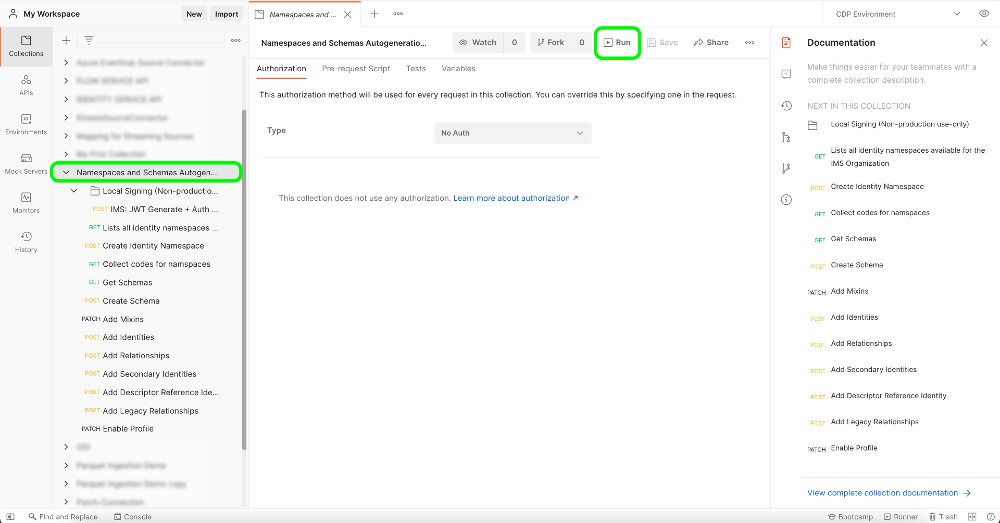

# [!DNL Salesforce]

>[!IMPORTANT]
>
>이제 Amazon Web Services(AWS)에서 Adobe Experience Platform을 실행할 때 [!DNL Salesforce] 소스를 사용할 수 있습니다. AWS에서 실행되는 Experience Platform은 현재 제한된 수의 고객이 사용할 수 있습니다. 지원되는 Experience Platform 인프라에 대한 자세한 내용은 [Experience Platform 멀티 클라우드 개요](../../../landing/multi-cloud.md)를 참조하세요.

Adobe Experience Platform을 사용하면 외부 소스에서 데이터를 수집할 수 있으며 Experience Platform 서비스를 사용하여 들어오는 데이터를 구조화하고, 레이블을 지정하고, 향상시킬 수 있습니다. Adobe 애플리케이션, 클라우드 기반 스토리지, 데이터베이스 및 기타 여러 소스와 같은 다양한 소스에서 데이터를 수집할 수 있습니다.

Experience Platform은 서드파티 CRM 시스템에서 데이터 수집을 지원합니다. CRM 공급자에 대한 지원에는 [!DNL Salesforce]이(가) 포함됩니다.

## Azure에서 Experience Platform에 대한 [!DNL Salesforce] 소스 설정 {#azure}

Azure에서 Experience Platform에 대한 [!DNL Salesforce] 계정을 설정하는 방법을 알아보려면 아래 단계를 참조하세요.

### 허용 목록에 추가하다 Azure에 연결하기 위한 IP 주소

소스를 Azure의 Experience Platform에 연결하기 전에 지역별 IP 주소를 허용 목록에 추가하다에 추가해야 합니다. 영역별 IP 주소를 허용 목록에 추가하다에 추가하지 않으면 소스를 사용할 때 오류나 성능이 저하될 수 있습니다. 허용 목록에 추가하다 자세한 내용은 [IP 주소](../../ip-address-allow-list.md) 페이지를 참조하십시오.

>[!BEGINTABS]

>[!TAB VA7]

- `40.70.226.96/28`
- `40.70.226.32/28`
- `52.232.229.255`
- `52.232.229.253`
- `40.70.226.144/28`
- `40.70.226.64/28`
- `40.70.225.240/28`
- `40.70.225.224/28`
- `40.70.224.64/29`
- `40.70.226.80/28`
- `40.70.226.176/28`
- `52.232.229.230`
- `40.70.226.128/28`
- `40.70.226.0/28`
- `40.70.226.16/28`
- `52.138.119.167`
- `40.70.226.160/28`
- `40.70.226.192/28`
- `40.70.226.48/28`
- `20.96.243.176`
- `40.70.226.112/28`
- `40.70.226.208/28`

>[!TAB NLD2]

- `40.74.4.144/28`
- `40.74.3.176/28`
- `40.74.5.128/28`
- `40.74.4.176/28`
- `40.74.6.112/28`
- `40.74.7.128/28`
- `40.74.6.144/28`
- `51.105.144.81`
- `52.142.236.87`
- `40.74.6.80/28`
- `20.101.246.9`
- `40.74.7.208/28`
- `40.74.6.128/28`
- `40.74.7.176/28`
- `51.124.70.4`
- `40.74.7.144/28`
- `108.141.12.47`
- `20.50.23.153`
- `51.144.184.248/29`
- `40.74.7.160/28`
- `40.74.7.192/28`
- `51.105.144.1`
- `40.74.4.160/28`
- `40.74.6.96/28`

>[!TAB AUS5]

- `20.43.111.32/28`
- `20.43.110.144/28`
- `20.53.111.113`
- `20.227.32.175`
- `20.43.110.96/28`
- `20.43.110.64/28`
- `20.193.56.144/28`
- `20.43.110.192/28`
- `20.43.97.95`
- `20.43.111.16/28`
- `20.43.110.128/28`
- `20.40.185.111`
- `20.193.56.160/28`
- `20.43.110.112/28`
- `40.82.220.111`
- `20.43.111.0/28`
- `20.193.38.208/28`
- `20.43.110.80/28`
- `20.43.110.176/28`
- `20.43.110.48/28`
- `20.193.36.37`
- `20.43.110.208/28`
- `20.43.110.224/28`
- `20.43.110.160/28`
- `20.40.185.225`
- `20.43.110.240/28`
- `20.193.56.128/28`
- `20.40.185.185`

>[!TAB CAN2]

- `20.116.159.48/28`
- `20.116.159.144/28`
- `20.116.159.96/28`
- `20.220.243.238`
- `20.116.159.80/28`
- `20.116.159.32/28`
- `20.151.241.138`
- `4.172.28.20`
- `20.151.241.124`
- `20.116.248.0/28`
- `20.116.155.128/28`
- `20.116.159.64/28`
- `20.116.159.192/28`
- `20.116.159.176/28`
- `20.116.175.240/28`
- `20.116.248.16/28`
- `20.116.158.240/28`
- `20.116.159.112/28`
- `20.151.240.247`
- `20.151.241.173`
- `20.116.159.128/28`
- `20.116.159.160/28`
- `20.116.159.0/28`
- `20.104.5.248`
- `20.116.175.224/28`
- `20.116.159.208/28`
- `20.116.159.224/28`

>[!TAB GBR9]

- `20.162.155.16/28`
- `20.162.154.96/28`
- `20.26.64.0/28`
- `20.26.64.96/28`
- `20.162.154.64/28`
- `20.108.200.27`
- `20.162.154.80/28`
- `20.162.153.192/28`
- `20.108.200.61`
- `20.162.154.48/28`
- `20.162.154.192/28`
- `20.162.154.0/28`
- `20.26.64.16/28`
- `20.162.154.112/28`
- `20.162.153.32/28`
- `20.254.80.141`
- `20.162.153.208/28`
- `20.108.203.20`
- `20.26.64.48/28`
- `20.162.154.240/28`
- `20.162.154.208/28`
- `20.162.154.160/28`
- `20.108.205.182`
- `20.108.202.198`
- `20.162.154.32/28`
- `20.162.153.16/28`

>[!TAB IND2]

- `4.188.92.84`
- `4.224.5.224/28`
- `4.224.7.32/28`
- `4.188.92.87`
- `4.188.89.92`
- `4.224.5.112/28`
- `4.224.6.80/28`
- `4.224.144.224/28`
- `4.224.144.240/28`
- `4.224.6.96/28`
- `4.188.89.255`
- `4.188.94.32/28`
- `4.224.5.96/28`
- `4.224.6.64/28`
- `4.224.7.48/28`
- `4.224.5.208/28`
- `4.188.90.65`
- `4.224.6.16/28`
- `4.224.6.0/28`
- `4.224.5.192/28`
- `4.224.7.16/28`
- `4.188.90.67`
- `4.188.90.17`
- `4.188.94.48/28`
- `4.224.6.112/28`
- `4.224.5.240/28`
- `4.224.7.0/28`

>[!ENDTABS]

### [!DNL Salesforce]에서 XDM으로 필드 매핑

[!DNL Salesforce]과(와) Experience Platform 간에 소스 연결을 설정하려면 Experience Platform에 수집되기 전에 [!DNL Salesforce] 소스 데이터 필드를 해당 대상 XDM 필드에 매핑해야 합니다.

[!DNL Salesforce] 데이터 세트와 Experience Platform 간의 필드 매핑 규칙에 대한 자세한 내용은 다음을 참조하세요.

- [연락처](../adobe-applications/mapping/salesforce.md#contact)
- [잠재 고객](../adobe-applications/mapping/salesforce.md#lead)
- [계정](../adobe-applications/mapping/salesforce.md#account)
- [기회](../adobe-applications/mapping/salesforce.md#opportunity)
- [영업 기회 연락처 역할](../adobe-applications/mapping/salesforce.md#opportunity-contact-role)
- [캠페인](../adobe-applications/mapping/salesforce.md#campaign)
- [캠페인 멤버](../adobe-applications/mapping/salesforce.md#campaign-member)
- [계정 연락처 관계](../adobe-applications/mapping/salesforce.md#account-contact-relation)

### [!DNL Salesforce] 네임스페이스 및 스키마 자동 생성 유틸리티 설정

[!DNL Salesforce] 소스를 [!DNL B2B-CDP]의 일부로 사용하려면 먼저 [!DNL Postman] 유틸리티를 설정하여 [!DNL Salesforce] 네임스페이스 및 스키마를 자동 생성해야 합니다. 다음 설명서는 [!DNL Postman] 유틸리티 설정에 대한 추가 정보를 제공합니다.

- 이 [GitHub 저장소](https://github.com/adobe/experience-platform-postman-samples/tree/master/Postman%20Collections/CDP%20Namespaces%20and%20Schemas%20Utility)에서 네임스페이스와 스키마 자동 생성 유틸리티 컬렉션 및 환경을 다운로드할 수 있습니다.
- 필요한 헤더에 대한 값을 수집하고 샘플 API 호출을 읽는 방법에 대한 세부 정보를 포함하여 Experience Platform API 사용에 대한 자세한 내용은 [Experience Platform API 시작](../../../landing/api-guide.md)에 대한 안내서를 참조하십시오.
- Experience Platform API에 대한 자격 증명을 생성하는 방법에 대한 자세한 내용은 [Experience Platform API 인증 및 액세스](../../../landing/api-authentication.md)에 대한 자습서를 참조하십시오.
- Experience Platform API용 [!DNL Postman]을(를) 설정하는 방법에 대한 자세한 내용은 [개발자 콘솔 설정 및 [!DNL Postman]](../../../landing/postman.md)에 대한 자습서를 참조하십시오.

이제 Experience Platform 개발자 콘솔과 [!DNL Postman]을(를) 설정하여 [!DNL Postman] 환경에 적절한 환경 값을 적용할 수 있습니다.

+++변수 테이블 안내서 보기

다음 표에는 예제 값과 [!DNL Postman] 환경 채우기에 대한 추가 정보가 포함되어 있습니다.

| 변수 | 설명 | 예 |
| --- | --- | --- |
| `CLIENT_SECRET` | `{ACCESS_TOKEN}`을(를) 생성하는 데 사용되는 고유 식별자입니다. `{CLIENT_SECRET}`을(를) 검색하는 방법에 대한 자세한 내용은 [Experience Platform API 인증 및 액세스](../../../landing/api-authentication.md)에 대한 자습서를 참조하십시오. | `{CLIENT_SECRET}` |
| `JWT_TOKEN` | JSON 웹 토큰(JWT)은 {ACCESS_TOKEN}을(를) 생성하는 데 사용되는 인증 자격 증명입니다. `{JWT_TOKEN}`을(를) 생성하는 방법에 대한 자세한 내용은 [Experience Platform API 인증 및 액세스](../../../landing/api-authentication.md)에 대한 자습서를 참조하십시오. | `{JWT_TOKEN}` |
| `API_KEY` | Experience Platform API 호출을 인증하는 데 사용되는 고유 식별자입니다. `{API_KEY}`을(를) 검색하는 방법에 대한 자세한 내용은 [Experience Platform API 인증 및 액세스](../../../landing/api-authentication.md)에 대한 자습서를 참조하십시오. | `c8d9a2f5c1e03789bd22e8efdd1bdc1b` |
| `ACCESS_TOKEN` | Experience Platform API 호출을 완료하는 데 필요한 인증 토큰입니다. `{ACCESS_TOKEN}`을(를) 검색하는 방법에 대한 자세한 내용은 [Experience Platform API 인증 및 액세스](../../../landing/api-authentication.md)에 대한 자습서를 참조하십시오. | `Bearer {ACCESS_TOKEN}` |
| `META_SCOPE` | [!DNL Marketo]과(와) 관련하여 이 값은 고정되어 있으며 항상 `ent_dataservices_sdk`(으)로 설정되어 있습니다. | `ent_dataservices_sdk` |
| `CONTAINER_ID` | `global` 컨테이너에는 모든 표준 Adobe 및 Experience Platform 파트너가 제공한 클래스, 스키마 필드 그룹, 데이터 형식 및 스키마가 들어 있습니다. [!DNL Marketo]과(와) 관련하여 이 값은 고정되어 있으며 항상 `global`(으)로 설정됩니다. | `global` |
| `PRIVATE_KEY` | Experience Platform API에 대한 [!DNL Postman] 인스턴스를 인증하는 데 사용되는 자격 증명입니다. {PRIVATE_KEY}을(를) 검색하는 방법에 대한 지침은 개발자 콘솔 설정 및 [개발자 콘솔 설정 및 [!DNL Postman]](../../../landing/postman.md)에 대한 자습서를 참조하십시오. | `{PRIVATE_KEY}` |
| `TECHNICAL_ACCOUNT_ID` | Adobe I/O에 통합하는 데 사용되는 자격 증명입니다. | `D42AEVJZTTJC6LZADUBVPA15@techacct.adobe.com` |
| `IMS` | IMS(Identity Management System)는 Adobe 서비스에 인증을 위한 프레임워크를 제공합니다. [!DNL Marketo]과(와) 관련하여 이 값은 고정되어 있으며 항상 `ims-na1.adobelogin.com`(으)로 설정됩니다. | `ims-na1.adobelogin.com` |
| `IMS_ORG` | 제품 및 서비스를 소유하거나 라이선스를 부여하고 해당 구성원에 대한 액세스를 허용할 수 있는 법인 엔티티입니다. `{ORG_ID}` 정보를 검색하는 방법에 대한 지침은 [개발자 콘솔 설정 및 [!DNL Postman]](../../../landing/postman.md)에 대한 자습서를 참조하십시오. | `ABCEH0D9KX6A7WA7ATQE0TE@adobeOrg` |
| `SANDBOX_NAME` | 사용 중인 가상 샌드박스 파티션의 이름입니다. | `prod` |
| `TENANT_ID` | 만든 리소스의 이름 간격이 제대로 지정되고 조직 내에 포함되어 있는지 확인하는 데 사용되는 ID입니다. | `b2bcdpproductiontest` |
| `PLATFORM_URL` | API 호출을 수행하는 URL 엔드포인트. 이 값은 고정되어 있으며 항상 `http://platform.adobe.io/`(으)로 설정됩니다. | `http://platform.adobe.io/` |
| `munchkinId` | [!DNL Marketo] 계정의 고유 ID입니다. `munchkinId`을(를) 검색하는 방법에 대한 자세한 내용은 [인스턴스 인증 [!DNL Marketo] 에 대한 자습서를 참조하십시오.](../adobe-applications/marketo/marketo-auth.md) | `123-ABC-456` |
| `sfdc_org_id` | [!DNL Salesforce] 계정의 조직 ID입니다. [!DNL Salesforce] 조직 ID를 가져오는 방법에 대한 자세한 내용은 다음 [[!DNL Salesforce] 안내서](https://help.salesforce.com/articleView?id=000325251&amp;type=1&amp;mode=1)를 참조하십시오. | `00D4W000000FgYJUA0` |
| `has_abm` | [!DNL Marketo Account-Based Marketing]을(를) 구독하는지 여부를 나타내는 부울 값입니다. | `false` |
| `has_msi` | [!DNL Marketo Sales Insight]을(를) 구독하는지 여부를 나타내는 부울 값입니다. | `false` |

{style="table-layout:auto"}

+++

### 스크립트 실행

[!DNL Postman] 컬렉션 및 환경이 설정되면 이제 [!DNL Postman] 인터페이스를 통해 스크립트를 실행할 수 있습니다.

[!DNL Postman] 인터페이스에서 자동 생성기 유틸리티의 루트 폴더를 선택한 다음 상단 헤더에서 **[!DNL Run]**&#x200B;을(를) 선택합니다.



[!DNL Runner] 인터페이스가 나타납니다. 여기에서 모든 확인란이 선택되었는지 확인한 다음 **[!DNL Run Namespaces and Schemas Autogeneration Utility]**&#x200B;을(를) 선택하십시오.


요청이 성공하면 Beta 사양에 따라 B2B 네임스페이스 및 스키마가 만들어집니다.

## Amazon Web Services에서 Experience Platform에 대한 [!DNL Salesforce] 소스 설정 {#aws}

>[!AVAILABILITY]
>
>이 섹션은 Amazon Web Services(AWS)에서 실행되는 Experience Platform 구현에 적용됩니다. AWS에서 실행되는 Experience Platform은 현재 제한된 수의 고객이 사용할 수 있습니다. 지원되는 Experience Platform 인프라에 대한 자세한 내용은 [Experience Platform 멀티 클라우드 개요](../../../landing/multi-cloud.md)를 참조하세요.

Amazon Web Services(AWS)에서 Experience Platform에 대한 [!DNL Salesforce] 계정을 설정하는 방법에 대해 알아보려면 아래 단계를 따르십시오.

### 전제 조건

[!DNL Salesforce] 계정을 AWS 지역의 Experience Platform에 연결하려면 다음이 필요합니다.

- API 액세스 권한이 있는 [!DNL Salesforce] 계정입니다.
- JWT_BEARER OAuth 흐름을 활성화하는 데 사용할 수 있는 [!DNL Salesforce Connected App].
- [!DNL Salesforce]에서 데이터에 액세스하는 데 필요한 권한입니다.

### 허용 목록에 추가하다 AWS에서 연결을 위한 IP 주소

AWS에서 Experience Platform에 소스를 연결하기 전에 지역별 IP 주소를 허용 목록에 추가하다에 추가해야 합니다. 자세한 내용은 [AWS의 Experience Platform에 연결하기 위한 IP 주소 허용 목록에 추가](../../ip-address-allow-list.md)에 대한 안내서를 참조하십시오.

### [!DNL Salesforce Connected App] 만들기

먼저 다음을 사용하여 PEM 파일의 인증서/키 쌍을 만듭니다.

```shell
openssl req -newkey rsa:4096 -new -nodes -x509 -days 3650 -keyout key.pem -out cert.pem  
```

1. [!DNL Salesforce] 대시보드에서 설정()을(를) 선택한 다음 **[!DNL Setup]**&#x200B;을(를) 선택합니다.
2. [!DNL App Manager]&#x200B;(으)로 이동한 다음 **[!DNL New Connection App]**&#x200B;을(를) 선택합니다.
3. 앱 이름을 입력하고 나머지 필드는 자동으로 채울 수 있도록 합니다.
4. [!DNL Enable OAuth Settings]에 대해 상자를 사용하도록 설정합니다.
5. 콜백 URL을 설정합니다. JWT에는 사용되지 않으므로 `https://localhost`을(를) 사용할 수 있습니다.
6. [!DNL Use Digital Signatures]에 대해 상자를 사용하도록 설정합니다.
7. 이전에 만든 cert.pem 파일을 업로드합니다.

#### 필요한 권한 추가

다음 권한을 추가합니다.

1. API(API)를 통해 사용자 데이터 관리
2. 사용자 지정 권한 액세스(custom_permissions)
3. ID URL 서비스(ID, 프로필, 이메일, 주소, 전화)에 액세스
4. 고유 식별자(openid) 액세스
5. 언제든지 요청 수행(refresh_token, offline_access)

사용 권한이 추가되면 **[!DNL Issue JSON Web Token (JWT)-based access tokens for named user]**&#x200B;에 대해 이 상자를 사용하도록 설정해야 합니다.

**[!DNL Save]**, **[!DNL Continue]**, **[!DNL Manage Customer Details]**&#x200B;을(를) 차례로 선택합니다. 소비자 세부 정보 패널을 사용하여 다음을 검색할 수 있습니다.

- **소비자 키**: 나중에 [!DNL Salesforce] 계정을 Experience Platform에 인증할 때 이 소비자 키를 클라이언트 ID로 사용합니다.
- **소비자 암호**: 나중에 Experience Platform에 [!DNL Salesforce] 계정을 인증할 때 이 소비자 암호를 클라이언트 ID로 사용합니다.

### 연결된 앱에 [!DNL Salesforce] 사용자 인증

연결된 앱을 사용할 수 있는 권한을 얻으려면 아래 단계를 따르십시오.

1. **[!DNL Manage Connected Apps]**(으)로 이동합니다.
2. **[!DNL Edit]**&#x200B;를 선택합니다.
3. **[!DNL Permitted Users]**&#x200B;을(를) **[!DNL Admin approved users are pre-authorized]**(으)로 구성한 다음 **[!DNL Save]**&#x200B;을(를) 선택합니다.
4. **[!DNL Settings]> [!DNL Manage Users] >[!DNL Profiles]**(으)로 이동합니다.
5. 사용자와 연결된 프로필을 편집합니다.
6. **[!DNL Connected App Access]**(으)로 이동한 다음 이전 단계에서 만든 앱을 선택합니다.

### JWT 전달자 토큰 생성

아래 단계에 따라 JWT 전달자 토큰을 생성합니다.

#### 키 쌍을 pkcs12로 변환

JWT 전달자 토큰을 생성하려면 먼저 다음 명령을 사용하여 인증서/키 쌍을 pkcs12 형식으로 변환해야 합니다. 이 단계에서 메시지가 표시되면 **내보내기 암호를 설정**&#x200B;해야 합니다.

```shell
openssl pkcs12 -export -in cert.pem -inkey key.pem -name jwtcert >jwtcert.p12
```

#### pkcs12 기반 Java 키 저장소 만들기

그런 다음 다음 명령을 사용하여 방금 생성한 pkcs12를 기반으로 Java 키 저장소를 생성합니다. 이 단계에서 메시지가 표시되면 **대상 키 저장소 암호를 설정**&#x200B;해야 합니다. 또한 이전 내보내기 암호를 소스 키 저장소 암호로 제공해야 합니다.

```shell
keytool -importkeystore -srckeystore jwtcert.p12 -destkeystore keystore.jks -srcstoretype pkcs12 -alias jwtcert
```

#### keystroke.jks에 jwtcert 별칭이 포함되어 있는지 확인합니다.

그런 다음 follow 명령을 사용하여 `keystroke.jks`에 `jwtcert` 별칭이 포함되어 있는지 확인하십시오. 이 단계에서는 이전 단계에서 생성된 대상 키 저장소 암호를 입력하라는 메시지가 표시됩니다.

```shell
keytool -keystore keystore.jks -list
```

#### 서명된 토큰 생성

마지막으로, 아래 java 클래스 JWTExample을 사용하여 서명된 토큰을 생성합니다.

```java
package org.example;
 
import org.apache.commons.codec.binary.Base64;
 
import java.io.*;
import java.security.*;
import java.text.MessageFormat;
 
public class Main {
 
    public static void main(String[] args) {
 
        String header = "{\"alg\":\"RS256\"}";
        String claimTemplate = "'{'\"iss\": \"{0}\", \"sub\": \"{1}\", \"aud\": \"{2}\", \"exp\": \"{3}\"'}'";
 
        try {
            StringBuffer token = new StringBuffer();
 
            //Encode the JWT Header and add it to our string to sign
            token.append(Base64.encodeBase64URLSafeString(header.getBytes("UTF-8")));
 
            //Separate with a period
            token.append(".");
 
            //Create the JWT Claims Object
            String[] claimArray = new String[5];
            claimArray[0] = "{CLIENT_ID}";
            claimArray[1] = "{AUTHORIZED_SALESFORCE_USERNAME}";
            claimArray[2] = "{SALESFORCE_LOGIN_URL}";
            claimArray[3] = Long.toString((System.currentTimeMillis() / 1000) + 2629746*4);
            MessageFormat claims;
            claims = new MessageFormat(claimTemplate);
            String payload = claims.format(claimArray);
 
            //Add the encoded claims object
            token.append(Base64.encodeBase64URLSafeString(payload.getBytes("UTF-8")));
 
            //Load the private key from a keystore
            KeyStore keystore = KeyStore.getInstance("JKS");
            keystore.load(new FileInputStream("path/to/keystore"), "keystorepassword".toCharArray());
            PrivateKey privateKey = (PrivateKey) keystore.getKey("jwtcert", "privatekeypassword".toCharArray());
 
            //Sign the JWT Header + "." + JWT Claims Object
            Signature signature = Signature.getInstance("SHA256withRSA");
            signature.initSign(privateKey);
            signature.update(token.toString().getBytes("UTF-8"));
            String signedPayload = Base64.encodeBase64URLSafeString(signature.sign());
 
            //Separate with a period
            token.append(".");
 
            //Add the encoded signature
            token.append(signedPayload);
 
            System.out.println(token.toString());
 
        } catch (Exception e) {
            e.printStackTrace();
        }
    }
}
```

| 속성 | 구성 |
| --- | --- |
| `claimArray[0]` | 클라이언트 ID로 `claimArray[0]`을(를) 업데이트합니다. |
| `claimArray[1]` | 앱에 대해 승인된 [!DNL Salesforce] 사용자 이름으로 `claimArray[1]`을(를) 업데이트합니다. |
| `claimArray[2]` | [!DNL Salesforce] 로그인 URL로 `claimArray[2]`을(를) 업데이트합니다. |
| `claimArray[3]` | epoch 시간 이후 만료 날짜가 밀리초 단위로 지정된 `claimArray[3]`을(를) 업데이트합니다. 예를 들어 `3660624000000`은(는) 12-31-2085입니다. |
| `/path/to/keystore` | `/path/to/keystore`을(를) keystore.jks에 대한 올바른 경로로 바꿉니다. |
| `keystorepassword` | `keystorepassword`을(를) 대상 키 저장소 암호로 바꾸십시오. |
| `privatekeypassword` | `privatekeypassword`을(를) 원본 키 저장소 암호로 바꾸십시오. |

## 다음 단계

[!DNL Salesforce] 계정에 대한 필수 구성 요소 설정을 완료했으면 계속해서 [!DNL Salesforce] 계정을 Experience Platform에 연결하고 CRM 데이터를 수집할 수 있습니다. 자세한 내용은 아래 설명서를 참조하십시오.

### API를 사용하여 [!DNL Salesforce]을(를) Experience Platform에 연결

아래 설명서는 API 또는 사용자 인터페이스를 사용하여 [!DNL Salesforce]을(를) Experience Platform에 연결하는 방법에 대한 정보를 제공합니다.

- [흐름 서비스 API를 사용하여 Salesforce을 Experience Platform에 연결](../../tutorials/api/create/crm/salesforce.md)
- [흐름 서비스 API를 사용하여 데이터 테이블 탐색](../../tutorials/api/explore/tabular.md)
- [흐름 서비스 API를 사용하여 CRM 소스의 데이터 흐름 만들기](../../tutorials/api/collect/crm.md)

### UI를 사용하여 [!DNL Salesforce]을(를) Experience Platform에 연결

- [UI에서 Salesforce 소스 연결 만들기](../../tutorials/ui/create/crm/salesforce.md)
- [UI에서 CRM 연결을 위한 데이터 흐름 만들기](../../tutorials/ui/dataflow/crm.md)