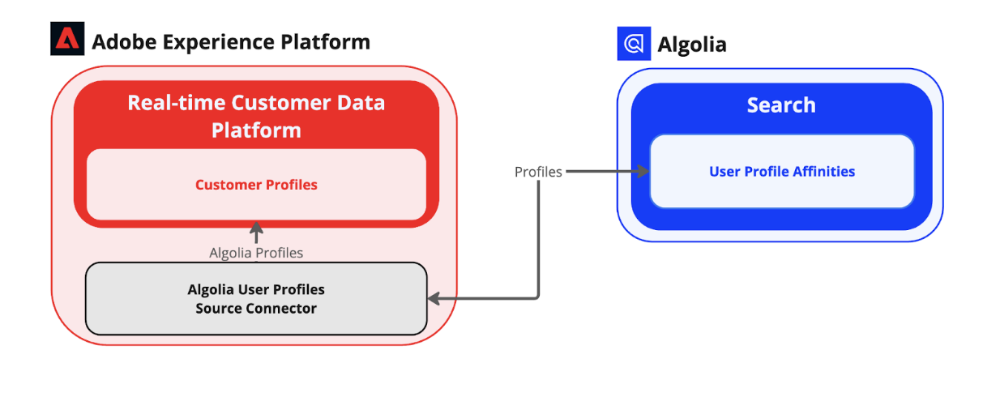

# [!DNL Algolia User Profiles]

[[!DNL Algolia]](https://www.algolia.com/)은(는) 비즈니스에서 빠르고 관련성이 있으며 사용자 정의 가능한 검색 경험을 제공할 수 있는 강력한 검색 및 검색 API 플랫폼입니다. 오타 허용치, 필터링, 페이스팅, AI 기반의 관련성 튜닝과 같은 기능을 통해 실시간 검색 기능을 제공합니다. [!DNL Algolia]은(는) 웹 사이트, 전자 상거래 플랫폼 및 애플리케이션에 대한 고성능 검색 솔루션을 제공하여 기업이 사용자 참여, 전환율 및 전반적인 고객 경험을 개선할 수 있도록 지원합니다.

[!DNL Algolia]의 주요 이점 중 일부는 다음과 같습니다.

* 빠른 검색과 빠른 검색 결과.
* AI에서 제공하는 관련성이 높은 권장 사항입니다.
* 비즈니스 요구 사항의 우선 순위를 지정하는 사용자 정의 가능한 순위입니다.
* 높은 트래픽 로드를 쉽게 처리할 수 있는 확장성.

자세한 내용은 [[!DNL Algolia] 제품 설명서](https://resources.algolia.com/)를 참조하세요.

## 아키텍처

셀프 서비스 소스(일괄 SDK)는 인증, 페이지 매김 또는 전체 및 부분 데이터 풀과 같은 필요한 모든 기능을 제공합니다. [!DNL Algolia User Profiles] 원본은 이러한 기능을 사용하여 통합을 완료합니다.

## 전제 조건 {#prerequisites}

[!DNL Algolia] 계정을 Experience Platform에 연결하려면 먼저 다음 전제 조건 단계를 완료해야 합니다.

1. [[!DNL Algolia] 대시보드](https://dashboard.algolia.com/users/sign_up)를 사용하여 [!DNL Algolia] 계정에 로그인하거나 새 계정을 만드세요.
2. [색인을 준비하세요](https://www.algolia.com/doc/guides/sending-and-managing-data/prepare-your-data/in-depth/prepare-data-in-depth/).
3. [패싯을 설정합니다](https://www.algolia.com/doc/guides/managing-results/refine-results/faceting/).
4. [사용자 이벤트 보내기](https://www.algolia.com/doc/guides/sending-events/getting-started/).
5. [인덱스 개인화](https://www.algolia.com/doc/guides/personalization/advanced-personalization/configure/setup/indices/).

### Experience Platform에 대한 권한 구성

[!DNL Algolia] 계정을 Experience Platform에 연결하려면 계정에 대해 **[!UICONTROL 소스 보기]** 및 **[!UICONTROL 소스 관리]** 권한이 모두 활성화되어야 합니다. 필요한 권한을 얻으려면 제품 관리자에게 문의하십시오. 자세한 내용은 [액세스 제어 UI 안내서](../../../access-control/abac/ui/permissions.md)를 참조하십시오.

### 허용 목록에 추가하다 IP 주소

소스 커넥터를 사용하기 전에 IP 주소 목록을 허용 목록에 추가하다에 추가해야 합니다. 영역별 IP 주소를 허용 목록에 추가하다에 추가하지 않으면 소스를 사용할 때 오류나 성능이 저하될 수 있습니다. 허용 목록에 추가하다 자세한 내용은 [IP 주소](../../ip-address-allow-list.md) 페이지를 참조하십시오.

## [!DNL Algolia] 계정을 Experience Platform에 연결

필수 구성 요소를 완료하면 다음 단계로 이동하여 [계정을 Experience Platform에 연결](../../tutorials/ui/create/data-partners/algolia-user-profiles.md)할 수 있습니다. [!DNL Algolia] 
