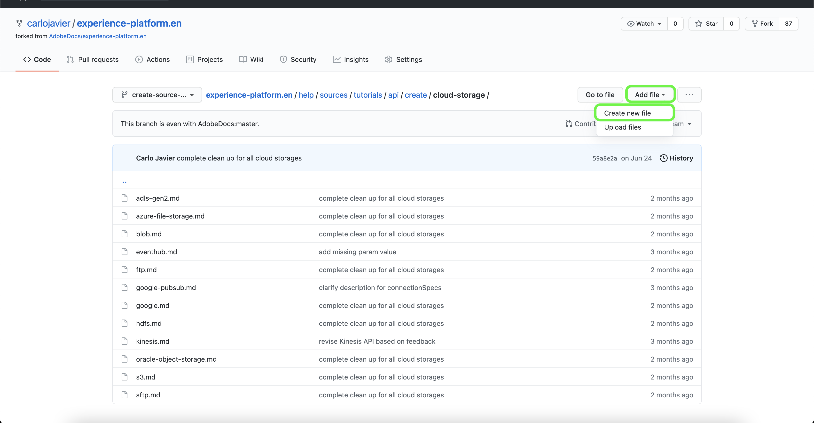

# GitHub 웹 인터페이스를 사용하여 소스 설명서 페이지를 만듭니다

이 문서에서는 GitHub 웹 인터페이스를 사용하여 설명서를 작성하고 끌어오기 요청(PR)을 제출하는 방법에 대해 설명합니다.

>[!TIP]
>
>Adobe 기여 안내서의 다음 문서를 사용하여 설명서 프로세스를 추가로 지원할 수 있습니다. <ul><li>[Git 및 Markdown 작성 도구 설치](https://experienceleague.adobe.com/docs/contributor/contributor-guide/setup/install-tools.html?lang=en)</li><li>[로컬로 설명서를 위한 Git 리포지토리 설정](https://experienceleague.adobe.com/docs/contributor/contributor-guide/setup/local-repo.html?lang=en)</li><li>[주요 변경 사항에 대한 GitHub 기여 워크플로](https://experienceleague.adobe.com/docs/contributor/contributor-guide/setup/full-workflow.html?lang=en)</li></ul>

## GitHub 환경 설정

GitHub 환경을 설정하는 첫 번째 단계는 [Adobe Experience Platform GitHub 리포지토리](https://github.com/AdobeDocs/experience-platform.en).

다음 을 선택합니다. **포크**.

포크가 완료되면 을 선택합니다 **마스터** 표시되는 드롭다운 메뉴에서 새 분기의 이름을 입력합니다. 작업을 포함하는 데 사용될 분기의 수사적 이름을 지정한 다음 을 선택합니다 **분기 생성**.

포크된 리포지토리의 GitHub 폴더 구조에서 다음 위치로 이동합니다. [`experience-platform.en/help/sources/tutorials/api/create/`](https://github.com/AdobeDocs/experience-platform.en/tree/main/help/sources/tutorials/api/create) 그런 다음 목록에서 소스에 대한 적절한 카테고리를 선택합니다. 예를 들어 새 CRM 소스에 대한 설명서를 만드는 경우 **crm**.

>[!TIP]
>
>UI에 대한 설명서를 작성하는 경우 다음 위치로 이동합니다 [`experience-platform.en/help/sources/tutorials/ui/create/`](https://github.com/AdobeDocs/experience-platform.en/tree/main/help/sources/tutorials/ui/create) 그리고 출처에 적합한 카테고리를 선택합니다. 이미지를 추가하려면 다음 위치로 이동합니다 [`experience-platform.en/help/sources/images/tutorials/create/sdk`](https://github.com/AdobeDocs/experience-platform.en/tree/main/help/sources/images/tutorials/create) 그런 다음 스크린샷을 `sdk` 폴더를 입력합니다.

기존 CRM 소스의 폴더가 나타납니다. 새 소스에 대한 설명서를 추가하려면 **파일 추가** 그런 다음 **새 파일 만들기** 표시되는 드롭다운 메뉴에서 을 클릭합니다.

소스 파일의 이름을 지정합니다 `YOURSOURCE.md` 여기서 YOURSOURCE는 Platform의 소스 이름입니다. 예를 들어 회사가 ACME CRM인 경우 파일 이름은 `acme-crm.md`.

## 소스에 대한 설명서 페이지 작성

새 소스 문서화를 시작하려면 [소스 설명서 템플릿](./template.md) ( GitHub 웹 편집기)로 이동하는 것을 참조하십시오. 템플릿을 다운로드할 수도 있습니다 [여기](../assets/api-template.zip).

GitHub 웹 편집기 인터페이스로 복사한 템플릿을 사용하여 템플릿에 설명된 지침을 따르고 소스에 대한 관련 정보가 포함된 값을 편집합니다.

완료되면 분기에 파일을 커밋합니다.

## 검토할 설명서 제출

파일이 커밋되면 끌어오기 요청(PR)을 열어 작업 분기를 Adobe 설명서 저장소의 마스터 분기에 병합할 수 있습니다. 작업 중인 분기가 선택되어 있는지 확인하고 를 선택합니다 **비교 및 가져오기 요청**.

기본 및 비교 분기가 올바른지 확인합니다. PR에 업데이트를 설명하는 메모를 추가하고 을(를) 선택합니다 **가져오기 요청 만들기**. 이렇게 하면 작업의 작업 분기를 Adobe 저장소의 마스터 분기에 병합하는 PR이 열립니다.

>[!TIP]
>
>을(를) 종료하십시오. **유지 관리자의 편집 허용** Adobe 설명서 팀이 PR을 편집할 수 있도록 확인란을 선택했습니다.

이때 Adobe 기여자 라이선스 계약(CLA)에 서명하라는 알림이 표시됩니다. 이것은 필수 단계입니다. CLA에 로그인한 후 PR 페이지를 새로 고침하고 가져오기 요청을 제출합니다.

https://github.com/AdobeDocs/experience-platform.en에서 끌어오기 요청 탭을 검사하여 끌어오기 요청이 제출되었는지 확인할 수 있습니다.

