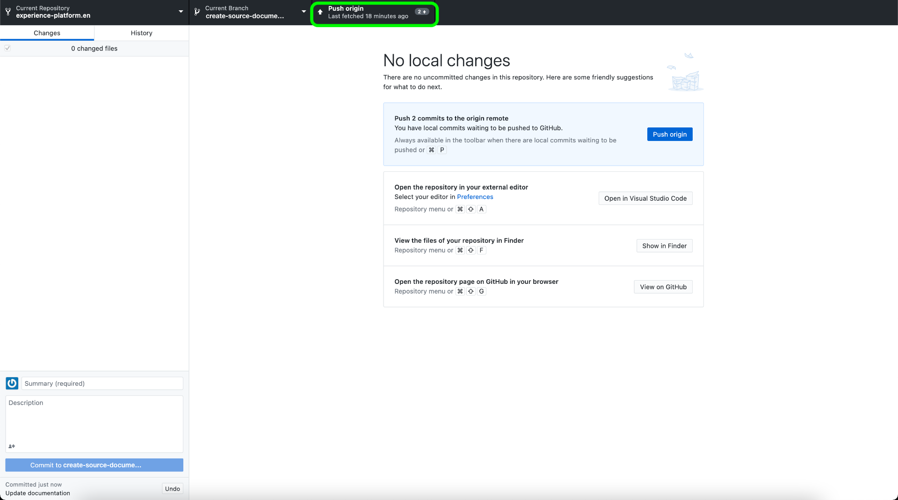
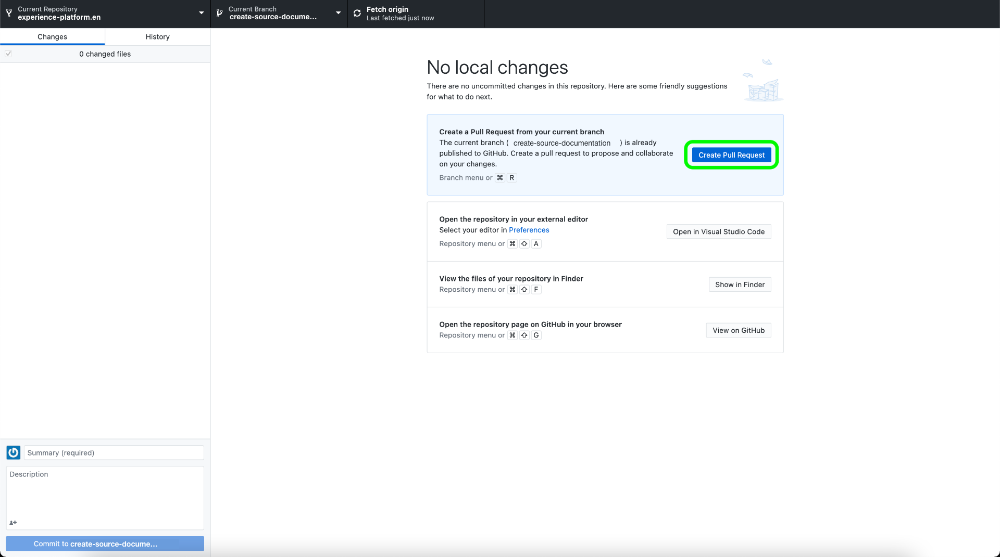
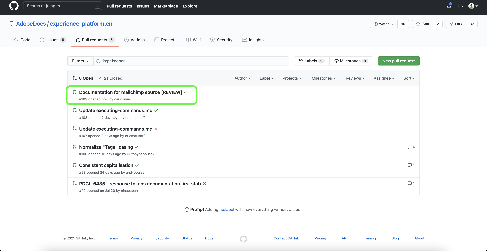

# 로컬 환경에서 텍스트 편집기를 사용하여 소스 설명서 페이지를 만듭니다

이 문서에서는 로컬 환경을 사용하여 소스에 대한 설명서를 작성하고 끌어오기 요청(PR)을 제출하는 방법에 대해 설명합니다.

>[!TIP]
>
>Adobe 기여 안내서의 다음 문서를 사용하여 설명서 프로세스를 추가로 지원할 수 있습니다. <ul><li>[Git 및 Markdown 작성 도구 설치](https://experienceleague.adobe.com/docs/contributor/contributor-guide/setup/install-tools.html?lang=en)</li><li>[로컬로 설명서를 위한 Git 리포지토리 설정](https://experienceleague.adobe.com/docs/contributor/contributor-guide/setup/local-repo.html?lang=en)</li><li>[주요 변경 사항에 대한 GitHub 기여 워크플로](https://experienceleague.adobe.com/docs/contributor/contributor-guide/setup/full-workflow.html?lang=en)</li></ul>

## 전제 조건

다음 자습서에서는 로컬 컴퓨터에 GitHub Desktop이 설치되어 있어야 합니다. GitHub Desktop이 없는 경우 응용 프로그램을 다운로드할 수 있습니다 [여기](https://desktop.github.com/).

## GitHub에 연결하고 로컬 작성 환경을 설정합니다

로컬 작성 환경을 설정하는 첫 번째 단계는 [Adobe Experience Platform GitHub 리포지토리](https://github.com/AdobeDocs/experience-platform.en).

Platform GitHub 리포지토리의 기본 페이지에서 **포크**.

리포지토리를 로컬 시스템에 복제하려면 **코드**. 표시되는 드롭다운 메뉴에서 을(를) 선택합니다 **HTTPS** 그런 다음 **GitHub Desktop을 사용하여 열기**.

>[!TIP]
>
>자세한 내용은 [로컬로 설명서를 위한 Git 리포지토리 설정](https://experienceleague.adobe.com/docs/contributor/contributor-guide/setup/local-repo.html?lang=en#create-a-local-clone-of-the-repository).

다음으로, GitHub Desktop에서 잠시 후에 `experience-platform.en` 저장소.

복제 프로세스가 완료되면 GitHub Desktop으로 이동하여 새 분기를 만듭니다. 선택 **기본** 위쪽 탐색에서 를 선택하고 을 선택합니다. **새 분기**

표시되는 팝업 패널에서 분기의 수사적 이름을 입력한 다음 을 선택합니다 **분기 만들기**.

다음 을 선택합니다. **게시 분기**.

## 소스에 대한 설명서 페이지 작성

로컬 시스템에 복제한 리포지토리와 새로 생성된 분기를 사용하여 이제 를 통해 새 소스에 대한 설명서 페이지 작성을 시작할 수 있습니다. [원하는 텍스트 편집기](https://experienceleague.adobe.com/docs/contributor/contributor-guide/setup/install-tools.html?lang=en#understand-markdown-editors).

Adobe은 [Visual Studio 코드](https://code.visualstudio.com/) Markdown 작성 Adobe 확장을 설치합니다. 확장을 설치하려면 Visual Studio 코드를 실행한 다음 **확장** 탭 을 클릭합니다.

다음을 입력합니다. `Adobe Markdown Authoring` 검색 막대로 이동한 다음 을 선택합니다. **설치** 표시됩니다.

로컬 시스템을 준비하고 있는 경우 [소스 설명서 템플릿](../assets/api-template.zip) 파일을 추출하여 `experience-platform.en/help/sources/tutorials/api/create/...` with [`...`] 선택한 카테고리를 나타냅니다. 예를 들어 데이터베이스 소스를 생성하는 경우 데이터베이스 폴더를 선택합니다.

마지막으로, 템플릿에 설명된 지침에 따라 소스와 관련된 관련 정보가 있는 템플릿을 편집합니다.

## 검토할 설명서 제출

PR(끌어오기 요청)을 만들고 검토를 위해 설명서를 제출하려면 먼저 작업 내용을 저장합니다 [!DNL Visual Studio Code] (또는 선택한 텍스트 편집기) 다음으로, GitHub Desktop을 사용하여 커밋 메시지를 입력하고 을 선택합니다 **create-source-documentation 커밋**.

다음 을 선택합니다. **원본 푸시** 작업을 원격 분기에 업로드합니다.

가져오기 요청을 만들려면 **가져오기 요청 만들기**.

기본 및 비교 분기가 올바른지 확인합니다. PR에 업데이트를 설명하는 메모를 추가하고 을(를) 선택합니다 **가져오기 요청 만들기**. 이렇게 하면 작업의 작업 분기를 Adobe 저장소의 마스터 분기에 병합하는 PR이 열립니다.

>[!TIP]
>
>을(를) 종료하십시오. **유지 관리자의 편집 허용** Adobe 설명서 팀이 PR을 편집할 수 있도록 확인란을 선택했습니다.

https://github.com/AdobeDocs/experience-platform.en에서 끌어오기 요청 탭을 검사하여 끌어오기 요청이 제출되었는지 확인할 수 있습니다.

