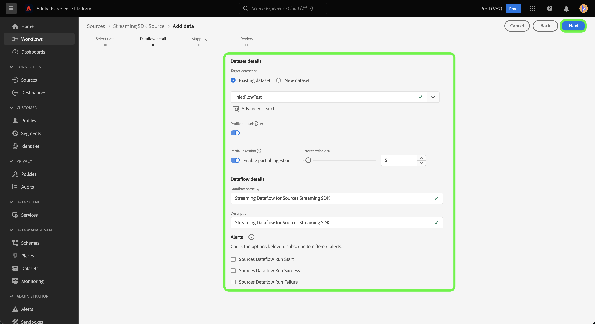

# UI를 사용하여 *YOURSOURCE* 데이터를 스트리밍할 소스 연결 및 데이터 흐름을 만드십시오.

*이 서식 파일을 사용할 때 이탤릭체로 된 모든 단락을 바꾸거나 삭제합니다(이 단락부터 시작).*

*페이지 맨 위에 있는 메타데이터(제목 및 설명)를 업데이트하여 시작합니다. 이 페이지에서 UICONTROL의 모든 인스턴스를 무시하십시오. 이것은 기계 번역 프로세스가 페이지를 지원하는 여러 언어로 올바르게 번역할 수 있도록 도와주는 태그입니다. 문서를 제출하면 문서에 태그를 추가합니다.*

이 자습서에서는 Experience Platform 사용자 인터페이스를 사용하여 *YOURSOURCE* 소스 커넥터를 만드는 단계를 제공합니다.

## 개요

*고객에게 제공하는 가치를 포함하여 회사에 대한 간략한 개요를 제공합니다. 자세한 내용을 보려면 제품 설명서 홈 페이지에 대한 링크를 포함하십시오.*

>[!IMPORTANT]
>
>이 원본 커넥터 및 문서 페이지는 *YOURSOURCE* 팀에서 만들고 유지 관리합니다. 문의 사항이나 업데이트 요청이 있으면 *링크 또는 이메일 주소 삽입*&#x200B;을 통해 직접 연락하십시오.

## 전제 조건

*Adobe Experience Platform 사용자 인터페이스에서 소스 설정을 시작하기 전에 고객이 알아야 할 사항에 대한 정보를 이 섹션에 추가합니다. 이 값은*&#x200B;일 수 있습니다.

* *허용 목록에 추가해야 함*
* *전자 메일 해시에 대한 요구 사항*
* *모든 계정 세부 정보*
* *플랫폼에 연결할 인증 자격 증명을 얻는 방법*

### 필요한 자격 증명 수집

*YOURSOURCE*&#x200B;을(를) Experience Platform에 연결하려면 다음 연결 속성에 대한 값을 제공해야 합니다.

| 자격 증명 | 설명 | 예 |
| --- | --- | --- |
| *자격 증명 원* | *여기에서 원본의 인증 자격 증명에 대한 간단한 설명을 추가하십시오.* | *여기에 원본의 인증 자격 증명의 예제를 추가하십시오* |
| *자격 증명 2* | *여기에서 원본의 인증 자격 증명에 대한 간단한 설명을 추가하십시오.* | *여기에 원본의 인증 자격 증명의 예제를 추가하십시오* |
| *자격 증명 3* | *여기에서 원본의 인증 자격 증명에 대한 간단한 설명을 추가하십시오.* | *여기에 원본의 인증 자격 증명의 예제를 추가하십시오* |

이러한 자격 증명에 대한 자세한 내용은 *YOURSOURCE* 인증 설명서를 참조하십시오. *여기에서 플랫폼의 인증 설명서에 대한 링크를 추가하십시오*.

### *YOURSOURCE*&#x200B;을(를) Webhook과 통합

*SDK을 스트리밍하려면 소스에서 웹후크를 지원하여 Experience Platform과 통신해야 합니다. 이 단원에서는 YOURSOURCE를 Webhook과 통합하기 위해 사용자가 따라야 할 단계를 제공해야 합니다.*

## *YOURSOURCE* 계정 연결

Experience Platform UI의 왼쪽 탐색 모음에서 **[!UICONTROL 소스]**&#x200B;를 선택하여 [!UICONTROL 소스] 작업 영역에 액세스합니다. [!UICONTROL 카탈로그] 화면에 계정을 만들 수 있는 다양한 소스가 표시됩니다.

화면 왼쪽에 있는 카탈로그에서 적절한 카테고리를 선택할 수 있습니다. 또는 검색 옵션을 사용하여 작업할 특정 소스를 찾을 수 있습니다.

**스트리밍** 범주에서 *YOURSOURCE*&#x200B;을(를) 선택한 다음 **[!UICONTROL 데이터 추가]**&#x200B;를 선택합니다.

>[!TIP]
>
>아래에 사용된 스크린샷은 예입니다. 설명서를 만들 때 이미지를 실제 소스의 스크린샷으로 바꾸십시오. 동일한 파일 이름뿐만 아니라 동일한 마크업 패턴 및 색상을 사용할 수 있습니다. 스크린샷에 전체 Experience Platform UI 화면이 캡처되는지 확인하십시오. 스크린샷을 업로드하는 방법에 대한 자세한 내용은 [검토할 문서 제출](../documentation/github.md)에 대한 안내서를 참조하십시오.

## 데이터 선택

Experience Platform으로 가져올 데이터를 선택할 수 있는 인터페이스를 제공하는 **[!UICONTROL 데이터 선택]** 단계가 나타납니다.

* 인터페이스의 왼쪽 부분은 계정 내에서 사용 가능한 데이터 스트림을 볼 수 있는 브라우저입니다.
* 인터페이스의 오른쪽 부분에서 JSON 파일에서 최대 100개의 데이터 행을 미리 볼 수 있습니다.

로컬 시스템에서 JSON 파일을 업로드하려면 **[!UICONTROL 파일 업로드]**&#x200B;를 선택하십시오. 또는 업로드할 JSON 파일을 [!UICONTROL 파일 끌어다 놓기] 패널로 끌어다 놓을 수 있습니다.

파일이 업로드되면 미리보기 인터페이스가 업데이트되어 업로드한 스키마의 미리보기가 표시됩니다. 미리보기 인터페이스를 사용하여 파일의 내용과 구조를 검사할 수 있습니다. [!UICONTROL 검색 필드] 유틸리티를 사용하여 스키마 내의 특정 항목에 액세스할 수도 있습니다.

완료되면 **[!UICONTROL 다음]**&#x200B;을 선택합니다.

## 데이터 흐름 세부 정보

**데이터 흐름 세부 정보** 단계가 표시되어 기존 데이터 집합을 사용하거나 데이터 흐름의 새 데이터 집합을 설정하는 옵션을 제공하고 데이터 흐름의 이름과 설명을 제공할 수 있습니다. 이 단계에서는 프로필 수집, 오류 진단, 부분 수집 및 경고에 대한 설정을 구성할 수도 있습니다.

완료되면 **[!UICONTROL 다음]**&#x200B;을 선택합니다.

## 매핑

소스 스키마의 소스 필드를 대상 스키마의 해당 대상 XDM 필드에 매핑할 수 있는 인터페이스를 제공하는 [!UICONTROL 매핑] 단계가 나타납니다.

Experience Platform은 선택한 대상 스키마 또는 데이터 세트를 기반으로 자동 매핑된 필드에 대한 지능형 권장 사항을 제공합니다. 사용 사례에 맞게 매핑 규칙을 수동으로 조정할 수 있습니다. 필요에 따라 필드를 직접 매핑하도록 선택하거나 데이터 준비 함수를 사용하여 소스 데이터를 변환하여 계산된 값 또는 계산된 값을 파생할 수 있습니다. 매퍼 인터페이스 및 계산된 필드 사용에 대한 포괄적인 단계는 [데이터 준비 UI 안내서](https://experienceleague.adobe.com/docs/experience-platform/data-prep/ui/mapping.html)를 참조하십시오.

원본 데이터가 성공적으로 매핑되면 **[!UICONTROL 다음]**&#x200B;을(를) 선택하십시오.

## 검토

새 데이터 흐름을 만들기 전에 검토할 수 있는 **[!UICONTROL 검토]** 단계가 나타납니다. 세부 사항은 다음 범주 내에서 그룹화됩니다.

* **[!UICONTROL 연결]**: 원본 형식, 선택한 원본 파일의 관련 경로 및 해당 원본 파일에 있는 열의 양을 표시합니다.
* **[!UICONTROL 데이터 집합 및 맵 필드 할당]**: 데이터 집합이 준수하는 스키마를 포함하여 소스 데이터가 수집되는 데이터 집합을 표시합니다.

데이터 흐름을 검토한 후 **[!UICONTROL 완료]**&#x200B;를 클릭하고 데이터 흐름이 만들어지도록 잠시 기다립니다.

## 스트리밍 끝점 URL 가져오기

스트리밍 데이터 흐름이 만들어지면 이제 스트리밍 끝점 URL을 검색할 수 있습니다. 이 끝점은 Webhook에 가입하는 데 사용되며 스트리밍 소스에서 Experience Platform과 통신할 수 있습니다.

스트리밍 끝점을 검색하려면 방금 만든 데이터 흐름의 [!UICONTROL 데이터 흐름 활동] 페이지로 이동한 다음, [!UICONTROL 속성] 패널 아래쪽에서 끝점을 복사합니다.

## 다음 단계

데이터 흐름을 만드는 나머지 단계에 대한 *워크플로가 모듈화되었습니다. 소스에 대해 수행할 특정 콜아웃이 있는 경우 아래의 추가 리소스 섹션을 참조하십시오.*

이 자습서를 따라 *YOURSOURCE* 계정에 대한 연결을 설정했습니다. 이제 다음 자습서를 계속 진행하고 [데이터를 Experience Platform으로 가져오도록 데이터 흐름을 구성](https://experienceleague.adobe.com/docs/experience-platform/sources/ui-tutorials/dataflow/crm.html)할 수 있습니다.

## 추가 리소스

*제품 설명서나 고객이 성공하기 위해 중요하다고 생각하는 다른 단계, 스크린샷, 뉘앙스에 대한 추가 링크를 제공할 수 있는 선택적 섹션입니다. 이 섹션을 사용하여 원본의 전체 워크플로에 대한 정보 또는 팁을 추가할 수 있습니다. 특히 최종 사용자에게 표시될 수 있는 특정 &quot;gotchas&quot;가 있는 경우에 유용합니다.*
